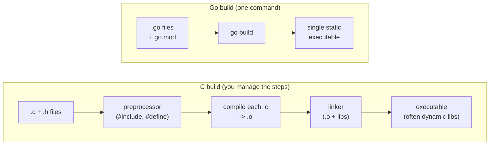

# Chapter 1 — Why Go for a C Programmer

> **What you'll learn.** Why Go was created, how its philosophy compares to C's,
> exactly what Go removes and adds relative to C, and how to read and run your
> first Go program. By the end you will understand the *shape* of a Go program and
> why it looks the way it does.

## Where Go comes from

Go was created at Google around 2007 by Robert Griesemer, Rob Pike, and Ken
Thompson. Those last two names matter to a C programmer: **Ken Thompson co-created
Unix and the B language (C's ancestor), and Rob Pike was a long-time Unix and
systems person.** Go is what experienced C and C++ programmers built when they got
to start over.

They had three complaints about large C++ codebases:

1. **Builds were slow.** A big C/C++ program could take many minutes to compile,
   largely because of how header files (`#include`) are re-parsed again and again.
2. **The language was huge and complex.** C++ had grown many features; reading
   someone else's code was hard.
3. **Concurrency was painful.** Threads, locks, and callbacks were bolted on by
   libraries, not designed into the language.

Go is the answer to those three pains: **fast compiles, a small simple language,
and concurrency built in** — while staying a *compiled, statically typed, native*
language like C, not an interpreted one like Python.

> **Mental model.** Go is "C for the network age": compiled to a native binary,
> statically typed, and close to the machine — but with garbage collection, a huge
> standard library, and concurrency as a first-class feature.

## The Go philosophy (and how it differs from C's)

C's philosophy is "trust the programmer": the language is small and gives you
sharp tools, including ones you can cut yourself with (undefined behavior, manual
memory, pointer arithmetic).

Go's philosophy is "**simplicity and one obvious way**." The designers removed
features on purpose. Some things that exist in C/C++ are deliberately *missing*
from Go, because leaving them out makes large codebases easier to read and safer.

| Topic | C | Go |
|---|---|---|
| Language size | Small core, but undefined behavior everywhere | Small core, defined behavior, few surprises |
| Who frees memory | You do (`malloc`/`free`) | A garbage collector does |
| Pointer arithmetic | Yes | **No** (use slices to walk memory) |
| Header files / preprocessor | Yes (`#include`, `#define`) | **None** (packages instead) |
| Build system | You write Makefiles | Built in (`go build`) |
| Formatting style | Up to you / the team | One official style (`gofmt`) |
| Error handling | Return codes / `errno` | `error` values, checked explicitly |
| Concurrency | Library (pthreads) | Language (`go`, channels) |
| Generics | Macros / `void *` | Real generics (since Go 1.18) |
| Compile speed | Often slow on big projects | Very fast |

> **Watch out.** Go's simplicity is sometimes *frustrating* at first. There is no
> `while`, no `?:` ternary, no exceptions, and (until recently) no generics. This
> is intentional. The payoff is that almost all Go code looks and reads the same,
> which matters enormously on a team.

## What Go removes (the relief)

Coming from C, you get to stop doing several tedious or dangerous things:

- **Manual memory management.** No `malloc`/`free`, no "who owns this pointer?",
  no use-after-free, no double-free, no leak hunts with Valgrind. (Chapter 17)
- **Pointer arithmetic and buffer overruns.** You index slices, which know their
  own length and are bounds-checked. A huge class of CVEs simply cannot happen.
- **Header files and the preprocessor.** No `#include`, no include guards, no
  `#define` macros, no separate declaration and definition. (Chapter 3)
- **Makefiles for building.** `go build` understands your project from the imports.
- **Most undefined behavior.** Integer sizes are fixed, evaluation order is
  defined, and uninitialized variables get a defined *zero value* instead of
  garbage.

## What Go adds (the new tools)

In exchange, Go gives you features that C does not have built in:

- **Garbage collection (GC).** Memory is freed automatically. (Chapter 17)
- **Goroutines and channels.** Cheap concurrency: `go f()` starts a lightweight
  thread; channels pass values between them safely. (Chapters 13–16)
- **Slices, maps, and strings as first-class types.** Dynamic arrays, hash maps,
  and UTF-8 strings are built into the language, not bolted on. (Chapters 8–9)
- **Interfaces.** Type-safe polymorphism without inheritance. (Chapter 11)
- **A rich standard library.** HTTP servers, JSON, crypto, compression, and more
  ship with the language. You can build a real web service with zero dependencies.
- **One integrated tool.** `go` builds, tests, formats, vets, fetches
  dependencies, and more. (Chapter 2)

## Your first program: "Hello, World"

Here it is in C and in Go, side by side.

```c
/* hello.c — compile: cc hello.c -o hello && ./hello */
#include <stdio.h>

int main(void) {
    printf("Hello, World\n");
    return 0;
}
```

```go
// hello.go — run: go run hello.go
package main

import "fmt"

func main() {
    fmt.Println("Hello, World")
}
```

Line by line, with the C version as our reference:

- `package main` — Every Go file belongs to a *package* (a named group of files).
  The special package `main` means "this builds into a runnable program," and its
  `main` function is the entry point. There is no equivalent line in C; the file
  just *is* the translation unit.
- `import "fmt"` — Bring in the `fmt` ("format") package from the standard library,
  Go's rough equivalent of `<stdio.h>`. But notice: **you import a package, not a
  header file.** There is no separate declaration to keep in sync.
- `func main() { ... }` — A function named `main` that takes nothing and returns
  nothing. Note the keyword `func` and that the **type comes after the name**
  (more on that in Chapter 4). Unlike C, `main` does not return `int`; to exit with
  a status code you call `os.Exit(code)`.
- `fmt.Println("Hello, World")` — Call the `Println` ("print line") function from
  the `fmt` package. It adds the newline for you. The capital `P` in `Println`
  means the function is *exported* (public) — a rule we'll meet in Chapter 3.

> **Watch out.** Go is strict in ways C is not. An **unused import** or an **unused
> local variable** is a *compile error*, not a warning. This feels harsh on day one
> and wonderful by week two: dead code never accumulates.

Run it without a separate compile step:

```sh
go run hello.go        # compiles to a temp binary and runs it
```

Or build a real, standalone binary (like `cc -o`):

```sh
go build hello.go      # produces ./hello, a single static executable
./hello
```

That binary is **statically linked** by default: it has no external `.so`
dependencies and will run on another machine of the same OS/architecture with
nothing else installed. This is one of Go's most loved features for shipping
software.

## A slightly bigger taste

This program shows a few Go ideas at once: a slice (dynamic array), a `for`/`range`
loop, multiple return values, and the zero value. Read the comments; we cover each
in detail later.

```go
package main

import "fmt"

// sum returns the total and the count of the numbers passed in.
// Note: TWO return values. This is normal and idiomatic in Go.
func sum(nums []int) (total int, count int) {
    for _, n := range nums { // range yields index, value; we ignore the index with _
        total += n
    }
    return total, len(nums)
}

func main() {
    nums := []int{3, 1, 4, 1, 5, 9} // a slice literal; no size, no malloc
    total, count := sum(nums)
    fmt.Printf("sum=%d count=%d avg=%.2f\n", total, count, float64(total)/float64(count))
}
```

Things to notice compared to C:

- `nums := []int{...}` declares **and** initializes a slice. The `:=` operator means
  "declare a new variable and infer its type." No size, no `malloc`, no `free`.
- `range` walks the slice and gives you each `(index, value)` pair. The blank
  identifier `_` throws away the index we don't use.
- `sum` returns **two values**. The caller receives both with
  `total, count := sum(nums)`.
- `float64(total)` is an **explicit conversion**. Go will not divide an `int` by an
  `int` and silently give you a float, nor mix `int` and `float64`. You convert on
  purpose.

## How a Go program is built and run

A C build has phases you manage: preprocess, compile each `.c` to an object file,
then link the objects and libraries into a binary. In Go, the `go` tool does all of
this from your imports — there is nothing to wire up by hand.



The same idea as a plain-text diagram (this is the ASCII style you'll see when a
picture is overkill):

```
C:   source ──▶ preprocess ──▶ compile (.o) ──▶ link ──▶ a.out  (you script this)
Go:  source ─────────────────  go build  ─────────────▶ binary  (one step)
```

A few practical consequences:

- **Fast compiles.** Go does not re-parse headers for every file, and it tracks
  dependencies precisely, so even large projects build in seconds.
- **Easy cross-compilation.** Set two environment variables and you get a binary
  for another OS/CPU, no cross-toolchain to install:

  ```sh
  GOOS=linux GOARCH=arm64 go build -o myapp .   # build a Linux/arm64 binary on a Mac
  ```

- **One binary to ship.** No "install these libraries first." Copy the file and run.

## Is Go fast? (an honest answer)

Go compiles to **native machine code**, like C. It is much faster than interpreted
languages (Python, Ruby) and usually within a small factor of C for typical server
and tool workloads. Programs start instantly and use memory predictably.

The trade-offs versus C:

- **Garbage collection** adds small, occasional pauses (usually well under a
  millisecond in modern Go) and uses some extra memory. For servers and tools this
  is a great deal; for hard real-time control loops it can matter. (Chapter 17)
- **Bounds checking** on slice access costs a tiny amount, which the compiler often
  removes when it can prove the index is safe.
- You give up the absolute lowest-level control (no manual memory layout tricks
  without the `unsafe` package, which you rarely need).

> **Rule of thumb.** If you would have reached for C, C++, or a scripting language
> to write a **network service, a CLI tool, or a systems daemon**, Go is very often
> the better default in 2026: nearly C-like speed, far fewer footguns, and you ship
> a single binary.

## When *not* to choose Go

Be honest about the edges. Go is a poor fit when you need:

- **Hard real-time guarantees** or sub-microsecond, jitter-free control (GC pauses,
  however small, are still pauses).
- **Tiny embedded targets** (a few KB of RAM, no OS) — that is still C's domain
  (though TinyGo exists for some microcontrollers).
- **Manual control of memory layout and lifetime** down to the byte for a
  performance-critical kernel or allocator — C, C++, or Rust fit better.
- **A large existing C/C++ codebase** you must extend in place (though Go can call C
  via `cgo` when needed).

For almost everything else a backend or infrastructure engineer does day to day —
APIs, microservices, CLIs, network daemons, data pipelines, DevOps tooling — Go is
an excellent, productive choice. That is why Docker, Kubernetes, Prometheus,
Terraform, and much of modern cloud infrastructure are written in Go.

## Key takeaways

- Go was made by C/Unix veterans to fix three pains: slow builds, language
  complexity, and bolted-on concurrency.
- Go keeps C's good parts (compiled, statically typed, native, close to the
  machine) and removes the dangerous, tedious parts (manual memory, pointer
  arithmetic, headers, undefined behavior).
- In return you get garbage collection, goroutines/channels, slices/maps/strings,
  interfaces, a big standard library, and one integrated `go` tool.
- A Go program is a set of *packages*; `package main` with a `main` function builds
  into a single, statically linked binary.
- `go run` runs code directly; `go build` produces a standalone executable.

## Watch out (gotchas for C programmers)

- **Unused imports and unused local variables are compile errors**, not warnings.
- **`main` does not return `int`.** Use `os.Exit(code)` to set an exit status.
- **No implicit numeric conversions.** `float64(x)` and friends are required.
- The minimalism (no `while`, no ternary, no exceptions) is intentional; do not
  fight it.

## Interview questions

**Q: Why was Go created, and what problems does it solve?**
A: To address slow build times, language complexity, and awkward concurrency in
large C++ codebases at Google. It provides fast compilation, a small and readable
language, built-in concurrency (goroutines and channels), garbage collection, and a
rich standard library, while remaining a compiled, statically typed, native
language.

**Q: How is Go different from C in terms of memory management?**
A: C requires manual `malloc`/`free` and has pointer arithmetic. Go uses a garbage
collector to free memory automatically and forbids pointer arithmetic, eliminating
whole classes of bugs (use-after-free, double-free, buffer overruns from pointer
math). You still use pointers, but you do not manage lifetimes by hand.

**Q: What does it mean that Go produces a "statically linked binary," and why is
that useful?**
A: By default `go build` bundles the runtime and all Go dependencies into one
executable with no external shared-library requirements. You can copy that single
file to another machine of the same OS/architecture and run it with nothing else
installed — which makes deployment and containerization very simple.

**Q: Name two things Go deliberately leaves out that C or C++ has, and why.**
A: Examples: pointer arithmetic (removed to prevent memory-safety bugs), the
preprocessor/header files (replaced by packages to speed builds and avoid
declaration drift), exceptions (replaced by explicit `error` values for clearer
control flow), and implicit numeric conversions (removed to prevent silent bugs).

## Try it

1. Save the "Hello, World" program and run it with `go run hello.go`.
2. Then `go build hello.go` and inspect the binary: `file ./hello` and `ls -lh
   ./hello`. Notice it is a native executable of a few megabytes (that size is the
   Go runtime baked in).
3. Cross-compile it for Linux: `GOOS=linux GOARCH=amd64 go build -o hello-linux
   hello.go`, then run `file ./hello-linux` to confirm the target.
