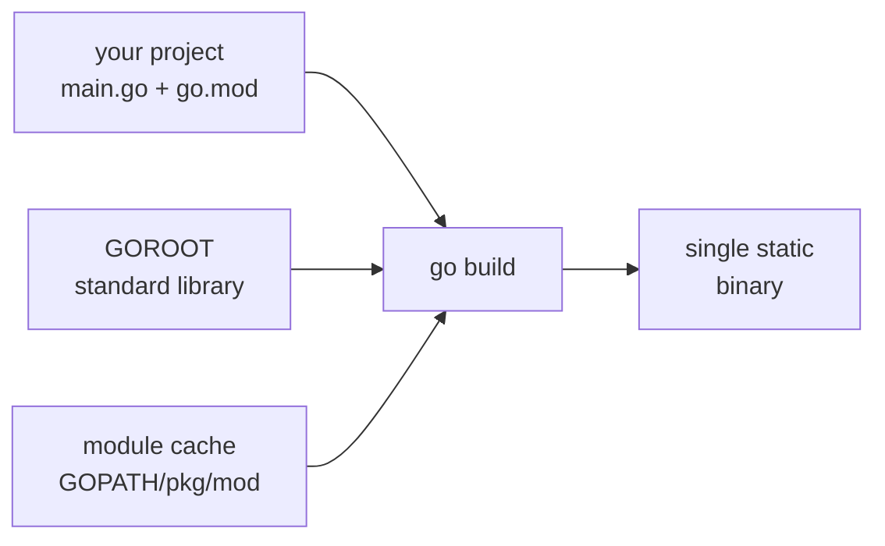

# Chapter 2 — Installing Go and the `go` Command

> **What you'll learn.** How to install Go and verify it, where Go keeps its
> files (GOROOT, the module cache, GOBIN), and a complete tour of the `go`
> command — `run`, `build`, `install`, `test`, `fmt`, `vet`, `mod`, `get`,
> `work`, `env`, `doc`, and the rest — each with a one-line purpose and a real
> example.

In C, the toolchain is a kit of separate parts you assemble yourself: a compiler
(`gcc`/`clang`), a linker (`ld`), a build driver (`make`), a formatter
(`clang-format`), a static checker, and some way to manage libraries. You wire
them together with a `Makefile`.

Go ships **one** program — `go` — that does all of that. There is no `Makefile`,
no separate formatter to install, no dependency manager to bolt on. Learning the
subcommands of `go` is most of what "learning the Go toolchain" means.

## Installing Go

Pick one of these. All of them give you the same `go` command.

**Homebrew (macOS or Linux).** The simplest path if you already use Homebrew:

```sh
brew install go
```

**Official installer (macOS / Windows).** Download the `.pkg` (macOS) or `.msi`
(Windows) from <https://go.dev/dl/> and run it. It installs Go and adds it to
your `PATH`.

**Official tarball (Linux).** Download, remove any old install, and unpack into
`/usr/local`:

```sh
curl -LO https://go.dev/dl/go1.26.4.linux-amd64.tar.gz
sudo rm -rf /usr/local/go
sudo tar -C /usr/local -xzf go1.26.4.linux-amd64.tar.gz
export PATH=$PATH:/usr/local/go/bin   # add this line to ~/.profile or ~/.bashrc
```

Then verify the install:

```sh
go version
# go version go1.26.4 darwin/arm64
```

That single line tells you the toolchain version (`go1.26.4`) and the host
platform (`darwin/arm64` — macOS on Apple silicon). If `go version` prints a
version, you are done; there is nothing else to configure to start building.

> **Deep dive.** Since Go 1.21 the toolchain can manage *itself*: if a project's
> `go.mod` asks for a newer Go than you have, the `go` command downloads and runs
> that exact version automatically. `GOTOOLCHAIN` controls this (`auto` by
> default; `local` forbids downloads). This is why teams no longer argue over
> "which Go version is everyone on."

## Where Go keeps its files: GOROOT, GOPATH, GOBIN

Three locations matter. You usually do not set any of them by hand, but you must
know what they are.

- **GOROOT** is where Go *itself* lives: the compiler, the linker, the runtime,
  and the **standard library** source. On this machine it is
  `/opt/homebrew/Cellar/go/1.26.4/libexec`. The `go` tool finds this on its own.
  Think of it as the rough equivalent of `/usr/lib/gcc/...` plus the system
  headers in `/usr/include` — the parts that come *with* the compiler.

- **GOPATH** defaults to `$HOME/go`. Its modern job is to be a **cache and bin
  directory**, not a place for your source:
  - `$GOPATH/pkg/mod` — the **module cache**: the downloaded source of every
    third-party dependency, shared across all your projects.
  - `$GOPATH/bin` — where `go install` puts the executables it builds.

- **GOBIN** is where `go install` writes binaries. If it is empty (the common
  case), binaries go to `$GOPATH/bin`. Put that directory on your `PATH` so the
  tools you install are runnable:

  ```sh
  export PATH=$PATH:$(go env GOPATH)/bin
  ```

> **Watch out.** Old tutorials (pre-2018) say your code *must* live under
> `$GOPATH/src/...`. **That is no longer true.** Since Go modules (Go 1.11), your
> project can live in any directory you like; GOPATH is now just the cache and
> bin location. If a guide tells you to `mkdir -p $GOPATH/src/...`, ignore it.

> **C vs Go.** GOROOT is like your compiler's own install tree (`/usr/lib/gcc`,
> `/usr/include`). The module cache (`$GOPATH/pkg/mod`) is like `/usr/include` and
> `/usr/lib` for *third-party* code — but per-user, versioned, and filled
> automatically instead of by `apt install libfoo-dev`.

Here is how the pieces fit together when you build:



The same idea as a plain-text map of the filesystem:

```
GOROOT  /opt/.../go/...           <- the compiler, runtime, and std library
GOPATH  ~/go
        ├── pkg/mod/...           <- downloaded dependencies (the module cache)
        └── bin/...               <- binaries from `go install`  (put on PATH)
GOCACHE ~/Library/Caches/go-build <- compiled object cache (speeds up builds)

your code:  ~/projects/myapp/     <- ANYWHERE; just needs a go.mod
            ├── go.mod
            └── *.go
```

`go build` reads the `import` lines in your `.go` files, pulls the standard
library from GOROOT and any dependencies from the module cache, and links
everything into one binary. You never list those inputs in a `Makefile`; the
imports *are* the build description.

## The one tool: an overview

Every command below is a subcommand of `go`. Here is the whole map; the rest of
the chapter explains each one with an example.

| Command | One-line purpose |
|---|---|
| `go run` | Compile and run in one step (no binary left behind). |
| `go build` | Compile to a binary (or just check that code compiles). |
| `go install` | Compile and install a binary into `GOBIN`. |
| `go test` | Build and run tests and benchmarks. |
| `go fmt` / `gofmt` | Reformat code to the one official style. |
| `go vet` | Report suspicious code the compiler still accepts. |
| `go mod` | Manage the module file (`init`, `tidy`, `download`, …). |
| `go get` | Add, upgrade, or remove a dependency in `go.mod`. |
| `go work` | Manage a multi-module workspace. |
| `go env` | Read and set the toolchain's configuration. |
| `go doc` | Show documentation in the terminal. |
| `go list` | List packages or modules and their metadata. |
| `go clean` | Remove build artifacts and caches. |
| `go version` | Print the Go version (of the tool or of a binary). |
| `go generate` | Run code generators marked in source. |
| `go tool` | Run lower-level tools (`pprof`, `trace`, `objdump`, …). |

## Running and building: `run`, `build`, `install`

**`go run`** compiles your code to a temporary binary, runs it, and throws the
binary away. It is for quick iteration, like running a script.

```sh
go run .            # build and run the package in the current directory
go run ./cmd/server # build and run the package at that path
go run main.go      # also works for a single file
```

**`go build`** compiles and produces a binary, but does **not** run it. This is
the closest match to `cc -o app *.c`.

```sh
go build .              # build current package; exe named after the directory
go build -o myapp .     # choose the output name explicitly (like cc -o)
go build ./cmd/server   # build a specific package
```

The default executable name is the *directory* name (so a `main` package in
`~/projects/myapp` builds to `./myapp`). Use `-o` to pick another name or output
directory.

The pattern **`./...`** means "this package and every package below it." It is
the idiom for "do this to the whole project":

```sh
go build ./...   # compile every package in the module
```

> **Watch out.** When `./...` matches **more than one** package, `go build`
> compiles them only to *check that they build* and writes **no** executables.
> When it matches a single `main` package, it does write the binary. So
> `go build ./...` in a multi-package project is a fast "does everything still
> compile?" check, not a way to collect all your binaries — use `go install`
> for that.

**`go install`** compiles a `main` package and copies the resulting binary into
`GOBIN` (or `$GOPATH/bin`), so it lands on your `PATH`.

```sh
go install .    # build the current command and put it on your PATH
```

`go install` is also how you install **command-line tools** written in Go. Give
it a package path with a version suffix (`@latest`, `@v1.2.3`):

```sh
go install golang.org/x/tools/cmd/stringer@latest
go install honnef.co/go/tools/cmd/staticcheck@latest
```

The `pkg@version` form builds in isolation: it ignores your project's `go.mod`,
so installing a tool never changes your project's dependencies.

> **C vs Go.** `go run` is "compile-and-run" with nothing left over — there is no
> equivalent single C command; you would script `cc x.c -o /tmp/x && /tmp/x`.
> `go build` is `cc -o`. `go install` is roughly `cc -o tool && cp tool
> ~/bin/` — build and place it where the shell can find it.

**`go test`** builds and runs the tests in the current packages. We cover it in
depth in Chapter 21 — Testing; the one line to remember now is:

```sh
go test ./...   # run all tests in the project
```

## Formatting and checking: `gofmt`, `go fmt`, `go vet`

Go has exactly one official source format, and a tool that applies it. Style
debates simply do not happen.

**`gofmt`** reformats Go source: tabs for indentation, consistent spacing, braces
on the same line.

```sh
gofmt -l .      # -l: just LIST files that are not formatted (good for CI)
gofmt -w .      # -w: rewrite files in place
```

**`go fmt`** is a thin wrapper that runs `gofmt -l -w` on whole packages, taking
package patterns instead of file paths:

```sh
go fmt ./...    # format every package in the project
```

**`go vet`** is a static analyzer. It reports code that compiles but is probably
wrong: a `Printf` format string that does not match its arguments, a struct tag
with a typo, a lock copied by value, an unreachable statement, and more.

```sh
go vet ./...
```

> **C vs Go.** `gofmt` is `clang-format`, except there is nothing to configure —
> one style for the whole language. `go vet` is the compiler's `-Wall -Wextra`
> plus a linter, but it ships in the box. Run both before every commit; most
> teams enforce them in CI.

## Dependencies and modules: `go mod`, `go get`, `go work`

A **module** is a collection of packages versioned together, described by a
`go.mod` file at its root. (Modules and `go.sum` are covered fully in Chapter 18
— Packages and Modules; here we focus on the commands.)

**`go mod`** manages that file. Its subcommands:

| Subcommand | What it does | Example |
|---|---|---|
| `init` | Create a new `go.mod` for this project. | `go mod init example.com/myapp` |
| `tidy` | Add missing requirements, drop unused ones, fix `go.sum`. | `go mod tidy` |
| `download` | Pre-download modules into the cache. | `go mod download` |
| `verify` | Check cached modules match `go.sum` (not tampered). | `go mod verify` |
| `why` | Explain why a package is in your build. | `go mod why golang.org/x/text` |
| `graph` | Print the full module dependency graph. | `go mod graph` |
| `edit` | Edit `go.mod` from a script (no text editor). | `go mod edit -go=1.26` |

The two you will type most are `init` (once per project) and `tidy` (after you
add or remove imports):

```sh
mkdir myapp && cd myapp
go mod init example.com/myapp   # creates go.mod
# ... write code that imports things ...
go mod tidy                     # sync go.mod/go.sum with your imports
```

**`go get`** changes your dependencies. Since Go 1.17 its job is *only* to edit
the module requirements in `go.mod` and download source — it **no longer builds
or installs binaries** (that moved to `go install`).

```sh
go get example.com/pkg            # add it (or move to its latest version)
go get example.com/pkg@v1.4.2     # pin an exact version
go get -u ./...                   # upgrade dependencies to newer minor/patch
go get example.com/pkg@none       # remove the dependency
```

> **Watch out.** If you learned Go years ago, `go get` used to download *and*
> install a tool into your `bin`. That is gone. Today: **`go get` = manage
> dependencies in `go.mod`; `go install pkg@version` = install a tool.** Mixing
> these up is the single most common command-line confusion for returning users.

**`go work`** sets up a **workspace**: a way to develop several modules at once
without publishing them or editing each `go.mod`. Use it when you are changing a
library and an app that depends on it side by side.

```sh
go work init ./app ./lib   # create go.work listing two local modules
go work use ./tool         # add another local module to the workspace
```

With a `go.work` file present, builds in `./app` use your local `./lib` instead
of a downloaded version — handy for editing both at the same time.

> **C vs Go.** `go.mod` is your dependency manifest (there is no real C
> equivalent; you would track versions by hand or rely on the system package
> manager). `go mod tidy` is "figure out exactly which libraries this code needs
> and pin them." A workspace (`go work`) is like building several local libraries
> from a shared checkout instead of against the installed `.so` versions.

## Inspecting and configuring: `go env`, `go doc`, `go list`, `go version`

**`go env`** prints the toolchain's configuration. With no argument it prints
everything; with names it prints just those values:

```sh
go env GOPATH GOOS GOARCH
go env -w GOFLAGS=-mod=vendor   # persist a setting for future commands
go env -u GOFLAGS               # undo that persisted setting
```

Variables worth knowing:

| Variable | Meaning |
|---|---|
| `GOOS` / `GOARCH` | Target operating system / CPU for the build. |
| `GOMODCACHE` | Path of the module cache (default `$GOPATH/pkg/mod`). |
| `GOCACHE` | Path of the build (object) cache. |
| `GOPROXY` | Where modules are downloaded from (default `proxy.golang.org`). |
| `GOFLAGS` | Flags added to every `go` command automatically. |
| `GOBIN` | Where `go install` writes binaries. |

> **C vs Go.** `go env` replaces the pile of environment variables and `Makefile`
> settings you would manage in C (`CC`, `CFLAGS`, `LDFLAGS`, `PKG_CONFIG_PATH`).
> `go env -w` writes them to a config file (`go/env`) so they persist without
> editing your shell profile.

**`go doc`** shows documentation right in the terminal, straight from the source
comments:

```sh
go doc fmt              # package summary for fmt
go doc fmt.Println      # docs for one function
go doc -src strings.Trim # also show the source
```

The website <https://pkg.go.dev> is the same documentation, rendered for the
browser, for every public module.

**`go list`** reports metadata about packages and modules — useful in scripts:

```sh
go list ./...           # list the import paths of all packages here
go list -m all          # list this module and all its dependencies
```

**`go version`** prints the tool's version, and can also tell you which Go built
a given binary:

```sh
go version              # the installed toolchain
go version ./myapp      # which Go compiled this executable
```

## Housekeeping and extras: `go clean`, `go generate`, `go tool`

**`go clean`** removes build outputs and, with flags, the caches:

```sh
go clean              # remove build artifacts in the current package
go clean -cache       # wipe the build (object) cache
go clean -modcache    # wipe the entire module cache (forces re-download)
```

**`go generate`** runs commands written as special comments in your source
(`//go:generate ...`). It is never run automatically; you invoke it on purpose,
usually to regenerate generated code:

```sh
go generate ./...
```

**`go tool`** runs the lower-level programs that ship with Go. The performance
and debugging tools live here:

```sh
go tool pprof cpu.prof        # analyze a CPU/memory profile
go tool trace trace.out       # explore an execution trace
go tool objdump -s main ./app # disassemble a function
```

These are the heart of Go's profiling story; Chapter 22 — Tooling covers
`pprof`, `trace`, the race detector, and friends in detail.

## The build cache and the module cache

Two caches make Go builds fast and repeatable. You rarely touch them, but you
should know they exist.

- **Build cache** (`GOCACHE`, e.g. `~/Library/Caches/go-build`): compiled package
  objects and test results. Because Go caches per-package compilation, a second
  build only recompiles what changed. This is why even a clean checkout builds in
  seconds and a rebuild is near-instant.

- **Module cache** (`GOMODCACHE`, default `$GOPATH/pkg/mod`): the *source* of
  every downloaded dependency, at every version you have used, shared across all
  your projects. It is read-only and verified against `go.sum`, so two projects
  that need the same library version reuse one copy.

> **C vs Go.** The build cache is like `ccache` — but built in and on by default,
> so you never set it up. The module cache is like a per-user, versioned
> `/usr/include` + `/usr/lib` for third-party code, filled automatically by the
> build instead of by `apt`/`dnf`. Builds are **incremental** without any
> `Makefile` rules describing what depends on what; the tool derives that from
> the imports.

## Cross-compilation recap

Because the Go toolchain contains everything and links statically by default,
building for another OS or CPU is two environment variables — no cross-toolchain
to install (you do not need a separate `aarch64-linux-gnu-gcc`):

```sh
GOOS=linux  GOARCH=arm64 go build -o app-linux-arm64 .
GOOS=windows GOARCH=amd64 go build -o app.exe .
go tool dist list        # show every GOOS/GOARCH pair Go supports
```

Set `CGO_ENABLED=0` to force a pure-Go build with no libc dependency — the
result runs on a bare Linux container with nothing else installed.

## Daily workflow

In practice you type a handful of commands all day. Here they are in one box:

```sh
go run .            # try the program right now
go build ./...      # does the whole project still compile?
go test ./...       # run all the tests
gofmt -w .          # (or `go fmt ./...`) format everything
go vet ./...        # catch suspicious code
go mod tidy         # sync dependencies after changing imports
go get pkg@latest   # add or upgrade a dependency
go doc somepkg      # look up an API without leaving the terminal
```

Master those eight and you can work in any Go codebase. Everything else is for a
specific occasion.

## Key takeaways

- One program, `go`, replaces the whole C kit: compiler, linker, `make`, package
  manager, formatter, and static checker. There is no `Makefile`.
- `go version` verifies the install. **GOROOT** holds Go itself and the standard
  library; **GOPATH** (default `~/go`) holds the **module cache**
  (`pkg/mod`) and installed binaries (`bin`); **GOBIN** overrides where binaries
  go.
- Since modules, your code lives **anywhere** with a `go.mod` — not under
  `$GOPATH/src`. Ignore tutorials that say otherwise.
- `go run` runs, `go build` compiles, `go install` installs a binary;
  `go install pkg@version` installs tools. `go get` only edits dependencies now —
  it no longer installs binaries.
- `go mod tidy`, `gofmt`, and `go vet` are part of everyday work. `go env`
  reads/writes config; `go doc` and pkg.go.dev are your documentation.
- The build cache and module cache make builds incremental and fast with zero
  setup. Cross-compiling is just `GOOS`/`GOARCH`.

## Watch out (gotchas for C programmers)

- **`go get` does not install programs anymore** (since Go 1.17). Use
  `go install pkg@version` for tools; use `go get` only to change `go.mod`.
- **`$GOPATH/src` is obsolete.** Modules freed your code from living in a fixed
  directory. Many old blog posts still assume the GOPATH layout.
- **`go build ./...` may produce no binaries.** When it matches several packages
  it only checks that they compile. Use `-o` on a single package, or `go install`,
  to actually get an executable.
- **Put `$(go env GOPATH)/bin` on your `PATH`,** or tools you `go install` will
  build successfully yet seem to "disappear."
- **`gofmt` is not optional in practice.** Submitting unformatted code will fail
  most teams' CI. Configure your editor to run it on save.

## Interview questions

**Q: What is the difference between `go build`, `go run`, and `go install`?**
A: `go run` compiles to a temporary binary, runs it, and discards it — good for
quick iteration. `go build` compiles and writes a binary (or, for multiple
packages, just checks that they compile) but does not run it. `go install`
compiles a command and places the binary in `GOBIN`/`$GOPATH/bin` so it is on
your `PATH`.

**Q: What do GOROOT and GOPATH mean today, and how has GOPATH's role changed?**
A: GOROOT is where the Go toolchain and standard library are installed. GOPATH
(default `~/go`) used to be where *all* your source had to live, under
`$GOPATH/src`. Since modules (Go 1.11), your code can live anywhere with a
`go.mod`; GOPATH's modern role is just to hold the module cache (`pkg/mod`) and
binaries from `go install` (`bin`).

**Q: Since Go 1.17, what does `go get` do, and how do you install a CLI tool?**
A: `go get` only adds, upgrades, downgrades, or removes module dependencies in
`go.mod` (and downloads their source). It no longer builds or installs
executables. To install a tool, run `go install path@version`, for example
`go install golang.org/x/tools/cmd/stringer@latest`.

**Q: How does Go build for another OS or architecture without a cross-toolchain?**
A: The Go toolchain includes code generators for every supported target and links
statically by default, so you only set `GOOS` and `GOARCH`, e.g.
`GOOS=linux GOARCH=arm64 go build`. With `CGO_ENABLED=0` the result has no libc
dependency and runs on a bare system.

**Q: Why are Go builds fast even without a `Makefile`?**
A: The `go` tool derives the dependency graph from the `import` statements, so it
knows exactly what to compile and in what order. It caches compiled packages in
the build cache (`GOCACHE`) and stores downloaded dependency source in the module
cache, so rebuilds only recompile what actually changed.

## Try it

1. Run `go version` and `go env GOROOT GOPATH GOMODCACHE GOCACHE`. Note where each
   path points on your machine.
2. Make a scratch project: `mkdir play && cd play && go mod init play`, write a
   tiny `main.go`, then run it with `go run .` and build it with `go build -o play .`.
3. Install a tool: `go install golang.org/x/tools/cmd/stringer@latest`, then check
   it landed with `ls $(go env GOPATH)/bin`. Add that directory to your `PATH` if
   `stringer` is not found.
