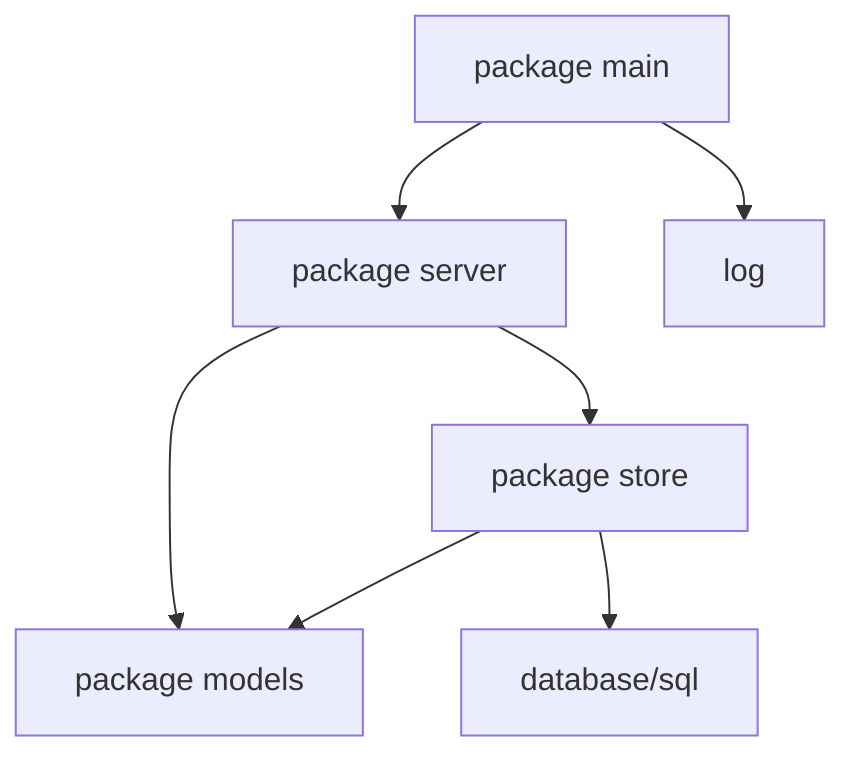

# Chapter 3 — Program Structure: Packages, Imports, and Visibility

> **What you'll learn.** How Go organizes code into *packages* instead of headers
> and translation units, how `import` works, how `package main` becomes a program,
> how capitalization decides what is public, and how `init` and package
> initialization order work — all compared directly to C.

In C, the unit of compilation is the **translation unit**: one `.c` file plus the
headers it `#include`s, compiled to one `.o`. Files do not see each other's
functions unless you share a *declaration* through a header, and you fight a
constant battle to keep that header in sync with the definition.

Go throws all of that out. The unit is the **package**, there are no headers, and
the compiler reads a whole package at once. This chapter is about that new shape.

## A directory is a package

The rule is simple: **one directory is exactly one package.** Every `.go` file in
that directory starts with the same `package` clause, and all of them share a
single scope. A function in one file can call a function, or use a type, defined
in another file of the same directory — with no declaration, no header, no
`extern`.

```go
// file: shapes/area.go
package shapes

func Area(r float64) float64 {
	return pi * r * r // pi is defined in another file, below — this is fine
}
```

```go
// file: shapes/constants.go
package shapes

const pi = 3.14159
```

Both files say `package shapes`. Together they *are* the package. `Area` uses `pi`
even though `pi` is declared in a different file — and even though, textually, it
appears "later." That is allowed because:

**Declaration order does not matter.** The compiler first collects every
top-level name in the whole package, then checks the bodies. You can call a
function before it is defined, reference a type declared at the bottom of the
file, or split related declarations across files in any order.

> **C vs Go.** In C you must *forward-declare*: either order your definitions so
> each is declared before use, or put prototypes in a header. Get it wrong and you
> get "implicit declaration" warnings or errors. In Go there are no prototypes and
> no ordering rules for top-level declarations — the problem simply does not
> exist.

> **Mental model.** Think of a package as one big source file that the compiler
> stitches together from all the `.go` files in the directory. The file boundaries
> are for *you*, to organize code; the compiler barely cares about them.

## How a directory tree maps to packages

Each directory is one package; subdirectories are *separate* packages, not
"sub-packages" in any special sense. Here is a small module and the package each
file belongs to:

```
myapp/                         module example.com/myapp   (named in go.mod)
├── go.mod
├── main.go                    package main
├── server/
│   ├── server.go              package server
│   └── routes.go              package server   (same dir => same package)
└── internal/
    └── store/
        ├── store.go           package store
        └── cache.go           package store
```

`server.go` and `routes.go` share one scope because they are in the same
directory. `store/` is a different package, reachable by the import path
`example.com/myapp/internal/store`. (The special `internal/` directory limits who
may import it; see Chapter 18 — Packages and Modules.)

## Imports

After the `package` clause, a file lists the packages it uses. A single import:

```go
import "fmt"
```

Or, idiomatically, a grouped block (which `gofmt` keeps sorted):

```go
import (
	"fmt"
	"os"
	"strings"
)
```

**Import path vs package name.** The string in quotes is the *import path* — how
Go locates the code. The identifier you actually type is the *package name*,
declared by that package's own `package` clause. Usually the last element of the
path is the package name (`"math/rand"` is used as `rand`), but not always, so do
not assume.

**Aliased imports** rename a package locally — to resolve a clash or to shorten a
name:

```go
import (
	"math/rand"
	crand "crypto/rand" // both packages are named rand; alias one of them
)
```

**Blank imports** import a package *only for its side effects*. You write `_` as
the name, do not reference the package, and rely on its `init` functions running
(see below). A classic case is registering a driver or decoder:

```go
import _ "github.com/lib/pq" // registers the Postgres driver with database/sql
```

**Dot imports** (`import . "fmt"`) dump a package's exported names into your file
so you can write `Println` instead of `fmt.Println`. They are **discouraged**:
they hide where each name comes from and invite clashes. You will mainly see them
in some test files, rarely elsewhere.

Recall from Chapter 1 — Why Go for a C Programmer: an **unused import is a compile
error**, not a warning. Dead imports never pile up.

> **C vs Go.** `#include "foo.h"` textually pastes declarations into your file,
> which is why you need include guards and why order can matter. `import "foo"`
> references an already-compiled package by path. There is no textual paste, no
> guard, no double-inclusion problem, and the order of imports is irrelevant.

## `package main` and `func main`

One package name is special. A package named **`main`** that contains a function
**`func main()`** (no parameters, no return value) builds into a runnable
executable; `main` is the entry point.

```go
package main

import "fmt"

func main() {
	fmt.Println(banner())
}
```

Any other package name is a **library**: it has no `main` and cannot be run
directly, only imported.

A `main` package may be **split across several files**, just like any package.
All of them say `package main` and share scope:

```go
// file: banner.go
package main

func banner() string { return "myapp v1.0" }
```

`banner()` lives in `banner.go`; `main()` in `main.go`; both are `package main`,
so `main` can call `banner` with no ceremony.

## Exported vs unexported: capitalization is visibility

This is one of Go's most important rules, and it surprises every C programmer:

**An identifier whose name starts with an uppercase letter is *exported* (visible
to other packages). A lowercase first letter is *unexported* (visible only inside
its own package).** Spelling — not a keyword — controls visibility.

This applies to **everything** declared at package level *and* to struct fields
and methods: functions, types, variables, constants, fields, methods.

```go
package user

type User struct {
	Name  string // exported: other packages can read and set it
	email string // unexported: only package user can touch it
}

func New(name string) *User { return &User{Name: name} } // exported
func validate(u *User) bool  { return u.Name != "" }      // unexported helper
```

| Concept | C | Go |
|---|---|---|
| Hidden from other files/packages | `static int x;` | `var x int` (lowercase) |
| Visible to other files/packages | `int x;` + `extern` in a header | `var X int` (uppercase) |
| Granularity of "private" | per file (translation unit) | per **package** (all its files) |
| How you choose | the keyword `static` | the **case** of the first letter |

> **C vs Go.** Lowercase is Go's `static`, but with a key difference. C's `static`
> hides a name from *other files*. Go's lowercase hides a name from *other
> packages* — yet **every file in the same package can still see it.** There is no
> file-level privacy in Go; the package is the privacy boundary.

> **Watch out.** Capitalization is *meaning*, not style. Renaming `Total` to
> `total` is not cosmetic — it makes the name disappear from every other package
> and will break their code. Also, libraries like `encoding/json` can only see
> **exported** fields, so an unexported `email` field will silently not be
> included when you marshal a `User` to JSON.

## `init` and package initialization order

Before `main` runs, Go initializes packages in a precise, defined order. Within a
single package it goes:

1. **Imported packages first.** Every package you import is fully initialized
   before yours — dependencies before dependents.
2. **Package-level variables next**, in *dependency* order. Go works out which
   variable's initializer uses which other variable and runs them in the right
   order, not merely top to bottom.
3. **`init` functions last.** Each `init` runs after the variables are set, in the
   order the source files are presented to the compiler (alphabetical by filename),
   and top to bottom within a file.

A special function `func init()` takes no arguments and returns nothing. You
**cannot call it yourself**, and a package (even a single file) may define
**several**. Use it to register things, build lookup tables, or validate
configuration.

```go
package main

import "fmt"

var config = loadDefaults() // (2) package var: initialized before any init

func loadDefaults() map[string]string {
	return map[string]string{"mode": "fast"}
}

func init() { // (3) runs after config exists, before main
	config["mode"] = "safe"
}

func main() { // (4) runs last
	fmt.Println(config["mode"]) // prints: safe
}
```

> **C vs Go.** C has no portable "run this before `main`." Compilers offer
> `__attribute__((constructor))`, and C++ has static-object constructors, but the
> order *across* translation units is unspecified and a frequent source of bugs
> (the "static initialization order fiasco"). Go specifies the order exactly and
> portably, and a blank import (`import _ "pkg"`) is the standard way to *trigger*
> another package's `init`.

## Circular imports are forbidden

If package A imports B, then B (directly or through a chain) must not import A. Try
it and the build stops with `import cycle not allowed`.



This graph is a **DAG** — a directed graph with no cycles — and Go *requires* it
to be one. That is a feature, not a limitation:

- It keeps dependencies easy to reason about (arrows only point "downhill").
- It lets the compiler build packages in dependency order, in parallel, and cache
  them — a big reason Go builds so fast.

> **C vs Go.** C happily lets two headers include each other as long as include
> guards stop infinite recursion, so cyclic dependencies between modules are
> common and tolerated. Go forbids them outright. When you hit a cycle, fix the
> *design*: move the shared types into a third, lower-level package that both
> import, or define an interface in the consumer so the dependency points only one
> way (see Chapter 11 — Interfaces).

## How Go finds a package (brief)

An import path such as `example.com/myapp/internal/store` is the **module path**
from your `go.mod` plus the subdirectory inside the module. Standard-library
paths like `fmt` and `net/http` resolve to the standard library in GOROOT;
third-party paths resolve through the module cache. The full story — modules,
versions, `go.sum`, and `internal/` — is in Chapter 18 — Packages and Modules.

## Naming conventions

Because the package name prefixes everything you use from it, names are chosen to
read well *at the call site*.

- **Package names are short, all-lowercase, single words** — no underscores, no
  camelCase: `http`, `strconv`, `io`, `bytes`, `time`.
- **Avoid stutter.** The package name is already part of the qualified name, so
  do not repeat it. Name the type `Server`, not `HTTPServer`, because callers
  write `http.Server`. Likewise `bytes.Buffer` (not `BytesBuffer`) and
  `errors.New` (not `errors.NewError`).
- **Avoid grab-bag names** like `util`, `common`, or `helpers`; they attract
  unrelated code. Name a package for what it provides (`tokenize`, `retry`,
  `store`).

> **Rule of thumb.** Read the name as the caller will: `package user` with a type
> `User` reads `user.User`, which stutters — prefer `user.Account` or just put the
> type in a better-named package. Design the *qualified* name, not the bare one.

## Key takeaways

- A package is **one directory**; all its `.go` files share one scope. There are
  no headers, no `#include`, and no forward declarations.
- **Declaration order does not matter** within a package; the compiler reads the
  whole package before checking bodies.
- `import` references a compiled package by its *path*; the *package name* is what
  you type. Imports can be aliased, blank (`_`, for side effects via `init`), or
  (rarely) dot-imported.
- `package main` + `func main()` builds a runnable program, and a `main` package
  can span several files.
- **Capitalization is visibility:** uppercase = exported (public), lowercase =
  unexported (package-private). It applies to funcs, types, vars, consts, fields,
  and methods.
- Package init order is defined: imports, then package variables (in dependency
  order), then `init` functions, then `main`.
- Circular imports are forbidden, which keeps the dependency graph a clean DAG.

## Watch out (gotchas for C programmers)

- **There is no file-level privacy.** `static` hides a name from other *files*;
  Go's lowercase hides it from other *packages* only. All files in a package see
  each other's unexported names.
- **Renaming across the case boundary changes meaning.** Lowercasing an exported
  name removes it from every other package's view and breaks their code.
- **Unexported struct fields are invisible to reflection-based libraries** like
  `encoding/json`; they will not be marshaled. Export the fields you want serialized.
- **`init` cannot be called and its cross-file order is by filename.** Do not rely
  on subtle ordering between `init` functions; keep each one self-contained.
- **A cyclic import is a hard error, not a warning.** If two packages need each
  other, the design is wrong — extract a shared package or introduce an interface.

## Interview questions

**Q: How does Go organize code compared to C's headers and translation units?**
A: Go has no headers and no preprocessor. Code is grouped into packages, where one
directory is one package and all of its `.go` files share a single scope. Files in
the same package see each other's top-level declarations with no `extern` or
prototypes, and declaration order does not matter because the compiler reads the
whole package before checking it.

**Q: How do you make a name public or private in Go?**
A: By capitalization. An identifier starting with an uppercase letter is exported
and visible to other packages; a lowercase first letter is unexported and visible
only within its own package. This applies to functions, types, variables,
constants, struct fields, and methods. It is like C's `static` versus external
linkage, but decided by the name's case and scoped to the package, not the file.

**Q: What does a blank import (`import _ "pkg"`) do, and when would you use one?**
A: It imports a package solely for its side effects: the package's `init`
functions run, but you do not reference any of its names. It is used to register
something with a central registry — for example a database driver registering
itself with `database/sql`, or an image-format decoder registering with `image`.

**Q: Explain Go's package initialization order.**
A: First, all imported packages are fully initialized (dependencies before
dependents). Then package-level variables are initialized in dependency order
(Go orders them by what each initializer needs, not just textually). Then each
`init` function runs, in filename order across files and top to bottom within a
file. Finally, for `package main`, `main` runs.

**Q: Why does Go forbid circular imports, and how do you resolve one?**
A: Forbidding cycles forces the package dependency graph to be a DAG, which makes
dependencies easy to reason about and lets the compiler build and cache packages
in order, quickly. To break a cycle, move the types both packages share into a
third, lower-level package, or invert one direction of the dependency by defining
an interface in the package that consumes the behavior.

## Try it

1. Make a directory `shapes/` with two files, `area.go` and `constants.go`, both
   `package shapes`, where `area.go` uses a `const` defined in `constants.go`.
   Confirm it compiles even though the constant is in the "other" file.
2. Add an unexported field to a struct, marshal it with `encoding/json`, and watch
   it vanish from the output. Capitalize the field name and watch it reappear.
