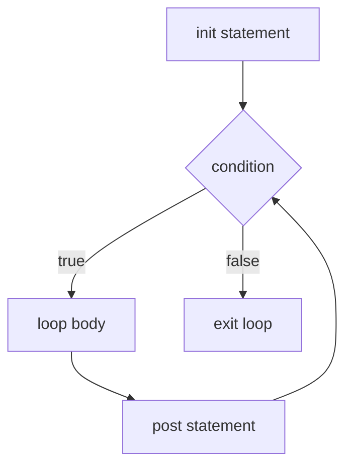

# Chapter 5 — Control Flow

> **What you'll learn.** Go's control flow keywords: `if` without parentheses,
> the single `for` loop that replaces `while` and `do`, `range` over every kind of
> collection, and `switch` with **no automatic fallthrough**. Each one is compared
> to its C counterpart, including the traps.

Go keeps the control-flow keywords you know from C — `if`, `for`, `switch`,
`break`, `continue`, `goto` — but trims the set and changes a few rules. There is
**one loop keyword** (`for`), **no `while`** or `do-while`, **no `?:` ternary**, and
`switch` cases **do not fall through** by default. The result is less syntax to
learn and fewer ways to write the same thing.

## if

An `if` in Go looks like C with two differences: **the condition has no
parentheses**, and **the braces are mandatory** (even for a single statement).

```go
if x > 0 {
	fmt.Println("positive")
} else if x == 0 {
	fmt.Println("zero")
} else {
	fmt.Println("negative")
}
```

```c
/* C: parentheses required, braces optional (a frequent bug source) */
if (x > 0)
    printf("positive\n");
```

> **C vs Go.** Optional braces in C lead to real bugs (the "goto fail" SSL bug, and
> the dangling-else trap). Go removes the choice: braces are always required, and
> the opening brace must be on the same line as the `if`. There is no debate about
> style.

### The `if` with an init statement

`if` can run a short statement *before* the condition, separated by a semicolon.
The variables it declares are **scoped to the `if`/`else` block** and disappear
afterward. This is the idiomatic way to handle a function that returns a value and
an error:

```go
if v, err := strconv.Atoi(s); err != nil {
	fmt.Println("bad number:", err)
} else {
	fmt.Println("got", v) // v and err are visible here too
}
// v and err do NOT exist here
```

This keeps the variable's scope tight — it exists only where it is relevant. In C
you would declare `v` and `err` in the surrounding scope, where they linger after
you are done with them.

> **Watch out.** The `:=` in an `if` init opens a **new scope**. If an outer
> variable has the same name, the inner one *shadows* it. Assigning to the inner
> `err` does not change the outer `err`. This is the most common shadowing bug in
> Go; see the end-of-chapter gotchas.

### No ternary operator

Go has no `?:` operator. The designers considered it and left it out because nested
ternaries become unreadable. Use a short `if`, or — for numbers — the `min`/`max`
builtins:

```go
// C: int larger = (a > b) ? a : b;
larger := b
if a > b {
	larger = a
}

m := max(a, b) // builtin since Go 1.21; also min(a, b)
```

> **Rule of thumb.** If you miss `?:`, you usually want a small helper function or
> the `min`/`max` builtins. A three-line `if` is considered clearer than a clever
> one-liner in Go.

## for: the only loop

Go has exactly one loop keyword: `for`. It covers every looping pattern that C
splits across `for`, `while`, and `do-while`.



**1. The C-style three-part loop.** Same three parts as C — init, condition, post —
but no parentheses:

```go
for i := 0; i < 10; i++ {
	fmt.Println(i)
}
```

**2. The while-style loop.** Drop the init and post, keep only the condition. This
*is* Go's `while`:

```go
n := 1
for n < 100 { // C: while (n < 100)
	n *= 2
}
```

**3. The infinite loop.** Drop everything. This is Go's `for (;;)` or `while (1)`:

```go
for { // loops forever; leave with break or return
	line, err := readLine()
	if err != nil {
		break
	}
	process(line)
}
```

**4. The integer range loop.** Since Go 1.22 you can range over an integer to count
from `0` to `n-1`. It is the cleanest way to "do something `n` times":

```go
for i := range 5 { // i goes 0, 1, 2, 3, 4
	fmt.Println(i)
}
```

| Loop | C | Go |
|---|---|---|
| Counted | `for (int i=0; i<n; i++)` | `for i := 0; i < n; i++` |
| While | `while (cond)` | `for cond` |
| Do-while | `do { } while (cond);` | none; use `for { ...; if !cond { break } }` |
| Forever | `for(;;)` / `while(1)` | `for {}` |
| Count n times | `for (int i=0;i<n;i++)` | `for i := range n` |

> **Watch out.** There is **no `do-while`**. When you need "run the body at least
> once," use an infinite `for` with a `break` at the bottom. There are also **no
> `while` or `do` keywords** at all — only `for`.

`break` and `continue` work exactly as in C: `break` leaves the loop, `continue`
jumps to the next iteration (the post statement runs first in a three-part loop).

### Labeled break and continue

To break or continue an *outer* loop from inside a nested loop, label the outer
loop and name it. In C this is the one place people reach for `goto`; Go gives you a
structured tool instead.

```go
outer:
	for i := range 3 {
		for j := range 3 {
			if i*j > 2 {
				break outer // breaks BOTH loops, not just the inner one
			}
			fmt.Println(i, j)
		}
	}
```

`continue label` works the same way: it continues the labeled loop. A label is a
name followed by a colon, placed directly before the loop.

> **C vs Go.** In C you escape nested loops with a `goto done;` and a label at the
> bottom, or a flag variable. Go's labeled `break`/`continue` does this cleanly and
> keeps the structure obvious — the label names a loop, not an arbitrary point.

## range

`range` iterates over a built-in collection and hands you each element. What it
yields depends on what you range over.

| You range over | First value | Second value |
|---|---|---|
| array or slice | index | a **copy** of the element |
| string | byte index | the `rune` (code point) at that index |
| map | key | a copy of the value |
| channel | the received value | (none) |
| integer `n` | `0` to `n-1` | (none) |

```go
nums := []int{10, 20, 30}
for i, v := range nums { // index and value
	fmt.Println(i, v)
}

for i := range nums { // index only (drop the value)
	fmt.Println(i)
}

for _, v := range nums { // value only (drop the index with _)
	fmt.Println(v)
}
```

**Maps** yield key and value, but in a **random order** that changes each run (this
is deliberate; see Chapter 9 — Maps):

```go
for k, v := range m {
	fmt.Println(k, v) // order is intentionally not stable
}
```

**Strings** range over *runes*, not bytes. The index is the byte offset where each
rune starts, so it can jump by more than one for multi-byte UTF-8 characters (see
Chapter 8 — Arrays, Slices, and Strings):

```go
for i, r := range "héllo" {
	fmt.Printf("%d:%c ", i, r) // 0:h 1:é 3:l 4:l 5:o  (é is 2 bytes)
}
```

**Channels** yield values until the channel is closed (more in Chapter 14 —
Channels and Select):

```go
for v := range ch { // receives until ch is closed
	fmt.Println(v)
}
```

### Two traps: the value is a copy, and the expression is evaluated once

These two rules surprise C programmers, so learn them now.

**The range value is a copy.** Modifying the loop variable does **not** change the
element in the collection. To mutate the element, index into it:

```go
type Item struct{ price int }
items := []Item{{1}, {2}, {3}}

for _, it := range items {
	it.price *= 10 // changes the COPY only
}
fmt.Println(items) // [{1} {2} {3}] — unchanged!

for i := range items {
	items[i].price *= 10 // index in to mutate the real element
}
fmt.Println(items) // [{10} {20} {30}]
```

**The range expression is evaluated once.** For a slice, the length is read at the
start, so appending inside the loop does not loop forever:

```go
s := []int{1, 2, 3}
for range s { // bound is fixed at 3 up front
	s = append(s, 0)
}
fmt.Println(len(s)) // 6, not infinite
```

> **Mental model.** `for i, v := range xs` is roughly `n := len(xs); for i := 0; i
> < n; i++ { v := xs[i]; ... }`. The `v := xs[i]` is a copy, and `n` is computed
> once. Hold that picture and both traps make sense.

> **Watch out (historical).** Before Go 1.22, the loop variable was **shared**
> across iterations, so launching goroutines that captured `v` inside a loop was a
> famous bug (every goroutine saw the last value). **Since Go 1.22 each iteration
> gets a fresh copy of the loop variables**, and this bug is gone. You may still
> see warnings about it in old articles; on Go 1.26 it does not apply to `for`
> loops.

### Range over functions (iterators)

Since Go 1.23, `range` can also iterate over a function — an *iterator*. This lets
your own types provide a clean `range` loop. You will mostly *use* these (for
example, `maps.Keys` or `strings.Lines`) rather than write them, but here is the
shape:

```go
func CountTo(n int) func(yield func(int) bool) {
	return func(yield func(int) bool) {
		for i := range n {
			if !yield(i) { // yield returns false if the caller breaks
				return
			}
		}
	}
}

for x := range CountTo(3) { // 0 1 2
	fmt.Println(x)
}
```

We return to iterators in Chapter 8 — Arrays, Slices, and Strings.

## switch

Go's `switch` is more powerful than C's and has one rule that is the **opposite of
C**: a case **does not fall through** to the next one. There is an implicit `break`
at the end of every case. You almost never write `break` in a Go `switch`.

```go
switch n {
case 1:
	fmt.Println("one") // stops here; no fall-through to case 2
case 2:
	fmt.Println("two")
default:
	fmt.Println("many")
}
```

```
C switch: falls through unless you break       Go switch: each case breaks for you
  case 1: A;            // also runs B, C!        case 1: A      // stops
  case 2: B; break;                               case 2: B      // stops
  case 3: C;                                      case 3: C
                                                          fallthrough  // opt IN
```

> **C vs Go.** In C, forgetting `break` is a classic bug — execution "falls
> through" into the next case. Go flips the default: cases break automatically, and
> you use the keyword `fallthrough` to *opt in* when you actually want it.

**Opt in with `fallthrough`.** It transfers control to the next case
unconditionally (it does not re-test that case's value):

```go
switch n {
case 2:
	fmt.Println("two")
	fallthrough // continue into the next case on purpose
case 3:
	fmt.Println("three") // printed too when n == 2
}
```

**Multiple values per case.** List them comma-separated — no need for stacked
empty cases like in C:

```go
switch c {
case 'a', 'e', 'i', 'o', 'u':
	fmt.Println("vowel")
default:
	fmt.Println("consonant")
}
```

**Conditionless switch** (a clean `if`/`else if` chain). Omit the value after
`switch`; each `case` is then a boolean test. This reads better than a long
`else if` ladder:

```go
switch { // like: switch true
case score >= 90:
	grade = "A"
case score >= 80:
	grade = "B"
default:
	grade = "C"
}
```

**Switch with an init statement**, just like `if`:

```go
switch day := time.Now().Weekday(); day {
case time.Saturday, time.Sunday:
	fmt.Println("weekend")
default:
	fmt.Println("weekday")
}
```

**Type switch** (a brief preview). A special form switches on the *dynamic type* of
an interface value. It is essential for working with `any`; we cover it fully in
Chapter 11 — Interfaces:

```go
func describe(x any) string {
	switch v := x.(type) {
	case int:
		return fmt.Sprintf("int %d", v)
	case string:
		return fmt.Sprintf("string %q", v)
	default:
		return "other"
	}
}
```

| Feature | C switch | Go switch |
|---|---|---|
| Default behavior | falls through | breaks after each case |
| `break` needed | yes, every case | no (implicit) |
| Continue to next case | automatic | explicit `fallthrough` |
| Case type | integer constants only | any comparable values, multiple per case |
| No value after `switch` | not allowed | allowed (boolean cases) |
| Switch on a type | not possible | `switch v := x.(type)` |

## goto and labels

Go *does* have `goto` and labels, but they are rare. `goto` can only jump within
the same function and cannot jump over a variable declaration into its scope.

```go
i := 0
loop:
	if i < 3 {
		fmt.Println(i)
		i++
		goto loop
	}
```

In C, `goto` is most often used for cleanup: jump to a label at the end of a
function to free resources on an error path. **Go replaces that pattern with
`defer`**, which schedules cleanup to run automatically when the function returns —
no labels, no jumps. We cover `defer` in Chapter 6 — Functions.

> **Rule of thumb.** Reach for labeled `break`/`continue` to escape loops, and
> `defer` for cleanup. Genuine `goto` is almost never needed in Go; some code
> generators emit it, but hand-written Go rarely does.

## A note on select

There is one more switch-like statement: `select`. It looks like a `switch` but its
cases are **channel operations**, and it waits until one of them can proceed. Think
of it as "switch for channels." It is the heart of Go concurrency and gets a full
treatment in Chapter 14 — Channels and Select:

```go
select {
case msg := <-ch1:
	fmt.Println("received", msg)
case ch2 <- 42:
	fmt.Println("sent")
default:
	fmt.Println("nothing ready right now")
}
```

## Key takeaways

- `if` has **no parentheses** and **mandatory braces**. The `if init; cond` form
  scopes a short statement (like `v, err := f()`) to the `if`/`else`.
- There is **no ternary operator**; use a short `if` or `min`/`max`.
- `for` is the **only loop**. It does counted loops, `while` (`for cond`), infinite
  (`for {}`), and counting (`for i := range n`, Go 1.22+).
- Use **labeled `break`/`continue`** to control an outer loop from a nested one.
- `range` walks slices/arrays (index, value), maps (key, value, **random order**),
  strings (byte index, **rune**), channels, and integers. The value is a **copy**,
  and the range expression is **evaluated once**.
- Loop variables are **per-iteration since Go 1.22**, so the old goroutine-capture
  bug is gone.
- `switch` **does not fall through**; cases break automatically. Use `fallthrough`
  to opt in. Cases can list multiple values, a `switch` can have no condition
  (boolean cases) or an init statement, and a type switch inspects dynamic types.
- `goto` exists but is rare; use `defer` for C's goto-to-cleanup pattern.

## Watch out (gotchas for C programmers)

- **`switch` does not fall through by default.** This is the reverse of C. You will
  *not* see `break` in most Go switches; use `fallthrough` only when you mean it.
- **The `range` value is a copy.** `for _, v := range s { v.field = ... }` changes
  nothing in `s`. Index with `s[i]` to mutate the real element.
- **No `while` or `do-while` keywords.** Use `for cond` and `for { ...; if !cond {
  break } }`.
- **You cannot take the address of a map element.** `&m[k]` is a compile error,
  because a map may move its entries in memory. Take a copy, modify it, and store it
  back, or use a `map[K]*V` of pointers (see Chapter 9 — Maps).
- **`:=` inside `if`, `for`, or `switch` opens a new scope and can shadow.** A new
  `err` declared in an inner block hides the outer `err`; assigning to it does not
  affect the outer one. Linters such as `staticcheck` and the `shadow` analyzer
  catch this (see Chapter 22 — Tooling).

## Interview questions

**Q: How does Go's `switch` differ from C's?**
A: Go cases do not fall through; each case ends with an implicit `break`, so you
rarely write `break`. You opt in to fall-through with the `fallthrough` keyword. Go
also allows multiple values per case, a conditionless `switch` (boolean cases as a
clean if-else chain), an init statement, and a type switch on an interface's dynamic
type. C falls through by default and only switches on integer constants.

**Q: Go has only one loop keyword. How do you write a `while` loop?**
A: Use `for` with just a condition: `for cond { ... }`. An infinite loop is `for {}`,
a counted loop is `for i := 0; i < n; i++`, and `for i := range n` counts from 0 to
n-1. There is no `while` or `do-while` keyword; for "run at least once" use an
infinite `for` with a `break` at the bottom.

**Q: When you `range` over a slice and modify the value variable, why doesn't the
slice change?**
A: Because `range` copies each element into the loop variable. You are modifying the
copy, not the element in the slice. To change the element, index into the slice:
`s[i].field = ...`. Likewise, the range expression (and a slice's length) is
evaluated once at the start of the loop.

**Q: What is the loop-variable capture bug, and does it still exist?**
A: Before Go 1.22, a `for` loop reused one variable across all iterations, so
closures or goroutines that captured it all saw the final value. Since Go 1.22 each
iteration gets its own copy of the loop variables, so the bug is fixed. On Go 1.26
you do not need the old `v := v` workaround inside `for` loops.

**Q: How do you break out of nested loops in Go without `goto`?**
A: Label the outer loop and use `break label` (or `continue label`). The label is a
name with a colon placed right before the loop. This is the structured replacement
for C's "goto a label after the loops." For cleanup on the way out of a function,
use `defer` instead of a goto-to-cleanup label.

## Try it

1. Write a loop that prints the multiplication pairs `i, j` for `i, j` in `0..2`
   but stops *all* looping the moment `i*j > 2`, using a labeled `break`.
2. Range over the string `"naïve"` printing each byte index and rune. Notice the
   index skips a number where the multi-byte character sits.
3. Write a `switch` with no condition that maps a score to a letter grade, then add
   a `fallthrough` somewhere and observe how the output changes.
