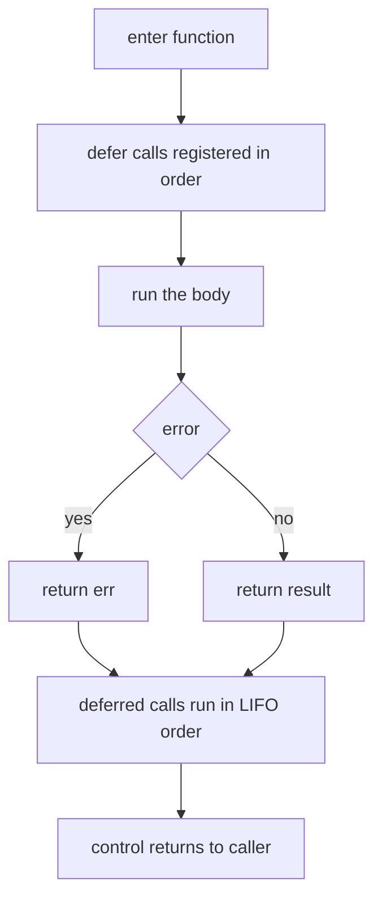

# Chapter 6 — Functions

> **What you'll learn.** How to declare Go functions, return *multiple* values
> (the heart of Go's error handling), write type-safe variadic functions, pass
> functions around as values, build closures, and use `defer` to clean up
> reliably. Every idea is compared to the C function you already know.

A function in C and a function in Go do the same job: take inputs, run code,
return a result. The shape is different, and Go adds a few abilities C does not
have built in. None of them are hard. This chapter walks through each one.

## Declaring a function

In C the return type comes first, then the name, then the parameters. In Go the
keyword `func` comes first, the **type comes after each name**, and the return
type comes after the parameter list.

```c
int add(int x, int y) {
    return x + y;
}
```

```go
func add(x int, y int) int {
	return x + y
}
```

When several parameters share a type, you can write the type once, after the
last of them. This is just shorthand.

```go
func add(x, y int) int { // x and y are both int
	return x + y
}
```

> **C vs Go.** The "type after the name" order feels backward for a day. The
> reason is that it reads left to right: "func add takes x int and y int, returns
> int." Declarations and uses then look alike, which helps with the harder types
> later (function values, slices, maps).

| Concept | C | Go |
|---|---|---|
| Declaration | `int add(int x, int y)` | `func add(x, y int) int` |
| Type position | before the name | after the name |
| Multiple results | out-pointers or a struct | native: `(int, error)` |
| Variadic args | `stdarg.h`, untyped | `...T`, type-safe |
| Overloading | C: no. C++: yes | no |
| Default arguments | C: no. C++: yes | no |
| Function pointer | `int (*f)(int)` | `f func(int) int` |
| Cleanup before return | `goto cleanup` | `defer` |

There are no forward declarations and no prototypes. A function can call another
function defined later in the file or in another file of the same package. We
covered why in Chapter 3 — Program Structure: Packages, Imports, and Visibility.

## Multiple return values

This is one of the first things you will love. A C function returns exactly one
value. To return more, you pass *output pointers* or wrap the results in a
struct. Go functions can return **several values** directly.

```c
/* C: caller passes a pointer for the second result */
int divmod(int a, int b, int *rem) {
    *rem = a % b;
    return a / b;
}
```

```go
func divmod(a, b int) (int, int) {
	return a / b, a % b
}

func main() {
	q, r := divmod(17, 5) // q = 3, r = 2
	fmt.Println(q, r)     // 3 2
}
```

The caller receives both values at once with `q, r := divmod(17, 5)`.

### The `(T, error)` pattern

The most important use of multiple returns is **returning a result and an
error** together. Go has no exceptions. A function that can fail returns its
normal value plus an `error` value. The caller checks the error right away.
(Errors get a full chapter: Chapter 12 — Errors.)

```go
func parsePort(s string) (int, error) {
	n, err := strconv.Atoi(s) // Atoi returns (int, error)
	if err != nil {
		return 0, fmt.Errorf("invalid port %q: %w", s, err)
	}
	if n < 1 || n > 65535 {
		return 0, fmt.Errorf("port %d out of range", n)
	}
	return n, nil // nil means "no error"
}
```

The caller handles the error before using the result:

```go
port, err := parsePort(os.Args[1])
if err != nil {
	log.Fatal(err) // print the error and exit
}
fmt.Println("listening on port", port)
```

> **Rule of thumb.** Put the `error` last in the return list. Return it as `nil`
> on success. On failure return a zero value for the other results plus a real
> error. This order is a strong convention; follow it so your code reads like
> everyone else's.

> **Mental model.** Multiple returns are not a tuple type you can store. They are
> just "this call produces N values." You consume them immediately, usually with
> `:=`.

## Named return values and the naked return

You may give the return values **names**. Named results act like local variables
that already exist when the function starts, set to their zero value. A `return`
with no values then returns whatever those names currently hold. That is called a
**naked return**.

```go
func divmod(a, b int) (q, r int) {
	q = a / b
	r = a % b
	return // naked: returns the current q and r
}
```

Named results are useful for two things: documenting what each result means, and
letting a deferred function change the result (we use that with `defer` below).

> **Watch out.** Naked returns hurt readability in anything longer than a few
> lines. The reader must scroll up to learn what is being returned. Use named
> results for documentation, but prefer an explicit `return q, r` in all but the
> shortest functions.

## Variadic functions

A **variadic function** takes any number of trailing arguments of one type. You
write `...T` for the last parameter. Inside the function that parameter is a
slice (`[]T`); see Chapter 8 — Arrays, Slices, and Strings.

```go
func sum(nums ...int) int {
	total := 0
	for _, n := range nums { // nums is a []int here
		total += n
	}
	return total
}
```

You can call it with zero, one, or many arguments. To pass an existing slice,
add `...` after it to **spread** its elements.

```go
sum(1, 2, 3) // 6
sum()        // 0  (nums is an empty slice)

xs := []int{4, 5, 6}
sum(xs...)   // 15 — spread the slice into the variadic parameter
```

C has variadic functions too, through `<stdarg.h>` — but they are **untyped and
unsafe**. The callee must know the count and type of every argument by some other
means (a format string, a sentinel value, an explicit count). Pass the wrong
type and you get undefined behavior, not a compile error.

```c
#include <stdarg.h>

/* The caller MUST pass the correct count; nothing checks the types. */
int sum(int count, ...) {
    va_list args;
    va_start(args, count);
    int total = 0;
    for (int i = 0; i < count; i++)
        total += va_arg(args, int); /* wrong type here = silent corruption */
    va_end(args);
    return total;
}
```

> **C vs Go.** Go's variadics are **type-safe**. `sum(nums ...int)` accepts only
> `int` values; the compiler rejects anything else. There is no separate count to
> pass and keep in sync, because the slice knows its own length. The closest C
> cousin, `printf`, takes `...any` in Go: `func Printf(format string, a ...any)`.

### No overloading, no default arguments

Go has **no function overloading** (two functions with the same name but
different parameters) and **no default argument values**. C also lacks both;
C++ has both. Coming from C++ this is the surprise.

The idiomatic replacements:

- **Different names** instead of overloads. The standard library does this:
  `strings.Index`, `strings.IndexByte`, `strings.IndexRune`; `strings.Split` and
  `strings.SplitN`.
- **Variadics** when "zero or more" is the natural shape.
- **Type parameters (generics)** when one function should work for many types
  (Chapter 19 — Generics). The builtins `min` and `max` already work this way:

  ```go
  max(3, 5)     // 5    — works for ints
  max(2.5, 1.5) // 2.5  — and floats
  ```

- **An options struct** instead of default arguments. The caller sets only the
  fields it cares about; the zero value supplies the defaults.

  ```go
  type ServerOpts struct {
  	Port    int
  	Timeout time.Duration
  }

  func NewServer(opts ServerOpts) *Server {
  	if opts.Port == 0 {
  		opts.Port = 8080 // default when the caller left it zero
  	}
  	// ...
  	return &Server{ /* ... */ }
  }
  ```

  For libraries, this grows into the **functional options** pattern, covered in
  Chapter 25 — Idioms and Style.

## Functions are values

In Go a function is a **first-class value**, like an `int` or a pointer. You can
store it in a variable, pass it to another function, and return it from a
function. C can do this too, with **function pointers**, but Go's syntax is much
simpler.

The **type** of a function is its signature: `func(int, int) int` is "a function
taking two ints and returning an int."

```c
/* C: a function pointer parameter, with the famous spiral syntax */
int apply(int (*f)(int), int x) {
    return f(x);
}
```

```go
// Go: the parameter type is just "func(int) int"
func apply(f func(int) int, x int) int {
	return f(x)
}

func double(x int) int { return x * 2 }

func main() {
	fmt.Println(apply(double, 21)) // 42
}
```

You can also keep a function in a variable and call it later:

```go
var op func(int, int) int // zero value is nil; calling a nil func panics
op = add
fmt.Println(op(2, 3)) // 5
```

> **C vs Go.** A C function-pointer type like `int (*f)(int)` reads inside-out.
> The Go form `func(int) int` reads left to right and nests cleanly:
> `func(func(int) int) func(int) int` is a function that takes one int-to-int
> function and returns another. Try writing that as a C typedef.

## Closures

An **anonymous function** is a function with no name, written inline. When an
anonymous function uses variables from the function around it, it **captures**
them. The combination is a **closure**: the function plus the captured variables.

Key point: a closure captures variables **by reference**, not by copy. It shares
the actual variable with the enclosing function, so it sees and can change the
latest value.

```go
// counter returns a function. Each call to that function returns the next int.
func counter() func() int {
	count := 0 // captured by the returned closure
	return func() int {
		count++
		return count
	}
}

func main() {
	next := counter()
	fmt.Println(next()) // 1
	fmt.Println(next()) // 2
	fmt.Println(next()) // 3
}
```

`count` lives on after `counter` returns, because the closure still refers to it.
The garbage collector keeps it alive (Chapter 17 — Memory and the GC). In C you
would fake this with a `static` variable or a heap struct you pass around; Go
handles the lifetime for you.

> **Watch out (historical).** Before Go 1.22, a `for` loop reused **one** loop
> variable for every iteration. A closure that captured it saw the final value,
> so launching goroutines in a loop printed the last index many times. Since
> **Go 1.22 each iteration gets its own copy** of the loop variable, and this book
> targets Go 1.26, so the classic bug is gone:

```go
funcs := make([]func(), 0, 3)
for i := range 3 { // Go 1.22+: each iteration has its own i
	funcs = append(funcs, func() { fmt.Print(i, " ") })
}
for _, f := range funcs {
	f() // prints: 0 1 2  (before Go 1.22 this printed: 3 3 3)
}
```

> **Watch out.** Per-iteration loop variables fix the *loop* case. You can still
> create a sharing bug by capturing the same variable from outside a loop into
> several goroutines and mutating it. Concurrency safety is Chapter 13 —
> Goroutines and the Scheduler.

## `defer`: cleanup that always runs

`defer` schedules a function call to run **when the surrounding function
returns** — on any return path, and even while a panic is unwinding the stack.
It is Go's answer to "always close this, always unlock that."

```go
func readConfig(name string) error {
	f, err := os.Open(name)
	if err != nil {
		return err
	}
	defer f.Close() // runs no matter how readConfig returns below

	// ... many return statements can follow; the file still gets closed ...
	return nil
}
```

Compare the C idiom. Without `defer`, C programmers funnel every exit through a
single cleanup label with `goto`:

```c
int read_config(const char *name) {
    FILE *f = fopen(name, "r");
    if (!f) return -1;
    int rc = -1;
    /* ... work; on error: goto done ... */
    rc = 0;
done:
    fclose(f);   /* one cleanup point, reached by every path */
    return rc;
}
```

> **C vs Go.** `defer` replaces the `goto cleanup` pattern and GCC/Clang's
> `__attribute__((cleanup(...)))`. The cleanup sits right next to the resource it
> frees — you `Open` then immediately `defer Close` — so you cannot forget it on
> a new early return. This is clearer and harder to get wrong.

The other classic use is releasing a lock. A **mutex** is a lock that protects
shared data (covered in the concurrency chapters). `defer` guarantees the unlock
runs on every path:

```go
mu.Lock()
defer mu.Unlock() // unlocked when the function returns, even on an early return
// ... touch the shared data safely ...
```

### Rule 1: deferred calls run in LIFO order

If a function defers several calls, they run in **last-in, first-out** order: the
most recently deferred call runs first. Think of a stack of plates.

```go
func main() {
	for i := range 3 {
		defer fmt.Print(i, " ")
	}
	fmt.Println("body done")
}
// Output:
// body done
// 2 1 0
```



The defer stack, as a picture. Each `defer` pushes; the return pops from the top:

```
  defer A   (pushed 1st)        run order at return
  defer B   (pushed 2nd)        ───────────────────▶
  defer C   (pushed 3rd)

        push ↓            pop / run ↑
       ┌───────┐
       │   C   │  ← runs 1st   (last in)
       ├───────┤
       │   B   │  ← runs 2nd
       ├───────┤
       │   A   │  ← runs 3rd   (first in)
       └───────┘
```

### Rule 2: arguments are evaluated at the `defer` line

This is the subtle one. When you write `defer f(x)`, Go evaluates `f` and the
argument `x` **right then**, at the `defer` statement, and remembers those
values. The *call* happens later, but the arguments are already fixed.

```go
package main

import "fmt"

func main() {
	i := 0
	defer fmt.Println("deferred i =", i) // i is read NOW: 0
	i = 99
	fmt.Println("current i =", i) // 99
}
// Output:
// current i = 99
// deferred i = 0
```

If you want the deferred code to see the *final* value, wrap it in a closure. A
closure captures the variable by reference, so it reads the latest value when it
runs:

```go
i := 0
defer func() { fmt.Println("deferred i =", i) }() // reads i at return time
i = 99
// prints: deferred i = 99
```

### Rule 3: a deferred closure can change named results

A deferred closure runs after the `return` statement has set the result
variables but before the caller receives them. If the results are **named**, the
closure can modify them. This is the standard way to add or transform an error on
the way out.

```go
package main

import "fmt"

// doubleViaDefer returns 2*x to show the order: return sets result,
// then the deferred closure modifies it before the caller sees it.
func doubleViaDefer(x int) (result int) {
	defer func() { result *= 2 }()
	result = x
	return // returns x, then defer turns it into 2*x
}

func main() {
	fmt.Println(doubleViaDefer(21)) // 42
}
```

A realistic use is catching a panic and turning it into an error (the full story
is in Chapter 12 — Errors):

```go
func safeRun() (err error) {
	defer func() {
		if r := recover(); r != nil {
			err = fmt.Errorf("recovered from panic: %v", r)
		}
	}()
	mightPanic()
	return nil
}
```

### Watch out: `defer` inside a loop

A `defer` is tied to the **function**, not to the loop body or any inner block.
Deferred calls pile up and run only when the whole function returns. So deferring
inside a long loop can hold thousands of resources open at once.

```go
// BAD: every file stays open until processAll returns.
func processAll(names []string) error {
	for _, name := range names {
		f, err := os.Open(name)
		if err != nil {
			return err
		}
		defer f.Close() // accumulates; nothing closes until the end
		// ... use f ...
	}
	return nil
}
```

Fix it by giving each iteration its own function, so `defer` fires every loop:

```go
// GOOD: the deferred Close runs at the end of each call to processOne.
func processAll(names []string) error {
	for _, name := range names {
		if err := processOne(name); err != nil {
			return err
		}
	}
	return nil
}

func processOne(name string) error {
	f, err := os.Open(name)
	if err != nil {
		return err
	}
	defer f.Close() // runs when processOne returns, once per file
	// ... use f ...
	return nil
}
```

## Recursion

Go functions may call themselves. Recursion works exactly as in C.

```go
func factorial(n int) int {
	if n <= 1 {
		return 1
	}
	return n * factorial(n-1)
}
```

> **Watch out.** Go does **not** guarantee tail-call optimization. A function
> that recurses very deeply can exhaust its stack. Goroutine stacks start small
> and grow automatically (Chapter 13 — Goroutines and the Scheduler), so the
> limit is large but not infinite. For deep or unbounded work, prefer a loop with
> an explicit stack (a slice).

## Key takeaways

- A function is `func name(params) results { ... }`; types come **after** names,
  and shared types can be written once: `func add(x, y int) int`.
- Go functions return **multiple values**. The dominant pattern is
  `(result, error)`, with `error` last and `nil` meaning success.
- **Named results** document the outputs and let a deferred closure modify them;
  the **naked return** is fine for tiny functions but hurts readability otherwise.
- **Variadic** functions use `...T` and are type-safe, unlike C's `stdarg.h`.
  Spread a slice into one with `slice...`.
- Go has **no overloading and no default arguments**. Use distinct names,
  variadics, generics, or an options struct instead.
- Functions are **values**: store, pass, and return them. The function-type
  syntax is simpler than C function pointers.
- **Closures** capture variables by reference and keep them alive.
- **`defer`** runs at function return in **LIFO** order, evaluates its arguments
  at the `defer` line, runs on every path including panics, and (with a closure)
  can modify named results.

## Watch out (gotchas for C programmers)

- **`defer` arguments are evaluated immediately**, not at return time. Wrap code
  in a closure (`defer func() { ... }()`) if it must see later values.
- **`defer` is per function, not per loop iteration.** Deferring inside a loop
  accumulates calls until the function returns; factor the body into its own
  function instead.
- **Naked returns reduce clarity.** Outside very short functions, write the
  values explicitly: `return q, r`.
- **No overloading or default arguments.** Do not look for them; reach for the
  idiomatic alternatives.
- **Shadowing `err` with `:=`.** Inside an `if` or `for` block, `:=` creates a
  *new* variable that hides the outer one. You can accidentally write to a new
  local `err` and return the outer (still `nil`) one. `go vet` catches some cases.

  ```go
  x := 1
  if true {
  	x := 2         // a NEW x, only inside this block (shadows the outer x)
  	fmt.Println(x) // 2
  }
  fmt.Println(x) // 1 — the outer x never changed
  ```

- **Calling a nil function value panics.** A `func` variable's zero value is
  `nil`; assign a real function before calling it.

## Interview questions

**Q: Why does Go return multiple values instead of using output pointers like C?**
A: It makes the common "result plus status" case direct and readable, and it is
the foundation of Go's error handling: a function returns `(value, error)` and the
caller checks the error immediately. There is no need for out-pointers or a
wrapper struct, and no exceptions.

**Q: When are the arguments to a deferred call evaluated?**
A: At the moment the `defer` statement runs, not when the deferred call actually
executes at return time. The argument values are captured then. To observe a
variable's final value instead, defer a closure that reads the variable, because
a closure captures it by reference.

**Q: In what order do deferred calls run, and when?**
A: In last-in, first-out (LIFO) order, when the surrounding function returns —
through a normal `return`, the end of the body, or a panic unwinding the stack.
The most recently deferred call runs first.

**Q: How can a deferred function change what a function returns?**
A: Only if the function uses named return values. The `return` statement sets the
named result variables first, then deferred calls run before control goes back to
the caller. A deferred closure can read and modify those named variables, which is
how code recovers from a panic and converts it into a returned error.

**Q: What is a closure, and how does Go decide the lifetime of captured variables?**
A: A closure is an anonymous function together with the variables it captures from
its surrounding scope. Capture is by reference, so the closure sees the latest
values. Captured variables stay alive as long as the closure is reachable; the
garbage collector frees them afterward, so returning a closure that captures a
local is safe.

**Q: Does Go support function overloading or default arguments?**
A: No to both. Use different function names, variadic parameters, generics, or an
options struct (and, for libraries, the functional options pattern) to get the
same flexibility.

## Try it

1. Write `func stats(nums ...int) (lo, hi, sum int)` using the named results.
   Call it with both a list of literals and a spread slice (`stats(xs...)`).
2. Add `defer fmt.Println("done")` and a few `defer fmt.Println(i)` calls in a
   loop, and predict the output order before you run it.
3. Inside `stats`, replace your manual `lo`/`hi` updates with the builtins `min`
   and `max`, and confirm the results match. (Note: do not name the results `min`
   or `max`, or you would shadow the builtins.)
