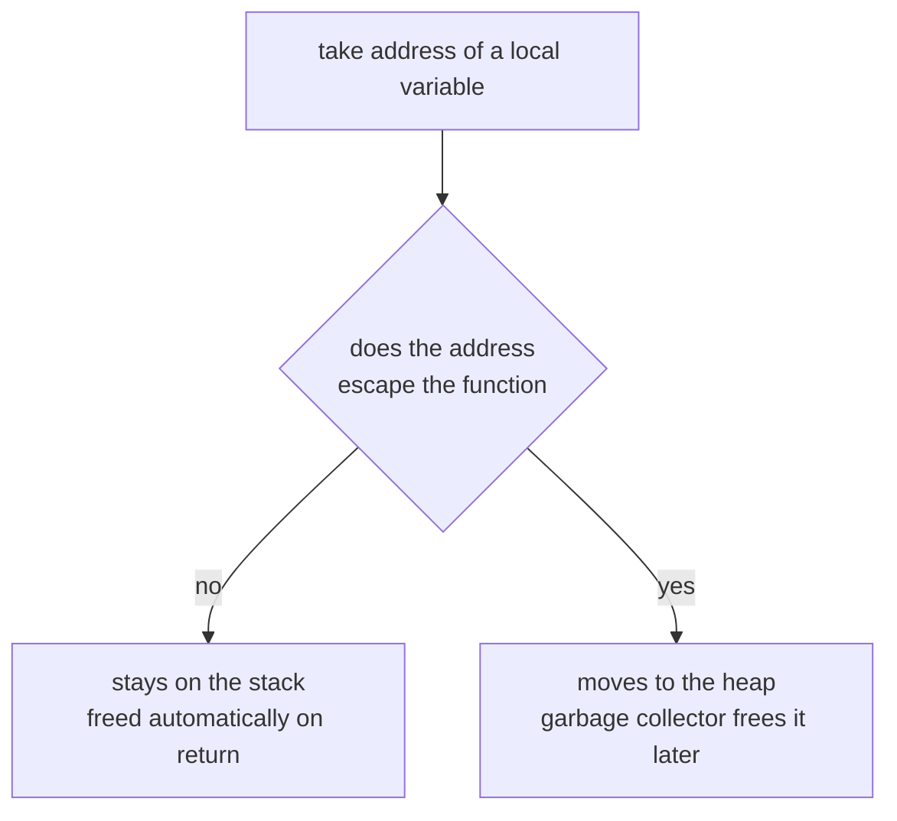

# Chapter 7 — Pointers

> **What you'll learn.** How Go pointers work, why they are *safer* and *simpler*
> than C pointers, and the rules that surprise C programmers: no pointer
> arithmetic, dereferencing `nil` panics instead of corrupting memory, and
> returning the address of a local variable is perfectly safe.

Good news: you already understand pointers. A pointer is a value that holds the
address of another value. Go uses the same `&` and `*` operators as C, and the
same idea of "point at it, then read or write through the pointer." This chapter
is mostly about what Go **removes** to make pointers safe, plus a few habits that
differ from C.

## The basics: `&`, `*`, and `*T`

`&x` takes the **address** of `x`. `*p` **dereferences** `p` — it reads or writes
the value `p` points at. The type `*T` means "pointer to a value of type `T`."
This is identical to C.

```c
int x = 42;
int *p = &x;        /* p points at x */
printf("%d\n", *p); /* 42  */
*p = 7;             /* write through p */
printf("%d\n", x);  /* 7   */
```

```go
x := 42
p := &x          // p has type *int and points at x
fmt.Println(*p)  // 42  — read through p
*p = 7           // write through p
fmt.Println(x)   // 7
```

Here is the picture every C programmer carries in their head. It is the same in
Go:

```
      p                    x
  ┌────────┐           ┌────────┐
  │   ●────┼──────────▶│   42   │
  └────────┘           └────────┘
    *int                  int

  p == &x     p holds the address of x
  *p == 42    dereference p to reach x
```

A pointer variable that points at nothing holds `nil`, Go's version of `NULL`.
The **zero value** of any pointer type is `nil`.

```go
var p *int        // declared, not pointing anywhere yet: p == nil
fmt.Println(p == nil) // true
```

| Concept | C | Go |
|---|---|---|
| Address-of | `&x` | `&x` |
| Dereference | `*p` | `*p` |
| Pointer type | `int *p` | `var p *int` |
| Pointer arithmetic | `p++`, `p + 1` | **not allowed** |
| Allocate one value | `malloc(sizeof(T))` (garbage) | `new(T)` (zeroed) or `&T{}` |
| Free | `free(p)` | automatic (garbage collector) |
| Null literal | `NULL` | `nil` |
| Dereference null | undefined behavior / segfault | **defined panic** |
| Field through pointer | `p->field` | `p.field` |
| Return address of local | dangling-pointer bug | **safe** |

## The big difference: no pointer arithmetic

In C a pointer is a number you can do math on. `p++` moves it to the next element;
`p + 3` skips ahead three elements. This is powerful and is also the source of
buffer overruns and a large share of security bugs.

Go **forbids pointer arithmetic**. You cannot add to a pointer, subtract from it,
or increment it. A Go pointer only points; it does not walk.

```c
int a[5] = {10, 20, 30, 40, 50};
int *p = a;
p++;                /* legal in C: now points at a[1] */
printf("%d\n", *p); /* 20 */
```

```go
a := []int{10, 20, 30, 40, 50}
p := &a[0]      // taking the address of an element is fine
fmt.Println(*p) // 10
// But you cannot do arithmetic on the pointer:
// p++          // COMPILE ERROR: invalid operation
// p = p + 1    // COMPILE ERROR
fmt.Println(a[1]) // 20 — to "move", index the slice instead
```

To walk through memory in Go, you index a **slice**, which knows its own length
and is bounds-checked at run time. That is the subject of Chapter 8 — Arrays,
Slices, and Strings. The result: the classic off-by-one that scribbles past the
end of an array cannot silently corrupt memory in Go. An out-of-range index
panics with a clear message.

> **C vs Go.** In C, a pointer and an array are almost interchangeable, and you
> walk data with pointer math. In Go those jobs split cleanly: **pointers point
> at one thing; slices represent a run of things.** If you find yourself wanting
> `p + 1`, you want a slice and an index.

## `new(T)`: allocate a zeroed value

`new(T)` allocates storage for one value of type `T`, sets it to the **zero
value**, and returns a `*T` pointing at it. It is roughly C's `malloc`, with two
big differences: the memory is **zeroed**, not garbage, and you never `free` it —
the garbage collector reclaims it when nothing points at it (Chapter 17 — Memory
and the GC).

```c
int *p = malloc(sizeof(int)); /* contents are garbage */
*p = 5;
/* ... */
free(p);                      /* you must free, exactly once */
```

```go
p := new(int)   // p is *int, *p starts at 0 (zeroed, not garbage)
fmt.Println(*p) // 0
*p = 5
// no free: the GC handles it
```

In practice `new` is **rarely used**. For structs, the idiomatic way to get a
pointer is a composite literal with `&`, which also lets you set fields at the
same time:

```go
type Point struct{ X, Y int }

q := new(Point)         // &Point{} with all fields zero
p := &Point{X: 1, Y: 2} // idiomatic: allocate AND initialize
```

> **Rule of thumb.** Reach for `&T{...}` to make a pointer to a struct. Keep
> `new` for the occasional pointer to a basic type like `*int`, and even then a
> local variable plus `&` usually reads better.

## `nil` and the defined panic

Dereferencing a `nil` pointer in C is **undefined behavior**: usually a segfault,
sometimes silent corruption, occasionally "it worked on my machine." In Go,
dereferencing `nil` is a **defined runtime error**: the program panics with a
clear message at the exact line.

```go
var p *int
fmt.Println(*p)
// panics: runtime error: invalid memory address or nil pointer dereference
```

A panic is recoverable and prints a stack trace, so the failure is visible and
debuggable rather than mysterious. (Panic and recover are covered in Chapter 12 —
Errors.) The lesson is the same as in C — check for `nil` before dereferencing —
but the failure mode is far kinder.

## Pass-by-value, always

This is the rule that explains when you need pointers at all. **Go passes every
argument by value.** The function gets a *copy*. Writing to a parameter changes
only the copy, never the caller's variable. C works the same way, which is why C
also uses pointers to let a function modify the caller's data.

The classic example is `swap`. Without pointers it cannot work, in either
language, because each side swaps its own copies:

```go
// Does NOT swap the caller's variables: a and b are copies.
func swap(a, b int) {
	a, b = b, a
}
```

Pass **pointers** so the function can reach the originals:

```c
void swap(int *a, int *b) {
    int tmp = *a;
    *a = *b;
    *b = tmp;
}
/* call: swap(&x, &y); */
```

```go
func swap(a, b *int) {
	*a, *b = *b, *a // write through the pointers
}

func main() {
	x, y := 1, 2
	swap(&x, &y)
	fmt.Println(x, y) // 2 1
}
```

> **Mental model.** "Pass by value" means "pass a copy of the bits." For an
> `int`, that copies the number. For a pointer, that copies the *address* — both
> the original and the copy then point at the same value, so the callee can
> change it. This is exactly how C behaves.

> **Watch out.** Slices, maps, and channels are special. They are small *headers*
> that already contain a pointer to shared backing data. Passing one by value
> copies the header but not the underlying data, so the callee can change the
> elements a slice points at. We unpack this in Chapter 8 — Arrays, Slices, and
> Strings, and Chapter 9 — Maps.

## Struct pointers: no `->`, just `.`

In C you reach a field through a pointer with the arrow operator: `p->field`. In
Go there is **no `->`**. You always use a dot, and Go **automatically
dereferences** a pointer to a struct when you access a field. So `p.field` works
whether `p` is a struct or a pointer to a struct.

```c
struct Point { int x, y; };
struct Point *p = &pt;
printf("%d\n", p->x); /* arrow for pointers, dot for values */
```

```go
type Point struct{ X, Y int }

p := &Point{X: 1, Y: 2}
fmt.Println(p.X) // 1  — same as (*p).X, but you never write that
p.Y = 9          // auto-dereference on assignment too
fmt.Println(*p)  // {1 9}
```

> **C vs Go.** One operator (`.`) for both values and pointers means less to
> think about. The compiler inserts the dereference for you. The explicit
> `(*p).X` form is legal but no one writes it. This same auto-dereference makes
> calling methods on pointers seamless (Chapter 10 — Structs and Methods).

## Returning the address of a local is safe

Here is the rule that feels *wrong* to a C programmer, and it is one of Go's best
features. In C, returning the address of a local variable is a bug: the variable
lives on the stack frame, which disappears when the function returns, leaving a
**dangling pointer**.

```c
int *new_counter(void) {
    int c = 0;
    return &c;   /* BUG: c is gone after return; dangling pointer */
}
```

In Go the same code is **correct and common**. The compiler performs **escape
analysis**: if it sees that a local's address outlives the function, it places
that variable on the **heap** instead of the stack. The garbage collector frees
it later, when nothing points at it.

```go
func newCounter() *int {
	c := 0     // local variable
	return &c  // SAFE: c "escapes", so Go allocates it on the heap
}

func main() {
	p := newCounter()
	*p += 1         // write through the pointer; in Go (*p)++ also works
	fmt.Println(*p) // 1
}
```

You do not annotate anything; the compiler decides stack vs heap for you. This is
why constructor-style functions that return `&T{...}` are everywhere in Go and are
completely safe. The full mechanics — escape analysis, the heap, and the GC — are
in Chapter 17 — Memory and the GC.



> **C vs Go.** Memorize this inversion: in C, `return &local;` is a classic bug;
> in Go, `return &local` is a classic *pattern*. Escape analysis plus garbage
> collection make it safe.

## When to use a pointer (and when not to)

Pointers in Go are for **sharing** and **mutation**, not for "walking memory."
Use them deliberately.

| Situation | Use a pointer? | Why |
|---|---|---|
| Let a function modify the caller's value | Yes | The only way to write back. |
| A large struct you pass around a lot | Yes | Avoid copying many bytes each call. |
| An optional / nullable field | Yes | `nil` cleanly means "absent." |
| A small value: `int`, `bool`, small struct | No | Copying is cheap; a value is simpler and safer. |
| A slice, map, or channel | No | They are already reference-like; passing the value shares the data. |

> **Rule of thumb.** Default to passing values. Switch to a pointer when you must
> mutate the caller's data, when profiling shows copying a big struct is costly,
> or when you genuinely need "no value here" (`nil`). Do not reach for a pointer
> just out of C habit.

## `unsafe.Pointer` (briefly)

Go does provide an escape hatch. The `unsafe` package has `unsafe.Pointer`, which
can convert between unrelated pointer types and to/from `uintptr` (an integer big
enough to hold an address). With it you *can* do C-style pointer tricks, including
a form of pointer arithmetic, and it is how some `cgo` interop and
high-performance code works.

```go
import "unsafe"
// unsafe.Pointer bypasses Go's type and memory safety.
// It is the tool behind some C interop and a few performance hacks.
```

It is **discouraged for everyday code**. The name is a warning: you give up the
safety guarantees this chapter is about, and the rules for using it correctly are
strict and easy to break. Reach for it only for low-level interop or measured,
proven hot paths — and document why.

## Key takeaways

- Go pointers use the same `&`, `*`, and `*T` as C, and a pointer's zero value is
  `nil`.
- **No pointer arithmetic.** To traverse data, index a bounds-checked slice
  (Chapter 8 — Arrays, Slices, and Strings).
- `new(T)` returns a `*T` to a **zeroed** value and is rarely used; `&T{...}` is
  the idiomatic way to allocate and initialize a struct. The GC frees memory; you
  never call `free`.
- Dereferencing `nil` is a **defined panic**, not C's undefined behavior.
- Go is **pass-by-value always**. Pass a pointer when a function must modify the
  caller's data (see the `swap` example).
- Field access through a pointer uses `.` and auto-dereferences; there is no `->`.
- **Returning `&local` is safe**: escape analysis moves the variable to the heap.
  This is the opposite of the C rule (Chapter 17 — Memory and the GC).
- Use pointers for mutation, large structs, and optional values; not for small
  values or the already-reference-like slices, maps, and channels.

## Watch out (gotchas for C programmers)

- **`return &local` is SAFE here** — the inverse of C. Do not add workarounds for
  a dangling-pointer bug that cannot happen.
- **Dereferencing `nil` panics** with a defined runtime error; it does not segfault
  or corrupt memory. Still check for `nil` before dereferencing.
- **No pointer arithmetic.** `p++` and `p + 1` do not compile. Use a slice index.
- **You cannot take the address of a map element.** `&m[k]` is a compile error,
  because a map may move its entries when it grows, which would invalidate the
  address. To update in place, reassign (`m[k] = ...` or `m[k]++`) or store
  pointers (`map[K]*V`).

  ```go
  m := map[string]int{"a": 1}
  // p := &m["a"] // COMPILE ERROR: cannot take address of m["a"]
  m["a"]++        // fine: read-modify-write by key
  ```

- **Comparing pointers compares addresses, not the pointed-at values.** Two
  pointers are `==` only when they hold the same address (or are both `nil`).

  ```go
  a, b := 1, 1
  p, q := &a, &b
  fmt.Println(p == q) // false — different addresses, even though *p == *q
  fmt.Println(p == &a) // true — same address
  ```

- **A pointer does not let you "walk" a struct's fields** the way C lets you walk
  bytes. Field layout is the compiler's business; use the field names.

## Interview questions

**Q: Does Go have pointer arithmetic? How do you traverse a buffer without it?**
A: No. You cannot add to or increment a pointer. To traverse data you use a slice
and index it (`s[i]`), which is bounds-checked at run time. This removes a whole
class of memory-safety bugs while still letting you process sequences efficiently.

**Q: Why is returning the address of a local variable safe in Go but a bug in C?**
A: The Go compiler does escape analysis. If a local's address escapes the function,
the compiler allocates that variable on the heap instead of the stack, and the
garbage collector frees it once nothing references it. In C a local lives on the
stack frame, which is reclaimed on return, so its address dangles.

**Q: What happens when you dereference a nil pointer in Go versus C?**
A: In Go it is a defined runtime panic with a clear message and a stack trace, and
it can be recovered. In C it is undefined behavior — typically a segfault, possibly
silent memory corruption.

**Q: What is the difference between `new(T)` and `&T{}`?**
A: Both return a `*T` to a freshly allocated, zeroed value. `&T{...}` is a
composite literal, so you can initialize fields at the same time, which is why it
is the idiomatic choice for structs. `new(T)` only gives you the zero value and is
mostly used for basic types like `*int`. Neither requires freeing; the GC handles it.

**Q: When should you pass a pointer to a function instead of a value?**
A: When the function must modify the caller's data, when copying a large struct on
every call is measurably expensive, or when you need a nullable/optional value
where `nil` means "absent." For small values, prefer passing by value; slices,
maps, and channels are already reference-like, so you rarely point at them.

**Q: Why can't you take the address of a map element?**
A: Because a map may reorganize its internal storage when it grows, moving entries
to new memory. A pointer into the map would then dangle. Go forbids `&m[k]` to keep
that impossible. Update entries by key, or store pointers as the map's values.

## Try it

1. Write `func incr(p *int)` that does `*p += 1`. Call it on a local, print the
   result, and confirm the original changed.
2. Write `func makePoint(x, y int) *Point` that returns `&Point{x, y}`. Note that
   returning the address of a value created inside the function is safe.
3. Try to compile `p := &m["a"]` for a map `m`, read the error, then rewrite it as
   `m["a"]++`.
