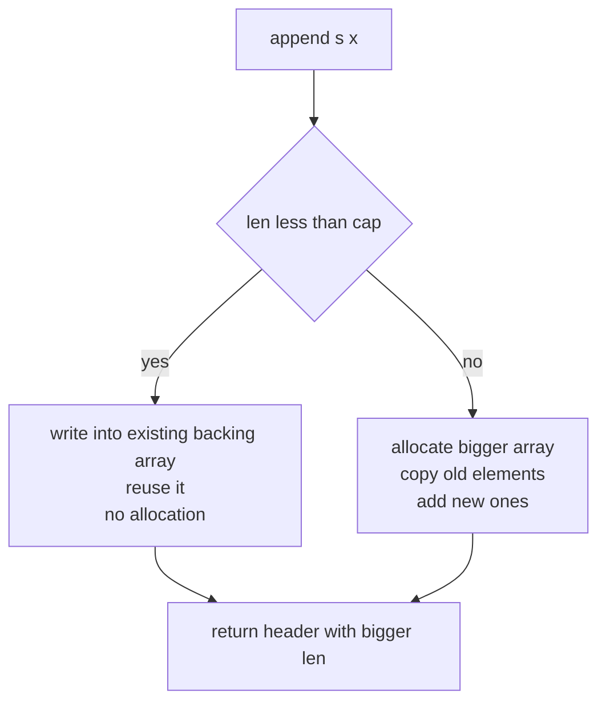

# Chapter 8 — Arrays, Slices, and Strings

> **What you'll learn.** The single biggest difference between C and Go: the
> *slice*, a small three-field header that replaces "a pointer plus a length."
> You will learn how arrays, slices, and strings are laid out in memory, why
> sub-slices can secretly share storage, how `append` can quietly move your data,
> and why a Go string is UTF-8 bytes — not a NUL-terminated `char *`.

This is the chapter to read slowly. Almost every Go bug a C programmer hits in
their first month lives here. The good news: once the slice model clicks, it
stays clicked.

## Arrays: fixed size, and a value type

A Go **array** is written `[N]T`: `N` elements of type `T`. The length `N` is a
constant and is **part of the type**.

```go
var a [3]int        // three ints, all zero: [0 0 0]
b := [3]int{1, 2, 3}
c := [...]int{1, 2, 3, 4} // [...] = "count the elements for me" -> [4]int
```

This looks like C, but two rules are different and both surprise C programmers.

**1. The size is part of the type.** `[3]int` and `[4]int` are *different types*.
You cannot assign one to the other, and a function that takes `[3]int` will not
accept a `[4]int`. In C, `int[3]` and `int[4]` are loosely interchangeable through
a pointer; in Go they are as distinct as `int` and `float64`.

**2. An array is a value, not a pointer.** This is the opposite of C. In C, an
array name *decays* into a pointer to its first element, so passing an array to a
function passes a pointer — the function edits your data. In Go, an array is a
plain value. **Assigning it copies every element. Passing it to a function copies
every element.**

```go
func zero(arr [3]int) { arr[0] = 999 } // arr is a COPY of the caller's array

func main() {
	a := [3]int{1, 2, 3}
	b := a     // a FULL copy; b and a are now independent
	b[0] = 100 // a is still [1 2 3]
	zero(a)    // a is STILL [1 2 3] — zero edited only its own copy
}
```

> **C vs Go.** In C, `void zero(int arr[3])` is really `void zero(int *arr)`, and
> it edits the caller's array. In Go, `func zero(arr [3]int)` gets a copy and
> edits nothing the caller can see. The C array decays to a pointer; the Go array
> does not. This is the reverse of your instinct, so tattoo it on your brain.

Because copying whole arrays is rarely what you want, **arrays are used directly
quite rarely** in Go. They show up as fixed-size buffers (`[16]byte` for a hash),
as the element type of something else, or inside a struct. For everything
"array-like" and growable, you use a **slice**.

## Slices: the workhorse

A **slice** is Go's dynamic array — the type you reach for constantly: lists,
buffers, stacks, queues, function arguments. A slice is **not** an array. It is a
small, fixed-size *header* that *points into* a backing array, with three fields:

```
type slice struct {
    ptr *T   // pointer to the first element in a backing array
    len int  // number of elements you can index right now
    cap int  // elements available from ptr to the end of the backing array
}
```

> **Mental model.** A slice is a "fat pointer": the pointer you would pass in C,
> bundled together with the length *and* the capacity, in one value. The backing
> array lives on the heap and is freed by the garbage collector when no slice
> refers to it. You never `malloc` or `free` it.

Here is the layout. `s := make([]int, 3, 5)` makes a slice of length 3 and
capacity 5:

```
        slice header (a value: 3 machine words)
        ┌──────────┬──────────┬──────────┐
   s =  │   ptr    │  len = 3 │  cap = 5 │
        └────┬─────┴──────────┴──────────┘
             │
             ▼   backing array on the heap (GC-managed)
        ┌─────┬─────┬─────┬─────┬─────┐
        │  0  │  0  │  0  │  -  │  -  │
        └─────┴─────┴─────┴─────┴─────┘
          0     1     2     3     4
          └──── len = 3 ────┘
          └───────── cap = 5 ──────────┘
```

- **`len(s)`** is how many elements you can index. `s[0]` to `s[len-1]` are valid;
  `s[len]` panics with "index out of range."
- **`cap(s)`** is how many elements fit before the backing array runs out. The
  gap between `len` and `cap` is room to grow *without reallocating* (more on this
  under `append`).

### Creating slices

```go
// 1. Slice literal: declare and fill in one step. No size, no malloc.
nums := []int{3, 1, 4, 1, 5} // len 5, cap 5

// 2. make(): allocate with a length (and optional capacity).
buf := make([]byte, 1024)        // len 1024, cap 1024, all zero
grow := make([]int, 0, 100)      // len 0, cap 100: empty but pre-sized

// 3. Slicing an existing array or slice (next section).
```

> **C vs Go.** `[]int{...}` has no number between the brackets. With a number,
> `[5]int{...}`, it is an **array** (fixed). Without one, `[]int{...}`, it is a
> **slice** (dynamic). That tiny difference — empty brackets or not — decides
> which world you are in.

### nil slice vs empty slice

A slice's zero value is `nil`: a header with `ptr == nil`, `len == 0`, `cap == 0`.

```go
var s []int        // nil slice: len 0, cap 0, no backing array
e := []int{}       // empty (non-nil) slice: len 0, cap 0, but not nil
```

Here is the kind thing about Go: **a nil slice is safe to use.** You can call
`len(s)` on it (returns 0), `range` over it (zero iterations), and — most
importantly — `append` to it. There is no need to check for nil first.

```go
var s []int          // nil
for range s { }      // fine: zero iterations
s = append(s, 1)     // fine: append allocates a backing array
fmt.Println(s)       // [1]
```

> **Rule of thumb.** Prefer the nil slice (`var s []T`) as your "empty list"
> starting point. It needs no allocation and behaves the same as an empty slice
> in every operation you care about. The one place the difference shows is JSON:
> a nil slice marshals to `null`, an empty slice to `[]`.

## Slicing: sub-slices share memory

You can take a slice *of* a slice (or of an array) with `s[low:high]`. The result
covers elements `low` up to **but not including** `high`. Both indices are
optional: `s[:n]`, `s[n:]`, and `s[:]` all work.

```go
a := []int{10, 20, 30, 40, 50}
b := a[1:3]   // b = [20 30]: elements at index 1 and 2
```

The new length is `high - low`. But here is the part that bites every C
programmer:

**A sub-slice does not copy. It points into the *same backing array*.** `b` and
`a` share storage. Writing through one is visible through the other. This is
called **aliasing**.

```go
a := []int{10, 20, 30, 40, 50}
b := a[1:3]    // b shares a's backing array

b[0] = 99      // this writes to the SAME memory as a[1]
fmt.Println(a) // [10 99 30 40 50]   <-- a changed!
fmt.Println(b) // [99 30]
```

```
   a ─► ┌─────┬─────┬─────┬─────┬─────┐
        │ 10  │ 99  │ 30  │ 40  │ 50  │   backing array (shared)
        └─────┴─────┴─────┴─────┴─────┘
                ▲           
   b ──────────┘ b[0] is the same cell as a[1]
```

> **C vs Go.** This is exactly like two C pointers into the same buffer:
> `int *b = &a[1];` then `b[0] = 99;` also changes `a[1]`. The difference is that
> in Go the slicing syntax makes it *easy and quiet* to create such an alias, so
> you must stay aware of who shares what.

### Capacity, and the three-index slice

When you slice, the new capacity runs from `low` to the **end of the original
backing array**, not to `high`. So a sub-slice often keeps spare room reaching
into its parent — the trap behind the next section:

```go
a := []int{10, 20, 30, 40, 50} // len 5, cap 5
b := a[1:3]                     // len 3-1 = 2, cap 5-1 = 4 (spare cells a[3], a[4])
fmt.Println(len(b), cap(b))     // 2 4
```

A third index, `s[low:high:max]`, sets capacity to `max-low`, cutting off that
spare room so the sub-slice cannot reach past its end:

```go
b := a[1:3:3]                // len 2, cap 3-1 = 2: no spare capacity
fmt.Println(len(b), cap(b))  // 2 2
```

## append: grow a slice (carefully)

`append` adds elements to the end of a slice and returns the (possibly new)
slice. You must always assign the result back:

```go
s := []int{1, 2, 3}
s = append(s, 4)        // [1 2 3 4]
s = append(s, 5, 6)     // [1 2 3 4 5 6]: append takes any number of values
s = append(s, other...) // the ... spreads another slice's elements
```

What `append` does depends on capacity:

- **If `len < cap`** (there is spare room), `append` writes into the *existing*
  backing array and returns a header with a bigger `len`. No allocation. The
  backing array is reused.
- **If `len == cap`** (no room), `append` **allocates a new, bigger backing
  array**, copies the old elements into it, adds the new ones, and returns a
  header pointing at the *new* array. The old array is left behind (and collected
  later if nothing else uses it).



### Amortized growth

When `append` must grow, it does not add one cell — it grows the capacity by a
factor (roughly doubling for small slices, slower for large ones). So `n`
appends cost `O(n)` total, not `O(n^2)`. This is the same trick as C++'s
`std::vector` or a hand-rolled "grow by doubling" buffer in C.

```go
s := make([]int, 0) // len 0, cap 0
for i := range 10 {
	s = append(s, i)
	fmt.Println(len(s), cap(s)) // len climbs 1..10; cap grows in big jumps,
	                            // each one roughly double the previous
}
```

The exact capacities are an **implementation detail** (they vary by Go version,
element size, and platform — never hard-code them). On Go 1.26 the run prints caps
`4, 4, 4, 4, 8, 8, 8, 8, 16, 16`: the jumps keep doubling as the slice fills. Learn
the *pattern* (geometric growth), not the numbers.

> **Rule of thumb.** If you know roughly how many elements you will add, give the
> capacity up front: `make([]T, 0, n)`. This avoids repeated reallocation and
> copying. It is the Go version of reserving buffer space before a loop.

### The classic append-aliasing bug

Combine "sub-slices share memory" with "append may reuse the backing array" and
you get Go's most famous footgun.

```go
a := []int{10, 20, 30, 40, 50}
b := a[1:3]          // len 2, cap 4 — shares a's array, with spare room

b = append(b, 777)   // len 2 < cap 4, so NO new array:
                     // append writes 777 into the spare cell, which is a[3]!

fmt.Println(a)       // [10 20 30 777 50]  <-- append silently clobbered a[3]
fmt.Println(b)       // [20 30 777]
```

The `append` did not allocate, because `b` had spare capacity reaching into `a`.
So it overwrote `a[3]`. If you expected `append` to leave `a` alone, you have a
bug.

**The fix** is the three-index slice, which removes the spare capacity so
`append` is forced to allocate a fresh array:

```go
b := a[1:3:3]        // cap 2, no spare room
b = append(b, 777)   // len 2 == cap 2, so append ALLOCATES a new array
fmt.Println(a)       // [10 20 30 40 50]  <-- a is safe now
fmt.Println(b)       // [20 30 777]
```

> **Watch out.** Any time you hand out a sub-slice that someone else may `append`
> to, decide who owns the backing array. Either cap it with the three-index form
> (`a[low:high:high]`) or hand them a copy (see `copy` below).

### Always write `s = append(s, x)`

Because `append` may return a *different* header, ignoring the return value is
almost always a bug:

```go
append(s, x)        // WRONG: the grown slice is thrown away; go vet warns
s = append(s, x)    // RIGHT: keep the new header
```

## copy: duplicate elements

`copy(dst, src)` copies `min(len(dst), len(src))` elements and returns that count.
It does **not** allocate or grow `dst`; you must size `dst` yourself.

```go
src := []int{1, 2, 3, 4, 5}
dst := make([]int, 3)
n := copy(dst, src)     // copies 3 elements (dst is the limit)
fmt.Println(n, dst)     // 3 [1 2 3]
```

To make an independent copy of a whole slice (breaking all aliasing):

```go
clone := make([]int, len(src))
copy(clone, src)
// or, since Go 1.21:
clone := slices.Clone(src) // same effect, one line
```

> **C vs Go.** `copy` is like `memmove`: it handles overlapping ranges correctly,
> and it never runs past the end because it stops at the shorter length. There is
> no separate length argument to get wrong — the slices carry their own lengths.

## Common slice operations

The `slices` package (Go 1.21+) has clean helpers; it is still worth knowing the
moves underneath.

**Delete and insert** at index `i` (order preserved):

```go
s = slices.Delete(s, i, i+1)   // remove element i; classic form: append(s[:i], s[i+1:]...)
s = slices.Insert(s, i, x)     // insert x at index i, shifting the rest right
```

**Stack and queue** — a slice is all you need:

```go
stack = append(stack, x)          // push
top := stack[len(stack)-1]        // peek (read the last element)
stack = stack[:len(stack)-1]      // pop  (drop the last element)

queue = append(queue, x)          // enqueue
front := queue[0]                 // peek
queue = queue[1:]                 // dequeue (see the Watch out below)
```

> **Watch out.** The `queue = queue[1:]` trick never reclaims the front cells:
> the backing array keeps growing as the head pointer walks forward, even though
> `len` stays small. For a long-lived, high-throughput queue, use a ring buffer
> or `container/list` instead.

**Iterating copies values.** `range` gives you a *copy* of each element. Writing
to the loop variable does nothing to the slice:

```go
for _, v := range s {
	v = 0          // changes only the copy; s is untouched
}
for i := range s {
	s[i] = 0       // THIS edits the slice (write through the index)
}
```

## Passing slices to functions

A slice is passed **by value**, like everything in Go (Chapter 7 — Pointers), but
the value *is the three-field header*. So the function gets its **own** copy of
`ptr`/`len`/`cap`, and that copy points at the **same backing array** as the
caller. The consequence is subtle but important:

```go
func fill(s []int) {
	for i := range s {
		s[i] = i * i      // writes go through the shared backing array
	}
}

func tryAppend(s []int) {
	s = append(s, 999)    // reassigns the LOCAL header copy only
}

func main() {
	nums := make([]int, 3)
	fill(nums)
	fmt.Println(nums)     // [0 1 4]  -- element writes ARE visible

	tryAppend(nums)
	fmt.Println(nums)     // [0 1 4]  -- the append is NOT visible
}
```

- **Element writes are visible** to the caller, because both headers point at the
  same array. (This is like passing `int *` in C.)
- **`append` inside the function may or may not be visible.** It reassigns the
  callee's local header, which the caller never sees. If `append` also
  reallocated, the callee is now writing to a *different* array entirely. Either
  way, the caller's `len` does not change.

> **Rule of thumb.** If a function needs to grow a slice and the caller must see
> the result, **return the slice**: `s = grow(s)`. That is why the standard
> library's own `append` returns the slice instead of mutating in place.

## Multidimensional data: slices of slices

Go has no built-in 2-D slice. You build one as a slice of slices, where each row
is its own slice (and rows can even have different lengths — a "jagged" array).

```go
rows, cols := 3, 4
grid := make([][]int, rows)        // a slice of 3 (nil) int-slices
for i := range grid {
	grid[i] = make([]int, cols)    // give each row its own backing array
}
grid[1][2] = 7
```

> **C vs Go.** A C `int grid[3][4]` is one contiguous block of 12 ints. A Go
> `[][]int` is 3 separate row arrays plus a header array that points at them —
> *not* contiguous. If you need one flat block for performance, allocate
> `make([]int, rows*cols)` and index it as `flat[r*cols+c]` yourself.

## Strings: immutable UTF-8 bytes

A Go **string** is a read-only sequence of bytes. Like a slice, it is a small
header — but with only **two** fields: a pointer and a length.

```
        string header (2 machine words)
        ┌──────────┬──────────┐
   s =  │   ptr    │  len = 6 │   ──►  read-only bytes (UTF-8), no NUL needed
        └──────────┴──────────┘
```

Three facts change everything for a C programmer:

1. **A string is immutable.** You cannot assign to `s[i]`. To "change" a string
   you build a new one.
2. **A string carries its length.** It is *not* NUL-terminated. A string may
   contain a `0` byte with no trouble, and finding its length is `O(1)`, not a
   scan.
3. **A string is UTF-8.** Source code is UTF-8, and string literals are stored as
   UTF-8 bytes.

```go
s := "héllo"
// s[0] = 'H'          // compile error: cannot assign to s[0]
s = "H" + s[1:]        // build a NEW string instead
```

> **C vs Go.** A C string is `char *`: a pointer to bytes ending in `'\0'`, with
> no length and no character encoding (it is just bytes). A Go string knows its
> byte length, is immutable, and is understood as UTF-8 text. `len(s)` is
> instant; in C you call `strlen`, which walks to the NUL.

### `len` and indexing are about *bytes*, not characters

This is the number-one string surprise. `len(s)` is the number of **bytes**, and
`s[i]` is a single **byte** (type `byte`, an alias for `uint8`) — not a character.

```go
s := "héllo"
fmt.Println(len(s))        // 6, NOT 5 — 'é' takes two bytes in UTF-8
fmt.Println(s[0])          // 104  — a byte value (the code for 'h'), printed as a number
fmt.Printf("%c\n", s[1])   // Ã    — s[1] is just the FIRST byte of 'é', not 'é'
```

Here is the byte layout of `"héllo"`. The character `é` (Unicode code point
U+00E9) needs two bytes (`0xC3 0xA9`); the ASCII letters need one each:

```
   string "héllo"   ->   len(s) == 6 bytes,  but 5 characters (runes)

   byte index:   0      1      2      3      4      5
               ┌──────┬──────┬──────┬──────┬──────┬──────┐
   bytes:      │ 0x68 │ 0xC3 │ 0xA9 │ 0x6C │ 0x6C │ 0x6F │
               └──────┴──────┴──────┴──────┴──────┴──────┘
                 'h'   └──── 'é' ───┘  'l'    'l'    'o'
   code point: U+0068    U+00E9      U+006C U+006C U+006F
```

A non-Latin character takes even more bytes. The CJK character `世` (U+4E16) is
three UTF-8 bytes (`0xE4 0xB8 0x96`), so `len("世")` is `3`.

### `range` over a string yields *runes*

A **rune** is a Unicode *code point*: one character's numeric value. The type
`rune` is an alias for `int32`. When you `range` over a string, Go decodes the
UTF-8 for you and gives you `(byteIndex, rune)` for each character.

```go
for i, r := range "héllo" {
	fmt.Printf("%d: %c (%U)\n", i, r, r)
}
// 0: h (U+0068)
// 1: é (U+00E9)
// 3: l (U+006C)   <- index jumps from 1 to 3: 'é' used bytes 1 and 2
// 4: l (U+006C)
// 5: o (U+006F)
```

Notice the index skips from 1 to 3, because `é` occupied two bytes. The loop
variable `r` is the whole character, correctly decoded.

> **Watch out.** To count characters, do **not** use `len(s)`. Use
> `utf8.RuneCountInString(s)` (from `unicode/utf8`), which returns `5` for
> `"héllo"`. `len(s)` counts bytes.

### Converting between strings, bytes, and runes

You convert with `[]byte(s)`, `[]rune(s)`, and `string(...)`. **These conversions
allocate and copy** — a string is immutable, so Go cannot share its storage with
a mutable `[]byte`.

```go
s := "héllo"

bs := []byte(s)   // a fresh, mutable copy of the 6 bytes (allocates)
bs[0] = 'H'       // editing bs does NOT change s
fmt.Println(string(bs)) // "Héllo"

rs := []rune(s)   // decode UTF-8 into 5 code points (allocates)
fmt.Println(len(rs))    // 5
fmt.Println(string(rs[1])) // "é" — index a rune slice to get whole characters
```

> **Watch out.** `string(i)` where `i` is an integer does **not** turn `65` into
> `"65"`. It returns the *character* for that code point: `string(65)` is `"A"`.
> To format a number as text, use `strconv.Itoa(i)` or `fmt.Sprint(i)`. (`go vet`
> flags the likely-wrong `string(int)` conversion.)

### Building strings efficiently

Because strings are immutable, `+=` in a loop is `O(n^2)`: each `+=` allocates a
brand-new string and copies everything so far. For building up text, use
`strings.Builder`, which writes into a growing byte buffer and hands you the
string once at the end (no extra copy).

```go
var b strings.Builder
for i := range 3 {
	fmt.Fprintf(&b, "row %d\n", i) // Builder is an io.Writer
}
result := b.String()
fmt.Print(result)
// row 0
// row 1
// row 2
```

> **C vs Go.** This is the same idea as growing a `char` buffer with a length and
> `realloc` instead of calling `strcat` in a loop (which re-scans for the NUL each
> time). `strings.Builder` does the buffer management for you, safely.

## Key takeaways

- An **array** `[N]T` has a fixed size that is part of its type, and it is a
  **value**: assigning or passing it **copies** every element. (The opposite of C,
  where arrays decay to pointers.) You use arrays directly only rarely.
- A **slice** `[]T` is a three-field header `{ptr, len, cap}` — a fat pointer into
  a heap backing array that the GC frees. This is the workhorse type.
- `len` is what you can index; `cap` is room before reallocation. Make slices with
  literals `[]T{...}`, `make([]T, len, cap)`, or by slicing.
- A **nil slice** is a safe, ready-to-use empty slice: `len`, `range`, and
  `append` all work on it.
- **Slicing shares the backing array** (aliasing). Writes through one slice show
  up in the others. The three-index slice `s[low:high:max]` caps capacity to stop
  `append` from reaching into shared cells.
- **`append`** reuses the backing array if `cap` allows, otherwise allocates a new
  one and copies. Always write `s = append(s, x)`.
- Passing a slice copies the *header* but shares the *array*: element writes are
  visible to the caller; an `append` inside the function is not. Return the slice
  if the caller must see growth.
- A **string** is immutable UTF-8 bytes with a length (not NUL-terminated).
  `len(s)` is bytes, `s[i]` is a byte, and `range s` yields runes (code points).
  `[]byte(s)` and `[]rune(s)` allocate. Build strings with `strings.Builder`.

## Watch out (gotchas for C programmers)

- **An array is a value — it copies.** Passing `[1024]byte` to a function copies
  1 KB. If you meant to share it, pass a slice (`buf[:]`) or a pointer.
- **Sub-slices alias the same memory.** `b := a[1:3]; b[0] = 9` changes `a` too.
- **`append` can reallocate (or not).** When it reuses a shared backing array it
  can overwrite a neighbor's data; when it reallocates, writes through the old
  slice stop being visible. Know the capacity.
- **`len` vs `cap` confusion.** `make([]int, 5)` has len 5 (five zeros), not an
  empty slice with room for 5. For "empty with room," use `make([]int, 0, 5)`.
- **`s[i]` on a string is a byte, not a character**, and **`len(string)` counts
  bytes, not characters.** Use `range` or `[]rune` for characters.
- **Strings are immutable.** You cannot assign `s[i] = c`. Build a new string.
- **`[]byte(s)`/`[]rune(s)` allocate.** They are not free casts; they copy.
- **`string(65)` is `"A"`, not `"65"`.** Use `strconv.Itoa` for numbers.
- **A tiny sub-slice can pin a huge backing array in memory.** Returning
  `big[:10]` keeps all of `big` alive. To release it, copy out what you need
  (`out := make([]byte, 10); copy(out, big)` or `slices.Clone(big[:10])`).

## Interview questions

**Q: What is a Go slice, exactly, and how does it differ from a C "pointer plus
length"?**
A: A slice is a small header with three fields: a pointer to a backing array, a
length, and a capacity. It is the same information you would pass in C as a
pointer and a separate length, but bundled into one value — and it also tracks
capacity so `append` knows when it must reallocate. The backing array is on the
heap and freed by the garbage collector, so there is no manual `free`.

**Q: When does `append` allocate a new backing array, and why must you write
`s = append(s, x)`?**
A: If the slice's length is less than its capacity, `append` writes into the
existing backing array and returns a header with a larger length — no allocation.
If length equals capacity, `append` allocates a larger array, copies the old
elements, and returns a header pointing at the new array. Because the returned
header can differ from the input (new pointer, length, or capacity), you must
assign it back; ignoring the return value loses the growth and is a bug.

**Q: Two slices were made by slicing the same array. One `append` to the first
slice changed the second. Why?**
A: Slicing does not copy; both slices point into the same backing array. The first
slice had spare capacity that overlapped the second slice's elements, so `append`
reused that shared storage instead of reallocating, overwriting the other slice's
data. The fix is to cap the first slice's capacity with a three-index slice
(`a[low:high:high]`) or to copy the data so the slices no longer share an array.

**Q: Why is `len(s)` for a string sometimes larger than the number of characters
you see?**
A: Go strings are UTF-8, and `len` counts bytes. Characters outside ASCII take
more than one byte (`é` is 2 bytes, many CJK characters are 3), so the byte count
exceeds the character count. To count characters, use
`utf8.RuneCountInString(s)`; to iterate characters, `range` over the string, which
yields runes (code points).

**Q: How can a small slice cause a memory leak, and how do you prevent it?**
A: A slice keeps its entire backing array alive as long as the slice exists. If
you slice a small window out of a very large array and keep only that window, the
whole large array cannot be collected. To release it, copy the needed elements
into a fresh, small slice (`out := make([]T, n); copy(out, window)` or
`slices.Clone(window)`) and drop the reference to the large one.

## Try it

1. Make `a := []int{1, 2, 3, 4, 5}`, then `b := a[1:4]`. Print `len(b)` and
   `cap(b)`. Do `b = append(b, 99)` and print `a`. Explain what happened. Then
   redo it with `b := a[1:4:4]` and see `a` stay unchanged.
2. Loop `s := ""` and `s += "x"` ten thousand times, then do the same with a
   `strings.Builder`. Time both with `time` (or a quick benchmark from Chapter 21
   — Testing). Notice how much the immutable-string version copies.
