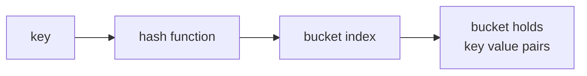

# Chapter 9 — Maps

> **What you'll learn.** Go's built-in hash table: how to create, read, write, and
> delete entries; the comma-ok idiom; why iteration order is random on purpose;
> what may be used as a key; and the traps — a nil-map write panics, values are
> not addressable, and maps are not safe for concurrent use.

In C there is no built-in hash table. You either hand-roll one (an array of
buckets, a hash function, linked lists for collisions) or pull in a library. Go
builds the hash table into the language as the **map**, written `map[K]V`: a
collection of key-value pairs with average `O(1)` lookup, insert, and delete.

## Creating a map

A map type is `map[K]V`: `K` is the key type, `V` is the value type. You create
one with `make` or a literal.

```go
// make: an empty, ready-to-use map
ages := make(map[string]int)

// literal: create and fill in one step
caps := map[string]string{
	"France": "Paris",
	"Japan":  "Tokyo", // the trailing comma is required by gofmt
}

// empty literal: same as make(map[string]int)
empty := map[string]int{}
```

> **C vs Go.** Think of `map[string]int` as a generic, type-safe version of a C
> hash table where the keys are strings and the values are ints — but you write
> no hashing, no buckets, no collision lists, and no resize logic. It is all in
> the runtime.



Internally a map is an array of **buckets**. The runtime hashes the key to pick a
bucket, then checks the keys in that bucket (collisions land in the same bucket).
As the map fills, it grows and rehashes. You never see any of this; the diagram
is just so you know what is under the hood:

```
   ages := map[string]int{"alice":30, "bob":25, "carol":40}

   hash("alice") -> bucket 0      hash("bob")   -> bucket 2
   hash("carol") -> bucket 0  (collision: shares bucket 0 with alice)

   buckets
   ┌─────┬───────────────────────────────┐
   │  0  │  alice=30 , carol=40           │   <- two keys, same bucket
   ├─────┼───────────────────────────────┤
   │  1  │  (empty)                       │
   ├─────┼───────────────────────────────┤
   │  2  │  bob=25                        │
   └─────┴───────────────────────────────┘
```

## Basic operations

```go
m := make(map[string]int)

m["alice"] = 30          // set (insert or overwrite)
m["alice"] = 31          // overwrite: now 31

age := m["alice"]        // get: 31
n := len(m)              // number of entries: 1

delete(m, "alice")       // remove the entry; no-op if the key is absent
clear(m)                 // remove ALL entries (Go 1.21+)
```

- **Set:** `m[k] = v` inserts the pair, or replaces the value if `k` already
  exists.
- **Get:** `v := m[k]` reads the value.
- **`delete(m, k)`** removes the entry. Deleting a missing key does nothing (no
  error, no panic). `delete` on a nil map is also a safe no-op.
- **`len(m)`** is the number of entries. There is no `cap` for maps.
- **`clear(m)`** empties the map in one call (Go 1.21+). Before 1.21 you looped
  with `delete`.

## A missing key returns the zero value

Reading a key that is **not** in the map is not an error. Go returns the **zero
value** of the value type (Chapter 4 — Types, Variables, and Constants): `0` for
`int`, `""` for `string`, `false` for `bool`, `nil` for pointers and slices.

```go
m := map[string]int{"alice": 31}
fmt.Println(m["alice"])   // 31
fmt.Println(m["bob"])     // 0  -- "bob" is absent, so you get the zero int
```

This is convenient but ambiguous: if `m["bob"]` is `0`, you cannot tell whether
`"bob"` is **absent** or **present with the value 0**. That is what the comma-ok
idiom solves.

### The comma-ok idiom

A map read can return a **second** boolean value: `true` if the key was present,
`false` if it was absent.

```go
v, ok := m["bob"]
if ok {
	fmt.Println("bob is present, value =", v)
} else {
	fmt.Println("bob is absent") // v is the zero value here
}
```

> **Rule of thumb.** Use the one-value form `v := m[k]` when the zero value is a
> fine answer for "missing." Use the two-value form `v, ok := m[k]` whenever you
> must tell "absent" apart from "present but zero" — for example a map of counts,
> scores, or flags where `0`/`false` is a real value.

A common pattern is to act only when a key is missing:

```go
if _, ok := m[key]; !ok {
	m[key] = compute(key) // fill it in the first time we see it
}
```

## The zero value of a map is nil — and writing to it panics

A declared-but-not-made map is `nil`. Reading a nil map is safe (every key is
"absent," so you get zero values). **Writing to a nil map panics at runtime.**

```go
var m map[string]int     // nil map (no hash table allocated yet)

fmt.Println(m["x"])      // 0    -- reading nil is fine
fmt.Println(len(m))      // 0    -- fine
_, ok := m["x"]          // ok == false, fine

m["x"] = 1               // PANIC: assignment to entry in nil map
```

The fix is to allocate the map with `make` (or a literal) before writing:

```go
m = make(map[string]int) // now it is a real, writable map
m["x"] = 1               // fine
```

> **C vs Go.** A nil map is like a NULL pointer to your hash table: you can ask
> "is anything there?" and get "no," but you cannot store into it until you
> allocate the structure. Unlike a nil **slice**, which you *can* `append` to, a
> nil **map** must be `make`-d before its first write.

> **Watch out.** This bites most often with struct fields and maps inside maps. A
> freshly zero-valued struct has its map fields set to nil; you must `make` them
> before writing. Same for `m[k]` when the value type is itself a map.

## Iteration order is randomized on purpose

You loop over a map with `range`, which yields `(key, value)` pairs:

```go
for k, v := range m {
	fmt.Println(k, v)
}
```

The **order is not defined, and Go deliberately randomizes it** on every run. This
is intentional: it stops programs from accidentally depending on an order the map
does not promise. If you need a stable order, **collect the keys and sort them.**

```go
import (
	"fmt"
	"slices"
)

func printSorted(m map[string]int) {
	keys := make([]string, 0, len(m)) // pre-size to avoid reallocation
	for k := range m {                // range with one variable = keys only
		keys = append(keys, k)
	}
	slices.Sort(keys)                 // sort the keys (Go 1.21+)
	for _, k := range keys {
		fmt.Println(k, m[k])
	}
}
```

Since Go 1.23 you can do the same in one line with iterators:

```go
import (
	"maps"
	"slices"
)

for _, k := range slices.Sorted(maps.Keys(m)) {
	fmt.Println(k, m[k])
}
```

> **C vs Go.** A C hash table you wrote yourself probably iterated buckets in some
> fixed internal order, which felt stable but was an accident of the
> implementation. Go makes the randomness explicit so you never lean on it.

## Keys must be comparable

A key type must support `==` and `!=`. The runtime uses equality to find a key
within its bucket. So:

- **Allowed keys:** all numbers, `string`, `bool`, pointers, channels,
  interfaces, and **structs or arrays whose fields/elements are all comparable.**
- **Forbidden keys:** `slice`, `map`, and `func` — these are not comparable, and
  using one as a key is a **compile error**.

```go
type point struct{ X, Y int } // all fields comparable -> usable as a key

grid := map[point]string{
	{0, 0}: "origin",
	{1, 2}: "somewhere",
}
fmt.Println(grid[point{0, 0}]) // "origin"

// bad := map[[]int]string{}   // compile error: invalid map key type []int
```

> **Watch out.** A struct used as a key is compared **field by field**. Two keys
> are the "same" only if every field is equal. If the struct contains a
> non-comparable field (like a slice), the whole struct becomes unusable as a key
> and you get a compile error.

## Maps are reference-like

A map value is a small header that points at the underlying hash table (much like
a slice points at a backing array). When you pass a map to a function or assign
it to another variable, you copy the *header*, not the table — both names refer
to the **same** map. Changes through one are visible through the other.

```go
func addOne(m map[string]int, key string) {
	m[key]++ // edits the caller's map; no pointer needed
}

func main() {
	counts := map[string]int{}
	addOne(counts, "hits")
	addOne(counts, "hits")
	fmt.Println(counts["hits"]) // 2
}
```

> **C vs Go.** You do not pass `*map[K]V` to let a function mutate a map; passing
> the map by value already shares the underlying table. (You would only take a
> pointer to a map in the rare case you need to *replace the whole map* and have
> the caller see the new one.)

## Maps are not safe for concurrent use

A map is **not** protected against concurrent access. If one goroutine writes to
a map while another reads or writes the **same** map, the runtime may detect it
and crash the whole program with a fatal error:

```
fatal error: concurrent map read and map write
```

This is not a recoverable panic — it stops the process. To share a map across
goroutines, guard it with a `sync.Mutex`, or use `sync.Map` for some workloads.
Concurrency, mutexes, and `sync.Map` are covered in Chapter 15 —
Synchronization and context.

> **Watch out.** Concurrent-only-reads are fine; the danger is a write happening
> at the same time as any other access. The race detector (`go test -race`,
> Chapter 22 — Tooling) finds these bugs quickly.

## The set idiom (Go has no built-in set)

Go has no built-in set type, but a map gives you one. Two common spellings:

```go
// Option A: map to bool — simple and readable
seen := map[string]bool{}
seen["a"] = true
if seen["a"] {            // missing keys read as false, which is what you want
	fmt.Println("a is in the set")
}
delete(seen, "a")

// Option B: map to empty struct — uses zero bytes per value
set := map[string]struct{}{}
set["a"] = struct{}{}
_, exists := set["a"]     // membership via comma-ok
```

`struct{}` is the **empty struct**: a type that occupies zero bytes. `map[K]struct{}`
stores only the keys, so it is the most memory-efficient set. `map[K]bool` is
easier to read because membership is just `if set[k]`. Either is idiomatic.

## Map values are not addressable

You cannot take the address of a map value: `&m[k]` is a **compile error**. The
reason is practical — when the map grows, it moves its entries to new memory, so
any pointer into it would dangle.

A direct consequence bites C programmers immediately: if the value type is a
**struct**, you cannot assign to one of its fields in place.

```go
type counter struct{ n int }

m := map[string]counter{"x": {}}

// m["x"].n++          // COMPILE ERROR: cannot assign to struct field m["x"].n
// p := &m["x"]        // COMPILE ERROR: cannot take the address of m["x"]

fmt.Println(m["x"].n)  // reading a field is fine
```

You have two clean fixes:

```go
// Fix 1: read the whole value, modify the copy, write it back.
v := m["x"]
v.n++
m["x"] = v

// Fix 2: store POINTERS as the values. Then the value IS a pointer, and the
// thing it points at is freely mutable.
m2 := map[string]*counter{"x": {}}
m2["x"].n++            // OK: m2["x"] is a *counter; this edits the pointed-to struct
fmt.Println(m2["x"].n) // 1
```

> **Rule of thumb.** If you will frequently mutate the values in place, make the
> value type a pointer (`map[K]*V`). If the values are small and you mostly read
> or replace them wholesale, `map[K]V` with the read-modify-write pattern is
> simpler and avoids extra allocations.

## Key takeaways

- A map `map[K]V` is Go's built-in hash table: average `O(1)` get/set/delete, with
  no hashing or bucket code to write yourself. Create it with `make` or a literal.
- Operations: `m[k] = v` (set), `v := m[k]` (get), `v, ok := m[k]` (comma-ok),
  `delete(m, k)`, `len(m)`, and `clear(m)` (Go 1.21+).
- A **missing key returns the zero value**, not an error. Use comma-ok to tell
  "absent" from "present but zero."
- A map's zero value is **nil**. Reading nil is safe; **writing to nil panics.**
  Always `make` (or use a literal) before the first write.
- **Iteration order is randomized** deliberately. To get order, collect keys and
  `slices.Sort` them (or `slices.Sorted(maps.Keys(m))` on Go 1.23+).
- **Keys must be comparable** (`==`). Numbers, strings, bools, pointers, and
  comparable structs/arrays are fine; slices, maps, and funcs are not.
- Maps are **reference-like**: passing one to a function shares the same
  underlying table, so the function can mutate it without a pointer.
- Maps are **not safe for concurrent use**; a concurrent read+write triggers a
  fatal runtime error. Use a mutex or `sync.Map` (Chapter 15 — Synchronization
  and context).
- A **set** is a map: `map[T]bool` (readable) or `map[T]struct{}` (zero-size
  values).
- **Map values are not addressable.** `m[k].field = x` and `&m[k]` do not compile.
  Replace the whole value, or use `map[K]*V`.

## Watch out (gotchas for C programmers)

- **Writing to a nil map panics** (`assignment to entry in nil map`). Unlike a nil
  slice — which you can `append` to — a nil map must be `make`-d first.
- **`m[k]` never fails for a missing key.** It returns the zero value, so `0` or
  `""` may mean "absent" *or* "really zero." Use `v, ok := m[k]` when it matters.
- **Iteration order changes every run.** Never rely on it; sort keys when you need
  order, especially in tests and printed output.
- **Map values are not addressable.** You cannot do `&m[k]` or assign to
  `m[k].field`. Use read-modify-write or `map[K]*V`.
- **Maps are not concurrency-safe.** A simultaneous read and write is a fatal
  error that kills the process, not a recoverable panic. Protect shared maps.
- **Bad key types fail at compile time.** Slices, maps, and functions cannot be
  keys; a struct key with any non-comparable field is rejected too.
- **`len(m)` exists but there is no `cap(m)`**, and you cannot pre-size a map's
  contents the way you size a slice (though `make(map[K]V, hint)` gives a capacity
  *hint* to reduce rehashing).

## Interview questions

**Q: What does reading a key that is not in the map return, and how do you detect
a missing key?**
A: It returns the zero value of the value type (for example `0`, `""`, `false`, or
`nil`) and does not error. To distinguish "absent" from "present with a zero
value," use the comma-ok form `v, ok := m[k]`, where `ok` is `true` only if the
key exists.

**Q: What happens if you write to a nil map, and how is that different from a nil
slice?**
A: Writing to a nil map panics at runtime with "assignment to entry in nil map";
you must `make` the map (or use a literal) before the first write. Reading a nil
map is safe and returns zero values. A nil slice is friendlier: you can `append`
to it directly, because `append` allocates a backing array as needed.

**Q: Why is map iteration order randomized, and how do you iterate in a defined
order?**
A: The Go runtime randomizes iteration order on purpose so programs cannot
accidentally depend on an order the map never guarantees. To iterate in order,
copy the keys into a slice, sort the slice (`slices.Sort`, or
`slices.Sorted(maps.Keys(m))` on Go 1.23+), and then range over the sorted keys.

**Q: Why can't you write `m[k].field = x` when the value is a struct?**
A: Map values are not addressable, because the runtime may relocate entries when
the map grows, which would invalidate any pointer into it. Since you cannot take
the address of `m[k]`, you cannot assign to a field of it in place. Either read
the value into a variable, modify it, and assign it back (`v := m[k]; v.field = x;
m[k] = v`), or store pointers as the values (`map[K]*V`) so the value itself is an
addressable pointer.

**Q: Are Go maps safe to use from multiple goroutines?**
A: No. Concurrent reads alone are fine, but a write happening at the same time as
any other read or write is a data race; the runtime often detects it and aborts
the program with a fatal "concurrent map read and map write" error. Protect a
shared map with a `sync.Mutex`/`sync.RWMutex`, or use `sync.Map` for workloads it
suits (see Chapter 15 — Synchronization and context).

**Q: What types can be used as map keys?**
A: Any comparable type — one that supports `==`. That includes all numeric types,
strings, booleans, pointers, channels, interfaces, and structs or arrays composed
entirely of comparable types. Slices, maps, and functions are not comparable and
cannot be keys; a struct containing such a field cannot be a key either, and using
one is a compile error.

## Try it

1. Build a word-frequency counter: read a string, split it on spaces, and count
   each word in a `map[string]int` with `counts[w]++`. Then print the words in
   sorted order. Notice that `counts[w]++` works even the first time, because the
   missing key reads as `0`.
2. Declare `var m map[string]int` and try `m["x"] = 1`. Watch it panic. Add
   `m = make(map[string]int)` before the write and watch it succeed.
