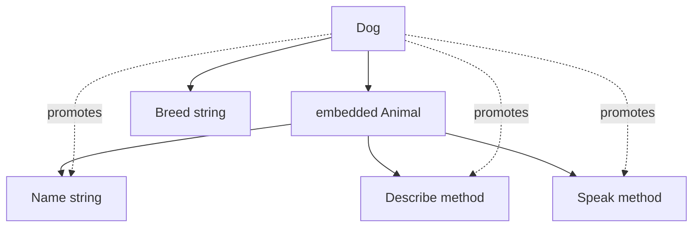

# Chapter 10 — Structs and Methods

> **What you'll learn.** How Go structs compare to C structs (layout, padding,
> copying, comparison), how to attach *methods* to a type, when to use a value
> versus a pointer receiver, and how *embedding* gives you composition — which is
> not the same as inheritance.

A Go `struct` is the same idea as a C `struct`: a fixed group of named fields laid
out in memory in declared order. If you understand C structs, you already
understand most of this. Go then adds three things C does not have: **methods**
(functions attached to a type), **visibility by capitalization** (see Chapter 3 —
Program Structure: Packages, Imports, and Visibility), and **embedding** (one
struct reusing another). This chapter walks each one, always against the C you
know.

## Declaring a struct

```c
/* C */
struct circle {
    double x, y;   /* center */
    double radius;
};
```

```go
// Go
type Circle struct {
	X, Y   float64 // center
	Radius float64
}
```

The shape is the same. The differences are small but real:

- The type keyword is `type Name struct { ... }`, and the **field type comes after
  the field name** (`Radius float64`, not `float64 Radius`).
- Fields starting with an **uppercase** letter are *exported* (visible to other
  packages); lowercase fields are package-private. This is Go's `static`, decided
  by spelling, not a keyword (Chapter 3).
- There is no trailing semicolon and no separate `typedef` — `type Circle struct`
  both declares the layout and names the type.

## Creating struct values

A **struct literal** builds a value. Go has two forms.

```go
c1 := Circle{0, 0, 5}               // positional: order must match the fields
c2 := Circle{X: 0, Y: 0, Radius: 5} // named: clear, order-free, robust
c3 := Circle{Radius: 5}             // omitted fields take the zero value
```

> **Rule of thumb.** Prefer the **named** form (`Circle{Radius: 5}`). The
> positional form breaks silently if someone reorders or adds a field, and it is
> unreadable for anything past two fields. Go even lets you *omit* fields you do
> not set; they get the zero value.

### The zero-value struct

In C, a local `struct circle c;` contains garbage until you set it. In Go a
declared struct is **fully zeroed**: every numeric field is `0`, every string
`""`, every pointer, slice, and map `nil`, every bool `false` (see Chapter 4 —
Types, Variables, and Constants).

```go
var c4 Circle // {0, 0, 0} — ready to use, never garbage
```

> **C vs Go.** C's `struct circle c = {0};` is the closest analog, but you must
> *remember* to write it. In Go the zero value is automatic and guaranteed.
> Idiomatic Go leans on this: design a struct so its zero value is already useful
> (a `bytes.Buffer{}` is an empty, ready buffer; a `sync.Mutex{}` is unlocked).

### `new`, anonymous structs, and nesting

`new(T)` allocates a zeroed `T` and returns a `*T` (a pointer). `&Circle{...}`
does the same and lets you set fields at once; the second form is far more common.

```go
p := new(Circle)        // *Circle, all fields zero
q := &Circle{Radius: 5} // *Circle, Radius set — the usual way
```

An **anonymous struct** has no named type. It is handy for a one-off grouping, for
example a table-driven test row or a small JSON shape.

```go
point := struct{ X, Y int }{X: 1, Y: 2}
```

Structs **nest** by value, exactly like C: the inner struct's bytes live *inside*
the outer struct, not behind a pointer.

```go
type Point struct{ X, Y float64 }
type Segment struct {
	Start Point
	End   Point
}
s := Segment{Start: Point{0, 0}, End: Point{3, 4}}
```

### Field tags (a preview)

A **field tag** is a string literal after a field. The compiler ignores it;
libraries read it by reflection. The most common use is `encoding/json`:

```go
type User struct {
	Name  string `json:"name"`
	Email string `json:"email,omitempty"` // skip this key if the field is empty
}
```

You will see this in detail in Chapter 20 — Standard Library Tour. For now just
note: tags are metadata, and only **exported** fields are visible to `json` and
similar packages.

## Memory layout: just like C

A Go struct is laid out in memory in **declared field order**, with **padding**
inserted so each field meets its alignment requirement — the same rules a C
compiler follows. You can inspect it with the `unsafe` package.

```go
import "unsafe"

type Bad struct {
	a bool  // 1 byte
	b int64 // 8 bytes (wants 8-byte alignment)
	c bool  // 1 byte
}
type Good struct {
	b int64 // 8 bytes
	a bool  // 1 byte
	c bool  // 1 byte
}

unsafe.Sizeof(Bad{})  // 24
unsafe.Sizeof(Good{}) // 16
```

`Bad` wastes 8 bytes purely on padding. Here is why, byte by byte:

```
Bad{a bool; b int64; c bool}  ->  24 bytes

byte:  0    1 2 3 4 5 6 7      8 .......... 15     16    17 ........ 23
      +---+----------------+ +----------------+ +---+ +----------------+
      | a |  padding (7)   | |   b  (int64)   | | c | |  padding (7)   |
      +---+----------------+ +----------------+ +---+ +----------------+
       ^   b must start on an 8-byte boundary    ^  tail padding so the
       offset 0                                  offset 16   size is a multiple of 8

Good{b int64; a bool; c bool}  ->  16 bytes

byte:  0 .......... 7      8    9    10 ......... 15
      +----------------+ +---+ +---+ +----------------+
      |   b  (int64)   | | a | | c | |  padding (6)   |
      +----------------+ +---+ +---+ +----------------+
```

By moving the big field first you remove a hole. **You can reorder fields to
shrink a struct** — exactly the trick you would use in C. Useful tools:

- `unsafe.Sizeof(x)` — total bytes, including padding.
- `unsafe.Alignof(x)` — required alignment (the largest field's alignment).
- `unsafe.Offsetof(s.field)` — byte offset of a field inside the struct.

> **Rule of thumb.** Do not obsess over field order. Reorder only for structs you
> allocate in huge numbers (millions), where the savings matter. Otherwise, order
> fields for readability. Reading sizes with `unsafe.Sizeof` is harmless and is a
> compile-time constant; only `unsafe` *pointer conversions* are risky, and you
> will rarely need them.

## Comparing and copying structs

Two struct values are equal with `==` if **all their fields are equal** — a
field-by-field comparison, no `memcmp` needed. This works only when every field is
itself comparable.

```go
a := Point{1, 2}
b := Point{1, 2}
a == b // true
```

If a struct contains a non-comparable field (a slice, a map, or a function), the
compiler **rejects** `==` outright:

```go
type Bag struct{ items []int }
// Bag{} == Bag{}
// compile error: struct containing []int cannot be compared
```

Assignment and argument passing **copy the whole struct**, every byte, just like
C. There are no hidden references.

```go
c := a // c is an independent copy
c.X = 99
// a.X is still 1
```

> **C vs Go.** This matches C's value semantics. `f(c)` passes a *copy*; to let a
> function modify the original (or to avoid copying a large struct), pass a pointer
> `f(&c)` — the same choice you make in C. See Chapter 7 — Pointers.

## Methods

A **method** is a function with a *receiver*: an extra parameter written *before*
the function name. Think of the receiver as C's explicit `self` pointer, but the
language wires it up for you and lets you call with dot syntax.

```c
/* C: a free function takes the struct explicitly */
double circle_area(const struct circle *c) {
    return 3.14159 * c->radius * c->radius;
}
/* call: circle_area(&c); */
```

```go
// Go: the receiver (c Circle) is bound before the name
func (c Circle) Area() float64 {
	return math.Pi * c.Radius * c.Radius
}
// call: c.Area()
```

### Value receiver vs pointer receiver

The receiver can be a **value** (`c Circle`) or a **pointer** (`c *Circle`). The
difference is the same as passing a struct by value versus by pointer in C.

```go
func (c Circle) Area() float64 { // value receiver: gets a COPY
	return math.Pi * c.Radius * c.Radius
}

func (c *Circle) Scale(f float64) { // pointer receiver: can mutate the original
	c.Radius *= f
}
```

| Question | Value receiver `(c T)` | Pointer receiver `(c *T)` |
|---|---|---|
| Sees a copy or the original? | a copy | the original |
| Can it mutate the receiver? | no (changes are lost) | yes |
| Cost for a big struct | copies every byte | copies one pointer |
| C analog | `f(struct T x)` | `f(struct T *x)` |

Use a **pointer receiver** when any of these is true:

1. The method must **modify** the receiver.
2. The struct is **large** and you want to avoid copying it on every call.
3. The type contains something that must not be copied (for example a
   `sync.Mutex`; see Chapter 15 — Synchronization and Context).

> **Rule of thumb.** **If any method of a type needs a pointer receiver, give
> *all* its methods pointer receivers.** Mixing the two is a common source of
> confusion and method-set surprises (Chapter 11 — Interfaces). Consistency wins.

### Go takes the address for you

In C you must write `circle_area(&c)` or `c->scale(...)` yourself. In Go, if a
value is **addressable** (a variable, a struct field, a slice element), the
compiler inserts the `&` or `*` automatically:

```go
c := Circle{Radius: 2} // c is a value, not a pointer
c.Scale(3)             // Go rewrites this as (&c).Scale(3)

p := &Circle{Radius: 1} // p is a pointer
p.Area()                // Go rewrites this as (*p).Area()
```

So `c.Method()` works whether `c` is a `Circle` or a `*Circle`. The one case where
it fails: a value that has no address (such as a map element, or a literal) cannot
have a pointer-receiver method called on it, because there is nothing to take the
address of.

## Methods on any named type

Methods are **not** limited to structs. You can attach a method to *any named
type* you declare — an integer, a float, a slice, a function type. This is
something C cannot express at all.

```go
type Celsius float64

func (c Celsius) String() string {
	return fmt.Sprintf("%.1f deg C", float64(c))
}

fmt.Println(Celsius(100)) // prints: 100.0 deg C
```

A method named `String() string` is special by convention: it satisfies the
`fmt.Stringer` interface, so `fmt` uses it when printing (Chapter 11). The one
rule: you may only define methods on types declared **in your own package** — you
cannot bolt a method onto `int` or onto a type from another package.

## Constructors: a convention, not a keyword

Go has **no constructors** and no `new`-with-arguments like C++. There is nothing
to override and nothing that runs "automatically." When a type needs setup beyond
its zero value, the convention is a plain function named `NewType` that returns the
value (usually a pointer):

```go
type Buffer struct {
	data []byte
	max  int
}

func NewBuffer(max int) *Buffer {
	return &Buffer{
		data: make([]byte, 0, max),
		max:  max,
	}
}

buf := NewBuffer(4096)
```

> **Rule of thumb.** If a type's zero value already works, do **not** write a
> constructor — let callers say `var b Buffer`. Add `NewBuffer` only when you must
> allocate, validate, or set non-zero defaults.

## Embedding: composition, not inheritance

You can declare a field with **no name** — just a type. That is **embedding**. The
embedded type's fields and methods are *promoted*: you can reach them on the outer
struct as if they were declared there.

```go
type Animal struct {
	Name string
}

func (a Animal) Describe() string { return a.Name + " is an animal" }
func (a Animal) Speak() string    { return "..." }

type Dog struct {
	Animal // embedded: no field name, just the type
	Breed  string
}

d := Dog{Animal: Animal{Name: "Rex"}, Breed: "Labrador"}
d.Name        // "Rex"           promoted FIELD
d.Describe()  // "Rex is an..."  promoted METHOD
```



Under the hood, `Dog` simply *contains* an `Animal` value (its bytes are inside the
`Dog`). Promotion is a compiler convenience: `d.Name` is shorthand for
`d.Animal.Name`. Nothing is virtual, and there is no hidden base-class pointer.

### Shadowing (the closest thing to "override")

If the outer type defines a method with the **same name**, that method *shadows*
the promoted one. The embedded method is still reachable by naming the field.

```go
func (d Dog) Speak() string { return d.Name + " says woof" }

d.Speak()        // "Rex says woof"  -> Dog's method wins
d.Animal.Speak() // "..."            -> the embedded one, explicitly
```

> **C vs Go.** This *looks* like inheritance, but it is not. Embedding is
> **composition**: a `Dog` *has an* `Animal`, it is not a *kind of* `Animal`.
> Crucially, there is **no subtype polymorphism**: a function that takes an
> `Animal` will **not** accept a `Dog`. Promotion is resolved at compile time by
> name, not by a runtime vtable. The only polymorphism Go offers is **interface
> satisfaction** (Chapter 11). When `Dog` shadows `Speak`, code that holds a plain
> `Animal` keeps calling `Animal.Speak` — there is no virtual dispatch that would
> reach `Dog.Speak`.

| Concept | C++ inheritance | Go embedding |
|---|---|---|
| Relationship | `Dog` *is a* `Animal` | `Dog` *has an* `Animal` |
| Method dispatch | virtual (runtime vtable) | static (compile-time name lookup) |
| Pass `Dog` where base wanted | yes (slicing risks) | no (use an interface instead) |
| "Override" | virtual override | shadow by same-named method |

You can also **embed an interface** (in a struct or in another interface) to
require or forward a set of methods; we cover that in Chapter 11 — Interfaces.

> **C vs Go.** C has neither methods nor inheritance: for "polymorphism" you build
> a struct of function pointers plus a `void *self` (think `struct
> file_operations`). Go's *methods* replace the function pointers; Go's
> *interfaces* (Chapter 11) replace the `void *self`, type-safely; and embedding
> assembles behavior by *including* other types instead of forwarding calls by hand.

## Key takeaways

- A Go struct is a C struct plus methods, capitalization-based visibility, and
  embedding. Layout, padding, and value-copy semantics match C.
- Prefer **named** struct literals; rely on the **zero value** instead of writing
  needless constructors. Use `NewType` only when setup is required.
- Fields are laid out in declared order with padding; reorder big-volume structs
  (large field first) to shrink them. Inspect with `unsafe.Sizeof`/`Alignof`/`Offsetof`.
- `==` compares all fields and works only if every field is comparable; assignment
  copies the whole struct.
- A **method** has a receiver. Use a **pointer receiver** to mutate, to avoid
  copying a large struct, or for consistency — and if one method needs a pointer
  receiver, make them all pointer receivers.
- Go auto-takes the address of an addressable value, so `c.Method()` works for both
  values and pointers.
- Methods can be defined on **any named type**, not just structs.
- **Embedding is composition, not inheritance.** Fields and methods are promoted at
  compile time; there is no subtype polymorphism except interface satisfaction.

## Watch out (gotchas for C programmers)

- **Value vs pointer receiver confusion.** A value-receiver method gets a *copy*;
  mutating the receiver does nothing to the caller's value. If a method must change
  the struct, it needs a pointer receiver.
- **Do not copy a struct that contains a `sync.Mutex`** (or any field that embeds
  a lock). Copying the lock copies a bug. `go vet` flags this: *"passes lock by
  value ... contains sync.Mutex."* Pass such structs by pointer.
- **Embedding is not inheritance.** A `Dog` is not an `Animal`; you cannot pass it
  where an `Animal` is required, and shadowing a method does not give you virtual
  dispatch.
- **Comparing structs with non-comparable fields fails to compile**, not at
  runtime. A struct holding a slice, map, or function cannot use `==`.
- **Large-struct copies are silent.** Passing a big struct by value copies every
  byte on each call. Pass a pointer when the struct is large or hot.
- **Positional literals are fragile.** Adding or reordering a field silently
  changes what `T{a, b, c}` means. Use named fields.

## Interview questions

**Q: When should a method use a pointer receiver instead of a value receiver?**
A: Use a pointer receiver when the method must modify the receiver, when the struct
is large enough that copying it on every call is wasteful, or when the type
contains something that must not be copied (such as a `sync.Mutex`). A common rule
is: if any method of the type needs a pointer receiver, give all of them pointer
receivers for consistency and to keep the method set uniform.

**Q: What does it mean that "assignment copies a struct," and how is that different
from C++ references or Java objects?**
A: Assigning or passing a struct value copies every field, byte for byte, like C.
There is no implicit reference or shared object: changing the copy does not affect
the original. To share or mutate, you pass a pointer explicitly. Java object
variables are references by default; Go struct variables are values by default.

**Q: Is Go embedding the same as inheritance?**
A: No. Embedding is composition: the outer type *contains* the embedded type, and
its fields and methods are *promoted* (resolved at compile time by name). There is
no base-class pointer and no virtual dispatch. A type that embeds `Animal` is not a
subtype of `Animal` and cannot be used where an `Animal` is expected. The only
polymorphism in Go is interface satisfaction.

**Q: Why might two structs with the same fields and values fail to compile when
compared with `==`?**
A: Because `==` on a struct requires every field to be comparable. If any field is
a slice, a map, or a function, the type is not comparable and the compiler rejects
`==`. You must compare such structs field by field with custom logic (for example
`reflect.DeepEqual` or a hand-written `Equal` method).

**Q: How do you shrink a struct's memory footprint, and how do you measure it?**
A: Reorder fields so larger-aligned fields come first, which removes padding holes
the compiler would otherwise insert to satisfy alignment. Measure with
`unsafe.Sizeof` for total size, `unsafe.Alignof` for alignment, and
`unsafe.Offsetof` for individual field offsets. This matters mainly for structs
allocated in very large quantities.

## Try it

1. Declare `type Pixel struct { R, G, B uint8; A uint8 }` and print
   `unsafe.Sizeof(Pixel{})`. Now insert a `float64` field between `R` and `G` and
   print the size again. Explain the jump using the alignment rules.
2. Give `Pixel` a value-receiver method `Lighten()` that adds to each channel, call
   it, and observe that the original is unchanged. Switch it to a pointer receiver
   and watch the change stick.
