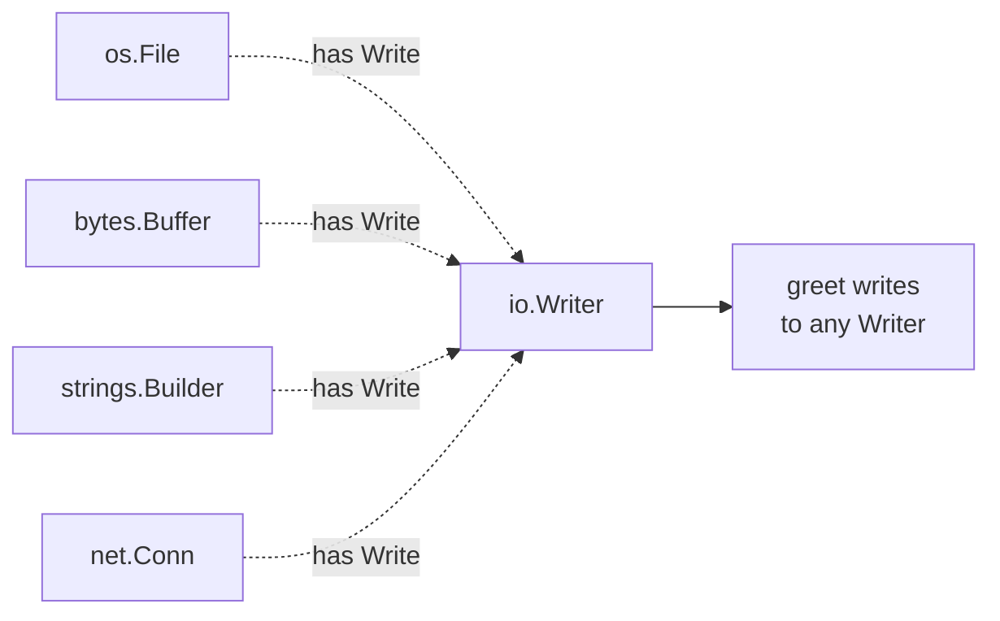

# Chapter 11 — Interfaces

> **What you'll learn.** What a Go interface is, why a type satisfies it *without
> any `implements` keyword*, how an interface value is a `(type, value)` fat
> pointer, how to use `any`, type assertions, and type switches, and the two traps
> that bite everyone: method sets and the nil-interface bug.

In C, when you want one piece of code to work with many concrete types, you build a
**struct of function pointers** plus a `void *self` to carry the data — think
`struct file_operations` in the Linux kernel. You fill in the function pointers for
each implementation, then call through them. It works, but it is manual and not
type-safe: nothing stops you from pairing the wrong `self` with the wrong
functions.

A Go **interface** is exactly that pattern, made first-class and type-safe. This is
one of the most important ideas in the language, and the chapter where Go stops
looking like "C with garbage collection" and starts paying off.

## What an interface is

An interface is a **set of method signatures** — a list of methods a type must
have, with no implementation. The classic small example:

```go
type Stringer interface {
	String() string
}
```

This says: "a `Stringer` is anything that has a method `String()` returning a
`string`." It does not say *which* types; it describes a *capability*.

```c
/* The C version: a struct of function pointers + a self pointer */
struct stringer {
    void *self;
    const char *(*to_string)(void *self);
};
```

| Concept | C (function-pointer struct) | Go interface |
|---|---|---|
| Declares required behavior | by hand, field by field | `type I interface { ... }` |
| Carries the data | a separate `void *self` | built in (the value half of the pair) |
| Type safety | none (`void *`) | full, checked by the compiler |
| First-class value | awkward | yes — pass it, store it, return it |

## Implicit satisfaction: no `implements` keyword

Here is the rule that surprises every newcomer: **a type satisfies an interface
just by having the required methods.** There is no `implements`, no `: public`, no
declaration of intent anywhere. If `Celsius` has a `String() string` method, then
`Celsius` *is* a `Stringer` — automatically.

```go
type Celsius float64

func (c Celsius) String() string {
	return fmt.Sprintf("%.1f deg C", float64(c))
}

var s Stringer = Celsius(100) // works: Celsius has String(), so it satisfies Stringer
```

The satisfaction is checked by the **compiler**, at the **point of use** — the line
where you assign or pass the concrete type as the interface. If a method is missing
or has the wrong signature, the build fails right there, naming the problem.

> **C vs Go.** In C you wire the function pointers together by hand and hope you
> got it right. In Go the compiler does the wiring and verifies it. An interface is
> the **type-safe, first-class version of a C vtable**. Because no type has to
> *announce* which interfaces it implements, you can define a new interface and
> have existing types (even ones from the standard library) satisfy it without
> touching their code.

> **Mental model.** An interface describes a *shape of behavior*. Any type with
> that shape fits the hole, the way any object with the right outline fits a
> cut-out — no label required.

## An interface value is a `(type, value)` pair

This is the part C programmers must internalize. An interface value is **not** just
a pointer to data. It is **two words**: a pointer to type-and-method information,
and a pointer to (or copy of) the concrete value. People call it a *fat pointer* or
a `(type, value)` pair.

```
   var w io.Writer = os.Stdout

         w  (two machine words)
   +-------------+-------------+
   |    type     |    data     |
   +-------------+-------------+
         |             |
         |             +---> the *os.File value for stdout (the concrete data)
         |
         +---> itable: the concrete type (*os.File) PLUS a method table
               { Write -> (*os.File).Write, ... }
```

The first word points to an **itable** ("interface table"): it records the concrete
type and holds the addresses of the methods that satisfy the interface — exactly a
vtable. The second word points to the data. Calling `w.Write(p)` follows the itable
to the right function and runs it. That is **dynamic dispatch**, the same mechanism
as a C++ virtual call or a C function-pointer call, but safe and automatic.

The **zero value of any interface is `nil`**: both words are zero.

```go
var w io.Writer // nil: (type=nil, data=nil)
w == nil        // true
```

Remember this two-word picture. The infamous nil-interface bug at the end of the
chapter is a direct consequence of it.

## The empty interface: `any`

An interface with **no methods** is satisfied by *every* type (every type has at
least zero methods). Go calls it `any`, which is an alias for `interface{}`.

```go
var x any        // can hold anything
x = 42
x = "hello"
x = Celsius(20)
```

> **C vs Go.** `any` is Go's `void *`, but it remembers the real type inside the
> pair, so it stays type-safe: you cannot misuse the value without first asking
> what it is. Use `any` **sparingly** — it throws away the static checking that
> makes Go pleasant. Reach for a real interface, or generics (Chapter 19 —
> Generics), before falling back to `any`.

To get the concrete value back out, you **assert** its type.

### Type assertions

```go
var i any = "hello"

s := i.(string)  // single value: panics if i is not a string
fmt.Println(s)   // hello

n, ok := i.(int) // comma-ok: never panics
fmt.Println(n, ok) // 0 false  -> wrong type, n is the zero value, ok is false
```

> **Watch out.** The single-value form `i.(int)` **panics** at runtime if the type
> does not match: `panic: interface conversion: interface {} is string, not int`.
> Use the **comma-ok** form `v, ok := i.(T)` whenever you are not certain. The
> compiler does not catch a bad assertion; it fails at run time.

### Type switches

To branch on the concrete type, use a **type switch** — a `switch` whose cases are
types. The variable `v` takes the matched type in each case.

```go
func classify(i any) string {
	switch v := i.(type) {
	case nil:
		return "nil"
	case int:
		return fmt.Sprintf("int %d", v) // v is an int here
	case string:
		return fmt.Sprintf("string len %d", len(v)) // v is a string here
	case Stringer:
		return "stringer: " + v.String() // matches anything with String()
	default:
		return fmt.Sprintf("other %T", v)
	}
}
```

`%T` in `fmt` prints the dynamic type — your best friend when debugging interface
values.

## Interfaces you will meet everywhere

Three small interfaces from the standard library show up constantly.

**`error`** — the whole basis of Go error handling (Chapter 12 — Errors):

```go
type error interface {
	Error() string
}
```

**`fmt.Stringer`** — how a type controls its own printed form:

```go
type Stringer interface {
	String() string
}
```

**`io.Writer` and `io.Reader`** — the universal "stream of bytes" plugs:

```go
type Writer interface {
	Write(p []byte) (n int, err error)
}
type Reader interface {
	Read(p []byte) (n int, err error)
}
```

Because satisfaction is implicit, *one* function written against `io.Writer` works
with a file, an in-memory buffer, a network socket, a gzip stream, an HTTP response
— anything with a `Write` method:

```go
func greet(w io.Writer, name string) {
	fmt.Fprintf(w, "Hello, %s\n", name)
}

greet(os.Stdout, "stdout")       // *os.File
var buf bytes.Buffer
greet(&buf, "buffer")            // *bytes.Buffer
var sb strings.Builder
greet(&sb, "builder")            // *strings.Builder
```



Two pieces of hard-won Go wisdom about interfaces:

- **Keep interfaces small.** One to three methods is ideal; `io.Writer` has one.
  The smaller the interface, the more types satisfy it and the more reusable your
  code is. ("The bigger the interface, the weaker the abstraction.")
- **Define an interface in the package that *consumes* it**, not next to the types
  that implement it. The consumer states the behavior it needs; any provider that
  has those methods fits, with no import dependency pointing the wrong way. (This
  is also how you break import cycles — see Chapter 3 — Program Structure:
  Packages, Imports, and Visibility.)

> **Rule of thumb.** A common Go motto is **"accept interfaces, return structs."**
> Take the smallest interface you need as a parameter (so callers can pass
> anything), but return concrete types (so callers get the full, documented type).

## Method sets: which types satisfy an interface

This is the most common interface gotcha, and it ties back to value vs pointer
receivers from Chapter 10 — Structs and Methods.

A type's **method set** is the set of methods you can call on it through an
interface. The rule:

- The method set of **`T`** includes only its **value-receiver** methods.
- The method set of **`*T`** includes **both** value- and pointer-receiver methods.

So if a method is declared with a **pointer receiver**, only **`*T`** has it in its
method set — and therefore **only `*T` satisfies an interface that requires it**.

```go
type Greeter interface{ Greet() string }

type Person struct{ Name string }

func (p *Person) Greet() string { return "Hi, " + p.Name } // POINTER receiver

var g Greeter
g = &Person{Name: "Sam"} // OK: *Person has Greet
// g = Person{Name: "Sam"} // COMPILE ERROR:
//   Person does not implement Greeter (method Greet has pointer receiver)
```

The error message even tells you why: *"method Greet has pointer receiver."* The
fix is to use a pointer (`&Person{...}`), or — if it is safe — to switch the method
to a value receiver.

> **Watch out.** Why can `T` *not* borrow the pointer methods? Because to call a
> pointer-receiver method, Go needs the value's **address**, and an arbitrary
> interface value may hold an unaddressable copy. So the language simply leaves
> pointer methods out of `T`'s method set. This is the deep reason behind the
> Chapter 10 advice: **pick one receiver kind per type.**

## The nil-interface trap (the #1 interface bug)

Recall that an interface is a `(type, value)` pair, and it is `nil` only when
**both** halves are nil. An interface that holds a **nil pointer of a concrete
type** is **not** nil — its type half is set.

```go
type MyError struct{ Msg string }

func (e *MyError) Error() string { return e.Msg }

// BUG: this returns a non-nil error even when nothing failed.
func doThing() error {
	var p *MyError // p is a nil *MyError
	// ... no failure, p stays nil ...
	return p // returns interface (type=*MyError, value=nil) — NOT nil!
}

func main() {
	err := doThing()
	fmt.Println(err == nil) // prints: false   <-- surprise and bug
}
```

`p` is a nil pointer, but the moment it is stored in the `error` interface, the
interface's *type* word becomes `*MyError`. The pair is `(*MyError, nil)`, which is
**not** equal to `(nil, nil)`. So `err != nil`, and every `if err != nil` check
upstream fires on a "success."

```
return nil (literal):     (type=nil,      value=nil)   -> == nil is TRUE
return p   (nil *MyError): (type=*MyError, value=nil)   -> == nil is FALSE
```

The fix is to **return the untyped `nil` literal** on success, never a typed nil
pointer:

```go
func doThing() error {
	if somethingFailed() {
		return &MyError{Msg: "boom"}
	}
	return nil // correct: the literal nil, type half stays empty
}
```

> **Rule of thumb.** Functions that return `error` should `return nil` directly on
> success. Never declare `var err *MyConcreteError` and return it; assign and
> return only when you actually have an error. This single rule prevents the most
> confusing bug in Go.

## The compile-time satisfaction check

Because satisfaction is implicit, nothing forces a type to *prove* it implements an
interface until someone uses it that way. To assert it on purpose — and get a clear
compile error if you break it — use this zero-cost idiom:

```go
var _ io.Writer = (*bytes.Buffer)(nil)
var _ fmt.Stringer = Celsius(0)
```

Each line declares a throwaway variable (`_` discards it) of the interface type and
assigns a nil concrete value. It emits **no runtime code**; it just makes the
compiler verify, right there, that `*bytes.Buffer` is an `io.Writer` and `Celsius`
is a `fmt.Stringer`. Put it next to a type to document intent and to fail fast if a
method signature ever drifts.

## Embedding interfaces

Interfaces can **embed** other interfaces to compose a larger set of methods. The
standard library does this constantly:

```go
type Reader interface{ Read(p []byte) (int, error) }
type Writer interface{ Write(p []byte) (int, error) }

// ReadWriter requires BOTH Read and Write.
type ReadWriter interface {
	Reader
	Writer
}
```

A type satisfies `ReadWriter` if it has both `Read` and `Write`. This is the same
composition idea as struct embedding (Chapter 10), applied to method sets. You can
also embed an interface in a *struct* to forward its methods — useful for wrappers
that override one method and pass the rest through.

## Key takeaways

- An interface is a **set of method signatures** — a capability, not a concrete
  type. It is the type-safe, first-class version of a C struct of function pointers.
- **Satisfaction is implicit:** a type implements an interface by having the
  methods. There is no `implements` keyword; the compiler checks at the point of
  use.
- An interface value is a **`(type, value)` pair** (a fat pointer: itable + data).
  Its zero value is `nil`; method calls dispatch dynamically through the itable.
- `any` (alias for `interface{}`) holds any value. Use it sparingly. Recover the
  concrete value with a **type assertion** `v, ok := i.(T)` or a **type switch**.
- The single-value assertion `i.(T)` **panics** on mismatch; the comma-ok form does
  not.
- Favor **small interfaces** (1–3 methods) and **define them in the consumer**
  package. "Accept interfaces, return structs."
- **Method sets:** `*T` has value- and pointer-receiver methods; `T` has only
  value-receiver methods. A pointer-receiver method means only `*T` satisfies the
  interface.
- The **nil-interface trap:** an interface holding a typed nil pointer is **not**
  `nil`. Return the literal `nil` for success.

## Watch out (gotchas for C programmers)

- **A nil interface is not the same as an interface holding a nil pointer.** The
  pair `(type=*T, value=nil)` is not equal to `nil`. This is the #1 interface bug;
  always `return nil` literally on success.
- **Value vs pointer method sets.** If a method has a pointer receiver, a *value*
  of the type does not satisfy the interface — only a pointer does. Pass `&x`, not
  `x`.
- **Overusing `any`.** It is `void *` with a memory of the type, but it discards
  Go's static checking and pushes errors to run time. Prefer a real interface or
  generics.
- **Type assertion without comma-ok panics.** `i.(T)` crashes at run time on a
  wrong type; use `v, ok := i.(T)` unless a mismatch truly should abort.
- **Interfaces add a small indirection.** A method call through an interface is a
  dynamic dispatch (a pointer hop), slightly slower than a direct call. It is
  cheap, but do not wrap a hot inner loop in an interface out of habit.

## Interview questions

**Q: How does a type implement an interface in Go, and how is that different from
Java or C++?**
A: Implicitly. A type satisfies an interface simply by having all the required
methods; there is no `implements` or inheritance declaration. Satisfaction is
verified by the compiler at the point where the concrete type is used as the
interface. In Java/C++ a class must explicitly declare the interfaces or base
classes it implements; in Go the relationship is structural and requires no
coordination between the interface and the type.

**Q: What is an interface value made of?**
A: Two words: a pointer to an itable (which identifies the concrete type and holds
the method addresses that satisfy the interface) and a pointer to the concrete
data. It is a fat pointer, a `(type, value)` pair. The zero value is nil, meaning
both words are zero. Calling a method dispatches through the itable, like a vtable.

**Q: Why can an interface that "contains nil" still be non-nil?**
A: Because an interface is nil only when both its type and value words are nil. If
you store a nil pointer of a concrete type (say a `*MyError`) in an `error`, the
type word is set to `*MyError`, so the interface is `(*MyError, nil)`, which is not
equal to nil. The fix is to return the untyped `nil` literal on success rather than
a typed nil pointer.

**Q: A value of type `T` won't satisfy an interface, but `*T` does. Why?**
A: Because the method that satisfies the interface uses a pointer receiver, and
pointer-receiver methods are only in the method set of `*T`, not `T`. To call a
pointer-receiver method, Go needs the value's address; an interface may hold an
unaddressable copy, so the language excludes pointer methods from `T`'s method set.
Pass a pointer (`&x`) to satisfy the interface.

**Q: When should you use `any` versus a specific interface or generics?**
A: Use a specific small interface when you need a known behavior (a few methods).
Use generics when you need the same logic across many types while keeping full type
safety (Chapter 19). Reserve `any` for genuinely heterogeneous data where the type
is unknown until run time (for example decoding arbitrary JSON), and pair it with
type assertions or a type switch. Overusing `any` discards Go's compile-time
checking.

## Try it

1. Write `type Shape interface { Area() float64 }`. Make `Rectangle` and `Circle`
   satisfy it (value receivers). Put both in a `[]Shape` and sum their areas in a
   loop — one loop, two concrete types, no type switch needed.
2. Now add a pointer-receiver method to `Rectangle` and try to store a
   `Rectangle` value (not a pointer) in a `Shape`. Read the compiler error, then
   fix it with `&`.
3. Write a function returning `error` that declares `var e *MyErr` and returns
   `e`. Print `err == nil` and watch it say `false`. Fix it by returning the
   literal `nil`.
