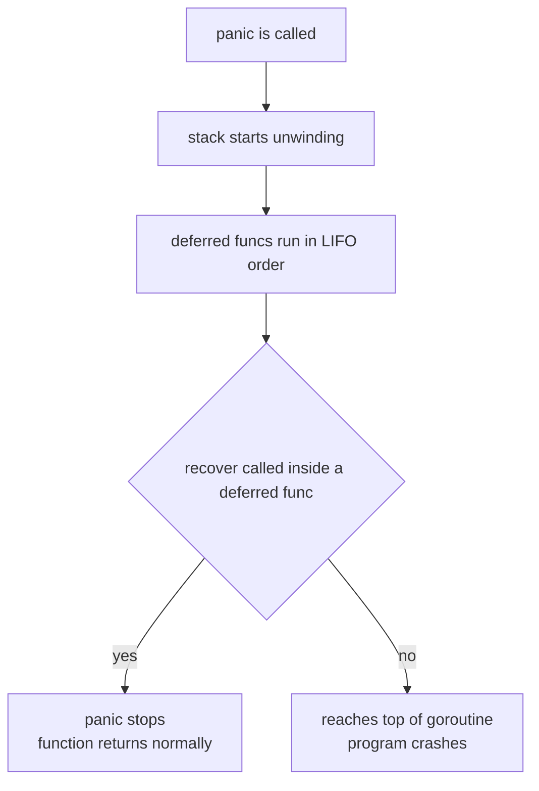

# Chapter 12 — Errors

> **What you'll learn.** Why Go has no exceptions, and treats errors as ordinary
> values you check by hand. How to create, wrap, and inspect errors, and how
> `panic`/`recover`/`defer` work for the rare cases where a value will not do.

In C, a function that can fail tells you in one of two ways: it returns a special
value (a negative number, a `NULL` pointer, a non-zero status), and it may also
set the global `errno`. You then check the return value and decide what to do.

Go keeps the spirit of that approach and cleans it up. A function that can fail
returns an extra value of type `error`. You check it right away. There is **no
`try`/`catch`**, no stack-unwinding exception for ordinary failures. This chapter
is about that model and the small standard library that supports it.

## An error is just an interface

`error` is not a special language feature. It is a normal interface, declared in
the language itself:

```go
type error interface {
	Error() string
}
```

That is the whole definition. Any type with a method `Error() string` *is* an
`error`. (Interfaces are covered in Chapter 11 — Interfaces; the short version is:
a type satisfies an interface just by having the right methods, with no
`implements` keyword.)

Because `error` is an interface, an error is a **value**. You can store it in a
variable, put it in a struct, pass it to a function, compare it, and return it.
The zero value of any interface is `nil`, and `nil` means "no error."

> **Mental model.** An `error` is like a C `int` status code that also knows how
> to describe itself. Instead of returning `-1` and making the caller look up what
> `-1` means, the function returns a value whose `Error()` method spells out what
> went wrong.

### Why values, not exceptions

C++ and Java use *exceptions*: a failure deep in the call stack `throw`s, the
stack unwinds automatically, and some `catch` far away handles it. The control
flow is invisible at the call site — you cannot tell by reading `x = parse(s)`
whether it might jump somewhere else.

Go's designers chose explicit values on purpose:

| Topic | C | C++/Java | Go |
|---|---|---|---|
| Signal failure | return code + `errno` | `throw` an exception | return an `error` value |
| Control flow | explicit, local | hidden jumps up the stack | explicit, local |
| Can you ignore it | yes, silently | no (it propagates) | yes, but you must do it on purpose |
| Carries a message | no (just a number) | yes | yes |
| Carries more data | no | yes (exception object) | yes (custom error type) |

The trade-off: Go code has many `if err != nil` blocks. In exchange, the control
flow is always visible. You can see exactly where each failure is handled, and the
compiler does not let a failure path silently skip your code.

> **C vs Go.** `errno` is one global, shared by the whole thread; you must read it
> *immediately*, before the next library call overwrites it. A Go `error` is a
> return value tied to that one call. There is no global to clobber and no race to
> read it in time.

## The core idiom: check `err` immediately

Almost every Go function that can fail returns the error **last**:

```go
f, err := os.Open("config.txt")
if err != nil {
	return err // cannot continue; hand the error back to the caller
}
defer f.Close() // runs when this function returns (see Chapter 6 — Functions)
// ... use f ...
```

The pattern is always the same: call the function, then immediately test
`if err != nil`. You check right away because the other returned values are not
trustworthy when `err` is non-`nil`. Above, `f` is only valid if `err` is `nil`.

> **Rule of thumb.** Handle the error where you get it: return it, wrap it (below),
> log it, or recover from it. Do not stash it in a variable and "deal with it
> later." Later never comes, and the next call may overwrite the good value.

The result is Go's typical shape: a short happy path down the left margin, with
small `if err != nil { return ... }` blocks branching off it. That is normal and
idiomatic — not a code smell.

## Creating errors

### `errors.New` and `fmt.Errorf`

The two basic constructors live in the `errors` and `fmt` packages:

```go
import (
	"errors"
	"fmt"
)

err1 := errors.New("disk is full")             // a fixed message
err2 := fmt.Errorf("cannot open %s", filename) // a formatted message
```

`errors.New` makes an error from a fixed string. `fmt.Errorf` works like
`printf`: it formats a message and returns it as an error. Use `fmt.Errorf` when
the message needs runtime data (a filename, an index, a count).

### Sentinel errors

A **sentinel error** is a known error value, exported so callers can test for it
by identity. It is Go's version of a named status code like `EOF` or `ENOENT`:

```go
package store

import "errors"

// ErrNotFound is returned when a key does not exist.
var ErrNotFound = errors.New("not found")

func Get(key string) (string, error) {
	v, ok := lookup(key)
	if !ok {
		return "", ErrNotFound
	}
	return v, nil
}
```

The caller compares against the sentinel (with `errors.Is`, shown below) to react
to that specific case. The standard library does this everywhere: `io.EOF`,
`sql.ErrNoRows`, `os.ErrNotExist`.

### Custom error types that carry data

Sometimes a message is not enough — you want to attach structured data. Because
`error` is just an interface, you make your own type and give it an `Error()`
method:

```go
type HTTPError struct {
	Code int
	URL  string
}

func (e *HTTPError) Error() string {
	return fmt.Sprintf("request to %s failed with status %d", e.URL, e.Code)
}

func fetch(url string) error {
	// ...
	return &HTTPError{Code: 404, URL: url}
}
```

Now a caller can extract the `Code` field and branch on it (with `errors.As`,
below). This is like defining a C struct for richer error context, except the
value also formats itself for printing.

> **Watch out.** `Error()` is usually defined on the **pointer** receiver
> (`*HTTPError`), so the value that satisfies `error` is `*HTTPError`, not
> `HTTPError`. Keep this consistent or callers will be confused about which one to
> use.

## Wrapping errors: adding context

A bare error like `not found` is useless if you cannot tell *what* was not found.
As an error travels up through many functions, each layer can add context by
**wrapping** it. Wrapping keeps the original error inside the new one, like nested
boxes.

The `%w` verb in `fmt.Errorf` wraps:

```go
func loadConfig(path string) error {
	data, err := os.ReadFile(path)
	if err != nil {
		return fmt.Errorf("loadConfig %s: %w", path, err) // %w wraps err
	}
	// ...
	return nil
}
```

`%w` ("wrap") stores the inner error inside the new one and adds its message to
the front. `%v` would only copy the text; `%w` keeps the actual value reachable.
The result is a **chain** of errors, much like a singly linked list:

```
error value (a chain, like a linked list):

  *fmt.wrapError              *fmt.wrapError              *errors.errorString
  +---------------------+     +---------------------+     +-------------------+
  | msg: read config:.. |     | msg: open file:..   |     | s: not found      |
  | err ----------------+---> | err ----------------+---> | (nothing wrapped) |
  +---------------------+     +---------------------+     +-------------------+
        Unwrap --------------->     Unwrap --------------->      nil
```

`errors.Unwrap` follows one link; `errors.Is` and `errors.As` (below) walk the
whole chain to the end. Printing the outer error prints the whole chain joined by
`: ` — `read config: open settings.json: not found`.

### Walking the chain: `Unwrap`, `Is`, `As`

Three helpers in the `errors` package work on the chain:

- **`errors.Unwrap(err)`** returns the next error inside, or `nil` at the end. You
  rarely call it directly; the next two are what you use day to day.
- **`errors.Is(err, target)`** reports whether `target` appears *anywhere* in the
  chain. Use it to match a sentinel.
- **`errors.As(err, &target)`** searches the chain for an error of a given *type*,
  and if found, copies it into `target`. Use it to extract a custom error type.

```go
err := loadConfig("settings.json")

// Match a sentinel anywhere in the chain:
if errors.Is(err, os.ErrNotExist) {
	fmt.Println("config file is missing; using defaults")
}

// Extract a typed error from anywhere in the chain:
var httpErr *HTTPError
if errors.As(err, &httpErr) {
	fmt.Println("HTTP status was", httpErr.Code)
}
```

Here is a complete, runnable example of a chain and matching through it:

```go
package main

import (
	"errors"
	"fmt"
)

var ErrNotFound = errors.New("not found")

func findFile() error {
	return fmt.Errorf("open settings.json: %w", ErrNotFound)
}

func readConfig() error {
	if err := findFile(); err != nil {
		return fmt.Errorf("read config: %w", err)
	}
	return nil
}

func main() {
	err := readConfig()
	fmt.Println(err) // read config: open settings.json: not found

	if errors.Is(err, ErrNotFound) {
		fmt.Println("the file was not found") // this prints
	}
}
```

> **Watch out.** When errors may be wrapped, compare with `errors.Is(err, ErrX)`,
> **not** `err == ErrX`. The `==` test only checks the outermost error; if the
> sentinel was wrapped, `==` returns `false` and you miss the case. `errors.Is`
> walks the whole chain.

### When to add context, and when not to

Wrap to add information the caller does not already have: which file, which key,
which step failed. Do **not** wrap just to repeat what the inner error already
says, and do not start the message with "error" or "failed to" — that text piles
up into noise like `error: failed to: error: ...`.

```go
// Good: adds the path, which the inner error did not know.
return fmt.Errorf("read config %s: %w", path, err)

// Noisy: adds nothing and stutters when printed.
return fmt.Errorf("error: failed: %w", err)
```

> **Rule of thumb.** Each layer adds one short noun phrase of context, lowercase,
> no trailing punctuation: `"parse header: %w"`. Read the final chain out loud; it
> should be a clear breadcrumb trail from outer to inner.

### Joining multiple errors: `errors.Join`

Sometimes you collect several independent failures and want to report all of them
at once — for example, validating many fields. `errors.Join` (added in Go 1.20)
combines them into one error:

```go
func validate(name, email string) error {
	var errs []error
	if name == "" {
		errs = append(errs, errors.New("name is empty"))
	}
	if email == "" {
		errs = append(errs, errors.New("email is empty"))
	}
	return errors.Join(errs...) // returns nil if errs is empty
}
```

The joined error prints each message on its own line, and `errors.Is`/`errors.As`
look inside every joined error, not just one. `errors.Join` returns `nil` when all
its arguments are `nil`, so the happy path needs no special case.

## `panic`, `recover`, and `defer`

For ordinary, expected failures you return an `error`. For the rare, *truly
broken* situations Go has `panic`. A `panic` is closer to `abort()` in C than to a
C++ exception: it means "this program has reached a state that should be
impossible."

### What `panic` does

When you call `panic(value)`:

1. The current function stops.
2. The stack **unwinds**: Go runs every `defer`red function in the current
   goroutine, in last-in-first-out order, as each frame is torn down.
3. If nothing stops it, the program prints the panic value and a stack trace, and
   **exits with a non-zero status**.



You also get a panic from the runtime for programmer bugs: a `nil` pointer
dereference, an out-of-range slice index, or an integer divide by zero. These are
the Go equivalent of a segfault, except Go tells you exactly what happened and
where.

### `recover` stops a panic

`recover` is a builtin that stops a panic in progress. It is **only meaningful
inside a deferred function**. Called there during a panic, it returns the panic
value and lets the function return normally. Called anywhere else, it returns
`nil` and does nothing.

```go
package main

import "fmt"

// safeDivide turns a divide-by-zero panic into a normal error value.
func safeDivide(a, b int) (result int, err error) {
	defer func() {
		if r := recover(); r != nil {
			err = fmt.Errorf("recovered: %v", r) // sets the named return
		}
	}()
	result = a / b // panics if b == 0
	return result, nil
}

func main() {
	q, err := safeDivide(10, 0)
	fmt.Println(q, err) // 0 recovered: runtime error: integer divide by zero
}
```

This works because the deferred closure can assign to the **named return value**
`err` (named returns are covered in Chapter 6 — Functions). The panic unwinds into
the deferred function, `recover` catches it, and the function returns cleanly.

### Recover only at a boundary

Do not sprinkle `recover` everywhere. Use it at a **boundary** where one failing
task must not take down the whole process: an HTTP request handler, or a worker
goroutine in a pool. The pattern is the same deferred closure:

```go
func handle(w http.ResponseWriter, r *http.Request) {
	defer func() {
		if rec := recover(); rec != nil {
			log.Printf("handler panic: %v", rec)
			http.Error(w, "internal server error", http.StatusInternalServerError)
		}
	}()
	doWork(w, r) // if this panics, one request fails, not the server
}
```

The standard library's HTTP server already does this for you, but you must add
the guard yourself for your own worker goroutines.

### When to panic, and when not to

> **Rule of thumb.** Return an `error` for anything a caller might reasonably want
> to handle — a missing file, bad input, a failed network call. Reserve `panic`
> for *impossible* states and programmer bugs that mean the program is unsafe to
> continue.

A common, accepted use is a `Must`-style helper for setup that should never fail,
such as compiling a constant regular expression at startup:

```go
// MustCompile panics if the pattern is invalid. Used for compile-time-constant
// patterns, where a failure means the program itself is wrong.
var emailRE = regexp.MustCompile(`^[^@]+@[^@]+$`)
```

If the pattern is wrong, the program cannot work at all, so failing loudly at
startup is correct.

### Two things that will surprise a C programmer

> **Watch out.** `os.Exit` does **not** run deferred functions. It stops the
> program immediately, skipping every `defer`. Use it only when you truly want an
> abrupt exit (and have already flushed/closed what matters). Returning from
> `main`, or panicking, *does* run defers.

> **Watch out.** An **unrecovered panic in any goroutine crashes the whole
> program** — even if `main` and every other goroutine are fine. You cannot
> recover a panic from *outside* the goroutine that panicked; each goroutine must
> guard itself with its own deferred `recover`. (Goroutines are covered in Chapter
> 13 — Goroutines and the Scheduler.)

## Don't ignore errors

A returned error you never look at is a silent bug. Beware: unlike an unused
*variable*, an unused *return value* is **not** a compile error. You can call a
function and drop its error with no warning. So be deliberate — when you really do
mean to ignore an error, say so with the blank identifier `_`:

```go
_ = os.Remove(tmpfile) // intentionally ignore: best-effort cleanup
```

Writing `_ =` documents that ignoring was a choice, not an oversight. The `go vet`
tool and linters such as `errcheck` flag the errors you forgot. Silently dropping
an error is the Go equivalent of ignoring a `-1` return in C — and just as likely
to bite you later.

## Key takeaways

- `error` is an ordinary interface: `type error interface { Error() string }`.
  Errors are **values**, returned last, and checked with `if err != nil`.
- Go has no exceptions for normal failures. Control flow stays explicit and local,
  unlike C++/Java `throw`/`catch`.
- Create errors with `errors.New` and `fmt.Errorf`. Use **sentinel** errors for
  known cases and **custom types** to carry structured data.
- Wrap with `fmt.Errorf("context: %w", err)` to build a chain. Match a sentinel
  with `errors.Is`, extract a type with `errors.As`, and combine many with
  `errors.Join`.
- `panic` unwinds the stack running `defer`s; `recover` (only inside a deferred
  function) stops it. Use `panic` only for unrecoverable states and programmer
  bugs, never for ordinary errors.
- Recover at boundaries (handlers, worker goroutines). A panic in *any* goroutine
  with no `recover` crashes the whole program.

## Watch out (gotchas for C programmers)

- **Ignoring an error is silent.** There is no warning unless a linter is run.
  Write `_ = f()` to ignore on purpose; otherwise handle it.
- **Shadowing `err` with `:=`.** Inside a nested block, `x, err := f()` may create
  a *new* `err` that hides the outer one, so the outer check sees a stale value.
  Use `=` (not `:=`) when `err` already exists, and heed `go vet`'s shadow checks.
- **Typed-nil error trap.** A non-`nil` interface can hold a `nil` pointer. If a
  function returns `error` but you give it a `*MyError` variable that is `nil`, the
  returned `error` is **not** `nil` (its type is set), so `if err != nil` is true.
  Return a literal `nil`, not a nil typed pointer. (See Chapter 11 — Interfaces.)
- **Use `errors.Is`, not `==`,** when an error might be wrapped. `==` checks only
  the outermost value and will miss a wrapped sentinel.
- **`panic` in a goroutine crashes everything.** Each goroutine needs its own
  deferred `recover`; you cannot catch another goroutine's panic.
- **`recover` only works inside a deferred function.** Calling it directly in the
  body returns `nil` and does nothing.
- **`os.Exit` skips `defer`.** Anything you deferred (closing files, flushing
  buffers) will not run.

## Interview questions

**Q: Why does Go use error values instead of exceptions?**
A: To keep control flow explicit and local. A function returns an `error` as its
last result, and the caller checks it right there with `if err != nil`. There are
no hidden jumps up the stack, so you can always see where a failure is handled.
The cost is more `if err != nil` blocks; the benefit is readable, predictable
control flow.

**Q: What is the difference between `errors.Is` and `errors.As`?**
A: `errors.Is(err, target)` tests whether a specific error *value* (usually a
sentinel) appears anywhere in the wrapped chain. `errors.As(err, &target)`
searches the chain for an error of a specific *type* and, if found, assigns it to
`target` so you can read its fields. Use `Is` to match identity, `As` to extract a
typed error.

**Q: What does `%w` do in `fmt.Errorf`, and why prefer it over `%v`?**
A: `%w` wraps: it stores the inner error inside the new one and keeps the original
value reachable, building a chain. `%v` only copies the inner error's text, losing
the value. Use `%w` so callers can still match the cause with `errors.Is` or
`errors.As`; use `%v` only when you deliberately want to hide the cause.

**Q: When should you use `panic` instead of returning an error?**
A: Almost never for expected failures. Return an `error` for anything a caller
might handle (bad input, missing file, network failure). Use `panic` only for
truly unrecoverable states or programmer bugs — impossible conditions, failed
startup invariants — where continuing would be unsafe. `Must`-style setup helpers
that fail loudly at startup are an accepted use.

**Q: How does `recover` work, and what are its limits?**
A: `recover` stops a panic, but only when called inside a deferred function during
the panic; elsewhere it returns `nil`. It catches a panic only in its **own**
goroutine — an unrecovered panic in any other goroutine crashes the whole program.
It is typically used at a boundary (an HTTP handler or worker goroutine) to keep
one failing task from taking down the process.

**Q: What is the typed-nil error trap?**
A: An interface value is `nil` only when both its type and value are `nil`. If a
function declares a return type of `error` but returns a typed pointer such as a
`*MyError` that happens to be `nil`, the interface's type field is set, so the
returned `error` is non-`nil`. The caller's `if err != nil` is then true even
though "there was no error." Fix it by returning a literal `nil`.

## Try it

1. Write `find(key string) (int, error)` that returns a sentinel `ErrMissing`
   when the key is absent. Wrap it in a caller with
   `fmt.Errorf("loading %s: %w", key, err)`, then confirm
   `errors.Is(err, ErrMissing)` is still true through the wrap.
2. Change the wrap from `%w` to `%v` and watch `errors.Is` start returning
   `false`. That one-character difference is the whole point of wrapping.
