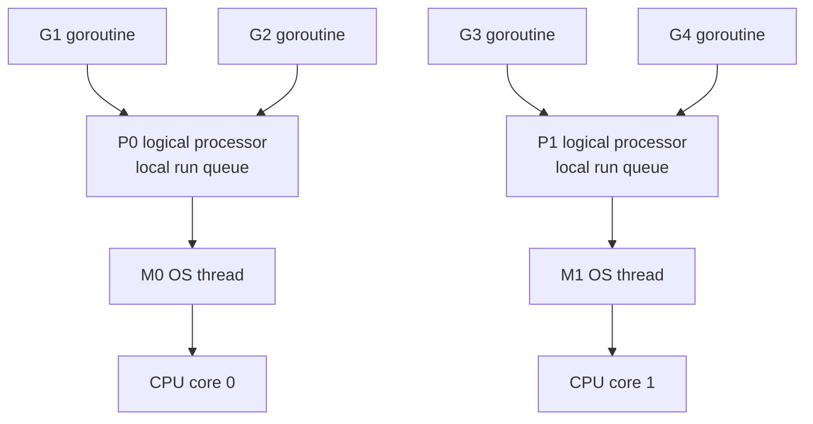

# Chapter 13 — Goroutines and the Scheduler

> **What you'll learn.** What a goroutine is, why it is far cheaper than an OS
> thread, and how Go's runtime schedules millions of them onto a few threads with
> the G-M-P model. You will also see how goroutines start, stop, grow their
> stacks, and leak — and why sharing memory without synchronization is a bug.

In C, concurrency is a *library*. You call `pthread_create` to start a thread, and
the operating system (OS) schedules it. Threads are heavy: each one reserves one or
two megabytes of stack, so you can realistically run a few thousand of them.

Go builds concurrency into the *language*. The keyword `go` starts a **goroutine**:
a function that runs concurrently with the rest of your program. Goroutines are so
cheap that running hundreds of thousands of them is normal. This chapter explains
what they are and how the Go runtime makes them so cheap.

## A goroutine is a cheap thread

A **goroutine** is a function running independently, managed by the Go *runtime*
(the support code linked into every Go program). You start one by writing `go` in
front of a function call:

```go
go f(x, y) // start f(x, y) as a goroutine; do not wait for it
```

The `go` statement returns immediately. The call to `f` runs concurrently — maybe
on another CPU core, maybe interleaved with other goroutines on the same core. Your
code does not wait for it to finish.

> **C vs Go.** `go f(x)` is the rough equivalent of packing arguments into a
> struct and calling `pthread_create` — but in one keyword, with no thread handle
> to manage and no stack size to choose.

| Concept | C (pthreads) | Go |
|---|---|---|
| Start a unit of work | `pthread_create(&t, NULL, f, arg)` | `go f(arg)` |
| Arguments | one `void *` you pack and cast | normal, typed arguments |
| Handle / id | `pthread_t t` | none |
| Wait for it to finish | `pthread_join(t, NULL)` | `sync.WaitGroup` or a channel |
| Initial stack | fixed, ~1–2 MB | ~2 KB, grows and shrinks |
| Practical count | thousands | hundreds of thousands and up |
| Scheduled by | the OS kernel | the Go runtime (user space) |

### Arguments are evaluated now; the body runs later

This detail trips up newcomers. The arguments to the function are evaluated **when
the `go` statement runs**, not when the goroutine actually starts executing. The
values are copied right away.

```go
package main

import (
	"fmt"
	"sync"
)

func main() {
	var wg sync.WaitGroup
	i := 1
	wg.Add(1)
	go func(n int) {
		defer wg.Done()
		fmt.Println("captured:", n) // n is a copy taken at the go statement
	}(i) // i is read and copied HERE, while it is 1
	i = 2
	wg.Wait()
	fmt.Println("i is now:", i)
}
```

This prints `captured: 1` then `i is now: 2`. The argument `i` was read and copied
at the `go` statement, before `i` changed.

### Waiting for a goroutine (a WaitGroup preview)

We need a way to wait for goroutines, or our examples cannot print anything
reliably (the next section explains why). The simplest tool is `sync.WaitGroup`, a
counter from the standard library:

```go
package main

import (
	"fmt"
	"sync"
)

func main() {
	var wg sync.WaitGroup
	wg.Add(1) // we will wait for one goroutine
	go func() {
		defer wg.Done() // signal "I am finished"
		fmt.Println("from the goroutine")
	}()
	fmt.Println("from main")
	wg.Wait() // block here until the counter reaches zero
}
```

A `sync.WaitGroup` counts running goroutines. `Add(n)` raises the counter, `Done`
lowers it by one (we call it with `defer` so it always runs), and `Wait` blocks
until the counter is zero. We use it here only as a way to wait; Chapter 15 — sync
and context covers it fully.

## Goroutines vs OS threads

A goroutine is **not** an OS thread. It is a much lighter object that the runtime
multiplexes onto a small pool of OS threads. This is **M:N scheduling**: M
goroutines run on N OS threads, where M can be huge and N is small.

| Property | OS thread (pthread) | Goroutine |
|---|---|---|
| Created by | the OS kernel | the Go runtime |
| Initial stack | ~1–2 MB, fixed | ~2 KB, grows and shrinks |
| Switching cost | high (a kernel trap) | low (user-space bookkeeping) |
| Scheduled by | the kernel | the Go runtime, onto threads |
| Practical count | thousands | hundreds of thousands to millions |
| Identity | thread id / handle | none |

The key number is the stack. A new goroutine starts with about 2 KB that can grow
and shrink (we explain how below). A C thread reserves its whole stack up front.
That one difference is why you can have a million goroutines but only a few
thousand threads.

> **Mental model.** Threads are like full-time employees: powerful but expensive,
> so you hire few. Goroutines are like tasks on a to-do list: you can write down a
> million, and a few workers (the threads) work through them.

## The scheduler: G, M, and P

The runtime contains a *scheduler* that decides which goroutine runs on which
thread. It uses three kinds of objects. Learn these three letters; every discussion
of Go scheduling uses them.

- **G — goroutine.** One unit of work: a stack, an instruction pointer, and a
  little bookkeeping.
- **M — machine.** One OS thread. Only an M can actually run code on a CPU. (Think
  pthread.)
- **P — processor.** A *logical* processor: the permission to run Go code, plus a
  local queue of ready goroutines. The number of P's is set by `GOMAXPROCS`, which
  defaults to the number of CPU cores.

To run a goroutine, an M must hold a P. So the number of goroutines running *at the
same instant* equals the number of P's, which is `GOMAXPROCS`. Every other ready
goroutine waits in a queue.



Each P owns a **local run queue**: a list of goroutines ready to run. There is also
one **global run queue** shared by all P's. A P takes work from its own local queue
first, because that needs no lock and is fast.

```
GOMAXPROCS = 2  =>  two P's, each with its own local run queue.

   P0  +------+------+------+      runs on M0  ->  CPU core 0
       |  G7  |  G3  |  G9  |
       +------+------+------+
                                   global run queue (shared, needs a lock)
   P1  +------+------+------+      +------+------+
       |      |      |      |      |  G2  |  G5  |
       +------+------+------+      +------+------+
        empty: M1 has nothing to do
              |
              +-- work stealing: P1 takes half of P0's queue (G9),
                  and also pulls from the global queue.
```

### Work stealing

What if one P empties its queue while another P still has a long one? The idle P
does not sit idle. It **steals** work: it takes about half of the goroutines from a
busy P's local queue. It also occasionally checks the global queue. This keeps all
CPU cores busy and balances load automatically, with no work from you.

> **C vs Go.** With raw pthreads you choose how many threads to run and how to feed
> them work — usually a thread pool plus a mutex-protected queue you write by hand.
> Go ships that whole design inside the runtime: P's are the pool slots, the run
> queues are the work queue, and work stealing balances them, for free.

You can read these numbers at run time with the `runtime` package:
`runtime.NumCPU()` is the cores the OS reports, `runtime.GOMAXPROCS(0)` is the
number of P's (by default the same value), and `runtime.NumGoroutine()` is how many
goroutines are alive right now.

## When does a goroutine yield? Scheduling points

A goroutine keeps its P until it stops or is taken away. Go uses both *cooperative*
scheduling (the goroutine gives up the P itself) and *preemptive* scheduling (the
runtime takes it away).

Cooperative points — where a goroutine voluntarily releases its P so another can
run:

- **Channel operations** that block (Chapter 14 — Channels and select).
- **Blocking system calls**, such as reading a file. The runtime detaches the P
  from the blocked M and gives it to another M, so the other goroutines keep
  running while this one waits on the OS.
- **Network I/O.** Go has a *network poller* built on `epoll`/`kqueue`/IOCP. A
  goroutine that reads a socket is *parked*; when the OS reports the socket is
  ready, the poller makes it runnable again. One thread can wait for thousands of
  connections.
- Certain runtime calls: `time.Sleep`, garbage-collection points, and
  `runtime.Gosched` (a manual "let others run").

Preemptive point — added in **Go 1.14**:

- **Asynchronous preemption.** A goroutine that runs a long loop with no function
  calls used to keep its P forever. Now the runtime can interrupt such a goroutine
  (using an OS signal) after about 10 milliseconds and reschedule it. You do not
  have to insert yield calls by hand.

> **Deep dive.** Before Go 1.14, a tight loop like `for {}` with no calls could
> freeze the scheduler running on that P. Modern Go preempts it. You may still meet
> this on very old Go versions.

## The life of a goroutine

### main is special: when it returns, everything dies

There is one goroutine you did not start: `main`. When the `main` function returns,
the **whole program exits immediately**, and every other goroutine is killed where
it stands — no warning, no cleanup.

```go
package main

import "fmt"

func main() {
	go fmt.Println("from the goroutine")
	fmt.Println("from main")
	// main returns here; the program exits at once.
}
```

Run it and you will usually see only:

```
from main
```

The goroutine often never gets the chance to print: `main` reached its end and the
process exited. This is the single most common surprise for newcomers. The fix is
to wait — for example with the `WaitGroup` shown earlier.

### No goroutine IDs, and no killing from outside

Coming from pthreads, you expect a thread handle (`pthread_t`) and a thread id.
Goroutines have **neither**. You cannot read a goroutine's id, and you cannot
cancel or kill another goroutine from the outside. There is no `pthread_cancel`.

A goroutine stops only when it **decides** to: when its function returns, or when it
notices a signal you sent it. The standard signal is a closed channel or a
cancelled `context.Context` (Chapter 15 — sync and context). The goroutine must
check for that signal itself; cancellation is *cooperative*.

> **Rule of thumb.** Design every goroutine so that something can tell it to stop,
> and so it actually checks. "Fire and forget" is how you leak goroutines.

## Stack growth

A C thread gets a fixed stack (commonly 1–8 MB) chosen when it is created. Overrun
it and you get a stack overflow and a crash.

A goroutine starts with about **2 KB** of stack. When it needs more, the runtime
allocates a bigger, **contiguous** block, copies the old stack into it, fixes up
the pointers, and continues. When the goroutine later uses less, the stack can
shrink. Both growth and shrinkage are automatic.

```
goroutine needs more stack than it has:

   before (2 KB)            after growth (4 KB, a NEW contiguous block)
   +------------+           +--------------------------+
   | frame f    |   copy    | frame f                  |
   | frame g    |  =====>   | frame g                  |
   | (full!)    |           | frame h   <- room to grow|
   +------------+           +--------------------------+
   old block freed          pointers into the stack are updated by the runtime
```

> **C vs Go.** In C you size the stack up front and hope it is enough. In Go the
> stack is elastic, so deep recursion that would overflow a small C stack simply
> grows. The price is that the runtime owns your stack layout: the address of a
> stack variable can change when the stack moves. You never notice, because Go
> updates every pointer for you.

## Goroutine leaks

A goroutine that blocks forever never goes away. It keeps its stack and everything
it references. That is a **goroutine leak** — the concurrent cousin of a memory
leak.

The classic cause is waiting on a channel that no one will ever use:

```go
package main

import "fmt"

func leak() {
	ch := make(chan int) // unbuffered channel (see Chapter 14)
	go func() {
		v := <-ch // blocks forever: nobody will ever send
		fmt.Println(v)
	}()
	// leak returns; the goroutine above is stuck and never goes away.
}

func main() {
	leak()
	fmt.Println("leak returned; the inner goroutine is now stuck forever")
}
```

`leak` returns, but the goroutine it started is parked on `<-ch` forever, because
nothing will ever send. Call `leak` a thousand times and you slowly leak memory and
goroutines. The program still exits fine here (because `main` returns), but a
long-running server would bleed resources.

> **Rule of thumb.** **Never start a goroutine without knowing how it will stop.**
> Before you type `go`, answer one question: what makes this goroutine return?
> Usually the answer is "a channel is closed" or "a context is cancelled."

## Data races: shared memory is not safe by default

Goroutines run concurrently and share one address space, exactly as pthreads share
a process's memory. So the same danger applies: if two goroutines touch the same
variable at the same time and at least one of them writes, the result is undefined.
That is a **data race**, and it is a bug even when it seems to work.

```go
package main

import (
	"fmt"
	"sync"
)

func main() {
	var wg sync.WaitGroup
	counter := 0
	for range 1000 {
		wg.Add(1)
		go func() {
			defer wg.Done()
			counter++ // DATA RACE: many goroutines write the same memory
		}()
	}
	wg.Wait()
	fmt.Println("counter =", counter) // rarely 1000
}
```

Every goroutine runs `counter++`, which is really *read, add one, write back* —
three steps that can interleave. Updates are lost, so the final value is rarely
1000. C has the identical bug with pthreads and a shared `int`.

Go ships a **race detector**. Add `-race` to find races while the program runs:

```sh
go run -race .          # run with the detector on
go test -race ./...     # test with the detector on
```

On the program above it prints `WARNING: DATA RACE` and names the two conflicting
lines. The detector has almost no false positives: if it reports a race, you have
one. We use it heavily in Chapter 16 — Concurrency Patterns.

The fix is to *synchronize* access — with a channel (Chapter 14 — Channels and
select), a `sync.Mutex`, or an atomic operation (Chapter 15 — sync and context).
The Go motto is:

> **Do not communicate by sharing memory; instead, share memory by communicating.**

In other words, prefer passing a value through a channel — handing off ownership —
over many goroutines poking the same variable behind a lock. Chapter 14 builds on
exactly this idea.

## Key takeaways

- `go f(args)` starts a goroutine. The **arguments are evaluated immediately**; the
  function body runs concurrently, possibly later.
- Goroutines are cheap: a growable ~2 KB stack, managed by the Go runtime, not the
  OS. You can run hundreds of thousands. This is **M:N scheduling**.
- The scheduler uses **G** (goroutine), **M** (OS thread), and **P** (logical
  processor; the count is `GOMAXPROCS`, by default the number of CPUs). Each P has a
  local run queue; idle P's **steal** work.
- Goroutines yield at channel operations, blocking syscalls (the P moves to another
  M), network I/O (the poller), and via **asynchronous preemption** (Go 1.14+).
- When `main` returns, the program exits and **all** goroutines die. Wait with a
  `WaitGroup` or a channel.
- There are **no goroutine IDs** and no external kill; a goroutine must cooperate
  (a closed channel or a cancelled context).
- A goroutine blocked forever is a **leak**. Never start one without knowing how it
  stops.
- Shared memory needs synchronization; find data races with `-race`.

## Watch out (gotchas for C programmers)

- **`main` returning kills every other goroutine instantly.** Output you expected
  may never appear. Wait for your goroutines.
- **Goroutine leaks.** A goroutine blocked on a channel no one will use stays
  forever and holds its memory. There is no garbage collector for stuck goroutines.
- **You cannot kill or signal a goroutine from outside.** There is no id and no
  `pthread_cancel`. Build in a stop signal (a channel or a context) and check it.
- **Unsynchronized shared variables are data races,** just as with pthreads. "It
  worked on my machine" means nothing. Run with `-race`.
- **Closures capture variables by reference.** Two goroutines sharing the same
  captured variable can race. (Loop variables are per-iteration since Go 1.22, so
  the old loop-capture bug is gone — but a shared accumulator is still a race.)
- **Do not assume any ordering.** Goroutines may run in any order, or not at all
  before `main` ends.

## Interview questions

**Q: What is a goroutine, and how is it different from an OS thread?**
A: A goroutine is a function managed by the Go runtime that runs concurrently. It
is far lighter than an OS thread: it starts with about a 2 KB stack that grows and
shrinks, while an OS thread reserves 1–2 MB up front. The runtime multiplexes many
goroutines onto a few threads (M:N scheduling), so you can run hundreds of thousands
of goroutines but only thousands of threads.

**Q: Explain the G-M-P scheduler.**
A: G is a goroutine, M is an OS thread (machine), and P is a logical processor that
holds a local run queue and is the permission to run Go code. The number of P's is
`GOMAXPROCS`, by default the number of CPU cores. An M must hold a P to run a G, so
at most `GOMAXPROCS` goroutines run at the same instant. Each P runs goroutines from
its own queue; an idle P steals work from another P or from the global queue.

**Q: When does a goroutine give up the CPU?**
A: At blocking channel operations, at blocking system calls (the runtime hands the
P to another M so other goroutines keep running), at network I/O handled by the
poller, and at certain runtime calls. Since Go 1.14 the runtime can also
asynchronously preempt a goroutine stuck in a long computation, so a tight loop no
longer starves the others.

**Q: What happens to other goroutines when `main` returns?**
A: The program exits immediately and all other goroutines are killed with no
cleanup. To make sure work finishes, the main goroutine must wait — for example
with a `sync.WaitGroup` or by receiving from a channel.

**Q: How do you stop a goroutine, and why can goroutines leak?**
A: You cannot kill a goroutine from outside; it has no id and there is no cancel
call. A goroutine stops only by returning, so you send it a signal it checks for —
typically a closed channel or a cancelled `context.Context`. If a goroutine blocks
forever (for example waiting on a channel nothing sends to), it never returns and
leaks its stack and memory. Rule: never start a goroutine without knowing how it
will stop.

**Q: What is a data race, and how do you detect one in Go?**
A: A data race is two goroutines accessing the same memory at the same time with at
least one writing, and no synchronization between them; the result is undefined.
Go's race detector finds them at run time — build, run, or test with the `-race`
flag (`go run -race`, `go test -race`). Fix races with channels, a `sync.Mutex`, or
atomic operations.

## Try it

1. Run the "from main" example. You will usually see only `from main`. Now add a
   `sync.WaitGroup` (as in the preview) and watch the goroutine's line appear every
   time.
2. Run the counter example with `go run -race .` and read the report: it names the
   exact line (`counter++`) and the two goroutines that collided.
