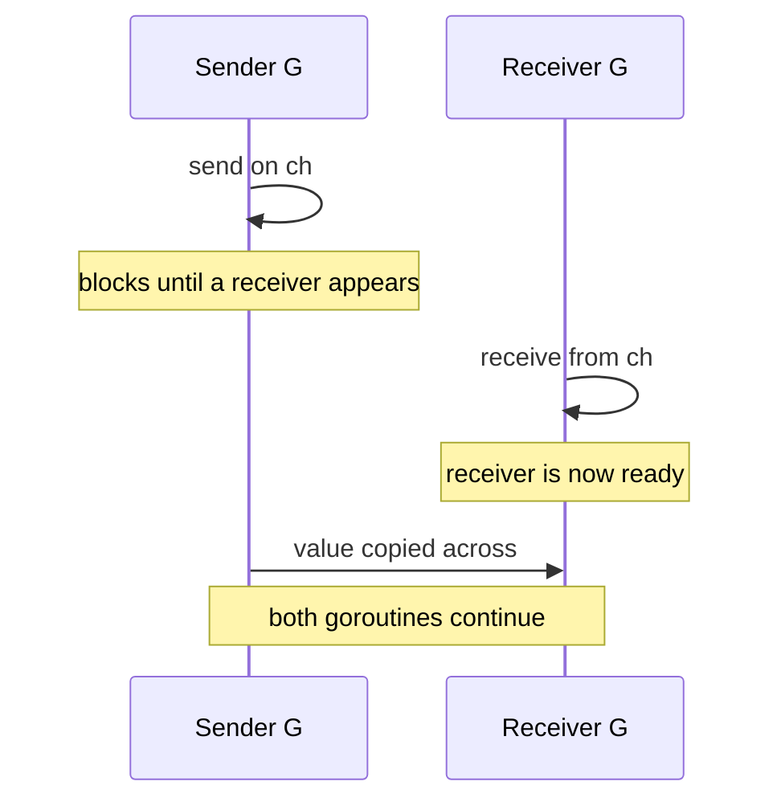

# Chapter 14 — Channels and select

> **What you'll learn.** How channels move values safely between goroutines, the
> difference between unbuffered (a rendezvous) and buffered (a small queue)
> channels, how `close` and `range` work, and how `select` waits on several
> channels at once. All of it compared to the hand-built queues you would write
> with pthreads.

In C, a thread-safe queue is something you *build*: a ring buffer, a
`pthread_mutex_t` to protect it, and one or two `pthread_cond_t` condition variables
so threads can wait for "not empty" or "not full." It is fiddly, and easy to get
wrong.

Go gives you that queue as a built-in type: the **channel**. A channel is a typed,
thread-safe *conduit* (a pipe) that carries values from one goroutine to another.
The mutex and condition variables live inside it; you never see them. Channels are
how goroutines (Chapter 13 — Goroutines and the Scheduler) talk to each other.

## Making, sending, and receiving

`make(chan T)` builds a channel that carries values of type `T`:

```go
ch := make(chan int) // a channel of int
```

There are three operations, all written with the arrow `<-`, which always points in
the direction the data moves:

```go
ch <- v       // SEND: put v into the channel
v := <-ch     // RECEIVE: take a value out of the channel
v, ok := <-ch // RECEIVE with ok: ok is false if the channel is closed and empty
close(ch)     // CLOSE: announce that no more values will be sent
```

The arrow leans **toward** the channel on a send (`ch <- v`) and **away** from it on
a receive (`<-ch`). Memorize that and the syntax reads itself.

> **C vs Go.** The closest C analog is a hand-built bounded queue: a ring buffer
> plus a mutex plus condition variables. A channel is all of that in one value:
> type-safe, with the locking built in.

## Unbuffered channels: a rendezvous

`make(chan T)` with no size is **unbuffered**. It stores nothing. A send blocks
until another goroutine is ready to receive, and a receive blocks until another
goroutine is ready to send. The two goroutines meet at the same instant and hand the
value across. That meeting is a **rendezvous** (a French word for a planned meeting).



```go
package main

import "fmt"

func main() {
	ch := make(chan int) // unbuffered
	go func() {
		ch <- 42 // blocks until main is ready to receive
	}()
	v := <-ch // blocks until the goroutine sends
	fmt.Println(v)
}
```

Because the send and the receive happen together, an unbuffered channel is also a
**synchronization point**: once the exchange completes, you know both goroutines
reached that line.

> **Watch out.** A send on an unbuffered channel with no receiver blocks forever. If
> nothing else can run, the program deadlocks (see below).

## Buffered channels: a small queue

`make(chan T, n)` with capacity `n` is **buffered**. It can hold up to `n` values. A
send blocks only when the buffer is full; a receive blocks only when it is empty. Up
to the capacity, sends and receives need not happen at the same time — the channel is
**asynchronous**.

```go
package main

import "fmt"

func main() {
	ch := make(chan string, 2) // capacity 2
	ch <- "a"                  // does not block: buffer has room
	ch <- "b"                  // does not block: buffer now full
	fmt.Println("len", len(ch), "cap", cap(ch))
	fmt.Println(<-ch, <-ch)
}
```

`len(ch)` is how many values are waiting; `cap(ch)` is the capacity. Internally the
buffer is a ring:

```
make(chan int, 4): a buffered channel is a fixed-size ring buffer.

                send here (tail)
                      |
                      v
            +-----+-----+-----+-----+
            |  a  |  b  |     |     |
            +-----+-----+-----+-----+
               ^
               |
            recv here (head)

   len = 2 (items waiting)        cap = 4 (slots)
   send: write at tail, advance tail; blocks only when full
   recv: read at head, advance head; blocks only when empty
   the head and tail wrap around the ends, so it is a ring.
```

> **Rule of thumb.** Use an unbuffered channel when you want a guarantee that the
> receiver actually took the value (a handoff). Use a small buffer to smooth bursts
> or to let a sender keep working while the receiver catches up. A buffer is not a
> fix for a logic bug; choose its size for a reason, not to silence a deadlock.

## Closing a channel

`close(ch)` marks a channel as finished: no more values will be sent. Closing is a
*message to receivers*, not a cleanup step. (Channels are garbage-collected like any
value; you do not have to close one to free it.)

The two-value receive tells you whether the channel is still open, and `range`
receives until the channel is closed and drained:

```go
package main

import "fmt"

func main() {
	ch := make(chan int, 3)
	for i := range 3 {
		ch <- i
	}
	close(ch)

	for v := range ch { // stops when the channel is closed and drained
		fmt.Println("got", v)
	}

	v, ok := <-ch // ok is false; v is the zero value
	fmt.Println("after close:", v, ok)
}
```

This prints `got 0`, `got 1`, `got 2`, then `after close: 0 false`. The behavior of
each operation depends on the channel's state:

| Operation | nil channel | open channel | closed channel |
|---|---|---|---|
| send `ch <- v` | blocks forever | blocks (or buffers) until received | **panics** |
| receive `<-ch` | blocks forever | blocks (or buffers) until a value | returns zero value at once, `ok == false` |
| `close(ch)` | **panics** | ok | **panics** |

In words:

- **Only the sender closes,** and only when it is the only sender. A receiver must
  never close: it cannot know whether more sends are coming.
- **Sending on a closed channel panics** (`panic: send on closed channel`).
- **Closing a closed or a nil channel panics** (`panic: close of closed channel`,
  `panic: close of nil channel`).
- **Receiving from a closed channel never blocks:** it returns the zero value
  immediately with `ok == false`, and a `range` loop ends.

> **C vs Go.** `close` is not `free()` or `fclose`. A channel holds no OS resource.
> Closing only signals "no more values"; the channel's memory is reclaimed by the
> garbage collector when nothing refers to it.

## Direction types in APIs

A function parameter can restrict a channel to one direction. The direction is part
of the type and checked by the compiler:

- `chan<- T` — **send-only**: you may only send (arrow points into the channel).
- `<-chan T` — **receive-only**: you may only receive (arrow points out).

```go
package main

import "fmt"

// produce only sends; the type chan<- int enforces that.
func produce(out chan<- int, n int) {
	for i := range n {
		out <- i
	}
	close(out) // the sender closes
}

// consume only receives; the type <-chan int enforces that.
func consume(in <-chan int) {
	for v := range in {
		fmt.Println("consumed", v)
	}
}

func main() {
	ch := make(chan int)
	go produce(ch, 3)
	consume(ch)
}
```

A plain `chan T` converts to either restricted form automatically when you pass it.
Direction types document intent and prevent mistakes: a producer cannot accidentally
receive, and a consumer cannot accidentally close.

> **Rule of thumb.** In public APIs, take and return directed channels (`<-chan T`
> to hand a stream to a caller, `chan<- T` to accept one). The data-flow direction
> becomes obvious, and the compiler enforces it.

## select: waiting on several channels

A `select` statement waits on several channel operations at once. It is the channel
version of C's `select()`/`poll()` on file descriptors, but for channels. Each case
is one operation — a receive, a send, or a timeout from `time.After`. The rules:

- `select` blocks until **one** of its cases can proceed.
- If several cases are ready at once, it picks **one uniformly at random**. This
  avoids starvation; never rely on order.
- A `default` case runs immediately when no other case is ready, which makes the
  `select` **non-blocking**.

```go
package main

import (
	"fmt"
	"time"
)

func main() {
	ch := make(chan int)
	go func() {
		time.Sleep(50 * time.Millisecond)
		ch <- 7
	}()

	// Non-blocking check: default runs when nothing is ready.
	select {
	case v := <-ch:
		fmt.Println("ready:", v)
	default:
		fmt.Println("nothing yet")
	}

	// Wait, but not forever.
	select {
	case v := <-ch:
		fmt.Println("got:", v)
	case <-time.After(200 * time.Millisecond):
		fmt.Println("timed out")
	}
}
```

`time.After(d)` returns a channel that delivers one value after the duration `d`.
Putting it in a `select` is the standard way to add a **timeout**.

### The for-select loop

A goroutine that services channels usually runs a `for` loop around a `select`,
until a "done" signal arrives:

```go
package main

import "fmt"

func main() {
	ticks := make(chan int)
	done := make(chan struct{})

	go func() {
		for i := range 3 {
			ticks <- i
		}
		close(done)
	}()

	for {
		select {
		case v := <-ticks:
			fmt.Println("tick", v)
		case <-done:
			fmt.Println("done")
			return
		}
	}
}
```

This is the idiomatic shape of a long-lived worker: loop, `select` on the work
channel and a stop channel, and `return` when stop fires. The empty struct
`struct{}` carries no data and uses no memory — a common choice for a pure signal.

### A nil channel blocks forever — and that is useful

A send or receive on a **nil** channel blocks forever (see the table above). That
sounds useless, but it is the trick for **disabling a case** in a `select`: a nil
channel is never ready, so its case is skipped. The classic use is merging streams.
When one input closes, set its variable to nil so its case stops firing:

```go
package main

import "fmt"

// merge reads from a and b until both are closed. When one closes, we set that
// variable to nil so its case is disabled (a nil channel never fires).
func merge(a, b <-chan int) {
	for a != nil || b != nil {
		select {
		case v, ok := <-a:
			if !ok {
				a = nil // disable this case
				continue
			}
			fmt.Println("from a:", v)
		case v, ok := <-b:
			if !ok {
				b = nil
				continue
			}
			fmt.Println("from b:", v)
		}
	}
	fmt.Println("both channels drained")
}

func main() {
	a := make(chan int)
	b := make(chan int)
	go func() { a <- 1; a <- 2; close(a) }()
	go func() { b <- 10; close(b) }()
	merge(a, b)
}
```

Without the `a = nil` line, the closed channel `a` would be ready on every loop
(returning zero values forever) and spin the CPU. Setting it to nil switches that
case off cleanly.

## Deadlocks

If every goroutine is blocked waiting on a channel, no one can make progress. The Go
runtime detects this exact situation and aborts the program:

```
fatal error: all goroutines are asleep - deadlock!
```

The smallest example is a send with no possible receiver:

```go
package main

func main() {
	ch := make(chan int) // unbuffered
	ch <- 1              // no receiver exists; this blocks forever
}
```

Common causes:

- An unbuffered **send with no receiver** (or a receive with no sender).
- Forgetting to `close` a channel that a `range` is reading, so the loop waits
  forever for a value that never comes.
- A cycle of goroutines each waiting on the other.

> **C vs Go.** A pthreads deadlock usually just hangs, and you attach a debugger to
> learn why. Go's runtime can often tell when *all* goroutines are stuck and aborts
> with a clear message and stack traces. It cannot detect a *partial* deadlock,
> where some goroutines still run while others are wedged.

## Share memory by communicating

Go's concurrency slogan is **"Do not communicate by sharing memory; instead, share
memory by communicating."** Rather than guard one variable with a lock and let many
goroutines poke it, you give the data to one goroutine at a time by sending it
through a channel. Whoever holds the value owns it; ownership travels with the
message.

A common shape is a *generator*: a goroutine produces values and hands them out on a
receive-only channel, closing it when finished.

```go
package main

import "fmt"

// generate returns a receive-only channel, sends 0..n-1 on it, then closes it.
func generate(n int) <-chan int {
	out := make(chan int)
	go func() {
		for i := range n {
			out <- i
		}
		close(out)
	}()
	return out
}

func main() {
	for v := range generate(5) {
		fmt.Println(v)
	}
}
```

So when do you reach for a channel versus a mutex?

| Use a channel when | Use a sync.Mutex when |
|---|---|
| You pass data or ownership between goroutines | You protect one shared structure in place |
| You coordinate or signal (start, stop, done) | A short critical section just updates fields |
| You build a pipeline or a worker pool | A channel would be overkill (a counter, a map) |

Both are idiomatic Go. Mutexes, atomics, and the memory model are in Chapter 15 —
sync and context; pipelines, fan-in/fan-out, and worker pools are in Chapter 16 —
Concurrency Patterns.

## Key takeaways

- A channel is a typed, thread-safe conduit. `make(chan T)` is unbuffered;
  `make(chan T, n)` is buffered.
- Send `ch <- v`, receive `v := <-ch`, test with `v, ok := <-ch`, finish with
  `close(ch)`. The arrow points the way data moves.
- **Unbuffered = synchronous rendezvous:** sender and receiver meet, hand over the
  value, and synchronize. **Buffered = asynchronous** up to the capacity.
- **Only the sender closes.** Sending on a closed channel, or closing a closed or
  nil channel, **panics**. Receiving from a closed channel returns the zero value
  with `ok == false`, and `range` ends.
- Direction types `chan<- T` (send-only) and `<-chan T` (receive-only) document and
  enforce one-way use.
- `select` waits on several operations; a ready case is chosen at random; `default`
  makes it non-blocking; `time.After` adds a timeout.
- A **nil channel blocks forever** — use it to disable a `select` case.
- If all goroutines block, the runtime aborts with
  `all goroutines are asleep - deadlock!`.
- Prefer channels to move data and ownership; prefer a mutex to protect state in
  place.

## Watch out (gotchas for C programmers)

- **Sending on a closed channel panics.** So does closing a channel twice, or
  closing a nil channel.
- **Send or receive on a nil channel blocks forever** — handy in `select`, deadly by
  accident (an uninitialized channel variable is nil).
- **An unbuffered send with no ready receiver blocks;** if nothing else can run, the
  program deadlocks.
- **Only the sender should close, exactly once.** A receiver that closes is a bug.
- **`range ch` never ends unless someone closes `ch`** — a frequent cause of a hung
  program.
- **`select` with a `default` never blocks.** In a tight `for` loop with `default`
  and nothing ready, it busy-spins and burns a CPU core.

## Interview questions

**Q: What is the difference between an unbuffered and a buffered channel?**
A: An unbuffered channel (`make(chan T)`) stores nothing; a send blocks until a
receiver is ready and vice versa, so the goroutines rendezvous and synchronize. A
buffered channel (`make(chan T, n)`) holds up to `n` values; a send blocks only when
the buffer is full and a receive only when it is empty, so the sender and receiver
need not meet at the same instant.

**Q: What happens when you send to, receive from, or close a closed channel?**
A: Sending on a closed channel panics. Closing an already-closed channel panics (and
closing a nil channel panics). Receiving from a closed channel never blocks: it
returns the zero value immediately with `ok == false`, and a `range` over it ends.
Rule: only the sole sender closes, exactly once.

**Q: How does `select` work, and what does `default` do?**
A: `select` blocks until one of its channel cases can proceed; if several are ready
it picks one uniformly at random. A `default` case runs immediately when no other
case is ready, which makes the `select` non-blocking. Combined with `time.After` it
implements timeouts.

**Q: Why would you ever want a nil channel?**
A: Operations on a nil channel block forever, so a nil channel's case in a `select`
is never chosen. You use that to disable a case dynamically — for example, after a
source channel closes you set its variable to nil so the `select` stops choosing it
instead of spinning on the closed channel.

**Q: When does Go report "all goroutines are asleep - deadlock!", and when can it
not?**
A: The runtime aborts with that message when it detects that every goroutine is
blocked, so no progress is possible — for example an unbuffered send with no receiver
in a single-goroutine program. It cannot detect a partial deadlock: if even one
goroutine can still run, the runtime sees no global deadlock even though part of the
program is stuck.

**Q: What does "share memory by communicating" mean in practice?**
A: Instead of many goroutines reading and writing the same variable under a lock, you
pass the data through a channel so only one goroutine holds it at a time; ownership
moves with the value. This avoids many data races and often makes the design
clearer. A mutex is still the right tool for protecting a shared structure in place.

## Try it

1. Make an unbuffered channel and send to it from `main` with no goroutine
   receiving. Run it and read the `all goroutines are asleep - deadlock!` message.
   Then start a receiving goroutine and watch it work.
2. Build the `generate` generator and `range` over it. Then wrap the receive in a
   `select` with a `time.After` case so the consumer gives up if the stream stalls.
