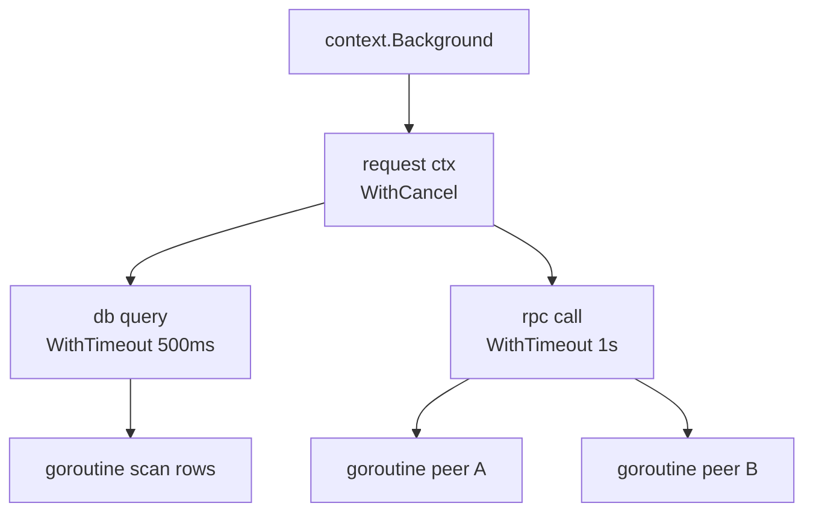

# Chapter 15 — Synchronization and context

> **What you'll learn.** When to use channels and when to use the `sync` package,
> how `sync.Mutex`, `RWMutex`, `WaitGroup`, `Once`, and atomics map to the pthreads
> tools you already know, the practical rules of Go's memory model, and how
> `context.Context` carries cancellation and deadlines through your program.

Chapter 13 — Goroutines and the Scheduler gave you cheap threads, and Chapter 14 —
Channels and select gave you a safe way to pass values between them. This chapter
fills the last gap: how to **protect shared state** and how to **stop work** that is
no longer needed. If you have written multithreaded C with pthreads, almost
everything here has a direct analog — usually a simpler one.

## Two toolboxes: channels vs the `sync` package

Go gives you two ways to coordinate goroutines. Both are correct. The trick is
picking the right one for the job.

| Use this | When you want to | C analog |
|---|---|---|
| **Channels** | Hand a value from one goroutine to another, or signal "an event happened" | A hand-built thread-safe queue (mutex + condvar + ring buffer) |
| **`sync` package** | Let several goroutines touch the *same* variable safely | `pthread_mutex_t`, `pthread_rwlock_t`, `pthread_once` |

> **Rule of thumb.** Use **channels to transfer ownership** of data and to
> coordinate *who does what next*. Use a **mutex to protect shared state** that
> stays in one place and is read or written by many goroutines. If you find
> yourself building a queue out of a mutex and a slice, you probably wanted a
> channel; if you find yourself sending a pointer back and forth just to guard one
> counter, you probably wanted a mutex.

This chapter is about the second toolbox (`sync`) plus `context`. Channels were
Chapter 14; the patterns that combine both are Chapter 16 — Concurrency Patterns.

## `sync.Mutex`: the lock you already know

A **mutex** ("mutual exclusion") is a lock. At most one goroutine can hold it at a
time. While one goroutine holds the lock, every other goroutine that calls `Lock`
waits. This is exactly `pthread_mutex_t`.

```go
import "sync"

var (
	mu      sync.Mutex
	balance int
)

func deposit(n int) {
	mu.Lock()
	defer mu.Unlock() // runs when deposit returns, on every path
	balance += n
}
```

The same idea in C with pthreads needs more ceremony, and there is no `defer`, so
you must place the unlock on every return path by hand:

```c
#include <pthread.h>

pthread_mutex_t mu = PTHREAD_MUTEX_INITIALIZER; /* must initialize */
long balance;

void deposit(long n) {
    pthread_mutex_lock(&mu);
    balance += n;
    pthread_mutex_unlock(&mu); /* forget this on any path and you deadlock */
}
```

The idiom `mu.Lock(); defer mu.Unlock()` is the heart of safe Go locking. `defer`
schedules the unlock to run when the function returns, no matter *how* it returns —
normal return, early return, or even a panic. It is the clean version of C's `goto
cleanup` (see Chapter 6 — Functions for `defer`).

> **C vs Go.** In C you must initialize a mutex (`pthread_mutex_init`, or the static
> `PTHREAD_MUTEX_INITIALIZER`) and destroy it with `pthread_mutex_destroy`. In Go,
> **the zero value of a `sync.Mutex` is an unlocked, ready-to-use mutex.** Just
> declare it. There is no init call and no destroy call; the garbage collector
> reclaims it.

| Concept | C (pthreads) | Go | Note |
|---|---|---|---|
| Mutex type | `pthread_mutex_t` | `sync.Mutex` | Zero value is ready. |
| Initialize | `pthread_mutex_init` / `PTHREAD_MUTEX_INITIALIZER` | *(nothing)* | `var mu sync.Mutex` is usable. |
| Lock / unlock | `pthread_mutex_lock` / `_unlock` | `mu.Lock()` / `mu.Unlock()` | Pair the unlock with `defer`. |
| Destroy | `pthread_mutex_destroy` | *(nothing)* | GC handles it. |
| Reader/writer lock | `pthread_rwlock_t` | `sync.RWMutex` | `RLock` for readers. |
| Recursive lock | `PTHREAD_MUTEX_RECURSIVE` | *(none)* | Go mutexes are never reentrant. |
| Condition variable | `pthread_cond_t` | `sync.Cond` (rare); prefer channels | Channels usually replace it. |

### A mutex protects a critical section

The code between `Lock` and `Unlock` is the **critical section**: the region only
one goroutine may execute at a time.

```
   goroutine A                shared state               goroutine B
   -----------            (guarded by mu)                -----------
   mu.Lock()  ----------------+
      balance += 100          |  only ONE goroutine is
      balance += 50           |  inside the box at a time
   mu.Unlock() ---------------+
                                              mu.Lock()   <- blocks while A holds it
                                                 read balance
                                              mu.Unlock()
```

A common and clean pattern is to **bundle the lock with the data it protects** in a
struct, and use pointer receivers (see Chapter 10 — Structs and Methods) so every
method locks the same mutex:

```go
package main

import (
	"fmt"
	"sync"
)

// Counter is safe for use by many goroutines at once.
type Counter struct {
	mu sync.Mutex
	n  int64
}

func (c *Counter) Inc() {
	c.mu.Lock()
	defer c.mu.Unlock()
	c.n++
}

func (c *Counter) Value() int64 {
	c.mu.Lock()
	defer c.mu.Unlock()
	return c.n
}

func main() {
	var c Counter
	var wg sync.WaitGroup
	for range 1000 { // integer range, Go 1.22+
		wg.Add(1)
		go func() {
			defer wg.Done()
			c.Inc()
		}()
	}
	wg.Wait()
	fmt.Println(c.Value()) // always 1000
}
```

> **Watch out.** A `sync.Mutex` is **not reentrant**. In C, a default
> `pthread_mutex_t` also deadlocks if you lock it twice in the same thread, but you
> can opt into `PTHREAD_MUTEX_RECURSIVE`. Go has **no recursive option at all.** If
> a method that holds the lock calls another method that also tries to lock, the
> goroutine deadlocks against itself. The fix: split the locked logic into a small
> unexported helper that assumes the lock is already held, and call that.

> **Rule of thumb.** Keep critical sections short, and **never send on a channel (or
> make a blocking call) while holding a mutex.** Snapshot what you need under the
> lock, unlock, then do the blocking work. Holding a lock across a blocking
> operation is a classic way to freeze a whole program.

### `sync.RWMutex`: many readers or one writer

When data is read far more often than it is written, a plain mutex is wasteful:
readers do not conflict with each other, yet a `Mutex` makes them wait in line. A
**read/write mutex** lets *many* readers hold the lock at once, but a writer gets it
alone. This is `pthread_rwlock_t`.

```go
type Config struct {
	mu sync.RWMutex
	m  map[string]string
}

func (c *Config) Get(key string) string {
	c.mu.RLock()         // shared read lock; many goroutines may hold it
	defer c.mu.RUnlock()
	return c.m[key]
}

func (c *Config) Set(key, val string) {
	c.mu.Lock()          // exclusive write lock; blocks all readers and writers
	defer c.mu.Unlock()
	c.m[key] = val
}
```

Use `RLock`/`RUnlock` for read-only access and `Lock`/`Unlock` for writes. Reach for
`RWMutex` only when you have measured a read-heavy workload; for low contention a
plain `Mutex` is simpler and often faster.

### Do not copy a mutex

This rule catches every C programmer at least once. A `sync.Mutex` must **not be
copied** after first use. Copying it makes a second, independent lock, so two
goroutines that think they share a lock actually do not — and your "protected" data
is now a data race.

A struct that contains a mutex inherits this rule: do not copy the struct either.
So pass it by pointer.

```go
type Counter struct {
	mu sync.Mutex
	n  int
}

func bad(c Counter)  { c.mu.Lock() /* ... */ } // BUG: c is a COPY; locks nothing useful
func good(c *Counter){ c.mu.Lock() /* ... */ } // correct: shares the one mutex
```

> **C vs Go.** In C, copying a `pthread_mutex_t` by assignment is undefined behavior
> and nothing warns you. In Go, the `go vet` tool has a built-in `copylocks` check
> that **flags this at build time**: "assignment copies lock value." Run `go vet
> ./...` (see Chapter 22 — Tooling) and it catches the mistake for you. The fix is
> to use a pointer receiver and pass `*Counter`, or never pass the owning struct by
> value.

## `sync.WaitGroup`: wait for a set of goroutines

A **`WaitGroup`** lets one goroutine wait until a group of other goroutines have all
finished. It is a counter with three operations:

- `Add(n)` — add `n` to the counter (you are about to start `n` goroutines).
- `Done()` — subtract one (a goroutine finished). `Done()` is just `Add(-1)`.
- `Wait()` — block until the counter reaches zero.

It is the rough equivalent of calling `pthread_join` on every thread, but with one
call instead of a loop, and without needing to keep the thread handles.

```go
package main

import (
	"fmt"
	"sync"
)

func main() {
	var wg sync.WaitGroup
	for i := range 5 {
		wg.Add(1) // increment BEFORE starting the goroutine
		go func() {
			defer wg.Done() // decrement when this goroutine returns
			fmt.Println("worker", i) // i is per-iteration (Go 1.22+); each goroutine sees its own
		}()
	}
	wg.Wait() // blocks until all five call Done
	fmt.Println("all workers finished")
}
```

Two rules make `WaitGroup` correct:

1. **Call `Add` before the `go` statement, not inside the goroutine.** If you call
   `Add` inside the new goroutine, `Wait` might run *before* that goroutine gets
   scheduled, see a zero counter, and return too early. That is a race; the race
   detector (Chapter 16) will flag it.
2. **Pass a `*WaitGroup` (a pointer), never a copy.** A `WaitGroup` must not be
   copied, for the same reason a mutex must not be. When a helper function runs the
   goroutines, give it `wg *sync.WaitGroup`.

```go
func runWorkers(wg *sync.WaitGroup, jobs []Job) {
	for _, j := range jobs {
		wg.Add(1)
		go func() {
			defer wg.Done()
			process(j)
		}()
	}
}
```

> **Deep dive.** Go 1.25 added a convenience method `wg.Go(func())` that does
> `Add(1)`, runs the function in a new goroutine, and calls `Done()` for you. On Go
> 1.26 you can write `wg.Go(func() { process(j) })` instead of the three-line
> pattern above. The manual `Add`/`go`/`defer Done()` form is still the one you will
> read most often, so learn it first.

## `sync.Once`: run something exactly once

`sync.Once` guarantees a function runs **one time only**, even if many goroutines
call it at once. It is Go's `pthread_once`. The classic use is lazy, thread-safe
initialization (a singleton).

```go
var (
	once   sync.Once
	client *http.Client
)

func Client() *http.Client {
	once.Do(func() {
		client = &http.Client{Timeout: 5 * time.Second}
	})
	return client // every caller gets the same client; setup ran once
}
```

Every goroutine that reaches `once.Do` either runs the function (the first one) or
blocks until the first one finishes, then continues. After that, `Do` is nearly
free.

> **Deep dive.** Go 1.21 added `sync.OnceFunc`, `sync.OnceValue`, and
> `sync.OnceValues`, which wrap this pattern in a closure. `get := sync.OnceValue(func() T { ... })`
> returns a function you can call many times; the body runs once and every call
> returns the cached result.

## `sync.Pool`: reuse allocations (brief)

`sync.Pool` is a free list of temporary objects you can reuse to reduce garbage
collection pressure (see Chapter 17 — Memory and the Garbage Collector). You `Get` an
object, use it, and `Put` it back. The pool may drop anything in it at any time, so
only store things that are safe to lose and to reuse.

```go
var bufPool = sync.Pool{
	New: func() any { return new(bytes.Buffer) }, // 'any', not interface{}
}

func writeReport(w io.Writer) {
	buf := bufPool.Get().(*bytes.Buffer)
	buf.Reset()
	defer bufPool.Put(buf)
	// ... build the report in buf, then copy it to w ...
}
```

Use it only when profiling shows a real allocation hot spot. It is not a general
object cache.

## `sync/atomic`: lock-free counters and flags

For a single integer or pointer touched by many goroutines, a full mutex can be
overkill. The `sync/atomic` package gives **atomic operations**: reads and writes
that the hardware guarantees happen as one indivisible step. Modern Go provides
**typed atomics** — small struct types with methods — which are clearer and safer
than the old free functions.

```go
package main

import (
	"fmt"
	"sync"
	"sync/atomic"
)

func main() {
	var hits atomic.Int64 // zero value is ready; holds 0
	var wg sync.WaitGroup
	for range 1000 {
		wg.Add(1)
		go func() {
			defer wg.Done()
			hits.Add(1) // atomic increment; no mutex needed
		}()
	}
	wg.Wait()
	fmt.Println(hits.Load()) // always 1000
}
```

The common typed atomics are `atomic.Int32`, `atomic.Int64`, `atomic.Uint32`,
`atomic.Uint64`, `atomic.Bool`, and `atomic.Pointer[T]` (generic and type-safe).

| Concept | C11 / GCC | Go | Note |
|---|---|---|---|
| Atomic integer | `_Atomic int`, `atomic_int` | `atomic.Int64`, `atomic.Int32`, ... | A struct with methods. |
| Add and return | `atomic_fetch_add` | `v.Add(1)` | Returns the **new** value. |
| Load / store | `atomic_load` / `atomic_store` | `v.Load()` / `v.Store(x)` | |
| Compare-and-swap | `atomic_compare_exchange_*` | `v.CompareAndSwap(old, new)` | Returns a `bool`. |
| Atomic pointer | `_Atomic(T*)` | `atomic.Pointer[T]` | Generic, no casts. |

> **Rule of thumb.** Use an atomic when you are guarding **one** value with simple
> operations (a counter, a flag, a swappable pointer). Use a **mutex** when an update
> touches **several** fields that must stay consistent together — for example,
> moving money between two balances. You cannot make two atomic operations into one
> atomic transaction; a mutex can.

## The Go memory model, in practice

A **data race** happens when two goroutines access the same memory at the same time,
at least one of them writes, and there is no synchronization between them. A data
race is a **bug** in Go: the result is undefined, just like in C, and the program
may behave differently every run.

The memory model is defined in terms of **happens-before**: an ordering between
events. If event A happens-before event B, then B sees the effects of A. The
synchronization tools create these orderings for you:

- A send on a channel **happens-before** the matching receive completes.
- A `mu.Unlock()` **happens-before** the next `mu.Lock()` returns.
- The `go` statement that starts a goroutine **happens-before** the goroutine runs.
- A `wg.Wait()` that returns sees everything done before the matching `Done()` calls.

If two accesses to shared memory have **no** happens-before relationship and one is
a write, you have a race. Plain reads and writes of ordinary variables provide *no*
ordering — that is why an unguarded shared counter is broken even though `n++` "looks
atomic." (It is not: it is load, add, store.)

> **Rule of thumb.** *If you have to wonder whether something is a data race, it is.*
> Do not reason your way to "it is probably fine." Either add synchronization (a
> channel, a mutex, or an atomic) or prove there is no shared write. And always test
> with the race detector: `go test -race ./...` (Chapter 16 explains it in detail).

> **C vs Go.** C11 also defines a memory model with `_Atomic` and memory orders, and
> data races are undefined behavior there too. The big practical difference: Go ships
> a **race detector** in the standard toolchain (`-race`), so you can *catch* races
> in testing instead of guessing. There is no setup; it is one flag.

## `context.Context`: cancellation, deadlines, and request values

A long C program that wants to cancel work threads it through by hand: a shared
"stop" flag, a pipe to `select` on, a deadline you check in a loop. Go standardizes
all of this in one type, **`context.Context`**. A context carries three things down
a call tree:

1. A **cancellation signal** — a way to say "stop, the result is no longer needed."
2. A **deadline or timeout** — cancel automatically at a certain time.
3. A small set of **request-scoped values** — data tied to one request, such as a
   trace ID.

The core of a context is one method: `Done() <-chan struct{}`. It returns a channel
that is **closed** when the context is cancelled. Goroutines wait on it with
`<-ctx.Done()`. After cancellation, `ctx.Err()` tells you why: `context.Canceled` or
`context.DeadlineExceeded`.

### Creating contexts

You never make a context from nothing; you start from a root and derive children.

```go
ctx := context.Background() // the root: never cancelled, no deadline, no values
ctx := context.TODO()       // a placeholder when you have not wired a real ctx yet
```

From a parent you derive children that add behavior. Each `With...` returns a new
context **and a `cancel` function**:

```go
// Cancel manually when you decide the work is done.
ctx, cancel := context.WithCancel(parent)

// Cancel automatically after a duration.
ctx, cancel := context.WithTimeout(parent, 2*time.Second)

// Cancel automatically at a specific time.
ctx, cancel := context.WithDeadline(parent, deadline)

// Attach a request-scoped value (use sparingly; see below).
ctx := context.WithValue(parent, requestIDKey, "abc-123")
```

> **Watch out.** You must **always call `cancel`**, even for `WithTimeout` and
> `WithDeadline` that look like they cancel themselves. Calling it releases the
> resources (timer, goroutine bookkeeping) tied to the context. The idiom is to
> `defer` it on the line right after creating the context: `defer cancel()`.
> Forgetting it leaks resources, and `go vet` will warn you.

### Cancellation flows down a tree

Contexts form a tree. Cancelling a context cancels **all of its descendants**, but
never its parent. This is how one timeout at the top of a request stops every
goroutine the request started.



If the client disconnects and you cancel `root`, then `db`, `rpc`, and all four
leaf goroutines see their `Done()` channel close and shut down. If only the `rpc`
timeout fires, just `rpc`, `rpc1`, and `rpc2` are cancelled; the `db` branch keeps
running.

### Using a context

A worker selects on `ctx.Done()` alongside its real work, and returns as soon as the
context is cancelled.

```go
package main

import (
	"context"
	"fmt"
	"time"
)

// work simulates a job that takes 5 seconds, but gives up early if cancelled.
func work(ctx context.Context) error {
	select {
	case <-time.After(5 * time.Second):
		fmt.Println("work finished")
		return nil
	case <-ctx.Done():
		return ctx.Err() // context deadline exceeded, or context canceled
	}
}

func main() {
	ctx, cancel := context.WithTimeout(context.Background(), 100*time.Millisecond)
	defer cancel() // ALWAYS; releases the timer

	if err := work(ctx); err != nil {
		fmt.Println("stopped early:", err) // stopped early: context deadline exceeded
	}
}
```

### Conventions you must follow

The standard library and every Go team expect these rules:

- **Pass `ctx` as the first parameter**, named `ctx`: `func Fetch(ctx context.Context, url string) (...)`.
- **Do not store a `Context` in a struct.** Pass it explicitly to each call that
  needs it. A context describes one operation's lifetime; a struct outlives the
  operation.
- **Always `defer cancel()`** after a `With...` call.
- **Use `context.WithValue` sparingly** — only for request-scoped data that crosses
  API boundaries (a trace ID, an auth token), never for passing optional function
  arguments. Values are untyped (`any`) and invisible to the compiler, so overusing
  them turns clear function signatures into a guessing game. Use a private key type
  to avoid collisions:

```go
type ctxKey int
const requestIDKey ctxKey = 0

ctx = context.WithValue(ctx, requestIDKey, "abc-123")
id, ok := ctx.Value(requestIDKey).(string) // type assertion back to string
```

## Key takeaways

- Two valid toolboxes: **channels** transfer ownership and signal events; the
  **`sync` package** protects shared state in place.
- `sync.Mutex` is `pthread_mutex_t`, but its **zero value is ready** (no init, no
  destroy). Use `mu.Lock(); defer mu.Unlock()`.
- Go mutexes are **not reentrant** and must **not be copied**; `go vet`'s
  `copylocks` check catches accidental copies.
- `sync.RWMutex` allows many readers or one writer; use it only for read-heavy data.
- `sync.WaitGroup` waits for a group of goroutines. Call `Add` **before** `go`, use
  `defer wg.Done()`, and pass a `*WaitGroup`.
- `sync.Once` runs setup exactly once (singletons); `sync.Pool` reuses allocations.
- `sync/atomic` typed atomics (`atomic.Int64`, `atomic.Bool`, ...) are best for a
  single counter or flag; a mutex is better when several fields must change together.
- A **data race** is a bug; rely on happens-before (channels, locks, atomics) and
  test with `-race`. "If you have to wonder whether it is a race, it is."
- `context.Context` carries cancellation, deadlines, and request values down a call
  tree. Pass it first, never store it in a struct, and always `defer cancel()`.

## Watch out (gotchas for C programmers)

- **Forgetting to unlock.** Always pair `Lock` with `defer Unlock`. An early return
  without unlocking freezes every other goroutine.
- **Copying a mutex (or a struct that holds one).** Two goroutines then lock two
  different mutexes and the data is unprotected. Use pointer receivers; run `go vet`.
- **Recursive locking deadlocks.** Go has no recursive mutex. A locked method that
  calls another locking method deadlocks. Extract a lock-free helper.
- **Calling `wg.Add` inside the goroutine.** `Wait` can return before the goroutine
  starts. Always `Add` before `go`.
- **Sending on a channel while holding a mutex.** Snapshot under the lock, unlock,
  then send. Otherwise you risk a deadlock.
- **Forgetting `defer cancel()`.** Even `WithTimeout` must be cancelled to free its
  timer; skipping it is a resource leak.
- **Storing `context.Context` in a struct or overusing `ctx.Value`.** Pass context as
  the first argument; keep values for request-scoped data only.

## Interview questions

**Q: When would you use a channel and when would you use a mutex?**
A: Use a channel to transfer ownership of data between goroutines or to signal that
an event happened — anything that is really "pass this along" or "coordinate who
acts next." Use a mutex to protect shared state that stays in one place and is read
or written by several goroutines, such as a counter or a cache. Both are idiomatic;
pick the one that matches the problem.

**Q: Why does Go not need `pthread_mutex_init`, and what is special about a mutex's
zero value?**
A: A `sync.Mutex` is designed so its zero value is a valid, unlocked mutex. Declaring
`var mu sync.Mutex` (or embedding it in a struct) is enough to use it. There is no
init and no destroy call; the garbage collector reclaims it. This is part of Go's
broader "make the zero value useful" philosophy.

**Q: What is a data race, and how do you find one in Go?**
A: A data race is two goroutines accessing the same memory concurrently with no
synchronization between them, where at least one access is a write. The result is
undefined. You find races with Go's built-in race detector by running `go test -race`
or `go run -race`; it instruments memory accesses and reports the conflicting
goroutines and stacks at runtime.

**Q: When should you reach for `sync/atomic` instead of a mutex?**
A: Use an atomic when you guard a single value with simple operations — an integer
counter, a boolean flag, or a swappable pointer. Use a mutex when one logical update
spans several fields that must stay consistent together, because you cannot combine
two atomic operations into a single atomic transaction.

**Q: What problems does `context.Context` solve, and what are the rules for using
it?**
A: It carries cancellation, deadlines/timeouts, and request-scoped values down a call
tree so you can stop work that is no longer needed and bound how long it runs.
Cancelling a context cancels all of its descendants. The rules: pass it as the first
parameter named `ctx`, never store it in a struct, always `defer cancel()` after a
`With...` call, and use `ctx.Value` only for request-scoped data, not ordinary
arguments.

## Try it

Write a `SafeMap` type wrapping a `map[string]int` with a `sync.RWMutex`. Give it
`Get`, `Set`, and `Inc` methods. Launch 100 goroutines that each call `Inc("x")`
1000 times, wait with a `WaitGroup`, and print the total. Run it with `go run -race
.` and confirm the detector stays quiet. Then remove the locks and watch it both
report a race and print the wrong total.
