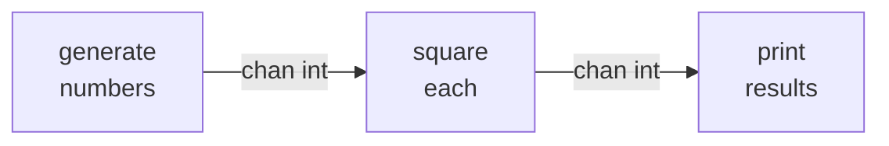
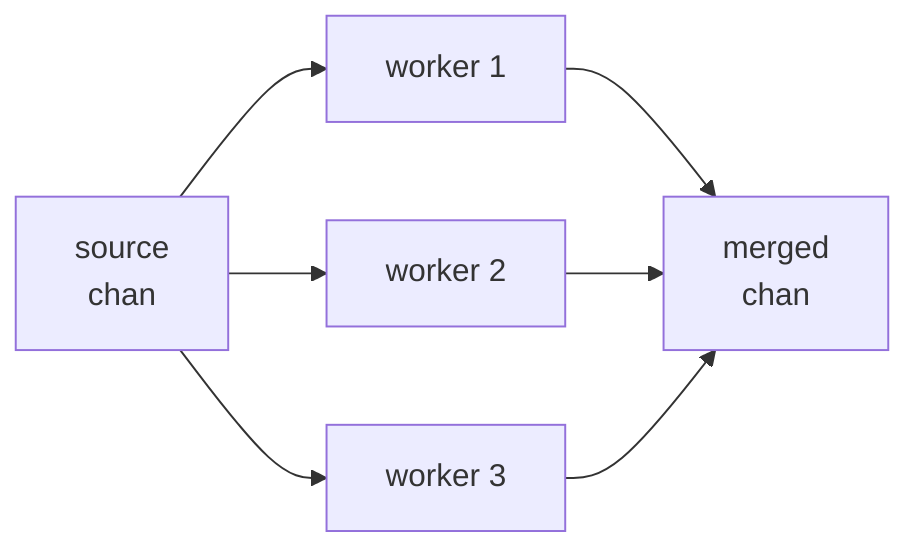
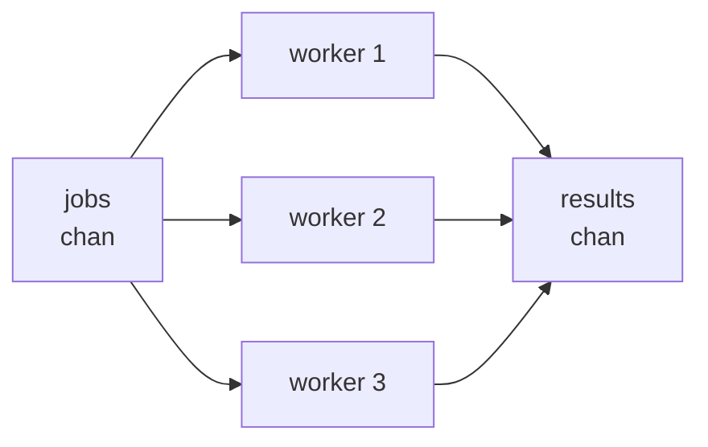

# Chapter 16 — Concurrency Patterns

> **What you'll learn.** The race detector and how to use it, plus the handful of
> goroutine-and-channel patterns you will reuse forever: pipelines, fan-out/fan-in,
> worker pools, semaphores, `errgroup`, rate limiting, and graceful shutdown — with
> the common mistakes spelled out.

You now have goroutines (Chapter 13 — Goroutines and the Scheduler), channels
(Chapter 14 — Channels and select), and the `sync` package and `context` (Chapter
15 — Synchronization and context). This chapter assembles them into the standard
shapes. Learn these and you will recognize the structure of almost any concurrent Go
program. They are the Go answer to the ad-hoc thread-pool and producer/consumer code
you would hand-roll with pthreads in C.

## The race detector: your most important tool

A **data race** (Chapter 15) is two goroutines touching the same memory at once with
no synchronization, where at least one writes. The result is undefined. The good news:
Go ships a **race detector** in the standard toolchain. Turn it on with one flag.

```sh
go test -race ./...    # run the tests with race detection (do this in CI)
go run -race .         # run a program with race detection
go build -race -o app  # build an instrumented binary
```

What it does and does not do:

- It is a **dynamic** detector. It watches the memory accesses that **actually
  happen** while the program runs, and reports a race only when conflicting accesses
  really occur. It does *not* prove your code is race-free; it finds the races your
  test actually exercised. So feed it realistic, concurrent tests.
- When it sees a race it prints both goroutines' stacks and the variable, then the
  program exits non-zero — perfect for failing a CI build.
- **It is not free.** Expect roughly 2x–20x more CPU time and several times more
  memory. You run it in tests and CI, not usually in production.

> **Rule of thumb.** Run `go test -race ./...` in continuous integration on every
> change. A race that reproduces once in a thousand runs in production will often
> show up immediately under `-race`, because the detector flags the *unsynchronized
> access*, not the rare bad interleaving.

### A tiny race and its fix

Here is a classic broken counter. Many goroutines do `count++`, which is really
*load, add, store* — three steps that can interleave.

```go
// BROKEN: data race on count. Run with: go run -race .
package main

import (
	"fmt"
	"sync"
)

func main() {
	count := 0
	var wg sync.WaitGroup
	for range 1000 {
		wg.Add(1)
		go func() {
			defer wg.Done()
			count++ // RACE: unsynchronized read-modify-write
		}()
	}
	wg.Wait()
	fmt.Println(count) // not reliably 1000
}
```

Under `-race` this reports `DATA RACE` and points at the `count++` line. The fix is
any synchronization tool from Chapter 15 (Synchronization and context). Here, an
atomic counter is the simplest:

```go
// FIXED: atomic counter. Run with: go run -race .
package main

import (
	"fmt"
	"sync"
	"sync/atomic"
)

func main() {
	var count atomic.Int64
	var wg sync.WaitGroup
	for range 1000 {
		wg.Add(1)
		go func() {
			defer wg.Done()
			count.Add(1) // atomic: no race
		}()
	}
	wg.Wait()
	fmt.Println(count.Load()) // always 1000
}
```

## Pipelines

A **pipeline** is a series of **stages** connected by channels. Each stage is a group
of goroutines that receive values from an input channel, do one job, and send results
to an output channel. It is the concurrent version of piping commands in a shell:
`cmd1 | cmd2 | cmd3`.



The first stage is a **generator**: a function that returns a receive-only channel
(`<-chan T`) and runs a goroutine that fills it, then **closes** it when done.
Closing tells downstream stages "no more values," so their `for range` loops end.

```go
package main

import "fmt"

// gen sends the given numbers on a channel, then closes it.
func gen(nums ...int) <-chan int {
	out := make(chan int)
	go func() {
		defer close(out) // closing ends the receiver's range loop
		for _, n := range nums {
			out <- n
		}
	}()
	return out
}

// square reads ints from in, sends their squares to out, closes out at the end.
func square(in <-chan int) <-chan int {
	out := make(chan int)
	go func() {
		defer close(out)
		for n := range in { // ends when in is closed
			out <- n * n
		}
	}()
	return out
}

func main() {
	for n := range square(gen(2, 3, 4)) { // compose the stages
		fmt.Println(n) // 4, 9, 16
	}
}
```

> **Mental model.** A stage owns its output channel: it is the only one that sends on
> it, and it is the one that closes it. "The sender closes, never the receiver" is the
> rule from Chapter 14, and pipelines depend on it to terminate cleanly.

## Fan-out and fan-in

When one stage is slow, run **several** copies of it reading from the same channel.
Distributing work to multiple goroutines is **fan-out**. Merging their results back
into one channel is **fan-in**.



Because Go channels are safe for many senders and many receivers, fan-out is just
"start N goroutines that all `range` the same input channel." Fan-in needs a little
care: we use a `WaitGroup` to close the merged channel exactly once, *after* every
worker has finished.

```go
package main

import (
	"fmt"
	"sync"
)

func gen(nums ...int) <-chan int {
	out := make(chan int)
	go func() {
		defer close(out)
		for _, n := range nums {
			out <- n
		}
	}()
	return out
}

// merge fans in: it copies values from every input channel into one output channel.
func merge(ins ...<-chan int) <-chan int {
	out := make(chan int)
	var wg sync.WaitGroup
	for _, in := range ins {
		wg.Add(1)
		go func() {
			defer wg.Done()
			for n := range in {
				out <- n
			}
		}()
	}
	go func() {
		wg.Wait()  // wait for all copiers...
		close(out) // ...then close the merged channel exactly once
	}()
	return out
}

func square(in <-chan int) <-chan int {
	out := make(chan int)
	go func() {
		defer close(out)
		for n := range in {
			out <- n * n
		}
	}()
	return out
}

func main() {
	in := gen(2, 3, 4, 5, 6, 7, 8, 9)

	// Fan-out: two workers read the same channel.
	w1 := square(in)
	w2 := square(in)

	// Fan-in: merge their outputs, then sum (order is not deterministic).
	sum := 0
	for n := range merge(w1, w2) {
		sum += n
	}
	fmt.Println(sum) // 284
}
```

> **Watch out.** Results from fan-in arrive in **nondeterministic order**, because the
> workers race each other. If you need order, attach an index to each item and sort at
> the end, or do not fan out that stage.

## Worker pool with bounded concurrency

A pipeline starts one goroutine per stage; a **worker pool** starts a *fixed* number
of workers that pull jobs from a shared channel. This is how you cap concurrency:
1000 jobs, but only `N` running at once. It is the Go version of a pthread thread
pool, but the "pool" is just a channel plus a few goroutines.



```go
package main

import (
	"fmt"
	"sync"
)

func worker(id int, jobs <-chan int, results chan<- int, wg *sync.WaitGroup) {
	defer wg.Done()
	for j := range jobs { // pull jobs until the channel is closed
		results <- j * 2 // the "work"
	}
}

func main() {
	const numJobs = 9
	const numWorkers = 3

	jobs := make(chan int, numJobs)
	results := make(chan int, numJobs)

	// Start a fixed number of workers (bounded concurrency).
	var wg sync.WaitGroup
	for w := 1; w <= numWorkers; w++ {
		wg.Add(1)
		go worker(w, jobs, results, &wg)
	}

	// Send all jobs, then close so workers' range loops end.
	for j := 1; j <= numJobs; j++ {
		jobs <- j
	}
	close(jobs)

	// Close results once every worker has returned.
	go func() {
		wg.Wait()
		close(results)
	}()

	sum := 0
	for r := range results { // drain until results is closed
		sum += r
	}
	fmt.Println("sum:", sum) // sum: 90
}
```

The shape to memorize: **create workers, feed a jobs channel, close jobs, wait, then
close results.** The `WaitGroup` plus the "closer goroutine" is what lets the
`for range results` loop end on its own.

## Bounding parallelism with a semaphore channel

Sometimes you do not want a fixed pool; you want to spawn one goroutine per task but
limit how many run at once — for example, "fetch 500 URLs, but at most 10 in flight."
A **buffered channel of empty structs** works as a counting **semaphore**.

`struct{}` is the zero-size empty struct, so `chan struct{}` carries no data, only the
"slot taken / slot free" signal. The buffer size `n` is the limit.

```go
package main

import (
	"fmt"
	"sync"
)

func main() {
	urls := make([]string, 50)
	for i := range urls {
		urls[i] = fmt.Sprintf("url-%d", i)
	}

	sem := make(chan struct{}, 10) // at most 10 concurrent
	var wg sync.WaitGroup

	for _, u := range urls {
		wg.Add(1)
		sem <- struct{}{} // acquire: blocks once 10 slots are taken
		go func() {
			defer wg.Done()
			defer func() { <-sem }() // release the slot
			_ = fetch(u)
		}()
	}
	wg.Wait()
	fmt.Println("done")
}

func fetch(u string) error { return nil } // stand-in for real work
```

Sending to `sem` blocks when the buffer is full, so the loop pauses until a running
goroutine releases a slot by receiving from `sem`. That is the entire limiter.

## `errgroup`: goroutines that can fail

The `WaitGroup` patterns above ignore errors. Real work fails, and usually you want
the **first** error and to **cancel** the rest. The package
`golang.org/x/sync/errgroup` does exactly that. It is part of the `golang.org/x`
modules — official, but **a separate dependency** you must add to `go.mod` with
`go get golang.org/x/sync`.

`errgroup.WithContext` gives you a group and a context. `g.Go(func() error)` runs each
task; if any returns a non-nil error, the group **cancels the context** so the others
can stop, and `g.Wait()` returns that first error.

```go
package main

import (
	"context"
	"errors"
	"fmt"

	"golang.org/x/sync/errgroup"
)

func main() {
	g, ctx := errgroup.WithContext(context.Background())

	urls := []string{"a", "b", "bad", "c"}
	for _, u := range urls {
		g.Go(func() error { // each task is a func() error
			return fetch(ctx, u)
		})
	}

	if err := g.Wait(); err != nil { // first non-nil error, or nil
		fmt.Println("group failed:", err) // group failed: bad url: bad
	} else {
		fmt.Println("all ok")
	}
}

func fetch(ctx context.Context, u string) error {
	if u == "bad" {
		return errors.New("bad url: " + u)
	}
	select {
	case <-ctx.Done():
		return ctx.Err() // a sibling failed; stop early
	default:
		return nil
	}
}
```

`g.SetLimit(n)` even bounds concurrency, turning the group into a worker pool with
error handling. `errgroup` is usually the cleanest answer when you fan out work that
can fail.

## Rate limiting

To do something at most `N` times per second, the standard-library tool is
`time.Ticker`. A ticker sends the current time on its channel at a fixed interval;
receive from it once per unit of work to pace a loop.

```go
package main

import (
	"fmt"
	"time"
)

func main() {
	ticker := time.NewTicker(200 * time.Millisecond) // 5 per second
	defer ticker.Stop()                              // always stop a ticker to free it

	for i := range 3 {
		<-ticker.C // wait for the next tick before proceeding
		fmt.Println("request", i, "at", time.Now().Format("15:04:05.000"))
	}
}
```

> **Rule of thumb.** For anything beyond a steady tick — bursts, a token bucket, or
> per-key limits — use `golang.org/x/time/rate` (another `golang.org/x` dependency).
> Its `rate.Limiter` supports `Wait`, `Allow`, and `Reserve`, and handles bursts
> correctly. Reach for it instead of building your own bucket.

## Graceful shutdown: context + `WaitGroup`

Production services must stop cleanly: stop accepting new work, let in-flight work
finish, then exit. The idiom combines the two tools from Chapter 15. A `context`
broadcasts "shut down now"; a `WaitGroup` waits for the workers to drain.

```go
package main

import (
	"context"
	"fmt"
	"sync"
	"time"
)

// worker runs until the context is cancelled, doing one unit per tick.
func worker(ctx context.Context, id int, wg *sync.WaitGroup) {
	defer wg.Done()
	ticker := time.NewTicker(10 * time.Millisecond)
	defer ticker.Stop()
	for {
		select {
		case <-ctx.Done(): // shutdown signal: stop the loop and return
			fmt.Printf("worker %d stopping: %v\n", id, ctx.Err())
			return
		case <-ticker.C:
			// ... do one unit of work ...
		}
	}
}

func main() {
	ctx, cancel := context.WithCancel(context.Background())

	var wg sync.WaitGroup
	for id := range 3 {
		wg.Add(1)
		go worker(ctx, id, &wg)
	}

	// Run for a while, then signal shutdown. In a real server this would be an
	// OS signal (see Chapter 23 — Building Web Services with net/http) via signal.NotifyContext.
	time.Sleep(50 * time.Millisecond)
	cancel()  // tell every worker to stop (cancellation propagates down the tree)
	wg.Wait() // wait for all of them to finish in-flight work
	fmt.Println("shutdown complete")
}
```

Cancellation **propagates**: cancelling the parent context closes every child's
`Done()` channel, so a single `cancel()` stops the whole tree. Real servers get the
root context from `signal.NotifyContext(ctx, os.Interrupt)`, which cancels it when
the user presses Ctrl-C.

## Common mistakes

These three account for most concurrency bugs in real Go code.

- **Leaking goroutines.** A goroutine that blocks forever on a channel never returns,
  and its stack memory is never freed. The usual cause: a goroutine sends to a channel
  no one will ever receive from (often because the receiver returned early). Always
  give a goroutine a way to exit — a closed channel, or `<-ctx.Done()`.

  ```go
  // LEAK: if the caller stops reading, this goroutine blocks on send forever.
  func leaky() <-chan int {
  	ch := make(chan int) // unbuffered
  	go func() {
  		for i := 0; ; i++ {
  			ch <- i // blocks forever once nobody receives
  		}
  	}()
  	return ch
  }
  ```

  The fix is to pass a `context.Context` and `select` on `ctx.Done()` in the sender,
  so it can return when the consumer is done.

- **Creating unbounded goroutines.** `for _, item := range hugeSlice { go handle(item) }`
  can launch millions of goroutines, exhausting memory and thrashing the scheduler.
  Bound it: use a worker pool, a semaphore channel, or `errgroup` with `SetLimit`.

- **Discarding errors from goroutines.** A bare `go doWork()` throws away any error
  `doWork` returns — and you cannot `return` an error out of a goroutine to its
  starter. Collect errors through a channel, or use `errgroup` so failures are not
  silently lost.

> **Watch out.** A **full channel** is also a deadlock waiting to happen. Sending to an
> unbuffered channel blocks until someone receives; if that someone is the same
> goroutine, or is also blocked sending, the program deadlocks. The runtime detects a
> *total* deadlock and panics with `all goroutines are asleep - deadlock!`, but a
> *partial* one (only some goroutines stuck) just hangs. Run with `-race` and design
> clear ownership of who sends and who closes.

## Recap: share memory by communicating

Go's guiding proverb for concurrency is:

> **Do not communicate by sharing memory; instead, share memory by communicating.**

In C you typically do the opposite: threads share a buffer and you bolt a mutex on to
guard it. Go says: prefer to **pass the data through a channel** so that at any moment
only one goroutine owns it. Ownership moves with the value, and there is nothing to
lock. Mutexes and atomics are still there (Chapter 15) for the cases where shared
state really is the simplest design — but reach for channels first, and you will write
fewer races.

## Key takeaways

- The **race detector** (`-race`) is your safety net. It finds races that actually
  occur at runtime; run it in tests and CI. It costs CPU and memory, so it is not for
  production.
- A **pipeline** chains stages with channels; a **generator** returns `<-chan T` and
  closes it when done. The sender always closes the channel.
- **Fan-out** runs several workers on one input channel; **fan-in** merges their
  outputs, using a `WaitGroup` to close the merged channel once.
- A **worker pool** bounds concurrency with a fixed number of workers pulling from a
  jobs channel. A **semaphore channel** (`make(chan struct{}, n)`) bounds per-task
  goroutines.
- `golang.org/x/sync/errgroup` runs failable tasks, returns the first error, and
  cancels the rest via context (it is an `x/` module dependency).
- Rate-limit with `time.Ticker` for a steady rate, or `golang.org/x/time/rate` for
  bursts and token buckets.
- **Graceful shutdown** = a `context` to signal stop + a `WaitGroup` to drain workers.
- Avoid leaking goroutines, creating unbounded goroutines, and discarding goroutine
  errors. Prefer to **share memory by communicating**.

## Watch out (gotchas for C programmers)

- **Goroutine leaks.** A goroutine blocked forever on a channel is never collected.
  Give every goroutine an exit path (`ctx.Done()` or a closed channel).
- **Unbounded goroutines.** `go` inside a loop over a huge collection can spawn
  millions. Bound concurrency with a pool, a semaphore, or `errgroup.SetLimit`.
- **Lost errors.** You cannot return an error from a goroutine to its starter. Use a
  channel or `errgroup`; never write a bare `go mightFail()`.
- **Deadlock on a full or unbuffered channel.** A send with no matching receive
  blocks forever. The runtime panics only on a *total* deadlock; partial ones hang.
- **Not running `-race`.** Concurrency bugs hide in timing. Make `go test -race
  ./...` part of CI so they surface early.

## Interview questions

**Q: What does the Go race detector do, and what are its limits?**
A: It instruments memory accesses at runtime and reports a data race when it observes
two unsynchronized accesses to the same memory where at least one is a write, printing
both goroutine stacks. You enable it with `-race` on `go test`, `go run`, or `go
build`. Its limit is that it is dynamic: it only finds races on code paths that
actually execute during the run, so it cannot prove the absence of races. It also adds
significant CPU and memory overhead, so it is for testing and CI, not production.

**Q: How do you bound the number of goroutines doing work at once?**
A: Two common ways. A worker pool starts a fixed number of goroutines that all read
from one shared jobs channel, so concurrency equals the worker count. Or a semaphore
channel — a buffered `chan struct{}` of size `n` — where each goroutine sends before
starting and receives when done, capping in-flight work at `n`. `errgroup.SetLimit`
provides the same bound with error handling built in.

**Q: How does a pipeline terminate cleanly?**
A: Each stage owns its output channel and is the only sender; it closes that channel
when its input is exhausted (typically with `defer close(out)`). Closing ends the
downstream stage's `for range` loop, which lets that stage finish and close its own
output, and so on down the line. The rule is that the sender closes, never the
receiver.

**Q: What causes a goroutine leak and how do you prevent it?**
A: A goroutine leaks when it blocks forever — usually sending on a channel no one will
receive from, or receiving from one that will never be sent to or closed — so it never
returns and its stack is never freed. Prevent it by giving every goroutine a guaranteed
exit: select on `ctx.Done()`, ensure channels get closed, or use buffered channels and
timeouts so a send or receive cannot block indefinitely.

**Q: Explain "do not communicate by sharing memory; share memory by communicating."**
A: It is Go's preference for passing data between goroutines through channels rather
than having them share a variable guarded by a lock. When a value travels over a
channel, ownership moves with it, so only one goroutine touches it at a time and there
is no shared state to protect. Mutexes and atomics remain available for genuinely
shared state, but channels are the first choice and eliminate many data races by
design.

## Try it

Build a concurrent URL checker. Read a list of URLs, fan them out to a worker pool of
8 goroutines that record each status, and collect the results. Add a
`context.WithTimeout` so the whole run cannot exceed 5 seconds, and switch the pool to
`errgroup` so the first hard failure cancels the rest. Run it with `go run -race .` and
confirm the detector stays silent.
