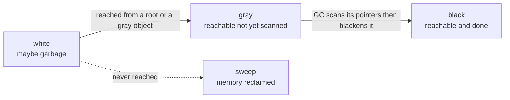

# Chapter 17 — Memory and the Garbage Collector

> **What you'll learn.** Where Go puts your values (stack or heap), how the
> compiler decides with *escape analysis*, how the garbage collector frees memory
> for you, and how to write code that allocates less — all compared to C's
> `malloc`/`free`.

In C you own every byte. You call `malloc` to get heap memory and `free` to give
it back, and if you get the bookkeeping wrong you get a leak, a double-free, or a
use-after-free. Go takes that whole job away. There is **no `free`**. A part of
the Go runtime called the **garbage collector** (GC) finds memory you no longer
use and reclaims it automatically.

This chapter explains what happens under the hood, so you can reason about
performance the way you already do in C — just without the manual frees.

## Stack vs heap

Two regions hold your data while a program runs. The terms mean the same thing
they do in C.

- The **stack** is fast, scratch memory tied to a function call. Each call gets a
  **frame** (a block holding that call's local variables). Allocating is almost
  free: the runtime just moves a pointer. When the function returns, its whole
  frame disappears at once. Nothing to free.
- The **heap** is memory that must outlive the call that created it. It is more
  expensive to manage. In C *you* manage it with `malloc`/`free`; in Go the **GC**
  manages it.

The big difference from C: **each goroutine has its own stack, and that stack
grows automatically.** A goroutine is Go's lightweight thread (see Chapter 13 —
Goroutines and the Scheduler). Its stack starts small (a few kilobytes) and, when
a deep call chain needs more room, the runtime allocates a bigger stack and copies
the frames over. You never set a stack size or get a "stack overflow" from normal
code, as you might with a fixed C thread stack.

> **C vs Go.** In C the stack has a fixed maximum (often 8 MiB per thread), set at
> thread creation. Deep recursion crashes with a stack overflow. In Go the
> goroutine stack is growable, so the same recursion just makes the stack bigger.
> The trade is that Go must be able to find and rewrite pointers when it moves a
> stack — which it can, because Go has no pointer arithmetic.

## Escape analysis: the compiler decides stack or heap

Here is the key idea, and it surprises most C programmers: **you do not choose
stack or heap in Go.** There is no `malloc`. You just write `x := 0` or
`p := &T{}`, and the **compiler** decides where the value lives. This decision is
called **escape analysis**.

The rule the compiler follows: a value can stay on the stack only if the compiler
can prove its lifetime ends when the function returns. If the value's address
**escapes** — outlives the function — it must go on the heap instead. A value
escapes when:

- its address is **returned** from the function, or
- it is **stored into something on the heap** (a heap struct field, a slice, a map), or
- it is **captured by a closure** that outlives the function (see Chapter 6 — Functions), or
- it is **sent on a channel** (see Chapter 14 — Channels and `select`), or
- it is **stored in an interface** value whose dynamic type is large or escapes (see Chapter 11 — Interfaces).

The most important consequence: **returning the address of a local variable is
safe in Go.** This is the exact opposite of the classic C bug.

```c
/* BROKEN in C: 'c' lives in this frame, which is freed on return.
   The returned pointer dangles; using it is undefined behavior. */
int *new_counter(void) {
    int c = 0;
    return &c;        /* do NOT do this in C */
}
```

```go
// Safe in Go. The compiler sees that &c escapes, so it allocates c
// on the heap. The pointer stays valid for as long as the caller holds it.
func newCounter() *int {
	c := 0
	return &c
}
```

In C, returning `&c` is a bug because the stack frame is gone after `return`. In
Go it is normal and correct: escape analysis moves `c` to the heap, and the GC
frees it later when nobody points to it anymore. You write the *same* code; the
compiler makes it safe.

### Seeing the decisions

The compiler will print every escape decision. Pass `-gcflags=-m` to `go build`:

```sh
$ go build -gcflags=-m .
# ./main.go:11:2: moved to heap: x        <- escapes(): x is allocated on the heap
# (stays() prints nothing: its x stayed on the stack)
```

Here are the two functions that produce that output:

```go
package main

import "fmt"

func stays() int {
	x := 42  // does NOT escape: copied out by value, dies with the frame
	return x
}

func escapes() *int {
	x := 42  // escapes: its address leaves the function
	return &x // safe; the compiler moves x to the heap
}

func main() {
	a := stays()
	b := escapes()
	fmt.Println(a, *b)
}
```

This ASCII picture shows what the runtime does at the moment `escapes` returns:

```
   STACK  (one per goroutine; grows/shrinks; freed on return)
   +-------------------------------+
   | main frame                    |
   |   a  int  = 42   <- stays here |        HEAP  (freed later, by the GC)
   |   b  *int  --------------------------->  +----------------------+
   +-------------------------------+          |  x = 42              |
   | escapes frame  (already gone) |          |  moved here because  |
   |   returned &x                 |          |  its address escaped |
   +-------------------------------+          +----------------------+
                                                  ^ reclaimed once no
                                                    pointer refers to it
```

> **Mental model.** Escape analysis is the compiler doing your `malloc`/`free`
> reasoning for you. "Does this outlive the call?" In C you answer that question
> and call `malloc` if the answer is yes. In Go the compiler answers it and
> allocates for you — and never gets the `free` wrong.

> **Rule of thumb.** Do not contort your code to avoid the heap. Write clear code
> first. If a profiler later shows a hot allocation, *then* use `-gcflags=-m` to
> see why a value escapes and adjust.

## The garbage collector

Go's GC is a **concurrent, tri-color, mark-and-sweep** collector. It is
**non-generational** and **non-compacting**. Those words matter, so here is each
one in plain English.

- **Mark-and-sweep.** The GC first *marks* every object that is still reachable
  (something points to it), then *sweeps* (reclaims) everything not marked.
- **Tri-color.** A bookkeeping scheme that lets marking run *while your program
  keeps running*. Objects are sorted into three sets: white, gray, and black (see
  the diagram below).
- **Concurrent.** Marking happens at the same time as your goroutines, on spare
  CPU. The GC only stops all goroutines (a **stop-the-world**, or STW, pause) for
  very short moments to start and finish a cycle. In modern Go these pauses are
  usually **well under a millisecond**.
- **Non-generational.** Unlike Java's HotSpot GC, Go does not keep separate
  "young" and "old" heaps. It scans the whole live heap each cycle.
- **Non-compacting.** The GC never moves a live heap object, so **a pointer's
  address never changes** for the life of the object. (Stacks *can* move, but the
  runtime fixes up those pointers itself.)



Marking starts from the **roots** — the values on every goroutine stack plus the
global variables. Each root's targets turn gray. The GC scans a gray object's
pointer fields (turning each target gray), then colors that object black. When no
gray objects remain, every white object is unreachable garbage and gets swept. A
small **write barrier** (extra code the compiler inserts around pointer writes)
keeps the coloring correct even though your program is mutating pointers at the
same time.

> **C vs Go.** In C you decide *when* and *what* to free, at the cost of getting
> it right every time. In Go the GC decides, trading a little CPU and memory for
> the guarantee that you can never double-free, use-after-free, or leak through a
> forgotten `free`. You can still leak — but only by keeping references *alive*
> (see below), never by forgetting to release them.

### Tuning: GOGC and GOMEMLIMIT

You rarely call the GC directly. Instead you tune *how often* it runs with two
knobs.

**`GOGC`** sets the heap growth target as a percentage. The default is `100`,
which means: let the heap grow to about **100% larger** than the live size
measured after the last GC before starting the next collection. Higher values run
the GC **less** often (more memory, less CPU); lower values run it **more** often.

```sh
GOGC=100 ./server   # default: collect after the heap doubles
GOGC=200 ./server   # collect less often: more memory, less GC CPU
GOGC=off ./server   # disable the GC entirely (rare; for short batch jobs)
```

**`GOMEMLIMIT`** (added in Go 1.19) sets a **soft memory limit**. The runtime
runs the GC more aggressively as total memory approaches the limit, to try to
stay under it. It is *soft*: Go will blow past it rather than crash if the live
set genuinely needs the memory, but it will spend a lot of CPU on GC trying not
to. It is the best defense against running out of memory in a container.

```sh
GOMEMLIMIT=512MiB ./server   # keep total memory near 512 MiB if possible
```

You can set both from code via the `runtime/debug` package:

```go
import "runtime/debug"

func tuneGC() {
	debug.SetGCPercent(200)         // same as GOGC=200
	debug.SetMemoryLimit(512 << 20) // 512 MiB, same as GOMEMLIMIT=512MiB
}
```

> **Rule of thumb.** The common production setup is to **leave `GOGC` at 100 and
> set `GOMEMLIMIT`** to a bit below your container's memory limit. That gives the
> GC room to be efficient while protecting you from an out-of-memory kill.

### Forcing GC, finalizers, and cleanups

- `runtime.GC()` forces a full, blocking collection right now. Use it in tests or
  benchmarks, almost never in real code.
- `runtime.SetFinalizer(p, fn)` asks the runtime to call `fn(p)` *sometime* after
  `p` becomes unreachable. Finalizers are unreliable (no guaranteed timing, run at
  most once, and they *delay* reclamation). **Rarely use them.**
- `runtime.AddCleanup` (added in Go 1.24) is the modern, safer replacement. You
  attach a cleanup function and a copied argument; the argument must **not** be the
  object itself, so the cleanup cannot accidentally keep the object alive.

```go
import (
	"fmt"
	"runtime"
)

type Handle struct{ id int }

func track(h *Handle) {
	// Runs after h is unreachable. Note we pass h.id by value, not h,
	// so this closure does not pin h in memory.
	runtime.AddCleanup(h, func(id int) {
		fmt.Println("cleaning up", id)
	}, h.id)
}
```

> **Watch out.** Finalizers and cleanups are a backstop, not a `free`. Do not use
> them to release things that need timely closing (files, sockets, locks). For
> those, use an explicit `Close` method and `defer` (see Chapter 6 — Functions).

## You cannot `free`, but you can help the GC

You never call `free`, but you can make the GC's job easier by **allocating less**
and by **not keeping things alive longer than needed**.

### Allocate less

- **Preallocate slices** when you know the size. `append` grows a slice by
  allocating a bigger backing array and copying — repeatedly — if you start from
  nothing. Giving it capacity up front turns many allocations into one (see
  Chapter 8 — Arrays, Slices, and Strings).

  ```go
  // Many reallocations as the slice grows from zero.
  nums := []int{}
  for i := range 1000 {
  	nums = append(nums, i)
  }
  ```

  ```go
  // One allocation: length 0, capacity 1000 reserved up front.
  nums := make([]int, 0, 1000)
  for i := range 1000 {
  	nums = append(nums, i)
  }
  ```

- **Reuse buffers** instead of allocating per call. A `sync.Pool` is a free list
  of temporary objects the GC may still reclaim under pressure.

  ```go
  import (
  	"bytes"
  	"sync"
  )

  var bufPool = sync.Pool{
  	New: func() any { return new(bytes.Buffer) },
  }

  func render(data []byte) string {
  	buf := bufPool.Get().(*bytes.Buffer)
  	defer bufPool.Put(buf)
  	buf.Reset() // a pooled buffer may still hold old bytes
  	buf.Write(data)
  	return buf.String()
  }
  ```

### Do not keep references alive

A Go "memory leak" is never a forgotten `free`. It is a pointer you forgot to
*drop*. As long as anything reachable points at an object, the GC must keep it.

- **A small slice can pin a huge backing array.** Slicing does not copy; the small
  slice still references the whole original array, so none of it can be freed.

  ```go
  import "bytes"

  // BUG: the returned slice shares data's backing array. If data is
  // megabytes, all of it stays alive as long as the caller holds the result.
  func firstLineLeaky(data []byte) []byte {
  	i := bytes.IndexByte(data, '\n')
  	if i < 0 {
  		return data
  	}
  	return data[:i]
  }

  // FIX: copy the few bytes you need so the big array can be collected.
  func firstLine(data []byte) []byte {
  	i := bytes.IndexByte(data, '\n')
  	if i < 0 {
  		i = len(data)
  	}
  	out := make([]byte, i)
  	copy(out, data[:i])
  	return out
  }
  ```

- **Ever-growing global maps.** A package-level cache that only inserts is a leak
  by another name. Use an eviction policy or a bounded cache, and remember
  `clear(m)` empties a map but keeps it allocated for reuse; set it to `nil` to let
  the GC reclaim it.

  ```go
  var cache = map[string][]byte{} // grows forever if entries are never deleted
  ```

- **Leaked goroutines.** A goroutine that blocks forever is never collected, and
  neither is anything it references. The classic cause is a send on a channel that
  no one will ever receive from (see Chapter 13 — Goroutines and the Scheduler).

  ```go
  func leak() {
  	ch := make(chan int) // unbuffered
  	go func() {
  		ch <- 42 // blocks forever: no receiver, goroutine never exits
  	}()
  } // leak returns, but the goroutine (and ch) live on
  ```

## Measuring memory

You do not have Valgrind, and you do not need it. Go's measurement tools are built
in.

- **`runtime.MemStats`** reads live counters: bytes on the heap, number of GC
  cycles, and more.

  ```go
  import (
  	"fmt"
  	"runtime"
  )

  func printMem() {
  	var m runtime.MemStats
  	runtime.ReadMemStats(&m)
  	fmt.Printf("HeapAlloc=%d KiB  NumGC=%d\n", m.HeapAlloc/1024, m.NumGC)
  }
  ```

- **`-benchmem`** makes benchmarks report bytes and allocations per operation —
  the fastest way to compare two implementations (see Chapter 21 — Testing).

  ```sh
  go test -bench=. -benchmem
  # BenchmarkRender-8   5000000   240 ns/op   64 B/op   2 allocs/op
  ```

- **Heap profiles with `pprof`** show *which lines* allocate the most. This is the
  tool you reach for on a real service; it is covered in Chapter 22 — Tooling.

## Value semantics reduce GC pressure

Go passes everything **by value** by default (see Chapter 7 — Pointers). Copying a
small struct is cheap and, crucially, a value that never has its address taken can
stay on the stack — so it costs the GC nothing. Two habits follow:

- Prefer small value types and pass them by value when they are small. A value
  that does not escape is free to allocate and free.
- Avoid taking pointers, boxing into interfaces, or capturing in closures unless
  you need to. Each of those can force a value onto the heap.

The compiler also **inlines** small functions (copies the body into the caller),
which often removes a call and lets more values stay on the stack.

> **Deep dive.** "Boxing" means storing a value inside an interface. Because an
> interface holds a type plus a pointer to the value, assigning a non-pointer to an
> interface usually copies the value to the heap. This is why `fmt.Println(x)` —
> whose parameter is `...any` — can allocate even for an `int`. It is rarely worth
> worrying about, but it explains surprise allocations in profiles.

## Key takeaways

- Go has a **stack** and a **heap** like C, but **you do not choose** between them
  and there is **no `free`**. The compiler and the GC do that work.
- **Escape analysis** decides placement: a value whose address outlives the call
  goes on the heap. **Returning `&local` is safe** — the opposite of the C bug.
  See decisions with `go build -gcflags=-m`.
- Each goroutine has its own **growable stack**, so deep recursion does not crash.
- The GC is **concurrent, tri-color, mark-and-sweep, non-generational, and
  non-compacting**, with sub-millisecond stop-the-world pauses.
- Tune with **`GOGC`** (heap growth %, default 100) and **`GOMEMLIMIT`** (soft
  memory cap, Go 1.19+). Leaving `GOGC=100` and setting `GOMEMLIMIT` is the common
  production choice.
- Help the GC by allocating less (preallocate slices, reuse with `sync.Pool`) and
  by not keeping references alive (sub-slices, growing maps, leaked goroutines).
- Measure with `runtime.MemStats`, `-benchmem`, and `pprof` heap profiles.

## Watch out (gotchas for C programmers)

- **There is no `free`, but you can still "leak."** A leak in Go is a reference you
  failed to drop, not memory you failed to release. Look for pinned sub-slices,
  unbounded global maps, and stuck goroutines.
- **A small slice keeps its whole backing array alive.** Copy the bytes you need
  to let the big array be collected.
- **Hidden allocations exist.** Interface boxing, `string`↔`[]byte` conversions,
  `append` growth, and closures can all allocate. Use `-benchmem` and `-gcflags=-m`
  to find them.
- **Finalizers are not destructors.** Their timing is not guaranteed and they may
  never run before exit. Use `defer` and explicit `Close` for real cleanup;
  prefer `runtime.AddCleanup` over `runtime.SetFinalizer` when you must.
- **Misusing the knobs hurts.** `GOGC=off` or a huge `GOGC` can exhaust memory; a
  tiny `GOGC` or a too-low `GOMEMLIMIT` burns CPU in constant GC. Change them only
  with measurements in hand.

## Interview questions

**Q: In Go, who decides whether a value goes on the stack or the heap, and how?**
A: The compiler decides, using escape analysis. If it can prove the value's
lifetime ends when the function returns, the value stays on the stack; if the
value's address escapes (it is returned, stored on the heap, captured by a
surviving closure, sent on a channel, or boxed in an interface), it is allocated
on the heap. You can inspect the decisions with `go build -gcflags=-m`.

**Q: Is it safe to return the address of a local variable in Go? Why is that
different from C?**
A: Yes, it is safe in Go. Escape analysis sees that the address outlives the
function and allocates the variable on the heap, so the pointer stays valid and
the GC frees it later. In C the local lives in the stack frame, which is freed on
return, so the returned pointer dangles and dereferencing it is undefined
behavior.

**Q: Describe Go's garbage collector in one sentence, then explain GOGC and
GOMEMLIMIT.**
A: It is a concurrent, tri-color, mark-and-sweep collector that is
non-generational and non-compacting, with very short stop-the-world pauses. `GOGC`
(default 100) sets how much the heap may grow relative to the live set before the
next collection — higher means less frequent GC and more memory. `GOMEMLIMIT`
(Go 1.19+) is a soft total-memory cap that makes the GC run harder as memory
approaches it, to avoid running out.

**Q: There is no `free` in Go, so how can a Go program still leak memory?**
A: By keeping references alive. The GC frees only unreachable objects, so anything
still reachable is retained. Common causes are a small slice pinning a large
backing array, a global map or cache that only grows, and goroutines that block
forever (which keep themselves and everything they reference alive).

**Q: Name three ways to reduce allocations and GC pressure in a hot path.**
A: Preallocate slices and maps with a known capacity so `append` does not
repeatedly reallocate; reuse temporary buffers with `sync.Pool`; and keep values
small and on the stack by avoiding unnecessary pointers, interface boxing, and
closures that capture them. Measure the effect with `go test -bench=. -benchmem`
and heap profiles.

## Try it

1. Put `stays`/`escapes`/`main` from this chapter in a file and run
   `go build -gcflags=-m .`. Confirm only `escapes`'s variable is "moved to heap."
2. Write a benchmark that builds a 10,000-element slice two ways — from `[]int{}`
   and from `make([]int, 0, 10000)` — and run `go test -bench=. -benchmem`. Compare
   the `allocs/op`.
