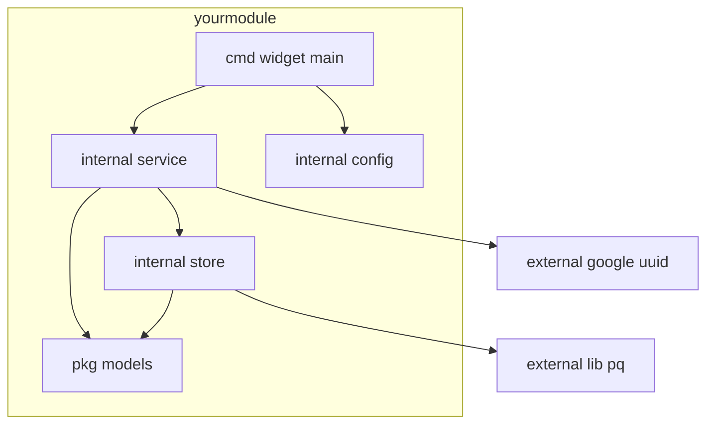

# Chapter 18 — Packages and Modules

> **What you'll learn.** How Go ships and versions code with *modules* and
> `go.mod`, how import paths map to directories, how to add and upgrade
> dependencies safely, and how Go's reproducible, verified builds compare to C's
> headers-and-`-lfoo` model.

C has no standard package manager. You install a library with your OS package
manager (or build it from source), point the compiler at its headers with `-I`,
point the linker at its library with `-L` and `-l`, and track which version you
have by hand or with a `Makefile` comment. Different machines easily end up with
different versions, and "it builds on mine" is a real problem.

Go replaces all of that with **modules**: a built-in system for fetching,
versioning, and verifying dependencies, so a build is **reproducible** (same
inputs everywhere) and **verified** (cryptographically checked). This chapter
builds on the package rules from Chapter 3 — Program Structure: Packages, Imports,
and Visibility, and the commands from Chapter 2 — Installing Go and the `go`
Command. We focus here on modules themselves.

## A module is a tree of packages

Recall from Chapter 3 that **one directory is one package**. A **module** is the
next level up: a *tree* of packages that are versioned, released, and downloaded
together, with a single `go.mod` file at its root.

Every module has a **module path**: a globally unique name that is usually the
location of its source repository, such as `github.com/acme/widget`. This path is
both the module's identity and the **prefix for importing its packages**.

You create a module with `go mod init`, passing the module path:

```sh
mkdir widget && cd widget
go mod init github.com/acme/widget   # creates go.mod
```

> **C vs Go.** There is no C equivalent of `go mod init`. The closest mindset is
> "this directory tree is a library with a name and a version." In C the name and
> version live in your head, a `README`, or a distro package; in Go they live in
> `go.mod`, and the tool enforces them.

## Anatomy of `go.mod`

`go.mod` is a small text file the tool reads and writes. You rarely edit it by
hand. Here is an annotated example showing every directive you are likely to meet:

```
module github.com/acme/widget     <- the module path; also the import prefix

go 1.26                            <- minimum Go language version this module needs

toolchain go1.26.4                 <- exact toolchain to use; managed automatically

require (                          <- dependencies and their selected versions
    github.com/google/uuid v1.6.0
    golang.org/x/text v0.16.0 // indirect   <- pulled in by a dependency, not by you
)

replace github.com/google/uuid => ../forks/uuid  <- swap a dependency for a local copy

exclude golang.org/x/text v0.15.0                <- never select this known-bad version
```

- **`module`** declares the module path.
- **`go`** declares the minimum Go version; it also turns language features on or
  off to match that version.
- **`toolchain`** (Go 1.21+) names the exact toolchain; if you have an older Go,
  the tool downloads this one automatically (see Chapter 2).
- **`require`** lists dependencies with exact versions. The `// indirect` comment
  marks a dependency you do not import directly but that something you use needs.
- **`replace`** swaps one module for another path or version — most often a local
  directory during development. It affects *your* build only, not anyone who
  imports you.
- **`exclude`** forbids a specific version from being selected.

Next to `go.mod` sits **`go.sum`**. It is *not* a lock file of versions (that is
`go.mod`'s job); it is a list of **cryptographic checksums**. Each dependency
contributes two lines — a hash of its file tree and a hash of its `go.mod` — so the
tool can verify on every build that the code in your module cache is byte-for-byte
what it was when first downloaded.

```
github.com/google/uuid v1.6.0 h1:NIvaJDM... <hash of the module's files>
github.com/google/uuid v1.6.0/go.mod h1:Ti... <hash of that version's go.mod>
```

> **Watch out.** Commit **both** `go.mod` and `go.sum`. Together they make a build
> reproducible and tamper-evident. Do not edit `go.sum` by hand; the tool maintains
> it.

## Import paths

An **import path** is just the **module path plus the subdirectory** of the
package inside the module. No headers, no search paths to configure.

```
github.com/acme/widget          module path (from go.mod)
└── internal/store/             subdirectory
        store.go   package store
```

```go
import "github.com/acme/widget/internal/store" // module path + "/internal/store"
```

The last element of the path is usually, but not always, the package name (see
Chapter 3). The standard library uses short paths with no domain (`fmt`,
`net/http`); those resolve to GOROOT. Everything else resolves through the module
cache (see Chapter 2 — Installing Go and the `go` Command).

## Adding and updating dependencies

You do **not** hand-edit `require` lines. Two workflows keep `go.mod` correct.

**Workflow 1 — write the import, then tidy.** Add the `import`, then let the tool
discover and record it:

```go
import "github.com/google/uuid"
```

```sh
go mod tidy   # adds missing requires, drops unused ones, updates go.sum
```

**Workflow 2 — `go get` a specific version.** Use this to pin or upgrade:

```sh
go get github.com/google/uuid@v1.6.0   # add or pin an exact version
go get github.com/google/uuid@latest   # move to the newest release
go get -u ./...                        # upgrade dependencies to newer minor/patch
go get github.com/google/uuid@none     # remove the dependency
```

Since Go 1.17, `go get` only edits dependencies; it no longer installs program
binaries (use `go install pkg@version` for tools — see Chapter 2).

### Versions: semantic versioning and the v2 rule

Go uses **semantic versioning**: a version is `vMAJOR.MINOR.PATCH`, e.g. `v1.6.0`.
The contract is: bumping **PATCH** fixes bugs, **MINOR** adds features
compatibly, and **MAJOR** may break compatibility.

Go enforces this with **semantic import versioning**: a breaking new major version
gets a **new import path**. For `v2` and above, the major version becomes a
suffix on both the module path and every import path.

```go
import "github.com/acme/widget"      // any v0 or v1 release
import "github.com/acme/widget/v2"   // v2.x.x — note the /v2 suffix
```

This is unusual to C eyes but powerful: `v1` and `v2` are *different paths*, so a
single build can use both at once during a migration, with no "two versions of the
same symbol" conflict.

> **C vs Go.** In C, upgrading a shared library to an incompatible major version
> (a new `.so` soname) can break every program linked against it, and you juggle
> versions with symlinks and `LD_LIBRARY_PATH`. Go encodes the major version *in
> the import path*, so incompatible majors simply coexist.

### Minimal Version Selection (brief)

When several modules in your build require different versions of the same
dependency, Go uses **Minimal Version Selection (MVS)**: it picks the **highest
version that any module explicitly requires** — and no higher. It does not grab
"latest" behind your back. The result is deterministic: the same `go.mod` files
always select the same versions, on every machine and every day, until you
explicitly upgrade.

## Integrity and proxies

Three environment settings control where code comes from and how it is verified
(set and inspected with `go env` — see Chapter 2):

- **`GOPROXY`** — the download source. The default, `proxy.golang.org`, is a
  caching mirror run by Google. It makes downloads fast and keeps working even if
  the original repository disappears.
- **`GOSUMDB`** — the checksum database (`sum.golang.org`). The first time anyone
  fetches a module version, the tool records its hash here; later fetches are
  checked against it, so a tampered or swapped release is detected globally.
- **`GOPRIVATE`** — a list of module path patterns that should **bypass** the
  public proxy and checksum database. Set it for private company repositories.

```sh
go env GOPROXY GOSUMDB GOPRIVATE
GOPRIVATE=github.com/acme/* go build ./...   # fetch acme repos directly, no proxy
```

> **C vs Go.** This is the part with no C analog at all. C has no checksum
> database verifying that the `libfoo` you fetched matches what everyone else
> fetched. Go's proxy plus checksum database give you reproducible *and*
> tamper-evident dependencies for free.

## Special directories and directives

### `internal/` packages

A package under a directory named **`internal/`** can be imported **only** by code
rooted at `internal`'s parent. It is Go's way to make a package public within your
module but private to the outside world.

```
github.com/acme/widget/
├── internal/store/     importable by widget code only
└── api/                importable by anyone
```

Anyone outside `github.com/acme/widget` who tries to import
`.../widget/internal/store` gets a compile error. Use `internal/` freely to keep
implementation details from leaking into others' code.

### `replace` for local development and forks

The `replace` directive points a module path at a different location, most often a
local checkout. It is how you develop a library and an app that uses it at the
same time:

```sh
go mod edit -replace github.com/acme/widget=../widget
```

Use `replace` for short-term local work or to test a fork. For day-to-day
multi-module development, prefer a workspace (below), which does the same thing
without editing `go.mod`.

### Vendoring

`go mod vendor` copies every dependency's source into a top-level `vendor/`
directory committed with your code. The build then uses `vendor/` instead of the
module cache.

```sh
go mod vendor          # write ./vendor with all dependencies
go build ./...         # uses ./vendor automatically when it exists
```

Vendoring guarantees a build with no network and an auditable copy of every
dependency in your repository — useful in locked-down or air-gapped environments.

### Workspaces for multi-module local dev

A **workspace** (`go.work`, Go 1.18+) lets you work on several modules together
without touching any `go.mod`. It is the recommended way to edit a library and its
consumer side by side (recap from Chapter 2):

```sh
go work init ./app ./lib   # builds in ./app now use your local ./lib
```

> **Rule of thumb.** Reach for a **workspace** for ongoing local multi-module work;
> use **`replace`** for a one-off fork or pin; use **vendoring** when you need an
> in-repo, offline-buildable copy of all dependencies.

## Project layout

Go has **no required project layout** — the only hard rule is "a directory is a
package." A few conventions are widespread:

- **`cmd/`** — one subdirectory per executable, each a `package main`
  (`cmd/widget/main.go`). Use it when a module ships more than one binary.
- **`internal/`** — private packages, enforced by the compiler as described above.
- **`pkg/`** — a (debated) place for library code meant to be imported by others.
  Many Go developers consider it unnecessary; do not add it just out of habit.

Here is how packages in a small module depend on each other. Arrows point from
importer to imported, and the graph must be acyclic — circular imports are
forbidden (see Chapter 3); break a cycle by extracting a shared package or by
introducing an interface (see Chapter 11 — Interfaces).



> **Rule of thumb.** Prefer **small, flat modules**. Start with a `go.mod` and a
> few packages in the repository root. Add `cmd/`, `internal/`, and submodules only
> when you actually have multiple binaries or a real privacy boundary. Do not build
> a deep directory tree before you need one.

### Publishing a module

There is no upload step and no central registry to push to. You **publish by
pushing to a public repository and tagging a version**:

```sh
git tag v1.2.3
git push origin v1.2.3
```

The first time anyone runs `go get github.com/acme/widget@v1.2.3`, the proxy
fetches that tag, records its checksum, and caches it. For a `v2`+ release, the
module path in `go.mod` must end with `/v2` to match the import path.

> **Watch out.** The module path **must match where the code actually lives** for
> `go get` to find it. If your repository is `github.com/acme/widget`, the `module`
> line must say exactly that. A mismatched path builds fine locally but is
> impossible for others to fetch.

## Key takeaways

- A **module** is a versioned tree of packages with a `go.mod` at its root; its
  **module path** (e.g. `github.com/acme/widget`) is both its identity and its
  import prefix. Create one with `go mod init`.
- `go.mod` holds `module`, `go`, `toolchain`, `require`, `replace`, and `exclude`.
  `go.sum` holds **checksums** for reproducible, tamper-evident builds. Commit both.
- An **import path** is the module path plus the package's subdirectory.
- Add or change dependencies with `import` + `go mod tidy`, or `go get pkg@version`
  — never by hand-editing `go.mod`.
- Versions follow **semantic versioning**; **v2+ needs a `/v2` path suffix**.
  **MVS** picks the highest explicitly-required version, making builds
  deterministic.
- `GOPROXY`, `GOSUMDB`, and `GOPRIVATE` control downloading and verification; set
  `GOPRIVATE` for company repositories.
- `internal/` limits visibility to your subtree; `replace`, vendoring, and
  workspaces support local/offline/fork development.
- There is **no required layout**; prefer small, flat modules. Publish by pushing
  and tagging `vX.Y.Z`.

## Watch out (gotchas for C programmers)

- **The module path must match the repository** or `go get` cannot fetch it. This
  bites people who rename a repo without updating the `module` line.
- **`v2` and above need the `/v2` suffix** in both `go.mod`'s `module` line and
  every import path. Forgetting it is the most common module mistake.
- **Set `GOPRIVATE` for private modules**, or the tool will try the public proxy
  and checksum database and fail to fetch them.
- **Circular imports are a hard error** (see Chapter 3). Modules do not change
  that; the package dependency graph must stay acyclic.
- **`internal/` is enforced by the compiler**, not by convention. Code outside the
  parent of `internal/` simply cannot import it.
- **Let the tool edit `go.mod`/`go.sum`.** Use `go get`, `go mod tidy`, and
  `go mod edit`; hand-editing easily produces an inconsistent `go.sum`.

## Interview questions

**Q: What is the difference between a package and a module in Go?**
A: A package is one directory of `.go` files compiled together (Chapter 3). A
module is a tree of packages versioned and released together, identified by a
module path and described by a `go.mod` file at its root. You import packages; you
version and download modules.

**Q: What do `go.mod` and `go.sum` each do, and why commit both?**
A: `go.mod` records the module path, the Go version, and the exact dependency
versions selected for the build. `go.sum` records cryptographic checksums of those
dependencies so the tool can verify on every build that the downloaded code has
not changed or been tampered with. Committing both makes the build reproducible
and verifiable on any machine.

**Q: How does Go handle an incompatible (major) version upgrade of a dependency?**
A: With semantic import versioning. Major versions v2 and above carry a `/vN`
suffix in the module path and in every import path, so different majors are
different import paths. That lets a build depend on both `v1` and `v2` of the same
library at once, which avoids the symbol-clash problems C has with incompatible
shared-library sonames.

**Q: When several modules require different versions of the same dependency, which
version does Go pick?**
A: Minimal Version Selection picks the highest version that some module in the
build explicitly requires, and no higher. It never silently jumps to "latest," so
the selection is deterministic and only changes when you upgrade on purpose.

**Q: How do Go modules compare to managing C dependencies?**
A: C has no standard package manager: you install libraries via the OS or build
them, pass `-I`/`-L`/`-l` to the toolchain, and track versions by hand, so builds
differ across machines. Go modules give a built-in, versioned, reproducible, and
cryptographically verified dependency system — `go.mod` plus `go.sum` plus a proxy
and checksum database — with nothing to wire up manually.

## Try it

1. Run `go mod init example.com/play`, add `import "github.com/google/uuid"` and a
   call to `uuid.NewString()` in `main`, then run `go mod tidy`. Inspect the new
   `require` line in `go.mod` and the two lines in `go.sum`.
2. Make a package under `internal/` and try to import it from a second, separate
   module on your machine. Watch the compiler refuse with an `internal` error.
