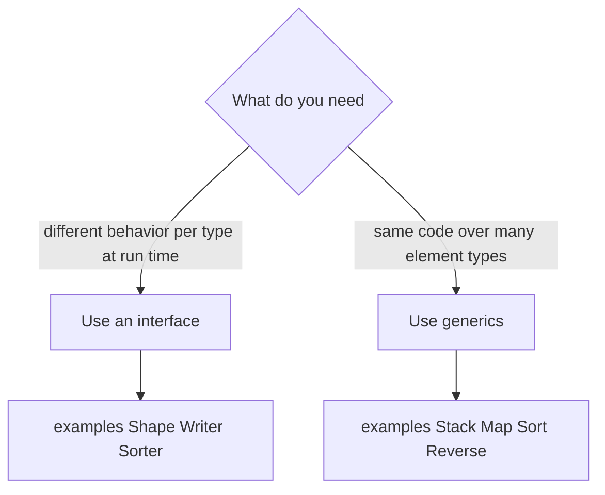

# Chapter 19 — Generics

> **What you'll learn.** Why Go added generics (type parameters), how to write
> generic functions and types, how constraints describe the types you allow, and
> when to reach for generics instead of interfaces. Everything is compared to C's
> macros and `void *`.

A C programmer who wants one piece of code to work for many types has two old
tools, and both hurt. You can write a **macro** with `#define`, which the
preprocessor pastes in with no type checking and no scope. Or you can use
**`void *`** and cast, which throws away type safety and invites crashes. Go 1.18
added a third option, **generics**: real, type-checked code that works for many
types. This chapter shows how to use them well — and when not to.

## Life before generics

Say you want a `Max` function. Before generics, Go gave you three bad choices, all
of which a C programmer will recognize.

**1. Copy-paste, one function per type.** Safe, but you maintain N near-identical
copies:

```go
func MaxInt(a, b int) int {
	if a > b {
		return a
	}
	return b
}

func MaxFloat64(a, b float64) float64 {
	if a > b {
		return a
	}
	return b
}

// ...and a third copy for string, and a fourth, and a fifth.
```

**2. Use `any` and type-assert.** One function, but you lose type safety and pay
for boxing (wrapping each value in an interface). Mistakes blow up at run time,
not compile time:

```go
func Max(a, b any) any {
	// You cannot write a > b on values of type any. You must type-switch on
	// every case by hand, and the caller must cast the result back. Painful.
	return a
}
```

**3. Code generation.** Run a tool that writes the per-type copies for you. It
works, but now your build has an extra step and generated files to manage.

Here is how the same problem looks in C, and why each path is unsafe:

```c
/* A macro: the preprocessor pastes text. No type checking, no scope.        */
/* MAX(i++, j) evaluates an argument twice -> bugs.                          */
#define MAX(a, b) ((a) > (b) ? (a) : (b))

/* A void* container: the compiler cannot check what you put in or take out. */
void  stack_push(Stack *s, void *item);
void *stack_pop(Stack *s);   /* caller must cast back and hope it is right   */
```

| Tool | Type-checked | Scoped | Performance | Notes |
|---|---|---|---|---|
| C `#define` macro | No | No (global text) | Inlined | Double-evaluates args; no types |
| C `void *` + cast | No | Yes | Pointer indirection | Crashes if you cast wrong |
| Go `any` + assert | At run time only | Yes | Boxing + checks | Errors surface late |
| Go generics | **At compile time** | Yes | No boxing | The modern answer |

> **Mental model.** A C macro is "find and replace before compiling": no idea what
> a type is. A Go generic is a real function the compiler checks once and then
> specializes for each type you use it with. You get the reuse of a macro with the
> safety of a normal function.

## Type parameters

A **generic function** declares one or more **type parameters** in square brackets
after its name, before the ordinary parameters. Here is `Max` written once for
every ordered type:

```go
import "cmp"

func Max[T cmp.Ordered](a, b T) T {
	if a > b {
		return a
	}
	return b
}
```

Read it piece by piece, with C in mind:

- `[T cmp.Ordered]` declares a type parameter named `T`. `T` is a stand-in for a
  real type, chosen when the function is called. `cmp.Ordered` is its
  **constraint** — the set of types `T` is allowed to be (here, types that support
  `<`, `>`, and so on). More on constraints below.
- `(a, b T)` — both parameters and the return value are of that same type `T`.
- Inside, you may only use operations the constraint guarantees. Because
  `cmp.Ordered` permits ordering, `a > b` is legal.

**Instantiation** is choosing a concrete type for `T`. Usually you do nothing —
Go **infers** `T` from the arguments:

```go
fmt.Println(Max(3, 5))         // T inferred as int    -> 5
fmt.Println(Max(2.5, 1.5))     // T inferred as float64 -> 2.5
fmt.Println(Max("go", "c"))    // T inferred as string -> go
```

When inference is not possible, or you want to be explicit, name the type in
brackets at the call site:

```go
fmt.Println(Max[float64](1, 2)) // explicit: T is float64
```

> **C vs Go.** C++ templates are the closest cousin, and Go's syntax is similar.
> But Go checks a generic function once, against its constraint, and reports clear
> errors. A C++ template is checked only when instantiated, which is why a small
> mistake can produce pages of errors. Go's constraints make the contract explicit
> up front.

> **Watch out.** Go already has builtin `min` and `max` functions (since Go 1.21),
> so you do not need to write `Max` yourself. We use it here only because it is the
> simplest possible generic.

## Constraints: describing the allowed types

A **constraint** is just an interface used in a type-parameter list. But
constraint interfaces can say more than ordinary ones. An ordinary interface lists
*methods*. A constraint interface may also list a **type set**: the exact set of
types allowed.

### Method constraints

If your code calls a method on `T`, require that method in the constraint:

```go
import "strings"

type Stringer interface {
	String() string
}

func JoinAll[T Stringer](items []T) string {
	var b strings.Builder
	for _, it := range items {
		b.WriteString(it.String()) // allowed: the constraint guarantees String()
	}
	return b.String()
}
```

This looks like normal interface use, and it is — but because `T` is a type
parameter, the slice `[]T` holds concrete values with no per-element boxing.

### Type sets, unions, and `~`

When your code uses **operators** (`+`, `<`, `==`) rather than methods, list the
allowed types instead. A `|` is a **union** ("any of these"):

```go
type Integer interface {
	int | int8 | int16 | int32 | int64
}
```

There is a catch. `int | int64` means *exactly* `int` or `int64`. It does **not**
include a named type whose underlying type is `int`, such as `type Celsius int`.
The `~` token fixes this: `~int` means "any type whose **underlying type** is
`int`." (Underlying type is the built-in type a named type is defined from; see
Chapter 4 — Types, Variables, and Constants.)

```go
type Number interface {
	~int | ~int64 | ~float64 // also matches type Celsius int, type Price float64, ...
}

func Sum[T Number](nums []T) T {
	var total T // zero value of T: 0 for numbers
	for _, n := range nums {
		total += n // allowed: every type in the set supports +
	}
	return total
}
```

Here is the type set drawn out:

```
constraint Number = the set of types whose underlying type is one of:

   ~int     -->  int,     type Celsius int,   type Count int    ...
   ~int64   -->  int64,   type Timestamp int64 ...
   ~float64 -->  float64, type Price float64,  type Ratio float64 ...

A type T satisfies Number if T appears in this set.
```

### The predeclared constraints

Three constraints are built in or one import away, and cover most needs:

- **`any`** — no restriction at all. `T any` means "any type whatsoever." (`any`
  is just the modern spelling of `interface{}`.) Use it for containers that do not
  inspect their elements, like a generic stack.
- **`comparable`** — types that support `==` and `!=`. Required to use a `T` as a
  map key or to compare values. Note: this is *not* the same as `cmp.Ordered`;
  `comparable` allows equality, not `<`/`>`.
- **`cmp.Ordered`** (from the `cmp` package) — types that support `<`, `<=`, `>`,
  `>=`: all integer, float, and string types. Use it for sorting, `min`/`max`, and
  range checks.

```go
func Contains[T comparable](haystack []T, needle T) bool {
	for _, x := range haystack {
		if x == needle { // allowed: comparable guarantees ==
			return true
		}
	}
	return false
}
```

| Constraint | Allows | Typical use |
|---|---|---|
| `any` | every type | containers that do not inspect elements |
| `comparable` | `==`, `!=` | map keys, membership tests |
| `cmp.Ordered` | `<`, `>`, `<=`, `>=` | sorting, `min`/`max`, ranges |
| a method interface | the listed methods | algorithms that call behavior |
| a type-set interface | operators on those types | numeric/string math |

## Generic types

Types can have type parameters too. The classic case is a container. A generic
`Stack` works for any element type with no `void *` and no casting:

```go
package main

import (
	"errors"
	"fmt"
)

type Stack[T any] struct {
	items []T
}

func (s *Stack[T]) Push(item T) {
	s.items = append(s.items, item)
}

func (s *Stack[T]) Pop() (T, error) {
	var zero T // the zero value of T, for the error case
	if len(s.items) == 0 {
		return zero, errors.New("pop from empty stack")
	}
	last := len(s.items) - 1
	item := s.items[last]
	s.items = s.items[:last]
	return item, nil
}

func main() {
	var s Stack[int] // instantiate the type: T is int
	s.Push(10)
	s.Push(20)
	v, _ := s.Pop()
	fmt.Println(v) // 20
}
```

Two details worth noting:

- The receiver is written `(s *Stack[T])` — you repeat the type parameter, but you
  do **not** re-declare its constraint; that lives on the type.
- `var zero T` gives you the zero value of whatever `T` is (`0`, `""`, `nil`, an
  empty struct). It is the generic way to "return nothing meaningful."

> **Watch out.** A **method cannot introduce its own new type parameter.** Only
> functions and type declarations can. This does not compile:
>
> ```go
> // ILLEGAL: a method may not declare a new type parameter U.
> func (s *Stack[T]) Map[U any](f func(T) U) *Stack[U] { /* ... */ }
> ```
>
> Write `Map` as a top-level *function* instead: `func Map[T, U any](s *Stack[T],
> f func(T) U) *Stack[U]`.

## Generics vs interfaces: pick the right tool

Generics and interfaces overlap, so it helps to know which fits.

Use an **interface** when you care about **behavior** and want **dynamic
dispatch** — different concrete types behaving differently behind one method call,
decided at run time. This is classic polymorphism (see Chapter 11 — Interfaces):

```go
// One slice, many concrete types, dispatch decided at run time.
func TotalArea(shapes []Shape) float64 {
	var sum float64
	for _, s := range shapes {
		sum += s.Area() // each shape's own Area runs
	}
	return sum
}
```

Use **generics** when you care about **types**, not behavior — a container or
algorithm that should work uniformly over many element types **without boxing**,
keeping full type information:

```go
// Same code for []int, []string, []float64 — no boxing, type preserved.
func Reverse[T any](s []T) {
	for i, j := 0, len(s)-1; i < j; i, j = i+1, j-1 {
		s[i], s[j] = s[j], s[i]
	}
}
```



> **Rule of thumb.** "Write code, not types." Reach for generics only when you are
> actually repeating the *same* logic across types. If a plain function, a slice of
> a concrete type, or one interface does the job, use that. Over-generic code is
> harder to read than the duplication it replaced.

## The standard generic helpers

Go ships generic helpers so you rarely write the basics yourself. Three packages
cover most slice and map work: `slices`, `maps`, and `cmp`.

```go
package main

import (
	"fmt"
	"maps"
	"slices"
)

func main() {
	nums := []int{3, 1, 4, 1, 5, 9}

	slices.Sort(nums)                     // sort in place: [1 1 3 4 5 9]
	fmt.Println(slices.Contains(nums, 4)) // true
	fmt.Println(slices.Index(nums, 5))    // 4 (index of first 5)
	fmt.Println(slices.Max(nums))         // 9

	m := map[string]int{"a": 1, "b": 2, "c": 3}
	keys := slices.Sorted(maps.Keys(m))   // collect keys, sorted: [a b c]
	fmt.Println(keys)
}
```

A few useful members:

- **`slices`**: `Sort`, `SortFunc`, `Contains`, `Index`, `Max`, `Min`, `Equal`,
  `Reverse`, `Insert`, `Delete`, `Collect`, `Sorted`.
- **`maps`**: `Keys`, `Values`, `Clone`, `Equal`, `Copy`.
- **`cmp`**: `Ordered` (the constraint), `Compare`, `Less`.

> **Watch out.** Since Go 1.23, `maps.Keys(m)` returns an **iterator**, not a
> slice. To get a slice, wrap it: `slices.Collect(maps.Keys(m))`, or
> `slices.Sorted(maps.Keys(m))` to get it sorted in one step (as above). This is
> different from the old experimental `maps` package that returned a slice.

## A short performance note

Generics avoid the boxing cost of `any`: a `[]T` of `int` stores plain `int`s, not
interface values, so there are no allocations or pointer chases per element. That
is the main performance win over the old `any`-and-assert approach.

But generics are **not always literally zero-cost**. The Go compiler implements
them with a mix of two techniques:

- **Stenciling** — generating a specialized copy of the code for a type (or for a
  group of types that share a memory shape), like a C++ template instantiation.
  This is as fast as hand-written code.
- **Dictionaries** — for some type groups, passing a hidden table of type
  information so one shared copy of the code can serve several types. This trades a
  little run-time indirection for smaller binaries.

> **Rule of thumb.** Choose generics for clarity and type safety, not as a
> micro-optimization. They reliably beat `any`-plus-boxing, and they match
> hand-written code closely — but if a hot loop's speed truly matters, measure it
> (see Chapter 17 — Memory and the Garbage Collector) rather than assuming.

## Key takeaways

- Generics give type-checked code reuse, replacing C's untyped `#define` macros and
  unsafe `void *` casts, and Go's own `any`-plus-type-assertion workaround.
- A generic function declares type parameters in brackets: `func Max[T
  cmp.Ordered](a, b T) T`. The type is usually **inferred** from the arguments.
- A **constraint** is an interface used in a type-parameter list. It may list
  methods, or a **type set** using unions (`|`) and `~` for underlying types.
- The predeclared constraints are `any` (everything), `comparable` (`==`), and
  `cmp.Ordered` (`<`, `>`).
- **Types** can be generic too (`type Stack[T any] struct{...}`), but their
  **methods cannot add new type parameters**.
- Use **interfaces** for behavior and dynamic dispatch; use **generics** for
  containers and algorithms over many types without boxing. Do not overuse them.
- The `slices`, `maps`, and `cmp` packages provide ready-made generic helpers.

## Watch out (gotchas for C programmers)

- **Do not overuse generics.** "Write code, not types." If one concrete type or a
  single interface works, prefer it; needless type parameters hurt readability.
- **`~` is about the underlying type.** `int` matches only `int`; `~int` also
  matches `type Celsius int`. Forgetting `~` makes your function reject users'
  named types for no obvious reason.
- **Methods cannot be generic.** A method may use its receiver's type parameters
  but cannot declare new ones. Make it a top-level function instead.
- **You cannot type-switch on a type parameter directly.** `switch x.(type)` where
  `x` has type `T` is a compile error. Convert first: `switch any(x).(type) { ... }`.
- **`comparable` is not `cmp.Ordered`.** `comparable` gives you `==`/`!=` only.
  You need `cmp.Ordered` to use `<` or `>`.
- **Inference is not magic.** If a type parameter does not appear in the ordinary
  parameters, Go cannot infer it; you must instantiate explicitly, e.g.
  `New[int]()`.

## Interview questions

**Q: Why were generics added to Go, and what did people use before?**
A: To get type-checked code reuse across many types. Before generics you copied
the same function per type, used `any` (then `interface{}`) with type assertions —
losing compile-time safety and paying for boxing — or ran a code generator.
Generics give the reuse of a C macro with the safety of a normal, compiler-checked
function.

**Q: What is a constraint, and what can it contain?**
A: A constraint is an interface used in a type-parameter list that limits which
types a type parameter may be. Besides methods, a constraint can list a **type
set**: a union of types with `|`, optionally using `~T` to mean "any type whose
underlying type is `T`." The predeclared constraints are `any`, `comparable`, and
`cmp.Ordered`.

**Q: What does `~int` mean in a constraint, and how is it different from `int`?**
A: `int` allows only the exact type `int`. `~int` allows any type whose underlying
type is `int`, including named types like `type Celsius int`. Use `~` when you
want your generic code to accept users' own types built on a primitive, not just
the primitive itself.

**Q: When should you choose an interface over generics?**
A: Use an interface when you want runtime polymorphism — different concrete types
behaving differently behind one method call (dynamic dispatch). Use generics when
you want the same logic over many element types with full type safety and no
boxing, such as containers and algorithms. If you only need one behavior contract,
an interface is simpler.

**Q: Can a method have its own type parameters? How do you work around it?**
A: No. A method may use the type parameters of its receiver type but cannot
introduce new ones. If you need an extra type parameter (for example a `Map` that
changes element type), write a top-level generic function instead, such as
`func Map[T, U any](s []T, f func(T) U) []U`.

**Q: Are Go generics zero-cost?**
A: Not always, but they avoid interface boxing, which is the big win over `any`.
The compiler uses stenciling (specialized copies, as fast as hand-written code)
and dictionaries (a shared copy with a hidden type table, adding small
indirection) depending on the types. They are usually close to hand-written speed;
measure a hot path rather than assuming.

## Try it

1. Write `Filter[T any](s []T, keep func(T) bool) []T` that returns a new slice of
   the elements for which `keep` returns true. Use it on a `[]int` and a
   `[]string` with no changes to the function.
2. Add a `Number` constraint with `~int | ~float64` and write `Sum`. Define
   `type Celsius float64`, make a `[]Celsius`, and confirm `Sum` accepts it because
   you used `~float64` and not plain `float64`.
