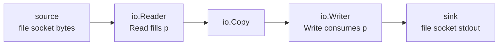

# Chapter 20 — A Tour of the Standard Library

> **What you'll learn.** The packages you will use every day: `fmt`, `strings`,
> `strconv`, `bytes`, `unicode`, `io`, `bufio`, `os`, `time`, `sort`/`slices`,
> `encoding/json`, `errors`, `math`, `math/rand/v2`, `crypto/rand`, `regexp`,
> `log`/`log/slog`, `flag`, `context`, and the generic `slices`/`maps`/`cmp`
> helpers. For each one you get a tiny, runnable example and the C equivalent.

## Batteries included

C gives you a small standard library: `<stdio.h>`, `<string.h>`, `<stdlib.h>`,
`<time.h>`, `<math.h>`, and a few more. Anything bigger — JSON, HTTP, hashing,
compression — you find a third-party library, install it, and link it yourself.

Go ships a **large** standard library. It can parse JSON, serve HTTP, hash
passwords, compress files, and talk to the network with **zero** outside
dependencies. The first rule of Go is therefore simple:

> **Rule of thumb.** Before you add a dependency, check the standard library. It
> is almost certainly there, it is well tested, and it will still work in ten
> years.

The documentation lives at **<https://pkg.go.dev>** (every package, searchable in
your browser) and in your terminal with `go doc` (see Chapter 2 — Installing Go
and the `go` Command). Read the docs; they are short and full of examples.

| Job | C header | Go package |
|---|---|---|
| Formatted print | `<stdio.h>` | `fmt` |
| String functions | `<string.h>` | `strings`, `bytes` |
| Number ↔ text | `<stdlib.h>` (`atoi`) | `strconv` |
| Files and OS | `<stdio.h>`, `<unistd.h>` | `os`, `io`, `bufio` |
| Time and dates | `<time.h>` | `time` |
| Sorting | `<stdlib.h>` (`qsort`) | `sort`, `slices` |
| Math | `<math.h>` | `math` |
| Random numbers | `<stdlib.h>` (`rand`) | `math/rand/v2`, `crypto/rand` |
| Regular expressions | POSIX `<regex.h>` | `regexp` |
| Logging | `<stdio.h>` to `stderr` | `log`, `log/slog` |
| JSON | (none — third party) | `encoding/json` |

Skim this chapter once to learn what exists, then use it as a reference for the
packages you reach for most.

## `fmt` — formatted I/O

`fmt` ("format") is your `<stdio.h>`. It prints, scans, and builds strings.

```go
fmt.Println("hello", 42)              // print args + spaces + newline
fmt.Printf("%s is %d\n", "age", 42)   // C-style format string, to stdout
s := fmt.Sprintf("%05d", 42)          // build a string instead of printing: "00042"
fmt.Fprintln(os.Stderr, "oops")       // print to any io.Writer (here, stderr)
```

The **verbs** (Go's name for format specifiers) you will use most:

| Verb | Meaning | Example output |
|---|---|---|
| `%v` | default format for any value | `{Alice 30}` |
| `%+v` | struct with field names | `{Name:Alice Age:30}` |
| `%#v` | Go syntax (a literal you could paste) | `main.User{Name:"Alice", Age:30}` |
| `%T` | the value's type | `main.User` |
| `%d` | integer, base 10 | `42` |
| `%s` | string or `[]byte` | `hello` |
| `%q` | double-quoted, escaped string | `"hello\n"` |
| `%x` | hexadecimal (numbers or bytes) | `2a` or `68656c6c6f` |
| `%p` | pointer address | `0xc000012345` |
| `%f` `%.2f` | float, fixed precision | `3.14` |
| `%t` | boolean | `true` |

`%v` is the safe default when you do not care about the exact shape. `%+v` and
`%#v` are your debugging friends.

A type controls how it prints by implementing the **`Stringer`** interface: one
method, `String() string`. `fmt` calls it for `%v` and `%s`.

```go
type Color struct{ R, G, B uint8 }

func (c Color) String() string {
	return fmt.Sprintf("#%02x%02x%02x", c.R, c.G, c.B)
}

func main() {
	c := Color{255, 160, 0}
	fmt.Println(c)        // #ffa000  (uses String())
	fmt.Printf("%v\n", c) // #ffa000
}
```

> **C vs Go.** `fmt.Printf` looks like C's `printf`, but it is **type-safe**:
> `%d` with a string argument is caught by `go vet` (Chapter 22 — Tooling), not
> turned into a crash. And you do not pick the verb from the type by hand —
> `%v` prints anything. There is no `%lld` versus `%d` confusion; `%d` works for
> every integer width.

## `strings` — text without `<string.h>`

Strings in Go are immutable (see Chapter 8 — Arrays, Slices, and Strings). The
`strings` package gives you functions that *return new strings* instead of
writing into a buffer.

```go
strings.Contains("seafood", "foo")     // true
strings.HasPrefix("golang", "go")      // true
strings.HasSuffix("file.txt", ".txt")  // true
strings.Split("a,b,c", ",")            // ["a" "b" "c"]
strings.Join([]string{"a", "b"}, "-")  // "a-b"
strings.ReplaceAll("a.b.c", ".", "/")  // "a/b/c"
strings.TrimSpace("  hi \n")           // "hi"
strings.Fields("  one  two three ")    // ["one" "two" "three"] (split on whitespace)
strings.ToUpper("go")                  // "GO"
```

`strings.Cut` (Go 1.18) splits once at the first separator. It is the clean way
to parse `key=value`:

```go
key, val, found := strings.Cut("mode=fast", "=")
// key="mode", val="fast", found=true
```

To build a string piece by piece, use **`strings.Builder`**. It avoids the
quadratic cost of `s = s + more` in a loop (each `+` copies the whole string).

```go
var b strings.Builder
for i := range 3 {
	fmt.Fprintf(&b, "line %d\n", i)
}
result := b.String()
```

| Task | C (`<string.h>`) | Go (`strings`) |
|---|---|---|
| Find substring | `strstr` | `strings.Contains` / `Index` |
| Compare | `strcmp` | `==` or `strings.Compare` |
| Length (bytes) | `strlen` | `len(s)` |
| Copy/concatenate | `strcpy` / `strcat` | `+` or `strings.Builder` |
| Split on delimiter | `strtok` (mutates!) | `strings.Split` |

> **C vs Go.** C's `strtok` writes null bytes into your buffer and keeps hidden
> state, so it is not reentrant. `strings.Split` returns a fresh slice of strings
> and touches nothing. There is no buffer to size, no off-by-one, no overflow.

## `strconv` — numbers and strings

`strconv` ("string conversion") turns text into numbers and back. This is C's
`atoi`, `strtol`, and `sprintf("%d")`, but **every parse returns an error**.

```go
n, err := strconv.Atoi("42")          // string -> int
s := strconv.Itoa(42)                 // int -> string ("42")

i, err := strconv.ParseInt("ff", 16, 64) // base 16, fits in 64 bits -> 255
f, err := strconv.ParseFloat("3.14", 64)  // -> 3.14
b, err := strconv.ParseBool("true")        // -> true

q := strconv.Quote("hi\n")            // -> `"hi\n"` (a safe, escaped literal)
```

> **Watch out.** C's `atoi("abc")` silently returns `0`; you cannot tell `0`
> from an error. Go's `strconv.Atoi("abc")` returns `(0, err)` — **always check
> the error.** Ignoring it is the single most common bug C programmers bring to
> Go.

```go
n, err := strconv.Atoi(userInput)
if err != nil {
	return fmt.Errorf("bad number %q: %w", userInput, err)
}
use(n)
```

## `bytes` — the `[]byte` twin of `strings`

Every function in `strings` has a partner in `bytes` that works on `[]byte`.
Use `bytes` when you already hold a mutable byte buffer (a network read, a file
chunk) and do not want to convert to `string` first (a conversion copies).

```go
bytes.Contains([]byte("seafood"), []byte("foo")) // true
bytes.HasPrefix(buf, []byte("HTTP/"))            // true
```

`bytes.Buffer` is a growable byte buffer that implements both `io.Reader` and
`io.Writer` (see below). It is the idiomatic in-memory stream:

```go
var buf bytes.Buffer
buf.WriteString("status: ")
fmt.Fprintf(&buf, "%d\n", 200)
io.Copy(os.Stdout, &buf) // drains the buffer to stdout
```

## `unicode` and `unicode/utf8`

Go source and strings are UTF-8. These two packages classify and decode
characters (called **runes** — a rune is one Unicode code point, an `int32`).

```go
unicode.IsLetter('A')  // true
unicode.IsDigit('7')   // true
unicode.IsSpace(' ')   // true
unicode.ToUpper('a')   // 'A'

utf8.RuneCountInString("héllo") // 5 runes (the string is 6 bytes)
utf8.ValidString("\xff")        // false (not valid UTF-8)
```

> **C vs Go.** C's `<ctype.h>` (`isdigit`, `toupper`) works on one `char` (one
> byte) and assumes ASCII. Go's `unicode` works on full Unicode code points, so
> it is correct for the whole world's text, not just ASCII.

## `io` — the `Reader` and `Writer` interfaces

`io` defines the two most important interfaces in Go. Almost everything that
moves bytes implements one or both.

```go
type Reader interface { Read(p []byte) (n int, err error) }
type Writer interface { Write(p []byte) (n int, err error) }
type Closer interface { Close() error }
```

A `Reader` fills a byte slice and tells you how many bytes it got. A `Writer`
consumes a byte slice. Because files, network connections, `bytes.Buffer`,
`strings.Reader`, and HTTP bodies all implement these, the same code works on
all of them.



`io.Copy` connects any reader to any writer; `io.ReadAll` slurps a whole reader
into memory; `io.EOF` is the sentinel error that means "no more data."

```go
n, err := io.Copy(os.Stdout, someReader) // stream src -> dst, return bytes copied
data, err := io.ReadAll(resp.Body)        // read everything into a []byte
```

> **C vs Go.** `io.Reader`/`io.Writer` are the typed, safe version of C's
> `read(2)`/`write(2)` and `FILE *`. A function that takes an `io.Reader` does
> not care whether the bytes come from a file, a socket, or a test string. This
> is why Go code is so easy to test: pass a `strings.Reader` instead of a real
> file.

## `bufio` — buffered I/O and scanning

Raw `Read` calls can be small and frequent. `bufio` ("buffered I/O") adds a
buffer, and — most usefully — a `Scanner` that reads input one line (or word) at
a time.

```go
sc := bufio.NewScanner(os.Stdin)
for sc.Scan() { // true until EOF or error
	line := sc.Text() // the current line, without the newline
	fmt.Println(strings.ToUpper(line))
}
if err := sc.Err(); err != nil { // Scan() never returns the error itself
	log.Fatal(err)
}
```

A buffered writer batches small writes into big ones; remember to `Flush`:

```go
w := bufio.NewWriter(os.Stdout)
defer w.Flush() // without this, buffered bytes are lost
fmt.Fprintln(w, "buffered line")
```

> **Watch out.** `bufio.Scanner` has a **default maximum token size of 64 KB**.
> A longer line returns an error from `sc.Err()` (and `Scan` stops). For huge
> lines, grow the buffer with `sc.Buffer(make([]byte, 0, 1<<20), 1<<20)`, or use
> a `bufio.Reader` with `ReadString('\n')` instead.

To scan words instead of lines, set the split function: `sc.Split(bufio.ScanWords)`.

## `os` — talking to the operating system

`os` is your interface to the process and the filesystem.

```go
os.Args            // []string: program name + command-line arguments
os.Getenv("HOME")  // an environment variable ("" if unset)
os.Exit(1)         // exit immediately with a status code (no deferred calls run)
```

Reading and writing whole files is one call each:

```go
data, err := os.ReadFile("config.txt")          // []byte, like reading the whole file
err = os.WriteFile("out.txt", data, 0o644)       // create/overwrite with mode 0644
```

For streaming, open a file as an `*os.File`, which is an `io.Reader`, `io.Writer`,
and `io.Closer`:

```go
f, err := os.Open("big.log") // read-only
if err != nil {
	log.Fatal(err)
}
defer f.Close()
sc := bufio.NewScanner(f)
// ... scan f line by line ...
```

`os.Create` makes a new file for writing. `os.Stdin`, `os.Stdout`, and
`os.Stderr` are the three standard streams, each an `*os.File`.

| Task | C | Go (`os`) |
|---|---|---|
| Command-line args | `argc`, `argv` | `os.Args` |
| Environment | `getenv` | `os.Getenv` / `os.LookupEnv` |
| Open file | `fopen` | `os.Open` / `os.Create` |
| Read whole file | `fread` loop | `os.ReadFile` |
| Exit with status | `exit(1)` / `return 1` | `os.Exit(1)` |

> **Watch out.** `os.Exit` quits **right now**. Any `defer`red calls (Chapter 6
> — Functions) do **not** run. Prefer returning an error up to `main` and exiting
> there; reserve `os.Exit` for the very top level.

## `time` — dates, durations, and timers

`time` replaces `<time.h>`, and it is much friendlier. Two core types:

- `time.Time` — an instant (a point on the calendar/clock).
- `time.Duration` — a span of time, stored as nanoseconds (an `int64`).

```go
start := time.Now()
time.Sleep(50 * time.Millisecond) // durations have units: no raw integers
elapsed := time.Since(start)      // a Duration
fmt.Println(elapsed)              // e.g. "50.1ms" (Duration has a nice String())

deadline := time.Now().Add(2 * time.Hour)
```

Durations are written with units, which kills a whole class of "is this seconds
or milliseconds?" bugs: `5 * time.Second`, `100 * time.Millisecond`.

A `Timer` fires once; a `Ticker` fires repeatedly. Both deliver the time on a
channel (see Chapter 14 — Channels and `select`):

```go
t := time.NewTimer(time.Second)
<-t.C // blocks for one second

tick := time.NewTicker(time.Second)
defer tick.Stop() // a Ticker must be stopped or it leaks
for range 3 {
	<-tick.C // fires every second
}
```

### The reference date: `2006-01-02 15:04:05`

This surprises everyone. To format or parse a time, you do **not** write
`%Y-%m-%d`. Instead you write an *example* of the layout using **one specific
reference time**:

```
Mon Jan 2 15:04:05 MST 2006
```

Read it as a counting sequence: **01/02 03:04:05PM '06 -0700** — month is `1`,
day is `2`, hour is `3`, minute is `4`, second is `5`, year is `6`, time zone is
`7`. You show Go the format by writing that reference time the way you want your
output to look.

```go
const layout = "2006-01-02 15:04:05" // year-month-day hour:minute:second (24h)

now := time.Now()
fmt.Println(now.Format(layout)) // e.g. 2026-03-14 09:30:00

t, err := time.Parse(layout, "2026-03-14 09:30:00")
if err != nil {
	log.Fatal(err)
}
fmt.Println(t.Year(), t.Month()) // 2026 March
```

| Field | C `strftime` | Go layout token |
|---|---|---|
| 4-digit year | `%Y` | `2006` |
| Month (zero-padded) | `%m` | `01` |
| Day | `%d` | `02` |
| Hour (24h) | `%H` | `15` |
| Minute | `%M` | `04` |
| Second | `%S` | `05` |

> **Watch out.** The numbers in the layout are not arbitrary — `15` really means
> "the hour," `01` really means "the month." If you write `2025` instead of
> `2006`, parsing breaks in confusing ways. Memorize the reference date
> `01/02 03:04:05PM '06 -0700` or copy a known-good layout.

## `sort` and the generic `slices.Sort`

The old way is the `sort` package. `sort.Ints`, `sort.Strings`, and the general
`sort.Slice` (which takes a "less" function) still work and you will see them in
older code.

```go
xs := []int{3, 1, 2}
sort.Ints(xs) // [1 2 3]

people := []Person{{"Bob", 30}, {"Ann", 25}}
sort.Slice(people, func(i, j int) bool { return people[i].Age < people[j].Age })
```

Since Go 1.21 the **preferred** way is the generic `slices` package: it is
type-safe and faster (no per-element interface boxing).

```go
xs := []int{3, 1, 2}
slices.Sort(xs) // [1 2 3] — works for any ordered type

// SortFunc takes a comparison returning -1, 0, or +1 (like C's qsort comparator):
slices.SortFunc(people, func(a, b Person) int {
	return cmp.Compare(a.Age, b.Age)
})
```

> **C vs Go.** `sort.Slice` and `slices.SortFunc` replace `qsort`. The big win:
> the comparator is a closure with **typed** values, not two `const void *` you
> must cast. `cmp.Compare` returns the same `-1/0/+1` your `qsort` comparator
> returned.

## `encoding/json` — JSON in the standard library

This is the package C does not have at all. It converts Go values to JSON
(**marshal**) and back (**unmarshal**), driven by struct field names and tags.

```go
type User struct {
	Name  string `json:"name"`
	Email string `json:"email,omitempty"` // omit if empty string
	admin bool   // unexported: never appears in JSON
}

func main() {
	u := User{Name: "Alice"}
	data, _ := json.Marshal(u)
	fmt.Println(string(data)) // {"name":"Alice"}   (Email omitted; admin invisible)

	var back User
	if err := json.Unmarshal([]byte(`{"name":"Bob","email":"b@x.com"}`), &back); err != nil {
		log.Fatal(err)
	}
	fmt.Printf("%+v\n", back) // {Name:Bob Email:b@x.com admin:false}
}
```

The **struct tag** `json:"name"` maps the Go field `Name` to the JSON key
`name`. `omitempty` drops the field when it holds its zero value.

When you do not know the shape ahead of time, decode into `map[string]any` (the
JSON object) or `[]any` (the JSON array). Numbers come back as `float64`.

```go
var m map[string]any
json.Unmarshal([]byte(`{"n":1,"ok":true,"tags":["a","b"]}`), &m)
fmt.Println(m["n"], m["ok"]) // 1 true   (m["n"] is a float64)
```

For streams (a file, an HTTP body), use the **`Encoder`/`Decoder`** so you do not
hold the whole document in memory:

```go
enc := json.NewEncoder(os.Stdout)
enc.SetIndent("", "  ") // pretty-print
enc.Encode(u)            // writes one JSON value + newline to the writer

dec := json.NewDecoder(os.Stdin)
var got User
dec.Decode(&got) // reads one JSON value from the reader
```

> **Watch out.** `encoding/json` can only see **exported** (capitalized) fields,
> because it uses reflection and reflection cannot read unexported fields. An
> unexported field is silently skipped on both marshal and unmarshal — a classic
> "why is my field always empty?" bug (see Chapter 3 — Program Structure).

## `errors` — working with error values

A recap of Chapter 12 — Errors. `errors` helps you build and inspect the `error`
chains created by wrapping with `fmt.Errorf("...: %w", err)`.

```go
var ErrNotFound = errors.New("not found")

err := fmt.Errorf("load config: %w", ErrNotFound) // wrap

errors.Is(err, ErrNotFound) // true — is this error (or its cause) ErrNotFound?

var perr *os.PathError
errors.As(err, &perr) // true if some error in the chain is a *os.PathError

both := errors.Join(err1, err2) // combine several errors into one (Go 1.20)
```

`errors.Is` replaces fragile string comparison (`strings.Contains(err.Error(),
"not found")`). `errors.As` extracts a specific error type from the chain.

## `math`, `math/rand/v2`, and `crypto/rand`

`math` is `<math.h>`: `math.Sqrt`, `math.Pow`, `math.Floor`, `math.Abs`,
`math.Max`/`math.Min` (for floats), constants like `math.Pi`, and limits like
`math.MaxInt64`.

```go
math.Sqrt(2)    // 1.414...
math.MaxInt32   // 2147483647
math.Inf(1)     // +Inf
```

For non-secure randomness use **`math/rand/v2`** (the modern version, Go 1.22).
It seeds itself automatically — no `srand(time(NULL))` needed.

```go
rand.IntN(6)            // a number in [0, 6)
rand.N(100)             // generic: [0, 100) for any integer type
rand.Float64()          // [0.0, 1.0)
rand.Shuffle(len(xs), func(i, j int) { xs[i], xs[j] = xs[j], xs[i] })
```

For anything security-sensitive (tokens, passwords, keys), use **`crypto/rand`**,
which reads from the operating system's secure random source.

```go
buf := make([]byte, 16)
if _, err := crand.Read(buf); err != nil { // crand is an alias for crypto/rand
	log.Fatal(err)
}
token := fmt.Sprintf("%x", buf) // 32 hex characters
```

> **Watch out.** `math/rand/v2` is fast and predictable — **never** use it for
> passwords, session tokens, or keys. An attacker can reproduce its output. Use
> `crypto/rand` for secrets. This is the same `rand()` versus `/dev/urandom`
> distinction you know from C, but the package names make the choice explicit.

## `regexp` — regular expressions

`regexp` implements RE2 syntax (safe: no catastrophic backtracking). Compile a
pattern once, then reuse it.

```go
re := regexp.MustCompile(`(\w+)@(\w+)\.com`) // MustCompile panics on a bad pattern
re.MatchString("a@b.com")                    // true
re.FindString("contact a@b.com now")         // "a@b.com"
re.FindStringSubmatch("a@b.com")             // ["a@b.com" "a" "b"]  (full match + groups)
re.ReplaceAllString("a@b.com", "REDACTED")   // "REDACTED"
```

> **Rule of thumb.** For fixed substrings, `strings.Contains` is far faster than
> a regular expression. Reach for `regexp` only when the pattern is truly
> variable.

## `log` and structured `log/slog`

The classic `log` package writes timestamped lines to standard error:

```go
log.Println("server starting")     // 2026/03/14 09:30:00 server starting
log.Printf("listening on :%d", 8080)
log.Fatal("cannot bind")           // prints, then calls os.Exit(1)
```

Modern Go prefers **`log/slog`** (Go 1.21) for *structured* logging: each line
is key/value pairs, easy for machines to parse and filter.

```go
slog.Info("request handled", "method", "GET", "path", "/", "status", 200)
// 2026/03/14 09:30:00 INFO request handled method=GET path=/ status=200
```

Swap the **handler** to emit JSON, and set a minimum level:

```go
logger := slog.New(slog.NewJSONHandler(os.Stdout, &slog.HandlerOptions{
	Level: slog.LevelDebug,
}))
slog.SetDefault(logger) // now plain slog.Info(...) uses this handler

logger.Info("user login", slog.String("user", "alice"), slog.Int("attempts", 1))
// {"time":"...","level":"INFO","msg":"user login","user":"alice","attempts":1}
```

> **C vs Go.** In C you log with `fprintf(stderr, ...)` and grep unstructured
> text. `slog` gives every log line a level and typed key/value fields, so a log
> system can filter on `status=500` without a regex. Prefer `slog` for new
> services.

## `flag` — command-line flags

`flag` parses `-name value` options. A short taste here; Chapter 24 — Building
Command-Line Tools goes deep.

```go
port := flag.Int("port", 8080, "port to listen on")
verbose := flag.Bool("v", false, "verbose output")
flag.Parse() // reads os.Args; remaining args are flag.Args()

fmt.Println(*port, *verbose) // flag values come back as pointers
```

## `context` — cancellation and deadlines

A recap of Chapter 15 — Synchronization and `context`. A `context.Context`
carries a cancellation signal and a deadline across function and goroutine
boundaries. By convention it is the first argument of any function that does
I/O or blocks.

```go
ctx, cancel := context.WithTimeout(context.Background(), 2*time.Second)
defer cancel() // always cancel to release resources

select {
case <-ctx.Done():
	fmt.Println("timed out:", ctx.Err()) // context deadline exceeded
case res := <-work:
	use(res)
}
```

## The generic helpers: `slices`, `maps`, `cmp`

These three packages (Go 1.21) add the helpers that, in C, you wrote by hand for
every type. They are **generic** (Chapter 19 — Generics), so one function works
for `[]int`, `[]string`, or `[]YourType`.

`slices` operates on any slice:

```go
slices.Contains(xs, 3)        // membership test
slices.Index(xs, 3)           // first index of 3, or -1
slices.Max(xs)                // largest element
slices.Equal(a, b)            // element-by-element comparison
slices.Reverse(xs)            // in place
ys := slices.Clone(xs)        // shallow copy
```

`maps` operates on any map. Note that `maps.Keys` returns an **iterator**
(`iter.Seq`), not a slice (Go 1.23) — combine it with `slices` to get a sorted
slice:

```go
m := map[string]int{"b": 2, "a": 1}
keys := slices.Sorted(maps.Keys(m)) // ["a" "b"] — collect + sort the iterator
mc := maps.Clone(m)                  // shallow copy of the map
maps.Equal(m, mc)                    // true
```

`cmp` provides comparison helpers for ordered types:

```go
cmp.Compare(3, 5) // -1   (a<b -> -1, a==b -> 0, a>b -> +1)
cmp.Less(3, 5)    // true
name := cmp.Or(userName, "anonymous") // first non-zero value (Go 1.22)
```

> **C vs Go.** In C you copy-paste a sort or a "contains" loop for each type, or
> fight `void *` and `qsort`. Go's generic `slices`/`maps`/`cmp` give you one
> tested implementation that the compiler specializes for your exact type — type
> safety *and* no boilerplate.

## Key takeaways

- Go's standard library is large and high quality. Check it before adding a
  dependency. Docs are at <https://pkg.go.dev> and via `go doc`.
- `fmt` is type-safe `printf`. Learn `%v`, `%+v`, `%#v`, `%T`, `%q`; implement
  `String() string` to control how a type prints.
- `strings`/`bytes` return new values instead of mutating buffers; build strings
  with `strings.Builder`. `strconv` converts text and numbers and **always**
  returns an error to check.
- `io.Reader`/`io.Writer` are the universal byte interfaces; `bufio.Scanner`
  reads input line by line (mind the 64 KB token limit). `os` covers args, env,
  files, and the standard streams.
- `time` uses the reference layout `2006-01-02 15:04:05`; durations carry units.
- Prefer the generic `slices.Sort`/`slices`/`maps`/`cmp` helpers over the older
  `sort` package and hand-written loops.
- `encoding/json` (de)serializes **exported** fields, guided by struct tags.
- Use `math/rand/v2` for speed, `crypto/rand` for secrets. Use `slog` for
  structured logging.

## Watch out (gotchas for C programmers)

- **`strconv` errors are not optional.** Unlike `atoi`, a parse failure returns
  an error; ignoring it hides bad input.
- **The `time` layout is the literal reference date.** `2006`, `01`, `02`, `15`,
  `04`, `05` are magic numbers, not arbitrary examples.
- **`encoding/json` ignores unexported fields.** Capitalize fields you want
  serialized; use tags to set the JSON key.
- **`bufio.Scanner` caps tokens at 64 KB by default.** Long lines error out
  unless you enlarge the buffer.
- **`math/rand/v2` is not secure.** Use `crypto/rand` for anything an attacker
  must not predict.
- **`maps.Keys` returns an iterator, not a slice.** Wrap it with
  `slices.Sorted` or `slices.Collect` to get a slice.
- **`os.Exit` skips `defer`.** Deferred cleanup does not run; prefer returning an
  error to `main`.

## Interview questions

**Q: What is the difference between `fmt.Println`, `fmt.Printf`, and `fmt.Sprintf`?**
A: `Println` prints its arguments separated by spaces with a trailing newline.
`Printf` prints using a format string with verbs like `%d` and `%s` and adds no
newline unless you write `\n`. `Sprintf` is like `Printf` but returns the result
as a `string` instead of printing it. There are also `Fprint*` variants that
write to any `io.Writer`.

**Q: Why does `strconv.Atoi` return an error when C's `atoi` does not?**
A: `atoi` returns `0` for invalid input, so you cannot distinguish the number
zero from a parse failure. `strconv.Atoi` returns `(int, error)`, forcing you to
detect and handle bad input explicitly, which prevents silent bugs.

**Q: Explain Go's time layout string `2006-01-02 15:04:05`.**
A: Go formats and parses time by example. You write the one reference instant —
Mon Jan 2 15:04:05 MST 2006 — in the shape you want. The tokens count up: month
1, day 2, hour 3 (or 15 for 24-hour), minute 4, second 5, year 6, zone 7. So
`2006-01-02` means "four-digit year, dash, two-digit month, dash, two-digit
day."

**Q: What do `io.Reader` and `io.Writer` give you that C's `FILE *` does not?**
A: They are small interfaces, so any source or sink of bytes — file, socket,
in-memory buffer, HTTP body, test string — satisfies them. Functions written
against `io.Reader`/`io.Writer` work on all of those without change, which makes
code reusable and easy to test (pass a `strings.Reader` or `bytes.Buffer`).

**Q: When do you use `math/rand/v2` versus `crypto/rand`?**
A: Use `math/rand/v2` for simulations, sampling, shuffling, and load generation,
where speed matters and predictability is fine. Use `crypto/rand` for security:
tokens, passwords, keys, nonces. `math/rand/v2` output is reproducible and must
never protect a secret.

**Q: Why does `encoding/json` ignore some struct fields?**
A: It uses reflection, which can only access exported (capitalized) fields. An
unexported field is invisible to marshal and unmarshal. Capitalize the field and
use a `json:"..."` tag to control the key name and options like `omitempty`.

## Try it

1. Write a program that reads numbers from standard input with a
   `bufio.Scanner`, parses each with `strconv.Atoi` (handling errors), and prints
   the running total. Pipe a file into it: `go run . < numbers.txt`.
2. Define a `struct` with a few fields and `json:"..."` tags, marshal it with
   `json.MarshalIndent`, then unmarshal the bytes back and confirm the round trip.
   Lowercase one field name and watch it disappear from the JSON.
