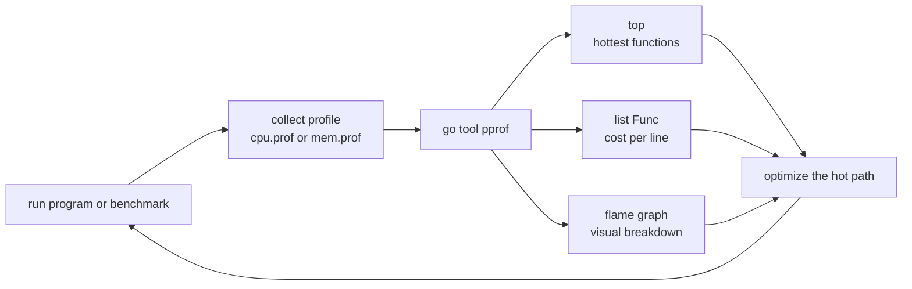

# Chapter 22 — Tooling: Format, Vet, Lint, Race, Profile, Debug

> **What you'll learn.** The tools that keep Go code clean, correct, and fast:
> `gofmt`/`goimports`, `go vet`, `staticcheck`, `golangci-lint`, the race
> detector, `pprof` profiling, the execution tracer, the Delve debugger,
> escape/inlining analysis, `go generate`, `govulncheck`, and the `gopls`
> language server — each mapped to the C tool it replaces.

## One toolbox instead of many

In C you assemble your quality tools from separate projects: `clang-format` to
format, `cppcheck` or `clang-tidy` to lint, Valgrind to find memory and
threading bugs, `gprof` to profile, and `gdb` to debug. Each has its own flags,
its own quirks, and its own install.

Go builds most of this into the `go` command and `go tool` (see Chapter 2 —
Installing Go and the `go` Command). A few extras (`staticcheck`,
`golangci-lint`, `dlv`, `govulncheck`, `gopls`) are single-binary installs with
`go install`. Here is the map a C programmer can keep on their desk:

| Job | C tool | Go tool |
|---|---|---|
| Format source | `clang-format` | `gofmt` / `go fmt`, `goimports` |
| Static analysis (lint) | `cppcheck`, `clang-tidy` | `go vet`, `staticcheck`, `golangci-lint` |
| Data-race detection | Valgrind (Helgrind/DRD) | race detector (`-race`) |
| Memory errors | Valgrind (Memcheck) | (mostly gone: GC + bounds checks) |
| CPU / heap profiling | `gprof`, Callgrind | `pprof` (`go tool pprof`) |
| Execution timeline | — | `go tool trace` |
| Debugger | `gdb`, `lldb` | Delve (`dlv`) |
| Disassemble | `objdump` | `go tool objdump` |
| Vulnerability scan | (third party) | `govulncheck` |
| Editor intelligence | `clangd` | `gopls` |

> **Mental model.** Valgrind splits into two Go ideas. Its *memory* checking
> (use-after-free, leaks) is mostly unnecessary because Go has a garbage
> collector and bounds-checked slices. Its *threading* checking maps to Go's
> built-in race detector.

## Formatting: `gofmt`, `go fmt`, `goimports`

Go has exactly one official style, applied by `gofmt`. There is nothing to
configure and no style argument to have. This was covered in Chapter 2; the key
flags for tooling and CI are:

```sh
gofmt -l .        # LIST files that are not correctly formatted (prints nothing if clean)
gofmt -d .        # show a DIFF of what would change
gofmt -w .        # rewrite files in place
go fmt ./...      # wrapper: format every package in the module
```

`gofmt -l .` is the CI check: if it prints any filename, the build fails because
someone committed unformatted code.

**`goimports`** is `gofmt` plus import management: it adds missing imports and
removes unused ones while formatting. Many editors run it on save.

```sh
go install golang.org/x/tools/cmd/goimports@latest
goimports -w .    # format AND fix the import block
```

> **C vs Go.** `clang-format` needs a `.clang-format` file and team agreement on
> 50 options. `gofmt` has zero options on purpose, so every Go file in the world
> looks the same. Do not fight it; configure your editor to run it on save.

## Vetting: `go vet`

`go vet` is a static analyzer that ships with Go. It reports code that compiles
but is probably wrong. It is the rough equivalent of `cppcheck`, but built in and
zero-config.

```sh
go vet ./...
```

A sample of what it catches:

- **`printf`** — a format string that does not match its arguments, e.g.
  `fmt.Printf("%d", "hello")`. This is the check C programmers miss most, because
  C's `printf` is not type-checked at all.
- **`copylocks`** — copying a value that contains a `sync.Mutex` (copying a lock
  breaks it).
- **`lostcancel`** — the `cancel` function from `context.WithCancel` is never
  called (a resource leak).
- **`unreachable`** — code after a `return` that can never run.
- **`structtag`** — a malformed struct tag like `json:name` (missing quotes).

```go
// go vet flags this: %d wants an integer, got a string.
fmt.Printf("count=%d\n", "three")
```

> **Rule of thumb.** Run `go vet ./...` on every commit and in CI. It is fast,
> has almost no false positives, and `go test` already runs a subset of vet
> before your tests.

## Linting: `staticcheck` and `golangci-lint`

`go vet` is deliberately conservative. For deeper analysis, add a linter.

**`staticcheck`** is the most respected single linter. It finds bugs, dead code,
and simplifications `go vet` will not.

```sh
go install honnef.co/go/tools/cmd/staticcheck@latest
staticcheck ./...
```

**`golangci-lint`** is a *meta-linter*: it runs many linters (including `go vet`
and `staticcheck`) in one fast pass, configured by a `.golangci.yml` file. It is
the de-facto standard in CI.

```sh
# install a released binary (preferred — see golangci-lint.run for the current command)
brew install golangci-lint

golangci-lint run ./...        # run the configured set of linters
golangci-lint run --fix ./...  # auto-fix what can be fixed
```

> **C vs Go.** `golangci-lint` is like running `clang-tidy` with a curated set of
> checks, but it is fast (it caches and runs linters in parallel) and the whole
> ecosystem uses the same handful of linters, so findings are consistent across
> projects.

## The race detector

A **data race** is two goroutines touching the same memory at the same time with
at least one write and no synchronization (see Chapter 16 — Concurrency
Patterns). The race detector finds these at runtime. Add `-race` to any run:

```sh
go test -race ./...   # the most common use
go run -race .
go build -race -o app .
```

When it sees a race, it prints both stacks — the read and the conflicting write —
so you know exactly which two accesses collided.

> **Watch out.** The race detector is a **dynamic** tool: it only finds races on
> code paths that actually execute during the run. A race in a rarely-taken
> branch is invisible until that branch runs. So run your *tests* with `-race` in
> CI to exercise as many paths as possible. Also note the cost: roughly 2–20×
> slower and several times more memory, so it is for testing, not production.

## Profiling with `pprof`

`pprof` answers "where does the time (or memory) go?" — the job of `gprof` and
Callgrind in C, but easier and built in. You collect a **profile** (a sample of
where the program spends resources), then explore it with `go tool pprof`.

There are three ways to collect a profile.

**1. From a benchmark or test** — the quickest:

```sh
go test -bench=. -cpuprofile=cpu.prof -memprofile=mem.prof
```

**2. From a program** with `runtime/pprof`:

```go
import (
	"os"
	"runtime/pprof"
)

func main() {
	f, err := os.Create("cpu.prof")
	if err != nil {
		panic(err)
	}
	defer f.Close()

	pprof.StartCPUProfile(f) // begin sampling
	defer pprof.StopCPUProfile()

	doExpensiveWork()
}
```

**3. From a server** with `net/http/pprof` — a blank import wires profiling
endpoints onto the default HTTP mux at `/debug/pprof/`:

```go
import (
	"net/http"
	_ "net/http/pprof" // registers /debug/pprof/ handlers as a side effect
)

func main() {
	go http.ListenAndServe("localhost:6060", nil) // profiling endpoint
	runServer()
}
```

Then collect a 30-second CPU profile from the live server:

```sh
go tool pprof http://localhost:6060/debug/pprof/profile?seconds=30
```

Once you have a profile, explore it interactively:

```sh
go tool pprof cpu.prof
```

The commands you use inside `pprof`:

| Command | What it shows |
|---|---|
| `top` | the functions using the most CPU/memory |
| `top -cum` | sorted by cumulative cost (function plus its callees) |
| `list Func` | annotated source of `Func`, cost per line |
| `web` | a visual call graph in your browser (needs Graphviz) |
| `peek Func` | callers and callees of `Func` |

Or jump straight to a flame graph in the browser:

```sh
go tool pprof -http=:8080 cpu.prof   # opens a web UI with a flame graph
```

The whole loop looks like this:



> **Watch out.** A profile is only as good as the load you put on the program.
> Profiling an idle server or a trivial input tells you nothing. Drive
> **representative** work — a realistic benchmark or production-like traffic —
> before you trust the numbers. Profile first, optimize second: never guess.

## The execution tracer: `go tool trace`

`pprof` tells you *where* time goes; the tracer tells you *what the runtime was
doing over time* — goroutine scheduling, blocking, GC pauses, and channel waits.
It is invaluable for concurrency problems that a CPU profile cannot show.

```sh
go test -trace=trace.out -bench=.
go tool trace trace.out   # opens an interactive timeline in the browser
```

Use it when goroutines are blocked or latency is spiky and you need to see who is
waiting on whom.

## The debugger: Delve (`dlv`)

`gdb` technically works on Go binaries, but it does not understand goroutines,
channels, or the Go runtime well. The Go community debugger is **Delve** (`dlv`),
which is Go-aware.

```sh
go install github.com/go-delve/delve/cmd/dlv@latest
```

Start a debug session — `dlv` compiles and runs your program under its control:

```sh
dlv debug ./cmd/server   # build and debug a program
dlv test ./...           # debug a test
dlv exec ./app           # debug an already-built binary
```

Inside the session, the commands mirror `gdb` but speak Go:

```
(dlv) break main.go:42        # set a breakpoint at a line
(dlv) break main.handleReq    # or at a function
(dlv) continue                # run to the next breakpoint
(dlv) next                    # step over one line
(dlv) step                    # step into a call
(dlv) print myVar             # inspect a variable
(dlv) goroutines              # LIST every goroutine (gdb cannot do this well)
(dlv) goroutine 7             # switch to goroutine 7
```

| Action | gdb | Delve |
|---|---|---|
| Start | `gdb ./a.out` | `dlv exec ./app` |
| Breakpoint | `break file.c:42` | `break file.go:42` |
| Continue / step | `continue` / `next` | `continue` / `next` |
| Print variable | `print x` | `print x` |
| List threads/goroutines | `info threads` | `goroutines` |

> **C vs Go.** The big difference is `goroutines`: Delve lists and switches
> between goroutines, which `gdb` cannot do meaningfully for Go. For everyday work
> many Go programmers debug less than in C — fast compiles, `t.Log`, and the race
> detector catch most issues before a debugger is needed.

## Compiler insight: `-gcflags=-m` and `go tool objdump`

To see whether a value is allocated on the stack or escapes to the heap (Chapter
17 — Memory and the Garbage Collector), ask the compiler with `-m`:

```sh
go build -gcflags=-m ./...
```

```go
func newCounter() *int {
	n := 0    // the compiler reports: moved to heap: n
	return &n // returning its address forces n onto the heap
}
```

The output also notes which functions are **inlined** (`can inline newCounter`).
This is how you confirm an optimization actually happened, rather than guessing.

To read the generated assembly for a single function, use `objdump`:

```sh
go build -o app .
go tool objdump -s 'main\.newCounter' app   # disassemble one function by regexp
```

> **C vs Go.** This is your `objdump -d` and your `gcc -fdump`-style insight, but
> Go's escape analysis output answers the question a C programmer actually cares
> about: "did this allocate, and where?"

## `go generate`

`go generate` runs commands written as special comments, so generated code (such
as `Stringer` methods or mocks) is reproducible. It never runs on its own — you
invoke it (see Chapter 2).

```go
//go:generate stringer -type=Color
type Color int
```

```sh
go generate ./...   # runs the directives; commit the generated files
```

## `govulncheck` — vulnerability scanning

`govulncheck` checks your dependencies against the official Go vulnerability
database — and, crucially, reports only vulnerabilities your code **actually
reaches**, not every advisory for every imported module.

```sh
go install golang.org/x/vuln/cmd/govulncheck@latest
govulncheck ./...
```

Run it in CI to catch a known-vulnerable dependency before it ships. There is no
standard C equivalent shipped with the compiler.

## `gopls` — the language server

`gopls` ("Go please") is the official **language server**: the background program
your editor talks to for autocomplete, go-to-definition, find-references,
inline errors, and rename-across-the-project. It is the Go counterpart to
`clangd`.

```sh
go install golang.org/x/tools/gopls@latest
```

You rarely run `gopls` by hand; your editor (VS Code, Neovim, GoLand) launches it
and uses it through the Language Server Protocol. Installing it is usually all
you do.

## Key takeaways

- One toolbox: `gofmt`/`goimports` (format), `go vet` + `staticcheck` +
  `golangci-lint` (lint), `-race` (data races), `pprof` (CPU/heap), `go tool
  trace` (scheduling), `dlv` (debug), `govulncheck` (CVEs), `gopls` (editor).
- `gofmt` is non-negotiable: `gofmt -l .` in CI fails on unformatted code.
- `go vet` catches `printf` mismatches, copied locks, lost context cancels, and
  more — run it everywhere. `golangci-lint` bundles the deeper linters.
- The race detector (`go test -race`) is dynamic: it only sees races on executed
  paths, so run your tests with it in CI.
- Profile with `pprof` under representative load: collect `cpu.prof`/`mem.prof`,
  then `go tool pprof` with `top`, `list`, and a flame graph.
- Delve (`dlv`) is the Go-aware debugger; unlike `gdb` it understands goroutines.
- `-gcflags=-m` shows escape analysis and inlining; `govulncheck` scans
  dependencies; `gopls` powers your editor.

## Watch out (gotchas for C programmers)

- **The race detector only finds races it observes.** A clean `-race` run does
  not prove the absence of races; it proves none happened on the paths you ran.
- **`-race` is for testing, not production.** It slows the program several-fold
  and uses much more memory.
- **A profile under unrealistic load is misleading.** Drive representative work
  before optimizing, and let the data — not intuition — pick the hot path.
- **`gofmt` is enforced on teams.** Unformatted code fails CI; set your editor to
  format on save.
- **Run `go vet` and a linter in CI, not just locally.** Findings that only you
  see locally do not protect the team.
- **`gdb` is a poor fit for Go.** Use Delve so you can inspect goroutines and the
  runtime.

## Interview questions

**Q: How does Go's tooling replace the separate C tools clang-format, cppcheck,
valgrind, gprof, and gdb?**
A: `gofmt`/`goimports` replace clang-format; `go vet`, `staticcheck`, and
`golangci-lint` replace cppcheck/clang-tidy; the built-in race detector
(`-race`) replaces Valgrind's threading checks while the garbage collector and
bounds checks remove most of Valgrind's memory job; `pprof` replaces
gprof/Callgrind; and Delve (`dlv`) replaces gdb, adding goroutine awareness. Most
ship with the `go` command; the rest are one `go install` away.

**Q: What is the difference between `go vet` and a linter like `staticcheck`?**
A: `go vet` ships with Go and is intentionally conservative — it reports likely
bugs (printf mismatches, copied locks, lost context cancels) with almost no false
positives. `staticcheck` is a third-party linter that goes further: dead code,
simplifications, and subtler correctness issues. `golangci-lint` runs many
linters, including both, in one pass and is the usual CI choice.

**Q: What are the limitations of the race detector?**
A: It is dynamic, so it only detects races on code paths that actually run during
that execution; untaken branches are not checked. It also adds significant CPU
and memory overhead, so it is used during testing (ideally in CI with good
coverage) rather than in production. A clean run is evidence, not proof, of
race-freedom.

**Q: Walk through profiling a slow Go program with pprof.**
A: Collect a profile under representative load — from a benchmark
(`go test -cpuprofile=cpu.prof`), a program (`runtime/pprof`), or a server
(`net/http/pprof`). Open it with `go tool pprof cpu.prof`, run `top` to see the
hottest functions, `list Func` to see cost per line, and `web` or a flame graph
(`-http=:8080`) to visualize the call graph. Optimize the hot path, then
re-profile to confirm.

**Q: Why use Delve instead of gdb for Go?**
A: Delve understands the Go runtime — goroutines, channels, and Go's calling
conventions — so it can list and switch between goroutines, print Go values
correctly, and set breakpoints by Go function name. gdb works on the raw binary
but misrepresents goroutines and runtime state, making it unreliable for
concurrent Go programs.

**Q: What does `go build -gcflags=-m` tell you?**
A: It prints the compiler's escape-analysis and inlining decisions: which
variables "escape to the heap" (and why) and which functions can be inlined. A C
programmer uses it to confirm whether a value is stack- or heap-allocated and to
verify that a small function was inlined, instead of guessing.

## Try it

1. Write a tiny program with a `printf` bug (`fmt.Printf("%d", "hi")`) and run
   `go vet ./...`. Watch it flag the mismatch the compiler accepted.
2. Add a CPU-heavy function, benchmark it with
   `go test -bench=. -cpuprofile=cpu.prof`, then run `go tool pprof -http=:8080
   cpu.prof` and read the flame graph.
3. Run `go build -gcflags=-m .` on a function that returns `&localVar` and confirm
   the compiler reports "moved to heap."
