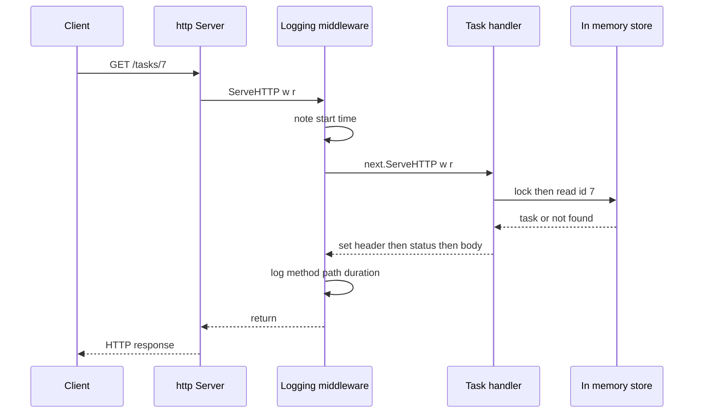

# Chapter 23 — Building Web Services with net/http

> **What you'll learn.** How to build a real HTTP/JSON service with Go's
> standard library and **no third-party code**: handlers, the modern
> method-and-wildcard router, a complete REST API, middleware, timeouts,
> graceful shutdown, and the HTTP client.

In C, writing an HTTP server is a project of its own. You pull in a library such
as **libmicrohttpd** or **libevent**, learn its callback model, juggle sockets
and buffers, and write a lot of code before the first request even works.

Go takes the opposite approach. The `net/http` package in the standard library
is **production-grade**: real companies serve real traffic with it directly, no
framework on top. You can write a complete web service with **zero
dependencies** — no package to fetch, no build step to add, just
`import "net/http"`. This chapter builds one service from the first line to a
clean shutdown, then writes a client to call it.

> **Mental model.** `net/http` is both the web *server* library and the HTTP
> *client* library in one package. The same `Request` and `Response` types
> describe the message on both sides of the wire.

## The smallest server

Here is a complete server. It answers every request with the same line of text.

```go
package main

import (
	"fmt"
	"net/http"
)

func main() {
	mux := http.NewServeMux()
	mux.HandleFunc("/", func(w http.ResponseWriter, r *http.Request) {
		fmt.Fprintln(w, "hello from Go")
	})
	http.ListenAndServe(":8080", mux) // blocks; serves until the process dies
}
```

Run it and call it:

```sh
go run .
curl localhost:8080      # -> hello from Go
```

Three pieces do the work:

- **`http.ServeMux`** is a *request multiplexer* — a router. It looks at each
  request and decides which function handles it. ("mux" is short for
  multiplexer.)
- **`HandleFunc`** registers a function for a pattern (here `/`, the catch-all).
- **`http.ListenAndServe`** opens a TCP socket on the address and runs the
  server loop. It blocks forever unless it fails.

> **Watch out.** `ListenAndServe` returns an `error`. The snippet above ignores
> it to stay short, but real code must check it — we do that at the end of the
> chapter.

## Handlers: the http.Handler interface

Everything that answers a request is an **`http.Handler`**. That is a
one-method interface (interfaces are covered in Chapter 11 — Interfaces):

```go
type Handler interface {
	ServeHTTP(w http.ResponseWriter, r *http.Request)
}
```

A handler reads the request `r` and writes the reply through `w`. To answer a
request, you implement `ServeHTTP`.

Writing a whole type with a method is heavy when all you have is a function. So
`net/http` gives you an **adapter**, `http.HandlerFunc`: a function type that
*is* a `Handler`.

```go
type HandlerFunc func(w http.ResponseWriter, r *http.Request)

// A HandlerFunc satisfies Handler by calling itself.
func (f HandlerFunc) ServeHTTP(w http.ResponseWriter, r *http.Request) {
	f(w, r)
}
```

So any plain function with the right signature becomes a `Handler` simply by
converting it: `http.HandlerFunc(myFunc)`. The `mux.HandleFunc(pattern, fn)`
method does that conversion for you.

> **C vs Go.** In a C HTTP library you register a *callback*: a function pointer
> plus a `void *user_data` to carry state. Go's `http.Handler` is the same idea
> made type-safe. The interface replaces the function pointer; the handler's own
> fields, or a closure, replace `user_data`.

> **Mental model.** A `Handler` answers one request. A `ServeMux` is a `Handler`
> that picks *other* handlers. Middleware (below) is a `Handler` that wraps
> *another* handler. They all share one shape, so they snap together.

## Modern routing: method and wildcard patterns

Old Go code matched only on path prefixes and parsed the URL by hand. Since
**Go 1.22**, a `ServeMux` pattern can include an **HTTP method** and **named
wildcards**. This is now the default, idiomatic way to route, and it is what we
use in this book.

A pattern reads as `"METHOD /path/{name}"`:

```go
mux := http.NewServeMux()
mux.HandleFunc("GET /tasks", listTasks)     // method + fixed path
mux.HandleFunc("POST /tasks", createTask)
mux.HandleFunc("GET /tasks/{id}", getTask)  // {id} is a wildcard segment
mux.HandleFunc("DELETE /tasks/{id}", deleteTask)
```

Inside a handler you read a wildcard by name with **`r.PathValue`**:

```go
func getTask(w http.ResponseWriter, r *http.Request) {
	id := r.PathValue("id") // the text that matched {id}, always a string
	// ...
}
```

Rules worth knowing:

- The method must be uppercase and followed by a space: `GET /x`.
- `{id}` matches exactly one path segment. `{rest...}` (with three dots) matches
  the remainder of the path, slashes included.
- A trailing `{$}` means "match this path exactly," so `/tasks/{$}` will not also
  swallow `/tasks/anything`.
- If the path matches but the **method** does not, `ServeMux` replies
  `405 Method Not Allowed` for you. You do not write that check.
- The more specific pattern wins, so `GET /tasks/{id}` and `GET /tasks/today`
  can both be registered without conflict.

> **C vs Go.** With a C library you usually match a path prefix yourself and then
> `strtok` the URL to pull out the id. Go's wildcard router does the parsing and
> hands you `r.PathValue("id")` directly — no manual string surgery, no
> off-by-one bugs.

## The request and the response

A handler receives a **`*http.Request`** (the incoming message) and an
**`http.ResponseWriter`** (where you write the reply).

Common things you read from `*http.Request`:

```go
r.Method                    // "GET", "POST", ...
r.URL.Path                  // "/tasks/7"
r.URL.Query().Get("limit")  // ?limit=10  ->  "10"  (empty string if missing)
r.Header.Get("Content-Type")
r.PathValue("id")           // a {id} wildcard from the route
r.Body                      // an io.ReadCloser streaming the request body
r.Context()                 // the request's context (cancellation, deadlines)
```

The body is an `io.Reader` — a stream of bytes (see Chapter 8 — Arrays, Slices,
and Strings). You usually hand it straight to a JSON decoder. On the **server**
you do not have to close `r.Body`; the server does it for you.

To send a reply, `http.ResponseWriter` has three parts, used in this order:

```go
w.Header().Set("Content-Type", "application/json") // 1. headers
w.WriteHeader(http.StatusCreated)                   // 2. status code (201)
w.Write([]byte(`{"ok":true}`))                      // 3. body
```

**The order is mandatory.** Set headers first, then call `WriteHeader` with the
status, then write the body. The first call to `Write` *implies*
`WriteHeader(http.StatusOK)` if you have not called it yourself. Once body bytes
start flowing, the status and headers are already on the wire and **cannot
change**.

Use the named constants — `http.StatusOK` (200), `http.StatusNotFound` (404),
and so on — rather than bare numbers. They read better and prevent typos.

> **Watch out.** Calling `w.WriteHeader(404)` *after* you have written body bytes
> does nothing useful (and logs a warning). The status went out with the first
> byte of the body. Setting headers vs writing the body in the wrong order is the
> single most common `net/http` mistake.

## A complete JSON REST API

Now the real thing: an in-memory store of **tasks** with four endpoints.

| Method and path | Does | Success status |
|---|---|---|
| `GET /tasks` | list all tasks | 200 OK |
| `POST /tasks` | create a task from a JSON body | 201 Created |
| `GET /tasks/{id}` | fetch one task | 200 OK |
| `DELETE /tasks/{id}` | delete one task | 204 No Content |

The program is built up across the next few sections — the data and store, the
JSON helpers, the handlers, the logging middleware, and finally `main`.
Collected in that order into one `main.go` (the `slow` example in the *Context
and timeouts* section is a separate illustration, not part of it), it compiles
and runs.

### The data and the store

```go
// Command tasksd is a small JSON REST API for a list of tasks.
package main

import (
	"context"
	"encoding/json"
	"errors"
	"log"
	"net/http"
	"os"
	"os/signal"
	"strconv"
	"sync"
	"syscall"
	"time"
)

// Task is one to-do item. Only EXPORTED (capitalized) fields are encoded to
// JSON. The `json:"..."` struct tags set the key names used on the wire.
type Task struct {
	ID    int    `json:"id"`
	Title string `json:"title"`
	Done  bool   `json:"done"`
}

// store holds tasks in memory. HTTP handlers run in separate goroutines, so a
// mutex must guard every read and write of the shared map and counter.
type store struct {
	mu     sync.Mutex
	tasks  map[int]Task
	nextID int
}

func newStore() *store {
	return &store{tasks: make(map[int]Task), nextID: 1}
}

func (s *store) list() []Task {
	s.mu.Lock()
	defer s.mu.Unlock()
	// Pre-allocate with length 0 so an empty store encodes to [] and not null.
	out := make([]Task, 0, len(s.tasks))
	for _, t := range s.tasks {
		out = append(out, t)
	}
	return out
}

func (s *store) create(title string) Task {
	s.mu.Lock()
	defer s.mu.Unlock()
	t := Task{ID: s.nextID, Title: title}
	s.tasks[t.ID] = t
	s.nextID++
	return t
}

func (s *store) get(id int) (Task, bool) {
	s.mu.Lock()
	defer s.mu.Unlock()
	t, ok := s.tasks[id]
	return t, ok
}

func (s *store) remove(id int) bool {
	s.mu.Lock()
	defer s.mu.Unlock()
	if _, ok := s.tasks[id]; !ok {
		return false
	}
	delete(s.tasks, id)
	return true
}
```

> **Watch out.** `encoding/json` can only see **exported** fields — those that
> start with a capital letter (see Chapter 3 — Program Structure: Packages,
> Imports, and Visibility). A lowercase field is silently skipped on encode and
> decode. The `json:"id"` *tag* sets the JSON key name; without a tag the key
> would be the Go field name `ID`.

### Concurrency: handlers run in parallel

This is the point a C programmer must internalize first:

> **Watch out.** The Go server runs **each request in its own goroutine**. Two
> requests can run your handler at the *same time* on different CPU cores. Any
> shared state — here the `tasks` map and the `nextID` counter — must be
> protected. A Go map is **not** safe for concurrent writes; an unprotected one
> triggers a fatal "concurrent map writes" crash, not a silent corruption.

That is why every store method takes `s.mu.Lock()` first. The `sync.Mutex` (see
Chapter 15 — Synchronization and context) makes each operation atomic. In C with `pthreads`
you would reach for a `pthread_mutex_t` for exactly the same reason; the hazard
is identical, only the spelling differs.

### JSON helpers

Two small helpers centralize the response format:

```go
// writeJSON sets the header, then the status, then the body. Order matters:
// once the body is written the status code is locked in.
func writeJSON(w http.ResponseWriter, status int, v any) {
	w.Header().Set("Content-Type", "application/json")
	w.WriteHeader(status)
	_ = json.NewEncoder(w).Encode(v)
}

func writeError(w http.ResponseWriter, status int, msg string) {
	writeJSON(w, status, map[string]string{"error": msg})
}
```

`json.NewEncoder(w).Encode(v)` writes `v` as JSON straight to the response, with
no intermediate buffer. The decode side is the mirror image:
`json.NewDecoder(r.Body).Decode(&in)` reads JSON from the request body into a
struct.

> **Watch out.** A nil slice encodes to JSON `null`, not `[]`. The `list` method
> returns `make([]Task, 0, ...)`, so an empty list serializes to `[]`, which is
> what clients expect.

### The handlers

```go
func (s *store) handleList(w http.ResponseWriter, r *http.Request) {
	writeJSON(w, http.StatusOK, s.list())
}

func (s *store) handleCreate(w http.ResponseWriter, r *http.Request) {
	var in struct {
		Title string `json:"title"`
	}
	if err := json.NewDecoder(r.Body).Decode(&in); err != nil {
		writeError(w, http.StatusBadRequest, "invalid JSON body")
		return
	}
	if in.Title == "" {
		writeError(w, http.StatusBadRequest, "title is required")
		return
	}
	writeJSON(w, http.StatusCreated, s.create(in.Title))
}

func (s *store) handleGet(w http.ResponseWriter, r *http.Request) {
	id, err := strconv.Atoi(r.PathValue("id")) // the {id} wildcard, as a string
	if err != nil {
		writeError(w, http.StatusBadRequest, "id must be a number")
		return
	}
	t, ok := s.get(id)
	if !ok {
		writeError(w, http.StatusNotFound, "no such task")
		return
	}
	writeJSON(w, http.StatusOK, t)
}

func (s *store) handleDelete(w http.ResponseWriter, r *http.Request) {
	id, err := strconv.Atoi(r.PathValue("id"))
	if err != nil {
		writeError(w, http.StatusBadRequest, "id must be a number")
		return
	}
	if !s.remove(id) {
		writeError(w, http.StatusNotFound, "no such task")
		return
	}
	w.WriteHeader(http.StatusNoContent) // 204: success, no body
}
```

Notice the shape of every handler: validate the input, call a store method, then
write a response. Errors return early with a JSON body and the right status.
`strconv.Atoi` converts the `{id}` text to an `int` (see Chapter 20 — A Tour of
the Standard Library). The `main` function that wires the routes and runs the
server comes after middleware and shutdown, below.

## Middleware

A **middleware** is a function that takes a `Handler` and returns a new
`Handler` wrapping it. The signature is always the same:

```go
func(http.Handler) http.Handler
```

The wrapper does work before and/or after, then calls the inner handler's
`ServeHTTP`. Here is request logging:

```go
// logging is middleware. It wraps a handler, does work before and after, and
// calls the next handler in between. The signature func(http.Handler)
// http.Handler is what lets you chain many middlewares together.
func logging(next http.Handler) http.Handler {
	return http.HandlerFunc(func(w http.ResponseWriter, r *http.Request) {
		start := time.Now()
		next.ServeHTTP(w, r)
		log.Printf("%s %s took %s", r.Method, r.URL.Path, time.Since(start))
	})
}
```

You apply it by wrapping the mux. Because each middleware has the same input and
output type, you **chain** them like the layers of an onion:

```go
handler := logging(auth(rateLimit(mux)))
// request flows in this order:
//   logging -> auth -> rateLimit -> mux -> your handler
// and the responses unwind back out the same way.
```

> **Mental model.** Middleware is Go's version of a "filter chain." In C you
> might push a request through an array of function pointers; here each layer is
> a `Handler` that holds the next one and calls it.

> **Rule of thumb.** Keep each middleware to one concern — logging,
> authentication, compression, recovering from a panic — and compose them. Do
> not write one giant wrapper that does everything.

## Context and timeouts

Every request carries a **context** (`context.Context`; see Chapter 15 —
Synchronization and context). Get it with `r.Context()`. The server cancels this context when
the client disconnects or the request ends. Use it to stop slow work — a
database query, an outbound call — once the caller has gone away. This standalone
handler (it would need its own `import "fmt"`) shows the idea:

```go
// slow does some work but gives up early if the client disconnects.
func slow(w http.ResponseWriter, r *http.Request) {
	ctx := r.Context() // cancelled when the client goes away
	select {
	case <-time.After(2 * time.Second): // pretend this is a slow query
		fmt.Fprintln(w, "done")
	case <-ctx.Done(): // the client disconnected; stop working
		return
	}
}
```

Separately, set **timeouts on the server itself** so a slow or malicious client
cannot tie up resources forever. You do this by building an `http.Server` value
instead of calling the bare `http.ListenAndServe`:

```go
srv := &http.Server{
	Addr:         ":8080",
	Handler:      logging(mux),
	ReadTimeout:  5 * time.Second,
	WriteTimeout: 10 * time.Second,
	IdleTimeout:  120 * time.Second,
}
```

| Field | Limits | Protects against |
|---|---|---|
| `ReadTimeout` | time to read the whole request | clients that send very slowly |
| `WriteTimeout` | time to write the whole response | clients that read very slowly |
| `IdleTimeout` | time a keep-alive connection may sit idle | idle connections piling up |

> **Watch out.** A bare `http.ListenAndServe(addr, h)` has **no timeouts at
> all**. A single client that opens a connection and sends one byte per minute (a
> "slowloris" attack) can exhaust your server. Always build an `http.Server{}`
> with explicit timeouts for anything exposed to a network.

## Graceful shutdown

When you deploy a new version, or a container is told to stop, you want in-flight
requests to finish rather than be cut off mid-response. The pattern: catch the
signal, then call `srv.Shutdown(ctx)`.

```go
func main() {
	s := newStore()

	// Go 1.22+ routing: each pattern carries a method and may use {wildcards}.
	mux := http.NewServeMux()
	mux.HandleFunc("GET /tasks", s.handleList)
	mux.HandleFunc("POST /tasks", s.handleCreate)
	mux.HandleFunc("GET /tasks/{id}", s.handleGet)
	mux.HandleFunc("DELETE /tasks/{id}", s.handleDelete)

	srv := &http.Server{
		Addr:         ":8080",
		Handler:      logging(mux), // wrap the whole mux in one middleware
		ReadTimeout:  5 * time.Second,
		WriteTimeout: 10 * time.Second,
		IdleTimeout:  120 * time.Second,
	}

	// NotifyContext cancels ctx when the process gets SIGINT (Ctrl-C) or SIGTERM.
	ctx, stop := signal.NotifyContext(context.Background(), os.Interrupt, syscall.SIGTERM)
	defer stop()

	// Run the server in its own goroutine so main can wait for the signal.
	go func() {
		log.Printf("listening on %s", srv.Addr)
		if err := srv.ListenAndServe(); err != nil && !errors.Is(err, http.ErrServerClosed) {
			log.Fatalf("server error: %v", err)
		}
	}()

	<-ctx.Done() // block here until a signal arrives
	log.Println("shutting down")

	// Give in-flight requests up to 10 seconds to finish, then stop.
	shutdownCtx, cancel := context.WithTimeout(context.Background(), 10*time.Second)
	defer cancel()
	if err := srv.Shutdown(shutdownCtx); err != nil {
		log.Fatalf("forced shutdown: %v", err)
	}
	log.Println("stopped cleanly")
}
```

`signal.NotifyContext` returns a context that is cancelled on `Ctrl-C`
(`SIGINT`) or `SIGTERM` (the signal a container runtime or `systemd` sends). The
server runs in a goroutine; `main` waits on `ctx.Done()`. `srv.Shutdown` then
stops accepting new connections and waits for active handlers to return, up to
the deadline you pass.

> **Watch out.** `ListenAndServe` returns `http.ErrServerClosed` after a clean
> `Shutdown`. That is the *normal* path, not a failure. Check for it with
> `errors.Is` (see Chapter 12 — Errors) so you do not log a phantom error.

## The HTTP client

`net/http` is also a client. The quick form is one call:

```go
resp, err := http.Get("http://localhost:8080/tasks")
if err != nil {
	log.Fatal(err)
}
defer resp.Body.Close() // REQUIRED: always close the body
body, _ := io.ReadAll(resp.Body)
```

> **Watch out.** Two traps live on the client side:
>
> 1. **Always `defer resp.Body.Close()`.** If you forget, the underlying TCP
>    connection cannot be reused or freed — a slow leak that only bites under
>    load.
> 2. **`http.Get`, `http.Post`, and `http.DefaultClient` have NO timeout.** A
>    hung server will hang your program forever. For anything real, build your
>    own `http.Client` with a `Timeout`.

The production form gives you a timeout and a context:

```go
// Command taskget fetches the task list from the server and prints it.
package main

import (
	"context"
	"fmt"
	"io"
	"log"
	"net/http"
	"time"
)

func main() {
	// Always give a client a timeout. http.DefaultClient (used by http.Get and
	// http.Post) has NO timeout, so a slow server can hang your program forever.
	client := &http.Client{Timeout: 10 * time.Second}

	// A context lets you cancel the request from elsewhere: a deadline, Ctrl-C,
	// or a parent request that was itself cancelled.
	ctx, cancel := context.WithTimeout(context.Background(), 5*time.Second)
	defer cancel()

	req, err := http.NewRequestWithContext(ctx, http.MethodGet, "http://localhost:8080/tasks", nil)
	if err != nil {
		log.Fatal(err)
	}
	req.Header.Set("Accept", "application/json")

	resp, err := client.Do(req)
	if err != nil {
		log.Fatal(err)
	}
	defer resp.Body.Close() // ALWAYS close the body, or you leak connections.

	body, err := io.ReadAll(resp.Body)
	if err != nil {
		log.Fatal(err)
	}
	fmt.Printf("status %d\n%s", resp.StatusCode, body)
}
```

`http.NewRequestWithContext` ties the request to a context, so a deadline or a
cancellation stops it. `client.Do(req)` sends it. The `Timeout` on the client is
a backstop covering the whole exchange: connect, send, and receive.

> **Rule of thumb.** Create one `http.Client` and reuse it across requests. It
> pools and reuses TCP connections under the hood. A fresh client per request
> defeats that pool.

## How a request flows

This is the lifecycle of one `GET /tasks/7` request as it passes through the
logging middleware to the handler and back.



## Key takeaways

- `net/http` is a production-grade server **and** client in the standard
  library. You can ship a real service with zero dependencies.
- A `Handler` is a one-method interface (`ServeHTTP`). `http.HandlerFunc` adapts
  a plain function into one. A `ServeMux` routes to handlers.
- Use Go 1.22 routing: patterns carry a method and `{wildcards}`, e.g.
  `"GET /tasks/{id}"`, and you read them with `r.PathValue("id")`.
- Send the reply in order: headers, then `WriteHeader(status)`, then body. After
  the body starts, status and headers are fixed.
- Encode and decode JSON with `json.NewEncoder(w)` and
  `json.NewDecoder(r.Body)`. Only exported fields are included; tags name the
  keys.
- Handlers run concurrently — one goroutine each — so guard shared state with a
  `sync.Mutex`.
- Middleware is `func(http.Handler) http.Handler`; chain layers to compose
  behavior.
- Set `ReadTimeout`, `WriteTimeout`, and `IdleTimeout` on an `http.Server`, and
  shut down cleanly with `signal.NotifyContext` plus `srv.Shutdown`.
- On the client, always `defer resp.Body.Close()` and always set a `Timeout`.

## Watch out (gotchas for C programmers)

- **Handlers run concurrently.** Each request gets its own goroutine; unguarded
  shared state races, and a concurrent map write is a hard crash, not a warning.
- **Order of writes is fixed.** Setting a header or status *after* writing body
  bytes silently does nothing.
- **Only exported struct fields are serialized.** A lowercase field vanishes from
  JSON; use exported fields with `json:"..."` tags.
- **A nil slice marshals to `null`, not `[]`.** Pre-allocate an empty slice when
  a client expects an empty array.
- **`http.DefaultClient` and `http.Get` have no timeout.** Use a custom
  `http.Client{Timeout: ...}` for anything real.
- **Not closing `resp.Body` leaks connections.** Always
  `defer resp.Body.Close()` after checking the error.
- **A bare `ListenAndServe` has no server timeouts**, leaving you open to
  slowloris-style attacks. Build an `http.Server` with timeouts set.
- **`http.ErrServerClosed` is normal** after `Shutdown`; do not treat it as a
  failure.

## Interview questions

**Q: What is the `http.Handler` interface, and how does `http.HandlerFunc` relate
to it?**
A: `http.Handler` has one method, `ServeHTTP(w http.ResponseWriter, r
*http.Request)`. Anything implementing it can answer requests. `http.HandlerFunc`
is a function type with a `ServeHTTP` method that just calls the function, so a
plain function with the right signature becomes a `Handler` by converting it.
This is an adapter from a function to an interface value.

**Q: How does Go 1.22 routing differ from older `ServeMux` usage?**
A: Patterns can now include an HTTP method and named wildcards, such as
`"GET /tasks/{id}"`. The mux matches on both method and path, returns 405 when
the path matches but the method does not, and exposes captured segments through
`r.PathValue("id")`. Older code matched only path prefixes and parsed the URL by
hand.

**Q: Why must shared state in handlers be synchronized, and how?**
A: The server serves each request in its own goroutine, so handlers can run in
parallel on multiple cores. Reads and writes of shared data (maps, counters,
caches) therefore race. Protect them with a `sync.Mutex` (or `sync.RWMutex`), or
confine the state to a single goroutine and communicate over channels. An
unprotected concurrent map write crashes the program.

**Q: Why must you set headers and the status code before writing the body?**
A: The response is streamed. The first `Write` flushes the status line and
headers (defaulting the status to 200 if you have not set one). After that the
status and headers are already sent, so later calls to `Header().Set` or
`WriteHeader` have no effect.

**Q: Name two client-side mistakes with `net/http` and how to avoid them.**
A: First, forgetting `defer resp.Body.Close()`, which leaks the TCP connection;
always close the body after checking the error. Second, using `http.Get` or
`http.DefaultClient`, which have no timeout, so a stuck server hangs you forever;
use a custom `http.Client{Timeout: ...}` and pass a context with
`http.NewRequestWithContext`.

**Q: How do you shut a Go HTTP server down gracefully?**
A: Create the listener with `signal.NotifyContext` so a context is cancelled on
SIGINT or SIGTERM. Run `ListenAndServe` in a goroutine. When the context is done,
call `srv.Shutdown(ctx)` with a timeout; it stops accepting new connections and
waits for in-flight handlers to finish. Treat the `http.ErrServerClosed` returned
by `ListenAndServe` as the normal end, not an error.

## Try it

1. Save the task API as `main.go`, run `go run .`, and exercise it with curl:
   `curl -X POST localhost:8080/tasks -d '{"title":"buy milk"}'`, then
   `curl localhost:8080/tasks`, then `curl localhost:8080/tasks/1`, then
   `curl -X DELETE localhost:8080/tasks/1`.
2. Ask for a missing task (`curl -i localhost:8080/tasks/999`) and confirm you
   get `404` with a JSON error body.
3. Send a wrong method (`curl -i -X PUT localhost:8080/tasks/1`) and watch the
   mux return `405 Method Not Allowed` without any code from you.
4. Press `Ctrl-C` while a request is in flight and watch the "stopped cleanly"
   log line print after the request completes.
