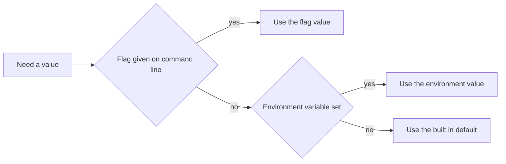

# Chapter 24 — Building Command-Line Tools

> **What you'll learn.** How to write a real command-line program in Go: reading
> arguments and flags, git-style subcommands, the stdin/stdout/stderr
> discipline, exit codes, config precedence, Ctrl-C handling, and how to ship a
> single static binary.

Go is one of the best languages for command-line tools, and the reasons line up
with what a C programmer cares about. A Go program compiles to **one static
binary** that starts instantly and runs on a target machine with nothing else
installed (see Chapter 1 — Why Go for a C Programmer). That is why so many of the
tools you use every day — `kubectl`, `docker`, `gh`, `terraform`, `hugo` — are
written in Go.

In C you start from `int main(int argc, char **argv)` and `getopt`, and you build
everything else by hand. Go gives you the same low-level access through `os.Args`,
plus a small standard-library `flag` package that covers most tools without any
dependency. This chapter builds a complete `grep`-like tool and shows the pieces
along the way.

## Arguments: os.Args

`os.Args` is a slice of strings: the program name followed by its arguments. It
is Go's `argv`, and `len(os.Args)` is its `argc`.

```go
package main

import (
	"fmt"
	"os"
)

func main() {
	fmt.Println("program:", os.Args[0])  // like argv[0]
	fmt.Println("args:", os.Args[1:])     // the rest, like argv[1..argc-1]
}
```

| Concept | C | Go |
|---|---|---|
| Argument list | `int argc, char **argv` | `os.Args []string` |
| Program name | `argv[0]` | `os.Args[0]` |
| Argument count | `argc` | `len(os.Args)` |
| Option parsing | `getopt`, `getopt_long` | the `flag` package |
| Exit with status | `exit(2)` or `return 2` | `os.Exit(2)` or return a code |
| Standard streams | `stdin`, `stdout`, `stderr` | `os.Stdin`, `os.Stdout`, `os.Stderr` |
| Read environment | `getenv("X")` | `os.Getenv("X")` |
| Signal handling | `signal`, `sigaction` | the `os/signal` package |

### Exit codes and the os.Exit trap

A C program returns an exit status from `main` or calls `exit(code)`. In Go,
`main` returns nothing; you set the status with `os.Exit(code)`. By convention
`0` means success and any non-zero value means failure.

But there is a sharp trap:

> **Watch out.** `os.Exit` terminates the process **immediately** and does **not
> run deferred functions** (see Chapter 6 — Functions). Any `defer file.Close()`
> or `defer buf.Flush()` is skipped, so buffers may not flush and temp files may
> not be removed.

```go
func main() {
	defer fmt.Println("cleanup") // this line NEVER runs
	fmt.Println("working")
	os.Exit(1) // exits now, skipping every deferred call
}
```

> **Rule of thumb.** Keep `main` tiny: have it call a helper such as
> `func run() int` that does the work with normal `defer`s and `return`s, then
> `os.Exit(run())`. By the time `os.Exit` fires, every `defer` in `run` has
> already executed. The `minigrep` program below uses exactly this shape.

## The flag package

The `flag` package is Go's `getopt`. You declare each flag, call `flag.Parse`,
then read the values. Each `flag.String`/`Int`/`Bool` returns a **pointer** to
the variable it will fill.

```go
package main

import (
	"flag"
	"fmt"
	"strings"
)

func main() {
	name := flag.String("name", "world", "who to greet")
	count := flag.Int("count", 1, "how many times to greet")
	shout := flag.Bool("shout", false, "print in uppercase")
	flag.Parse() // parses os.Args[1:]; handles -h and reports bad flags

	msg := "hello, " + *name
	if *shout {
		msg = strings.ToUpper(msg)
	}
	for range *count { // integer range, Go 1.22+
		fmt.Println(msg)
	}
	if extra := flag.Args(); len(extra) > 0 {
		fmt.Println("ignored positional args:", extra)
	}
}
```

```sh
go run . -name Ada -count 2 -shout
# HELLO, ADA
# HELLO, ADA
go run . -h          # prints auto-generated usage from the descriptions
```

Key points:

- The third argument to each `flag.*` call is the **default**; it is used when
  the flag is absent.
- `flag.Parse` stops at the first non-flag argument. Call it **before**
  `flag.Args()`.
- `flag.Args()` returns the leftover **positional** arguments as `[]string`.
- `flag` builds the `-h`/`--help` usage text for you from the descriptions.

> **C vs Go.** Go's `flag` differs from GNU `getopt_long` in ways that surprise
> people:
>
> - A flag uses a **single dash** by convention (`-count`), but `flag` accepts a
>   double dash too (`--count`); both mean the same thing.
> - You **cannot bundle** short booleans: `-abc` is one flag named `abc`, not
>   `-a -b -c`.
> - The value forms `-count 2` and `-count=2` are both fine. Booleans use
>   `-shout` or `-shout=false`.
> - Use a bare `--` to mark the end of flags, so later dash-leading words are
>   treated as positional arguments.

The forms the `flag` package accepts, at a glance:

| Form | Meaning |
|---|---|
| `-flag` | boolean flag, set to true |
| `-flag=false` | boolean flag, set to false |
| `-flag value` | flag with a value, space-separated |
| `-flag=value` | flag with a value, equals sign |
| `--flag` | same as `-flag`; the double dash is accepted |
| `--` | end of flags; everything after is positional |
| `word` | a positional argument, read with `flag.Args()` |

### Custom flags with flag.Value

For a flag that the standard types do not cover — say one that may be **repeated**
— implement the `flag.Value` interface. It needs two methods, `String() string`
and `Set(string) error`, then you register it with `flag.Var`.

```go
// tags collects repeated -tag values. A type satisfies the flag.Value
// interface by providing String() and Set() methods.
type tags []string

func (t *tags) String() string     { return strings.Join(*t, ",") }
func (t *tags) Set(v string) error { *t = append(*t, v); return nil }

func main() {
	var tagList tags
	flag.Var(&tagList, "tag", "add a tag; may be repeated")
	flag.Parse()
	fmt.Printf("tags = %v\n", []string(tagList)) // -tag a -tag b -> tags = [a b]
}
```

`flag` calls `Set` once for each `-tag` on the command line, so the slice
accumulates every value.

## Subcommands (git-style)

Tools like `git commit` and `go build` use **subcommands**: the first argument
selects a mode, and each mode has its own flags. The `flag` package supports this
with `flag.NewFlagSet`, which creates an independent flag set you parse yourself.
You switch on `os.Args[1]` and parse the remaining arguments.

```go
// A git-style CLI with subcommands: `tool add ...` and `tool list ...`.
// Each subcommand has its own independent set of flags.
package main

import (
	"flag"
	"fmt"
	"os"
)

func main() {
	if len(os.Args) < 2 {
		fmt.Fprintln(os.Stderr, "usage: tool <add|list> [flags]")
		os.Exit(2)
	}

	switch os.Args[1] { // dispatch on the first argument
	case "add":
		fs := flag.NewFlagSet("add", flag.ExitOnError)
		priority := fs.Int("priority", 1, "task priority")
		_ = fs.Parse(os.Args[2:]) // parse only the args AFTER the subcommand
		fmt.Printf("add: priority=%d items=%v\n", *priority, fs.Args())
	case "list":
		fs := flag.NewFlagSet("list", flag.ExitOnError)
		all := fs.Bool("all", false, "include finished tasks")
		_ = fs.Parse(os.Args[2:])
		fmt.Printf("list: all=%v\n", *all)
	default:
		fmt.Fprintf(os.Stderr, "tool: unknown subcommand %q\n", os.Args[1])
		os.Exit(2)
	}
}
```

```sh
go run . add -priority 5 milk bread   # add: priority=5 items=[milk bread]
go run . list -all                    # list: all=true
```

The flag set is parsed with `flag.ExitOnError`, so a bad flag prints usage and
exits. Each subcommand sees only `os.Args[2:]`, so `add` and `list` can reuse the
same flag names without clashing.

> **Mental model.** Think of the default `flag` functions (`flag.Int`, and so on)
> as one built-in flag set named after the program. `flag.NewFlagSet` makes more
> of them, one per subcommand.

## Reading standard input

A good CLI tool works in a pipeline. Read from `os.Stdin` so users can pipe data
in, and fall back to it when no file is named. The easiest reader is
`bufio.Scanner`, which splits the stream into lines.

```go
sc := bufio.NewScanner(os.Stdin)
for sc.Scan() {
	line := sc.Text() // the current line, without the trailing newline
	fmt.Println(strings.ToUpper(line))
}
if err := sc.Err(); err != nil { // Scan returns false on EOF and on error
	fmt.Fprintln(os.Stderr, "read error:", err)
}
```

```sh
echo "hello" | go run .     # piping works because we read os.Stdin
```

### Keep stdout and stderr separate

This discipline matters more in Go pipelines than many C programmers expect:

- **Real output** (the data) goes to **stdout** (`os.Stdout`).
- **Diagnostics** — logs, warnings, errors, progress — go to **stderr**
  (`os.Stderr`).

That way a user can pipe your data into another tool while still seeing errors on
the terminal, and `2>/dev/null` hides only the noise.

```go
fmt.Fprintln(os.Stdout, result)        // data
fmt.Fprintln(os.Stderr, "warn:", note) // diagnostics
```

For high-volume output, wrap stdout in a `bufio.Writer` so you do not make a
syscall per line. You **must flush** it, or buffered bytes are lost.

```go
out := bufio.NewWriter(os.Stdout)
defer out.Flush() // flush the buffer before the program ends
for _, line := range lines {
	fmt.Fprintln(out, line)
}
```

> **Watch out.** A buffered writer plus `os.Exit` is a classic data-loss bug:
> `os.Exit` skips the deferred `Flush`, so the last buffered lines never print.
> Flush explicitly before exiting, or use the `run() int` pattern.

## Configuration precedence

Tools usually accept settings from several places. The common, predictable order
is **flags beat environment variables, which beat built-in defaults**.

```go
// precedence: an explicit flag wins, then the environment, then the default.
func resolve(flagVal, envKey, def string) string {
	if flagVal != "" {
		return flagVal
	}
	if v := os.Getenv(envKey); v != "" {
		return v
	}
	return def
}
```



> **Rule of thumb.** Document the precedence in your `-h` output. Users must know
> whether `MYTOOL_HOST` or `-host` wins when both are set.

## Handling Ctrl-C

To clean up on `Ctrl-C`, listen for the interrupt signal. The simplest modern way
is `signal.NotifyContext`, which returns a context (see Chapter 15 —
Synchronization and context) that is cancelled when the signal arrives.

```go
ctx, stop := signal.NotifyContext(context.Background(), os.Interrupt)
defer stop() // release the signal handler when done

// Pass ctx into long-running work; it is cancelled on the first Ctrl-C.
<-ctx.Done()
fmt.Fprintln(os.Stderr, "interrupted, cleaning up")
```

> **C vs Go.** In C you install a handler with `signal()` or `sigaction()` and
> set a `volatile sig_atomic_t` flag from it. Go delivers signals as values on a
> channel, and `signal.NotifyContext` wraps that into a context you can pass
> through your call tree — no global flag, no async-signal-safety worries.

## A complete tool: minigrep

Here is the whole tool. It prints lines that match a pattern, reads the files
named on the command line (or standard input when none are given), and follows
`grep`'s exit-code convention: `0` if a line matched, `1` if none, `2` on error.

```go
// Command minigrep prints lines that match a pattern. It reads the files named
// on the command line, or standard input when no files are given. It follows
// grep's exit-code convention: 0 if a line matched, 1 if none, 2 on error.
package main

import (
	"bufio"
	"flag"
	"fmt"
	"io"
	"os"
	"regexp"
)

func main() {
	os.Exit(run())
}

// run holds the real work and returns an exit code. main stays tiny so os.Exit
// (which does NOT run deferred functions) is called in exactly one place, after
// every defer inside run has already executed.
func run() int {
	ignoreCase := flag.Bool("i", false, "ignore case")
	number := flag.Bool("n", false, "print line numbers")
	invert := flag.Bool("v", false, "print lines that do NOT match")
	flag.Usage = func() {
		fmt.Fprintln(os.Stderr, "usage: minigrep [-i] [-n] [-v] PATTERN [FILE...]")
		flag.PrintDefaults()
	}
	flag.Parse() // must be called before flag.Args()

	args := flag.Args() // the positional arguments left after the flags
	if len(args) < 1 {
		flag.Usage()
		return 2
	}

	pattern := args[0]
	if *ignoreCase {
		pattern = "(?i)" + pattern
	}
	re, err := regexp.Compile(pattern)
	if err != nil {
		fmt.Fprintf(os.Stderr, "minigrep: bad pattern: %v\n", err)
		return 2
	}

	// Buffer stdout for speed and flush exactly once, at the end.
	out := bufio.NewWriter(os.Stdout)
	defer out.Flush()

	files := args[1:]
	matched := false

	if len(files) == 0 {
		matched = grep(re, *invert, *number, os.Stdin, "", out)
	} else {
		for _, name := range files {
			f, err := os.Open(name)
			if err != nil {
				fmt.Fprintf(os.Stderr, "minigrep: %v\n", err) // errors -> stderr
				continue
			}
			prefix := ""
			if len(files) > 1 {
				prefix = name + ":" // show the filename when scanning many files
			}
			if grep(re, *invert, *number, f, prefix, out) {
				matched = true
			}
			f.Close()
		}
	}

	if matched {
		return 0
	}
	return 1
}

func grep(re *regexp.Regexp, invert, number bool, r io.Reader, prefix string, out *bufio.Writer) bool {
	matched := false
	sc := bufio.NewScanner(r) // Scanner splits into lines by default
	line := 0
	for sc.Scan() {
		line++
		// `== invert` flips the test when -v is set.
		if re.MatchString(sc.Text()) == invert {
			continue
		}
		matched = true
		if number {
			fmt.Fprintf(out, "%s%d:%s\n", prefix, line, sc.Text()) // data -> stdout
		} else {
			fmt.Fprintf(out, "%s%s\n", prefix, sc.Text())
		}
	}
	if err := sc.Err(); err != nil {
		fmt.Fprintf(os.Stderr, "minigrep: read error: %v\n", err)
	}
	return matched
}
```

Try it:

```sh
go build -o minigrep .
printf 'apple\nbanana\ncherry\n' | ./minigrep -n an   # 2:banana
./minigrep -v an fruit.txt                              # lines without "an"
echo $?                                                 # 0 if matched, else 1
```

This one small program exercises everything in the chapter: flags, positional
arguments via `flag.Args()`, stdin-or-file input, the stdout/stderr split,
buffered output with a flushed `defer`, meaningful exit codes, and the
`os.Exit(run())` pattern that keeps `defer` working.

## Popular libraries (and when you need them)

The standard `flag` package is enough for most tools. Reach for a framework only
when you have many subcommands and want generated help, shell completion, and
GNU-style long options.

| Library | Use it for | Notable users |
|---|---|---|
| `spf13/cobra` | rich nested subcommands, help, shell completion | kubectl, docker, gh, hugo |
| `spf13/viper` | config files, env, and remote config merged together | often paired with cobra |
| `spf13/pflag` | GNU-style `--long` flags; near drop-in for `flag` | the cobra stack |
| `urfave/cli` | a lighter command framework | many smaller tools |

The `spf13` trio (cobra + viper + pflag) is the de facto stack behind the big
cloud-native tools. `urfave/cli` is a simpler alternative.

> **Rule of thumb.** Start with the standard `flag` package. Move to cobra when
> you find yourself hand-rolling a large subcommand dispatcher, nested commands,
> or completion scripts — not before. Extra dependencies are a cost.

## Distributing your tool

This is where Go shines for CLIs. A pure-Go program builds into one static binary
with no runtime to install (see Chapter 1 — Why Go for a C Programmer).

```sh
go build -o minigrep .                          # one binary in the current dir
GOOS=linux GOARCH=arm64 go build -o minigrep .  # cross-compile; no cross-toolchain
CGO_ENABLED=0 go build -o minigrep .            # force a fully static binary
go install example.com/cmd/minigrep@latest      # build and drop it into $GOBIN
```

- **Cross-compilation** needs only two environment variables, `GOOS` and
  `GOARCH`. You can build a Linux/arm64 binary on a Mac with no extra tools.
- **`go install`** compiles a program and places it in your `GOBIN` directory
  (by default `~/go/bin`), like a package manager that builds from source. Add
  that directory to your `PATH` (see Chapter 18 — Packages and Modules).
- Pure-Go binaries are static by default. Importing C through `cgo` can pull in a
  dynamic `libc`; `CGO_ENABLED=0` keeps the binary fully static.

## Key takeaways

- `os.Args` is Go's `argv`; `os.Args[0]` is the program name and
  `len(os.Args)` is `argc`.
- Set the exit status with `os.Exit(code)`. `os.Exit` does **not** run deferred
  functions, so keep `main` tiny and use the `os.Exit(run())` pattern.
- The `flag` package covers most needs: `flag.String/Int/Bool`, `flag.Parse`,
  positional args via `flag.Args()`, auto usage, and custom `flag.Value` types.
- Build git-style subcommands with `flag.NewFlagSet` per command, switching on
  `os.Args[1]` and parsing `os.Args[2:]`.
- Read `os.Stdin` with `bufio.Scanner` so your tool works in pipelines. Send data
  to stdout and diagnostics to stderr; flush a buffered writer before exit.
- A common config precedence is flags, then environment variables, then defaults.
- Handle Ctrl-C with `signal.NotifyContext`.
- Ship one static binary; cross-compile with `GOOS`/`GOARCH`; install with
  `go install`. Use cobra/viper only when the stdlib `flag` is not enough.

## Watch out (gotchas for C programmers)

- **`os.Exit` skips deferred functions.** Cleanup and buffer flushes do not run.
  Return from `main`, or call `os.Exit(run())` so all `defer`s fire first.
- **Call `flag.Parse()` before `flag.Args()`.** Positional arguments are empty
  until parsing happens.
- **Do not mix data and logs on stdout.** Diagnostics belong on stderr so output
  stays pipeable.
- **Flush buffered output.** A `bufio.Writer` loses its last bytes if you forget
  to `Flush`, especially when combined with `os.Exit`.
- **`flag` is not `getopt`.** No bundling of short flags (`-abc` is one flag), and
  long flags use a single dash by convention (though `--` is accepted).
- **Use meaningful exit codes.** `0` for success and distinct non-zero codes for
  distinct failures; scripts depend on them.

## Interview questions

**Q: Why is `os.Exit` dangerous, and what is the idiomatic way to set an exit
code?**
A: `os.Exit` ends the process immediately and skips all deferred functions, so
file closes and buffer flushes never run. The idiomatic fix is to keep `main`
trivial and put the logic in a helper like `func run() int` that uses normal
`defer` and `return`, then call `os.Exit(run())`. Every `defer` runs before the
process exits.

**Q: How do you parse flags and read positional arguments with the standard
library?**
A: Declare flags with `flag.String`, `flag.Int`, or `flag.Bool` (each returns a
pointer), set `flag.Usage` if you want custom help, then call `flag.Parse()`.
After parsing, `flag.Args()` returns the leftover non-flag arguments. You must
call `flag.Parse()` before `flag.Args()`.

**Q: How do you implement git-style subcommands in Go without a framework?**
A: Create a separate `flag.FlagSet` per subcommand with `flag.NewFlagSet`. Switch
on `os.Args[1]` to choose the subcommand, then call `fs.Parse(os.Args[2:])` to
parse just that command's flags. Each set has its own flags and usage, so names
do not collide between subcommands.

**Q: Why separate stdout and stderr, and how does Go express them?**
A: Stdout carries the program's real output; stderr carries diagnostics (logs,
warnings, errors, progress). Keeping them apart lets users pipe data downstream
while still seeing errors, and lets them silence noise with `2>/dev/null`. In Go
they are `os.Stdout` and `os.Stderr`, both `io.Writer`s you target with
`fmt.Fprintln` or a `bufio.Writer`.

**Q: When should you use cobra/viper instead of the standard `flag` package?**
A: Use `flag` for most tools; it has no dependencies and handles single commands
and simple subcommands well. Move to cobra (often with pflag and viper) when you
need many nested subcommands, generated help and shell completion, GNU-style long
options, or layered configuration from files and the environment. Adding those
libraries is a real cost, so do it only when the stdlib stops paying off.

## Try it

1. Build `minigrep` and confirm the exit codes: `./minigrep apple fruit.txt;
   echo $?` (expect `0`) versus `./minigrep zzz fruit.txt; echo $?` (expect `1`).
2. Pipe data in with no file argument: `cat /etc/hosts | ./minigrep -n local`.
   Confirm it reads stdin and prints line numbers.
3. Redirect only the data: `./minigrep -n local /etc/hosts > out.txt`. Confirm
   diagnostics for a missing file still appear on the terminal:
   `./minigrep x nope.txt 2>/dev/null`.
