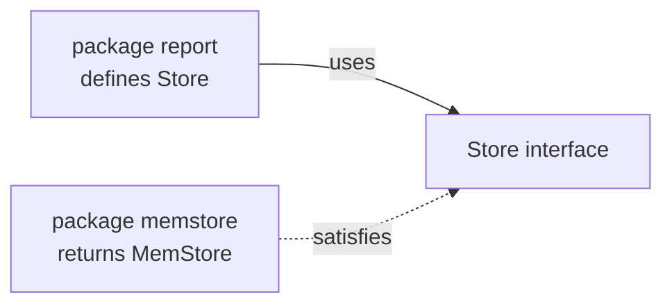

# Chapter 25 — Idioms and Style

> **What you'll learn.** How Go code *should* be written: one canonical format,
> Go's naming rules, the house style for errors, the "accept interfaces, return
> concrete types" rule, useful zero values, the comma-ok idiom, constructors, the
> functional options pattern, composition over inheritance, and the small habits
> that make Go code read the same everywhere.

In C, every team invents its own style: where braces go, tabs versus spaces, how
to name things, when to use `goto`. Code reviews argue about it for years. Go ends
those arguments on purpose. The language ships with one formatter, one set of
naming rules, and a small list of community conventions that almost everyone
follows. This chapter is that list. Learning it is how you stop writing "C in Go"
and start writing code a Go team will recognize as their own.

## The gofmt culture: one canonical format

Go comes with a tool, `gofmt`, that rewrites your source into the one official
format. Indentation is **tabs**. Braces go on the **same line**. Spacing,
alignment, and import order are all fixed. You do not choose; the tool decides.

```sh
gofmt -w .      # format every .go file in this tree, in place
go fmt ./...    # the same thing through the go command
```

> **C vs Go.** In C you pick a style (K&R, Allman, GNU) and argue about it. In Go
> there is exactly one style and `gofmt` enforces it. Nobody reviews formatting,
> because it cannot vary. This sounds small; on a team it is huge.

The payoff is that *all* Go code looks alike. When you open an unfamiliar file, the
shape is already familiar, so you spend your attention on the logic. Editors run
`gofmt` on save. Continuous-integration pipelines reject unformatted code. Treat
the format as fixed, like the rules of arithmetic. (More on the toolchain in
Chapter 22 — Tooling.)

## Naming

`gofmt` fixes layout, but it cannot choose your names. Go's naming rules are short
and strict, and they differ from common C habits.

### MixedCaps, never snake_case

Go uses **MixedCaps** (also called camelCase) for multi-word names, not
underscores. This is a strong convention, not a tool rule, but every Go codebase
follows it.

```go
// Go style
var maxRetries int
func parseConfig() {}

// not Go style (C habit)
var max_retries int
func parse_config() {}
```

### Capitalization is visibility, not decoration

Recall from Chapter 3 — Program Structure: Packages, Imports, and Visibility: an
**uppercase first letter exports** a name (other packages can see it); a lowercase
first letter keeps it **unexported** (package-private). So the case of the first
letter is *meaning*, not taste. Name a thing lowercase unless other packages truly
need it; a small exported surface is easier to maintain.

### Acronyms stay all one case

Keep initialisms like `URL`, `ID`, `HTTP`, `API`, and `SQL` in a single case —
all caps when exported, all lowercase when not. Do not write `Url` or `Http`.

```go
type URL struct{ /* ... */ }   // not Url
func parseURL(s string) {}      // not parseUrl
var userID int                  // not userId
func ServeHTTP() {}             // not ServeHttp
```

### Getters have no `Get` prefix

A method that returns a field is named after the field, with no `Get`. Use `Set`
for the setter, because a setter *does* something.

```go
type Person struct{ name string }

func (p *Person) Name() string     { return p.name } // not GetName
func (p *Person) SetName(n string) { p.name = n }     // Set is fine
```

### Avoid stutter

The package name is already part of every name you use from it, so do not repeat
it. Callers write `http.Server`, so the type is `Server`, not `HTTPServer`.

| You want | Stutters (avoid) | Idiomatic |
|---|---|---|
| an HTTP server | `http.HTTPServer` | `http.Server` |
| a byte buffer | `bytes.BytesBuffer` | `bytes.Buffer` |
| make an error | `errors.NewError` | `errors.New` |

### Short receiver names

A method's receiver (the value before the method name) gets a **short** name,
usually one or two letters from the type — not `self` or `this`. Use the *same*
receiver name on every method of that type.

```go
// good: short and consistent
func (s *Server) Start() {}
func (s *Server) Stop()  {}

// not Go style
func (self *Server) Start() {} // no self
func (this *Server) Stop()  {} // no this
```

### Interfaces often end in `-er`

A one-method interface is usually named for the method plus `-er`: `Reader`
(`Read`), `Writer` (`Write`), `Stringer` (`String`), `Closer` (`Close`). This reads
well and signals "this is a small behavior." (Interfaces are Chapter 11 —
Interfaces.)

## Error-handling style

Errors in Go are ordinary values you check with `if err != nil` (Chapter 12 —
Errors). A few style rules keep error handling clean.

**Handle an error once.** Either handle it here, or return it to the caller — not
both. The most common mistake is to **log it and also return it**: now every layer
logs the same failure and the log fills with duplicates.

```go
// bad: logs AND returns — the caller will log it again
if err != nil {
	log.Printf("save failed: %v", err)
	return err
}

// good: add context and return; let the top of the stack decide what to do
if err != nil {
	return fmt.Errorf("saving user %d: %w", id, err)
}
```

**Add context with `%w`.** `fmt.Errorf` with the `%w` verb *wraps* the original
error, so callers can still inspect it with `errors.Is` and `errors.As` while
getting a readable chain like `saving user 7: writing row: disk full`.

**Error strings are lowercase and have no trailing punctuation.** Because your
error is often wrapped inside another sentence, a leading capital or a trailing
period reads wrong in the middle of a chain.

```go
errors.New("file not found")   // good
errors.New("File not found.")  // bad: capital + period
```

**Use sentinel and typed errors for errors callers must detect.** A *sentinel* is
a predefined error value compared with `errors.Is`. A *typed* error is a custom
type inspected with `errors.As` to read extra fields.

```go
var ErrNotFound = errors.New("not found") // sentinel

type ValidationError struct{ Field string } // typed
func (e *ValidationError) Error() string { return "invalid field: " + e.Field }
```

## Accept interfaces, return concrete types

This is one of Go's most quoted rules, and it shapes good API design.

- **Accept interfaces** as function parameters. Then any type with the right
  methods can be passed in, including a fake for tests. The classic example is the
  standard library: functions take `io.Reader` or `io.Writer`, not a concrete file.
- **Return concrete types** (usually a struct or `*struct`). The caller gets the
  full, documented type with all its methods, not a narrow interface that hides
  them.

A second rule goes with it: **define the interface in the package that *uses* it,
not the package that implements it.** The consumer knows exactly which methods it
needs, so it declares a small interface for just those. The producer simply returns
its concrete type and never imports the consumer.

```go
// package report (the CONSUMER) defines the small interface it needs.
type Store interface {
	Get(id string) ([]byte, error) // just the one method report uses
}

func Build(s Store, id string) ([]byte, error) {
	return s.Get(id) // report does not care which concrete Store this is
}
```

```go
// package memstore (the PRODUCER) returns a CONCRETE type.
func New() *MemStore { return &MemStore{data: map[string][]byte{}} }
```

> **Rule of thumb.** Keep interfaces small: one to three methods. The biggest, most
> reused interfaces in Go (`io.Reader`, `io.Writer`) have a single method. A large
> interface is hard to implement and hard to fake in tests.



The arrow of *dependency* points from the consumer to a tiny interface it owns; the
producer just happens to satisfy it. No import points back, so packages stay
loosely coupled.

## Design so the zero value is useful

Every Go variable starts at its **zero value** (`0`, `""`, `false`, `nil`) with no
initializer (Chapter 4 — Types, Variables, and Constants). Good Go types are
designed so that this zero value is already usable, with no constructor call.

```go
package main

import (
	"bytes"
	"fmt"
	"sync"
)

func main() {
	var mu sync.Mutex // zero value is an unlocked, ready mutex
	mu.Lock()
	mu.Unlock()

	var buf bytes.Buffer // zero value is an empty, ready buffer
	buf.WriteString("hello")
	fmt.Println(buf.String())

	var nums []int // nil slice: len 0, but append and range work fine
	nums = append(nums, 1, 2, 3)
	fmt.Println(len(nums), nums)
}
```

> **C vs Go.** In C a freshly declared `struct` holds garbage and you must memset
> or initialize it. In Go the zero value is defined and, for well-designed types,
> immediately useful. A `sync.Mutex`, a `bytes.Buffer`, and a `nil` slice all work
> out of the box. (One exception: a `nil` map can be *read* but not *written* — see
> Chapter 26 — Gotchas for C Programmers (the checklist).)

## The comma-ok idiom

Several Go operations return a second boolean (`ok`) that says "did this succeed?"
This is the **comma-ok** idiom, and you will use it constantly.

```go
v, ok := m["key"]   // ok is false if the key is absent (map; Chapter 9 — Maps)
s, ok := x.(string) // ok is false if x does not hold a string (type assertion)
v, ok := <-ch       // false if the channel is closed (Chapter 14 — Channels and select)
```

Use the two-value form whenever a missing or wrong value is a normal case, not an
error. The single-value form (`v := m["key"]`) is fine when the zero value is an
acceptable answer.

## Constructors: the `NewX` convention

Go has no special constructor syntax. By convention, a function named `New` or
`NewType` builds and returns a value, doing any setup the zero value cannot.

```go
type Client struct {
	baseURL string
	timeout time.Duration
}

func NewClient(baseURL string) *Client {
	return &Client{baseURL: baseURL, timeout: 30 * time.Second}
}
```

If a package builds **one** main type, name the function just `New`; callers read
`pkg.New()` (for example `list.New()`). If a package builds several types, name
each after its type: `NewClient`, `NewServer`. Return a concrete type, as above.

## The functional options pattern

Often a constructor needs many optional settings with sensible defaults. C reaches
for a big config struct or a long argument list. Go's idiomatic answer is
**functional options**: variadic functions that each set one field. This keeps the
common call short, makes every option self-documenting, and lets you add new
options later without breaking callers.

```go
package main

import (
	"fmt"
	"time"
)

// Server is configured through functional options.
type Server struct {
	addr    string
	port    int
	timeout time.Duration
	maxConn int
}

// Option sets one field of a Server. It is just a function.
type Option func(*Server)

// WithPort returns an Option that sets the port.
func WithPort(p int) Option {
	return func(s *Server) { s.port = p }
}

// WithTimeout returns an Option that sets the timeout.
func WithTimeout(d time.Duration) Option {
	return func(s *Server) { s.timeout = d }
}

// WithMaxConn returns an Option that sets the connection limit.
func WithMaxConn(n int) Option {
	return func(s *Server) { s.maxConn = n }
}

// NewServer applies sensible defaults, then each option in order.
func NewServer(addr string, opts ...Option) *Server {
	s := &Server{
		addr:    addr,
		port:    8080,             // default
		timeout: 30 * time.Second, // default
		maxConn: 100,              // default
	}
	for _, opt := range opts {
		opt(s)
	}
	return s
}

func main() {
	// The caller sets only what differs from the defaults.
	s := NewServer("localhost", WithPort(9000), WithTimeout(5*time.Second))
	fmt.Printf("%+v\n", *s)
}
```

> **Rule of thumb.** Reach for functional options when a constructor has several
> optional settings, especially in a library others will call. For two or three
> required fields, a plain `NewX(a, b)` is simpler — do not over-engineer.

## Composition over inheritance

Go has **no classes and no inheritance**. Instead you build a bigger type by
**embedding** a smaller one: write a type (or interface) inside a struct with no
field name, and its fields and methods are *promoted* to the outer type (Chapter
10 — Structs and Methods).

```go
package main

import "fmt"

type Engine struct{ Power int }

func (e Engine) Start() string { return fmt.Sprintf("start %d hp", e.Power) }

// Car embeds Engine. Car gets Engine's fields and methods, no rewriting.
type Car struct {
	Engine // embedded: no field name
	Brand  string
}

func main() {
	c := Car{Engine: Engine{Power: 200}, Brand: "Mazda"}
	fmt.Println(c.Brand, c.Power) // c.Power is promoted from Engine
	fmt.Println(c.Start())        // c.Start() is promoted too
}
```

> **C vs Go.** This is closer to putting one struct inside another in C and reaching
> through it, but Go *promotes* the inner names so you skip the extra `.Engine`
> step. It is composition (a Car *has* an Engine), not inheritance (a Car *is* an
> Engine). There is no virtual override; promoted methods are just forwarded.

## Avoid premature abstraction

C programmers often reach for a layer of indirection early. Go culture pushes the
other way: write the simple, concrete thing first, and add an interface or generic
only when a second real use appears.

> **Rule of thumb.** "A little copying is better than a little dependency." If you
> need a five-line helper that lives in another package, copying it can be wiser
> than importing a whole dependency for it. Fewer dependencies means faster builds
> and less to break.

Do not add an interface "in case" you swap implementations later. An interface with
one implementation is just extra indirection. Add it when the second implementation
(or the test fake) actually arrives.

## Libraries return errors; they do not panic

A `panic` unwinds the stack and, if not recovered, crashes the program (Chapter 12
— Errors). In **library** code, do not panic for ordinary failures — return an
`error` so the caller decides what to do. Reserve `panic` for truly unrecoverable
states or clear programmer bugs (for example, an impossible `switch` case).

```go
// bad in a library: caller cannot recover gracefully
func MustLoad(path string) []byte {
	b, err := os.ReadFile(path)
	if err != nil {
		panic(err)
	}
	return b
}

// good: return the error
func Load(path string) ([]byte, error) {
	return os.ReadFile(path)
}
```

The `MustX` naming (like `regexp.MustCompile`) is the one accepted exception: it
panics on error and is meant only for package-level variables and tests, where a
failure should stop the program at startup.

## Keep concurrency simple and document ownership

Goroutines and channels are powerful but easy to misuse (Chapters 13–16). A few
style habits prevent most trouble.

- Start a goroutine only when you can say **who stops it** and **who closes the
  channel**. Only the sender closes a channel; document that.
- Document **ownership** of shared data: which goroutine may touch which variable,
  and which mutex guards it. Unclear ownership is the root of most data races.
- Prefer the simplest tool that works: a `sync.Mutex` around shared state is often
  clearer than an elaborate channel dance.
- Always test concurrent code with the race detector: `go test -race ./...`
  (Chapter 16 — Concurrency Patterns).

## Pass `context.Context` first; never store it

A `context.Context` carries cancellation, deadlines, and request-scoped values
(Chapter 15 — Synchronization and context). The convention is firm: it is the **first
parameter** of a function, named `ctx`, and you **do not store it in a struct**.

```go
// good: ctx is the first parameter
func (c *Client) Fetch(ctx context.Context, url string) ([]byte, error) {
	// ... pass ctx down to the next call
	return nil, nil
}

// bad: storing a context in a struct hides its lifetime and leaks it
type Bad struct {
	ctx context.Context // anti-pattern; pass ctx per call instead
}
```

A context belongs to one operation. Storing it in a long-lived struct keeps a
finished request's deadline and values alive, which causes subtle bugs. Pass it
through the call chain instead.

## Where the rules are written down

You do not have to memorize all of this. Three sources are the canonical references,
and Go programmers cite them in code review:

- **Effective Go** — the original guide to idiomatic Go.
- **Go Code Review Comments** — the community checklist of common review feedback
  (naming, error strings, receivers, and more).
- **Google Go Style Guide** — a thorough, modern style guide used at scale.

Links to all three are in the References section at the end of the book. When in
doubt, run `gofmt` and `go vet`, then check these guides.

## Key takeaways

- `gofmt` defines one canonical format. Do not argue about layout; let the tool
  decide and move on.
- Names use MixedCaps, acronyms stay one case (`URL`, `ID`, `HTTP`), getters drop
  `Get`, types avoid stutter (`http.Server`), and receivers are short (`s`, `c`).
- Handle each error once: add context with `%w` and return it, or handle it — not
  both. Error strings are lowercase with no trailing punctuation.
- Accept small interfaces (1–3 methods), defined in the consumer package; return
  concrete types from constructors.
- Design types so the zero value works (`sync.Mutex`, `bytes.Buffer`, nil slice).
- Use comma-ok for maps, type assertions, and channel receives; use `NewX`
  constructors; use functional options for configurable constructors.
- Prefer composition (embedding) over inheritance; avoid premature abstraction.
- Libraries return errors instead of panicking; concurrency stays simple with clear
  ownership; `context.Context` is the first parameter and is never stored.

## Watch out (gotchas for C programmers)

- **Stutter names.** Do not write `http.HTTPServer` or `errors.NewError`; the
  package name already qualifies the type.
- **`Get` prefix on getters.** Use `Name()`, not `GetName()`. Keep `Set` for
  setters.
- **Overusing interfaces and `any`.** An interface with one implementation, or
  passing `any` everywhere, throws away Go's type safety. Add abstraction when a
  second use appears, not before.
- **Ignoring errors.** Do not write `v, _ := f()` to silence a real error, and do
  not both log and return the same error.
- **Panicking in a library.** Return an `error`; reserve `panic` for unrecoverable
  bugs and `MustX` startup helpers.
- **Over-engineering.** A little copying beats a little dependency. Simple, concrete
  code is the Go default.

## Interview questions

**Q: What does "accept interfaces, return concrete types" mean, and why is it good
practice?**
A: Functions should take interface parameters so callers can pass any type with the
right methods (including test fakes), but constructors should return the concrete
struct so callers get the full, documented type. It keeps callers flexible and
implementations honest. The matching rule is to define the interface in the package
that *uses* it, kept small, so dependencies point one way and packages stay loosely
coupled.

**Q: Why do getters in Go not start with `Get`, and what about setters?**
A: Go convention names a getter after the value it returns, so a field `name` is
read by a method `Name()`. The `Get` prefix adds noise and reads worse at the call
site (`p.Name()` versus `p.GetName()`). Setters keep a `Set` prefix (`SetName`)
because a setter performs an action rather than just naming a value.

**Q: Describe the functional options pattern and when to use it.**
A: You define a type `Option func(*T)` and provide `WithX` functions that each
return an Option setting one field. The constructor takes `opts ...Option`, applies
defaults, then runs each option. It gives short calls, self-documenting settings,
and lets a library add options later without breaking callers. Use it when a
constructor has several optional settings; for a couple of required fields, a plain
`NewX(a, b)` is simpler.

**Q: How should errors be wrapped and worded in idiomatic Go?**
A: Add context with `fmt.Errorf("doing X: %w", err)`, which wraps the original so
callers can still use `errors.Is` and `errors.As`. Handle an error once — either
return it (with context) or handle it, never both, and never log-and-return.
Error strings are lowercase and have no trailing punctuation, because they are often
embedded in a larger message.

**Q: Why does "make the zero value useful" matter, and give examples?**
A: Because every Go variable starts at its zero value, a type whose zero value is
already usable needs no constructor and is harder to misuse. `sync.Mutex` is an
unlocked, ready mutex; `bytes.Buffer` is an empty, ready buffer; a `nil` slice
supports `len`, `range`, and `append`. Designing for a useful zero value makes APIs
simpler and safer.

## Try it

1. Take a struct you would normally configure with many constructor arguments and
   rewrite it using the functional options pattern. Add a `WithTimeout` option and
   confirm old call sites that do not pass it still compile and use the default.
2. Run `go vet ./...` on a small package, then read three entries from the Go Code
   Review Comments guide (see References) and fix any names that stutter or use a
   `Get` prefix.
