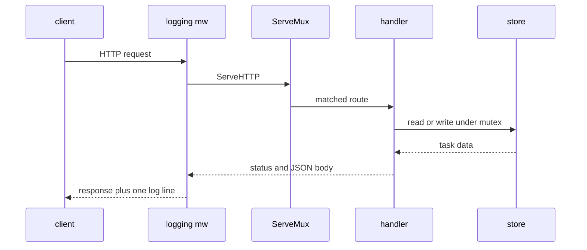
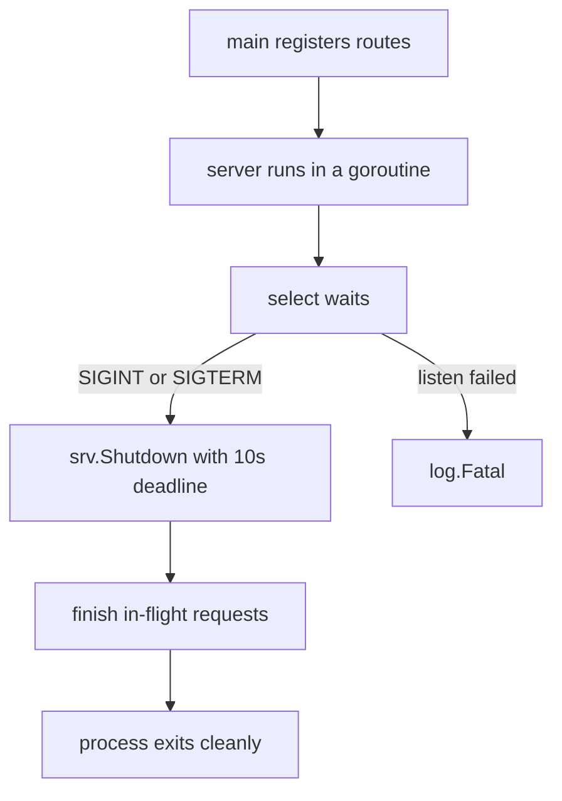
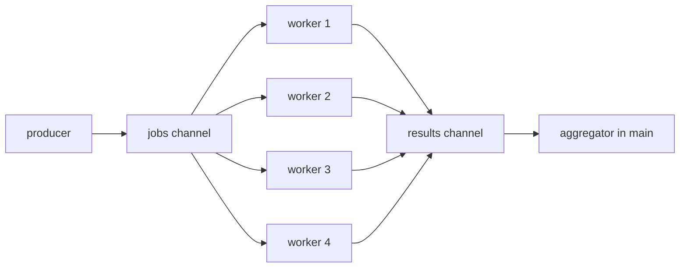

# Chapter 28 — Capstone Projects

> **What you'll learn.** How to tie the whole book together by building three
> complete, runnable programs: a `wc`-style command-line tool, a JSON REST API,
> and a bounded concurrent fetcher. Each project lists the chapters it draws on,
> so you can also use this chapter as a guided review.

You have met every part of Go on its own. Now we assemble those parts into real
programs. Each project below is small enough to read in one sitting but complete
enough to run, modify, and ship. We build them the way you would at work: start
with a clear goal, write idiomatic code, explain every section, run it, and then
list ways to extend it.

All three programs live in this book's `examples/` module so you can run them
directly. The module path is `goforc/examples` and it targets Go 1.26.

```sh
cd examples        # from the root of this book
go vet ./...       # static checks: should print nothing
go build ./...     # compiles all three programs
```

```
examples/
├── go.mod                 module goforc/examples
├── linecount/main.go      Project 1 — the CLI tool
├── taskapi/main.go        Project 2 — the JSON REST API
└── workerpool/main.go     Project 3 — the concurrent fetcher
```

Each program is a separate `package main` in its own directory, so each builds
into its own binary (see Chapter 3 — Program Structure: Packages, Imports, and
Visibility). The standard library is the only dependency; there is nothing to
download.

---

## Project 1 — a wc-style line counter

**Goal.** Build `linecount`, a small clone of the Unix `wc` tool. It counts
lines, words, and bytes. It reads the files named on the command line, or
standard input when you name no files. Flags `-l`, `-w`, and `-c` choose which
counts to print. Bad files go to standard error and set a non-zero exit code,
exactly as a good Unix tool should.

This is the kind of program a C programmer writes first in any language. In C you
would loop with `getchar`, track state by hand, and print with `printf`. The Go
version is similar in spirit but safer: no buffer to size, no manual `fopen`
error codes, and the file is always closed for you.

Here is the data flow. Input comes from standard input or from files; the counter
turns each input into a small `counts` value; the formatter prints the selected
fields to standard output; any open error goes to standard error.

```
             ┌───────────┐
 stdin  ───▶ │  count()   │ ──▶ counts{lines, words, bytes}
 files  ───▶ │  (bufio)   │            │
             └───────────┘            ▼
                  │ open err     format + selection
                  ▼                    │
               stderr                  ▼
              exit code 1            stdout
```

### Types and imports

We start with the package comment, the imports, and the small value types. A
`counts` holds the three totals. A `selection` records which of them the user
asked to see. Keeping these as plain structs makes the rest of the code read
like prose.

```go
// Command linecount is a small wc-like tool. It counts lines, words, and
// bytes from files named on the command line, or from standard input when no
// files are given.
//
// Usage:
//
//	linecount [-l] [-w] [-c] [file ...]
//
// With no flags it prints lines, words, and bytes, like wc. With one or more of
// -l, -w, -c it prints only the requested counts, in that fixed order.
package main

import (
	"bufio"
	"errors"
	"flag"
	"fmt"
	"io"
	"os"
	"strings"
)

// counts holds the three totals for one input.
type counts struct {
	lines int64
	words int64
	bytes int64
}

// add accumulates another set of counts into c. It is used to build the grand
// total across several files.
func (c *counts) add(o counts) {
	c.lines += o.lines
	c.words += o.words
	c.bytes += o.bytes
}

// selection records which counts the user asked to see.
type selection struct {
	lines, words, bytes bool
}
```

`add` has a **pointer receiver** (`c *counts`) because it changes the value it is
called on (see Chapter 10 — Structs and Methods). We use `int64` for the totals
so a very large file cannot overflow the count the way a 32-bit `int` might in C.

### The core: counting bytes, words, and lines

The heart of the tool reads one byte at a time and updates the three counts. A
`bufio.Reader` wraps the input so the byte-at-a-time loop is still fast: it reads
in large blocks under the hood and hands you bytes from its buffer.

```go
// isSpace reports whether b is an ASCII whitespace byte. This is the same set
// C's isspace recognizes in the default "C" locale: space, tab, newline,
// vertical tab, form feed, and carriage return.
func isSpace(b byte) bool {
	switch b {
	case ' ', '\t', '\n', '\v', '\f', '\r':
		return true
	default:
		return false
	}
}

// count reads everything from r and returns the line, word, and byte totals.
// A line is counted at each newline byte, and a word is a run of non-space
// bytes, exactly like wc. bufio.Reader buffers the underlying reads, so the
// byte-at-a-time loop is still fast.
func count(r io.Reader) (counts, error) {
	br := bufio.NewReader(r)
	var c counts
	inWord := false
	for {
		b, err := br.ReadByte()
		if err != nil {
			// io.EOF is the normal, expected end of input, not a failure.
			if errors.Is(err, io.EOF) {
				return c, nil
			}
			return c, err
		}
		c.bytes++
		if b == '\n' {
			c.lines++
		}
		if isSpace(b) {
			inWord = false
		} else if !inWord {
			inWord = true
			c.words++
		}
	}
}
```

Two ideas here are pure Go and worth pausing on:

- **`count` accepts an `io.Reader`, not a file.** `io.Reader` is the one-method
  interface "something I can read bytes from" (see Chapter 11 — Interfaces). A
  file satisfies it, and so does standard input, and so does a string or a
  network socket. We write the logic once and feed it any source. In C you would
  pass a `FILE *` or a file descriptor; the Go interface is broader and checked
  at compile time.
- **End of input is an error value, not a magic return.** `ReadByte` returns
  `io.EOF` when there is nothing left. We test it with `errors.Is` (see Chapter
  12 — Errors), treat it as success, and return the totals. C's `getchar` returns
  the special value `EOF` (an `int`, not a `char`); Go makes the end-of-file
  signal an explicit `error` you check by name.

> **C vs Go.** In C, "is this a word boundary?" usually means calling `isspace`
> from `<ctype.h>`. Our `isSpace` lists the same six ASCII characters on purpose,
> so `linecount` splits words the same way `wc` does in the default locale. We do
> not call `unicode.IsSpace` on a single byte, because a byte is not a rune: a
> multibyte UTF-8 character would be misread.

### Opening files and formatting output

`countFile` opens a file, counts it, and guarantees it is closed with `defer`
(see Chapter 6 — Functions). `format` turns a `counts` plus a `selection` into
one aligned output line using a `strings.Builder`, which assembles a string
without repeated allocations (see Chapter 8 — Arrays, Slices, and Strings).

```go
// countFile opens name, counts it, and always closes the file.
func countFile(name string) (counts, error) {
	f, err := os.Open(name)
	if err != nil {
		// os.Open returns a *fs.PathError that already includes the file name
		// and the reason ("open foo: no such file or directory"), so we return
		// it unchanged.
		return counts{}, err
	}
	defer f.Close()
	return count(f)
}

// format renders the selected counts followed by an optional name. Counts are
// right-aligned in a fixed width so columns line up, similar to wc.
func format(c counts, sel selection, name string) string {
	var sb strings.Builder
	writeField := func(n int64) {
		if sb.Len() > 0 {
			sb.WriteByte(' ')
		}
		fmt.Fprintf(&sb, "%7d", n)
	}
	if sel.lines {
		writeField(c.lines)
	}
	if sel.words {
		writeField(c.words)
	}
	if sel.bytes {
		writeField(c.bytes)
	}
	if name != "" {
		sb.WriteByte(' ')
		sb.WriteString(name)
	}
	return sb.String()
}
```

`writeField` is a **closure**: a small function that captures and writes to the
surrounding `sb` (see Chapter 6 — Functions). It adds a leading space before
every field except the first, so the columns line up no matter which flags were
chosen.

### Wiring it together in `main`

`main` parses the flags, decides which counts to show, and then runs one of two
paths: read standard input when there are no file arguments, or loop over the
named files and also print a grand total when there is more than one.

```go
func main() {
	lineFlag := flag.Bool("l", false, "print the line count")
	wordFlag := flag.Bool("w", false, "print the word count")
	byteFlag := flag.Bool("c", false, "print the byte count")
	flag.Parse()

	// If the user named no counters, show all three (the wc default).
	if !*lineFlag && !*wordFlag && !*byteFlag {
		*lineFlag, *wordFlag, *byteFlag = true, true, true
	}
	sel := selection{lines: *lineFlag, words: *wordFlag, bytes: *byteFlag}

	files := flag.Args()

	// No file arguments: read standard input and print only the counts.
	if len(files) == 0 {
		c, err := count(os.Stdin)
		if err != nil {
			fmt.Fprintf(os.Stderr, "linecount: stdin: %v\n", err)
			os.Exit(1)
		}
		fmt.Println(format(c, sel, ""))
		return
	}

	// One or more files: count each, print its line, and keep a running total.
	// A bad file is reported on stderr; we continue and exit non-zero at the end.
	exit := 0
	var total counts
	for _, name := range files {
		c, err := countFile(name)
		if err != nil {
			fmt.Fprintf(os.Stderr, "linecount: %v\n", err)
			exit = 1
			continue
		}
		total.add(c)
		fmt.Println(format(c, sel, name))
	}
	if len(files) > 1 {
		fmt.Println(format(total, sel, "total"))
	}
	os.Exit(exit)
}
```

Notice three Unix habits that Go makes easy (see Chapter 24 — CLI Tools):

- **Normal output to stdout, errors to stderr.** `fmt.Println` writes to standard
  output; `fmt.Fprintf(os.Stderr, ...)` writes to standard error. This lets a
  caller redirect them separately, just like in C.
- **A meaningful exit code.** A missing file sets `exit = 1`, but we keep going
  and still count the good files, then call `os.Exit(1)` at the end. Recall from
  Chapter 1 — Why Go for a C Programmer that `main` does not return an `int`; you
  set the status with `os.Exit`.
- **One reader, many sources.** Because `count` takes an `io.Reader`, the stdin
  path and the file path call the very same function.

### Run it

```sh
cd examples

echo 'hello world' | go run ./linecount      # read standard input
go run ./linecount go.mod                     # one file
go run ./linecount -l -w go.mod               # only lines and words
go run ./linecount go.mod linecount/main.go   # several files plus a total
go run ./linecount nope.txt                   # a missing file
```

Sample output (the counts depend on the files):

```
      3       4      32 go.mod
      3       4      32 go.mod
    167     674    4063 linecount/main.go
    170     678    4095 total
```

The missing file prints to standard error and the process exits with status 1:

```
linecount: open nope.txt: no such file or directory
```

### Concepts it exercises

- Chapter 1 — Why Go for a C Programmer: program shape, `os.Exit` for status.
- Chapter 3 — Program Structure: Packages, Imports, and Visibility: `package main`.
- Chapter 6 — Functions: closures, `defer` for closing files.
- Chapter 8 — Arrays, Slices, and Strings: `strings.Builder`, bytes vs runes.
- Chapter 10 — Structs and Methods: the `counts` type and its pointer receiver.
- Chapter 11 — Interfaces: writing to an `io.Reader` works for files and stdin.
- Chapter 12 — Errors: `errors.Is` with the `io.EOF` sentinel.
- Chapter 20 — The Standard Library Tour: `flag`, `bufio`, `io`, `os`, `fmt`.
- Chapter 24 — CLI Tools: flags, stdin/stdout/stderr, exit codes.

### Extend it

- Add a `-` argument that means "read standard input", as real `wc` does.
- Add a `-m` flag for **rune** (character) count, decoding UTF-8 with
  `bufio.Reader.ReadRune`. Show how it differs from the byte count on non-ASCII
  text.
- Print counts with a width based on the largest number so columns are tight.
- Add a `-L` flag that reports the length of the longest line.
- Write table-driven tests for `count` using `strings.NewReader` (see Chapter 21
  — Testing).

---

## Project 2 — a JSON REST API for tasks

**Goal.** Build `taskapi`, an HTTP service that stores a list of "tasks" in
memory. It speaks JSON and supports four operations: list all tasks, create one,
fetch one by id, and delete one. It uses the modern `net/http` router (Go 1.22+)
that matches on method and path, a logging middleware, a mutex to protect the
shared store, sensible server timeouts, and graceful shutdown when the process
receives an interrupt signal.

This is the bread-and-butter Go program: a small, dependency-free network
service. A C programmer is often surprised that a production-shaped HTTP/JSON
server needs no framework and no third-party libraries — the standard library is
enough (see Chapter 23 — Web Services).

The REST routes:

| Method | Path | Meaning | Success status |
|---|---|---|---|
| GET | `/tasks` | list all tasks | 200 OK |
| POST | `/tasks` | create a task from a JSON body | 201 Created |
| GET | `/tasks/{id}` | fetch one task | 200 OK |
| DELETE | `/tasks/{id}` | delete one task | 204 No Content |

Every request flows through the logging middleware, then the router, then a
handler, which reads or writes the shared store:



### Types and imports

The `Task` is the data we serialize. Only **exported** (capitalized) fields are
visible to `encoding/json`, so each field starts with an uppercase letter, and a
struct tag sets the lowercase JSON name (see Chapter 3 — Program Structure:
Packages, Imports, and Visibility, and Chapter 10 — Structs and Methods).

```go
// Command taskapi is a small in-memory REST service for "tasks". It shows the
// Go 1.22 net/http router (method and path patterns like "GET /tasks/{id}"),
// JSON encoding and decoding, a logging middleware, a mutex-protected store
// (handlers run concurrently, one goroutine per request), server timeouts, and
// graceful shutdown driven by an OS signal.
//
// Try it:
//
//	go run ./taskapi
//	curl -s localhost:8080/tasks
//	curl -s -XPOST localhost:8080/tasks -d '{"title":"buy milk"}'
//	curl -s localhost:8080/tasks/1
//	curl -s -XDELETE localhost:8080/tasks/1 -i
package main

import (
	"cmp"
	"context"
	"encoding/json"
	"errors"
	"fmt"
	"log"
	"net/http"
	"os"
	"os/signal"
	"slices"
	"strconv"
	"strings"
	"sync"
	"syscall"
	"time"
)

// Task is one to-do item. The struct tags control the JSON field names; only
// exported (capitalized) fields are encoded, so every field we want in the
// output must start with an uppercase letter.
type Task struct {
	ID    int64  `json:"id"`
	Title string `json:"title"`
	Done  bool   `json:"done"`
}
```

### The store: shared state behind a mutex

Here is the most important concurrency point in the whole project, and the one C
programmers must internalize about Go web servers:

> **Watch out.** `net/http` serves **each request in its own goroutine**. Two
> requests can run your handlers at the exact same time. Any state they share —
> here, the map of tasks — must be protected, or you have a data race. A race in
> Go is just as undefined as a race in C.

The `store` wraps a map and a counter with a `sync.Mutex` (see Chapter 15 — Sync
and Context). Each method locks, does its work, and unlocks with `defer`. The
mutex guarantees only one goroutine touches the map at a time.

```go
// store is an in-memory set of tasks guarded by a mutex. Every HTTP handler
// runs in its own goroutine, so two requests can hit the store at the same
// time. The mutex makes each operation safe: only one goroutine touches the
// map at once.
type store struct {
	mu     sync.Mutex
	nextID int64
	tasks  map[int64]Task
}

func newStore() *store {
	return &store{tasks: make(map[int64]Task), nextID: 1}
}

// list returns all tasks sorted by ID. Map iteration order is random in Go, so
// we sort to give callers a stable, predictable order.
func (s *store) list() []Task {
	s.mu.Lock()
	defer s.mu.Unlock()
	out := make([]Task, 0, len(s.tasks))
	for _, t := range s.tasks {
		out = append(out, t)
	}
	slices.SortFunc(out, func(a, b Task) int { return cmp.Compare(a.ID, b.ID) })
	return out
}

func (s *store) create(title string) Task {
	s.mu.Lock()
	defer s.mu.Unlock()
	t := Task{ID: s.nextID, Title: title}
	s.tasks[t.ID] = t
	s.nextID++
	return t
}

func (s *store) get(id int64) (Task, bool) {
	s.mu.Lock()
	defer s.mu.Unlock()
	t, ok := s.tasks[id]
	return t, ok
}

func (s *store) delete(id int64) bool {
	s.mu.Lock()
	defer s.mu.Unlock()
	if _, ok := s.tasks[id]; !ok {
		return false
	}
	delete(s.tasks, id)
	return true
}
```

Two Go details a C programmer should note:

- **Map iteration order is random** (see Chapter 9 — Maps). To return a stable
  list, we copy the values into a slice and sort with `slices.SortFunc` using
  `cmp.Compare`, the modern, overflow-safe way to compare two ordered values.
- **`get` returns `(Task, bool)`** — the "comma, ok" idiom. The boolean says
  whether the id existed, which is cleaner than returning a sentinel value or a
  null pointer as you might in C.

### Handlers and JSON helpers

We give the handlers access to the store by making them **methods on an `app`
struct**. This avoids global variables and is the idiomatic way to inject
dependencies (see Chapter 25 — Idioms and Style). Two small helpers, `writeJSON`
and `writeError`, keep every response consistent.

```go
// app bundles the dependencies the handlers need. Methods on *app become our
// HTTP handlers, which is a clean way to give them access to the store without
// global variables.
type app struct {
	store *store
}

// writeJSON sets the content type, writes the status line, and encodes v. Once
// WriteHeader has run the status is already sent, so an encode failure can only
// be logged, not turned into a different HTTP error.
func writeJSON(w http.ResponseWriter, status int, v any) {
	w.Header().Set("Content-Type", "application/json")
	w.WriteHeader(status)
	if err := json.NewEncoder(w).Encode(v); err != nil {
		log.Printf("write json: %v", err)
	}
}

// writeError sends a JSON object like {"error":"..."} with the given status.
func writeError(w http.ResponseWriter, status int, msg string) {
	writeJSON(w, status, map[string]string{"error": msg})
}

// parseID reads the {id} path segment and converts it to an int64.
func parseID(r *http.Request) (int64, error) {
	return strconv.ParseInt(r.PathValue("id"), 10, 64)
}

func (a *app) listTasks(w http.ResponseWriter, r *http.Request) {
	writeJSON(w, http.StatusOK, a.store.list())
}

func (a *app) createTask(w http.ResponseWriter, r *http.Request) {
	var in struct {
		Title string `json:"title"`
	}
	// MaxBytesReader caps the body so a huge request cannot exhaust memory.
	// DisallowUnknownFields rejects bodies with stray fields.
	dec := json.NewDecoder(http.MaxBytesReader(w, r.Body, 1<<20))
	dec.DisallowUnknownFields()
	if err := dec.Decode(&in); err != nil {
		writeError(w, http.StatusBadRequest, "invalid JSON body: "+err.Error())
		return
	}
	if strings.TrimSpace(in.Title) == "" {
		writeError(w, http.StatusBadRequest, "title is required")
		return
	}
	t := a.store.create(in.Title)
	w.Header().Set("Location", fmt.Sprintf("/tasks/%d", t.ID))
	writeJSON(w, http.StatusCreated, t)
}

func (a *app) getTask(w http.ResponseWriter, r *http.Request) {
	id, err := parseID(r)
	if err != nil {
		writeError(w, http.StatusBadRequest, "id must be an integer")
		return
	}
	t, ok := a.store.get(id)
	if !ok {
		writeError(w, http.StatusNotFound, "no task with that id")
		return
	}
	writeJSON(w, http.StatusOK, t)
}

func (a *app) deleteTask(w http.ResponseWriter, r *http.Request) {
	id, err := parseID(r)
	if err != nil {
		writeError(w, http.StatusBadRequest, "id must be an integer")
		return
	}
	if !a.store.delete(id) {
		writeError(w, http.StatusNotFound, "no task with that id")
		return
	}
	w.WriteHeader(http.StatusNoContent)
}
```

A few things worth highlighting:

- **`r.PathValue("id")`** reads the `{id}` wildcard from the route pattern. This
  is the Go 1.22 router feature: the path variable is parsed for you, so you do
  not split the URL by hand.
- **`json.NewDecoder(...).Decode(&in)`** streams and parses the request body into
  a struct. `http.MaxBytesReader` caps the body size so a malicious client cannot
  make you allocate gigabytes, and `DisallowUnknownFields` rejects bodies that
  carry fields you did not expect.
- **Validation returns a clear 400.** An empty title or a non-numeric id produces
  a JSON error and the right status code, never a panic.

### Middleware: logging every request

**Middleware** is a function that wraps a handler and returns a new handler. It
runs before and after the inner handler. Ours logs one line per request: the
method, the path, the status code, and how long the handler took.

To see the status code, we wrap `http.ResponseWriter` in a tiny type that
records whatever `WriteHeader` is called with. This is **embedding** (see Chapter
10 — Structs and Methods): `statusWriter` gets all the `ResponseWriter` methods
for free and overrides just `WriteHeader`.

```go
// statusWriter wraps http.ResponseWriter so the logging middleware can see the
// status code that a handler chose. ResponseWriter has no getter for it, so we
// record it as it passes through WriteHeader.
type statusWriter struct {
	http.ResponseWriter
	status int
}

func (w *statusWriter) WriteHeader(code int) {
	w.status = code
	w.ResponseWriter.WriteHeader(code)
}

// logging is middleware: it takes a handler and returns a new handler that logs
// one line per request after the inner handler runs.
func logging(h http.Handler) http.Handler {
	return http.HandlerFunc(func(w http.ResponseWriter, r *http.Request) {
		start := time.Now()
		sw := &statusWriter{ResponseWriter: w, status: http.StatusOK}
		h.ServeHTTP(sw, r)
		log.Printf("%s %s -> %d (%s)", r.Method, r.URL.Path, sw.status, time.Since(start))
	})
}
```

> **Mental model.** Middleware is like a Russian nesting doll of handlers. The
> outermost wrapper runs first on the way in and last on the way out. You can
> stack several (logging, authentication, compression) by wrapping again and
> again. Each layer satisfies the same `http.Handler` interface, so they compose
> freely (see Chapter 11 — Interfaces).

### `main`: routes, timeouts, and graceful shutdown

`main` registers the routes on a `ServeMux`, wraps it in the logging middleware,
configures an `http.Server` with timeouts, and then runs the server while
waiting for a shutdown signal.

```go
func main() {
	app := &app{store: newStore()}

	// The patterns include the HTTP method and a named wildcard {id}. The
	// router (Go 1.22+) matches on both, so we do not parse the method by hand.
	mux := http.NewServeMux()
	mux.HandleFunc("GET /tasks", app.listTasks)
	mux.HandleFunc("POST /tasks", app.createTask)
	mux.HandleFunc("GET /tasks/{id}", app.getTask)
	mux.HandleFunc("DELETE /tasks/{id}", app.deleteTask)

	srv := &http.Server{
		Addr:    ":8080",
		Handler: logging(mux),
		// Timeouts protect the server from slow or stuck clients. Without them
		// a single client could hold a connection open forever.
		ReadHeaderTimeout: 5 * time.Second,
		ReadTimeout:       10 * time.Second,
		WriteTimeout:      10 * time.Second,
		IdleTimeout:       60 * time.Second,
	}

	// NotifyContext returns a context that is canceled when the process gets
	// SIGINT (Ctrl-C) or SIGTERM. That cancellation is our shutdown trigger.
	ctx, stop := signal.NotifyContext(context.Background(), os.Interrupt, syscall.SIGTERM)
	defer stop()

	// Run the server in its own goroutine so main can wait for the signal. The
	// channel is buffered so this goroutine never blocks even if nobody reads.
	errCh := make(chan error, 1)
	go func() {
		log.Printf("listening on %s", srv.Addr)
		errCh <- srv.ListenAndServe()
	}()

	select {
	case err := <-errCh:
		// ListenAndServe failed to even start (for example, port in use).
		if err != nil && !errors.Is(err, http.ErrServerClosed) {
			log.Fatalf("server error: %v", err)
		}
	case <-ctx.Done():
		log.Println("shutdown signal received")
	}

	// Give in-flight requests up to 10 seconds to finish, then stop. Shutdown
	// makes ListenAndServe above return http.ErrServerClosed, the clean case.
	shutdownCtx, cancel := context.WithTimeout(context.Background(), 10*time.Second)
	defer cancel()
	if err := srv.Shutdown(shutdownCtx); err != nil {
		log.Printf("graceful shutdown failed: %v", err)
		return
	}
	log.Println("server stopped cleanly")
}
```

This is the standard, production-shaped server loop. Trace the control flow:



The pieces that make it correct:

- **Timeouts.** `ReadHeaderTimeout`, `ReadTimeout`, `WriteTimeout`, and
  `IdleTimeout` stop a slow client from holding a connection open forever. The
  default `http.Server` has none of these; always set them.
- **`signal.NotifyContext`.** This turns an OS signal into a canceled
  `context.Context` (see Chapter 15 — Sync and Context). When you press Ctrl-C,
  `ctx.Done()` fires and the `select` wakes up. C handles signals with
  `signal(2)` and a handler function; Go funnels them into the same context and
  channel machinery you already use elsewhere.
- **`srv.Shutdown`.** It stops accepting new connections and waits for in-flight
  requests to finish, up to the deadline. This is *graceful*: no request is cut
  off mid-response.
- **The buffered error channel.** `errCh` has capacity 1 so the server goroutine
  can always send its final error and exit, even after we have moved on to
  shutdown. This prevents a goroutine leak.

> **C vs Go.** In C you would install a `SIGTERM` handler, set a global `volatile
> sig_atomic_t` flag, and poll it in your accept loop. Go gives you the same
> result with a context that integrates with `select`, channels, and every
> standard-library call that takes a `context.Context`. The shutdown signal flows
> through the same plumbing as request cancellation and timeouts.

### Run it

Start the server in one terminal:

```sh
cd examples
go run ./taskapi
# 2026/06/13 01:25:50 listening on :8080
```

Drive it from another terminal with `curl`:

```sh
curl -s localhost:8080/tasks
# []

curl -s -i -XPOST localhost:8080/tasks -d '{"title":"buy milk"}'
# HTTP/1.1 201 Created
# Location: /tasks/1
# {"id":1,"title":"buy milk","done":false}

curl -s localhost:8080/tasks/1
# {"id":1,"title":"buy milk","done":false}

curl -s localhost:8080/tasks/999
# {"error":"no task with that id"}      (HTTP 404)

curl -s -XDELETE localhost:8080/tasks/1 -i
# HTTP/1.1 204 No Content

curl -s -XPOST localhost:8080/tasks -d '{"oops":true}'
# {"error":"invalid JSON body: json: unknown field \"oops\""}   (HTTP 400)
```

The server prints one log line per request, then shuts down cleanly on Ctrl-C:

```
2026/06/13 01:26:41 POST /tasks -> 201 (34.083µs)
2026/06/13 01:26:41 GET /tasks/999 -> 404 (6.625µs)
2026/06/13 01:26:41 DELETE /tasks/1 -> 204 (1.167µs)
^C
2026/06/13 01:27:55 shutdown signal received
2026/06/13 01:27:55 server stopped cleanly
```

### Concepts it exercises

- Chapter 3 — Program Structure: Packages, Imports, and Visibility: exported
  fields and JSON.
- Chapter 9 — Maps: the in-memory store and random iteration order.
- Chapter 10 — Structs and Methods: methods on `*app` and `*store`, embedding.
- Chapter 11 — Interfaces: `http.Handler`, `http.ResponseWriter`, middleware.
- Chapter 12 — Errors: `errors.Is` with `http.ErrServerClosed`.
- Chapter 13 — Goroutines and the Scheduler: one goroutine per request.
- Chapter 15 — Sync and Context: `sync.Mutex`, `context`, `signal.NotifyContext`.
- Chapter 20 — The Standard Library Tour: `encoding/json`, `net/http`, `log`.
- Chapter 23 — Web Services: routing, middleware, timeouts, graceful shutdown.

### Extend it

- Add `PUT /tasks/{id}` to update a task's title or `done` flag.
- Swap `sync.Mutex` for `sync.RWMutex` so reads can run in parallel, and measure
  the difference under load (see Chapter 15 — Sync and Context).
- Replace the map with a SQLite or Postgres store behind the same method set, so
  the handlers do not change.
- Add a `/healthz` route and a request-id middleware that tags each log line.
- Write tests with `net/http/httptest` to call the handlers without a real
  network (see Chapter 21 — Testing).

---

## Project 3 — a bounded concurrent fetcher

**Goal.** Build `workerpool`, a program that runs many jobs through a **fixed,
bounded** number of workers. Each job fetches one URL. The whole batch shares one
deadline through a `context`. Results are aggregated at the end. The program
terminates cleanly with no leaked goroutines and passes the race detector.

To keep the program **offline and deterministic**, it does not hit the real
network. It starts an in-process test server with `net/http/httptest`, then
fetches from that. The program therefore runs the same way on any machine, with
no internet and no third-party modules.

> **Deep dive.** In real code you might reach for `golang.org/x/sync/errgroup`,
> which combines a `WaitGroup` with shared error handling and context
> cancellation (see Chapter 16 — Concurrency Patterns). We build the pool by hand
> here, with only the standard library, so every moving part is visible. Once you
> understand this version, `errgroup` is a short step.

A worker pool is a **fan-out, fan-in** pattern. One producer fans work *out* to
many workers over a jobs channel; the workers fan their results back *in* over a
results channel; one aggregator reads them:



> **Mental model.** Think of a fixed crew of workers and a conveyor belt of
> tasks. No matter how many tasks pile up, only the crew size determines how many
> run at once. That bound is the whole point: it caps memory, open sockets, and
> load on whatever you are calling. The unbounded alternative — `go fetch(url)`
> for every URL — can launch ten thousand requests at once and fall over.

### Types and imports

```go
// Command workerpool runs many jobs through a fixed, bounded set of workers.
// Each job fetches one URL. To stay fully offline and deterministic, the URLs
// point at an in-process test server (net/http/httptest) started by the program
// itself, so there is no real network and the run is repeatable on any machine.
//
// It demonstrates a bounded worker pool, a context timeout that cancels all
// work at once, result aggregation, and clean termination with no leaked
// goroutines. Run it under the race detector to confirm it is data-race free:
//
//	go run -race ./workerpool
package main

import (
	"cmp"
	"context"
	"fmt"
	"io"
	"log"
	"net/http"
	"net/http/httptest"
	"slices"
	"sync"
	"time"
)

// Job is one unit of work: fetch one URL.
type Job struct {
	ID  int
	URL string
}

// Result is the outcome of one Job. Err is nil on success.
type Result struct {
	JobID  int
	Status int
	Bytes  int
	Err    error
}
```

Each `Result` carries its own `Err` field. This is the concurrent way to handle
errors: a worker never stops the others, it just records what happened and the
aggregator decides what to do (see Chapter 12 — Errors).

### The job: a context-aware HTTP GET

`fetch` performs one request that respects the context. If the batch deadline
passes or the context is canceled, the in-flight request is aborted and `Do`
returns an error.

```go
// fetch performs one HTTP GET that respects the context. If the context is
// canceled or its deadline passes, the in-flight request is aborted and Do
// returns an error. It reports the status code and how many body bytes arrived.
func fetch(ctx context.Context, client *http.Client, job Job) Result {
	req, err := http.NewRequestWithContext(ctx, http.MethodGet, job.URL, nil)
	if err != nil {
		return Result{JobID: job.ID, Err: err}
	}
	resp, err := client.Do(req)
	if err != nil {
		return Result{JobID: job.ID, Err: err}
	}
	defer resp.Body.Close()
	n, err := io.Copy(io.Discard, resp.Body)
	if err != nil {
		return Result{JobID: job.ID, Status: resp.StatusCode, Err: err}
	}
	return Result{JobID: job.ID, Status: resp.StatusCode, Bytes: int(n)}
}
```

> **Watch out.** Always pass a context into outbound requests with
> `http.NewRequestWithContext`, and always `defer resp.Body.Close()`. Forgetting
> to close the body leaks the connection — the Go equivalent of forgetting to
> `close(fd)` in C. We discard the body with `io.Copy(io.Discard, ...)` because
> we only want its size, but we still must read and close it.

### The worker: pull, do, send, and never block forever

A worker loops: take a job, do it, send the result. The two `select` statements
are the key to **no goroutine leaks**. A worker can always make progress or
return; it can never get stuck waiting on a channel that will never be served.

```go
// worker pulls jobs until the jobs channel is closed or the context is
// canceled, sends a Result for each, and then returns. Selecting on ctx.Done in
// both the receive and the send guarantees the worker never blocks forever, so
// it cannot leak.
func worker(ctx context.Context, client *http.Client, jobs <-chan Job, results chan<- Result, wg *sync.WaitGroup) {
	defer wg.Done()
	for {
		select {
		case <-ctx.Done():
			return
		case job, ok := <-jobs:
			if !ok {
				return // jobs channel closed: no more work
			}
			res := fetch(ctx, client, job)
			select {
			case results <- res:
			case <-ctx.Done():
				return
			}
		}
	}
}
```

Read the two `select`s carefully (see Chapter 14 — Channels and Select):

- The **outer** `select` waits for either a cancellation or the next job. The
  `job, ok := <-jobs` form detects a *closed* channel: when the producer closes
  `jobs`, `ok` becomes `false` and the worker returns.
- The **inner** `select` sends the result, but also watches `ctx.Done()`. Without
  it, a canceled batch could leave a worker blocked forever trying to send into a
  channel that the aggregator has stopped reading. That stuck goroutine would be
  a leak.

> **C vs Go.** The channel directions in the signature — `jobs <-chan Job`
> (receive only) and `results chan<- Result` (send only) — are checked by the
> compiler. A worker that tried to send into `jobs` would not compile. C has no
> way to express "this thread may only read from this queue"; Go bakes it into
> the type.

### `main`: fan out, fan in, aggregate

`main` starts the test server, builds the job list, creates the channels, starts
a fixed number of workers, feeds the jobs, and aggregates the results. Three
helper goroutines keep the data flowing: the workers, a producer, and a closer.

```go
func main() {
	// In-process server: the whole program is self-contained and offline. The
	// handler writes a short, fixed body so every run produces the same totals.
	srv := httptest.NewServer(http.HandlerFunc(func(w http.ResponseWriter, r *http.Request) {
		fmt.Fprintf(w, "result for %s\n", r.URL.Path)
	}))
	defer srv.Close()

	const (
		numJobs    = 20
		numWorkers = 4 // the bound: at most this many requests are ever in flight
	)

	jobList := make([]Job, numJobs)
	for i := range numJobs {
		jobList[i] = Job{ID: i, URL: fmt.Sprintf("%s/work/%d", srv.URL, i)}
	}

	// One deadline for the whole batch. If the work ran long, ctx would be
	// canceled and every worker and the producer would stop promptly.
	ctx, cancel := context.WithTimeout(context.Background(), 5*time.Second)
	defer cancel()

	// A shared client is safe for concurrent use by many goroutines.
	client := &http.Client{Timeout: 2 * time.Second}

	jobs := make(chan Job)
	results := make(chan Result)

	// Start a fixed number of workers. This is what makes the pool bounded:
	// adding more jobs does not add more concurrency.
	var wg sync.WaitGroup
	for range numWorkers {
		wg.Add(1)
		go worker(ctx, client, jobs, results, &wg)
	}

	// Producer: feed every job, then close the jobs channel. Selecting on
	// ctx.Done means a cancellation cannot leave this goroutine stuck sending.
	go func() {
		defer close(jobs)
		for _, job := range jobList {
			select {
			case jobs <- job:
			case <-ctx.Done():
				return
			}
		}
	}()

	// Closer: when every worker has returned, close results so the range below
	// ends cleanly. This is the standard fan-in finish.
	go func() {
		wg.Wait()
		close(results)
	}()

	// Aggregate. Results arrive in whatever order workers finish, so collect
	// them first and sort by job ID for stable, repeatable output.
	var collected []Result
	for res := range results {
		collected = append(collected, res)
	}
	slices.SortFunc(collected, func(a, b Result) int { return cmp.Compare(a.JobID, b.JobID) })

	var ok, failed, totalBytes int
	for _, res := range collected {
		if res.Err != nil {
			failed++
			log.Printf("job %d failed: %v", res.JobID, res.Err)
			continue
		}
		ok++
		totalBytes += res.Bytes
	}
	fmt.Printf("done: %d ok, %d failed, %d jobs total, %d bytes\n", ok, failed, len(collected), totalBytes)
	if err := ctx.Err(); err != nil {
		fmt.Printf("note: context ended early: %v\n", err)
	}
}
```

The shutdown choreography is the part worth memorizing, because it is the same in
every Go pipeline (see Chapter 16 — Concurrency Patterns):

1. The **producer** sends all jobs, then `close(jobs)`.
2. Each **worker** sees the closed `jobs` channel, finishes its last job, and
   returns, which runs `wg.Done()`.
3. The **closer** goroutine is blocked in `wg.Wait()`; when the last worker
   returns, it wakes and runs `close(results)`.
4. The **aggregator** `for res := range results` ends because `results` is now
   closed, and `main` returns.

> **Watch out.** The rule is: **the sender closes a channel, never the receiver,
> and only once.** Here the producer owns `jobs` and the closer owns `results`.
> If two goroutines closed the same channel, or a worker tried to close `results`
> while another was still sending, the program would panic. Closing is how you
> say "no more values are coming," which is exactly what ends a `range` over a
> channel.

Because every goroutine has a guaranteed exit — workers on closed `jobs` or
`ctx.Done`, the producer on the last job or `ctx.Done`, the closer after
`wg.Wait` — there are **no leaks**. The race detector confirms there are no data
races either, because the only shared state is passed through channels and the
`WaitGroup`.

### Run it

```sh
cd examples
go run ./workerpool
# done: 20 ok, 0 failed, 20 jobs total, 390 bytes

go run -race ./workerpool
# done: 20 ok, 0 failed, 20 jobs total, 390 bytes
```

The output is the same every run: 20 jobs succeed, none fail, and the total body
size is fixed because the test server returns a deterministic response. The
`-race` build runs the same program with the race detector turned on (see Chapter
22 — Tooling); a clean exit means no goroutine wrote shared memory without
synchronization.

> **Rule of thumb.** Run anything concurrent with `go test -race` and
> `go run -race` during development. The detector finds real bugs that are
> otherwise invisible until production, and it has almost no false positives. C
> has nothing this good built in; the closest tools are ThreadSanitizer and
> Helgrind, which Go's detector is in fact derived from.

### Concepts it exercises

- Chapter 11 — Interfaces: `io.Reader`/`io.Writer`, `http.Handler`.
- Chapter 12 — Errors: per-job errors carried in the `Result`.
- Chapter 13 — Goroutines and the Scheduler: workers, producer, closer.
- Chapter 14 — Channels and Select: directioned channels, `select`, closing.
- Chapter 15 — Sync and Context: `sync.WaitGroup`, `context.WithTimeout`.
- Chapter 16 — Concurrency Patterns: bounded worker pool, fan-out/fan-in.
- Chapter 20 — The Standard Library Tour: `net/http`, `net/http/httptest`, `io`.
- Chapter 22 — Tooling: the `-race` detector.

### Extend it

- Make the test server fail or stall for some paths, and confirm the aggregator
  reports the failures without crashing.
- Add a small random delay in the handler and a short context deadline, and watch
  the `note: context ended early` message appear as some jobs are canceled.
- Replace `numWorkers` with `runtime.NumCPU()` for CPU-bound work, or make it a
  `-workers` flag (see Chapter 24 — CLI Tools).
- Rewrite the pool using `golang.org/x/sync/errgroup` and compare the two; notice
  how much of the bookkeeping it removes (see Chapter 16 — Concurrency Patterns).
- Swap the HTTP job for a pure computation (for example, counting primes) to see
  the pool saturate every core.

## Key takeaways

- Real Go programs are built from the same small pieces you learned one chapter
  at a time: interfaces like `io.Reader`, error values, structs with methods,
  goroutines, channels, and the standard library.
- A good CLI tool reads from `io.Reader` sources, writes normal output to stdout
  and errors to stderr, and signals failure with `os.Exit` — no framework needed.
- A production-shaped HTTP service fits in one file: the Go 1.22 router matches on
  method and path, JSON encode/decode is built in, a mutex protects shared state,
  server timeouts and `srv.Shutdown` make it robust, and `signal.NotifyContext`
  turns a signal into a context cancellation.
- A bounded worker pool caps concurrency with a fixed number of workers, shares
  one deadline through a context, aggregates results, and terminates with no
  leaked goroutines because every goroutine has a guaranteed exit.
- The standard library alone is enough to build all three. You can ship each as a
  single static binary with no dependencies to install.

## Watch out (gotchas for C programmers)

- **HTTP handlers run concurrently.** `net/http` serves each request in its own
  goroutine; shared state needs a mutex or you have a data race, which is just as
  undefined as in C.
- **A byte is not a character.** In the line counter we test ASCII whitespace
  bytes on purpose; calling a rune function on a single byte misreads UTF-8.
- **Close a channel from the sender, exactly once.** Closing from a receiver, or
  twice, panics. Closing is the signal that ends a `range` over a channel.
- **Watch for goroutine leaks.** A goroutine blocked forever on a channel never
  dies and never gets garbage collected. Give every goroutine an exit, usually by
  selecting on `ctx.Done()` alongside the channel operation.
- **Always set server timeouts and close response bodies.** The zero-value
  `http.Server` has no timeouts, and an unclosed `resp.Body` leaks a connection.
- **`main` has no return value.** Use `os.Exit` for status codes, but remember
  that `os.Exit` skips `defer`s — flush and close before you call it.

## Interview questions

**Q: An HTTP handler in Go reads and writes a shared map. What is wrong and how
do you fix it?**
A: Each request runs in its own goroutine, so two requests can touch the map at
the same time, which is a data race (and concurrent map access can crash the
program). Protect the map with a `sync.Mutex` or `sync.RWMutex`, or move the
state behind a single owning goroutine that you talk to over channels. Run tests
with `-race` to catch the problem.

**Q: How do you shut down an HTTP server without dropping in-flight requests?**
A: Listen for the OS signal, usually with `signal.NotifyContext`, which cancels a
context on SIGINT or SIGTERM. When that context is done, call `srv.Shutdown(ctx)`
with a bounded deadline. `Shutdown` stops accepting new connections and waits for
active requests to finish, while `ListenAndServe` returns `http.ErrServerClosed`,
which you treat as the clean case.

**Q: What makes a worker pool "bounded," and why does that matter?**
A: A fixed number of worker goroutines read from a shared jobs channel, so at
most that many jobs run at once no matter how many are queued. It matters because
launching one goroutine per job can open thousands of sockets or allocate huge
amounts of memory and overload whatever you call. The bound caps resource use and
gives you predictable load.

**Q: In a channel-based pipeline, who closes a channel, and what happens if you
get it wrong?**
A: The sender closes the channel, and only once, to signal that no more values
are coming; that is what ends a `for range` over the channel. Closing from a
receiver, closing twice, or sending after close all cause a panic. When several
goroutines send, use a `sync.WaitGroup` and a single closer goroutine that waits
for all senders to finish, then closes.

**Q: How do you make sure a concurrent program has no goroutine leaks?**
A: Give every goroutine a guaranteed way to exit. Workers should select on
`ctx.Done()` as well as on their channels, both when receiving work and when
sending results, so a cancellation can never strand them. Producers should select
on `ctx.Done()` while sending. Confirm with the race detector and, if needed, by
checking `runtime.NumGoroutine()` before and after the work.

**Q: Why does the line counter take an `io.Reader` instead of a file path or
`*os.File`?**
A: Depending on the smallest interface that does the job makes the function
reusable and testable. `count` works with a file, with `os.Stdin`, with a
`strings.Reader` in a unit test, or with a network connection — all of which
satisfy `io.Reader`. This is the Go idiom "accept interfaces, return structs," and
it is far more flexible than tying the code to one concrete source.
