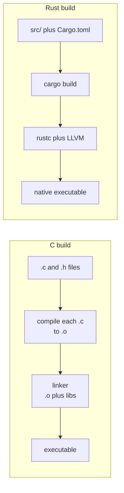

# Chapter 1 — Why Rust for a C Programmer

> **What you'll learn.** Why Rust was created, how its philosophy compares to C's,
> exactly what Rust removes and adds relative to C, and how to read and run your
> first Rust program. You will also see the single idea — the *borrow checker* —
> that makes Rust feel different from every language you have used.

## Where Rust comes from

Rust began as a personal project of Graydon Hoare around 2006 and was then
sponsored by Mozilla, which needed a language to build a safe, parallel browser
engine (Servo) without the constant memory-safety bugs that plague large C and
C++ codebases. Rust 1.0 shipped in 2015.

The problem it set out to solve is the one every C programmer knows in their bones:
**memory bugs.** Use-after-free, double-free, buffer overruns, dangling pointers,
and data races are responsible for a huge share of security vulnerabilities. Study
after study from Microsoft, Google, and others found that roughly **70% of serious
security bugs** in large C/C++ codebases are memory-safety bugs.

Rust's bet is that a compiler can prevent all of those *at compile time*, with
**no garbage collector and no runtime cost**. That bet paid off: Rust is now used
in the Linux kernel, Android, Windows, Firefox, AWS (Firecracker), Cloudflare,
Discord, Dropbox, and countless command-line tools, and it has topped Stack
Overflow's "most admired language" survey for years.

> **Mental model.** Rust is "C with a compiler that refuses to let you write a
> memory bug." You keep C's speed and control; you give up the freedom to shoot
> yourself in the foot.

## The Rust philosophy (and how it differs from C's)

C's philosophy is "trust the programmer." The language is small and gives you sharp
tools, including ones with undefined behavior. The programmer is responsible for
every byte.

Rust's philosophy is **"safety, speed, and concurrency — pick all three."** It
achieves this with two ideas:

- **Ownership and borrowing:** a small set of rules, checked by the compiler, that
  track who is responsible for each value and who may read or write it. This is the
  heart of the language (Chapters 7–9).
- **Zero-cost abstractions:** high-level features (iterators, generics, traits)
  compile down to the same machine code you would have written by hand in C. You do
  not pay at runtime for the convenience.

| Topic | C | Rust |
|---|---|---|
| Memory management | Manual `malloc`/`free` | Automatic via ownership (no GC, no `free`) |
| Memory safety | Your responsibility | Guaranteed by the compiler (in safe code) |
| Null pointers | `NULL` everywhere | No null; `Option<T>` instead |
| Error handling | Return codes / `errno` | `Result<T, E>` values + `?` |
| Concurrency safety | Your responsibility | Checked at compile time (`Send`/`Sync`) |
| Mutability | Mutable by default | **Immutable by default** |
| Pointer arithmetic | Yes | Only inside `unsafe` |
| Generics | Macros / `void *` | Real generics, monomorphized (zero-cost) |
| Build system | You write Makefiles | Built in (`cargo`) |
| Undefined behavior | Pervasive | Only possible inside `unsafe` |

> **Watch out.** Rust's compiler is strict and will reject code that a C compiler
> would happily build. This feels slow at first. The trade is that once it compiles,
> an enormous class of bugs is simply gone. Rust programmers call this feeling "if
> it compiles, it works" — an exaggeration, but a telling one.

## What Rust removes (the relief)

Coming from C, you get to stop worrying about a long list of dangers:

- **Manual memory management.** No `malloc`/`free`, no "who owns this pointer?", no
  use-after-free, no double-free, no leak hunts with Valgrind. The compiler frees
  memory for you, deterministically, with no garbage collector. (Chapter 7)
- **Dangling pointers and buffer overruns.** References can never outlive what they
  point to, and slices are bounds-checked. (Chapters 8–10)
- **Null pointer dereferences.** There is no null. (Chapter 12)
- **Data races.** The compiler will not let two threads share mutable data without
  synchronization. (Chapter 19)
- **Most undefined behavior.** Integer sizes are fixed, signed overflow is defined
  (it panics in debug builds), and uninitialized memory cannot be read.

## What Rust adds (the new tools)

In exchange, Rust gives you features C does not have:

- **The ownership system and borrow checker** — the compile-time memory and thread
  safety described above. (Chapters 7–9)
- **`Option<T>` and `Result<T, E>`** — types that make "no value" and "an error"
  explicit and impossible to ignore. (Chapters 12–13)
- **Enums and pattern matching** — powerful tagged unions with exhaustive `match`.
  (Chapter 12)
- **Traits and generics** — type-checked, zero-cost abstraction. (Chapters 14–15)
- **Cargo** — one tool that builds, tests, formats, lints, fetches dependencies,
  and generates docs. (Chapter 2)
- **Fearless concurrency** — threads, channels, and async, all checked for safety.
  (Chapters 19–21)

## Your first program: "Hello, World"

Here it is in C and in Rust, side by side.

```c
/* hello.c — compile: cc hello.c -o hello && ./hello */
#include <stdio.h>

int main(void) {
    printf("Hello, World\n");
    return 0;
}
```

```rust
// hello.rs — run: rustc hello.rs && ./hello   (or: cargo run)
fn main() {
    println!("Hello, World");
}
```

Line by line, with the C version as our reference:

- `fn main()` — `fn` declares a function; `main` is the entry point, like in C.
  Note that `main` does **not** return `int` here; to exit with a status code you
  return a `Result` or call `std::process::exit(code)`.
- `println!("Hello, World")` — prints a line and adds the newline for you. The `!`
  means **`println!` is a macro**, not a function. Macros run at compile time and
  can do things functions cannot (here, checking the format string). You will meet
  many `name!` macros: `println!`, `vec!`, `format!`, `panic!`. (Chapter 26)
- There is no `#include`. Common items come from the *prelude*, which is imported
  automatically; everything else you bring in with `use` (Chapter 3).

> **Watch out.** The `!` on `println!` is not a typo and not "not". It marks a
> macro call. Forgetting it (`println(...)`) is a common first-day error.

## A slightly bigger taste

This program shows several Rust ideas at once: a growable vector, an iterator
pipeline, an explicit numeric conversion, and an `Option` handled with `match`.
Read the comments; we cover each idea in detail later.

```rust
fn main() {
    let nums = vec![3, 1, 4, 1, 5, 9]; // a Vec<i32>: a heap array that knows its length
    let total: i32 = nums.iter().sum(); // iterators are lazy and zero-cost
    let count = nums.len();
    let avg = total as f64 / count as f64; // `as` is an explicit conversion

    println!("sum={total} count={count} avg={avg:.2}");

    // `max()` returns Option<&i32>: Some(&value), or None if the Vec were empty.
    match nums.iter().max() {
        Some(m) => println!("max={m}"),
        None => println!("the list was empty"),
    }
}
```

Things to notice compared to C:

- `let nums = vec![...]` declares **and** initializes a vector. No `malloc`, no
  size, no `free`. When `nums` goes out of scope at the end of `main`, its heap
  memory is released automatically.
- `nums.iter().sum()` is an **iterator pipeline**. It compiles to a tight loop with
  no extra allocation — a zero-cost abstraction.
- `total as f64` is an **explicit conversion**. Rust will not divide an `i32` by an
  `i32` and silently give you a float, nor mix `i32` and `f64`.
- `max()` cannot return null. It returns `Option`, and the compiler forces you to
  handle both the `Some` and `None` cases. A whole class of crashes disappears.
- `println!("{total}")` puts the variable right in the string — like a safer,
  type-checked `printf`, with no format-specifier mismatches.

## The one idea that makes Rust different: the borrow checker

Here is the example that surprises every newcomer. In C, this compiles and is a
classic bug:

```c
char *s1 = strdup("hello");
char *s2 = s1;     /* both point to the same buffer */
free(s1);
free(s2);          /* double free — undefined behavior, maybe a crash or exploit */
```

The equivalent Rust does **not** compile — and that is the point:

```rust
// COMPILE ERROR: borrow of moved value: `s1`
fn main() {
    let s1 = String::from("hello");
    let s2 = s1;          // ownership MOVES from s1 to s2; s1 is now invalid
    println!("{s1}");     // error[E0382]: borrow of moved value: `s1`
}
```

When you write `let s2 = s1`, ownership of the string **moves** to `s2`. Rust now
considers `s1` empty, so using it is a compile error. Because there is exactly one
owner, the memory is freed exactly once, automatically, when that owner's scope
ends. Double-free and use-after-free are impossible. This rule — *ownership* — is
the subject of Chapter 7, and almost everything else in Rust follows from it.

> **Mental model.** Think of ownership like a single physical key to a room. You
> can hand the key to someone else (a move), but then *you* no longer have it. Only
> the key-holder may lock up (free) the room, and there is only ever one key.

## How a Rust program is built and run

Like C, Rust compiles ahead of time to native machine code (through the LLVM
backend, the same backend `clang` uses). But you rarely call the compiler
(`rustc`) directly. You use **Cargo**, Rust's build tool and package manager, which
reads a `Cargo.toml` file and handles compiling, dependencies, and linking.



Practical consequences:

- **One command.** `cargo run` builds and runs; `cargo build --release` produces an
  optimized binary in `target/release/`. No Makefile to write.
- **Native, fast binaries.** The output is machine code with no interpreter and no
  garbage collector. Startup is instant.
- **Slower compiles than C.** All that checking and optimization takes time; Rust
  build times are a real, often-mentioned trade-off. `cargo check` (type-check
  without producing a binary) is much faster and what you run while editing.
- **Easy cross-compilation and dependencies.** `rustup target add ...` and Cargo
  fetch and build everything for you.

## Is Rust fast? (an honest answer)

Yes. Rust is in the same performance class as C and C++. Its abstractions are
"zero-cost": an iterator chain or a generic function compiles to the same
instructions you would write by hand. There is no garbage collector, so there are
no GC pauses, and memory use is predictable.

The trade-offs versus C are not at runtime; they are at *development* time:

- **The learning curve.** Ownership and borrowing take real effort to internalize —
  that is what this book is for.
- **Compile times.** Larger than C, because the compiler does much more work.
- **Some patterns are harder.** Data structures with lots of shared mutable
  pointers (graphs, doubly linked lists) fight the borrow checker and need extra
  tools (Chapter 17) or `unsafe`.

> **Rule of thumb.** If you would reach for C or C++ for performance and control —
> a systems tool, a network service, an embedded device, a CLI, a game engine
> component — Rust gives you that performance with memory and thread safety
> guaranteed. That is its sweet spot.

## When *not* to choose Rust

Be honest about the edges. Rust is a weaker fit when you need:

- **Throwaway scripts or quick prototypes**, where a garbage-collected language
  (Python, Go) lets you move faster and you do not care about the last bit of
  performance.
- **To extend a large existing C/C++ codebase in place** — though Rust interoperates
  with C through FFI (Chapter 25) and can be introduced module by module.
- **A team with no time to climb the learning curve** right now. Rust rewards the
  investment, but the investment is real.
- **Very dynamic, reflection-heavy designs** that lean on a runtime; Rust prefers to
  resolve things at compile time.

For systems programming, infrastructure, performance-critical services, embedded
work, and robust command-line tools, Rust is an outstanding choice — and a natural
next language for a C programmer who is tired of memory bugs.

## Key takeaways

- Rust was created to eliminate memory-safety bugs (about 70% of serious security
  bugs in C/C++) **without** a garbage collector and **without** runtime cost.
- It keeps C's strengths — compiled, native, fast, low-level control — and removes
  the dangers: manual `free`, dangling pointers, buffer overruns, null, and data
  races.
- The one big new idea is **ownership**, enforced by the **borrow checker**: every
  value has a single owner, and moving it invalidates the old name.
- New tools you gain: `Option`/`Result`, enums and pattern matching, traits and
  generics, Cargo, and fearless concurrency.
- `cargo run` builds and runs; abstractions are zero-cost; the trade-offs are the
  learning curve and compile times, not runtime speed.

## Watch out (gotchas for C programmers)

- **`println!` is a macro** — the `!` is required.
- **`main` does not return `int`.** Use a `Result` return or `std::process::exit`.
- **No implicit numeric conversions** — write `x as f64`.
- **Variables are immutable by default** — you will need `let mut` sooner than you
  think.
- The compiler fighting you is normal and expected at first; the error messages are
  unusually good — read them.

## Interview questions

**Q: What problem was Rust designed to solve, and how does it differ from a
garbage-collected language?**
A: Rust was designed to give memory and thread safety with the performance and
control of C/C++. Unlike garbage-collected languages, it has no GC and no runtime
overhead; safety is enforced at compile time by the ownership and borrowing rules,
and memory is freed deterministically when its owner goes out of scope.

**Q: What is "zero-cost abstraction"?**
A: The principle that high-level features (iterators, generics, traits) compile down
to machine code as efficient as hand-written low-level code, so you do not pay a
runtime penalty for using them. Generics, for example, are monomorphized into
specialized code rather than dispatched dynamically.

**Q: In Rust, why does using a variable after assigning it to another variable
sometimes fail to compile?**
A: Because assignment can *move* ownership. For a non-`Copy` type like `String`,
`let b = a;` moves ownership to `b`, leaving `a` invalid. Using `a` afterward is a
compile error. This guarantees a single owner, so the value is freed exactly once.

**Q: Name two whole classes of bugs that safe Rust prevents at compile time that C
does not.**
A: Examples: use-after-free and double-free (prevented by ownership), dangling
references (prevented by the borrow checker and lifetimes), buffer overruns
(slices are bounds-checked), null-pointer dereferences (no null; `Option` instead),
and data races (the `Send`/`Sync` rules).

## Try it

1. Install Rust if you have not (Chapter 2 covers it) and save the "Hello, World"
   program. Run it with `rustc hello.rs && ./hello`.
2. Type the "bigger taste" program into `src/main.rs` of a `cargo new` project and
   run `cargo run`. Then make the `nums` vector empty (`vec![]`, and annotate it as
   `let nums: Vec<i32> = vec![];`) and watch the `None` branch print.
3. Type the borrow-checker example and read the full compiler error. Notice how it
   names the move and even suggests `.clone()`. That is the borrow checker talking
   to you — get used to its voice.
