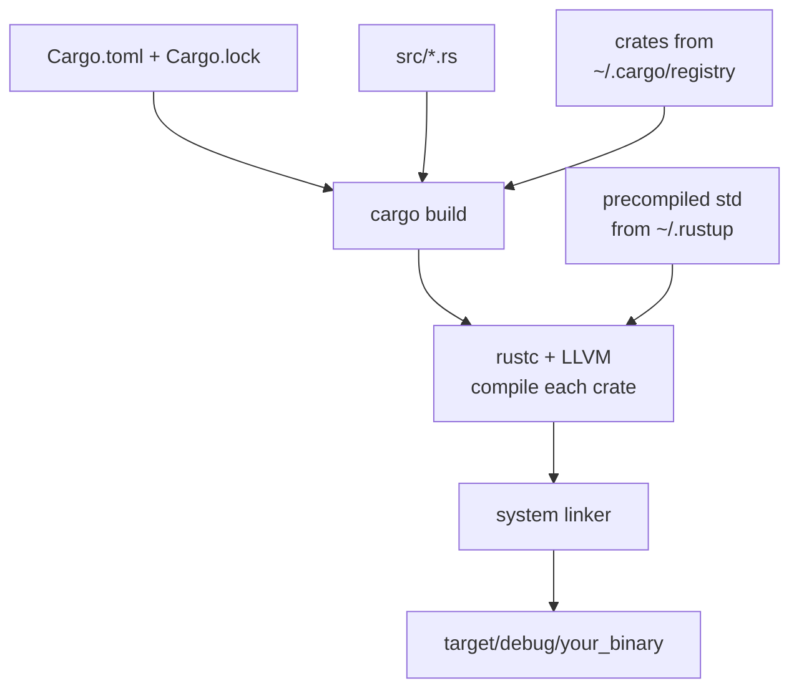

# Chapter 2 — Installing Rust and the Cargo Toolchain

> **What you'll learn.** How to install Rust with `rustup`, what each tool in the
> toolchain does, and a command-by-command tour of `cargo` — the one program that
> replaces your C compiler, `make`, package manager, formatter, and linter all at
> once.

## The big picture: one tool instead of five

In C, building a real project means stitching together separate programs: a
compiler (`gcc` or `clang`), a build system (`make`, CMake, Autotools), a way to
get libraries (your distro's package manager, or copying source into the tree), a
formatter (`clang-format`), and a linter (`clang-tidy`, `cppcheck`). Each has its
own config file and its own learning curve.

Rust ships these as one coherent toolchain, and you drive almost all of it through
a single command called **`cargo`**.

| Job | C (typical) | Rust |
|---|---|---|
| Compile | `gcc` / `clang` | `rustc` (called for you by cargo) |
| Build / incremental builds | `make`, CMake | `cargo build` |
| Get a dependency | distro package, vendored source | `cargo add` (from crates.io) |
| Pin dependency versions | by hand / lockfiles you write | `Cargo.lock` (automatic) |
| Format code | `clang-format` | `cargo fmt` |
| Lint | `clang-tidy`, `cppcheck` | `cargo clippy` |
| Run tests | a framework you bolt on | `cargo test` (built in) |
| Build docs | Doxygen | `cargo doc` |
| Install the toolchain itself | distro package | `rustup` |

> **Mental model.** `rustup` manages *which Rust* you have (versions and targets).
> `cargo` manages *your project* (building, testing, dependencies). `rustc` is the
> actual compiler underneath, which you rarely call by hand.

## Installing Rust with `rustup`

`rustup` is the **toolchain manager**. It installs the compiler and tools, keeps
them updated, and lets you switch between Rust versions and cross-compilation
targets. On Linux and macOS, the official one-line installer is:

```sh
curl --proto '=https' --tlsv1.2 -sSf https://sh.rustup.rs | sh
```

This downloads a small script and runs it. It asks one question (press Enter for
the default), then installs everything into your home directory — no `sudo`, no
system-wide changes. On Windows, download and run `rustup-init.exe` from
<https://rustup.rs> instead.

> **Watch out.** Piping a script from the internet into `sh` is exactly the kind of
> thing a careful C programmer is right to pause over. This is the method the Rust
> project officially documents. If you prefer, open the URL in a browser and read
> the script first, or install `rustup` from your OS package manager.

When it finishes, the installer tells you to add `~/.cargo/bin` to your `PATH`. It
usually edits your shell profile for you. To use Rust in the **current** shell
without opening a new one:

```sh
source "$HOME/.cargo/env"
```

### What just got installed

A default install gives you four programs, all living under `~/.cargo/bin`:

- **`rustc`** — the compiler. Turns Rust source into a native binary, the same job
  `gcc` does for C. Built on the LLVM backend (the same backend `clang` uses).
- **`cargo`** — the build tool and package manager. This is the command you type
  all day.
- **`clippy`** — the linter (run as `cargo clippy`). Catches likely mistakes and
  suggests more idiomatic code.
- **`rustfmt`** — the code formatter (run as `cargo fmt`). One official style, so
  formatting is never an argument.

You also get `rust-std` (the standard library, precompiled for your platform) and
local copies of the documentation.

### Verify the install

```sh
rustc --version    # e.g. rustc 1.96.0 (ac68faa20 2026-05-25)
cargo --version    # e.g. cargo 1.96.0 (30a34c682 2026-05-25)
```

If both print a version, you are ready.

### Keeping Rust up to date

Rust ships a new stable release every six weeks. Updating is one command:

```sh
rustup update            # update all installed toolchains to the latest
rustup self update       # update rustup itself
```

> **C vs Rust.** In C, upgrading your compiler is an OS-level event (a new distro
> package, maybe a new `gcc` you build yourself). In Rust, `rustup update` swaps in
> the new compiler in seconds, per user, and you can keep several versions side by
> side.

### Components: adding clippy, rustfmt, and more

If a component is missing, or you used a minimal install profile, add it with
`rustup component add`:

```sh
rustup component add clippy rustfmt
rustup component add rust-src           # std source, useful for IDE tooling
rustup component add rust-analyzer      # the language server (Chapter 24 — Tooling)
```

### Targets: cross-compiling

A **target** is a platform you compile *for* (a CPU + OS combination, written as a
"target triple" like `aarch64-unknown-linux-gnu`). In C this means installing a
whole cross-toolchain. In Rust you add the target's standard library and Cargo
does the rest:

```sh
rustup target add aarch64-unknown-linux-gnu      # add a target
rustup target list                               # see all available targets
cargo build --release --target aarch64-unknown-linux-gnu
```

You still need a linker for that platform, but the Rust side is one command.

### Toolchains: stable, beta, nightly

Rust has three release channels:

- **stable** — what you use for almost everything. New stable every six weeks.
- **beta** — the next stable, for testing your code early.
- **nightly** — built every night; required for a few unstable, experimental
  features.

```sh
rustup toolchain install nightly      # install the nightly toolchain
rustup default stable                 # set the default toolchain
rustup override set nightly           # use nightly in THIS directory only
cargo +nightly build                  # one-off: build with nightly
```

> **Rule of thumb.** Stay on **stable** unless a specific tool or feature demands
> nightly. Most production Rust is written on stable.

## A command-by-command tour of `cargo`

These are the commands you will actually use. Each entry is the one-line purpose
plus a real example.

### `cargo new` / `cargo init` — start a project

`cargo new` creates a new project directory; `cargo init` turns the *current*
directory into one.

```sh
cargo new hello            # make ./hello, a binary project (src/main.rs)
cargo new mylib --lib      # make a library project (src/lib.rs) instead
cargo init                 # turn an existing directory into a project
```

`cargo new hello` produces:

```
hello/
├── Cargo.toml      # project manifest (metadata + dependencies)
├── .gitignore      # ignores /target by default
└── src/
    └── main.rs     # your code; a "Hello, world!" is generated for you
```

> **C vs Rust.** There is no equivalent to "scaffold a buildable C project with a
> Makefile and a `.gitignore`" in standard C. `cargo new` gives you a project that
> builds and runs immediately.

### `cargo build` — compile the project

```sh
cargo build              # debug build -> target/debug/hello
cargo build --release    # optimized build -> target/release/hello
```

A **debug** build compiles fast and keeps debug info and runtime checks (for
example, integer-overflow checks panic in debug). A **release** build turns on
optimizations (`-O`-style) and is much faster at runtime but slower to compile.
Everything goes into the `target/` directory; you never clean up `.o` files by
hand.

> **C vs Rust.** Debug vs release is `-O0 -g` vs `-O2` in C, but you do not manage
> the flags or output paths yourself — `cargo build` and `cargo build --release`
> handle it, and the two builds live in separate folders so they never clash.

### `cargo run` — build and run in one step

```sh
cargo run                       # build (if needed) then run the binary
cargo run --release             # same, optimized
cargo run -- --input file.txt   # pass args AFTER -- to YOUR program
```

Cargo rebuilds only if something changed, then runs the result. Anything after
`--` is passed to your program, not to cargo.

### `cargo check` — type-check without building a binary

```sh
cargo check          # analyze the code; report errors; produce NO executable
```

`cargo check` runs the full front end of the compiler — parsing, type-checking,
and **borrow-checking** — but stops before code generation and linking, the
expensive back-end stages. That is why it is much faster than `cargo build`. It is
what you run in a tight edit loop to ask "does this compile?" without waiting for
an actual binary.

> **C vs Rust.** The closest C analog is `gcc -fsyntax-only`, which parses but does
> not generate code. `cargo check` goes further: it also runs the borrow checker,
> so it catches Rust's ownership errors too. Run `cargo check` constantly while
> editing; save `cargo build` for when you need to actually run the program.

### `cargo test` — run tests

```sh
cargo test               # compile and run all tests
cargo test parse         # run only tests whose name contains "parse"
```

Test support is built into the language and the tool: functions marked
`#[test]`, integration tests in `tests/`, and even code examples inside doc
comments all run with this one command. Full details are in Chapter 23 — Testing.

### `cargo fmt` — format code (rustfmt)

```sh
cargo fmt                # reformat the whole project to the standard style
cargo fmt --check        # report unformatted files without changing them (CI)
```

There is one official style, so code looks the same everywhere. Run it before you
commit. See Chapter 24 — Tooling.

### `cargo clippy` — lint the code

```sh
cargo clippy                       # extra warnings beyond the compiler's
cargo clippy -- -D warnings        # treat warnings as errors (good for CI)
```

Clippy is the linter. It flags likely bugs, slow patterns, and un-idiomatic code,
often with a suggested fix. Think `clang-tidy`, but tuned for Rust and very
beginner-friendly. See Chapter 24 — Tooling.

### `cargo add` — add a dependency from crates.io

```sh
cargo add serde                       # add the latest serde to Cargo.toml
cargo add serde --features derive     # enable an optional feature
cargo add rand@0.8                     # pin a version requirement
```

A **crate** is a Rust library (or binary) package. **crates.io** is the central
public registry, like a language-wide package repository. `cargo add` edits your
`Cargo.toml` and the next build downloads and compiles the crate.

> **C vs Rust.** In C, adding a library means finding it, installing the right
> `-dev` package system-wide (or vendoring the source), then editing your Makefile
> for include paths and `-l` flags. `cargo add serde` does the whole thing, and the
> dependency is recorded *in the project*, not in your OS.

### `cargo doc` — build API documentation

```sh
cargo doc --open         # build docs for your crate + its deps, open in a browser
cargo doc --no-deps      # only your crate
```

Cargo generates browsable HTML from your code and your doc comments — like Doxygen,
but built in and used by the whole ecosystem. The same tooling powers
<https://docs.rs>.

### `cargo bench` — run benchmarks

```sh
cargo bench              # run functions marked as benchmarks
```

Runs performance benchmarks. The built-in harness needs nightly; on stable, the
common choice is the `criterion` crate. See Chapter 24 — Tooling.

### `cargo update` — update dependencies within your version rules

```sh
cargo update             # bump dependencies to newer compatible versions
cargo update -p serde    # update just one
```

This refreshes `Cargo.lock` to newer versions that still satisfy the requirements
in `Cargo.toml` (more on this in Chapter 22 — Cargo, Crates, and Workspaces).

### `cargo clean` — delete build artifacts

```sh
cargo clean              # remove the entire target/ directory
```

Like `make clean`, but it simply deletes `target/`. The next build is a full
rebuild.

### `cargo install` — install a binary crate as a command

```sh
cargo install ripgrep    # build and install the `rg` command into ~/.cargo/bin
cargo install --path .   # install the binary from the current project
```

This compiles a program from crates.io and drops the executable in `~/.cargo/bin`
so you can run it as a normal command. It is how many Rust command-line tools are
distributed.

### `cargo tree` — show the dependency graph

```sh
cargo tree               # print dependencies as a tree
cargo tree -i regex      # show what pulls in the `regex` crate (inverted)
```

Useful for understanding *why* some transitive crate is in your build.

## The daily workflow cheat-box

These are the six commands you type all day. Keep them in muscle memory.

```sh
cargo check              # fast: does it compile? (run this most often)
cargo run                # build and run during development
cargo test               # run the tests
cargo fmt                # format before committing
cargo clippy             # lint for bugs and style
cargo build --release    # the optimized binary, when you ship
```

## The anatomy of `Cargo.toml`

`Cargo.toml` is the project **manifest**: the file Cargo reads to know your
project's name, edition, and dependencies. It is written in TOML, a simple
key-value format. A fresh `cargo new` gives you:

```toml
[package]
name = "hello"
version = "0.1.0"
edition = "2024"

[dependencies]
```

- `[package]` — metadata about this project. `name` is the crate name,
  `version` follows semantic versioning, and `edition` selects the language
  edition (more below).
- `[dependencies]` — the crates you depend on. `cargo add` fills this in for you,
  for example `serde = "1"`.

Alongside it, Cargo maintains **`Cargo.lock`**, a file that records the *exact*
version of every dependency (and transitive dependency) that was resolved. You
edit `Cargo.toml` (your requirements); Cargo writes `Cargo.lock` (the exact
resolution). Commit `Cargo.lock` for applications so builds are reproducible. The
full story — version requirements, features, workspaces — is Chapter 22 — Cargo,
Crates, and Workspaces.

> **C vs Rust.** `Cargo.toml` is your Makefile *and* your dependency list in one
> small, declarative file. `Cargo.lock` is the reproducible "exactly these
> versions" record that, in C, you would have to build yourself with pinned
> submodules or a vendor directory.

## Calling `rustc` directly (rare)

You almost never invoke the compiler by hand, but you can, and it is handy for a
single throwaway file with no project around it:

```sh
rustc --edition 2024 main.rs     # compile main.rs -> ./main
./main
```

Without `--edition`, `rustc` defaults to the 2015 edition, so pass it explicitly.
For anything bigger than one file, use Cargo — it manages dependencies, editions,
profiles, and output paths for you.

## Where everything lives on disk

Three locations matter. None require root; everything is per user or per project.

```
~/.rustup/                      # managed by rustup
├── toolchains/                 #   the actual rustc, cargo, std for each version
│   ├── stable-.../
│   └── nightly-.../
└── settings.toml               #   default toolchain, overrides

~/.cargo/                       # managed by cargo
├── bin/                        #   rustc, cargo, clippy, rustfmt, + cargo install'd tools
│                               #   ** put this on your PATH **
├── registry/                   #   downloaded + cached crates from crates.io
└── config.toml                 #   global cargo settings

my_project/
├── Cargo.toml                  # the manifest you edit
├── Cargo.lock                  # exact resolved versions (generated)
├── src/                        # your source code
└── target/                     # ALL build output (debug/, release/); safe to delete
```

- **`~/.rustup`** holds the toolchains (compilers and standard libraries).
- **`~/.cargo`** holds the downloaded-crate cache (`registry/`) and installed
  binaries (`bin/`). Make sure `~/.cargo/bin` is on your `PATH`.
- **`target/`** is per project. It is your `*.o` and final binaries; add it to
  `.gitignore` (the generated `.gitignore` already does). Deleting it just forces a
  rebuild.

## How `cargo build` drives `rustc`

`cargo` is the conductor; `rustc` does the compiling; the system linker produces
the final binary. The standard library is already compiled and comes from the
toolchain.



The key point: you talk to **cargo**, and cargo decides what needs recompiling,
fetches dependencies, calls `rustc` with the right flags for each crate, and runs
the linker. This is the work a hand-written Makefile does in C — here it is
automatic and incremental.

## Editions in one paragraph

An **edition** is a named snapshot of the language's syntax and idioms: 2015,
2018, 2021, and 2024. Editions let Rust make small breaking changes (like turning
a word into a keyword) without breaking old code: each crate declares its edition
in `Cargo.toml`, and crates of different editions link together fine. This book
targets **edition 2024**. Think of it like a C standard level (`-std=c11` vs
`-std=c17`), except that mixing editions across libraries is fully supported and
normal.

## Key takeaways

- **`rustup`** installs and updates the toolchain; **`cargo`** builds your project;
  **`rustc`** is the compiler underneath that you rarely call directly.
- Install with the one-line `curl ... | sh`; verify with `rustc --version` and
  `cargo --version`; update with `rustup update`.
- A default install includes `rustc`, `cargo`, `clippy`, and `rustfmt`. Add pieces
  with `rustup component add` and cross-compile targets with `rustup target add`.
- One tool, `cargo`, replaces C's separate compiler, `make`, package manager,
  formatter, and linter. The daily six: `check`, `run`, `test`, `fmt`, `clippy`,
  `build --release`.
- **`cargo check`** is faster than `cargo build` because it skips code generation
  and linking; run it constantly while editing.
- Files live in `~/.rustup` (toolchains), `~/.cargo` (crate cache + installed
  binaries; put `~/.cargo/bin` on `PATH`), and per-project `target/`.
- `Cargo.toml` declares your requirements; `Cargo.lock` pins exact versions for
  reproducible builds. This book uses **edition 2024**.

## Watch out (gotchas for C programmers)

- **Add `~/.cargo/bin` to your `PATH`.** If `cargo` is "not found" after install,
  this is almost always why. Run `source "$HOME/.cargo/env"` or open a new shell.
- **Bare `rustc` defaults to edition 2015.** Pass `--edition 2024` when you compile
  a single file by hand.
- **`cargo run -- args`**: arguments for *your* program go after `--`. Without it,
  cargo tries to interpret them.
- **Debug builds are slow at runtime.** They are not optimized and include overflow
  checks. Always benchmark and ship with `--release`.
- **Do not commit `target/`.** It is large and regenerable. The generated
  `.gitignore` already excludes it.
- **`cargo check` does not produce a binary.** When you need to actually run the
  program, use `cargo run` or `cargo build`.

## Interview questions

**Q: What is the difference between `rustup`, `cargo`, and `rustc`?**
A: `rustup` is the toolchain manager — it installs, updates, and switches between
Rust versions and cross-compilation targets. `cargo` is the build tool and package
manager you use day to day to build, test, and manage dependencies. `rustc` is the
compiler itself; cargo calls it for you, so you rarely run it directly.

**Q: Why is `cargo check` faster than `cargo build`?**
A: `cargo check` runs the compiler's front end — parsing, type-checking, and
borrow-checking — and then stops. It skips the expensive back-end stages: code
generation (LLVM optimization) and linking. It reports the same errors but
produces no executable, so it is much faster for a tight edit-and-check loop.

**Q: What is the difference between `Cargo.toml` and `Cargo.lock`?**
A: `Cargo.toml` is the manifest you write: it lists your dependency *requirements*
(for example, `serde = "1"`) plus package metadata and the edition. `Cargo.lock` is
generated by cargo and records the *exact* resolved version of every direct and
transitive dependency, so builds are reproducible. You edit the first; cargo
maintains the second.

**Q: How does Rust's toolchain replace the separate tools a C project needs?**
A: One install via `rustup` and one command, `cargo`, cover the whole workflow:
`cargo build` replaces `make`/CMake, `cargo add` plus crates.io replaces the system
package manager and vendored libraries, `cargo fmt` replaces `clang-format`,
`cargo clippy` replaces `clang-tidy`, `cargo test` provides the test harness, and
`cargo doc` replaces Doxygen — all driven through the same project manifest.

**Q: What is a Rust "edition," and how is it like or unlike a C standard?**
A: An edition (2015, 2018, 2021, 2024) is a named snapshot of the language's syntax
and idioms, declared per crate in `Cargo.toml`. Like a C standard (`-std=c17`) it
selects a language level. Unlike C standards, editions can mix freely across
linked crates — a 2024 crate can depend on a 2018 crate — so the ecosystem can
adopt new editions gradually without breaking old code.

## Try it

1. Run `cargo new playground && cd playground`, then `cargo run`. Note the
   `Compiling`/`Finished`/`Running` lines and the new `target/` directory.
2. Edit `src/main.rs` and run `cargo check`, then `cargo build`. Time both
   (`time cargo check` vs `time cargo build --release`) and compare.
3. Run `cargo add rand`, look at how `Cargo.toml` and `Cargo.lock` changed, then
   run `cargo tree` to see what `rand` pulled in.
