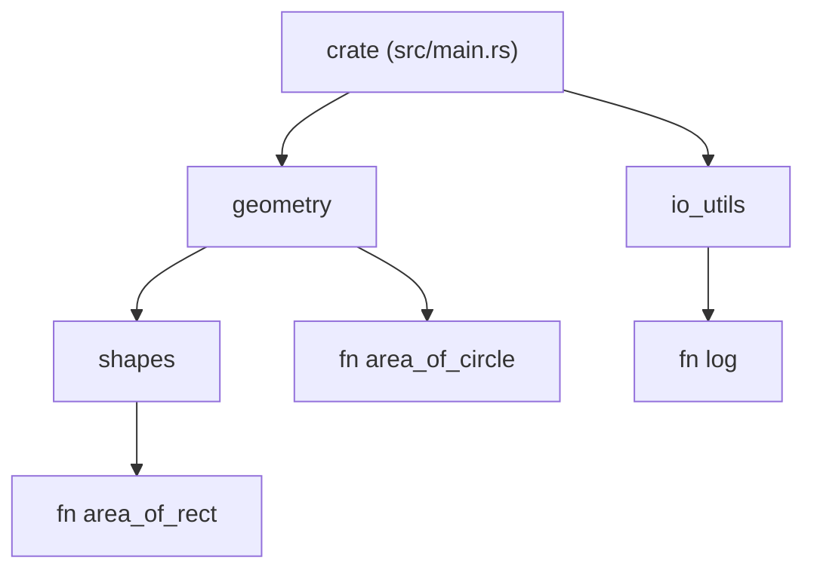

# Chapter 3 — Program Structure: Crates, Modules, and Visibility

> **What you'll learn.** How a Rust program is organized without headers: what a
> crate and a package are, how `mod` builds a tree of modules, how paths and `use`
> name things, and why everything is private by default — the opposite of C.

## No headers, no `#include`, no forward declarations

In C, a program is a set of **translation units**: each `.c` file is compiled on
its own, sees only what it has `#include`d, and the linker joins the results. You
manage visibility by hand with `extern` (share a symbol) and `static` (hide one),
and you write **header files** to declare what one file exposes to another. You
also order things carefully or write forward declarations, because the compiler
reads top to bottom.

Rust throws all of that out. The compiler reads a whole **crate** at once, so:

- There are **no header files**. You declare a function or struct in exactly one
  place.
- There is **no `#include`**. You bring names into scope with `use`.
- There are **no forward declarations** and **order does not matter**. A function
  can call another defined later in the file; a module can use a type defined
  below it.

> **C vs Rust.** A C header is a promise repeated in two places (the `.h` and the
> `.c`), which can drift out of sync. Rust has a single source of truth per item,
> and the compiler's whole-crate view means it already knows every declaration.

## Crates and packages

Two words you must keep straight:

- A **crate** is one unit of compilation: either a **binary** (an executable with a
  `main`) or a **library** (code other crates use). The compiler processes one
  crate as a whole. This is the closest thing Rust has to C's "the program the
  linker produces," except a library crate is one unit too, not a pile of `.o`
  files.
- A **package** is what `cargo new` creates: a directory with a `Cargo.toml` and
  one or more crates. A package has **at most one library crate** and **any number
  of binary crates**.

Each crate has a **root** file — the file the compiler starts from:

| File | Crate kind | Role |
|---|---|---|
| `src/main.rs` | binary | the default binary crate root; has `fn main()` |
| `src/lib.rs` | library | the library crate root |
| `src/bin/foo.rs` | binary | an extra binary crate named `foo` |

A common, idiomatic layout is a library crate (`src/lib.rs`) with all the logic
plus a thin binary (`src/main.rs`) that calls into it. That way the logic is
testable and reusable, and the binary is just a front door.

> **Mental model.** A crate root is like the single `.c` file you would pass to the
> compiler if that file could pull in every other file of the program itself. From
> the root, `mod` statements pull in the rest of the tree.

## Modules with `mod`

A **module** is a named container for items (functions, structs, enums, other
modules). Modules give you a namespace and a visibility boundary *inside* a crate.
They are not separate compilation units — they are organization within one crate.

> **C vs Rust.** In C, the file *is* the unit of scope and you split code into
> files. In Rust, the **module** is the unit of scope, and modules do not have to
> match files one-to-one — though it is common and tidy to make them match.

### Inline modules

The simplest module is written inline with a body:

```rust
mod math {
    pub fn square(x: i32) -> i32 {
        x * x
    }

    pub mod trig {
        pub fn deg_to_rad(d: f64) -> f64 {
            d * std::f64::consts::PI / 180.0
        }
    }
}

fn main() {
    let s = math::square(5);
    let r = math::trig::deg_to_rad(180.0);
    println!("{s} {r:.4}");
}
```

Modules can nest, forming a tree. Note the `pub` keywords — without them the items
would be private to the module and `main` could not reach them. More on that
below.

### File-based modules

For real code you put modules in their own files. Writing `mod foo;` (with a
semicolon, no body) tells the compiler to load the module's body from another
file. The compiler looks for **either**:

- `foo.rs` (next to the current file), or
- `foo/mod.rs` (the older style; still valid).

So this crate root:

```rust
// src/main.rs
mod geometry;          // load src/geometry.rs
mod io_utils;          // load src/io_utils.rs

fn main() {
    let a = geometry::area_of_circle(2.0);
    io_utils::log(&format!("area = {a:.3}"));
}
```

pairs with:

```rust
// src/geometry.rs
pub fn area_of_circle(r: f64) -> f64 {
    std::f64::consts::PI * r * r
}
```

Submodules nest as folders. A module `geometry` with a child `shapes` lives in
either `src/geometry/shapes.rs` (with `mod shapes;` written inside
`src/geometry.rs`) or the older `src/geometry/mod.rs` form.

> **C vs Rust.** `mod foo;` looks a little like `#include "foo.h"`, but it is not
> textual inclusion. It declares that module `foo` exists and tells the compiler
> where its source is. The contents are parsed as their own module, not pasted in.

### The module tree

Every crate has an implicit root module called `crate`, and `mod` declarations
build a tree under it. For the files above, the tree is:



And here is how files on disk map to the module path each one provides:

```
src/main.rs              ->  crate              (the binary crate root)
src/geometry.rs          ->  crate::geometry
src/geometry/shapes.rs   ->  crate::geometry::shapes
src/io_utils.rs          ->  crate::io_utils
```

## Paths: naming items across the tree

To use an item you name it by its **path**, with `::` between segments (like `.`
in a filesystem path, or `::` in C++). Paths can be absolute or relative:

- **Absolute** paths start from the crate root with `crate::`, for example
  `crate::geometry::area_of_circle`.
- **Relative** paths start from the current module, optionally using:
  - `self::` — this module (explicit relative start).
  - `super::` — the parent module (like `..` in a filesystem).

```rust
mod network {
    pub fn connect() {
        println!("connecting");
    }

    pub mod client {
        pub fn start() {
            super::connect();              // call parent's connect()
            crate::network::connect();     // same call, absolute path
            self::helper();                // a sibling in this module
        }

        fn helper() {}
    }
}

fn main() {
    network::client::start();
}
```

> **Rule of thumb.** Use **absolute** paths (`crate::...`) for items from elsewhere
> in the crate, and `super::`/`self::` for things close by. Absolute paths survive
> moving code around better.

To name items from an **external** crate (one you added with `cargo add`), start
the path with the crate's name instead of `crate`, for example `rand::random()`.
The standard library is the crate `std`, as in `std::collections::HashMap`.

## `use`: bringing names into scope

Writing full paths everywhere is noisy. The `use` keyword creates a shortcut in
the current scope, so you can write the last segment alone. This is Rust's answer
to repeating long names — not a textual include.

```rust
use std::collections::HashMap;

fn main() {
    let mut counts: HashMap<String, i32> = HashMap::new();   // no std::collections::
    counts.insert("a".to_string(), 1);
    println!("{counts:?}");
}
```

### Aliases with `as`

When two names would clash, or a name is long, rename it on import:

```rust
use std::io::Result as IoResult;
use std::fmt::Result as FmtResult;
```

### Grouped and nested `use`

Combine several imports from the same root to keep the top of a file tidy:

```rust
use std::collections::{HashMap, HashSet, BTreeMap};
use std::io::{self, Read, Write};          // `self` imports std::io itself too
```

### Glob imports

`use foo::*` brings in *everything* public from `foo`. Use it sparingly — it
hides where names come from — but it is common in two places: a module's tests
(`use super::*;`) and crates that publish a `prelude` module.

```rust
use std::collections::*;     // pulls in HashMap, HashSet, ... (use with care)
```

### Re-exporting with `pub use`

A plain `use` is private: it is a shortcut for the current module only. `pub use`
both imports a name *and* re-exports it, so callers of your module can reach it
through your path. This lets you build a clean public API that hides your internal
layout.

```rust
mod internal {
    pub mod deep {
        pub fn important() {}
    }
}

pub use internal::deep::important;     // now callers can use crate::important

fn main() {
    important();
}
```

> **C vs Rust.** `use` is closest to nothing in C — there is no "import a name"
> statement; you just rely on the header you included. `pub use` is how Rust builds
> a flat, friendly public API on top of a nested private structure, something C
> libraries fake by carefully choosing what goes in the public header.

## Visibility: private by default

Here is the biggest shift from C, and it is the reverse of what you are used to.

> **C vs Rust.** In C, a top-level symbol is **global by default**; you write
> `static` to *hide* it from other translation units. In Rust, every item is
> **private by default**; you write `pub` to *expose* it. Rust is "deny by
> default"; C is "allow by default."

Private means "visible only within the current module and its descendants." To
make an item usable from outside its module, mark it `pub`.

```rust
mod bank {
    pub struct Account {
        pub owner: String,     // public field
        balance: i64,          // PRIVATE field, even though the struct is pub
    }

    impl Account {
        pub fn new(owner: &str) -> Account {
            Account { owner: owner.to_string(), balance: 0 }
        }

        pub fn deposit(&mut self, amount: i64) {
            self.balance += amount;       // ok: same module
        }

        pub fn balance(&self) -> i64 {
            self.balance
        }
    }
}

fn main() {
    let mut a = bank::Account::new("Ada");
    a.deposit(100);
    println!("{} has {}", a.owner, a.balance());   // owner + balance() are pub
}
```

This **does not** compile, because struct fields are private by default even when
the struct is `pub`:

```rust
// COMPILE ERROR: field `balance` of struct `Account` is private
mod bank {
    pub struct Account {
        pub owner: String,
        balance: i64,
    }
}

fn main() {
    let a = bank::Account { owner: "Ada".into(), balance: 100 };  // error[E0451]
    println!("{}", a.owner);
}
```

> **Watch out.** Making a `struct` `pub` does **not** make its fields `pub`. Each
> field needs its own `pub`. This is deliberate: it lets a type keep invariants
> (like "balance is never set directly") the same way a C module hides a struct
> behind an opaque pointer and accessor functions.

### Finer-grained visibility

Between fully private and fully public, Rust offers restricted `pub`:

| Marker | Visible to | Closest C idea |
|---|---|---|
| (none) | this module and its child modules | a `static` symbol / file-local |
| `pub` | everyone, including other crates | a non-`static` symbol in a header |
| `pub(crate)` | anywhere in *this* crate, but not outside | a symbol shared across `.c` files but not in the public header |
| `pub(super)` | the parent module | a symbol shared with one related file |
| `pub(in path)` | a specific ancestor module | (no direct C analog) |

`pub(crate)` is the workhorse: "share this throughout my own crate, but do not
make it part of my public API."

```rust
mod engine {
    pub(crate) fn internal_tick() {}   // any module in this crate may call it
    pub fn run() {}                    // part of the crate's public API
    fn secret() {}                     // only this module + children
}
```

> **Mental model.** Think of three rings: the item's own module (private), the
> whole crate (`pub(crate)`), and the outside world (`pub`). You open exactly the
> ring you need, no wider.

## The prelude: what you get for free

Even though there is no `#include`, common types and traits are available in every
file without any `use`. That set is the **prelude** — a small list the compiler
imports automatically into every module. It is why you can write `Vec`, `String`,
`Option`, `Result`, `println!`, `Box`, and `Clone` with no import.

In edition 2024 the prelude also includes `Future` and `IntoFuture` (used by
`async`). Anything *not* in the prelude — like `HashMap` — you bring in with `use`.

> **C vs Rust.** The prelude is a bit like a header that is always implicitly
> included, except it is curated by the language and intentionally tiny, so it does
> not bloat compile times the way a giant always-included header would in C.

## Using an external crate

After you run `cargo add rand` (Chapter 2 — Installing Rust and the Cargo
Toolchain), the crate is available by name. In modern editions you do **not** write
`extern crate`; you just `use` it or name it by path.

```rust
// after: cargo add rand   (this needs the rand dependency to compile)
use rand::RngExt;

fn main() {
    let mut rng = rand::rng();
    let roll: u8 = rng.random_range(1..=6);
    println!("you rolled {roll}");
}
```

> **Watch out.** Older tutorials show `extern crate rand;` at the top of the file.
> That was required in edition 2015 and is unnecessary (and un-idiomatic) in
> editions 2018 and later. Just add the dependency and `use` it.

## Key takeaways

- A **crate** is one compilation unit (a binary or a library); a **package** has a
  `Cargo.toml` and one or more crates. `src/main.rs` is a binary root,
  `src/lib.rs` a library root.
- The compiler sees the **whole crate at once**: no headers, no `#include`, no
  forward declarations, and order does not matter.
- `mod` builds a tree of modules. `mod foo { ... }` is inline; `mod foo;` loads
  `foo.rs` or `foo/mod.rs`.
- Name items by **path** with `::`: `crate::` (absolute), `self::`/`super::`
  (relative). `use` makes a shortcut; `as` aliases; `{}` groups; `pub use`
  re-exports.
- **Everything is private by default** — the opposite of C. `pub` exposes an item;
  `pub(crate)`/`pub(super)` restrict it. Struct fields are private even in a `pub`
  struct.
- The **prelude** auto-imports common items; external crates are used by name with
  no `extern crate` in modern editions.

## Watch out (gotchas for C programmers)

- **Default is private, not global.** This is the reverse of C's non-`static`
  symbols. Forgetting `pub` is the most common "why can't I call this?" error.
- **A `pub struct` does not make fields `pub`.** Each field needs its own `pub`.
- **`mod foo;` is not `#include`.** It declares a module and points at its file; it
  does not paste text. There are no header/source pairs to keep in sync.
- **`use` does not compile or copy code.** It only creates a name shortcut in the
  current scope; the item is compiled once wherever it is defined.
- **No `extern crate` needed.** After `cargo add`, just `use` the crate. The old
  `extern crate` line is legacy.
- **Module path is not the file name you `cargo run`.** The crate root is
  `main.rs`/`lib.rs`; a file's module path comes from the `mod` chain that loads
  it, not from being passed on a command line.

## Interview questions

**Q: What is the difference between a crate and a package?**
A: A crate is a single compilation unit — either a binary (with `main`) or a
library — that the compiler processes as a whole. A package is a Cargo project: a
directory with a `Cargo.toml` that contains one or more crates, with at most one
library crate and any number of binary crates.

**Q: Rust has no headers. How does one part of a program see another?**
A: The compiler reads the entire crate at once, so every declaration is already
known regardless of order. You organize code into modules with `mod`, refer to
items by path (`crate::`, `super::`, `self::`), and use `use` to create shortcuts.
There are no headers, no `#include`, and no forward declarations.

**Q: How does Rust's default visibility differ from C's, and how do you control
it?**
A: In C a top-level symbol is global by default and you write `static` to hide it.
In Rust every item is private by default and you write `pub` to expose it. Finer
control comes from `pub(crate)` (visible throughout the crate but not outside) and
`pub(super)` (visible to the parent module).

**Q: If a struct is declared `pub`, can other modules construct it directly?**
A: Not necessarily. Marking the struct `pub` exposes the type, but its fields are
still private unless each is also marked `pub`. If any field is private, outside
code cannot build the struct with a struct literal and must use a public
constructor function instead — this is how a type protects its invariants.

**Q: What does `pub use` do and why is it useful?**
A: `pub use` imports a name and simultaneously re-exports it from the current
module. It lets you present a clean, flat public API while keeping a deeply nested
private module structure inside — callers reach the item through your chosen path
instead of your internal one.

## Try it

1. In a `cargo new` project, add `mod math { pub fn double(x: i32) -> i32 { x * 2 } }`
   and call `math::double(21)` from `main`. Remove the `pub` and read the error.
2. Move the module into `src/math.rs`, replace the inline block with `mod math;`,
   and confirm it still builds.
3. Add a `pub struct Point { x: i32, y: i32 }` in a module and try to build one
   from `main` with a struct literal. Watch the private-field error, then add `pub`
   to the fields to fix it.
