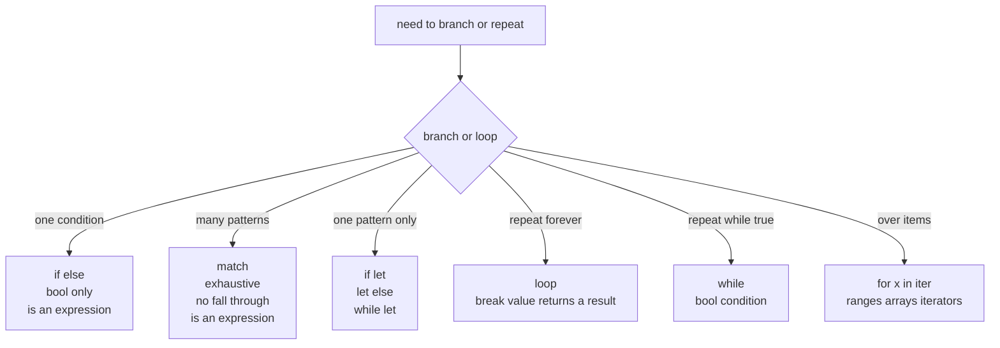

# Chapter 5 — Control Flow

> **What you'll learn.** How `if`, `loop`, `while`, and `for` work in Rust, why
> most of them are **expressions** that produce a value, why there is no C-style
> `for(;;)`, and a first look at `match`, `if let`, and `while let`.

## `if` and `else`

An `if` in Rust looks almost like C, with two differences you must remember: the
condition needs **no parentheses**, and the braces are **required** even for a
single statement.

```rust
fn main() {
    let n = 7;

    if n % 2 == 0 {
        println!("even");
    } else if n % 3 == 0 {
        println!("divisible by 3");
    } else {
        println!("something else");
    }
}
```

### The condition must be a `bool`

This is the rule that bites C programmers most. In C, the condition of an `if` is
any value, and "nonzero means true." So `if (n)` and `if (ptr)` are everyday
code. In Rust, the condition **must be a `bool`** — a real `true` or `false`.
There is no "truthiness."

```rust
// COMPILE ERROR: mismatched types, expected `bool`, found integer
fn main() {
    let n = 5;
    if n {                 // error[E0308]: expected `bool`, found integer
        println!("nonzero");
    }
}
```

Write the comparison you actually mean:

```rust
fn main() {
    let n = 5;
    if n != 0 {
        println!("nonzero");
    }
}
```

> **C vs Rust.** C: `if (n)` and `if (ptr)` rely on "nonzero is true" and "non-null
> is true." Rust: the condition is always a `bool`, so you write `if n != 0` and
> `if ptr.is_some()`. No implicit conversion to truth.

### `if` is an expression

In C, `if` is a statement; to choose a value you use the ternary operator
`cond ? a : b`. Rust has **no ternary operator**, because it does not need one:
`if` is an **expression** that produces a value. You can assign its result
directly.

```rust
fn main() {
    let c = true;
    let x = if c { 1 } else { 2 };   // replaces  int x = c ? 1 : 2;
    println!("{x}");
}
```

The value of an `if` expression is the value of the block that runs. Note there
is no semicolon after the `1` or `2`: the last expression in a block, written
without a semicolon, is the block's value. (We cover expression-vs-statement in
detail in Chapter 6 — Functions and Closures.)

Because both branches feed the same variable, they must have the **same type**.
And if you use the value, you must have an `else`:

```rust
// COMPILE ERROR: `if` may be missing an `else` clause
fn main() {
    let c = true;
    let x = if c { 1 };    // error[E0317]: expected `i32`, found `()`
    println!("{x}");
}
```

Without `else`, the `if` would produce nothing (`()`) when the condition is
false, which cannot become an `i32`. C's ternary always has both sides, and
Rust's value-producing `if` enforces the same completeness.

> **Mental model.** Think of `if { } else { }` as Rust's ternary that grew braces
> and can hold many statements. The last expression in each branch is the value
> it hands back.

## Loops

Rust has three loop keywords: `loop`, `while`, and `for`. There is **no C-style
`for(init; cond; step)`** loop at all.

### `loop`: the infinite loop

`loop` repeats forever until you `break` out of it. It is clearer than C's
`while (1)` or `for (;;)`.

```rust
fn main() {
    let mut count = 0;
    loop {
        count += 1;
        if count == 5 {
            break;
        }
    }
    println!("{count}");   // prints 5
}
```

Uniquely, `loop` can **return a value**: put the value after `break`, and the
whole `loop` expression evaluates to it. This is handy for "retry until it works"
code.

```rust
fn main() {
    let mut n = 1;
    let result = loop {
        n *= 2;
        if n > 100 {
            break n;       // the loop expression becomes this value
        }
    };
    println!("{result}");  // prints 128
}
```

> **C vs Rust.** C: `while (1) { ... }` with a `break`. Rust: `loop { ... }`, and
> a `break value` can hand a result back out — something C's loops cannot do.

### `while`: loop with a condition

`while` works like C's, minus the parentheses, and the condition is again a real
`bool`.

```rust
fn main() {
    let mut n = 3;
    while n != 0 {
        println!("{n}");
        n -= 1;
    }
    println!("liftoff");
}
```

### `for`: the iterator loop

In C, `for` is a counting loop you build by hand, and indexing past the end is a
classic bug. In Rust, `for x in iterable` walks over the items of something that
can be iterated — a range, an array, or any **iterator**. This is the loop you
will use almost all the time.

```rust
fn main() {
    let nums = [10, 20, 30];

    for n in nums {          // walk the array's elements directly
        println!("{n}");
    }
}
```

To count, you loop over a **range**. There are two forms:

- `0..n` is **exclusive**: it yields `0, 1, ..., n - 1` (stops before `n`).
- `0..=n` is **inclusive**: it yields `0, 1, ..., n` (includes `n`).

```rust
fn main() {
    for i in 0..5 {          // 0 1 2 3 4   (like  for (i = 0; i < 5; i++))
        print!("{i} ");
    }
    println!();

    for i in 1..=5 {         // 1 2 3 4 5   (like  for (i = 1; i <= 5; i++))
        print!("{i} ");
    }
    println!();
}
```

Because the loop drives the iterator, there is no index variable to get wrong and
no chance of running off the end. When you do need both the index and the value,
ask the iterator with `.enumerate()`:

```rust
fn main() {
    let names = ["Ada", "Linus", "Grace"];
    for (i, name) in names.iter().enumerate() {
        println!("{i}: {name}");
    }
}
```

> **C vs Rust.** C: `for (int i = 0; i < n; i++)` with manual bounds. Rust: `for i
> in 0..n`. The iterator handles the counting and bounds, so off-by-one and
> out-of-bounds bugs largely disappear. There is no C-style three-part `for`.

> **Watch out.** `..` excludes the end; `..=` includes it. `0..n` runs `n` times
> ending at `n - 1`; `0..=n` runs `n + 1` times ending at `n`. Mixing these up is
> the Rust version of an off-by-one error.

### Loop labels

To `break` or `continue` an **outer** loop from inside a nested loop, give the
loop a **label**: a name starting with a single quote, like `'outer:`. C has no
labeled loops (only `goto`), so this replaces the `goto cleanup;` pattern for
breaking out of nesting.

```rust
fn main() {
    'outer: for i in 0..5 {
        for j in 0..5 {
            if i + j == 4 {
                println!("stopping at i={i} j={j}");
                break 'outer;      // break the OUTER loop, not just the inner
            }
        }
    }
}
```

`continue 'outer;` works the same way: it skips to the next iteration of the
labeled loop.

## `match`: the multi-way branch

`match` compares a value against a series of **patterns** and runs the first arm
that fits. It is like C's `switch`, but far more powerful and much safer. This is
a first look; the full treatment, including enums, comes in Chapter 12 — Enums
and Pattern Matching.

```rust
fn main() {
    let n = 3;
    match n {
        1 => println!("one"),
        2 => println!("two"),
        3 => println!("three"),
        _ => println!("something else"),   // _ is the catch-all, like default
    }
}
```

Each line is an **arm**: a pattern, then `=>`, then the code to run. Two things
are different from C's `switch`:

- **No fall-through.** Each arm runs on its own and then the `match` ends. There
  is no `break` and no accidental fall into the next case. (In C you must write
  `break;` after every case or risk a bug.)
- **It must be exhaustive.** The arms must cover every possible value. If they do
  not, the program will not compile. The `_` wildcard matches anything left over,
  like `default` in C.

```rust
// COMPILE ERROR: non-exhaustive patterns: `i32::MIN..=0_i32` and others not covered
fn main() {
    let n = 3;
    match n {
        1 => println!("one"),
        2 => println!("two"),
        // no arm for every other i32 -> error[E0004]
    }
}
```

### Richer patterns

`match` arms can do much more than match a single value:

```rust
fn main() {
    let n = 7;
    match n {
        0 => println!("zero"),
        1 | 2 | 3 => println!("small"),        // multiple patterns with |
        4..=9 => println!("medium"),           // an inclusive range pattern
        x if x % 2 == 0 => println!("big even {x}"),   // a guard: extra `if` test
        x => println!("big odd {x}"),          // bind the value to a name `x`
    }
}
```

- `1 | 2 | 3` — match any of several patterns.
- `4..=9` — match a range of values.
- `x if x % 2 == 0` — a **guard**: an extra `if` condition the arm must also pass.
- `x` — a **binding**: capture the matched value in a new variable `x`.

### `match` is an expression

Like `if`, `match` produces a value, so you can assign its result. Every arm must
yield the same type. This is the idiomatic way to map an input to an output:

```rust
fn main() {
    let code = 2;
    let label = match code {
        0 => "off",
        1 => "low",
        2 => "high",
        _ => "unknown",
    };
    println!("{label}");
}
```

> **C vs Rust.** C `switch` falls through unless you `break`, only matches integer
> constants, and `default` is optional. Rust `match` never falls through, matches
> rich patterns (ranges, alternatives, guards, bindings), must be exhaustive, and
> is an expression that returns a value.

## `if let`, `let ... else`, and `while let`

A full `match` is overkill when you only care about **one** pattern. Rust offers
shorter forms. These shine with `Option` and `Result` (Chapter 12 — Enums and
Pattern Matching), but here is the shape.

### `if let`

`if let` runs a block only when a value matches one pattern, and binds the inner
value at the same time:

```rust
fn main() {
    let maybe = Some(5);

    if let Some(x) = maybe {
        println!("got {x}");      // runs only when `maybe` is Some
    } else {
        println!("nothing");
    }
}
```

This is shorter than a two-arm `match` when you only act on one case.

### `let ... else`

`let ... else` binds a pattern, but if it does **not** match, the `else` block
must leave the current scope (with `return`, `break`, `continue`, or a panic).
After it, the bound value is available without extra nesting:

```rust
fn parse_first(words: &[&str]) -> i32 {
    let Some(first) = words.first() else {
        return -1;               // bail out if the slice is empty
    };
    // `first` is usable here, no nesting needed
    first.parse().unwrap_or(0)
}

fn main() {
    println!("{}", parse_first(&["42", "x"]));   // 42
    println!("{}", parse_first(&[]));            // -1
}
```

This keeps the "happy path" un-indented, similar to an early `return` after a
guard check in C.

### `while let`

`while let` keeps looping as long as a pattern matches. It is a clean way to drain
a value, such as popping from a stack until it is empty:

```rust
fn main() {
    let mut stack = vec![1, 2, 3];

    while let Some(top) = stack.pop() {   // pop() returns Some until empty, then None
        println!("{top}");                // prints 3, 2, 1
    }
}
```

## How the pieces fit



## Key takeaways

- `if`/`else` take a `bool` condition (no truthiness), need no parentheses, and
  require braces. `if` is an **expression**: `let x = if c { 1 } else { 2 };`.
  There is no ternary operator.
- `loop` is the infinite loop; `break value` makes the `loop` produce a value.
- `while` loops on a `bool` condition.
- `for x in iter` is the everyday loop: over ranges (`0..n` exclusive, `0..=n`
  inclusive), arrays, and iterators. There is **no C-style three-part `for`**.
- Loop labels (`'outer:`) let `break`/`continue` target an outer loop.
- `match` is an exhaustive, expression-valued multi-way branch with **no
  fall-through**; arms support `_`, `|`, ranges, bindings, and `if` guards.
- `if let`, `let ... else`, and `while let` are shorthands for handling a single
  pattern without a full `match`.

## Watch out (gotchas for C programmers)

- **The condition must be a `bool`.** `if (n)` and `if (ptr)` do not work; write
  `if n != 0` or `if ptr.is_some()`.
- **`if`, `match`, and `loop` are expressions** that produce values. Use that
  instead of the missing ternary operator.
- **No C-style `for`.** Use `for i in 0..n` or iterate items directly; there is no
  `for (i = 0; i < n; i++)`.
- **`..` vs `..=`.** `0..n` stops at `n - 1`; `0..=n` includes `n`. This is the
  common off-by-one trap.
- **`match` does not fall through and must be exhaustive.** No `break` is needed
  between arms; you must cover every case (often with `_`).
- **Braces are mandatory** on every `if`/loop body, even a single line. There is
  no brace-less one-liner.

## Interview questions

**Q: Why does `if n { ... }` fail to compile in Rust when `n` is an integer?**
A: Because an `if` condition must be a `bool`. Rust has no "truthiness": an
integer or pointer is not implicitly treated as true or false. You write an
explicit comparison such as `if n != 0`.

**Q: Rust has no ternary operator. What replaces `cond ? a : b`?**
A: An `if` expression: `let x = if cond { a } else { b };`. Because `if` is an
expression that produces a value, it serves the role of the ternary. Both branches
must have the same type, and an `else` is required when the value is used.

**Q: How does Rust's `match` differ from C's `switch`?**
A: `match` never falls through (no `break` needed), must be exhaustive (cover every
case or use `_`), can match rich patterns (ranges, alternatives with `|`, bindings,
and `if` guards) rather than only integer constants, and is an expression that
returns a value.

**Q: What is special about `loop` compared to `while` and `for`?**
A: `loop` repeats forever until a `break`, and a `break value;` makes the entire
`loop` expression evaluate to that value. `while` repeats while a `bool` condition
holds, and `for` iterates over items of a range, array, or iterator.

**Q: When would you use `if let` or `while let` instead of `match`?**
A: When you only care about a single pattern. `if let Some(x) = opt { ... }` runs a
block and binds `x` only when the value matches, and `while let` loops while a
pattern keeps matching (for example, popping from a collection until it is empty).
They avoid the boilerplate of a full multi-arm `match`.

## Try it

1. Rewrite `int max = a > b ? a : b;` as a Rust `let max = if ... { ... } else
   { ... };`.
2. Print `1..=10` with a `for` loop, then change `..=` to `..` and note that the
   last number disappears.
3. Write a `match` over an `i32` with arms for `0`, `1 | 2`, `3..=9`, an `x if x <
   0` guard, and a final `x` binding. Remove the last arm and read the
   non-exhaustive error.
