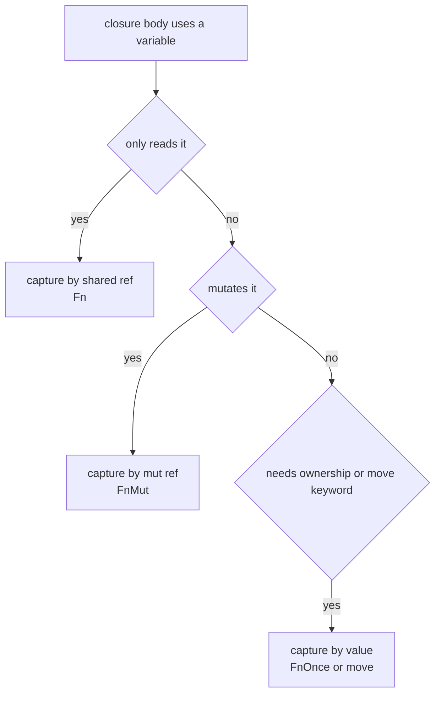
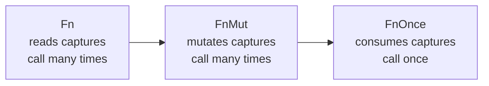

# Chapter 6 — Functions and Closures

> **What you'll learn.** How Rust functions are written and how "the last
> expression is the return value" works, why there is no function overloading or
> default arguments, what diverging functions and the unit type are, and how
> closures capture their environment — the thing C cannot do without a manual
> `void *` context.

## Functions: the shape

A Rust function looks much like a C one, but the syntax is rearranged. The keyword
is `fn`, the parameter types come *after* each name, and the return type comes
after an arrow `->`.

```rust
fn add(a: i32, b: i32) -> i32 {
    a + b
}

fn main() {
    let s = add(2, 3);
    println!("{s}");
}
```

The same idea in C:

```c
int add(int a, int b) {
    return a + b;
}
```

| Part | C | Rust |
|---|---|---|
| Keyword | (none) | `fn` |
| Parameter type | `int a` | `a: i32` |
| Return type | before the name | after `->` |
| No return value | `void f(void)` | `fn f()` (returns `()`) |
| Forward declaration | needed in a header | never needed |

> **C vs Rust.** Order does not matter in Rust. A function may call another that is
> defined later in the same file, and there are no headers or forward declarations
> (see Chapter 3 — Program Structure: Crates, Modules, and Visibility). The
> compiler reads the whole crate before checking calls.

Parameters are **always** typed. Rust never infers a parameter's type from the
call site, the way template-like guessing might. This keeps function signatures a
clear, fixed contract — exactly like a C prototype.

## Statements vs expressions

This is the single idea that surprises C programmers most, so read it slowly.

Rust splits code into two kinds of thing:

- An **expression** produces a value. `2 + 3`, `add(1, 2)`, and `x` are
  expressions.
- A **statement** performs an action and produces **no** useful value. `let x = 5;`
  is a statement.

In C, `a + b` is "an expression statement" and the value is just thrown away. In
Rust the distinction is load-bearing: **the value of a block `{ ... }` is the value
of its last expression, if that last line has no semicolon.**

```rust
fn main() {
    let y = {
        let a = 2;
        let b = 3;
        a + b          // no semicolon: this is the block's value
    };
    println!("{y}");   // prints 5
}
```

So the block evaluates to `5`, and `y` becomes `5`. The `let a = 2;` lines are
statements; the final `a + b` is the block's result.

> **Mental model.** A `{ ... }` block in Rust is like a tiny function: it runs its
> statements, then "returns" its last expression. C's blocks have no value; Rust's
> blocks do.

### The trailing semicolon changes the meaning

A semicolon turns an expression into a statement. The statement's value is `()`,
the **unit type** (more on that below). This is the most common beginner bug.

```rust
fn square(x: i32) -> i32 {
    x * x              // last expression, no semicolon: this is the return value
}
```

```rust
// COMPILE ERROR: mismatched types — expected i32, found ()
fn square_broken(x: i32) -> i32 {
    x * x;             // the semicolon makes this a statement; the block returns ()
}
// error[E0308]: expected `i32`, found `()`
```

The first version returns `i32`. The second returns `()` because the semicolon
discarded the value, and the compiler complains that `()` is not the `i32` you
promised.

> **Watch out.** A stray semicolon on the last line is the classic "why won't this
> compile?" error. If a function should return a value, its final expression must
> have **no** semicolon.

## Returning a value: no `return` needed

Because the last expression *is* the return value, you usually do not write
`return` at all. It is there for **early exit**.

```rust
fn classify(n: i32) -> &'static str {
    if n < 0 {
        return "negative";   // early exit
    }
    if n == 0 {
        return "zero";
    }
    "positive"               // the final value, no `return`, no semicolon
}

fn main() {
    println!("{}", classify(-4));
    println!("{}", classify(0));
    println!("{}", classify(7));
}
```

> **Rule of thumb.** Use the bare last expression for the normal result. Use
> `return` only to bail out early. Idiomatic Rust rarely writes `return` on the
> last line.

Because `if` is itself an expression (see Chapter 5 — Control Flow), the function
above can also be written without any `return`:

```rust
fn classify(n: i32) -> &'static str {
    if n < 0 {
        "negative"
    } else if n == 0 {
        "zero"
    } else {
        "positive"
    }
}
```

## The unit type `()` and diverging functions

A function with no `-> ...` returns the **unit type**, written `()`. Unit is a
value that carries no information — the closest C idea is `void`, but `()` is a
real value you can store and pass, not the absence of a type.

```rust
fn log(msg: &str) {        // returns ()
    println!("[log] {msg}");
}
```

Some functions never return at all. Their return type is `!`, the **never type**,
and they are called **diverging functions**. They panic, loop forever, or exit the
process.

```rust
fn fail(msg: &str) -> ! {
    panic!("fatal: {msg}");   // never returns
}

fn main() {
    let n: i32 = "42".parse().unwrap_or_else(|_| fail("not a number"));
    println!("{n}");
}
```

`std::process::exit(1)` and an infinite `loop {}` also have type `!`. The `!` type
is useful because it fits anywhere: a branch that calls `fail(...)` can sit next to
a branch that produces an `i32`, because `!` coerces to any type.

> **C vs Rust.** C marks such functions with `_Noreturn` (or
> `__attribute__((noreturn))`) as a hint. Rust's `!` is a real type the compiler
> understands and uses for flow analysis.

## No overloading, no default arguments

Two features C++ has and C does not — and Rust deliberately does not have either.

- **No function overloading.** You cannot define two functions with the same name
  and different parameter types. Each name means one function.
- **No default argument values.** You cannot write `fn f(x: i32 = 0)`.

This keeps every call unambiguous: the name plus the arguments always picks exactly
one function, with no hidden resolution rules. Here is how Rust programmers get the
same results.

**Idiomatic alternative 1 — distinct names.** Just give each variant a clear name.
The standard library does this everywhere (`new`, `with_capacity`, `from_utf8`).

```rust
struct Buffer {
    bytes: Vec<u8>,
}

impl Buffer {
    fn new() -> Buffer {
        Buffer { bytes: Vec::new() }
    }
    fn with_capacity(n: usize) -> Buffer {
        Buffer { bytes: Vec::with_capacity(n) }
    }
}
```

**Idiomatic alternative 2 — `Option` parameters.** An argument that is sometimes
"use the default" becomes an `Option<T>`. The caller passes `None` to mean
"default" (see Chapter 12 — Enums and Pattern Matching for `Option`).

```rust
fn greet(name: &str, greeting: Option<&str>) {
    let g = greeting.unwrap_or("Hello");   // default when None
    println!("{g}, {name}");
}

fn main() {
    greet("Ada", None);              // Hello, Ada
    greet("Ada", Some("Welcome"));   // Welcome, Ada
}
```

**Idiomatic alternative 3 — the builder pattern.** When a type has many optional
settings, give it a builder with one method per setting. This replaces both
overloading and default arguments cleanly (see Chapter 27 — Idioms and Style).

> **C vs Rust.** In C you also have no overloading or defaults, so you already use
> distinct names (`strncpy` vs `strcpy`) and pass extra flags by hand. Rust's
> `Option` and builders are the tidy, type-checked version of that habit.

## Function pointers

Rust has function pointers, just like C. The type is written `fn(ArgTypes) -> Ret`
— note the lowercase `fn` in a *type* position. You can store one in a variable,
pass it to a function, or return it.

```rust
fn double(x: i32) -> i32 {
    x * 2
}
fn triple(x: i32) -> i32 {
    x * 3
}

fn apply(f: fn(i32) -> i32, v: i32) -> i32 {
    f(v)
}

fn main() {
    let g: fn(i32) -> i32 = double;   // store a function pointer
    println!("{}", g(10));            // 20
    println!("{}", apply(triple, 10)); // 30
}
```

The C version is the same idea with C's harder-to-read syntax:

```c
int double_it(int x) { return x * 2; }

int apply(int (*f)(int), int v) {
    return f(v);
}

int main(void) {
    int (*g)(int) = double_it;   /* a function pointer */
    return apply(double_it, 10);
}
```

| Concept | C | Rust |
|---|---|---|
| Function pointer type | `int (*)(int)` | `fn(i32) -> i32` |
| Carries captured state | no | no (use a closure for that) |
| Can be null | yes | no (use `Option<fn(...)>`) |

> **Watch out.** A plain `fn` pointer holds **no** captured data — it is just an
> address, exactly like in C. To carry state alongside the code, you need a
> *closure*, which is next.

## Closures: functions that capture their environment

A **closure** is an anonymous function that can **capture** variables from the
scope where it is written. C has nothing like this. In C, when you pass a callback
you also pass a `void *` "context" pointer by hand, and the callback casts it back.
A Rust closure bundles that context for you, type-checked.

The syntax uses vertical bars `| |` around the parameters:

```rust
fn main() {
    let add_one = |x| x + 1;        // a closure; types are inferred
    println!("{}", add_one(41));    // 42

    let factor = 3;
    let scale = |x| x * factor;     // captures `factor` from the environment
    println!("{}", scale(10));      // 30
}
```

Notice `scale` uses `factor`, a variable from `main`. The closure "closes over"
`factor` — it captures it. The C equivalent must thread that value through a
context pointer:

```c
typedef int (*cb)(int x, void *ctx);

int scale(int x, void *ctx) {
    int factor = *(int *)ctx;
    return x * factor;
}

int main(void) {
    int factor = 3;
    cb f = scale;
    return f(10, &factor);   /* you carry the context by hand */
}
```

> **Mental model.** A closure is a small struct the compiler writes for you: it
> holds the captured variables as fields, plus the code to run. That hidden struct
> is the `void *` context you would have built by hand in C — but type-safe and
> automatic.

### Closure type inference

Closure parameter and return types are usually inferred from how the closure is
used, so you rarely write them. You *may* annotate them, and the body needs braces
if it has more than one line:

```rust
fn main() {
    let typed = |x: i32| -> i32 { x * x };
    println!("{}", typed(5));   // 25
}
```

Each closure has its own unique, unnameable type generated by the compiler. That is
why function parameters that take closures use *trait bounds* (below), not a single
concrete type.

## How a closure captures: by reference, by mut reference, by value

A closure captures each variable in the **least demanding** way that still lets the
body work. There are three modes:

1. **By shared reference (`&T`)** — the closure only reads the variable.
2. **By mutable reference (`&mut T`)** — the closure modifies the variable.
3. **By value (moves it in)** — forced with the `move` keyword, or chosen when the
   body needs ownership.

```rust
fn main() {
    // 1. Capture by shared reference: just reading.
    let name = String::from("Ada");
    let greet = || println!("Hello, {name}");
    greet();
    println!("still usable: {name}");   // name was only borrowed

    // 2. Capture by mutable reference: the closure changes `count`.
    let mut count = 0;
    let mut bump = || count += 1;       // closure must be `mut` to call it
    bump();
    bump();
    println!("count = {count}");        // 2

    // 3. Capture by value with `move`: ownership moves into the closure.
    let owned = String::from("mine");
    let consume = move || println!("took {owned}");
    consume();
    // println!("{owned}");  // would be a COMPILE ERROR: `owned` was moved
}
```



> **C vs Rust.** The borrow checker (Chapter 8 — Borrowing and References) watches
> closures too. If a closure borrows `name`, you cannot also mutate `name`
> elsewhere while the closure is alive. C gives you no such protection — a callback
> holding a pointer to a freed local is a classic crash.

### `move` and ownership

`move` forces every captured variable to be taken **by value** (moved in). You need
this when the closure must outlive the current scope — most importantly when you
hand it to another thread (see Chapter 19 — Threads and Concurrency), or return it
from a function.

```rust
fn make_counter() -> impl FnMut() -> i32 {
    let mut count = 0;
    move || {
        count += 1;       // `count` is moved into the closure and lives on
        count
    }
}

fn main() {
    let mut next = make_counter();
    println!("{}", next());   // 1
    println!("{}", next());   // 2
    println!("{}", next());   // 3
}
```

Without `move`, the closure would try to borrow `count`, which dies when
`make_counter` returns — a dangling reference, which the compiler rejects. `move`
moves `count` into the closure so it lives as long as the closure does.

### Edition 2024: disjoint field capture

Since edition 2021 (and still the rule in edition 2024), a closure captures
**only the fields it actually uses**, not the whole struct. This is called
*disjoint capture*.

```rust
struct Point {
    x: i32,
    y: i32,
}

fn main() {
    let mut p = Point { x: 1, y: 2 };
    let mut bump_x = || p.x += 1;   // captures only p.x, not all of p
    let read_y = p.y;               // reading p.y is fine; only p.x is borrowed
    bump_x();
    println!("{} {}", p.x, read_y);
}
```

> **C vs Rust.** This is finer-grained than anything C offers. The compiler tracks
> borrows down to individual struct fields, so two closures can touch different
> fields of the same struct at the same time.

## The three closure traits: `Fn`, `FnMut`, `FnOnce`

Because every closure has its own hidden type, Rust groups closures by **what they
do to their captures** using three traits. A trait is a shared interface (see
Chapter 15 — Traits). The three are nested: each one is a stricter version of the
next.

| Trait | The closure... | Can be called | Implies |
|---|---|---|---|
| `FnOnce` | consumes captures (moves them out) | once | — |
| `FnMut` | mutably borrows captures | many times | `FnOnce` |
| `Fn` | only shares (reads) captures | many times | `FnMut` + `FnOnce` |

The relationship is a hierarchy: every `Fn` is also `FnMut`, and every `FnMut` is
also `FnOnce`. So `Fn` is the most flexible to *receive* (it can do the least
harm), and `FnOnce` is the most flexible to *accept from a caller* (it asks the
least).



- A closure is `FnOnce` if it **moves a captured value out** of itself (it can run
  only once, because the value is gone after).
- It is `FnMut` if it **mutates** a capture but does not move anything out.
- It is `Fn` if it only **reads** its captures.

The compiler picks the most capable set automatically. You choose the trait only
in a function *signature*, when you say what kind of closure you accept.

## Taking closures as parameters

To accept a closure, use a trait bound. The simplest form is `impl Trait` in the
parameter position. Pick the loosest trait that your function needs.

```rust
fn call_twice(f: impl Fn()) {
    f();
    f();                 // Fn can be called many times
}

fn do_once(f: impl FnOnce() -> String) -> String {
    f()                  // FnOnce: we promise to call it at most once
}

fn main() {
    let name = String::from("Ada");
    call_twice(|| println!("hi"));

    let owned = String::from("payload");
    let result = do_once(move || owned);   // moves `owned` out, so FnOnce
    println!("{result}");
    let _ = name;
}
```

The same with an explicit generic and a `where` clause — identical meaning, useful
when the bound is long:

```rust
fn map_pair<F>(a: i32, b: i32, f: F) -> (i32, i32)
where
    F: Fn(i32) -> i32,
{
    (f(a), f(b))
}

fn main() {
    let (x, y) = map_pair(3, 4, |n| n * n);
    println!("{x} {y}");   // 9 16
}
```

> **Rule of thumb.** Accept the **least restrictive** trait you can: prefer
> `FnOnce` if you call it once, `FnMut` if you call it repeatedly and it may mutate,
> and `Fn` if it only needs to read. Accepting `Fn` rejects closures that mutate;
> accepting `FnOnce` accepts the most callers.

## Returning closures

A function can return a closure. Since the closure's real type has no name, you
return `impl Fn...` (when there is a single concrete type) or a boxed trait object
`Box<dyn Fn...>` (when the type may vary at runtime).

```rust
fn adder(n: i32) -> impl Fn(i32) -> i32 {
    move |x| x + n        // `move` so `n` lives inside the returned closure
}

fn main() {
    let add5 = adder(5);
    println!("{}", add5(10));   // 15
}
```

Use `Box<dyn Fn...>` when different branches return *different* closures, because
`impl Trait` requires one single concrete type:

```rust
fn pick(op: char) -> Box<dyn Fn(i32, i32) -> i32> {
    match op {
        '+' => Box::new(|a, b| a + b),
        _ => Box::new(|a, b| a - b),
    }
}

fn main() {
    let f = pick('+');
    println!("{}", f(2, 3));   // 5
}
```

`Box<dyn Fn...>` stores the closure on the heap and calls it through a pointer —
this is dynamic dispatch, the same cost as a C function-pointer call plus one
allocation (see Chapter 17 — Smart Pointers for `Box`).

| Return form | When to use | Cost |
|---|---|---|
| `impl Fn...` | one concrete closure type | none (static dispatch) |
| `Box<dyn Fn...>` | type varies (e.g. different match arms) | heap box + dynamic call |

## Key takeaways

- A function is `fn name(params) -> Ret { ... }`; parameters are always typed; order
  and headers do not matter.
- A block's value is its **last expression with no semicolon**. That value is the
  function's return value; `return` is only for early exit.
- A trailing semicolon turns an expression into a statement whose value is `()`,
  the unit type. This is the most common beginner mistake.
- `()` is Rust's `void`-like value; `!` (the never type) marks diverging functions
  that panic, loop, or exit.
- There is **no overloading and no default arguments**. Use distinct names,
  `Option` parameters, or the builder pattern (Chapter 27).
- Function pointers have type `fn(...) -> ...` and carry no state, like in C.
- **Closures** capture their environment by shared reference (`Fn`), mutable
  reference (`FnMut`), or by value (`move`/`FnOnce`); the compiler picks the
  loosest mode. Edition 2024 captures individual struct fields.
- Accept closures with `impl Fn`/`FnMut`/`FnOnce` bounds; return them with
  `impl Fn...` or `Box<dyn Fn...>`.

## Watch out (gotchas for C programmers)

- **A trailing semicolon swallows the return value.** `x * x;` returns `()`, not
  the number. Drop the semicolon on the final expression.
- **`move` moves captures in.** After a `move` closure captures a non-`Copy` value
  like a `String`, you cannot use that value outside the closure anymore.
- **Pick the right closure trait.** Accepting `Fn` forbids closures that mutate;
  accepting `FnMut` forbids ones that move captures out. Take the loosest one your
  function actually needs.
- **No overloading or default arguments.** Do not try to define two functions with
  the same name; use distinct names or `Option` parameters.
- **A plain `fn` pointer carries no state.** If your callback needs context, use a
  closure, not a bare function pointer.
- **A closure borrowing a local cannot outlive it.** Return it with `move` so it
  owns what it needs, or the borrow checker will reject the dangling reference.

## Interview questions

**Q: In Rust, how does a function return a value without the `return` keyword?**
A: The last expression in the function body, written with no trailing semicolon, is
the function's return value. A block evaluates to its final expression. `return` is
only needed for an early exit before that final expression.

**Q: What is the difference between a statement and an expression, and why does a
trailing semicolon matter?**
A: An expression produces a value; a statement performs an action and produces `()`.
Adding a semicolon turns an expression into a statement, discarding its value. On a
function's last line that changes the return value from the computed value to `()`,
which usually causes a type-mismatch error.

**Q: What are `Fn`, `FnMut`, and `FnOnce`, and how do you choose one?**
A: They are traits describing how a closure uses its captures. `Fn` only reads
them and can be called many times; `FnMut` mutably borrows them and can be called
many times; `FnOnce` may move captures out and can be called once. They form a
hierarchy (`Fn` ⊂ `FnMut` ⊂ `FnOnce`). In a parameter, accept the loosest one your
code needs.

**Q: How does a Rust closure differ from a C function pointer?**
A: A C function pointer is just an address and carries no data; to pass state you
pass a separate `void *` context by hand. A Rust closure captures variables from
its environment automatically, storing them in a compiler-generated struct, and the
capture is type-checked and borrow-checked.

**Q: When do you need the `move` keyword on a closure?**
A: When the closure must own its captures rather than borrow them — for example when
it is returned from a function or sent to another thread, so it must outlive the
scope where the captured variables were defined. `move` forces every capture to be
taken by value.

## Try it

1. Write `fn cube(x: i32) -> i32` two ways: once with `return x * x * x;` and once
   with `x * x * x`. Add a semicolon to the second and read the `E0308` error.
2. Write `make_counter` from this chapter and call the returned closure several
   times. Remove the `move` keyword and read the compiler's explanation.
3. Write a function `fn apply<F: Fn(i32) -> i32>(f: F, v: i32) -> i32`. Pass it both
   a named function and a closure, and confirm both work.
