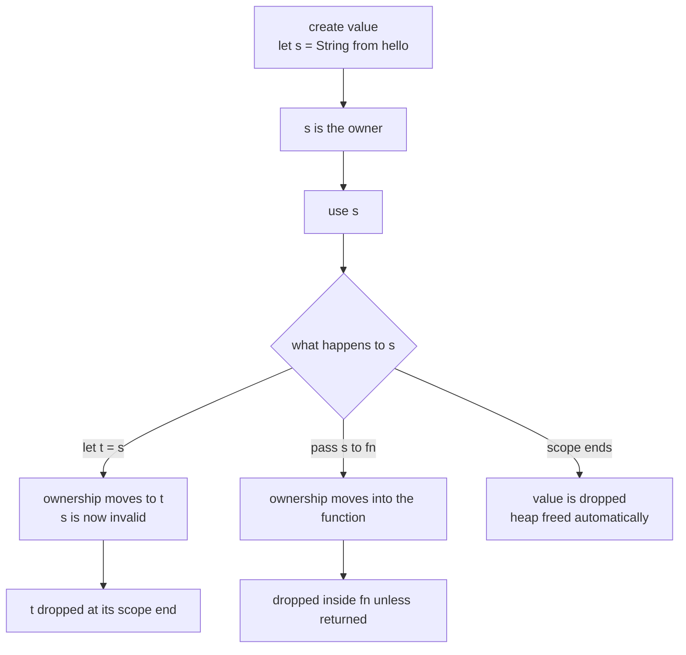

# Chapter 7 — Ownership and Moves

> **What you'll learn.** The single idea that makes Rust different from C:
> ownership. You will learn the three ownership rules, how values are dropped
> (freed) automatically and deterministically, what a *move* is and why it
> invalidates the old name, the difference between `Copy` and `Clone`, and how
> ownership flows through function calls.

This is the heart of the book. Take your time. Almost everything else in Rust —
borrowing, lifetimes, threads, smart pointers — follows from the rules in this one
chapter.

## The problem ownership solves

In C, *you* manage memory by hand. You call `malloc` to get heap memory and `free`
to give it back. Nothing checks that you do this correctly. The result is a
familiar list of bugs:

```c
char *p = malloc(64);
free(p);
strcpy(p, "oops");   /* use-after-free: undefined behavior */
free(p);             /* double-free: undefined behavior */
```

Each of these is undefined behavior and a common source of crashes and security
holes. C trusts you to never make these mistakes. Across a large codebase, nobody
ever fully succeeds.

Rust takes a different bet: a small set of rules, checked by the compiler, that
make these bugs **impossible to write** in safe code — with no garbage collector
and no runtime cost. Those rules are *ownership*.

> **Mental model.** Ownership is the compiler doing the `free` for you, at exactly
> the right moment, and refusing to compile any program where the timing would be
> wrong.

## The three rules of ownership

Memorize these. Everything else is a consequence.

1. **Each value has exactly one owner** — a variable that is responsible for it.
2. **There is only one owner at a time.** Ownership can be transferred (a *move*),
   but it is never shared by two owners.
3. **When the owner goes out of scope, the value is dropped** — its memory and
   other resources are released automatically.

A **scope** is the region between `{` and `}` where a variable is valid, just like
in C. The difference is what happens at the closing `}`.

```rust
fn main() {
    let s = String::from("hello");   // s owns a heap-allocated string
    println!("{s}");
}                                    // scope ends: s is dropped, heap freed here
```

`String::from("hello")` allocates memory on the heap to hold the text (like
`malloc` + `strcpy`). You never call `free`. When `s` goes out of scope at the
closing brace, Rust automatically releases that memory. This automatic release is
called a **drop**.

> **C vs Rust.** In C you pair every `malloc` with a `free` by hand, and bugs come
> from getting the pairing wrong. In Rust the `free` is attached to the owner going
> out of scope, so it always happens exactly once, at a place the compiler can
> prove.

## Drop: automatic, deterministic cleanup (RAII)

When a value is dropped, Rust runs its cleanup code. For a `String` that means
freeing the heap buffer. For a file handle it means closing the file. For a lock it
means unlocking. This pattern — tie a resource's lifetime to a variable's scope —
is called **RAII** (Resource Acquisition Is Initialization). C++ programmers know
it as a destructor; C programmers know it as "the cleanup I always forget in the
error path."

The cleanup is **deterministic**: it happens at a known point (the end of scope),
not "sometime later" like a garbage collector. You can see it by implementing the
`Drop` trait, which lets you run code when a value is dropped.

```rust
struct Guard {
    name: &'static str,
}

impl Drop for Guard {
    fn drop(&mut self) {
        println!("dropping {}", self.name);
    }
}

fn main() {
    let _first = Guard { name: "first" };
    let _second = Guard { name: "second" };
    println!("end of main");
}
```

This prints:

```
end of main
dropping second
dropping first
```

Two things to notice. First, the drops happen at the end of `main`, automatically.
Second, the drop order is the **reverse** of declaration order: `second` is dropped
before `first`. This is the same last-in-first-out order C++ uses for destructors,
and it matters when one value depends on another.

> **C vs Rust.** This is the cleanup you would write in a C `goto fail:` chain at
> the end of a function — close the file, free the buffer, unlock the mutex — except
> Rust generates it for you and runs it on *every* exit path, including early
> returns and panics. You cannot forget it.

### Dropping early with `drop(x)`

Sometimes you want to release a resource before the end of scope (for example, to
unlock a mutex sooner). You cannot call the `drop` *method* directly, but you call
the free function `std::drop`, which is in the prelude:

```rust
struct Guard {
    name: &'static str,
}

impl Drop for Guard {
    fn drop(&mut self) {
        println!("dropping {}", self.name);
    }
}

fn main() {
    let g = Guard { name: "early" };
    println!("before drop");
    drop(g);                      // g is dropped right here
    println!("after drop");
    // g is gone; using it now would be a compile error
}
```

This prints `before drop`, then `dropping early`, then `after drop`. The function
`drop` simply takes ownership of `g` and lets it go out of scope immediately. The
compiler then knows `g` is gone and forbids any later use — which is our next topic.

## Move semantics

Here is where Rust and C part ways most sharply. Consider this C code, which is
fine:

```c
char *a = strdup("hello");
char *b = a;          /* a and b point at the SAME buffer */
/* both a and b are usable; both point at one allocation */
```

In C, `b = a` copies the pointer. Now two pointers alias one buffer, and you must
remember to free it exactly once. The equivalent Rust does something different:

```rust
// COMPILE ERROR: borrow of moved value: `a`
fn main() {
    let a = String::from("hello");
    let b = a;            // ownership MOVES from a to b
    println!("{a}");      // error[E0382]: borrow of moved value: `a`
    println!("{b}");
}
```

When you write `let b = a;` for a type like `String`, ownership **moves** from `a`
to `b`. After the move, `a` is considered *uninitialized* — the compiler will not
let you use it. There is now exactly one owner (`b`), so the buffer is freed exactly
once, when `b`'s scope ends. Double-free is impossible.

The fix, if you really wanted to keep using `a`, is to use `b` instead, or to make
a real copy with `.clone()` (below).

> **Mental model.** Think of ownership like a single physical key to a room. When
> you give the key to someone else, *you* no longer have it. A move hands over the
> key; the old variable is left empty-handed.

### What actually moves: the picture

A `String` is a small three-word **header** stored on the stack: a pointer to the
heap buffer, a length, and a capacity. The text itself lives on the heap. A move
copies the *header* (three machine words) and marks the source invalid. It does
**not** copy the heap text. This is cheap — a few bytes — no matter how long the
string is.

```
Before the move:  let a = String::from("hello");

   stack                         heap
  +-----------------+
a | ptr   ----------|---------> +---+---+---+---+---+
  | len = 5         |           | h | e | l | l | o |
  | cap = 5         |           +---+---+---+---+---+
  +-----------------+

After:  let b = a;   (header copied to b; a invalidated)

   stack                         heap
  +-----------------+
a | (invalid)       |            +---+---+---+---+---+
  |                 |       +--> | h | e | l | l | o |
  +-----------------+       |    +---+---+---+---+---+
b | ptr   ----------|-------+
  | len = 5         |        (heap data NOT copied)
  | cap = 5         |
  +-----------------+
```

Only one header now points at the heap buffer, so there is exactly one owner. When
`b` is dropped, that single buffer is freed once.

> **C vs Rust.** In C, `b = a` also copies just the pointer header — but C lets you
> keep using *both* `a` and `b`, which is exactly how double-frees and
> use-after-free happen. Rust copies the same bytes but then **invalidates the
> source**, so aliasing-then-freeing-twice cannot occur.

### Why "use after move" is a compile error

The error code is **E0382**. The compiler tracks, for every variable, whether it
currently owns a value. After a move the source is "moved-out", and reading it is
rejected. This is a compile-time check — there is zero runtime cost and no flag
stored at runtime.

```rust
// COMPILE ERROR: use of moved value: `v`
fn main() {
    let v = vec![1, 2, 3];
    let w = v;               // Vec moved into w
    println!("{}", v.len()); // error[E0382]: borrow of moved value: `v`
    let _ = w;
}
```

The same rule applies to `String`, `Vec<T>`, `Box<T>`, and every type that owns a
heap resource. These are **non-`Copy`** types: assigning or passing them moves them.

## `Copy` types: bit-for-bit duplication

Not every type moves. Small, simple values that live entirely on the stack are
**`Copy`**: assigning them makes a bit-for-bit duplicate, and *both* names stay
usable. This matches C's behavior for plain values.

```rust
fn main() {
    let x = 5;
    let y = x;            // i32 is Copy: x is COPIED, not moved
    println!("{x} {y}");  // both still valid: prints 5 5
}
```

There is no heap buffer to worry about, so duplicating the bytes is harmless and
cheap. The types that are `Copy` include:

- All integer types (`i32`, `u64`, `usize`, ...).
- Floating-point types (`f32`, `f64`).
- `bool` and `char`.
- Tuples and arrays **if every element is `Copy`** (e.g. `(i32, bool)`).
- Shared references `&T` (copying a reference is fine; both can read).

A type can be `Copy` only if it owns no resource that needs cleanup. That is why
`String` and `Vec<T>` are **not** `Copy`: duplicating their header bytes would
create two owners of one heap buffer — exactly the aliasing Rust forbids.

| Type | `Copy`? | `let b = a;` does | After, is `a` usable? |
|---|---|---|---|
| `i32`, `f64`, `bool`, `char` | yes | bit copy | yes |
| `&T` (shared reference) | yes | bit copy | yes |
| `(i32, i32)` | yes | bit copy | yes |
| `String`, `Vec<T>`, `Box<T>` | no | move | no |
| any type with a `Drop` impl | no | move | no |

> **Mental model.** `Copy` means "this value is just bytes; duplicating the bytes
> is a perfect, independent copy." A `String` is not just bytes — it owns a heap
> buffer — so copying the bytes alone would be wrong.

## `Clone`: an explicit, possibly expensive copy

When you *do* want an independent duplicate of a non-`Copy` value, you ask for one
explicitly with `.clone()`. For a `String` or `Vec`, this allocates a new heap
buffer and copies the contents — a *deep copy*.

```rust
fn main() {
    let a = String::from("hello");
    let b = a.clone();        // deep copy: new heap buffer with its own "hello"
    println!("{a} {b}");      // BOTH usable: a was not moved
}
```

After `clone`, `a` and `b` are two separate owners of two separate buffers. Each is
freed once, when its own owner goes out of scope.

The key difference from `Copy`: **`Clone` is explicit and can be expensive.** A move
or a `Copy` is always cheap (a few stack bytes). A `clone` may allocate and copy a
megabyte. Rust makes you write `.clone()` so the cost is visible in the code, never
hidden.

> **Rule of thumb.** Do not reach for `.clone()` just to silence a move error. Most
> of the time the right answer is to *borrow* the value instead (Chapter 8 —
> Borrowing and References). Clone when you genuinely need a second independent
> copy.

### Deriving `Clone` and `Copy`

For your own types, you opt in with `#[derive(...)]`, which asks the compiler to
generate the trait implementation:

```rust
#[derive(Clone, Copy, Debug)]
struct Point {
    x: i32,
    y: i32,
}

#[derive(Clone, Debug)]
struct Record {
    name: String,        // String is not Copy, so Record cannot be Copy
    points: Vec<Point>,
}

fn main() {
    let p = Point { x: 1, y: 2 };
    let q = p;                       // Copy: p still usable
    println!("{p:?} {q:?}");

    let r = Record { name: "a".to_string(), points: vec![p] };
    let s = r.clone();               // explicit deep copy
    println!("{r:?} {s:?}");
}
```

A struct can derive `Copy` only if **every** field is `Copy`. `Record` contains a
`String` and a `Vec`, so it can be `Clone` but not `Copy`. `Point` contains only
`i32` fields, so it can be both.

## Ownership and functions

Passing a value to a function follows the same rules as assignment. For a non-`Copy`
type, calling `f(s)` **moves** `s` into `f`. After the call, `s` is gone in the
caller — `f` now owns it and will drop it at the end of `f` unless it hands
ownership back.

```rust
fn consume(s: String) {
    println!("consuming {s}");
}                                 // s dropped here

fn main() {
    let text = String::from("hello");
    consume(text);                // text MOVED into consume
    // println!("{text}");        // COMPILE ERROR: text was moved
}
```

For a `Copy` type, the value is copied in and the original stays usable:

```rust
fn square(n: i32) -> i32 {
    n * n
}

fn main() {
    let x = 4;
    let y = square(x);   // i32 is Copy: x is copied, still usable
    println!("{x} {y}"); // prints 4 16
}
```

### Returning ownership

A function can also **give** ownership by returning a value. The return value moves
out of the function and into the caller.

```rust
fn make_greeting(name: &str) -> String {
    format!("Hello, {name}")   // ownership of the new String moves to the caller
}

fn main() {
    let g = make_greeting("Ada");   // g now owns the String
    println!("{g}");
}                                   // g dropped here
```

### The clumsy "give and take back" pattern

Suppose a function needs to *use* a `String` but the caller wants to keep it
afterward. With only moves, you must pass ownership in and then return it, threading
the value back out by hand:

```rust
fn count_chars(s: String) -> (String, usize) {
    let n = s.chars().count();
    (s, n)                       // hand the String back, plus the answer
}

fn main() {
    let text = String::from("hello");
    let (text, n) = count_chars(text);   // take ownership back
    println!("{text} has {n} chars");
}
```

This works, but it is awkward. Every function that merely *looks at* a value would
have to return it. C never makes you do this, because in C you just pass a pointer
and the caller still owns the data.

Rust's real answer is the same idea — pass a reference — but checked by the
compiler. You **borrow** the value instead of moving it:

```rust
fn count_chars(s: &String) -> usize {   // borrow: read without taking ownership
    s.chars().count()
}

fn main() {
    let text = String::from("hello");
    let n = count_chars(&text);          // lend a reference; text stays owned here
    println!("{text} has {n} chars");    // text still usable
}
```

This is the natural, idiomatic way, and it is the subject of the next chapter.
Borrowing lets many parts of your program read (or one part write) a value without
moving it, while the compiler guarantees no dangling pointers.

> **Rule of thumb.** Move when a function should *take over* a value's lifetime.
> Borrow (Chapter 8 — Borrowing and References) when it only needs to look at or
> temporarily modify the value. You will borrow far more often than you move.

## Putting it together: the lifecycle of an owned value



Every owned value walks this path. It is created with one owner; ownership may move
(by assignment or by being passed to a function); and wherever the final owner's
scope ends, the value is dropped exactly once. The compiler proves there is always
exactly one owner and exactly one drop.

## Key takeaways

- **Three rules:** every value has exactly one owner; only one owner at a time; when
  the owner leaves scope the value is **dropped** (freed) automatically.
- Dropping is **deterministic** — at the end of scope, in reverse declaration order
  — and runs cleanup (`Drop`), Rust's version of RAII / a destructor. C's
  `malloc`/`free` is manual; Rust's free is automatic and always correct.
- Use `drop(x)` to release a value early.
- For non-`Copy` types (`String`, `Vec`, `Box`), assignment and passing **move**
  ownership and invalidate the source. Using it afterward is compile error
  **E0382**. A move copies only the small stack header, not the heap data.
- `Copy` types (scalars, `bool`, `char`, references, and aggregates of `Copy`
  fields) are bit-copied; both names stay usable.
- `.clone()` makes an explicit, possibly deep and expensive copy. Derive traits with
  `#[derive(Clone, Copy)]`; a type can be `Copy` only if all fields are `Copy` and
  it has no `Drop`.
- Passing a value to a function moves it in; returning hands ownership back. The
  clumsy give-and-take-back pattern motivates **borrowing** (Chapter 8).

## Watch out (gotchas for C programmers)

- **A move invalidates the source.** Unlike C's `b = a` (where both pointers stay
  usable), after a Rust move the old name is dead; using it is a compile error.
- **`Copy` vs move is decided by the type, not the syntax.** `let b = a;` copies an
  `i32` but moves a `String`. Know which types are `Copy`.
- **`.clone()` is explicit and can be costly.** Do not sprinkle it to silence the
  borrow checker; prefer borrowing. Cloning a big `Vec` allocates and copies all of
  it.
- **`Drop` runs at scope end, deterministically.** There is no garbage collector and
  no delay. Order is reverse of declaration — relevant when one value depends on
  another.
- **You cannot move out of something you only borrowed.** If you have a `&T` (a
  reference), you may read it but not move the value out — that would leave the real
  owner with a hole. (Chapter 8 covers references in full.)
- **Passing a non-`Copy` value to a function gives it away.** If you still need the
  value afterward, borrow it with `&` instead of passing it by value.

## Interview questions

**Q: State the three rules of ownership.**
A: Each value has exactly one owner; there is only one owner at a time (ownership
can move but is never shared); and when the owner goes out of scope the value is
dropped — its memory and resources released automatically.

**Q: What is a "move," and why can you not use the source variable afterward?**
A: For a non-`Copy` type, assigning or passing a value transfers ownership to the
destination and marks the source as uninitialized. Only the new owner may use or
drop the value, which guarantees a single owner and exactly one free. Using the
moved-from variable is compile error E0382.

**Q: What is the difference between `Copy` and `Clone`?**
A: `Copy` is an implicit, cheap, bit-for-bit duplication for simple stack-only
types; both the original and the copy stay usable. `Clone` is an explicit copy you
request with `.clone()`; it can be deep and expensive (e.g. allocating a new heap
buffer for a `String`). `Copy` types are always also `Clone`.

**Q: How does Rust free memory without a garbage collector, and when does it happen?**
A: Through ownership and the `Drop` trait (RAII). When a value's owner goes out of
scope, the compiler inserts a call to drop it, freeing its heap memory and other
resources. This is deterministic — it happens at the closing brace of the owning
scope, in reverse order of declaration — with no runtime collector.

**Q: Why does `String` move but `i32` copy on assignment?**
A: `i32` is a small value that lives entirely on the stack and owns no resource, so
duplicating its bytes is a perfect independent copy — it is `Copy`. `String` owns a
heap buffer; copying just its header bytes would create two owners of one buffer,
risking a double-free. So `String` is not `Copy` and assignment moves it instead.

**Q: Why is the "take ownership and return it" pattern awkward, and what is the fix?**
A: A function that only needs to read a value would have to take ownership and then
return it so the caller can keep using it, threading the value in and out by hand.
The fix is borrowing: pass a reference (`&T` or `&mut T`) so the function can use the
value without owning it, and the caller keeps ownership (Chapter 8).

## Try it

1. Implement `Drop` for a small struct that prints in `drop`. Create three of them
   and watch them drop in reverse order at the end of `main`. Then `drop()` one
   early and see the order change.
2. Write `let a = String::from("hi"); let b = a; println!("{a}");` and read the full
   E0382 message — notice it suggests `.clone()`.
3. Change `a` to an `i32` and confirm the same code now compiles, because `i32` is
   `Copy`.
4. Write a function that takes a `String` by value, then rewrite it to borrow with
   `&String`, and observe that the caller keeps the value in the second version.
