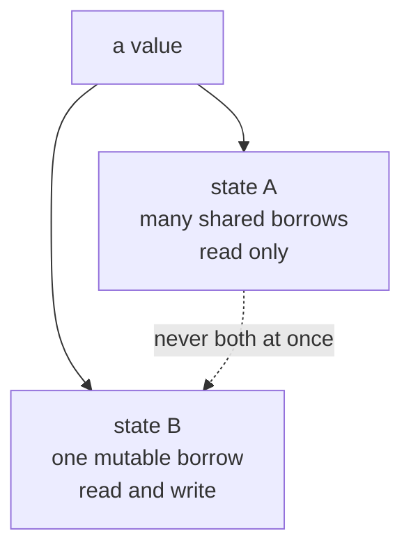

# Chapter 8 — Borrowing and References

> **What you'll learn.** How to let code use a value without taking ownership of
> it, using references (`&T` and `&mut T`). You will learn the two borrow rules —
> "aliasing XOR mutation" — why they exist, and how the borrow checker enforces
> them. You will see how Rust references differ from C pointers: never null,
> always valid, checked at compile time.

In Chapter 7 — Ownership and Moves you saw that every value has one owner, and
that assigning or passing a value can *move* it. Moving is safe, but it is also
heavy: if a function had to take ownership of every value it touched, you would
spend all day moving things back and forth.

Borrowing fixes this. A **borrow** lets a function look at, or change, a value
*without* taking ownership. The owner keeps the value; the borrower gets a
temporary, checked pointer to it. This is the everyday way Rust code passes data
around.

> **Mental model.** Ownership is lending someone your car for good — they now own
> it. Borrowing is lending it for the afternoon — they drive it, then give it
> back, and it was yours the whole time.

## References: `&T` and `&mut T`

A **reference** is a value that points to another value without owning it. You
make one with the `&` operator. There are two kinds:

- `&T` — a **shared reference** (also called an immutable borrow). You may read
  the value through it, but not change it. You may have many of these at once.
- `&mut T` — a **mutable reference** (also called an exclusive borrow). You may
  read *and* change the value through it. You may have only one at a time.

A reference is a real pointer at the machine level — the same size as a C pointer
(`usize`, the machine word). The difference is what the compiler guarantees about
it, not how it is represented in memory.

```rust
fn main() {
    let x = 10;
    let r: &i32 = &x; // r borrows x (shared)
    println!("x is {x}, r points to {}", *r);
}
```

> **C vs Rust.** `&x` looks exactly like C's "address of" operator, and at runtime
> it *is* a pointer to `x`. The difference is the type system: a Rust `&i32` is
> guaranteed to point at a live, initialized `i32`, and the compiler proves it. A
> C `int *` carries no such promise.

### Dereferencing with `*`

The `*` operator follows a reference to the value it points at — the same as in
C. You use it to read or write through the reference.

```rust
fn main() {
    let mut n = 5;
    let r = &mut n; // exclusive borrow of n
    *r += 1; // change n through the reference
    println!("{n}"); // prints 6
}
```

In practice you rarely write `*` by hand. When you call a method, Rust inserts the
dereference for you. This is called **auto-deref**: `point.length()` works whether
`point` is a `Point`, a `&Point`, or a `&&Point` — the compiler adds as many `*`
as needed. (Methods come in Chapter 11 — Structs and Methods.)

## Borrowing in functions

The most common use of references is passing data to a function. Compare the two
ways of giving a `String` to a function.

Taking ownership (a move) — the caller loses the value:

```rust
// COMPILE ERROR: borrow of moved value: `s`
fn print_len(s: String) {
    println!("{}", s.len());
} // s is dropped here

fn main() {
    let s = String::from("hello");
    print_len(s); // s MOVES into the function
    println!("{s}"); // error[E0382]: s was moved away
}
```

Borrowing instead — the caller keeps the value:

```rust
fn print_len(s: &String) {
    println!("{}", s.len()); // read through the shared reference
}

fn main() {
    let s = String::from("hello");
    print_len(&s); // lend s; ownership stays in main
    println!("{s}"); // fine: s is still ours
}
```

To let a function change the value, pass `&mut`. The binding must be `mut`, and
you write `&mut` at the call site too, so the change is visible at a glance.

```rust
fn push_world(s: &mut String) {
    s.push_str(", world"); // change the caller's String in place
}

fn main() {
    let mut s = String::from("hello"); // must be `mut` to borrow mutably
    push_world(&mut s);
    println!("{s}"); // prints "hello, world"
}
```

> **C vs Rust.** This is the Rust version of passing a pointer in C. `&String` is
> like `const char *` (read only), and `&mut String` is like `char *` (you may
> write). The difference: C does not enforce `const`, and nothing stops two
> writable pointers from aliasing the same buffer. Rust enforces both.

## The borrow rules

Here are the two rules at the center of the whole language. Memorize them.

1. At any given time, for a given value, you may have **either**:
   - any number of shared references (`&T`), **or**
   - exactly one mutable reference (`&mut T`)

   but **never both at once**.
2. A reference must **never outlive** the value it points to.

People summarize rule 1 as **"aliasing XOR mutation"**: you may have aliasing
(many readers) or mutation (one writer), but not both at the same time. ("XOR"
means exactly one of the two, never both.)



### Why these rules exist

These rules are not bureaucracy. They prevent two whole classes of bug that C
programmers chase for hours.

**Data races.** If two pointers can write the same memory at the same time, or one
writes while another reads, you have a data race. Aliasing XOR mutation makes that
impossible: a writer is always alone. This is the foundation of Rust's "fearless
concurrency" (Chapter 19 — Threads and Concurrency).

**Invalidated pointers.** This is the one that bites C programmers most. Consider
a vector that grows. When a `Vec` runs out of capacity, it allocates a bigger
buffer and copies the elements over — exactly like `realloc`. Any pointer into the
old buffer is now dangling.

```c
/* C: classic dangling-pointer bug */
int *p = &vec.data[0];   /* pointer into the buffer */
vec_push(&vec, 42);      /* may realloc -> old buffer freed */
printf("%d\n", *p);      /* use-after-free: undefined behavior */
```

Rust rejects the equivalent at compile time. `push` needs `&mut` on the vector,
but `first` is a live `&` borrow into it — aliasing XOR mutation forbids both:

```rust
// COMPILE ERROR: cannot borrow `v` as mutable because it is also borrowed as immutable
fn main() {
    let mut v = vec![1, 2, 3];
    let first = &v[0]; // shared borrow into the buffer
    v.push(4); // error[E0502]: needs &mut while `first` is live
    println!("{first}"); // `first` would be dangling after a realloc
}
```

The borrow checker stops the bug before the program runs. In C, you find it later
with a crash or a security report.

## The borrow checker in action

The **borrow checker** is the part of the compiler that enforces the two rules. It
tracks, for every reference, the region of code where it is used, and checks that
no two borrows conflict.

### Cannot mix `&` and `&mut`

You cannot take a `&mut` while a `&` is still in use (this is error E0502):

```rust
// COMPILE ERROR: cannot borrow `s` as mutable because it is also borrowed as immutable
fn main() {
    let mut s = String::from("hi");
    let r = &s; // shared borrow starts
    s.push('!'); // error[E0502]: needs &mut while `r` is live
    println!("{r}"); // `r` used here, so the shared borrow is still alive
}
```

### Cannot have two `&mut`

You cannot have two mutable references to the same value at once (error E0499):

```rust
// COMPILE ERROR: cannot borrow `s` as mutable more than once at a time
fn main() {
    let mut s = String::from("hi");
    let a = &mut s;
    let b = &mut s; // error[E0499]: second &mut while `a` is live
    a.push('!');
    b.push('?');
}
```

### Non-lexical lifetimes: a borrow ends at its last use

A borrow does **not** last until the end of the enclosing block. It ends at its
**last use**. This rule is called **NLL** (non-lexical lifetimes). It makes the
two examples above easy to fix: just finish using the first borrow before starting
the next.

```rust
fn main() {
    let mut s = String::from("hi");

    let r = &s; // shared borrow starts
    println!("{r}"); // ...and ends here, at its last use

    s.push('!'); // fine now: no live shared borrow

    let a = &mut s; // a fresh exclusive borrow
    a.push('?'); // last use of a
    println!("{s}"); // fine: a is done
}
```

> **Mental model.** A borrow is alive only between the `&` and the last line that
> uses it. Think of it as a short window, not a whole scope. Once the window
> closes, the value is free to be borrowed again — even differently.

```
time ->

  &s borrow:   [---- used ----]
  &mut s:                        [---- used ----]
                                 ^ allowed: the first window already closed
```

## Dangling references are impossible

Rule 2 says a reference must not outlive its value. The classic C mistake is
returning a pointer to a local variable or local buffer. C compilers may warn, but
they will build it, and the result is undefined behavior:

```c
/* C: returns a pointer to a destroyed local buffer */
char *make_greeting(const char *name) {
    char buf[64];
    snprintf(buf, sizeof buf, "Hello, %s", name);
    return buf;   /* buf dies when the function returns; pointer dangles */
}
```

The Rust equivalent simply does not compile (error E0515). Here `make_greeting`
builds a new `String` in a local variable and tries to hand back a reference into
it:

```rust
// COMPILE ERROR: cannot return reference to local variable `s`
fn make_greeting(name: &str) -> &str {
    let s = format!("Hello, {name}");
    s.as_str() // error[E0515]: returns a reference to data owned by this function
}

fn main() {
    let g = make_greeting("Ada");
    println!("{g}");
}
```

The return type `&str` borrows from the input `name` (the compiler infers this; see
Chapter 9 — Lifetimes), but the body returns a reference into `s`, a local that is
dropped when the function ends. The fix is to return the **owned** value, moving it
to the caller, instead of a reference into a local:

```rust
fn make_greeting(name: &str) -> String {
    format!("Hello, {name}") // move the new String out to the caller
}

fn main() {
    let g = make_greeting("Ada");
    println!("{g}"); // prints "Hello, Ada"
}
```

> **C vs Rust.** In C, "do not return the address of a local" is a rule *you* must
> remember. In Rust the compiler proves it for you. When a function returns a
> reference that the compiler cannot tie to a still-living value, you get a clear
> error instead of a crash months later. The machinery that lets a function return
> a reference safely — by naming which input it comes from — is the subject of
> Chapter 9 — Lifetimes.

## References vs C pointers

References look like pointers and compile to pointers, but the guarantees are very
different.

| Property | C pointer (`T *`) | Rust reference (`&T` / `&mut T`) |
|---|---|---|
| Can be null | Yes (`NULL`) | No, never |
| Can dangle (point at freed/dead memory) | Yes | No, the compiler prevents it |
| Can be uninitialized | Yes | No, must point at a live value |
| Multiple writers to same data | Allowed | Forbidden (one `&mut` at a time) |
| `const`-ness enforced | No (advisory) | Yes (`&T` cannot write) |
| Pointer arithmetic | Yes | No (use slices and indices) |
| Checked by the compiler | No | Yes (the borrow checker) |

> **Mental model.** A C pointer is a raw address with no promises. A Rust `&T` is
> "a valid, read-only view of a `T` that is guaranteed to stay alive while I hold
> it." A `&mut T` is the same, but exclusive and writable. The compiler keeps both
> promises so you do not have to.

> **Deep dive.** Rust *does* have raw pointers, `*const T` and `*mut T`, which are
> exactly C pointers: nullable, unchecked, no borrow rules. You can only
> dereference them inside an `unsafe` block. They exist for FFI and low-level code
> (Chapter 25 — Unsafe and FFI). In normal Rust you never need them.

## A preview: `&self` and `&mut self`

When you write methods on a type (Chapter 11 — Structs and Methods), the same
borrowing rules apply to the receiver. A method that only reads takes `&self` (a
shared borrow of the value), and one that changes the value takes `&mut self` (an
exclusive borrow). It is the same `&` / `&mut` distinction, applied to the value
the method is called on.

```rust
struct Counter {
    n: i32,
}

impl Counter {
    fn get(&self) -> i32 {
        self.n // reads only: shared borrow
    }
    fn bump(&mut self) {
        self.n += 1; // changes self: exclusive borrow
    }
}

fn main() {
    let mut c = Counter { n: 0 };
    c.bump();
    println!("{}", c.get()); // prints 1
}
```

## Key takeaways

- A **reference** lets code use a value without owning it. `&T` is a shared
  (read-only) borrow; `&mut T` is an exclusive (read-write) borrow.
- The **borrow rules**: either many `&T` *or* exactly one `&mut T`, never both at
  once; and a reference must never outlive its value. Summary: **aliasing XOR
  mutation**.
- These rules prevent **data races** and **invalidated-pointer** bugs (such as a
  pointer into a `Vec` that then reallocates) at compile time.
- A borrow ends at its **last use**, not at the end of the block (non-lexical
  lifetimes), so code after it can borrow again.
- Returning a reference to a local variable **fails to compile** (E0515). In C
  that same code is a classic undefined-behavior bug.
- To take a `&mut`, the binding must be declared `mut`.
- Rust references are **never null, never dangling, always valid**, and checked by
  the compiler — unlike C pointers.

## Watch out (gotchas for C programmers)

- **No `&mut` while a `&` is live.** You cannot mutate through one path while
  another path is reading (E0502). End the shared borrow first.
- **Only one `&mut` at a time** (E0499). Two writable references to the same value
  are forbidden, even in single-threaded code.
- **A borrow's life ends at its last use, not its scope.** If the compiler
  complains, moving the last use earlier (or into a smaller block) often fixes it.
- **You cannot return a reference to a local variable** (E0515). Return the value
  by move instead, or borrow from an input (Chapter 9 — Lifetimes).
- **The binding must be `mut` to borrow `&mut`.** `let s = ...; &mut s` fails;
  write `let mut s = ...`.
- **`&` is "address of" *and* a type constructor.** `&T` in a type position means
  "reference to `T`"; `&x` in an expression means "borrow `x`". Same symbol, two
  roles.

## Interview questions

**Q: What are the two borrow rules in Rust?**
A: First, for a given value you may have either any number of shared references
(`&T`) or exactly one mutable reference (`&mut T`), but never both at the same
time. Second, a reference must never outlive the value it points to. Together they
are summarized as "aliasing XOR mutation."

**Q: Why does Rust forbid a `&mut` while a `&` is alive?**
A: To prevent data races and invalidated pointers. If a value could be mutated
while another reference reads it, a write could move or free the underlying data
(for example, a `Vec` reallocating) and leave the reader dangling. Allowing only
one writer, and no readers while it writes, makes that impossible.

**Q: How does a Rust reference differ from a C pointer?**
A: A reference is guaranteed non-null, never dangling, always pointing at a live
initialized value, and subject to the borrow rules — all checked by the compiler.
A C pointer has none of these guarantees: it can be null, dangling, or
uninitialized, and nothing prevents two writable pointers to the same memory.

**Q: What does "non-lexical lifetimes" mean, and why does it matter?**
A: A borrow's lifetime ends at its last use, not at the end of the enclosing
block. This lets you start a new (even conflicting) borrow as soon as the previous
one is done being used, so much ordinary code compiles without needing to add
extra scopes.

**Q: Why does returning a reference to a local variable fail to compile, and what
is the C equivalent?**
A: The local is dropped when the function returns, so the reference would dangle;
Rust rejects this with E0515. In C the same pattern (`return &local;`) compiles
but is undefined behavior — a use-after-return bug. The Rust fix is to return the
value by move.

## Try it

1. Write `fn add_one(n: &mut i32) { *n += 1; }` and call it from `main` on a `let
   mut x = 1;`. Then remove `mut` from `x` and read the error.
2. Make a `let mut v = vec![1, 2, 3];`, take `let first = &v[0];`, then call
   `v.push(4);` before printing `first`. Read the E0502 message, then move the
   `println!("{first}")` to *before* the `push` and watch it compile.
