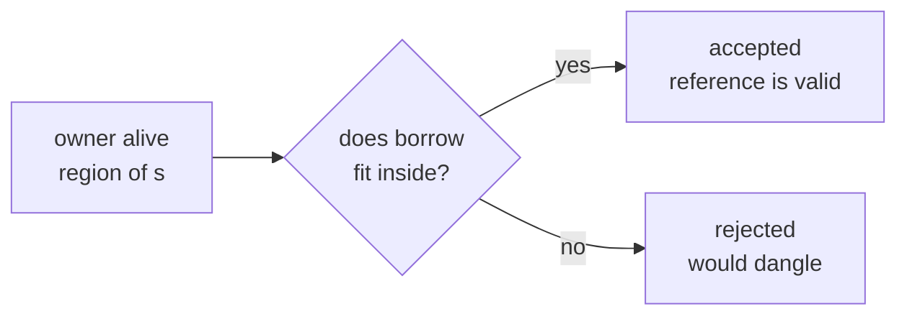

# Chapter 9 — Lifetimes

> **What you'll learn.** What a lifetime is, why it scares people more than it
> should, and how to read and write the `'a` syntax. You will see why some
> functions need lifetime annotations, why most code needs none (elision), what
> `'static` means, and how lifetimes are just the compiler proving that references
> stay valid.

Take a breath. Lifetimes have a reputation for being the hardest part of Rust, but
the core idea is small and you already understand it from C. A lifetime is just
"how long is this pointer safe to use?" — a question you ask yourself constantly in
C. The only new thing is that Rust writes the answer down and checks it.

## What a lifetime is

A **lifetime** is a region of the program during which a reference is valid — that
is, during which the value it points to is guaranteed to still be alive. Every
reference has a lifetime. Most of the time the compiler works it out silently and
you never see it.

The key point, and the one that calms most fears:

> **Mental model.** Lifetimes are *labels*, not *lifespans*. A lifetime annotation
> does not change how long any value lives. It only gives a name to a region the
> compiler is already tracking, so the compiler can compare two regions and check
> that one fits inside the other.

There is **no runtime cost**. Lifetimes are checked at compile time and then
erased. They produce no code, no extra data, and no slowdown. They are purely a
proof that your references are safe — the same reasoning you do in your head in C,
but enforced by the compiler.

> **C vs Rust.** In C, "how long is this pointer good for?" lives only in comments
> and in your memory. If you get it wrong, you get a dangling pointer and undefined
> behavior. In Rust, the answer is part of the type, and the compiler refuses to
> build code where a reference could outlive its data.

## Why functions need lifetimes

Most of the time you do not write lifetimes. You need them in one main situation:
**a function returns a reference, and the compiler cannot tell which input it
borrows from.**

Here is a function that returns the longer of two string slices. (A `&str` is a
borrowed view into string data; see Chapter 10 — Slices and Strings.) This version
does not compile:

```rust
// COMPILE ERROR: missing lifetime specifier
fn longest(x: &str, y: &str) -> &str {
    if x.len() > y.len() { x } else { y }
} // error[E0106]: expected named lifetime parameter
```

The compiler's problem: the returned reference points into either `x` or `y`, but
it cannot tell which. Without that knowledge it cannot check whether the caller's
reference will still be valid. So it asks you to label the connection.

The fix is to add a **lifetime parameter** named `'a` and say "all three
references share the lifetime `'a`":

```rust
fn longest<'a>(x: &'a str, y: &'a str) -> &'a str {
    if x.len() > y.len() { x } else { y }
}

fn main() {
    let a = String::from("longer string");
    let b = String::from("short");
    let result = longest(&a, &b);
    println!("the longest is: {result}");
}
```

Read `<'a>` as "for some lifetime `'a`". The signature now promises: the returned
reference is valid for `'a`, which is the *shorter* of the two input lifetimes. The
caller's value must live at least that long. The compiler can now check every call.

> **Mental model.** The annotation does not *make* anything live longer. It is a
> contract: "the output borrows from the inputs, so it cannot outlive them." The
> compiler enforces the contract at each call site.

### Syntax

The pieces are:

- `'a` — a lifetime name. It always starts with a single quote. The name is
  arbitrary; `'a`, `'b`, `'input` all work. `'a` is the convention.
- `<'a>` after the function name — declares the lifetime parameter, like declaring
  a generic type parameter.
- `&'a str` — a reference with lifetime `'a`.

> **C vs Rust.** The `'a` syntax looks alien, but it plays the same role as a
> comment like `/* return value points into one of the arguments; do not use it
> after either argument is freed */` — except the compiler reads it and enforces
> it.

## Lifetimes on structs

If a struct holds a reference, the struct needs a lifetime parameter. This tells
the compiler that the struct must not outlive the data it borrows.

```rust
struct Excerpt<'a> {
    part: &'a str, // a borrowed view, not owned data
}

fn main() {
    let novel = String::from("Call me Ishmael. Some years ago...");
    let first = novel.split('.').next().expect("no sentence");
    let e = Excerpt { part: first }; // e borrows from novel
    println!("{}", e.part);
} // e must not outlive novel; the compiler checks this
```

The `<'a>` after the struct name declares the lifetime; `part: &'a str` uses it.
The meaning: an `Excerpt` value cannot live longer than the string it points into.

> **C vs Rust.** This is the common C pattern of a struct that holds a `char *`
> borrowed from somewhere else. In C, nothing stops the struct from outliving the
> buffer, and you get a dangling field. In Rust, the `'a` ties the struct's life to
> the buffer's, and the compiler enforces it.

### Lifetimes on `impl` blocks

When you write methods on a struct that has a lifetime, you declare the lifetime on
the `impl` block too:

```rust
struct Excerpt<'a> {
    part: &'a str,
}

impl<'a> Excerpt<'a> {
    fn announce(&self, msg: &str) -> &str {
        println!("Attention: {msg}");
        self.part
    }
}

fn main() {
    let text = String::from("Hello. World.");
    let first = text.split('.').next().unwrap();
    let e = Excerpt { part: first };
    println!("{}", e.announce("listen"));
}
```

The `impl<'a> Excerpt<'a>` says "for any lifetime `'a`, here are methods on
`Excerpt<'a>`". You usually do not have to annotate the method bodies thanks to
elision, described next.

## Lifetime elision: why most code needs no lifetimes

If references needed explicit lifetimes everywhere, Rust would be unbearable. They
do not. The compiler applies a few rules — **lifetime elision** — that fill in the
obvious cases for you. "Elision" means "leaving out something that can be inferred."

There are three rules the compiler uses on function signatures:

1. Each reference parameter gets its **own** lifetime. `fn f(x: &T, y: &T)` is
   treated as `fn f<'a, 'b>(x: &'a T, y: &'b T)`.
2. If there is **exactly one** input lifetime, it is assigned to **all** output
   references. `fn f(x: &T) -> &U` becomes `fn f<'a>(x: &'a T) -> &'a U`.
3. If there is a `&self` or `&mut self` parameter (a method), **`self`'s lifetime**
   is assigned to all output references.

If the rules cover the whole signature, you write no lifetimes. If they leave any
output reference without a lifetime, the compiler stops and asks you to annotate —
which is exactly what happened with `longest`, where rule 2 did not apply because
there were two inputs.

```rust
// Rule 2 applies: one input lifetime flows to the output. No annotation needed.
fn first_word(s: &str) -> &str {
    s.split(' ').next().unwrap_or("")
}

fn main() {
    let phrase = String::from("hello rust world");
    println!("{}", first_word(&phrase));
}
```

```rust
// Rule 3 applies: the output borrows from &self. No annotation needed.
struct Wrapper {
    text: String,
}

impl Wrapper {
    fn get(&self) -> &str {
        &self.text
    }
}

fn main() {
    let w = Wrapper { text: String::from("hi") };
    println!("{}", w.get());
}
```

> **Rule of thumb.** Write code without lifetimes first. Add `'a` only when the
> compiler asks. Nearly all everyday code compiles with no explicit lifetimes
> because elision covers it.

## The `'static` lifetime

There is one special, built-in lifetime: **`'static`**. It means "this reference is
valid for the entire run of the program." The data it points to lives forever.

The most common `'static` references are **string literals**. A literal like
`"hello"` is baked into the program's binary, so it is always there. Its type is
`&'static str`.

```rust
fn greeting() -> &'static str {
    "hello, world" // lives for the whole program; safe to return
}

fn main() {
    let g: &'static str = greeting();
    println!("{g}");
}
```

Notice this is allowed where returning `&local` was not: the literal is not a
local that dies at the end of the function. It lives in static storage, like a C
string literal or a `static const` global.

> **C vs Rust.** `&'static str` is close to a C string literal (`const char *` to
> a literal in `.rodata`): it exists for the whole program, so a pointer to it
> never dangles. Rust just writes that fact into the type.

> **Watch out.** `'static` is often misused. When the compiler complains about a
> lifetime, beginners sometimes "fix" it by sprinkling `'static` until it builds.
> That usually changes the meaning to "this must live forever," which is rarely
> what you want and often will not compile anyway, or forces awkward design. The
> right fix is almost always to relate the output lifetime to an input, or to
> return an owned value (like `String`) instead of a reference.

## The classic lifetime errors and their fixes

You have already seen the first error. Here are the two you will meet most, with
fixes.

### "missing lifetime specifier"

A function returns a reference and the elision rules cannot decide its lifetime:

```rust
// COMPILE ERROR: missing lifetime specifier
fn pick(x: &str, y: &str) -> &str {
    if x.len() > y.len() { x } else { y }
} // error[E0106]
```

Fix: name a lifetime and tie the output to the inputs.

```rust
fn pick<'a>(x: &'a str, y: &'a str) -> &'a str {
    if x.len() > y.len() { x } else { y }
}

fn main() {
    println!("{}", pick("apple", "fig"));
}
```

### "returns a value referencing data owned by the current function"

This one is really the dangling-reference error from Chapter 8 — Borrowing and
References, seen through the lens of lifetimes. Here the output lifetime is clear
(elision rule 2 ties it to the input `s`), but the body returns a reference into
`owned`, a brand-new local that the function owns and then drops:

```rust
// COMPILE ERROR: returns a value referencing data owned by the current function
fn shout(s: &str) -> &str {
    let owned = s.to_uppercase(); // a new String, owned by this function
    &owned // error[E0515]: `owned` is dropped at the end, so the reference dangles
}
```

No lifetime annotation can save it — the data genuinely dies when the function
returns. The fix is to return the **owned** value, not a reference into it:

```rust
fn shout(s: &str) -> String {
    s.to_uppercase() // move the new String out to the caller; nothing dangles
}

fn main() {
    let loud = shout("hello");
    println!("{loud}"); // prints "HELLO"
}
```

> **Rule of thumb.** If a function builds new data, return it by value (an owned
> `String`, `Vec`, struct, ...). Return a reference only when you are handing back
> a view into something a caller already owns.

## Picture: overlapping vs disjoint lifetimes

A reference is valid only while its target is alive. The borrow checker compares
these regions. If the borrow's region fits inside the owner's region, it is safe.
If the borrow reaches past the owner's end, it is rejected.

```
OK: borrow ends before the owner does

  owner s    |================================|
  borrow r        |==============|
                                 ^ last use of r, still inside s

ERROR: borrow would outlive the owner

  owner s    |==============|
  borrow r        |===================|
                                 ^ r used here, but s is already gone -> rejected
```



## Key takeaways

- A **lifetime** is a compile-time region during which a reference is valid. Every
  reference has one; usually it is inferred.
- Lifetime annotations **describe and check**; they do **not** change how long
  values live and have **no runtime cost**.
- A function that returns a reference must tie the output's lifetime to an input,
  e.g. `fn longest<'a>(x: &'a str, y: &'a str) -> &'a str`.
- A **struct that holds a reference** needs a lifetime parameter
  (`struct Excerpt<'a> { part: &'a str }`); so does its `impl` block.
- **Elision** (three rules) fills in lifetimes for the common cases, so most code
  needs no explicit `'a`.
- **`'static`** means "valid for the whole program"; string literals are
  `&'static str`. Do not reach for it to silence errors.
- The two classic errors — "missing lifetime specifier" and "returns a value
  referencing data owned by the current function" — are fixed by relating the
  output to an input, or by returning an owned value.

## Watch out (gotchas for C programmers)

- **Lifetimes do not extend life.** Adding `'a` never makes a value live longer; it
  only states a relationship the compiler then checks. To keep data alive, own it.
- **Elision handles most cases.** Do not annotate by reflex. Write code plain, and
  add `'a` only when the compiler asks.
- **A struct holding a reference needs a lifetime parameter.** If you store a `&T`
  in a struct and forget `<'a>`, you get E0106. Often the better fix is to store an
  owned value instead.
- **A returned reference's lifetime must come from an input.** You cannot conjure a
  valid output reference out of data the function owns; return it by value.
- **`'static` is usually the wrong fix.** It means "lives forever." Reach for it
  only when the data really is static (like a literal), not to quiet the borrow
  checker.
- **The `'` is not a typo.** `'a` is a lifetime name; `'a'` (with a closing quote)
  is a `char`. Watch the quotes.

## Interview questions

**Q: What is a lifetime in Rust, and does it affect runtime?**
A: A lifetime is a compile-time region during which a reference is valid. It is
used only by the borrow checker to prove references do not outlive their data.
There is no runtime representation and no runtime cost; lifetimes are erased after
checking.

**Q: Why does `fn longest(x: &str, y: &str) -> &str` need a lifetime annotation?**
A: It returns a reference that could point into either argument, and the elision
rules cannot decide which, so the compiler cannot verify the result is valid.
Writing `fn longest<'a>(x: &'a str, y: &'a str) -> &'a str` ties the output's
lifetime to the inputs, so the compiler can check each call.

**Q: Do lifetime annotations change how long a value lives?**
A: No. They only name and relate regions the compiler already tracks. They are a
contract the borrow checker verifies; they never extend or shorten any value's
actual life. To make data live longer, you change ownership, not annotations.

**Q: What are the lifetime elision rules, in brief?**
A: One, each reference parameter gets its own lifetime. Two, if there is exactly
one input lifetime, it is given to all output references. Three, if there is a
`&self`/`&mut self`, its lifetime is given to all output references. If these leave
an output without a lifetime, you must annotate explicitly.

**Q: What is the `'static` lifetime, and what is a common mistake with it?**
A: `'static` means a reference is valid for the entire program; string literals are
`&'static str`. The common mistake is using `'static` to silence a borrow error,
which forces the data to live forever and usually does not solve the real problem.
The right fix is normally to tie the output to an input lifetime or return an owned
value.

## Try it

1. Write `longest` without the `<'a>` annotations and read the E0106 error. Add the
   lifetimes and watch it build.
2. Make a `struct Holder { s: &str }` and try to compile it. Read the error, then
   add `<'a>` (`struct Holder<'a> { s: &'a str }`). As a second fix, change the
   field to an owned `String` and notice the lifetime disappears.
3. Write a function that builds a `String` and tries to return `&str` to it. Read
   "returns a value referencing data owned by the current function," then change
   the return type to `String`.
