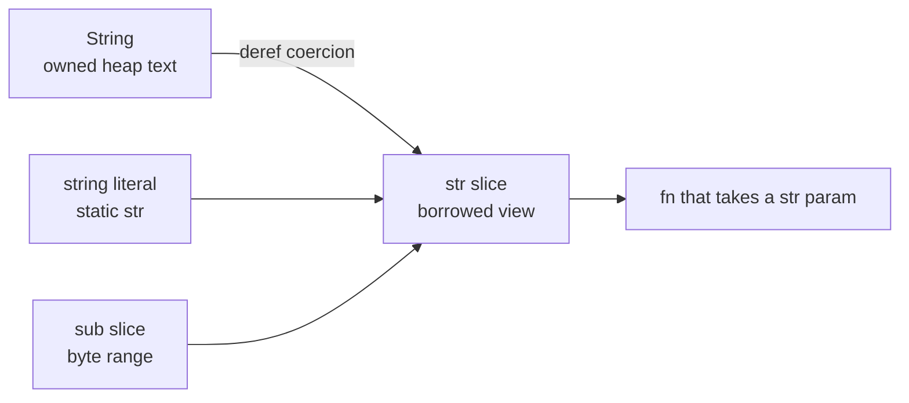

# Chapter 10 — Slices and Strings

> **What you'll learn.** What a slice is — a borrowed, bounds-checked view into a
> contiguous sequence — and how `Vec<T>` owns the data a slice points into. Then
> how Rust handles text: `String` versus `&str`, why strings are UTF-8 and not
> NUL-terminated, and why `s[0]` does not compile.

## Slices: a borrowed view into a sequence

A **slice** is a borrowed view into a run of values that sit next to each other in
memory. "Borrowed" means a slice does not own the data; it just points at part of
something else (see Chapter 8 — Borrowing and References). "Contiguous" means the
values are laid out back to back, like a C array.

The type of a slice of `T` is written `&[T]` — "a shared reference to a sequence
of `T`." You make one with a **range** inside square brackets:

```rust
fn main() {
    let v = vec![10, 20, 30, 40, 50];
    let mid = &v[1..4]; // elements at index 1, 2, 3 -> [20, 30, 40]
    println!("{mid:?}"); // prints [20, 30, 40]
    println!("len = {}", mid.len());
}
```

The range `1..4` includes the start (1) and excludes the end (4). This is the same
half-open range you already use in C `for` loops (`for (i = 1; i < 4; i++)`).

A slice is **not** a pointer like C's. In C, when you pass an array to a function,
it decays to a bare pointer and the length is lost. You must pass the length as a
second argument and hope the caller gets it right:

```c
/* C: pointer plus a separate length; nothing checks they agree */
int sum(const int *data, size_t len) {
    int total = 0;
    for (size_t i = 0; i < len; i++)
        total += data[i];
    return total;
}
```

In Rust the length travels *with* the slice. A slice is a **fat pointer**: a pair
of (data pointer, length) stored together. So the function needs only one
argument, and every index is checked against that length.

```rust
fn sum(data: &[i32]) -> i32 {
    let mut total = 0;
    for &x in data {
        total += x;
    }
    total
}

fn main() {
    let v = vec![1, 2, 3, 4];
    println!("{}", sum(&v)); // a &Vec<i32> coerces to &[i32]
    println!("{}", sum(&v[1..3])); // a sub-slice works too
}
```

> **Mental model.** A C array argument is "here is where it starts; trust me about
> how long it is." A Rust slice is "here is where it starts **and** exactly how
> long it is." The length is not optional and not separate.

### A slice is a fat pointer (ASCII layout)

A slice value is two machine words: a pointer to the first element and a count of
elements. It does not copy the data. Here is `&v[1..4]` pointing into the buffer
that the `Vec` owns:

```
   slice  mid: &[i32]            heap buffer owned by v
  +---------+--------+          +----+----+----+----+----+
  |  ptr    |  len=3 |          | 10 | 20 | 30 | 40 | 50 |
  +----+----+--------+          +----+----+----+----+----+
       |                          ^         ^
       |                          |         |
       +--------------------------+         |
                                  index 1   up to (not incl.) index 4
```

The slice borrows; it owns nothing. When `mid` goes out of scope, nothing is
freed — the `Vec` still owns the buffer.

### Slices are bounds-checked

If a range or index goes past the end, Rust does not read past the buffer the way
C would. It **panics** — it stops the program safely instead of causing undefined
behavior.

```rust
fn main() {
    let v = vec![1, 2, 3];
    let bad = &v[1..9]; // panics: range end index 9 out of range for slice of length 3
    println!("{bad:?}");
}
```

> **C vs Rust.** In C, `data[9]` on a 3-element array is undefined behavior — maybe
> a crash, maybe silent corruption, maybe an exploit. In Rust the access is checked
> and the program panics with a clear message. Safety first.

### Range shorthand

You can leave out either end of a range:

| Syntax | Meaning | C-style loop bounds |
|---|---|---|
| `&v[2..5]` | index 2 up to but not including 5 | `i = 2; i < 5` |
| `&v[..5]` | start up to but not including 5 | `i = 0; i < 5` |
| `&v[2..]` | index 2 to the end | `i = 2; i < len` |
| `&v[..]` | the whole thing as a slice | `i = 0; i < len` |
| `&v[2..=5]` | index 2 through 5 inclusive | `i = 2; i <= 5` |

### Mutable slices

`&[T]` is a read-only view. For a view you can write through, use `&mut [T]`. The
same borrow rules apply: while a `&mut` slice exists, no other access to that data
is allowed (Chapter 8 — Borrowing and References).

```rust
fn double_all(xs: &mut [i32]) {
    for x in xs.iter_mut() {
        *x *= 2;
    }
}

fn main() {
    let mut v = vec![1, 2, 3];
    double_all(&mut v);
    println!("{v:?}"); // [2, 4, 6]
}
```

## `Vec<T>`: the owned array a slice borrows from

A slice has to point *into* something. Most often that something is a `Vec<T>` —
Rust's **owned, growable array**. We met it in Chapter 1; here is the part that
matters for slices. (Full treatment in Chapter 16 — Collections and Iterators.)

A `Vec<T>` is three words: a pointer to a heap buffer, the **length** (how many
elements are in use), and the **capacity** (how many fit before it must grow). It
owns its buffer and frees it automatically when the `Vec` is dropped.

```
   Vec<i32> on the stack            heap buffer (capacity 8)
  +--------+--------+--------+      +----+----+----+----+----+--+--+--+
  | ptr    | len=3  | cap=8  |----> | 10 | 20 | 30 | ?? | ?? |..|..|..|
  +--------+--------+--------+      +----+----+----+----+----+--+--+--+
                                     \________ in use _______/\__free__/
```

> **C vs Rust.** A `Vec<T>` is the safe version of the C pattern "a `malloc`'d
> array plus a length plus a capacity that you grow with `realloc`." Rust bundles
> the three together, grows it for you, bounds-checks every access, and calls
> `free` for you when the `Vec` goes out of scope.

The relationship is simple: the `Vec` **owns** the data; a slice **borrows** a view
of it. `&v[..]` (or just passing `&v` where a slice is expected) hands out a
`(ptr, len)` view without giving up ownership.

## Strings: `String` and `&str`

Rust has two main string types, and the split mirrors `Vec<T>` versus `&[T]`
exactly:

- **`String`** — an **owned**, growable, heap-allocated string. It is essentially a
  `Vec<u8>` that is guaranteed to hold valid UTF-8 text.
- **`&str`** — a **string slice**: a borrowed view into UTF-8 text. It is a fat
  pointer of (data pointer, byte length). You read it as "string slice" or "str."

> **Mental model.** `String : &str` is the same relationship as `Vec<T> : &[T]`.
> One owns the heap buffer; the other is a borrowed `(ptr, len)` window into it.

A **string literal** like `"hello"` has type `&'static str`. The text is baked
into the program's read-only data, so the slice is valid for the entire run of the
program. The `'static` is a lifetime meaning "lives forever" (Chapter 9 —
Lifetimes).

```rust
fn main() {
    let owned: String = String::from("hello"); // owns heap memory
    let literal: &str = "world"; // borrowed view into program data
    let view: &str = &owned[..]; // borrowed view into `owned`

    println!("{owned} {literal} {view}");
}
```

### A `String` points into a heap buffer (ASCII layout)

`String` is the same three words as `Vec`: pointer, length, capacity. The length
and capacity are measured in **bytes**, not characters.

```
   String on the stack              heap buffer (UTF-8 bytes)
  +--------+--------+--------+      +----+----+----+----+----+
  | ptr    | len=5  | cap=8  |----> | 'h'| 'e'| 'l'| 'l'| 'o'|
  +--------+--------+--------+      +----+----+----+----+----+
                                     no NUL terminator at the end
```

A `&str` is just the first two of those words — a `(ptr, len)` pair — pointing at
some bytes it does not own:

```
   &str fat pointer
  +--------+--------+
  | ptr    | len=5  |----> into a String, a literal, or any UTF-8 bytes
  +--------+--------+
```

## UTF-8 reality (the big difference from C)

This is where Rust text and C text part ways. Read it carefully.

In C, a string is `char *`: a pointer to bytes that ends at a `'\0'` (NUL) byte.
The length is *not* stored; you find it by scanning for the NUL with `strlen`,
which is O(n). Each `char` is one byte, and the encoding is whatever you decide.

In Rust, a string is **UTF-8 bytes plus a stored length**, with **no NUL
terminator**:

- **UTF-8.** Text is encoded as UTF-8. An ASCII character ('A', '7', '?') is one
  byte. Other characters ('é', '€', '中', emoji) take **two to four bytes** each.
- **Length is stored**, so `.len()` is O(1) — no scanning. But `.len()` returns the
  number of **bytes**, not the number of characters.
- **No NUL terminator.** The end is known from the length, so the bytes can contain
  a zero byte with no special meaning.

| Concept | C `char *` | Rust `String` / `&str` |
|---|---|---|
| Storage | bytes ending in NUL | UTF-8 bytes plus a length |
| End marker | `'\0'` terminator | none; length is stored |
| Length cost | `strlen` scans, O(n) | `.len()` is O(1) |
| `.len()` unit | bytes (== chars for ASCII) | always bytes |
| Encoding | up to you | always valid UTF-8 |
| Index `s[i]` | one byte | does not compile |
| Bounds checked | no | yes |

### Why `s[0]` does not compile

In C, `s[0]` is the first byte and you use it constantly. In Rust, integer
indexing of a string is **rejected by the compiler**:

```rust
// COMPILE ERROR: the type `str` cannot be indexed by `{integer}`
fn main() {
    let s = String::from("héllo");
    let c = s[0]; // error[E0277]: `String` cannot be indexed by integer
    println!("{c}");
}
```

The reason is the UTF-8 layout. A single index could land in the **middle** of a
multi-byte character, which would give you half a character — meaningless. Rust
refuses to let you ask an ambiguous question. Consider `"héllo"`:

```
  char:    h     é          l     l     o
  bytes:  68    C3   A9    6C    6C    6F        (hex)
  index:   0     1    2     3     4     5

  "héllo".len()            == 6   (bytes, not characters)
  "héllo".chars().count()  == 5   (characters)
```

The 'é' takes two bytes (`C3 A9`). Byte index 0 is 'h', but byte index 1 is only
the *first half* of 'é'. So "give me byte 1 as a character" has no good answer, and
Rust will not pretend otherwise.

### Iterate with `.chars()` or `.bytes()`

Instead of indexing, you iterate. Pick the unit you actually want:

```rust
fn main() {
    let s = "héllo";

    for c in s.chars() {
        // each `c` is a `char`: one Unicode scalar value (4 bytes wide)
        print!("[{c}]");
    }
    println!(); // [h][é][l][l][o]

    for b in s.bytes() {
        // each `b` is a u8: one raw byte of the UTF-8 encoding
        print!("{b} ");
    }
    println!(); // 104 195 169 108 108 111
}
```

A Rust `char` is **not** a C `char`. A C `char` is one byte. A Rust `char` is a
**Unicode scalar value** and is always 4 bytes wide, able to hold any single
character. Use `.chars()` when you mean "characters" and `.bytes()` when you mean
"raw bytes."

> **Watch out.** `.len()` is the **byte** length. To count characters, use
> `s.chars().count()` — and know that it costs O(n) because it must walk the UTF-8.

### Slicing strings: only at character boundaries

You *can* slice a string with a byte range, and the result is a `&str`. But the
range ends must fall on **character boundaries**. A range that splits a multi-byte
character panics at runtime.

```rust
fn main() {
    let s = "héllo"; // bytes: h | é(2 bytes) | l | l | o

    let head = &s[0..1]; // "h"  -> ok, boundary
    let tail = &s[3..6]; // "llo" -> ok, boundary
    println!("{head} {tail}");

    // &s[0..2] would PANIC: byte index 2 is inside 'é'
    // thread 'main' panicked: byte index 2 is not a char boundary
}
```

> **Rule of thumb.** Prefer methods that respect characters (`.chars()`,
> `.split()`, `.find()`, `.starts_with()`) over manual byte-range slicing. Slice by
> byte range only when you got the index from such a method (so you know it is a
> valid boundary).

## Conversions between `String` and `&str`

You move between owned and borrowed text constantly. Here are the common moves:

```rust
fn main() {
    // &str -> String (allocates and copies)
    let a: String = String::from("hi");
    let b: String = "hi".to_string();
    let c: String = "hi".to_owned();

    // String -> &str (no allocation; just a view)
    let s = String::from("hello");
    let v1: &str = &s[..]; // full-range slice
    let v2: &str = s.as_str(); // explicit method
    let v3: &str = &s; // deref coercion (see below)

    // Build a String with format!, like a safe sprintf
    let name = "Ada";
    let msg: String = format!("hello, {name}!");

    println!("{a} {b} {c} {v1} {v2} {v3} {msg}");
}
```

### Concatenation

You can join strings with `+`, but note the types: the left side must be an owned
`String` and the right side a `&str`. The `+` **consumes** the left `String` (takes
ownership) and returns a new `String`.

```rust
fn main() {
    let hello = String::from("hello, ");
    let world = "world"; // &str
    let greeting = hello + world; // `hello` is moved; cannot use it after
    println!("{greeting}");

    // For more than two pieces, format! is clearer:
    let a = "foo";
    let b = "bar";
    let joined = format!("{a}-{b}-{a}");
    println!("{joined}");

    // push_str / push grow a String in place:
    let mut s = String::from("ab");
    s.push_str("cd"); // append a &str
    s.push('!'); // append one char
    println!("{s}"); // abcd!
}
```

> **C vs Rust.** In C you concatenate with `strcat` into a buffer you must size
> correctly, risking overflow. Rust's `+`, `format!`, and `push_str` allocate and
> grow as needed; you cannot overflow a buffer.

## API guidance: borrow `&str` and `&[T]`, not `&String` and `&Vec<T>`

When a function only needs to *read* a string or a sequence, take a slice, not a
reference to the owned type. That is, prefer:

- `fn f(s: &str)` over `fn f(s: &String)`
- `fn g(xs: &[i32])` over `fn g(xs: &Vec<i32>)`

A `&str` parameter accepts a `String`, a string literal, and a sub-slice. A
`&String` parameter accepts only a `String`. The slice version is strictly more
flexible, and it works because of **deref coercion**: the compiler automatically
turns a `&String` into a `&str` (and a `&Vec<T>` into a `&[T]`) when a slice is
expected.

```rust
fn shout(s: &str) -> String {
    s.to_uppercase()
}

fn main() {
    let owned = String::from("hi");
    println!("{}", shout(&owned)); // &String coerces to &str
    println!("{}", shout("there")); // a literal is already &str
    println!("{}", shout(&owned[0..1])); // a sub-slice works too
}
```



> **Rule of thumb.** Accept the borrowed slice type (`&str`, `&[T]`) in function
> signatures; return the owned type (`String`, `Vec<T>`) when you create new data.
> This is the Rust equivalent of taking `const char *` in C, but type-safe and
> length-aware.

## Key takeaways

- A **slice** `&[T]` is a borrowed, bounds-checked view into a contiguous sequence:
  a fat pointer of (data pointer, length). Make one with `&v[a..b]`.
- A **`Vec<T>`** is the owned, growable array (pointer, length, capacity). Slices
  borrow a view of the data a `Vec` (or array) owns.
- **`String`** is owned, growable, heap, UTF-8 text; **`&str`** is a borrowed view
  into UTF-8 text. The analogy is `String : &str :: Vec<T> : &[T]`.
- Rust strings are **UTF-8**, carry a **stored length**, and have **no NUL
  terminator**. `.len()` is the **byte** length, computed in O(1).
- You cannot index a string by integer (`s[0]`); iterate with `.chars()` or
  `.bytes()`. Byte-range slicing works only on character boundaries, or it panics.
- Convert with `String::from` / `.to_string()` / `.to_owned()` (to owned) and
  `&s[..]` / `.as_str()` / deref (to borrowed); build with `format!`.
- In function signatures, take `&str` and `&[T]`; deref coercion makes `&String`
  and `&Vec<T>` arguments work automatically.

## Watch out (gotchas for C programmers)

- **No `s[i]` indexing on strings.** A byte index could split a character. Use
  `.chars()`, `.bytes()`, or boundary-safe slicing.
- **`.len()` is bytes, not characters.** For ASCII they match; for any multi-byte
  character they differ. Count characters with `.chars().count()`.
- **Slicing mid-character panics.** `&s[0..2]` panics if byte 2 is inside a
  character. Get indices from string methods that respect boundaries.
- **`&str` is not `String`.** One is a borrowed view, the other owns heap memory.
  Do not store a `&str` longer than the data it borrows lives.
- **String literals are `&'static str`**, not `String`. Call `.to_string()` when
  you need an owned, growable value.
- **No NUL terminator.** Do not assume C string functions or a trailing `'\0'`. To
  call C, convert with `CString`/`CStr` (Chapter 25 — Unsafe Rust and FFI).
- **A Rust `char` is 4 bytes**, a Unicode scalar value — not a C one-byte `char`.

## Interview questions

**Q: What is a slice, and how does it differ from a C pointer to an array?**
A: A slice `&[T]` is a borrowed view into a contiguous sequence, stored as a fat
pointer of (data pointer, length). Unlike a decayed C array pointer, it carries the
length with it and bounds-checks every access, so out-of-range use panics instead
of being undefined behavior.

**Q: What is the relationship between `String` and `&str`?**
A: `String` is an owned, growable, heap-allocated UTF-8 buffer; `&str` is a
borrowed view (a `(ptr, len)` fat pointer) into UTF-8 text it does not own. The
relationship mirrors `Vec<T>` and `&[T]`: one owns, the other borrows.

**Q: Why can't you write `s[0]` to get the first character of a Rust string?**
A: Rust strings are UTF-8, where characters can be one to four bytes. A single
integer index could land inside a multi-byte character and yield half a character,
which is meaningless. So the compiler forbids integer indexing; you iterate with
`.chars()` or `.bytes()`, or slice on character boundaries.

**Q: Does `.len()` return the number of characters in a string?**
A: No. It returns the number of **bytes** in the UTF-8 encoding, in O(1). For ASCII
that equals the character count, but any multi-byte character makes them differ. To
count characters, use `s.chars().count()`, which is O(n).

**Q: Why prefer `&str` over `&String` (and `&[T]` over `&Vec<T>`) in function
parameters?**
A: A `&str` accepts a `String`, a literal, and a sub-slice, so it is more general,
while `&String` accepts only a `String`. Deref coercion converts `&String` to
`&str` automatically, so you lose nothing and gain flexibility. The same reasoning
applies to `&[T]` versus `&Vec<T>`.

## Try it

1. Make `let s = "naïve";`. Print `s.len()` and `s.chars().count()` and explain why
   they differ.
2. Try `&s[0..3]` and then a range that splits the 'ï'. Watch one work and one
   panic, and read the panic message about the char boundary.
3. Write `fn first_word(s: &str) -> &str` that returns the text up to the first
   space. Call it with both a `String` (passed as `&s`) and a string literal.
