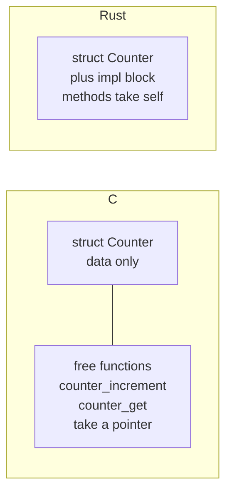

# Chapter 11 — Structs and Methods

> **What you'll learn.** How to define and build structs, how Rust lays them out in
> memory (and why it may reorder fields), and how `impl` blocks attach methods that
> take `self`, `&self`, or `&mut self` — turning C's "struct plus free functions"
> into one tidy type.

## Structs: grouping related data

A **struct** groups several values into one named type, exactly like a C `struct`.
You already know the idea; the syntax and a few rules differ.

Rust has three kinds of struct.

### Named-field structs

The common kind. Each field has a name and a type.

```rust
struct Point {
    x: f64,
    y: f64,
}

fn main() {
    let p = Point { x: 1.0, y: 2.0 }; // build with field: value
    println!("({}, {})", p.x, p.y); // access with a dot
}
```

```c
/* The C equivalent */
struct Point { double x, y; };
struct Point p = { 1.0, 2.0 };
printf("(%f, %f)\n", p.x, p.y);
```

> **C vs Rust.** Field access is `.` in both, even though `p` is a value, not a
> pointer. Rust has no `->` operator; you write `p.x` whether `p` is a value or a
> reference, and the compiler dereferences for you.

### Tuple structs

A struct whose fields have **no names**, only positions. Useful for a thin wrapper
("newtype") or a small fixed group. You access fields by number: `.0`, `.1`.

```rust
struct Rgb(u8, u8, u8);
struct Meters(f64); // a "newtype": a distinct type around one value

fn main() {
    let red = Rgb(255, 0, 0);
    let dist = Meters(5.0);
    println!("r={} dist={}", red.0, dist.0);
}
```

A newtype like `Meters` is a type-safety trick: `Meters` and `f64` are different
types, so you cannot accidentally pass plain meters where seconds are wanted. C has
no easy equivalent (a `typedef` does not create a distinct type). More in Chapter
27 — Idioms and Style.

### Unit structs

A struct with **no fields at all**. It carries no data; it exists as a type, often
to implement a trait (Chapter 15 — Traits).

```rust
struct Marker; // no fields, no parentheses

fn main() {
    let _m = Marker;
}
```

## Building and updating structs

### Field-init shorthand

When a variable has the same name as a field, you can write the name once.

```rust
struct User {
    name: String,
    age: u32,
}

fn make_user(name: String, age: u32) -> User {
    User { name, age } // short for `name: name, age: age`
}

fn main() {
    let u = make_user(String::from("Ada"), 36);
    println!("{} is {}", u.name, u.age);
}
```

### Struct update syntax

To build a new struct from an existing one, changing a few fields, use `..other`.
It fills the remaining fields from `other`.

```rust
#[derive(Debug)]
struct Config {
    width: u32,
    height: u32,
    fullscreen: bool,
}

fn main() {
    let base = Config { width: 800, height: 600, fullscreen: false };
    let hd = Config { width: 1920, height: 1080, ..base };
    println!("{hd:?}");
}
```

> **Watch out.** `..base` **moves** fields out of `base` that are not `Copy` types
> (Chapter 7 — Ownership and Moves). Here every field is `Copy`, so `base` is still
> usable. If a field were a `String`, that field would be moved and `base` could no
> longer be used as a whole.

## Mutability is per-binding, not per-field

This trips up C programmers. In C you can mark individual struct members `const`.
In Rust there is **no per-field mutability**. Whether you can change fields depends
on whether the **binding** (the `let`) is `mut`.

```rust
struct Point {
    x: i32,
    y: i32,
}

fn main() {
    let p = Point { x: 1, y: 2 };
    // p.x = 5; // COMPILE ERROR: cannot assign; `p` is not declared mutable

    let mut q = Point { x: 1, y: 2 };
    q.x = 5; // ok: the whole binding `q` is mutable
    q.y = 6;
    println!("({}, {})", q.x, q.y);
}
```

> **C vs Rust.** C controls mutability per member (`const int x;`). Rust controls it
> per variable: `let` means the whole value is immutable, `let mut` means the whole
> value is mutable. You cannot make just one field immutable.

## Memory layout: like C, but fields may be reordered

A struct's fields live next to each other in memory, just like C. Each field has an
**alignment** (the address must be a multiple of its size, roughly), so the
compiler inserts **padding** bytes to keep fields aligned. So far this is identical
to C.

The surprise: **by default Rust may reorder the fields** to pack them with less
padding. C guarantees fields appear in declaration order; Rust's default
representation (`repr(Rust)`) makes no such promise and optimizes the layout.

Consider this struct, written in a deliberately wasteful order:

```rust
struct Mixed {
    a: u8, // 1 byte
    b: u32, // 4 bytes, wants 4-byte alignment
    c: u8, // 1 byte
}
```

A naive C-style layout in declaration order wastes space on padding:

```
  declaration order (what C must do):
  offset: 0    1    2    3    4    5    6    7    8 .. 11
          [a]  [pad][pad][pad][ b  b  b  b ][c]  [pad pad pad]
          1 used, 3 padding, 4 used, 1 used, 3 padding  -> 12 bytes
```

Rust is free to reorder so the big field is first and the two small ones sit
together, shrinking the padding:

```
  reordered (what Rust may do):
  offset: 0    1    2    3    4    5    6    7
          [ b  b  b  b ][a]  [c]  [pad][pad]
          4 used, 1, 1, 2 padding  ->  8 bytes
```

You can ask for the real size with `std::mem::size_of`:

```rust
struct Mixed {
    a: u8,
    b: u32,
    c: u8,
}

fn main() {
    println!("{}", std::mem::size_of::<Mixed>()); // 8 on a typical target
    println!("{}", std::mem::size_of::<u32>()); // 4
}
```

> **Watch out.** Because the order can change, you must **not** assume field offsets
> in default Rust structs. Do not write code (or talk to C) that depends on the
> layout unless you fix it with an attribute.

### `#[repr(C)]` for a predictable, C-compatible layout

When you need the layout to match C exactly — for example, to pass the struct to or
from C code — put `#[repr(C)]` on it. This forces declaration order and C's padding
rules, so the struct is binary-compatible with the same struct in C.

```rust
#[repr(C)]
struct Header {
    magic: u32,
    version: u8,
    flags: u8,
}
```

`#[repr(C)]` is essential for the foreign function interface. We cover it fully in
Chapter 25 — Unsafe Rust and FFI. For pure-Rust code, leave the default; let the
compiler pack fields for you.

## Methods with `impl`

In C, a struct is just data. To operate on it, you write **free functions** that
take a pointer to the struct:

```c
struct Counter { int value; };

void counter_increment(struct Counter *c) { c->value += 1; }
int  counter_get(const struct Counter *c) { return c->value; }
```

Rust attaches those functions to the type in an **`impl` block** (short for
"implementation"). Inside, the first parameter describes how the method borrows the
receiver. The receiver is named `self` (like C's explicit `c` pointer, but
implicit at the call site).

```rust
struct Counter {
    value: i32,
}

impl Counter {
    fn increment(&mut self) {
        self.value += 1; // needs &mut self to modify
    }

    fn get(&self) -> i32 {
        self.value // &self is enough to read
    }
}

fn main() {
    let mut c = Counter { value: 0 };
    c.increment(); // method-call syntax; `c` is the receiver
    c.increment();
    println!("{}", c.get()); // 2
}
```

### The three receiver forms

The first parameter chooses how the method accesses the value. This maps directly
onto borrowing (Chapter 8 — Borrowing and References).

| Receiver | Meaning | C analogy | Use when |
|---|---|---|---|
| `&self` | borrow immutably (read) | `const T *self` | you only read fields |
| `&mut self` | borrow mutably (modify) | `T *self` | you change fields |
| `self` | take ownership (consume) | pass by value, caller's copy gone | you transform or destroy the value |

```rust
struct Buffer {
    data: Vec<u8>,
}

impl Buffer {
    fn len(&self) -> usize {
        self.data.len() // read only
    }

    fn push(&mut self, byte: u8) {
        self.data.push(byte); // modify
    }

    fn into_vec(self) -> Vec<u8> {
        self.data // consume self, hand out the inner Vec
    }
}

fn main() {
    let mut b = Buffer { data: Vec::new() };
    b.push(1);
    b.push(2);
    println!("len = {}", b.len());
    let v = b.into_vec(); // `b` is consumed here; cannot use it afterward
    println!("{v:?}");
}
```

> **Mental model.** `&self` is "lend me the struct to look at." `&mut self` is "lend
> it to me so I can change it." `self` is "give it to me — you will not need it
> after." The `into_` prefix is the convention for methods that consume `self`.

### Associated functions and the `new` convention

A function in an `impl` block that does **not** take `self` is an **associated
function**. It belongs to the type, not to an instance. You call it with `::`. The
most common one is a constructor named `new`. Rust has no built-in constructors;
`new` is just a convention.

```rust
struct Point {
    x: f64,
    y: f64,
}

impl Point {
    fn new(x: f64, y: f64) -> Self {
        Self { x, y } // `Self` means "this type", here Point
    }

    fn origin() -> Self {
        Self::new(0.0, 0.0) // call another associated function
    }
}

fn main() {
    let p = Point::new(3.0, 4.0); // :: not . because there is no receiver yet
    let o = Point::origin();
    println!("{} {} {} {}", p.x, p.y, o.x, o.y);
}
```

`Self` (capital S) is a shorthand for the type the `impl` is for. It saves
repeating the name and survives renames.

> **C vs Rust.** A C constructor is just a free function like `point_new` that
> returns a struct or fills a pointer. Rust's `Point::new` is the same idea, but
> namespaced under the type, so the name cannot collide with another type's `new`.

### Multiple `impl` blocks

You may split methods across several `impl` blocks for the same type. The compiler
treats them as one set. This is handy for grouping related methods or adding
methods under a `cfg` condition.

```rust
struct Point {
    x: f64,
    y: f64,
}

impl Point {
    fn new(x: f64, y: f64) -> Self {
        Self { x, y }
    }
}

impl Point {
    fn magnitude(&self) -> f64 {
        (self.x * self.x + self.y * self.y).sqrt()
    }
}

fn main() {
    let p = Point::new(3.0, 4.0);
    println!("{}", p.magnitude()); // 5
}
```

### Automatic referencing and dereferencing

In C you must pick `.` or `->` based on whether you have a value or a pointer. Rust
does it for you. When you call `obj.method()`, the compiler automatically adds `&`,
`&mut`, or `*` as needed to match the method's receiver. So `c.increment()` works
whether `c` is a `Counter`, a `&Counter`, or a `&mut Counter`; you do not write the
`&`.

```rust
struct Counter {
    value: i32,
}

impl Counter {
    fn get(&self) -> i32 {
        self.value
    }
}

fn main() {
    let c = Counter { value: 7 };
    let r = &c;
    println!("{}", c.get()); // compiler inserts (&c)
    println!("{}", r.get()); // already a reference; just works
}
```

> **C vs Rust.** No `->` ever. Rust's automatic referencing means the method-call
> dot works on values and references alike, and the compiler inserts the right
> borrow.

## Deriving common traits

A new struct cannot be printed, copied, or compared until it gains the right
behavior. The quickest way is `#[derive(...)]`, which asks the compiler to generate
standard implementations for you.

```rust
#[derive(Debug, Clone, PartialEq)]
struct Point {
    x: i32,
    y: i32,
}

fn main() {
    let a = Point { x: 1, y: 2 };
    let b = a.clone(); // Clone: make an explicit deep copy
    println!("{a:?}"); // Debug: Point { x: 1, y: 2 }
    println!("{a:#?}"); // pretty Debug: multi-line, indented
    println!("{}", a == b); // PartialEq: true
}
```

What the common derives give you:

- **`Debug`** — printing with `{:?}` (compact) and `{:#?}` (pretty, multi-line).
  This is for programmers, like a `dump` function. Required before you can `{:?}` a
  struct.
- **`Clone`** — an explicit `.clone()` that makes a full copy.
- **`PartialEq`** — `==` and `!=` comparison, field by field.

> **Watch out.** You must derive (or implement) `Debug` before `{:?}` will print
> your struct. Forgetting it is a very common first error: "`Point` doesn't
> implement `Debug`."

### No default field values

C lets you leave a struct member uninitialized (and read garbage). Rust does
not: every field must be given a value when you build the struct, and there is **no
syntax for a default value on a field**. To get defaults, implement or derive the
`Default` trait, or write a builder.

```rust
#[derive(Debug, Default)]
struct Settings {
    volume: u32, // defaults to 0
    muted: bool, // defaults to false
}

fn main() {
    let s = Settings::default(); // all fields take their type's default
    let custom = Settings { volume: 5, ..Default::default() };
    println!("{s:?} {custom:?}");
}
```

Builders, for structs with many optional fields, are covered in Chapter 27 —
Idioms and Style.

## C struct + functions vs Rust struct + methods



> **Mental model.** A C struct plus the free functions that take `struct T *`
> becomes, in Rust, one struct with an `impl` block whose methods take `self`. The
> data and the operations live together, and the receiver's `&`/`&mut`/by-value
> form states exactly how each method uses the value.

## Key takeaways

- Structs come in three forms: named-field, tuple (positional, `.0`/`.1`), and unit
  (no fields). Build named structs with `Field { name: value }`.
- Field-init shorthand (`User { name, age }`) and struct update syntax (`..other`)
  reduce boilerplate; `..other` moves non-`Copy` fields.
- Mutability is **per binding** (`let mut`), not per field. There is no per-field
  `const`.
- Fields are laid out like C, **but the compiler may reorder them** to cut padding.
  Use `#[repr(C)]` for a fixed, C-compatible layout (Chapter 25). Measure with
  `std::mem::size_of`.
- Methods live in `impl` blocks. The receiver is `&self` (read), `&mut self`
  (modify), or `self` (consume). Associated functions take no `self` and are called
  with `::`; `Self::new` is the constructor convention.
- The method-call dot auto-references and auto-dereferences; there is no `->`.
- `#[derive(Debug, Clone, PartialEq)]` generates printing, copying, and comparison.
  There are no default field values — use `Default` or a builder.

## Watch out (gotchas for C programmers)

- **Fields may be reordered.** Default Rust layout is not declaration order. Never
  assume offsets; use `#[repr(C)]` when the layout must match C.
- **Mutability is per binding, not per field.** `let mut p` makes all of `p`
  mutable; you cannot mark a single field mutable or `const`.
- **Pick the right receiver.** `&self` to read, `&mut self` to modify, `self` to
  consume. Taking `self` by value moves the struct; the caller cannot use it after.
- **No default field values.** Every field must be set when you build a struct.
  Derive `Default` or use a builder for defaults.
- **You must derive `Debug`** before `{:?}` will print your struct. Same for `==`
  (needs `PartialEq`) and `.clone()` (needs `Clone`).
- **No `->` operator.** Use `.` for everything; the compiler dereferences for you.

## Interview questions

**Q: In C a struct is data and functions are separate. How does Rust relate the
two?**
A: Rust attaches functions to a type in an `impl` block. Methods take a receiver —
`&self`, `&mut self`, or `self` — instead of an explicit struct pointer, and you
call them with `value.method()`. The data and its operations live together, and the
receiver form states how the method borrows the value.

**Q: What is the difference between `&self`, `&mut self`, and `self`?**
A: `&self` borrows the value immutably to read it; `&mut self` borrows it mutably to
modify it; `self` takes ownership and consumes the value, so the caller can no
longer use it. They map to C's `const T *`, `T *`, and pass-by-value-then-discard.

**Q: Does a Rust struct have the same memory layout as the equivalent C struct?**
A: Not by default. Rust's default representation may reorder fields to reduce
padding, so offsets are unspecified. To get a C-compatible layout in declaration
order with C padding rules, annotate the struct with `#[repr(C)]`.

**Q: How do you give a struct a constructor, and is `new` special?**
A: You write an associated function (no `self` parameter) inside an `impl` block,
usually named `new`, returning `Self`. It is called as `Type::new(...)`. The name
`new` is only a convention, not a keyword; you can have any number of constructor
functions with different names.

**Q: Why does `println!("{:?}", p)` fail to compile for a new struct, and how do
you fix it?**
A: The `{:?}` format requires the `Debug` trait, which a new struct does not have.
Add `#[derive(Debug)]` above the struct (or implement `Debug` by hand). Then `{:?}`
prints a compact form and `{:#?}` prints a pretty, indented form.

## Try it

1. Define `struct Rectangle { width: f64, height: f64 }` with `Rectangle::new`, an
   `area(&self)` method, and a `scale(&mut self, factor: f64)` method. Build one,
   print its area, scale it, and print again.
2. Add `#[derive(Debug)]` and print it with `{:?}` and `{:#?}`. Remove the derive
   and read the compiler error.
3. Define `struct Mixed { a: u8, b: u64, c: u8 }` and print
   `std::mem::size_of::<Mixed>()`. Add `#[repr(C)]` and compare the size.
