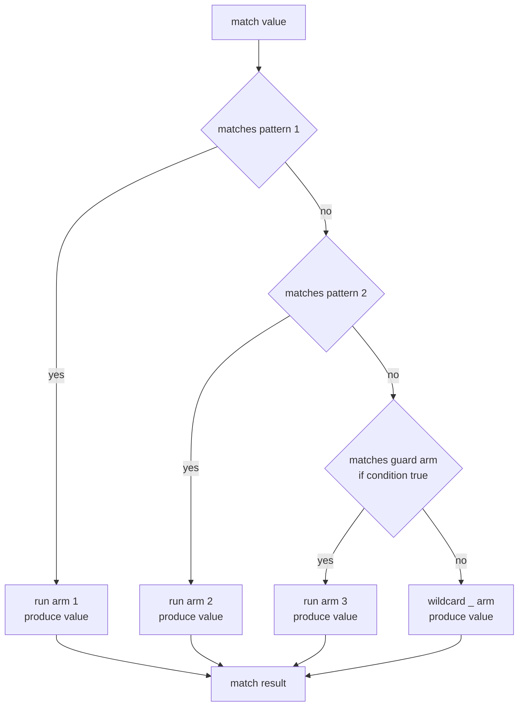

# Chapter 12 — Enums and Pattern Matching

> **What you'll learn.** How Rust enums are real *sum types* that can carry data —
> safe, built-in tagged unions — and how `match` lets you take them apart safely
> and exhaustively. You will meet `Option<T>` (Rust's answer to null) and `Result<T, E>`,
> and learn the patterns that make Rust feel different from C.

## What a C `enum` is, and why Rust's is more

In C, an `enum` is just a set of named integer constants. It is a thin label on
top of `int`.

```c
enum Shape { CIRCLE, RECTANGLE, TRIANGLE };   /* values 0, 1, 2 */

enum Shape s = CIRCLE;
int x = s + 1;          /* legal: an enum is an int */
s = 999;                /* legal: any int fits, even a meaningless one */
```

A C enum holds *which* kind, but it cannot hold *data* for that kind. To attach
data you reach for a **tagged union**: a `struct` that pairs a tag (the enum) with
a `union` (overlapping storage for the variants). You must set the tag and read
the matching union member by hand. Nothing stops you from reading the wrong one.

```c
/* A classic C tagged union. The danger is all on you. */
enum ShapeKind { CIRCLE, RECTANGLE };

struct Shape {
    enum ShapeKind kind;        /* the tag */
    union {
        struct { double r; } circle;
        struct { double w, h; } rectangle;
    } data;
};

double area(const struct Shape *s) {
    switch (s->kind) {
    case CIRCLE:    return 3.14159 * s->data.circle.r * s->data.circle.r;
    case RECTANGLE: return s->data.rectangle.w * s->data.rectangle.h;
    }
    return 0; /* and if someone added a TRIANGLE? the compiler won't warn */
}
```

If you set `kind = CIRCLE` but read `data.rectangle`, the compiler says nothing and
you get garbage. This is a whole category of bug.

A Rust **enum** is a *sum type*: a type whose value is exactly one of several
**variants**, and each variant can carry its own data. The tag and the data are
fused into one safe type. You cannot read the wrong variant, because you can only
get at the data by matching the tag first.

> **C vs Rust.** A C `enum` is an `int`. A Rust `enum` is a checked tagged union:
> tag plus payload, in one type, where the compiler guarantees you read the payload
> that matches the tag.

## Defining an enum with data

Each variant can be a **unit** (no data), a **tuple** variant (positional fields),
or a **struct** variant (named fields).

```rust
enum Shape {
    Circle(f64),               // tuple variant: one f64 (the radius)
    Rectangle { w: f64, h: f64 }, // struct variant: named fields
    Point,                     // unit variant: no data
}

fn main() {
    let shapes = [
        Shape::Circle(2.0),
        Shape::Rectangle { w: 3.0, h: 4.0 },
        Shape::Point,
    ];
    for s in &shapes {
        println!("area = {:.2}", area(s));
    }
}

fn area(s: &Shape) -> f64 {
    match s {
        Shape::Circle(r) => std::f64::consts::PI * r * r,
        Shape::Rectangle { w, h } => w * h,
        Shape::Point => 0.0,
    }
}
```

Compare this to the C version above. The Rust enum needs no separate tag field, no
`union`, and no manual discipline. The only way to reach a `Circle`'s radius is to
`match Shape::Circle(r)`, which can only happen when the value really is a circle.

> **Mental model.** A struct is an **AND** type: a `Point` is an `x` *and* a `y`. An
> enum is an **OR** type: a `Shape` is a `Circle` *or* a `Rectangle` *or* a `Point`.
> C has good AND types (structs) but weak OR types (manual tagged unions). Rust has
> both, first class.

## How an enum is stored: tag plus payload

An enum value stores a small integer **tag** (also called the discriminant) that
says which variant it is, plus enough space for the **largest** variant's payload.
The whole enum is sized for the biggest case.

```
enum Shape {                      Memory for one Shape value
    Circle(f64),                  +------+--------------------------+
    Rectangle { w: f64, h: f64 }, | tag  |        payload           |
    Point,                        +------+--------------------------+
}                                 1 byte    16 bytes (two f64s, the
                                  (rounded   largest variant) + pad
                                   up for
                                   align)

If the value is Circle(2.0):      tag = 0 | r = 2.0 | (rest unused)
If it is Rectangle{3.0, 4.0}:     tag = 1 | w = 3.0 | h = 4.0
If it is Point:                   tag = 2 | (payload unused)
```

This is exactly the C `struct { tag; union { ... } }` layout — but the compiler
generates it and checks it for you. `std::mem::size_of::<Shape>()` here is the size
of the largest variant plus the tag, rounded up for alignment.

> **C vs Rust.** You wrote that tag-plus-union struct by hand in C. Rust writes it
> for you and makes the tag impossible to lie about.

### The niche optimization (C programmers love this)

Sometimes the tag costs zero bytes. If a variant's payload already has an unused
bit pattern — a "niche" — the compiler uses that pattern to mean a different
variant, instead of adding a separate tag.

The classic case is `Option<&T>`. A reference is never null in Rust, so the all-zero
("null") pattern is unused. The compiler uses it to represent `None`. The result:
`Option<&T>` is the same size as a plain pointer, and `None` is literally a null
pointer in memory.

```rust
fn main() {
    use std::mem::size_of;
    assert_eq!(size_of::<&i32>(), size_of::<Option<&i32>>());   // both 8 on 64-bit
    assert_eq!(size_of::<Box<i32>>(), size_of::<Option<Box<i32>>>());
    println!("Option<&T> and Option<Box<T>> are pointer-sized");
}
```

So `Option<&T>` and `Option<Box<T>>` cost nothing extra over a raw pointer, yet the
compiler still forces you to check for `None`. You get C's representation (a pointer
that might be null) with none of C's danger (forgetting to check).

## `match`: the heart of pattern matching

`match` compares a value against a list of **patterns** and runs the first arm that
fits. It is like C's `switch`, but stronger in three ways: it is **exhaustive**, it
has **no fallthrough**, and it can **destructure** data, not just compare integers.

```rust
fn describe(n: i32) -> &'static str {
    match n {
        0 => "zero",
        1 | 2 | 3 => "small",        // or-pattern: several values, one arm
        4..=9 => "medium",           // inclusive range pattern
        n if n < 0 => "negative",    // guard: an extra `if` condition
        _ => "large",                // `_` is the catch-all, like `default:`
    }
}

fn main() {
    for n in [-5, 0, 2, 7, 100] {
        println!("{n} is {}", describe(n));
    }
}
```

> **C vs Rust.** A C `switch` falls through from one `case` to the next unless you
> write `break`, a famous source of bugs. A Rust `match` arm never falls through;
> each arm is independent. To share one arm between values, use an or-pattern
> (`1 | 2 | 3`), not fallthrough.

### Exhaustiveness: the compiler has your back

You must handle every possible case. If you miss one, the program does not compile.
This is the opposite of C, where forgetting a `case` is silent.

```rust
// COMPILE ERROR: non-exhaustive patterns: `Shape::Point` not covered
enum Shape {
    Circle(f64),
    Rectangle { w: f64, h: f64 },
    Point,
}

fn area(s: &Shape) -> f64 {
    match s {
        Shape::Circle(r) => 3.14159 * r * r,
        Shape::Rectangle { w, h } => w * h,
        // forgot Shape::Point -> error[E0004]: non-exhaustive patterns
    }
}

fn main() {
    let _ = area(&Shape::Point);
}
```

This is a superpower for maintenance. Add a new variant to an enum later, and the
compiler points you at every `match` that must now handle it. In C, adding an enum
value silently leaves old `switch` statements wrong.

> **Rule of thumb.** Prefer matching each variant explicitly over using `_`. Then
> when you add a variant, the compiler reminds you of every place to update. Use `_`
> only when you truly mean "everything else."

### `match` is an expression

Like most things in Rust, `match` produces a value. Every arm must produce the same
type. This replaces the common C pattern of declaring a variable, then assigning to
it inside each `switch` case.

```rust
fn main() {
    let code = 2;
    let label = match code {
        0 => "ok",
        1 => "warning",
        _ => "error",
    };                 // note the value comes straight out of `match`
    println!("{label}");
}
```

A flowchart of how one `match` runs:



## More pattern tools

Patterns are a small language of their own. Here are the pieces you will use most.

### Destructuring structs and tuples

You can take a struct or tuple apart in a pattern, binding each field to a name.

```rust
struct Point {
    x: i32,
    y: i32,
}

fn main() {
    let p = Point { x: 3, y: 7 };
    let Point { x, y } = p;            // bind both fields at once
    println!("{x} {y}");

    let pair = (1, "one");
    let (num, word) = pair;            // destructure a tuple
    println!("{num} = {word}");
}
```

### The `..` rest and `@` bindings

Use `..` to ignore the fields you do not care about, and `@` to bind a value *and*
test it against a pattern at the same time.

```rust
struct Config {
    width: u32,
    height: u32,
    title: String,
}

fn main() {
    let c = Config {
        width: 800,
        height: 600,
        title: String::from("demo"),
    };

    // Take width; ignore the rest of the fields with `..`.
    let Config { width, .. } = &c;
    println!("width = {width}");

    // `@` binds the matched value to a name while also range-checking it.
    let n = 5;
    match n {
        small @ 1..=9 => println!("{small} is a single digit"),
        other => println!("{other} is bigger"),
    }
}
```

`..` also works in tuples and slices, for example `let (first, .., last) = tuple;`.

## `Option<T>`: Rust has no null

In C, any pointer can be `NULL`, and dereferencing a null pointer is undefined
behavior. The catch is that nothing in the type system tells you which pointers
might be null. You just have to remember to check.

Rust has **no null**. Instead, "a value that might be missing" is its own ordinary
enum, `Option<T>`, defined in the standard library roughly like this:

```rust
enum Option<T> {   // <T> means it works for any type T (generics, Chapter 14)
    Some(T),       // a present value, wrapping a T
    None,          // no value
}
```

Because the missing case is a separate variant, the compiler forces you to handle
it before you can touch the value inside. You cannot accidentally use a `None` as if
it held data.

```rust
fn first_char(s: &str) -> Option<char> {
    s.chars().next()    // returns Some(c), or None if the string is empty
}

fn main() {
    match first_char("hello") {
        Some(c) => println!("first char is {c}"),
        None => println!("the string was empty"),
    }
}
```

> **C vs Rust.** In C, `char *find(...)` might return `NULL` and the caller may
> forget to check, causing a crash. In Rust, `Option<char>` makes "might be missing"
> part of the type, and `match` makes ignoring `None` a compile error. A whole class
> of null-dereference crashes is gone.

### Common `Option` methods

Matching is always available, but for simple cases there are shorter helper methods.

```rust
fn main() {
    let some: Option<i32> = Some(10);
    let none: Option<i32> = None;

    println!("{}", some.unwrap_or(0));     // 10  (value, or a default for None)
    println!("{}", none.unwrap_or(0));     // 0
    println!("{:?}", some.map(|x| x * 2)); // Some(20) (transform the inner value)
    println!("{}", some.is_some());        // true
    println!("{}", none.is_none());        // true
}
```

`unwrap_or` gives a default for `None`. `map` transforms the inner value if it is
present and leaves `None` alone. `is_some`/`is_none` just ask which variant it is.
There is also `.unwrap()`, which returns the inner value but **panics** (crashes the
thread) on `None`; use it only when you are sure, and prefer real handling in
production code (see Chapter 13 — Error Handling).

## `Result<T, E>`: success or error, as a value

A close cousin of `Option` is `Result<T, E>`, the standard way to report an error.
It is also just an enum:

```rust
enum Result<T, E> {
    Ok(T),     // success, wrapping the produced value
    Err(E),    // failure, wrapping an error value
}
```

Where `Option` says "value or nothing," `Result` says "value or an explanation of
what went wrong." You handle it the same way — with `match` or helper methods.

```rust
fn main() {
    let parsed: Result<i32, _> = "42".parse::<i32>();
    match parsed {
        Ok(n) => println!("got {n}"),
        Err(e) => println!("parse failed: {e}"),
    }
}
```

We give `Result` and its `?` operator full treatment in Chapter 13 — Error
Handling. The point here is that error handling in Rust is built from the same
enum-and-`match` machinery as everything else; it is not a separate feature.

## `if let`, `let ... else`, and `while let`

A full `match` is overkill when you care about just one pattern. Rust has three
shorthands.

`if let` runs a block only when one pattern matches, with an optional `else`:

```rust
fn main() {
    let maybe = Some(7);

    if let Some(n) = maybe {
        println!("got {n}");
    } else {
        println!("nothing");
    }
}
```

`let ... else` binds a pattern that *must* match; if it does not, the `else` block
runs and must diverge (return, break, or panic). This avoids deep nesting — the
"happy path" stays at the top level.

```rust
fn parse_or_zero(s: &str) -> i32 {
    let Ok(n) = s.parse::<i32>() else {
        return 0; // the else block must leave the function (or loop/panic)
    };
    n // here `n` is in scope and definitely valid
}

fn main() {
    println!("{}", parse_or_zero("123")); // 123
    println!("{}", parse_or_zero("xyz")); // 0
}
```

`while let` keeps looping as long as a pattern matches. It is perfect for draining
a collection:

```rust
fn main() {
    let mut stack = vec![1, 2, 3];
    while let Some(top) = stack.pop() {   // pop() returns Option; None ends the loop
        println!("popped {top}");
    }
}
```

> **C vs Rust.** These are the equivalent of a small `if`/`while` that both *tests*
> a tag and *extracts* the payload in one step. In C you would check `kind ==` and
> then read the union member as two separate, error-prone actions.

## Methods on enums with `impl`

Enums can have methods, just like structs (see Chapter 11 — Structs and Methods).
You write an `impl` block and usually `match self` inside.

```rust
enum Direction {
    North,
    East,
    South,
    West,
}

impl Direction {
    fn turn_right(self) -> Direction {
        match self {
            Direction::North => Direction::East,
            Direction::East => Direction::South,
            Direction::South => Direction::West,
            Direction::West => Direction::North,
        }
    }

    fn name(&self) -> &'static str {
        match self {
            Direction::North => "north",
            Direction::East => "east",
            Direction::South => "south",
            Direction::West => "west",
        }
    }
}

fn main() {
    let d = Direction::North.turn_right();
    println!("after turning right: {}", d.name()); // east
}
```

## Make illegal states unrepresentable

This is the design idea that enums unlock, and it is worth saying plainly: **use the
type system so that a wrong combination of data cannot even be built.**

In C you often store several fields and rely on a rule like "if `is_connected` is
false, ignore `session_id`." Nothing enforces the rule. Someone will set
`is_connected = false` and still read a stale `session_id`.

```c
/* Fragile: the fields can disagree. */
struct Connection {
    bool   is_connected;
    int    session_id;   /* only valid when is_connected is true */
    char  *error_msg;    /* only valid when there was an error   */
};
```

With an enum, each state carries exactly the data it needs and no more. A
disconnected connection has no `session_id` field to misread, because that field
only exists inside the `Connected` variant.

```rust
enum Connection {
    Disconnected,
    Connecting,
    Connected { session_id: u32 },
    Failed { error: String },
}

fn status(c: &Connection) -> String {
    match c {
        Connection::Disconnected => "offline".to_string(),
        Connection::Connecting => "dialing".to_string(),
        Connection::Connected { session_id } => format!("online, session {session_id}"),
        Connection::Failed { error } => format!("failed: {error}"),
    }
}

fn main() {
    let c = Connection::Connected { session_id: 42 };
    println!("{}", status(&c));
}
```

Now it is impossible to have a `session_id` without being connected. The bug cannot
be written. This is one of the most satisfying habits to bring from C to Rust.

## Matching can move the value

One borrow-checker subtlety bites C programmers here. Matching a value by value can
**move** its contents out (move ownership; see Chapter 7 — Ownership and Moves). If
the inner type is not `Copy` (like `String`), the original is then gone.

```rust
// COMPILE ERROR: borrow of partially moved value: `msg`
enum Message {
    Text(String),
    Quit,
}

fn main() {
    let msg = Message::Text(String::from("hi"));
    match msg {
        Message::Text(s) => println!("{s}"), // `s` MOVES the String out of msg
        Message::Quit => {}
    }
    // `msg` is partially moved here; using it again is an error.
    println!("{}", matches!(msg, Message::Quit)); // error[E0382]
}
```

The fix is to match on a **reference** so you borrow instead of move. Match on `&msg`
(or rely on Rust's "match ergonomics," which bind `s` as `&String` automatically),
or use the `ref` keyword to bind by reference.

```rust
enum Message {
    Text(String),
    Quit,
}

fn main() {
    let msg = Message::Text(String::from("hi"));
    match &msg {                       // borrow, do not move
        Message::Text(s) => println!("{s}"), // s is &String here
        Message::Quit => {}
    }
    println!("still usable: {}", matches!(msg, Message::Quit)); // ok
}
```

> **Watch out.** `match value` may move ownership out of `value`. If you need the
> original afterward, write `match &value` (borrow) or bind with `ref`. The handy
> `matches!(value, Pattern)` macro returns a `bool` and is great for quick checks.

## Key takeaways

- A Rust **enum** is a sum type: a value is exactly one variant, and each variant
  can carry data (unit, tuple, or struct variants). It is a safe, built-in tagged
  union — the tag and payload the compiler manages for you.
- C enums are just integers; C tagged unions are manual and unchecked. Rust enums
  fix both: you cannot read the payload of the wrong variant.
- `Option<T>` (`Some`/`None`) replaces null pointers; `Result<T, E>` (`Ok`/`Err`)
  reports errors. Both are ordinary enums handled with `match`.
- `match` is **exhaustive** (every case handled) and has **no fallthrough**. It is
  an expression that produces a value.
- Patterns include literals, ranges (`1..=9`), or-patterns (`a | b`), bindings,
  guards (`if`), struct/tuple/enum destructuring, the `..` rest, and `@` bindings.
- `if let`, `let ... else`, and `while let` handle a single pattern with less code.
- An enum's size is the largest variant plus a tag. The niche optimization makes
  `Option<&T>` and `Option<Box<T>>` pointer-sized, with `None` as null.
- Design principle: **make illegal states unrepresentable** by giving each state
  exactly the data it needs.

## Watch out (gotchas for C programmers)

- **`match` must be exhaustive.** Unlike a C `switch`, missing a case is a compile
  error, not a silent gap. Adding a variant later flags every `match` to update.
- **No fallthrough.** Arms never fall into the next. Use an or-pattern (`a | b`) to
  share an arm; never expect C-style fallthrough.
- **`Option` replaces null.** There is no `NULL`. A maybe-missing value is
  `Option<T>`, and the compiler forces you to handle `None`.
- **Matching can move.** `match value` can move non-`Copy` data out of `value`,
  leaving it unusable. Match on `&value` or use `ref` to borrow instead.
- **Enum size is the largest variant.** A enum with one huge variant makes every
  value big. Box a large variant (`Box<BigThing>`) to keep the enum small.
- **`_` hides future work.** A catch-all arm silences exhaustiveness checks for new
  variants. Match variants explicitly when you want that safety net.

## Interview questions

**Q: How is a Rust enum different from a C enum?**
A: A C enum is a set of named integer constants — just an `int`, with no attached
data. A Rust enum is a sum type: each variant can carry its own data, so the enum is
a safe tagged union (tag plus payload) managed and checked by the compiler. You can
only access a variant's data by matching its tag.

**Q: What does it mean that `match` is exhaustive, and why is that useful?**
A: Every possible value must be handled by some arm, or the code does not compile.
This catches missing cases at compile time. When you add a new enum variant, the
compiler flags every `match` that no longer covers all cases, so you cannot forget
to update one — unlike a C `switch`, where a missing `case` is silent.

**Q: Why does Rust use `Option<T>` instead of null pointers?**
A: Null pointers are not visible in C's type system, so the compiler cannot force a
check, and forgetting one is undefined behavior. `Option<T>` makes "might be
missing" an explicit type with two variants, `Some(T)` and `None`. You must handle
`None` before reaching the value, which eliminates null-dereference bugs. Thanks to
the niche optimization, `Option<&T>` is still just a pointer in memory.

**Q: When matching an enum, when does the value get moved, and how do you avoid it?**
A: Binding a variant's non-`Copy` payload by value (e.g. `Message::Text(s)`) moves
that data out of the matched value, making the original unusable afterward. To avoid
it, match on a reference (`match &value`) so the bindings borrow, or use the `ref`
keyword to bind by reference.

**Q: What is the "make illegal states unrepresentable" principle?**
A: It is the practice of designing types so that invalid combinations of data cannot
be constructed. Instead of separate fields guarded by a rule (e.g. "session_id is
valid only if connected"), you use an enum where each variant holds exactly the data
that state needs. The bad combination then has no representation, so it cannot occur.

## Try it

1. Write an enum `Json` with variants `Null`, `Bool(bool)`, `Number(f64)`,
   `Text(String)`, and `Array(Vec<Json>)`. Write a function that returns a short
   description of each value using `match`.
2. Make a function return `Option<usize>` for "index of the first even number in a
   slice." Handle the result with `if let` and then with `match`.
3. Print `std::mem::size_of::<Json>()` and explain why it equals the largest variant
   plus a tag. Then wrap the `Array` payload in `Box` and watch the size shrink.
