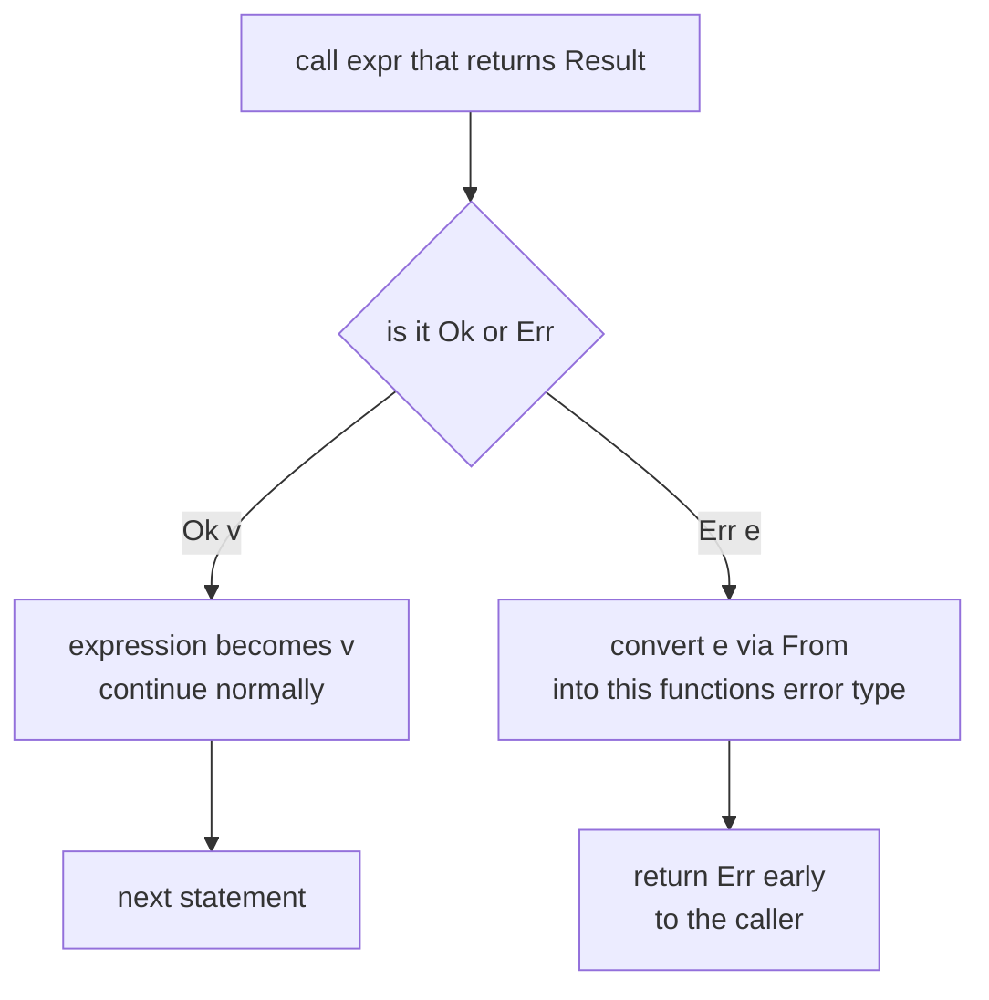
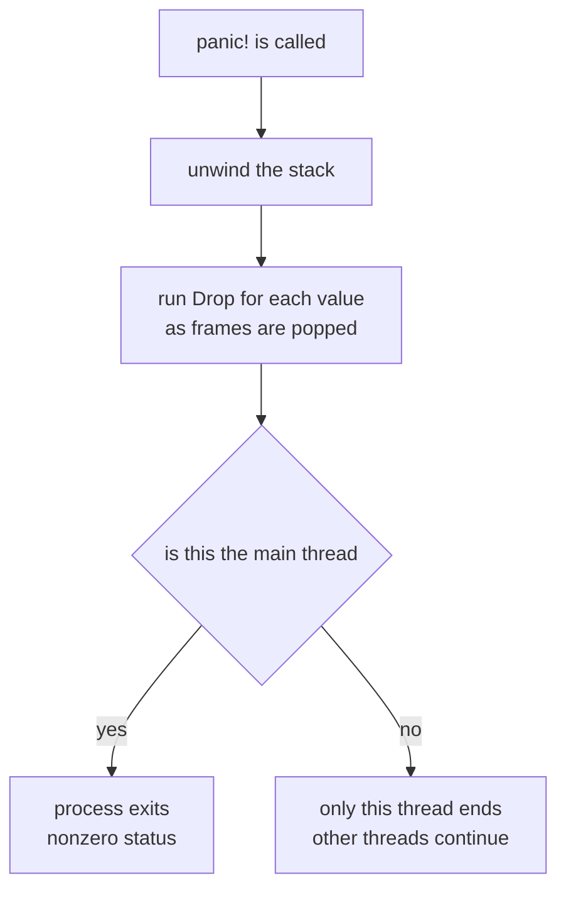

# Chapter 13 — Error Handling

> **What you'll learn.** How Rust handles failure without exceptions: recoverable
> errors as `Result<T, E>` values, the `?` operator for clean propagation, how to
> define your own error types, and when `panic!` is the right tool. You will see
> how this beats C's return codes and `errno`.

## Two kinds of failure

Rust splits failure into two clear categories, and it has **no exceptions** at all.

- **Recoverable errors** — things that can reasonably go wrong: a file is missing, a
  number will not parse, a network call times out. These are returned as ordinary
  values of type `Result<T, E>`. The caller decides what to do.
- **Unrecoverable errors** — bugs and broken assumptions: an index is out of bounds,
  an invariant is violated, "this can never happen" happened. These call `panic!`,
  which stops the current thread.

> **C vs Rust.** C has neither exceptions (in the C++ sense) nor a `Result` type. It
> uses return codes and the global `errno`, and *nothing forces the caller to
> check*. Rust makes the error part of the return type and warns if you ignore it.

## `Result<T, E>` is just an enum

As we saw in Chapter 12 — Enums and Pattern Matching, `Result` is an ordinary enum
from the standard library:

```rust
enum Result<T, E> {
    Ok(T),     // success, holding the produced value of type T
    Err(E),    // failure, holding an error value of type E
}
```

A function that can fail returns a `Result`. The caller cannot reach the success
value without acknowledging that an error is possible. Here is the most explicit way
to handle one — a `match`:

```rust
use std::num::ParseIntError;

fn double(s: &str) -> Result<i32, ParseIntError> {
    match s.parse::<i32>() {
        Ok(n) => Ok(n * 2),
        Err(e) => Err(e),
    }
}

fn main() {
    match double("21") {
        Ok(n) => println!("doubled: {n}"),
        Err(e) => println!("bad input: {e}"),
    }
}
```

> **Watch out.** `Result` is marked `#[must_use]`. If you call a function that
> returns a `Result` and ignore the value, the compiler issues a warning:
> `unused Result that must be used`. In C, ignoring a return code is silent and
> common. In Rust the tooling nags you to handle it.

## The `?` operator: clean propagation

Most of the time a function does not want to *handle* an error from a call it makes;
it wants to **pass it up** to its own caller. Doing that with `match` everywhere is
noisy. The `?` operator does it in one character.

When you write `expr?`:

- If `expr` is `Ok(v)`, the expression evaluates to `v` and execution continues.
- If `expr` is `Err(e)`, the function **returns early** with `Err(e)` — after
  converting `e` into the function's own error type via the `From` trait.

Here is a function that reads a file and parses the first line as a number, written
the verbose way first:

```rust
use std::fs::File;
use std::io::{self, Read};

// Verbose: explicit match at every fallible step.
fn read_number_verbose(path: &str) -> Result<i32, io::Error> {
    let mut file = match File::open(path) {
        Ok(f) => f,
        Err(e) => return Err(e),
    };
    let mut text = String::new();
    match file.read_to_string(&mut text) {
        Ok(_) => {}
        Err(e) => return Err(e),
    }
    // parse() returns a different error type; map it into io::Error.
    match text.trim().parse::<i32>() {
        Ok(n) => Ok(n),
        Err(e) => Err(io::Error::new(io::ErrorKind::InvalidData, e)),
    }
}

fn main() {
    match read_number_verbose("number.txt") {
        Ok(n) => println!("number is {n}"),
        Err(e) => println!("error: {e}"),
    }
}
```

Now the same logic with `?`. Each `?` replaces a whole `match`-and-return block:

```rust
use std::fs;
use std::error::Error;

// Clean: `?` propagates and converts errors automatically.
fn read_number(path: &str) -> Result<i32, Box<dyn Error>> {
    let text = fs::read_to_string(path)?; // io::Error -> Box<dyn Error> via From
    let n = text.trim().parse::<i32>()?;  // ParseIntError -> Box<dyn Error> via From
    Ok(n)
}

fn main() {
    match read_number("number.txt") {
        Ok(n) => println!("number is {n}"),
        Err(e) => println!("error: {e}"),
    }
}
```

The second version reads top to bottom like the happy path, with `?` marking the
spots that may bail out. The two different error types (`io::Error` and
`ParseIntError`) are both converted into `Box<dyn Error>` automatically, because the
standard library provides the `From` conversions.

> **C vs Rust.** This is the cleanest contrast in the whole book. In C you write
> `if (rc != 0) return rc;` after almost every call, and you must convert error
> codes by hand. In Rust `?` is that pattern, built into the language, type-checked,
> and with the conversion done for you.

### How `?` flows



### Where `?` is allowed

`?` only works inside a function whose return type can express the early exit:

- A function returning `Result<T, E>` — `?` on a `Result` works if the error
  converts into `E`.
- A function returning `Option<T>` — `?` on an `Option` returns `None` early.
- You **cannot** mix them: `?` on a `Result` in a function returning `Option` (or
  vice versa) will not compile.

```rust
// COMPILE ERROR: the `?` operator can only be used in a function that returns Result or Option
fn bad(s: &str) -> i32 {
    let n = s.parse::<i32>()?; // error[E0277]: `i32` is not `Try`/`FromResidual`
    n
}

fn main() {
    println!("{}", bad("3"));
}
```

### `?` in `main`

`main` can return a `Result`, which lets you use `?` directly in it. The common
signature is:

```rust
use std::error::Error;
use std::fs;

fn main() -> Result<(), Box<dyn Error>> {
    let text = fs::read_to_string("number.txt")?;
    let n: i32 = text.trim().parse()?;
    println!("number is {n}");
    Ok(()) // success: the unit value () means "nothing to return, no error"
}
```

If `main` returns `Err`, the program prints the error (using its `Debug` form) and
exits with a non-zero status code. `Box<dyn Error>` means "a boxed error of any type
that implements the `Error` trait" — a catch-all that lets `?` accept many different
error types in one function (more on trait objects in Chapter 15 — Traits).

## Handling a `Result` with combinators

Between a full `match` and a bare `?`, the standard library offers helper methods
("combinators") for common moves. A few you will reach for often:

```rust
fn main() {
    let parsed: Result<i32, _> = "x".parse::<i32>();

    // Provide a fallback value computed from the error.
    let n = parsed.unwrap_or_else(|_| -1);
    println!("{n}"); // -1

    // Replace the error with a different type or message.
    let mapped: Result<i32, String> =
        "x".parse::<i32>().map_err(|e| format!("not a number: {e}"));
    println!("{mapped:?}"); // Err("not a number: invalid digit found in string")

    // Throw away the error and get an Option instead.
    let opt: Option<i32> = "5".parse::<i32>().ok();
    println!("{opt:?}"); // Some(5)
}
```

- `unwrap_or_else(f)` — return the `Ok` value, or compute a fallback from the error.
- `map_err(f)` — transform the `Err` value, leaving `Ok` untouched. Useful for
  converting one error type into another.
- `.ok()` — discard the error and convert `Result<T, E>` into `Option<T>`.

There is also `unwrap_or(default)` (a plain fallback value) and `map(f)` (transform
the `Ok` value), which work just like their `Option` versions from Chapter 12.

## Defining your own error type

For a real library you usually define one error `enum` that lists everything that
can go wrong. To behave like a standard error, it should implement two traits:
`std::fmt::Display` (a human-readable message) and `std::error::Error` (the marker
trait for errors). Implementing `From` for the underlying errors lets `?` convert
into your type automatically.

```rust
use std::fmt;

#[derive(Debug)]
enum ConfigError {
    Io(std::io::Error),
    Parse(std::num::ParseIntError),
    Empty,
}

// Display: the message a user sees.
impl fmt::Display for ConfigError {
    fn fmt(&self, f: &mut fmt::Formatter<'_>) -> fmt::Result {
        match self {
            ConfigError::Io(e) => write!(f, "I/O error: {e}"),
            ConfigError::Parse(e) => write!(f, "parse error: {e}"),
            ConfigError::Empty => write!(f, "the config was empty"),
        }
    }
}

// Marker trait: now ConfigError is a real error type.
impl std::error::Error for ConfigError {}

// From conversions let `?` turn the source error into ConfigError automatically.
impl From<std::io::Error> for ConfigError {
    fn from(e: std::io::Error) -> Self {
        ConfigError::Io(e)
    }
}
impl From<std::num::ParseIntError> for ConfigError {
    fn from(e: std::num::ParseIntError) -> Self {
        ConfigError::Parse(e)
    }
}

fn load(path: &str) -> Result<i32, ConfigError> {
    let text = std::fs::read_to_string(path)?; // io::Error -> ConfigError
    let trimmed = text.trim();
    if trimmed.is_empty() {
        return Err(ConfigError::Empty);
    }
    let value: i32 = trimmed.parse()?;          // ParseIntError -> ConfigError
    Ok(value)
}

fn main() {
    match load("config.txt") {
        Ok(v) => println!("loaded {v}"),
        Err(e) => println!("could not load: {e}"), // uses Display
    }
}
```

Notice that `load` uses `?` on two different error types, and each is converted into
`ConfigError` by the matching `From` implementation. This is the same machinery the
`Box<dyn Error>` example used; here you control the exact error type instead.

> **C vs Rust.** This is like a C library that returns its own `enum ErrorCode`,
> except the error can carry data (the underlying cause), formats itself, and is
> impossible to ignore silently.

### Use crates in real projects

Writing `Display`, `Error`, and `From` by hand is repetitive. The Rust ecosystem has
two standard crates that you should know:

- **`thiserror`** — for **libraries**. A `#[derive(Error)]` macro generates the
  `Display` and `From` boilerplate from simple attributes, while keeping a concrete,
  named error type that callers can match on.
- **`anyhow`** — for **applications**. It provides `anyhow::Error` (a smart
  `Box<dyn Error>`) and `anyhow::Result<T>`, so you can propagate any error with `?`
  and attach context, without defining your own type.

> **Rule of thumb.** In a library, define a precise error type (use `thiserror`); the
> caller may want to match on specific cases. In an application or CLI, use `anyhow`
> for easy propagation, because you usually just report the error and exit.

## `panic!`: for unrecoverable errors

`panic!` stops normal execution. Use it for situations that *should never happen* —
a violated invariant, an impossible state, a bug. It is not for ordinary errors that
a caller could handle.

```rust
fn main() {
    let config_present = false;
    if !config_present {
        // Truly broken state: better to stop than to limp along with bad data.
        panic!("internal invariant broken: config must be loaded by now");
    }
}
```

Two convenience methods panic for you:

- `.unwrap()` — on `Ok(v)`/`Some(v)` gives `v`; on `Err`/`None` it **panics**.
- `.expect("message")` — same, but with a custom panic message. Prefer it over
  `.unwrap()` so the crash explains itself.

```rust
fn main() {
    let n: i32 = "42".parse().expect("the literal 42 must parse");
    println!("{n}");
    // "abc".parse::<i32>().unwrap();  // would panic: called unwrap on an Err value
}
```

When is panicking acceptable?

- **Truly unrecoverable situations** and broken invariants ("this cannot happen").
- **Prototypes and examples**, to keep the focus on the main idea (this book uses
  `.unwrap()` that way, with a caveat each time).
- **Tests**, where a panic correctly marks the test as failed.

> **Rule of thumb.** Never `panic!`, `.unwrap()`, or `.expect()` in library code for
> errors a caller might recover from. Return a `Result` instead. A library that
> panics takes the choice away from its user and can crash their whole program.

### What a panic actually does

By default a panic **unwinds** the stack: it walks back up the call chain, running
each value's `Drop` (so destructors run and resources are freed — see Chapter 7 —
Ownership and Moves), then ends the thread. If the panicking thread is the main
thread, the whole program exits with a failure status.



You can switch to **abort** instead of unwind by setting `panic = "abort"` in
`Cargo.toml`. Then a panic immediately ends the process without running destructors
— smaller binaries and no unwinding machinery, at the cost of no cleanup.

`std::panic::catch_unwind` can catch an unwinding panic at a boundary (for example,
to stop a panic from crossing into C code via FFI). It is **not** a general
try/catch and must not be used for ordinary control flow.

> **C vs Rust.** A C `abort()` or segfault just dies. A Rust unwinding panic runs
> destructors on the way out, so files close and locks release. But a panic is still
> a crash, not a recoverable error — reach for `Result` for anything a caller should
> handle.

## C errno vs Rust Result, side by side

| Concept | C | Rust |
|---|---|---|
| Report failure | return code and/or `errno` | `Result<T, E>` value |
| Ignoring it | silent, very common | `#[must_use]` warning |
| Propagate up | `if (rc) return rc;` by hand | `?` operator |
| Convert error type | manual mapping | `From` trait, automatic with `?` |
| Carry detail | an `int` code, look up meaning | the `Err` value carries data |
| Unrecoverable bug | `abort()` / undefined behavior | `panic!` (unwind, run `Drop`) |
| Exceptions | none (C++ has them) | none — Rust rejects them for errors |

## Key takeaways

- Rust has **no exceptions**. Recoverable failure is a `Result<T, E>` value;
  unrecoverable failure is `panic!`.
- `Result` is an enum (`Ok`/`Err`) and is `#[must_use]`, so ignoring it warns.
  Handle it with `match`, with combinators (`unwrap_or_else`, `map_err`, `ok`), or
  with `?`.
- The `?` operator returns the `Err` (or `None`) early and converts the error via
  the `From` trait. It works in functions returning `Result` or `Option`.
- `fn main() -> Result<(), Box<dyn Error>>` lets you use `?` in `main`.
  `Box<dyn Error>` is the easy catch-all for propagation.
- Define a custom error `enum` implementing `Display` + `Error` (+ `From` for `?`),
  or use **`thiserror`** for libraries and **`anyhow`** for applications.
- `panic!`, `.unwrap()`, `.expect()` are for truly unrecoverable situations,
  prototypes, and tests — not for library errors. A panic unwinds the stack (running
  `Drop`) by default, or aborts; an unrecovered panic ends the thread.

## Watch out (gotchas for C programmers)

- **Do not ignore a `Result`.** It is `#[must_use]`; the compiler warns. Use the
  value, propagate with `?`, or explicitly discard with `let _ =` if you really mean
  to.
- **`.unwrap()`/`.expect()` panic.** On `Err` or `None` they crash the thread. Fine
  for prototypes and tests; risky in shipping code. Prefer `?` or a `match`.
- **`?` needs a compatible return type.** It only works where the function returns
  `Result` or `Option`, and the error must convert into the function's error type
  via `From`. Otherwise you get a compile error.
- **Do not `panic!` in library code** for recoverable errors. Return a `Result` and
  let the caller decide. Panicking can crash an application that depended on you.
- **Error conversion is via `From`.** To let `?` turn error type `A` into your error
  type `B`, implement `From<A> for B` (or derive it with `thiserror`).
- **A panic is not try/catch.** `catch_unwind` exists for boundaries (like FFI), not
  for normal error flow. Treat panics as crashes, not as a control structure.

## Interview questions

**Q: What are the two kinds of error in Rust, and which type goes with each?**
A: Recoverable errors use `Result<T, E>` — a returned value the caller must handle,
for expected failures like a missing file. Unrecoverable errors use `panic!` — for
bugs and broken invariants. Rust has no exceptions; both are explicit and distinct.

**Q: What exactly does the `?` operator do?**
A: For an expression of type `Result`, `?` evaluates to the inner value if it is
`Ok`, or returns `Err` early from the current function if it is `Err`, converting the
error into the function's error type via the `From` trait. It also works on `Option`,
returning `None` early. It is only allowed in functions that return `Result` or
`Option`.

**Q: How is Rust's error handling safer than C's return codes and `errno`?**
A: In C nothing forces a caller to check a return code, and `errno` is a separate
global that is easy to misuse. In Rust the error is part of the return type
`Result<T, E>`, which is `#[must_use]`, so ignoring it warns. The `?` operator gives
clean, type-checked propagation, and the `Err` value can carry rich detail instead of
a bare integer code.

**Q: When is it acceptable to call `.unwrap()` or `panic!`?**
A: When the failure is truly unrecoverable or represents a bug (a violated invariant,
an impossible state), and in prototypes, examples, and tests where stopping is the
right behavior. In library code that handles recoverable errors, you should return a
`Result` instead, so callers keep control.

**Q: What happens when a panic occurs, by default?**
A: By default the stack unwinds: each stack frame is popped and the `Drop` of each
value runs, so resources are released cleanly, then the thread ends. If it is the
main thread, the process exits with a non-zero status. You can instead configure
`panic = "abort"`, which ends the process immediately without running destructors.

## Try it

1. Write `fn parse_sum(a: &str, b: &str) -> Result<i32, std::num::ParseIntError>`
   that parses both strings and returns their sum, using `?` for both parses.
2. Change `parse_sum` to return `Result<i32, Box<dyn std::error::Error>>` and call it
   from a `main` that also returns `Result<(), Box<dyn std::error::Error>>`, using
   `?` throughout. Feed it `"3"` and `"x"` and watch the error print.
3. Define a small error enum with two variants, implement `Display` and `Error`, add
   the `From` conversions, and rewrite the function to use your type. Then look up
   `thiserror` and rewrite it again with `#[derive(Error)]`.
