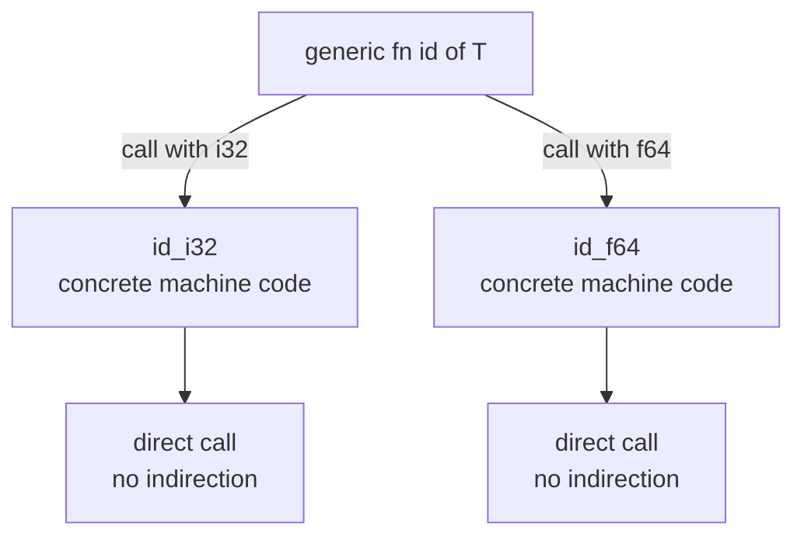

# Chapter 14 — Generics

> **What you'll learn.** How to write one piece of code that works for many
> types, without giving up type safety or speed. You will see generic functions,
> structs, enums, and methods; trait bounds (a preview of Chapter 15 — Traits);
> and *monomorphization*, the trick that makes Rust generics cost nothing at run
> time — unlike C macros and `void *`.

## The problem: writing the same code twice

In C, suppose you want a function that returns the larger of two values. You
write one for `int`:

```c
int max_int(int a, int b) {
    return a > b ? a : b;
}
```

Now you need it for `double`. C has no real way to reuse the body, so you have
three bad choices:

- **Copy and paste.** Write `max_double`, `max_long`, and so on. The code drifts
  and bugs multiply.
- **A macro.** `#define MAX(a, b) ((a) > (b) ? (a) : (b))`. This is *untyped*
  text substitution. It works on anything, but the compiler checks nothing, it
  can evaluate its arguments twice (`MAX(i++, j)` is a bug), and the error
  messages are terrible.
- **`void *` and a comparison callback**, like `qsort`. This works for any type
  but throws away type information. You cast pointers, you pass element sizes by
  hand, and a single wrong cast is undefined behavior — at run time, not compile
  time.

Rust solves this with **generics**: code written once, with a *placeholder* for
the type, that the compiler checks fully and specializes for each concrete type
you actually use. You get the flexibility of a macro, the safety of a normal
function, and the speed of hand-written code.

> **Mental model.** A generic is a template with a hole for a type. The compiler
> fills the hole separately for every type you use, and type-checks each filled
> copy. It is C++ templates done with full checking, or a C macro that the
> compiler actually understands.

## Generic functions

A **type parameter** is a name (by convention a single capital letter like `T`)
that stands for "some type, chosen later." You declare it in angle brackets after
the function name.

```rust
fn largest<T: PartialOrd>(list: &[T]) -> &T {
    let mut biggest = &list[0];
    for item in list {
        if item > biggest {
            biggest = item;
        }
    }
    biggest
}

fn main() {
    let numbers = vec![34, 50, 25, 100, 65];
    let chars = vec!['y', 'm', 'a', 'q'];

    println!("largest number: {}", largest(&numbers));
    println!("largest char:   {}", largest(&chars));
}
```

Read the signature piece by piece:

- `<T: PartialOrd>` declares a type parameter `T`. The `: PartialOrd` part is a
  **trait bound** (more below): it says "`T` must be a type you can compare with
  `<` and `>`."
- `list: &[T]` takes a slice of `T` (a borrowed view of a contiguous array — see
  Chapter 10 — Slices and Strings).
- `-> &T` returns a reference to one element.

You call it with no special syntax: `largest(&numbers)`. The compiler **infers**
that `T` is `i32` from the argument. For `chars`, it infers `T` is `char`. One
function body, many types, all checked.

> **C vs Rust.** In C, `qsort` takes a `void *` array, an element size, and a
> comparison function pointer. Nothing stops you from passing the wrong size or a
> comparison meant for a different type — the mistake shows up as a crash or
> garbage at run time. The Rust generic carries the real type `T` through, so the
> wrong type is a compile error.

### Why you need a trait bound

This is the first surprise for C programmers. You **cannot** do just anything to
a value of a generic type. The compiler must know the operation is valid for
*every* type `T` might be. Without a bound, `T` is a complete unknown, so almost
nothing is allowed.

```rust
// COMPILE ERROR: binary operation `>` cannot be applied to type `&T`
fn largest<T>(list: &[T]) -> &T {
    let mut biggest = &list[0];
    for item in list {
        if item > biggest {   // error[E0369]: `T` has no `>` unless bounded
            biggest = item;
        }
    }
    biggest
}
```

The fix is the bound `T: PartialOrd`, which promises "`T` supports comparison."
A trait bound is a *contract*: it lists the abilities `T` must have, so the
compiler can verify the body once and trust it for all valid types.

> **C vs Rust.** A C macro never checks this. `MAX(a, b)` expands to text that
> uses `>`; if `a` and `b` are structs, you get a confusing error deep inside the
> expansion, far from the call. Rust reports the missing ability right at the
> bound, in plain language.

## Generic structs

A struct can hold fields of a generic type. The type parameter goes after the
struct name.

```rust
struct Point<T> {
    x: T,
    y: T,
}

fn main() {
    let integer = Point { x: 5, y: 10 };       // Point<i32>
    let float = Point { x: 1.0, y: 4.0 };      // Point<f64>

    println!("{} {}", integer.x, float.y);
}
```

`Point<T>` is like a C struct where the field type is a parameter you pick when
you create the value. Note both fields here share **one** parameter `T`, so
`x` and `y` must be the *same* type. `Point { x: 5, y: 1.0 }` would not compile.

### Multiple type parameters

If two fields may differ, use two parameters.

```rust
struct Pair<T, U> {
    first: T,
    second: U,
}

fn main() {
    let mixed = Pair { first: 5, second: "hello" };   // Pair<i32, &str>
    println!("{} {}", mixed.first, mixed.second);
}
```

> **Rule of thumb.** Add only as many type parameters as you truly need. Each one
> is another thing the caller (and the reader) must track. Two or three is
> common; more usually means the design needs rethinking.

## Generic enums

You have already used generic enums, even if you did not notice. The two most
important types in Rust are generic enums from the standard library:

```rust
enum Option<T> {
    Some(T),
    None,
}

enum Result<T, E> {
    Ok(T),
    Err(E),
}
```

`Option<T>` means "maybe a `T`" (Chapter 12 — Enums and Pattern Matching), and
`Result<T, E>` means "a `T` on success or an `E` on error" (Chapter 13 — Error
Handling). They are ordinary generic enums; nothing about them is magic. You can
write your own the same way:

```rust
enum Tree<T> {
    Leaf(T),
    Node(Box<Tree<T>>, Box<Tree<T>>),
}
```

## Generic methods

You implement methods on a generic type with `impl<T>`. The `<T>` right after
`impl` declares the parameter so the rest of the block can use it.

```rust
struct Point<T> {
    x: T,
    y: T,
}

impl<T> Point<T> {
    fn x(&self) -> &T {
        &self.x
    }
}

fn main() {
    let p = Point { x: 5, y: 10 };
    println!("{}", p.x());
}
```

You can also write methods for **one** concrete type only. This block adds a
method that exists just for `Point<f64>`:

```rust
struct Point<T> {
    x: T,
    y: T,
}

impl Point<f64> {
    fn distance_from_origin(&self) -> f64 {
        (self.x * self.x + self.y * self.y).sqrt()
    }
}

fn main() {
    let p = Point { x: 3.0, y: 4.0 };
    println!("{}", p.distance_from_origin());   // 5.0
}
```

A `Point<i32>` would not have `distance_from_origin`, because `sqrt` is a method
on floating-point numbers only. This lets you give extra abilities to specific
versions of a generic type.

## Trait bounds in depth

A **trait** is a named set of behaviors (the full topic of Chapter 15 — Traits).
For now, treat a trait as an *interface*: a list of methods or operators a type
provides. A **trait bound** restricts a type parameter to types that implement a
given trait.

You need a bound to use any operation on a generic value, because the compiler
must guarantee the operation exists for every possible `T`.

### Multiple bounds with `+`

Require several traits at once by joining them with `+`.

```rust
use std::fmt::Display;

fn show_largest<T: PartialOrd + Display>(list: &[T]) {
    let mut biggest = &list[0];
    for item in list {
        if item > biggest {
            biggest = item;
        }
    }
    println!("largest is {biggest}");
}

fn main() {
    show_largest(&[3, 7, 2, 9, 4]);
}
```

Here `T` must be both comparable (`PartialOrd`) **and** printable (`Display`).

### `where` clauses for readability

When a function has several parameters with several bounds, the signature gets
crowded. A `where` clause moves the bounds below the signature, where they are
easier to read.

```rust
use std::fmt::{Debug, Display};

// Hard to read:
fn report<T: Display + Clone, U: Clone + Debug>(t: &T, u: &U) {
    println!("{t}");
    let _t2 = t.clone();
    let _u2 = u.clone();
    println!("{u:?}");
}

// Same thing, easier to read with `where`:
fn report2<T, U>(t: &T, u: &U)
where
    T: Display + Clone,
    U: Clone + Debug,
{
    println!("{t}");
    let _t2 = t.clone();
    let _u2 = u.clone();
    println!("{u:?}");
}

fn main() {
    report(&"hi", &vec![1, 2, 3]);
    report2(&"hi", &vec![1, 2, 3]);
}
```

> **Rule of thumb.** Use inline bounds (`<T: Clone>`) for one or two simple
> bounds; switch to `where` once the line gets long or there are several
> parameters. Both mean exactly the same thing.

## Monomorphization: generics with zero runtime cost

Here is the key idea, and the reason Rust generics are not like C `void *`
callbacks.

When you call a generic function with a concrete type, the compiler generates a
**separate, specialized copy** of the function for that type, with `T` replaced
by the real type. This process is called **monomorphization** (turning one
"poly-typed" function into many "mono-typed" ones).

Take this code:

```rust
fn id<T>(x: T) -> T {
    x
}

fn main() {
    let a = id(5);       // T = i32
    let b = id(2.5);     // T = f64
}
```

The compiler effectively rewrites it into two ordinary, non-generic functions,
as if you had written:

```rust
fn id_i32(x: i32) -> i32 { x }
fn id_f64(x: f64) -> f64 { x }

fn main() {
    let a = id_i32(5);
    let b = id_f64(2.5);
}
```



Because each copy is a normal function with concrete types, there is:

- **No run-time type lookup.** The type is fixed at compile time.
- **No pointer indirection.** Unlike a `void *` callback, there is no function
  pointer to follow; calls can be inlined.
- **Full optimization.** The compiler optimizes each copy as if you wrote it by
  hand. This is what "zero-cost abstraction" means.

> **C vs Rust.** A `qsort`-style design pays at run time: every comparison is an
> indirect call through a function pointer, and the compiler cannot inline it.
> Rust's monomorphized generic has no indirection at all — it runs exactly as
> fast as a version you wrote for that one type by hand.

### The trade-off: code size

Monomorphization is not entirely free. Each concrete type gets its own copy of
the machine code. If you use a big generic function with ten different types, the
compiler emits ten copies. This can grow the binary — an effect known as **code
bloat** — and can lengthen compile times.

| Concept | C macro | C `void *` callback | Rust generic |
|---|---|---|---|
| Type checked | No (text substitution) | Weakly (casts) | Fully, at compile time |
| Run-time cost | None | Indirection per call | None (monomorphized) |
| Code size | One copy per use site (inlined) | One shared copy | One copy per concrete type |
| Error messages | Poor, inside expansion | Crash at run time | Precise, at the bound |
| Can be inlined | Yes | No | Yes |

> **Rule of thumb.** Reach for generics by default; the speed is worth it. If
> binary size matters a lot (embedded targets) and a function is large, you can
> trade speed for size by using a trait object (`dyn Trait`, Chapter 15 —
> Traits), which keeps a single shared copy.

## Const generics

So far the parameter has been a *type*. A **const generic** lets the parameter be
a *value* known at compile time — almost always an array length. This is how
Rust talks about fixed-size arrays `[T; N]` in generic code.

```rust
struct Buffer<const N: usize> {
    data: [u8; N],
}

impl<const N: usize> Buffer<N> {
    fn new() -> Self {
        Buffer { data: [0; N] }
    }

    fn len(&self) -> usize {
        N
    }
}

fn main() {
    let small: Buffer<8> = Buffer::new();
    let big: Buffer<1024> = Buffer::new();

    println!("{} {}", small.len(), big.len());   // 8 1024
}
```

`Buffer<8>` and `Buffer<1024>` are different types with different sizes, both
generated from one definition. The length lives in the type, so it costs nothing
at run time and the size is known to the optimizer.

> **C vs Rust.** In C you would pass the size as a separate `size_t` argument, or
> bake it in with a macro. A const generic ties the size to the type itself, so
> the compiler checks it and the wrong size cannot slip through.

## The turbofish: helping inference

Usually the compiler infers type parameters from the arguments. Sometimes it
cannot — there are no arguments to look at, or several types would fit. Then you
spell out the type with the **turbofish** syntax: `::<Type>` after the name.

```rust
fn main() {
    // `parse` could produce many number types. Which one? Tell it.
    let n = "42".parse::<i32>().unwrap();     // turbofish picks i32
    println!("{n}");

    // `collect` can build many collections. Annotate the target type.
    let v = (1..=5).collect::<Vec<i32>>();
    println!("{v:?}");

    // An equivalent way: annotate the variable instead of using turbofish.
    let v2: Vec<i32> = (1..=5).collect();
    println!("{v2:?}");
}
```

The name "turbofish" comes from the shape `::<>`. You need it whenever the result
type cannot be inferred from context. The two common cases are `parse` and
`collect`, because both can produce many different types.

> **Watch out.** Forgetting the turbofish on `parse`/`collect` gives an error
> like "type annotations needed." The compiler is not confused about your logic;
> it just cannot guess the target type. Add `::<T>` or annotate the variable.

## Static dispatch (a look ahead)

Everything in this chapter uses **static dispatch**: the exact function to call
is chosen at *compile time*, because monomorphization produces a concrete
function for each type. There is no run-time decision.

The opposite is **dynamic dispatch**, where the type is decided at *run time* and
the call goes through a table of function pointers (a vtable). Rust does that with
trait objects (`dyn Trait`), the subject of Chapter 15 — Traits. Generics are
fast and inline-able but can grow the binary; trait objects keep one copy but pay
a small run-time cost. Keep this contrast in mind; the next chapter makes it
concrete.

## Key takeaways

- **Generics** let you write code once for many types, with full compile-time
  type checking — unlike C macros (untyped text) and `void *` (unchecked casts).
- A **type parameter** like `<T>` is a placeholder filled in per call. Structs,
  enums, functions, and methods can all be generic. `Option<T>` and
  `Result<T, E>` are just generic enums.
- You need a **trait bound** (`T: SomeTrait`) to use any operation on a generic
  value; the compiler must know the operation is valid for every possible type.
  Combine bounds with `+` and tidy them with `where`.
- **Monomorphization** generates a specialized copy per concrete type, so
  generics have **zero run-time cost** and can be inlined — the trade-off is
  larger code size.
- **Const generics** (`<const N: usize>`) parameterize over a compile-time value,
  usually an array length.
- Use the **turbofish** (`name::<Type>()`) when type inference needs help, most
  often with `parse` and `collect`.

## Watch out (gotchas for C programmers)

- **A generic type can do almost nothing without a trait bound.** Unlike a C
  macro that just substitutes text, the compiler refuses operations it cannot
  prove valid for all `T`. Add the bound that names the ability you need.
- **Monomorphization can bloat the binary.** Many concrete types means many code
  copies. If size matters, consider a trait object (`dyn`, Chapter 15 — Traits).
- **Generics are resolved at compile time (static dispatch).** There is no
  run-time flexibility here; for run-time polymorphism you need `dyn Trait`.
- **`Point<T>` with one parameter forces both fields to the same type.** Use two
  parameters (`Point<T, U>`) when they may differ.
- **Inference is not magic.** When the result type is ambiguous (`parse`,
  `collect`), you must use the turbofish or annotate the variable.

## Interview questions

**Q: What is monomorphization, and what does it cost?**
A: Monomorphization is the compiler generating a separate, specialized copy of a
generic function or type for each concrete type it is used with, replacing the
type parameter with the real type. The benefit is zero run-time cost: no
indirection, full inlining, code as fast as hand-written. The cost is larger
binary size and potentially longer compile times, because each concrete type
gets its own copy.

**Q: Why must a generic function declare trait bounds to use operators or
methods on its parameters?**
A: Inside a generic function the type is unknown, so the compiler must prove that
every operation is valid for *every* type the function could be called with. A
trait bound (for example `T: PartialOrd`) is the contract that guarantees the
needed ability exists, letting the compiler check the body once and trust it for
all valid types.

**Q: How do Rust generics differ from C macros and from `void *` callbacks?**
A: A C macro is untyped text substitution with no checking and can evaluate
arguments multiple times. A `void *` callback throws away type information and
pays a run-time indirection on every call, with mistakes surfacing as crashes.
Rust generics are fully type-checked at compile time and monomorphized, so they
are both type-safe and as fast as specialized hand-written code.

**Q: What is the turbofish, and when do you need it?**
A: The turbofish is the `::<Type>` syntax used to specify a generic type
parameter explicitly, as in `"42".parse::<i32>()`. You need it when the compiler
cannot infer the type from context — most commonly with `parse` and `collect`,
which can each produce many different result types. Annotating the variable's
type is an equivalent alternative.

**Q: What is a const generic?**
A: A const generic is a generic parameter that is a compile-time *value* rather
than a type, declared like `<const N: usize>`. It is most often used for array
lengths, as in `struct Buffer<const N: usize> { data: [u8; N] }`. The value lives
in the type, so different lengths are different types and there is no run-time
cost.

## Try it

1. Write `fn first<T: Clone>(list: &[T]) -> T { list[0].clone() }` and call it on
   a `Vec<i32>` and a `Vec<String>`. Remove the `Clone` bound and read the error.
2. Make a generic `struct Wrapper<T>(T);` with a method `fn get(&self) -> &T`.
   Then add an `impl Wrapper<i32>` block with a method that only `i32` wrappers
   have, and confirm a `Wrapper<&str>` does not get it.
3. Call `let v = (1..10).collect();` with no type annotation, read the
   "type annotations needed" error, then fix it two ways: with a turbofish and
   with a variable annotation.
