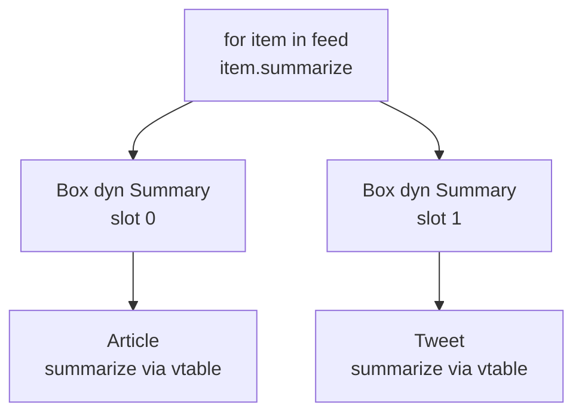
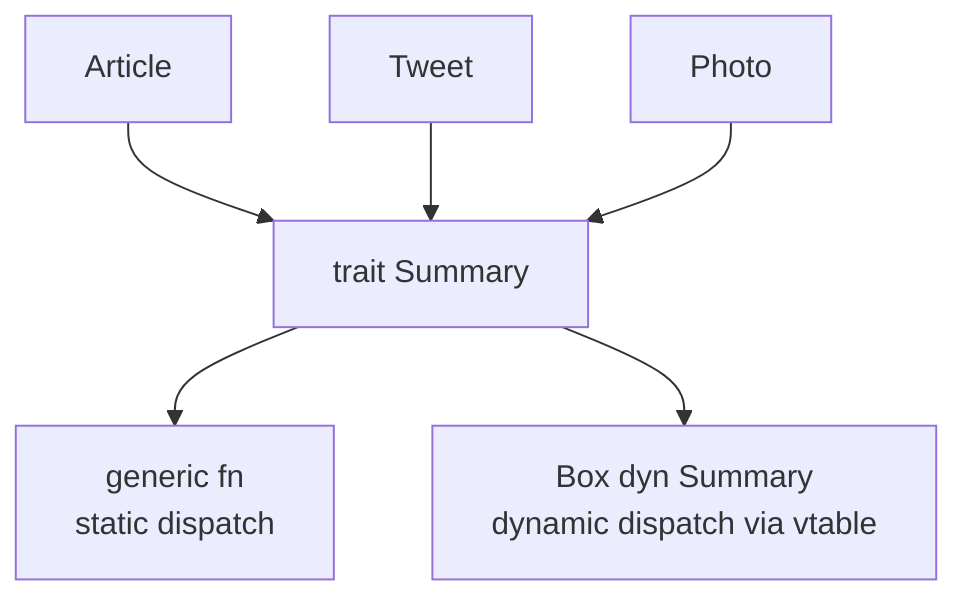

# Chapter 15 — Traits

> **What you'll learn.** How Rust expresses *shared behavior* with traits — the
> rough equivalent of C interfaces built from structs of function pointers, but
> type-checked. You will learn how to define and implement traits, the difference
> between static and dynamic dispatch (trait objects and their vtables), the
> orphan rule, and the standard-library traits every Rust programmer must know.

## What a trait is

A **trait** is a named set of methods that a type can promise to provide. It
describes *behavior*, not data. If you know other languages, a trait is close to
an *interface* (Java, Go) or a *typeclass* (Haskell). For a C programmer, the
closest familiar thing is a **struct of function pointers** that several types
agree to fill in — except a trait is checked by the compiler, so you can never
forget a method or get a signature wrong.

```rust
trait Summary {
    fn summarize(&self) -> String;
}
```

This says: "Any type that *is* `Summary` must have a method `summarize` returning
a `String`." It is a contract. By itself it does nothing; types must opt in.

> **Mental model.** A trait is a checklist of abilities. A type that wants those
> abilities implements the trait and fills in every item on the checklist. Code
> can then accept "any type that ticks this checklist" instead of one fixed type.

## Implementing a trait

You connect a trait to a type with an `impl Trait for Type` block.

```rust
trait Summary {
    fn summarize(&self) -> String;
}

struct Article {
    title: String,
    body: String,
}

struct Tweet {
    user: String,
    text: String,
}

impl Summary for Article {
    fn summarize(&self) -> String {
        format!("{}: {}...", self.title, &self.body[..10.min(self.body.len())])
    }
}

impl Summary for Tweet {
    fn summarize(&self) -> String {
        format!("@{}: {}", self.user, self.text)
    }
}

fn main() {
    let a = Article {
        title: String::from("Rust 1.96"),
        body: String::from("A new release with many improvements."),
    };
    let t = Tweet {
        user: String::from("rustlang"),
        text: String::from("we shipped"),
    };

    println!("{}", a.summarize());
    println!("{}", t.summarize());
}
```

Two unrelated types now share one behavior. Note that the method is called with
ordinary dot syntax, `a.summarize()`, exactly like a normal method.

> **C vs Rust.** In C you would define `struct SummaryOps { char *(*summarize)(void *self); }`
> and give each type its own ops table plus a `void *self`. You must wire the
> pointers up by hand and a wrong cast is undefined behavior. A trait does the
> same job, but the compiler builds and checks everything, and there is no
> `void *`.

### Default method implementations

A trait may supply a **default** body for a method. Types that implement the
trait get the default for free and may override it.

```rust
trait Summary {
    fn summarize(&self) -> String {
        String::from("(no summary)")   // default body
    }
}

struct Photo;

impl Summary for Photo {}   // empty: takes the default

fn main() {
    let p = Photo;
    println!("{}", p.summarize());     // prints (no summary)
}
```

A default method may call other methods of the same trait, even ones with no
default. This is how a trait defines a lot of behavior in terms of a few required
methods — the `Iterator` trait does exactly this.

## Using traits to write generic code

Traits become powerful when combined with generics (Chapter 14 — Generics). A
**trait bound** lets a generic function accept any type that implements a trait.

```rust
trait Summary {
    fn summarize(&self) -> String;
}

fn notify<T: Summary>(item: &T) {
    println!("Breaking! {}", item.summarize());
}
```

`notify` works for any `T` that implements `Summary`. Inside the body, the only
thing you may do with `item` is call `Summary` methods — that is exactly what the
bound promised.

### `impl Trait` in argument position

For the common case of "some type that implements this trait," there is a shorter
syntax: write `impl Trait` as the parameter type.

```rust
trait Summary {
    fn summarize(&self) -> String;
}

fn notify(item: &impl Summary) {
    println!("Breaking! {}", item.summarize());
}
```

`&impl Summary` means "a reference to some single type that implements
`Summary`." It is sugar for the generic version above; it still uses static
dispatch and monomorphization. Use it when you do not need to name the type
parameter.

### `impl Trait` in return position

You can also return `impl Trait`, meaning "I return some concrete type that
implements this trait, but I will not spell out which one." This is essential for
returning closures and iterators, whose real types are unnameable.

```rust
fn make_adder(n: i32) -> impl Fn(i32) -> i32 {
    move |x| x + n
}

fn main() {
    let add5 = make_adder(5);
    println!("{}", add5(10));   // 15
}
```

> **Watch out.** `-> impl Trait` returns **one** concrete type, fixed at compile
> time. You cannot return a `Tweet` from one branch and an `Article` from another
> with `-> impl Summary`; for that you need a trait object (`Box<dyn Summary>`,
> below).

## Static vs dynamic dispatch

This is the central idea of the chapter. There are two ways to call a method
through a trait, and a C programmer should understand both clearly.

**Static dispatch** is what generics and `impl Trait` use. The compiler
monomorphizes: it generates a specialized copy of the code for each concrete
type, so the exact function is known at compile time. Calls can be inlined. There
is no run-time cost. The downside is more machine code (see Chapter 14 —
Generics).

**Dynamic dispatch** uses a **trait object**, written `dyn Trait`. The concrete
type is *not* known at compile time. Instead, the call goes through a table of
function pointers — a **vtable** (virtual method table) — chosen at run time.
This keeps one copy of the code and lets a single collection hold many different
types, at the cost of an indirect call that cannot be inlined.

| Aspect | Static (`impl Trait` / generics) | Dynamic (`dyn Trait`) |
|---|---|---|
| When the method is chosen | Compile time | Run time |
| Mechanism | Monomorphized copies | Vtable (function pointers) |
| Speed | Fastest; inlinable | One indirect call per method |
| Code size | One copy per type | One shared copy |
| Can mix types in a collection | No | Yes |
| Pointer size | Normal | Fat pointer (data + vtable) |

### What a trait object looks like in memory

A reference to a trait object is a **fat pointer**: two machine words. The first
points to the data; the second points to the vtable for that type. The vtable
holds the function pointers for the trait's methods (plus the type's size,
alignment, and destructor).

```
let s: &dyn Summary = &tweet;

   s (a &dyn Summary, two words)
  +------------------+------------------+
  |   data pointer   |  vtable pointer  |
  +---------+--------+---------+--------+
            |                  |
            v                  v
       +---------+        +--------------------+
       |  Tweet  |        | vtable for Tweet   |
       |  user   |        +--------------------+
       |  text   |        | drop_in_place ptr  |
       +---------+        | size = 48          |
                          | align = 8          |
                          | summarize -> fn    |
                          +--------------------+
```

Calling `s.summarize()` reads the `summarize` slot from the vtable and calls it,
passing the data pointer as `self`. This is **exactly** the C pattern of a struct
of function pointers plus a `void *self` — but the compiler builds the vtable and
guarantees the function signatures match.

> **C vs Rust.** A C "object" is often `struct { const Ops *vtable; ... data; }`
> where `Ops` is a struct of function pointers. Rust's trait object is the same
> machine idea, split into a (data, vtable) pair, with full type checking and no
> manual wiring.

### Using trait objects

Trait objects appear behind a pointer: `&dyn Trait`, `&mut dyn Trait`, or
`Box<dyn Trait>` (an owning heap pointer — see Chapter 17 — Smart Pointers). The
classic use is a collection of mixed types that share a trait.

```rust
trait Summary {
    fn summarize(&self) -> String;
}

struct Article { title: String }
struct Tweet { user: String }

impl Summary for Article {
    fn summarize(&self) -> String {
        format!("article: {}", self.title)
    }
}
impl Summary for Tweet {
    fn summarize(&self) -> String {
        format!("tweet by @{}", self.user)
    }
}

fn main() {
    // A Vec of different concrete types, unified by `dyn Summary`.
    let feed: Vec<Box<dyn Summary>> = vec![
        Box::new(Article { title: String::from("Rust news") }),
        Box::new(Tweet { user: String::from("rustlang") }),
    ];

    for item in &feed {
        println!("{}", item.summarize());   // dynamic dispatch through the vtable
    }
}
```

You cannot do this with generics: a `Vec<T>` holds one type `T`. The trait object
erases the concrete type and lets one vector hold both.



> **Rule of thumb.** Reach for generics / `impl Trait` by default — they are
> faster. Use `dyn Trait` when you need to store mixed types together, when the
> set of types is open-ended (plugins), or when monomorphized code size is a
> problem.

### Object safety

Not every trait can become a `dyn` trait object. A trait is **object safe** only
if its methods can be dispatched through a vtable. The two main rules:

- Methods must take `self` by reference (`&self` or `&mut self`), not by value or
  as a bare generic, so the vtable can call them through a pointer.
- Methods must not be **generic** (no `fn foo<U>(&self)`), because each `U` would
  need its own vtable slot, which cannot exist.
- The trait must not use `Self` as a return type in a way that needs the concrete
  type (for example returning `Self`), because the concrete type is erased.

```rust
// COMPILE ERROR: the trait `Cloneable` cannot be made into an object
trait Cloneable {
    fn duplicate(&self) -> Self;   // returns Self by value -> not object safe
}

fn store(_x: Box<dyn Cloneable>) {}  // error[E0038]: not object safe

fn main() {}
```

If a trait is not object safe, you simply cannot use `dyn` with it; use generics
instead. Most everyday traits (`Display`, your own service traits) are object
safe.

## The orphan rule (coherence)

You may write `impl Trait for Type` only if **you define the trait, or you define
the type** (or both) in your crate. You cannot implement a trait you do not own
for a type you do not own. This is the **orphan rule**, part of what Rust calls
*coherence*.

```rust
// COMPILE ERROR: only traits defined in the current crate can be implemented
//               for types defined outside of the crate (orphan rule)
impl std::fmt::Display for Vec<i32> {   // both Display and Vec are foreign
    fn fmt(&self, f: &mut std::fmt::Formatter) -> std::fmt::Result {
        write!(f, "len {}", self.len())
    }
}

fn main() {}
```

The reason: if two different crates could both add `impl Display for Vec<i32>`,
the compiler would not know which one to use, and your program's meaning could
change just by adding a dependency. The orphan rule keeps each (trait, type) pair
implemented in exactly one place.

> **Rule of thumb.** To add behavior to a foreign type, wrap it in your own type
> (the *newtype* pattern — Chapter 27 — Idioms and Style): `struct MyVec(Vec<i32>);`,
> then `impl Display for MyVec`. Now the type is yours, so the rule is satisfied.

## The standard-library traits you must know

Rust's standard library defines a small set of traits that appear everywhere.
Knowing them is most of "knowing Rust." Many can be **derived** automatically.

| Trait | What it gives you | Usually obtained by |
|---|---|---|
| `Debug` | `{:?}` developer-facing formatting | `#[derive(Debug)]` |
| `Display` | `{}` user-facing formatting | hand-written |
| `Clone` | explicit deep copy via `.clone()` | `#[derive(Clone)]` |
| `Copy` | implicit bitwise copy on assignment | `#[derive(Copy, Clone)]` |
| `PartialEq` / `Eq` | `==` and `!=` | `#[derive(PartialEq, Eq)]` |
| `PartialOrd` / `Ord` | `<`, `>`, sorting | `#[derive(PartialOrd, Ord)]` |
| `Default` | a default value via `Default::default()` | `#[derive(Default)]` |
| `Hash` | use as a `HashMap` key | `#[derive(Hash)]` |
| `From` / `Into` | type conversions | hand-written |
| `Iterator` | the `for` loop and iterator adapters | hand-written |
| `Drop` | run code when a value is freed (RAII) | hand-written |

### Deriving traits

`#[derive(...)]` tells the compiler to generate a standard implementation for
you. It works when every field also implements the trait.

```rust
#[derive(Debug, Clone, PartialEq, Default)]
struct Point {
    x: i32,
    y: i32,
}

fn main() {
    let p = Point { x: 1, y: 2 };
    let q = p.clone();

    println!("{p:?}");          // Debug: Point { x: 1, y: 2 }
    println!("{}", p == q);     // PartialEq: true
    let origin = Point::default();   // Default: Point { x: 0, y: 0 }
    println!("{origin:?}");
}
```

> **C vs Rust.** In C you write `point_equals`, `point_copy`, and a `print_point`
> by hand for every struct. `#[derive]` generates the correct, field-by-field
> versions for you, and updates them automatically when you add a field.

### `Display` vs `Debug`

This pair confuses newcomers, so be precise:

- **`Debug`** (`{:?}`) is for *programmers*. It shows the structure for debugging
  and logging. You almost always derive it. There is also `{:#?}` for a
  pretty-printed, multi-line form.
- **`Display`** (`{}`) is for *end users*. It is the polished, human-readable
  form. It cannot be derived, because only you know how your type should look to a
  user. You implement it by hand.

```rust
use std::fmt;

struct Temperature {
    celsius: f64,
}

impl fmt::Display for Temperature {
    fn fmt(&self, f: &mut fmt::Formatter) -> fmt::Result {
        write!(f, "{:.1} C", self.celsius)
    }
}

fn main() {
    let t = Temperature { celsius: 21.345 };
    println!("{t}");     // 21.3 C   (Display)
}
```

Implementing `Display` also gives you `.to_string()` for free, because the
standard library provides a blanket implementation of `ToString` for every
`Display` type (more on blanket impls below).

### `From` and `Into`

`From` defines how to build one type from another. Implement `From`, and you get
`Into` automatically — they are two views of the same conversion.

```rust
struct Celsius(f64);
struct Fahrenheit(f64);

impl From<Celsius> for Fahrenheit {
    fn from(c: Celsius) -> Self {
        Fahrenheit(c.0 * 9.0 / 5.0 + 32.0)
    }
}

fn main() {
    let f = Fahrenheit::from(Celsius(100.0));
    let f2: Fahrenheit = Celsius(0.0).into();   // Into comes for free
    println!("{} {}", f.0, f2.0);               // 212 32
}
```

`From`/`Into` also power the `?` operator's error conversion (Chapter 13 — Error
Handling): a `?` can turn one error type into another if a `From` impl exists.

## Associated types

Some traits attach a **type** to the implementation, not just methods. This is an
**associated type**. The standard example is `Iterator`, whose associated type
`Item` names what the iterator yields.

```rust
struct Counter {
    count: u32,
}

impl Iterator for Counter {
    type Item = u32;            // associated type: this iterator yields u32

    fn next(&mut self) -> Option<Self::Item> {
        if self.count < 3 {
            self.count += 1;
            Some(self.count)
        } else {
            None
        }
    }
}

fn main() {
    let total: u32 = Counter { count: 0 }.sum();
    println!("{total}");        // 1 + 2 + 3 = 6
}
```

An associated type is like a type parameter, but the implementer fixes it once
per type, so callers do not have to specify it. `Counter` yields `u32` and nothing
else. Once you implement `next`, you get dozens of methods (`map`, `filter`,
`sum`, ...) for free from default methods on `Iterator` — covered in Chapter 16 —
Collections and Iterators.

## Supertraits

A trait can require that types also implement another trait. The required trait is
a **supertrait**. Here `Summary` requires `Display`, so any `Summary` type can be
printed with `{}`, and the trait's methods may rely on that.

```rust
use std::fmt::Display;

trait Summary: Display {
    fn summarize(&self) -> String {
        format!("summary of: {self}")   // allowed: Display is guaranteed
    }
}

struct Note(String);

impl Display for Note {
    fn fmt(&self, f: &mut std::fmt::Formatter) -> std::fmt::Result {
        write!(f, "{}", self.0)
    }
}

impl Summary for Note {}

fn main() {
    let n = Note(String::from("buy milk"));
    println!("{}", n.summarize());
}
```

## Blanket implementations

A **blanket impl** implements a trait for *every* type that satisfies some bound.
The standard library uses this heavily. The classic example: every type that
implements `Display` automatically implements `ToString`.

```rust
// From the standard library (paraphrased):
// impl<T: Display> ToString for T {
//     fn to_string(&self) -> String { /* uses Display */ }
// }

fn main() {
    let s: String = 42.to_string();   // i32 is Display, so it is ToString too
    println!("{s}");
}
```

You can write your own blanket impls for traits you define. They are a powerful
way to give behavior to a whole family of types at once.

## How traits map to C, summarized



> **C vs Rust.** C has interfaces only "by convention": a struct of function
> pointers, an agreement about a `void *self`, and discipline to keep them in
> sync. A trait makes that convention a real, compiler-checked thing. A generic
> with a trait bound is the *static* version (resolved at compile time); a
> `dyn Trait` is the *dynamic* version (a real vtable at run time) — and the
> compiler builds the vtable for you.

## Key takeaways

- A **trait** defines shared behavior — a checklist of methods. Types opt in with
  `impl Trait for Type`. Traits may provide **default** method bodies.
- Use traits through **trait bounds** on generics, `impl Trait` arguments and
  return types, and `where` clauses.
- **Static dispatch** (generics, `impl Trait`) is monomorphized and fast.
  **Dynamic dispatch** (`dyn Trait`) uses a **fat pointer** (data + vtable) and an
  indirect call, but lets one collection hold mixed types.
- **Object safety** limits which traits can be `dyn`: no by-value `self`, no
  generic methods, no returning `Self`.
- The **orphan rule** lets you implement a trait for a type only if you own the
  trait or the type. Wrap foreign types in a newtype to get around it.
- Know the standard traits: `Debug`/`Display`, `Clone`/`Copy`,
  `PartialEq`/`Eq`, `PartialOrd`/`Ord`, `Default`, `Hash`, `From`/`Into`,
  `Iterator`, `Drop`. Many are **derived**; `Display` is hand-written.
- **Associated types** (`Iterator::Item`), **supertraits**, and **blanket impls**
  round out the system.

## Watch out (gotchas for C programmers)

- **Static (`impl Trait`/generics) vs dynamic (`dyn`) dispatch is a real choice.**
  Generics are faster but grow the binary and cannot mix types; `dyn` shares one
  copy and mixes types but adds an indirect call.
- **`-> impl Trait` returns one concrete type.** To return different types from
  different branches, use `Box<dyn Trait>`.
- **Object safety limits `dyn`.** Traits with generic methods or by-value `self`
  cannot be made into trait objects.
- **The orphan rule blocks `impl ForeignTrait for ForeignType`.** Use a newtype
  wrapper when you must.
- **`derive` needs every field to implement the trait too.** You cannot derive
  `Clone` for a struct containing a non-`Clone` field.
- **`Display` is user-facing and not derivable; `Debug` is developer-facing and is
  derivable.** Do not confuse `{}` with `{:?}`.

## Interview questions

**Q: What is the difference between static and dynamic dispatch in Rust?**
A: Static dispatch (generics and `impl Trait`) resolves the called method at
compile time by monomorphizing a specialized copy per type; calls can be inlined
and there is no run-time cost, but binary size grows. Dynamic dispatch
(`dyn Trait`) resolves the method at run time through a vtable; there is one
shared copy and you can store mixed types together, at the cost of an indirect,
non-inlinable call.

**Q: What is a trait object, and what does it look like in memory?**
A: A trait object (`&dyn Trait` or `Box<dyn Trait>`) is a value whose concrete
type is erased and accessed through a trait. In memory it is a *fat pointer*: two
words, one pointing to the data and one pointing to the vtable. The vtable holds
the trait method pointers plus the type's size, alignment, and destructor. It is
the same idea as a C struct of function pointers with a `void *self`, but built
and checked by the compiler.

**Q: What is the orphan rule and why does it exist?**
A: The orphan rule says you may implement a trait for a type only if you define
the trait or the type in your crate. It exists for coherence: it guarantees a
given (trait, type) pair has exactly one implementation across all crates, so two
dependencies cannot provide conflicting impls and adding a dependency cannot
silently change behavior. The newtype pattern works around it.

**Q: When would you choose `dyn Trait` over a generic with a trait bound?**
A: Use `dyn Trait` when you need to store values of different concrete types in
one collection, when the set of types is open-ended (for example a plugin or
callback system), or when monomorphization would bloat the binary too much.
Otherwise prefer generics, which are faster because they are statically
dispatched and inlinable.

**Q: What is the difference between `Display` and `Debug`?**
A: `Debug` (the `{:?}` format) is developer-facing output for debugging and
logging, and it can be derived with `#[derive(Debug)]`. `Display` (the `{}`
format) is polished, user-facing output and must be implemented by hand, because
only the author knows how the type should look to a user. Implementing `Display`
also provides `.to_string()` via a blanket impl.

**Q: What is an associated type, and how does it differ from a generic
parameter?**
A: An associated type is a type declared inside a trait (for example
`Iterator::Item`) that each implementer fixes once. A generic parameter is chosen
by the *caller* and can vary per call, while an associated type is chosen by the
*implementer* and is fixed for that type, so callers do not have to specify it.
This is why you write `Iterator<Item = u32>` results without passing the item type
at every call site.

## Try it

1. Define `trait Shape { fn area(&self) -> f64; }`, implement it for a `Circle`
   and a `Rectangle`, and put both in a `Vec<Box<dyn Shape>>`. Sum their areas in
   a loop.
2. Add a default method `fn describe(&self) -> String` to `Shape` that calls
   `self.area()`. Confirm both types get it without writing it twice.
3. Implement `Display` for `Circle` so `println!("{circle}")` prints its radius,
   then call `.to_string()` on it and notice it works for free.
