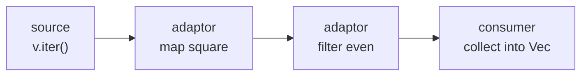

# Chapter 16 — Collections and Iterators

> **What you'll learn.** Rust's standard collections — `Vec`, `String`, `HashMap`,
> and friends — and the lazy, zero-cost **iterator** pipeline that replaces the
> hand-written index loops and `qsort` calls you know from C.

## The problem these solve

In C, the standard library gives you almost no data structures. You either use a
fixed-size array, hand-roll a dynamic array with `malloc`/`realloc`/`free`, or
write your own hash table (or pull in a third-party one). You track the length in
a separate variable, you check bounds yourself, and you free the memory by hand.

Rust ships a small set of well-tested, generic collections in the standard
library, all of which manage their own memory and free it automatically when they
go out of scope. On top of them sits the **iterator**: a uniform way to walk over
any collection, transform it, and collect the result, all checked at compile time
and compiled down to a plain loop.

> **C vs Rust.** A C dynamic array is a struct you write: `{ T *data; size_t len;
> size_t cap; }` plus a pile of functions and manual `free`. Rust's `Vec<T>` is
> that exact struct, written once, generic, bounds-checked, and freed for you.

## `Vec<T>`: the growable array

A **`Vec<T>`** (read "vector") is a growable array of values of type `T`, stored
on the heap. It is the collection you will reach for most. It owns its buffer, and
when the `Vec` is dropped, the buffer is freed.

A `Vec` is three machine words: a pointer to the heap buffer, the **length** (how
many elements are in use), and the **capacity** (how many fit before it must grow).

```
   Vec<i32> on the stack            heap buffer (capacity = 4)
  +----------+------+------+        +----+----+----+----+
  |   ptr    | len  | cap  |        | 10 | 20 | 30 | ?? |
  | 0x6000.. |  3   |  4   |        +----+----+----+----+
  +----------+------+------+          ^
        |                             |
        +-----------------------------+
```

`len` is how many elements you have; `cap` is how many the buffer holds. When you
push past `cap`, the `Vec` allocates a bigger buffer, copies the elements over,
and frees the old one — exactly what you would do with `realloc`, done for you.

### Creating and growing a `Vec`

```rust
fn main() {
    // The vec! macro builds and fills a Vec in one step.
    let primes = vec![2, 3, 5, 7, 11];

    // Build an empty Vec and push onto it. `mut` is required to change it.
    let mut stack: Vec<i32> = Vec::new();
    stack.push(1);
    stack.push(2);
    stack.push(3);

    let top = stack.pop(); // pop() returns Option<i32>: Some(3) here, None if empty
    println!("{primes:?} top={top:?} stack={stack:?}");
}
```

- `vec![a, b, c]` is a macro that creates a `Vec` with those elements.
- `Vec::new()` makes an empty `Vec`. The type is inferred from later use, or you
  annotate it (`Vec<i32>`).
- `push` appends one element; `pop` removes the last and returns an `Option<T>`
  (`Some(value)`, or `None` if the `Vec` is empty). There is no "popped off an
  empty stack" undefined behavior.

### Indexing: `v[i]` vs `.get(i)`

There are two ways to read an element, and the difference matters.

```rust
fn main() {
    let v = vec![10, 20, 30];

    let a = v[1]; // direct index: fast, but PANICS if i is out of bounds
    println!("a={a}");

    // .get(i) returns Option<&T>: Some(&value) in range, None out of range.
    match v.get(5) {
        Some(x) => println!("got {x}"),
        None => println!("index 5 is out of range"),
    }
}
```

- `v[i]` gives you the value directly but **panics** (cleanly aborts) if `i` is out
  of bounds. It never reads past the end — there is no buffer overrun.
- `v.get(i)` returns an `Option<&T>`, so you handle the out-of-range case yourself.

> **C vs Rust.** In C, `v[i]` with a bad `i` reads or writes random memory:
> silent, dangerous, exploitable. In Rust, `v[i]` checks the bound and panics
> instead of corrupting memory. Use `.get(i)` when an out-of-range index is a
> normal, expected case rather than a bug.

### `with_capacity`: avoid repeated reallocation

If you know roughly how many elements you will add, reserve the space up front, the
same way you would size a `malloc` once instead of calling `realloc` in a loop.

```rust
fn main() {
    let mut v = Vec::with_capacity(1000); // one allocation, room for 1000
    for i in 0..1000 {
        v.push(i); // no reallocation happens during this loop
    }
    println!("len={} cap>={}", v.len(), v.capacity());
}
```

`with_capacity(n)` allocates room for `n` elements but leaves the length at 0. It
is a performance hint, not a size limit; the `Vec` still grows if you exceed it.

## `String`: a UTF-8 `Vec<u8>` (recap)

A **`String`** is, under the hood, a `Vec<u8>` whose bytes are guaranteed to be
valid **UTF-8** (the standard variable-width text encoding). It owns its heap
buffer and grows the same way a `Vec` does. A **`&str`** is a borrowed view into
that text, like a checked `const char *` that also knows its length.

```rust
fn main() {
    let mut s = String::new();
    s.push_str("Rust"); // append a &str
    s.push('!');        // append one char
    println!("{s} has {} bytes", s.len()); // len is BYTES, not characters
}
```

Strings are covered in full in Chapter 10 — Slices and Strings. The key point for
this chapter: a `String` is just a specialized `Vec`, so it grows and frees the
same way, and you can build one from an iterator with `collect` (shown below).

## `HashMap<K, V>`: the key-value store

A **`HashMap<K, V>`** maps keys of type `K` to values of type `V` using a hash
table. It is Rust's equivalent of the hash table you would hand-write or import in
C. The keys must implement two traits: **`Eq`** (can be compared for equality) and
**`Hash`** (can be hashed). All the primitive types and `String` already do.

`HashMap` is not in the prelude, so you import it.

```rust
use std::collections::HashMap;

fn main() {
    let mut scores: HashMap<String, i32> = HashMap::new();
    scores.insert("blue".to_string(), 10);
    scores.insert("red".to_string(), 50);

    // get() returns Option<&V>: Some(&value) or None if the key is absent.
    if let Some(s) = scores.get("blue") {
        println!("blue = {s}");
    }

    // Iteration order is UNSPECIFIED — do not rely on it.
    for (team, score) in &scores {
        println!("{team}: {score}");
    }
}
```

### The `entry` API

A very common need is "update the value for a key, inserting a default if it is
missing." In C you would look up, check for null, and branch. Rust gives you the
**`entry`** API, which does the lookup once.

```rust
use std::collections::HashMap;

fn main() {
    let text = "the cat the dog the bird";
    let mut counts: HashMap<&str, i32> = HashMap::new();

    for word in text.split_whitespace() {
        // or_insert returns a &mut to the value, inserting 0 if the key is new.
        *counts.entry(word).or_insert(0) += 1;
    }
    println!("{counts:?}"); // {"the": 3, "cat": 1, ...} in some order
}
```

`entry(key)` returns a handle to that slot. `or_insert(default)` ensures a value
is present and hands you a mutable reference to it. The `*` dereferences that
reference so you can add to the value in place.

### `HashSet`, `BTreeMap`, `BTreeSet`, `VecDeque`

The standard library has a small family of collections. Pick by what you need.

| Collection | What it is | C analogy | Order |
|---|---|---|---|
| `Vec<T>` | growable array | `malloc`'d array + len | insertion order |
| `VecDeque<T>` | double-ended queue | ring buffer | insertion order |
| `HashMap<K, V>` | hash table | hand-rolled hash table | none |
| `HashSet<T>` | set of unique keys | hash table of keys | none |
| `BTreeMap<K, V>` | sorted map (B-tree) | balanced tree | sorted by key |
| `BTreeSet<T>` | sorted set | balanced tree of keys | sorted |

```rust
use std::collections::{HashSet, BTreeMap, VecDeque};

fn main() {
    // A HashSet stores unique values; inserting a duplicate is ignored.
    let mut seen = HashSet::new();
    seen.insert(3);
    seen.insert(3); // ignored
    println!("unique count = {}", seen.len()); // 1

    // A BTreeMap keeps keys sorted, so iteration is in key order.
    let mut sorted: BTreeMap<i32, &str> = BTreeMap::new();
    sorted.insert(2, "two");
    sorted.insert(1, "one");
    for (k, v) in &sorted {
        println!("{k} => {v}"); // 1 then 2, always
    }

    // A VecDeque pushes and pops cheaply at BOTH ends.
    let mut q: VecDeque<i32> = VecDeque::new();
    q.push_back(1);
    q.push_front(0);
    println!("{:?}", q); // [0, 1]
}
```

> **Rule of thumb.** Use `HashMap`/`HashSet` when you only need fast lookup and do
> not care about order. Use `BTreeMap`/`BTreeSet` when you need keys kept sorted.
> Use `VecDeque` for a queue or a ring buffer.

## Iterators: walking data without index loops

An **iterator** is any value that produces a sequence of items, one at a time. In
Rust this is captured by the `Iterator` **trait**, whose core method is:

```rust
// Simplified from the standard library.
pub trait Iterator {
    type Item;
    fn next(&mut self) -> Option<Self::Item>;
}
```

`next` returns `Some(item)` for each element and `None` when the sequence is
finished. That is the whole protocol. Everything else is built on it.

> **C vs Rust.** In C you write `for (size_t i = 0; i < n; i++) use(a[i]);` and
> manage the index, the bound, and off-by-one risk yourself. A Rust iterator hides
> the index entirely: there is no `i` to get wrong, and no way to read past the end.

### Iterators are lazy

This is the surprise for newcomers. Iterator **adaptors** — methods like `map` and
`filter` that transform one iterator into another — do **nothing** on their own.
They just build a description of the work. The work runs only when a **consumer**
(like `collect` or `sum`) pulls items through by calling `next`.

```rust
fn main() {
    // This line does NOT square anything yet. It builds a lazy iterator.
    let lazy = (1..=5).map(|x| {
        println!("squaring {x}");
        x * x
    });

    println!("nothing has printed yet");
    let squares: Vec<i32> = lazy.collect(); // NOW the closure runs, 5 times
    println!("{squares:?}");
}
```

> **Watch out.** A pipeline that ends without a consumer does no work. If you write
> `v.iter().map(|x| do_something(x));` and expect side effects, nothing happens —
> the compiler even warns that the iterator is unused. Add a consumer like
> `.for_each(...)` or `.collect()`.

### The pipeline: source, adaptors, consumer

A typical iterator expression has three parts. Think of it as a pipe.



```rust
fn main() {
    let nums = vec![1, 2, 3, 4, 5, 6];

    let result: Vec<i32> = nums
        .iter()                 // source: yields &i32
        .map(|&x| x * x)        // adaptor: square each
        .filter(|&x| x % 2 == 0) // adaptor: keep even squares
        .collect();             // consumer: gather into a Vec

    println!("{result:?}"); // [4, 16, 36]
}
```

### Common adaptors

Adaptors take an iterator and return a new iterator. They are lazy.

| Adaptor | What it does |
|---|---|
| `map(f)` | apply `f` to each item |
| `filter(pred)` | keep items where `pred` is true |
| `take(n)` | yield at most the first `n` items |
| `skip(n)` | drop the first `n` items |
| `enumerate()` | pair each item with its index: `(0, a), (1, b), ...` |
| `zip(other)` | pair items from two iterators together |
| `chain(other)` | yield all of one, then all of the other |
| `rev()` | reverse the order (needs a double-ended iterator) |

```rust
fn main() {
    let names = ["Ada", "Linus", "Grace"];

    // enumerate gives you the index without a manual counter.
    for (i, name) in names.iter().enumerate() {
        println!("{i}: {name}");
    }

    let a = [1, 2, 3];
    let b = [10, 20, 30];
    // zip walks two iterators in lockstep, stopping at the shorter one.
    let sums: Vec<i32> = a.iter().zip(b.iter()).map(|(x, y)| x + y).collect();
    println!("{sums:?}"); // [11, 22, 33]

    let first_two: Vec<i32> = (1..).take(2).collect(); // (1..) is infinite; take bounds it
    println!("{first_two:?}"); // [1, 2]
}
```

### Common consumers

A **consumer** drives the iterator to completion (or until it decides to stop) and
produces a final value.

| Consumer | Returns |
|---|---|
| `collect()` | build a collection (`Vec`, `String`, `HashMap`, ...) |
| `sum()` / `product()` | the total / product of the items |
| `count()` | how many items |
| `fold(init, f)` | reduce to one value (like a left fold / accumulator) |
| `for_each(f)` | run `f` for its side effects |
| `find(pred)` | first item matching `pred`, as `Option` |
| `position(pred)` | index of first match, as `Option` |
| `any(pred)` / `all(pred)` | does any / do all match? `bool` |
| `max()` / `min()` | largest / smallest, as `Option` |

```rust
fn main() {
    let v = vec![3, 1, 4, 1, 5, 9, 2, 6];

    let total: i32 = v.iter().sum();
    let biggest = v.iter().max();              // Option<&i32>
    let evens = v.iter().filter(|&&x| x % 2 == 0).count();
    let has_big = v.iter().any(|&x| x > 8);    // true
    let first_even = v.iter().find(|&&x| x % 2 == 0); // Some(&4)

    // fold is the general reducer: start at 0, add each item.
    let folded = v.iter().fold(0, |acc, &x| acc + x);

    println!("{total} {biggest:?} {evens} {has_big} {first_even:?} {folded}");
}
```

### `iter` vs `iter_mut` vs `into_iter`

There are three ways to get an iterator from a collection, and they differ by
**how they touch the elements** — read, mutate, or take ownership.

| Method | Yields | Effect on the collection |
|---|---|---|
| `iter()` | `&T` (shared reference) | borrows it; collection still usable after |
| `iter_mut()` | `&mut T` (mutable reference) | borrows it mutably; you can edit in place |
| `into_iter()` | `T` (owned value) | **consumes** it; collection is moved away |

```rust
fn main() {
    let v = vec![1, 2, 3];
    let doubled: Vec<i32> = v.iter().map(|&x| x * 2).collect();
    // v is still usable here, because iter() only borrowed it.
    println!("{v:?} -> {doubled:?}");

    let mut w = vec![1, 2, 3];
    for x in w.iter_mut() {
        *x += 100; // edit each element in place through &mut
    }
    println!("{w:?}"); // [101, 102, 103]

    let owned = vec![String::from("a"), String::from("b")];
    for s in owned.into_iter() {
        // s is an owned String here, moved out of the Vec.
        println!("took {s}");
    }
    // owned is gone now — into_iter() consumed it.
}
```

> **Watch out.** `for x in v` uses `into_iter()` and **moves** `v` (unless `T` is
> `Copy`). If you want to keep `v`, write `for x in &v` (which calls `iter()`) or
> `for x in &mut v` (which calls `iter_mut()`).

### `collect`: choosing the target type

`collect` can build many different collections, so it must be told **which** one.
You tell it with a type annotation on the variable, or with the **turbofish**
syntax `::<Type>` on the call.

```rust
use std::collections::HashMap;

fn main() {
    // 1. Type annotation on the binding tells collect the target.
    let squares: Vec<i32> = (1..=4).map(|x| x * x).collect();

    // 2. Turbofish on collect itself. The _ lets Rust infer the inner type.
    let doubled = (1..=4).map(|x| x * 2).collect::<Vec<_>>();

    // collect a String from chars.
    let shout: String = "hi".chars().map(|c| c.to_ascii_uppercase()).collect();

    // collect (key, value) pairs into a HashMap.
    let map: HashMap<i32, i32> = (1..=3).map(|x| (x, x * x)).collect();

    println!("{squares:?} {doubled:?} {shout} {map:?}");
}
```

> **Watch out.** `collect` is generic over the return type. If Rust cannot tell
> which collection you want, you get an error like "type annotations needed."
> Add a type on the variable or a turbofish on `collect`.

### Iterators are zero-cost: a `for` loop is sugar

A Rust `for` loop is **syntactic sugar** for using an iterator. These two are the
same program:

```rust
fn main() {
    let v = vec![10, 20, 30];

    // What you write:
    for x in &v {
        println!("{x}");
    }

    // What it desugars to (roughly):
    let mut it = (&v).into_iter();
    while let Some(x) = it.next() {
        println!("{x}");
    }
}
```

Because adaptors are inlined and the index is hidden, an iterator pipeline compiles
to the same tight machine code as a hand-written C loop — often **better**, because
the compiler can prove there are no out-of-bounds accesses and skip some checks.
This is what "zero-cost abstraction" means: you write it at a high level and pay
nothing extra at runtime.

> **C vs Rust.** To sort in C you call `qsort` with a `void *` comparator and cast
> pointers by hand, with no type checking. In Rust you call `v.sort()` (or
> `v.sort_by(|a, b| ...)`), which is type-checked and needs no casts.

```rust
fn main() {
    let mut v = vec![3, 1, 4, 1, 5];
    v.sort();                       // ascending
    v.sort_by(|a, b| b.cmp(a));     // descending, via a comparator closure
    v.dedup();                      // remove consecutive duplicates
    println!("{v:?}");
}
```

## A complete example: word frequencies

This pulls the chapter together: a `HashMap` for counts, the `entry` API to
update, and an iterator pipeline to find the top words.

```rust
use std::collections::HashMap;

fn main() {
    let text = "the quick brown fox the lazy dog the fox";

    let mut counts: HashMap<&str, i32> = HashMap::new();
    for word in text.split_whitespace() {
        *counts.entry(word).or_insert(0) += 1;
    }

    // Move the pairs into a Vec so we can sort them.
    let mut ranked: Vec<(&str, i32)> = counts.into_iter().collect();
    ranked.sort_by(|a, b| b.1.cmp(&a.1)); // by count, descending

    for (word, n) in ranked.iter().take(3) {
        println!("{word}: {n}");
    }
}
```

## Key takeaways

- `Vec<T>` is a growable heap array: a `(ptr, len, cap)` header, like a C dynamic
  array but generic, bounds-checked, and freed automatically.
- `v[i]` panics on a bad index (no buffer overrun); `v.get(i)` returns `Option`.
  Use `with_capacity` to pre-allocate.
- `String` is a UTF-8 `Vec<u8>` (Chapter 10 — Slices and Strings).
- `HashMap<K, V>` needs keys that are `Eq + Hash`; `get` returns `Option`; the
  `entry` API updates-or-inserts; iteration order is unspecified.
- `BTreeMap`/`BTreeSet` keep keys sorted; `HashSet` stores unique values;
  `VecDeque` is a double-ended queue.
- An iterator is any type with `next() -> Option<Item>`. Adaptors (`map`, `filter`,
  `take`, ...) are **lazy**; consumers (`collect`, `sum`, `fold`, ...) drive them.
- `iter()` borrows (`&T`), `iter_mut()` borrows mutably (`&mut T`), `into_iter()`
  takes ownership (`T`). A `for` loop is sugar for an iterator.
- Iterators are zero-cost — they compile to the same code as a hand-written loop.

## Watch out (gotchas for C programmers)

- **Indexing panics.** `v[i]` aborts cleanly on an out-of-range index instead of
  reading garbage. Use `.get(i)` when out-of-range is an expected case.
- **`HashMap` order is unspecified.** Never assume insertion or sorted order; use
  `BTreeMap` if you need order. Keys must implement `Eq + Hash`.
- **Iterators are lazy.** Adaptors do nothing until a consumer runs. A pipeline
  with no consumer does no work (and the compiler warns).
- **`iter` vs `into_iter`.** `for x in v` moves `v`; write `for x in &v` to keep
  it. `into_iter()` consumes the collection.
- **`collect` needs a target type.** Annotate the variable or use a turbofish
  (`collect::<Vec<_>>()`), or you get "type annotations needed."

## Interview questions

**Q: What three fields make up a `Vec<T>`, and how does it relate to a C dynamic
array?**
A: A pointer to a heap buffer, a length (elements in use), and a capacity (elements
the buffer can hold). It is exactly the hand-rolled `{ data, len, cap }` struct C
programmers write, but generic, bounds-checked, and freed automatically when the
`Vec` is dropped.

**Q: What is the difference between `v[i]` and `v.get(i)`?**
A: `v[i]` returns the element directly but panics if `i` is out of bounds.
`v.get(i)` returns `Option<&T>` — `Some(&value)` in range, `None` otherwise — so
you handle the missing case without panicking. Neither can read past the buffer.

**Q: What does it mean that iterators are "lazy," and why does it matter?**
A: Adaptors like `map` and `filter` only build a description of the work; they do
not touch any elements. The work runs only when a consumer such as `collect`,
`sum`, or `for_each` pulls items through `next`. It matters because a pipeline
without a consumer does nothing, and because laziness lets adaptors compose into a
single efficient pass.

**Q: When does `for x in collection` move the collection, and how do you avoid it?**
A: `for x in collection` calls `into_iter()`, which takes ownership and moves the
collection (unless its elements are `Copy`). To iterate without moving, use
`for x in &collection` (borrows, calls `iter()`) or `for x in &mut collection`
(mutably borrows, calls `iter_mut()`).

**Q: Why must you sometimes annotate the result of `collect`?**
A: `collect` is generic over the collection it produces, so the compiler needs to
know the target type. You provide it with a type annotation on the binding (`let v:
Vec<i32> = ...`) or a turbofish on the call (`.collect::<Vec<_>>()`).

## Try it

1. Build a `Vec<i32>` of 1..=20, then use one pipeline to keep the even numbers,
   square them, and `collect` into a new `Vec`. Print it.
2. Count the letters of a word with a `HashMap<char, i32>` and the `entry` API,
   then switch to a `BTreeMap` and notice the output is now in sorted order.
3. Replace a C-style `for (i = 0; i < n; i++)` loop you have written with
   `.iter().enumerate()` and see that the index variable disappears.
