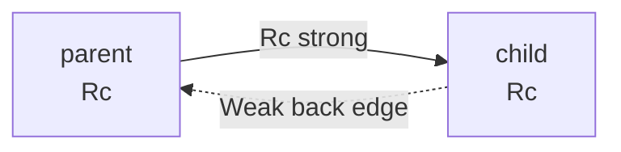

# Chapter 17 — Smart Pointers

> **What you'll learn.** What a smart pointer is, and the four you will use most:
> `Box` (single heap owner), `Rc` (shared ownership by counting), `RefCell`
> (borrow rules checked at runtime), and how `Deref`/`Drop` make them feel like
> plain pointers that clean up after themselves.

## What is a smart pointer?

A **smart pointer** is a value that behaves like a pointer but also owns the data
it points to and runs cleanup code when it is dropped. In Rust, a type is a smart
pointer when it implements two traits:

- **`Deref`** — so `*p` and method calls reach through to the pointed-to value, and
  `&p` can be used where a plain reference is expected.
- **`Drop`** (usually) — so the data is cleaned up automatically when the pointer
  goes out of scope.

You have already used smart pointers without naming them: `Vec<T>` and `String`
are smart pointers — they own a heap buffer and free it on drop.

> **C vs Rust.** In C, a pointer is "dumb": it is just an address, with no idea
> who owns the memory or when to free it. A Rust smart pointer bundles the address
> with ownership and an automatic destructor, so there is no separate `free` call
> to forget.

## `Box<T>`: a single owner on the heap

A **`Box<T>`** holds a value of type `T` on the heap and owns it. The `Box` itself
is one pointer on the stack; the value lives in a heap allocation. When the `Box`
is dropped, the heap value is dropped and the memory is freed — automatically.

```
   Box<i32> on the stack        heap
  +----------+                 +-----+
  |   ptr    |  -------------> |  42 |
  | 0x6000.. |                 +-----+
  +----------+
```

```rust
fn main() {
    let b = Box::new(42); // allocate an i32 on the heap, b owns it
    println!("{b}");      // Deref lets us use b like the value
    println!("{}", *b + 1); // *b reaches the i32
} // b is dropped here; the heap memory is freed automatically
```

> **C vs Rust.** `Box::new(x)` is like `malloc(sizeof x)` plus storing `x` into
> it — but you never call `free`. The `Box` frees the memory when it goes out of
> scope. One owner, one allocation, one automatic free. No leaks, no double-free.

There are three main reasons to reach for a `Box`.

### Reason 1: put large data on the heap

If a value is large and you want to move it around cheaply, box it. Moving a `Box`
copies one pointer, not the whole payload.

```rust
fn main() {
    let big = Box::new([0u8; 1_000_000]); // a megabyte lives on the heap
    let moved = big; // moves one pointer, not a megabyte
    println!("first byte = {}", moved[0]);
}
```

### Reason 2: recursive types need a known size

This is the classic use. A struct that contains itself — a linked list node, a
tree node — has no finite size, because the compiler would have to add up an
infinite chain. A `Box` breaks the cycle: a `Box` is always one pointer wide,
regardless of what it points to, so the size becomes known.

```rust
// COMPILE ERROR: recursive type `List` has infinite size
enum List {
    Cons(i32, List), // List contains a List contains a List ... no finite size
    Nil,
}
```

The fix is to box the recursive part, exactly as a C linked list stores a *pointer*
to the next node, not the node itself:

```rust
enum List {
    Cons(i32, Box<List>), // a pointer-sized link; size is now known
    Nil,
}

use List::{Cons, Nil};

fn main() {
    let list = Cons(1, Box::new(Cons(2, Box::new(Nil))));
    if let Cons(head, _) = &list {
        println!("head = {head}");
    }
}
```

> **C vs Rust.** A C list node is `struct node { int v; struct node *next; };` —
> the `next` field is a pointer because a struct cannot contain itself by value.
> `Box<List>` is that pointer, with automatic freeing of the whole chain on drop.

### Reason 3: trait objects (`Box<dyn Trait>`)

A **trait object** lets a value be "any type that implements this trait," chosen at
runtime. Because such values can have different sizes, they must live behind a
pointer. A `Box<dyn Trait>` is the owning version (traits are covered in Chapter
15 — Traits).

```rust
trait Shape {
    fn area(&self) -> f64;
}

struct Circle { r: f64 }
struct Square { s: f64 }

impl Shape for Circle { fn area(&self) -> f64 { 3.14159 * self.r * self.r } }
impl Shape for Square { fn area(&self) -> f64 { self.s * self.s } }

fn main() {
    // A Vec of different concrete types, unified behind a trait object.
    let shapes: Vec<Box<dyn Shape>> = vec![
        Box::new(Circle { r: 1.0 }),
        Box::new(Square { s: 2.0 }),
    ];
    let total: f64 = shapes.iter().map(|s| s.area()).sum();
    println!("total area = {total:.2}");
}
```

> **C vs Rust.** `Box<dyn Shape>` is like a C struct holding a `void *` data
> pointer plus a struct of function pointers (a vtable). Rust builds and type-checks
> that pair for you.

## `Deref`, `DerefMut`, and deref coercion

The **`Deref`** trait defines what `*p` produces. **`DerefMut`** is the mutable
version. Because smart pointers implement these, you use them just like the value
inside.

A handy consequence is **deref coercion**: when you pass a `&SmartPointer` where a
`&Target` is expected, the compiler automatically inserts the deref for you. This
is why `&String` works where `&str` is wanted, and `&Box<T>` works where `&T` is.

```rust
fn greet(name: &str) { // wants &str
    println!("hi {name}");
}

fn main() {
    let owned = String::from("Ada");
    greet(&owned); // &String coerces to &str automatically

    let boxed = Box::new(String::from("Linus"));
    greet(&boxed); // &Box<String> -> &String -> &str, two coercions
}
```

> **Mental model.** Deref coercion is the compiler quietly adding the `*` and `&`
> you would otherwise write by hand, so a smart pointer feels transparent.

## `Drop`: automatic cleanup (recap)

The **`Drop`** trait lets a type run code when it goes out of scope — Rust's
version of a C++ destructor, and the mechanism behind RAII (covered in Chapter 7 —
Ownership and Moves). This is how every smart pointer frees its memory.

```rust
struct Guard {
    name: String,
}

impl Drop for Guard {
    fn drop(&mut self) {
        println!("dropping {}", self.name); // runs automatically at scope end
    }
}

fn main() {
    let _a = Guard { name: "first".into() };
    let _b = Guard { name: "second".into() };
    println!("end of main");
} // prints: end of main, dropping second, dropping first (reverse order)
```

> **C vs Rust.** In C you write the cleanup (`free`, `fclose`, `unlock`) by hand at
> every exit path and hope you covered them all. `Drop` runs the cleanup
> automatically, on every path, in reverse order of creation.

## `Rc<T>`: shared ownership by reference counting

Sometimes one value needs **several owners** — for example, many parts of a graph
pointing at the same node. A `Box` cannot do this; it has exactly one owner. The
answer is **`Rc<T>`** ("reference counted").

`Rc<T>` keeps a count of how many owners exist. `Rc::clone` does not copy the data;
it makes another pointer to the same allocation and **bumps the count by one**. When
an `Rc` is dropped, the count drops by one. When it reaches **zero**, the data is
freed. `Rc` gives **shared, immutable** access — you get `&T`, not `&mut T`.

```
   a: Rc        b: Rc           heap allocation
  +------+    +------+      +-------------+---------+
  | ptr  |    | ptr  |      | strong = 2  | "hello" |
  +------+    +------+      +-------------+---------+
     |           |               ^
     +-----------+---------------+
```

```rust
use std::rc::Rc;

fn main() {
    let a = Rc::new(String::from("shared"));
    println!("count = {}", Rc::strong_count(&a)); // 1

    let b = Rc::clone(&a); // not a deep copy: same data, count is now 2
    let c = Rc::clone(&a); // count is now 3
    println!("count = {}", Rc::strong_count(&a)); // 3
    println!("{a} {b} {c}");

    drop(c); // count goes back to 2
    println!("count = {}", Rc::strong_count(&a)); // 2
} // a and b dropped here; count hits 0 and the String is freed
```

> **C vs Rust.** This is the manual reference counting C programmers write by hand:
> an `int refcount` you `++` on share and `--` on release, with a `free` when it
> hits zero. The bugs there — forgetting to increment, decrementing twice, freeing
> early — are exactly what `Rc` removes by doing the counting for you.

> **Watch out.** `Rc<T>` is **not thread-safe**. It is for single-threaded sharing.
> For sharing across threads, use **`Arc<T>`** (atomic reference counted), which
> does the same job with atomic counter operations. See Chapter 19 — Threads and
> Concurrency and Chapter 20 — Channels and Shared State.

## `RefCell<T>`: interior mutability

`Rc` gives you shared but **immutable** access. What if shared owners need to
*change* the value? Normally the borrow checker forbids mutating through a shared
reference. **`RefCell<T>`** provides **interior mutability**: it lets you mutate
the value through a shared reference, and it moves the borrow checking from compile
time to **runtime**.

You borrow through methods:

- `borrow()` returns a shared guard (`Ref<T>`), like `&T`.
- `borrow_mut()` returns a mutable guard (`RefMut<T>`), like `&mut T`.

`RefCell` enforces the same rule as the compiler — many readers **or** one writer,
never both — but it checks at runtime and **panics** if you break it.

```rust
use std::cell::RefCell;

fn main() {
    let cell = RefCell::new(vec![1, 2, 3]);

    cell.borrow_mut().push(4); // mutate through a shared handle
    println!("{:?}", cell.borrow()); // [1, 2, 3, 4]

    let count = cell.borrow().len();
    println!("len = {count}");
}
```

This next example compiles fine but **panics at runtime**, because it holds a
mutable borrow and a second borrow at the same time:

```rust
use std::cell::RefCell;

fn main() {
    let cell = RefCell::new(5);
    let a = cell.borrow_mut();
    let b = cell.borrow(); // PANIC: already mutably borrowed: BorrowMutError
    println!("{a} {b}");
}
```

> **Watch out.** With `RefCell` you trade a compile error for a possible runtime
> panic. The rules are identical; only *when* they are checked changes. Keep borrow
> guards short-lived to avoid surprises.

**`Cell<T>`** is a lighter cousin for `Copy` values (like integers). Instead of
handing out references, it lets you `get` a copy and `set` a new value, so there is
no borrow to track and no panic.

```rust
use std::cell::Cell;

fn main() {
    let counter = Cell::new(0);
    counter.set(counter.get() + 1);
    counter.set(counter.get() + 1);
    println!("{}", counter.get()); // 2
}
```

> **Rule of thumb.** Interior mutability is a deliberate **escape hatch**, not the
> default. Reach for `RefCell`/`Cell` only when you genuinely need to mutate
> through a shared reference and the compiler cannot prove it is safe.

## `Rc<RefCell<T>>`: shared mutable data

Combine the two and you get the standard Rust recipe for **shared, mutable** data,
common in trees and graphs: `Rc` provides many owners, and `RefCell` lets those
owners mutate the value.

```rust
use std::rc::Rc;
use std::cell::RefCell;

fn main() {
    let shared = Rc::new(RefCell::new(0));

    let a = Rc::clone(&shared);
    let b = Rc::clone(&shared);

    *a.borrow_mut() += 10; // mutate through one owner
    *b.borrow_mut() += 5;  // mutate through another

    println!("value = {}", shared.borrow()); // 15
}
```

Here is a tiny tree where every node is a shared, mutable owner of its children:

```rust
use std::rc::Rc;
use std::cell::RefCell;

struct Node {
    value: i32,
    children: Vec<Rc<RefCell<Node>>>,
}

fn main() {
    let leaf = Rc::new(RefCell::new(Node { value: 3, children: vec![] }));
    let root = Rc::new(RefCell::new(Node { value: 1, children: vec![Rc::clone(&leaf)] }));

    leaf.borrow_mut().value = 99; // mutate the shared leaf
    println!("root's child = {}", root.borrow().children[0].borrow().value); // 99
}
```

## `Weak<T>`: breaking reference cycles

`Rc` has one danger. If two `Rc`s point at each other — a **cycle** — their counts
never reach zero, so the data is never freed. That is a memory leak, the one kind
of leak safe Rust still allows.



The fix is **`Weak<T>`**: a non-owning reference that does **not** raise the count.
A `Weak` can point at data without keeping it alive. To use it, call `upgrade`,
which returns `Option<Rc<T>>` — `Some` if the data still exists, `None` if it has
been freed. Use a strong `Rc` for the direction that should own (parent to child)
and a `Weak` for the back-edge (child to parent).

```rust
use std::rc::{Rc, Weak};
use std::cell::RefCell;

struct Node {
    value: i32,
    parent: RefCell<Weak<Node>>,   // Weak: does NOT keep the parent alive
    children: RefCell<Vec<Rc<Node>>>, // Rc: owns the children
}

fn main() {
    let parent = Rc::new(Node {
        value: 1,
        parent: RefCell::new(Weak::new()),
        children: RefCell::new(vec![]),
    });

    let child = Rc::new(Node {
        value: 2,
        parent: RefCell::new(Weak::new()),
        children: RefCell::new(vec![]),
    });

    // Link both ways: parent owns child (strong), child points back (weak).
    parent.children.borrow_mut().push(Rc::clone(&child));
    *child.parent.borrow_mut() = Rc::downgrade(&parent);

    // upgrade() turns the Weak back into an Option<Rc>.
    if let Some(p) = child.parent.borrow().upgrade() {
        println!("child {}'s parent is {}", child.value, p.value);
    }
} // no cycle of strong counts, so both nodes are freed
```

> **Watch out.** `Rc` cycles leak memory because the counts never hit zero. Break
> any cycle by making one direction a `Weak`. This is the doubly linked list /
> parent-pointer problem, and `Weak` is the idiomatic fix.

## Picking the right pointer

| Need | Use | C analogy |
|---|---|---|
| One owner on the heap | `Box<T>` | `malloc` + auto `free` |
| Recursive type / trait object | `Box<T>` / `Box<dyn Trait>` | pointer in a struct / vtable |
| Many owners, single-threaded | `Rc<T>` | manual `int refcount` |
| Many owners, across threads | `Arc<T>` | atomic refcount |
| Mutate through a shared ref | `RefCell<T>` (or `Cell<T>`) | casting away `const` |
| Shared and mutable | `Rc<RefCell<T>>` | refcounted, mutable struct |
| Break an `Rc` cycle | `Weak<T>` | a non-owning back-pointer |

## Key takeaways

- A smart pointer owns data and acts like a pointer; it implements `Deref` and
  usually `Drop`, so it cleans up automatically.
- `Box<T>` is a single heap owner. Use it for large data, recursive types (a
  known-size link), and trait objects (`Box<dyn Trait>`). It is `malloc` with an
  automatic `free`.
- `Deref`/`DerefMut` and deref coercion make smart pointers transparent: `&String`
  becomes `&str`, `&Box<T>` becomes `&T`.
- `Rc<T>` is single-threaded shared ownership by reference counting; cloning bumps
  the count, and the data is freed when the count hits zero. `Arc<T>` is the
  thread-safe version (Chapters 19–20).
- `RefCell<T>` gives interior mutability by checking the borrow rules at **runtime**
  (and panicking on violation). `Cell<T>` is the `Copy`-value version.
- `Rc<RefCell<T>>` is the standard recipe for shared, mutable data. `Weak<T>`
  breaks reference cycles, which otherwise leak.

## Watch out (gotchas for C programmers)

- **`RefCell` moves borrow checks to runtime.** A violation is a panic, not a
  compile error. Keep borrow guards short.
- **`Rc` is not thread-safe.** Use `Arc<T>` to share across threads; the compiler
  will stop you from sending an `Rc` to another thread.
- **`Rc` cycles leak.** If `Rc`s point at each other, their counts never reach zero
  and the memory is never freed. Use `Weak<T>` for back-edges.
- **`Box` is for recursive types.** A struct cannot contain itself by value; box
  the recursive field so the size is known, just like a C `next` pointer.
- **Interior mutability is an escape hatch.** Prefer ordinary `&mut` and let the
  compiler check at compile time; reach for `RefCell`/`Cell` only when you must.

## Interview questions

**Q: What makes a type a "smart pointer," and how does it differ from a C pointer?**
A: A smart pointer owns its data and acts like a pointer by implementing `Deref`
(and usually `Drop`). Unlike a raw C pointer, which is just an address with no
ownership or cleanup, a smart pointer frees its data automatically when it goes out
of scope, so there is no manual `free` to forget.

**Q: Why do recursive types like a linked list need `Box`?**
A: A type that contains itself by value would have infinite size, so the compiler
rejects it. A `Box<T>` is a single pointer of known size regardless of what it
points to, so boxing the recursive field gives the type a finite, known size —
exactly like storing a `next` pointer in a C struct.

**Q: How does `Rc<T>` differ from `Box<T>`, and when would you use each?**
A: `Box<T>` has exactly one owner; `Rc<T>` allows multiple owners by counting
references. Cloning an `Rc` bumps the count and shares the same data; the data is
freed when the count reaches zero. Use `Box` for sole ownership and `Rc` when
several parts of a single-threaded program must share read-only ownership.

**Q: What is interior mutability, and what does `RefCell` trade for it?**
A: Interior mutability is mutating a value through a shared reference, which the
compiler normally forbids. `RefCell<T>` allows it by enforcing the borrow rules at
runtime instead of compile time: `borrow`/`borrow_mut` return guards, and the
program panics if you ever have a writer alongside another borrow.

**Q: How can safe Rust leak memory, and how do you prevent it?**
A: A cycle of `Rc`s pointing at each other keeps every reference count above zero,
so the data is never freed — a leak. You prevent it by making at least one edge in
the cycle a `Weak<T>`, a non-owning reference that does not raise the count; you
call `upgrade()` to access the data if it still exists.

## Try it

1. Define the `enum List { Cons(i32, Box<List>), Nil }` and build a three-element
   list. Then remove the `Box` and read the "recursive type has infinite size"
   error.
2. Make an `Rc<String>`, clone it twice, and print `Rc::strong_count` after each
   clone and after a `drop`. Watch the count rise and fall.
3. Wrap an `i32` in `RefCell`, then deliberately hold a `borrow_mut()` and a
   `borrow()` at the same time. Run it and read the `BorrowMutError` panic.
