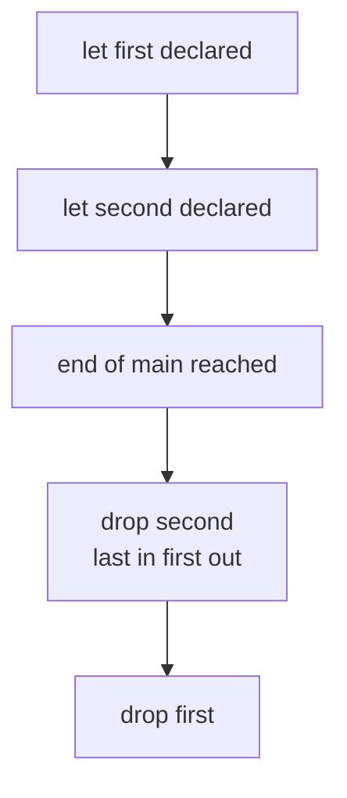

# Chapter 18 — Memory Without a Garbage Collector

> **What you'll learn.** Where Rust puts your data (stack vs heap), how it frees
> memory with no garbage collector and no `free`, whether you can still leak
> memory in safe code, and how to control performance the way you do in C.

## The big picture: same speed as C, no GC, no `free`

C programmers manage memory by hand. You call `malloc` to get heap memory and
`free` to give it back. If you forget to free, you leak. If you free twice, you
crash. If you use memory after freeing it, you get undefined behavior.

Garbage-collected languages (Go, Java, C#, Python) take the opposite approach. A
**garbage collector** (GC) is a part of the runtime that periodically scans for
memory you no longer use and frees it for you. You never call `free`, but you pay
for it: the GC runs at unpredictable times, which causes pauses and uses extra
CPU and memory.

Rust takes a third path. There is **no GC** and you almost never call `free`
yourself. Instead, the compiler frees memory **deterministically**: each value is
freed at a known point in the code — when its owner's scope ends. This gives you
C-level performance and predictable timing, with the safety of automatic cleanup.

| Approach | Who frees memory | When | Cost |
|---|---|---|---|
| C | You, by hand (`free`) | Whenever you write the call | Bugs: leaks, double-free, use-after-free |
| Go / Java | The garbage collector | Later, at unpredictable times | GC pauses, extra CPU and memory |
| Rust | The compiler (ownership) | Deterministically, at end of scope | None at runtime; some thinking at compile time |

> **Mental model.** Rust's memory management is C++ RAII enforced by the compiler.
> "RAII" means *Resource Acquisition Is Initialization*: a value owns a resource,
> and when the value is destroyed, the resource is released. Rust does this for
> every owning value, automatically, and checks that you got it right.

## Stack vs heap (a quick recap)

You know this from C, but the terms matter for the rest of the chapter.

- The **stack** is fast memory that grows and shrinks with function calls. A
  local variable with a size known at compile time lives here. Pushing and
  popping is just moving a pointer.
- The **heap** is a large pool of memory you ask for at runtime when you need a
  size that is not known up front, or data that must outlive the current
  function. In C you reach the heap with `malloc`.

In Rust, plain values like `i32`, `f64`, `bool`, arrays `[i32; 4]`, and structs
of those live on the **stack**. Three common types put their *data* on the
**heap**:

- `Box<T>` — one heap value of type `T` (like a single `malloc`'d object).
- `Vec<T>` — a growable array; the elements live on the heap.
- `String` — growable UTF-8 text; the bytes live on the heap.

Each of these is a small struct on the stack that holds a pointer to the heap.

```
            STACK                          HEAP
   +----------------------+
   | v: Vec<i32>          |
   |   ptr  --------------|------> [ 10 | 20 | 30 |  ?  ]
   |   len  = 3           |          (cap = 4 slots)
   |   cap  = 4           |
   +----------------------+
   | s: String           |
   |   ptr  --------------|------> [ 'h' 'i' ]
   |   len  = 2           |
   |   cap  = 2           |
   +----------------------+
   | n: i32 = 7           |   (no heap; the value is right here)
   +----------------------+
```

This is the same picture as a C struct holding a pointer, a length, and a
capacity, except Rust writes it for you and frees the buffer automatically.

> **C vs Rust.** A `Vec<T>` is a `malloc`'d array plus a length and a capacity,
> bundled into one type. When the `Vec` goes out of scope, Rust calls the
> allocator's free for you. In C you track the pointer, length, and capacity in
> separate variables and free the buffer by hand.

## Moves: transferring ownership, not copying data

When you assign one owning value to another, Rust **moves** it. A move copies the
small stack part (the pointer, length, capacity) and marks the old variable as
invalid. It does **not** copy the heap data. This is a cheap, shallow operation —
the same cost as copying a C pointer.

```rust
fn main() {
    let a = String::from("hello"); // a owns a heap buffer
    let b = a;                     // MOVE: b now owns it; a is invalid
    println!("{b}");               // ok
    // println!("{a}");            // would be a compile error: a was moved
}
```

Compare with C, where copying a pointer makes two pointers to **one** buffer —
the setup for a double-free:

```c
char *a = strdup("hello");
char *b = a;     /* two pointers, one buffer */
free(a);
free(b);         /* double free: undefined behavior */
```

Rust avoids this by making `a` unusable after the move, so the buffer has exactly
one owner and is freed exactly once. (Moves and ownership are Chapter 7 —
Ownership and Moves.)

## How freeing happens: `Drop` and scope

When an owning value goes out of scope, Rust runs its destructor — a method from
the `Drop` trait — which frees any heap memory it owns. You do not call it; the
compiler inserts the call. You can also write your own `Drop` to release other
resources (files, sockets, locks), just like a C++ destructor.

```rust
struct Logger {
    name: String,
}

impl Drop for Logger {
    fn drop(&mut self) {
        println!("dropping {}", self.name);
    }
}

fn main() {
    let _first = Logger { name: String::from("first") };
    let _second = Logger { name: String::from("second") };
    println!("end of main");
}
```

This prints:

```
end of main
dropping second
dropping first
```

Notice the order. Values are dropped in **reverse order of declaration**, like
popping a stack: the last one declared is freed first. This matters when one
value depends on another being alive.



> **C vs Rust.** In C you decide where every `free` goes and run it yourself. In
> Rust the `free` is tied to scope and runs automatically in reverse declaration
> order. You get RAII cleanup without writing the cleanup code.

## The allocator: who actually calls `malloc`

Under the hood, `Box`, `Vec`, and `String` ask the **global allocator** for heap
memory and return it when dropped. The default global allocator calls the system
allocator (the same `malloc`/`free` family C uses). You rarely touch it directly.

A few facts worth knowing:

- You can replace the global allocator with `#[global_allocator]` (for example,
  to use jemalloc or a custom arena). This is advanced and uncommon.
- Manual, raw allocation exists through the `std::alloc` module, but it is
  `unsafe` and you almost never need it. (See Chapter 25 — Unsafe and FFI.)
- Growing a `Vec` past its capacity reallocates: it asks for a bigger buffer,
  copies the elements over, and frees the old one — exactly like writing
  `realloc` in C.

## Can you leak memory in safe Rust?

Yes. This surprises newcomers. Rust prevents use-after-free, double-free, and
data races in safe code, but it does **not** promise to prevent **leaks**. A leak
means memory is never freed. Leaking is considered **safe** — it cannot corrupt
memory or cause undefined behavior — but it is still a bug if you did not mean to
do it.

> **Watch out.** "Memory safe" does not mean "leak free." Safe Rust guarantees
> you never touch freed or invalid memory. It does not guarantee every allocation
> is eventually freed.

There are three common ways to leak in safe code:

1. **Reference-count cycles with `Rc`/`Arc`.** An `Rc<T>` frees its value when the
   count reaches zero. If two `Rc` values point at each other, the count never
   reaches zero, so neither is freed. (See Chapter 17 — Smart Pointers for `Rc`
   and the `Weak` fix.)

2. **`std::mem::forget`.** This takes a value and *skips* its destructor on
   purpose. The memory is never freed.

   ```rust
   fn main() {
       let data = vec![1, 2, 3];
       std::mem::forget(data); // destructor never runs; the heap buffer leaks
   }
   ```

3. **`Box::leak`.** This turns an owned `Box<T>` into a plain reference that lives
   for the rest of the program (`&'static mut T`). It is sometimes done on
   purpose to create data that must never be freed.

   ```rust
   fn main() {
       let boxed: Box<i32> = Box::new(42);
       let r: &'static mut i32 = Box::leak(boxed); // never freed; lives forever
       println!("{r}");
   }
   ```

These functions are safe because a leak harms only your memory budget, not memory
correctness. The borrow checker is about *safety*, not *thrift*.

## Performance: how Rust stays in C's class

Rust's runtime cost is the same class as C. Here is why, and what you control.

**Why it is fast by default:**

- **No runtime, no GC.** There is no background collector and no managed heap.
  Memory frees happen at compile-time-known points.
- **Zero-cost abstractions.** Iterators, generics, and traits compile to the same
  machine code you would write by hand. You do not pay extra at runtime for using
  them.
- **Monomorphization.** A generic function is compiled into a specialized copy for
  each concrete type it is used with — like the C compiler expanding a macro — so
  there is no dynamic dispatch cost. (See Chapter 14 — Generics.)
- **Bounds checks, often free.** Indexing a slice checks the index against the
  length, which C does not do. The optimizer removes many of these checks when it
  can prove the index is in range (for example, in a `for` loop over the slice).

**What you control (just like in C):**

- **Preallocate with `with_capacity`.** If you know how many items are coming,
  allocate once instead of growing repeatedly. Each growth is a `realloc` plus a
  copy.

  ```rust
  fn main() {
      let mut v = Vec::with_capacity(1000); // one allocation up front
      for i in 0..1000 {
          v.push(i); // no reallocation: capacity is already 1000
      }
      println!("len = {}", v.len());
  }
  ```

- **Pass references, do not clone.** Passing `&T` or `&mut T` hands over a pointer
  with no copy, the same as passing a pointer in C. Calling `.clone()` on a `Vec`
  or `String` does a **deep copy** — a fresh allocation and a byte-for-byte copy.
  Clone when you need a separate owned copy; borrow when you only need to read or
  modify in place.

- **Prefer cheap `Copy` types.** Small types like `i32`, `f64`, and `char`
  implement `Copy`: assigning them duplicates the bits, like copying an `int` in
  C. There is no heap and no move bookkeeping. Use them freely.

- **Choose stack vs heap on purpose.** A fixed-size array `[u8; 64]` lives on the
  stack with no allocation. `Box`/`Vec`/`String` allocate. For small, fixed data,
  stay on the stack.

**Measuring it:**

- The same tools you use in C still work: `valgrind`, `heaptrack`, and `perf` all
  understand Rust binaries because the output is native machine code.
- **Debug and release builds differ a lot.** `cargo build` (debug) keeps bounds
  checks for integer overflow, does little optimization, and is much slower.
  `cargo build --release` turns on optimizations. Always benchmark the release
  build.

> **Rule of thumb.** When something is slow, look first for accidental `.clone()`
> calls and `Vec`s that grow in a loop without `with_capacity`. These are the
> Rust equivalents of needless `memcpy` and missing `realloc` sizing in C.

## Key takeaways

- Rust has **no garbage collector**. Memory is freed deterministically when its
  owner's scope ends, via `Drop` (RAII), giving predictable performance with no
  GC pauses — ideal for systems and real-time work.
- Sized locals live on the **stack**; `Box`, `Vec`, and `String` keep their data
  on the **heap**. A **move** transfers ownership of the heap data with no deep
  copy.
- The **global allocator** backs `Box`/`Vec`/`String`. You rarely call it
  directly. Values drop in **reverse order of declaration**.
- You **can** leak in safe Rust (`Rc` cycles, `std::mem::forget`, `Box::leak`).
  Leaks are **safe**, not undefined behavior, but still bugs. "Safe" does not mean
  "leak free."
- Performance is C's class: no runtime, zero-cost abstractions, monomorphization,
  bounds checks usually optimized away. Control it with `with_capacity`, passing
  references instead of cloning, cheap `Copy` types, and stack-vs-heap choices.
- `valgrind`/`heaptrack`/`perf` still work; always measure the `--release` build.
- Manual allocation and raw memory exist behind `unsafe` (Chapter 25 — Unsafe and
  FFI), but you almost never need them.

## Watch out (gotchas for C programmers)

- **Leaks are possible but safe.** Safe Rust stops use-after-free and double-free,
  not leaks. `Rc` cycles and `mem::forget` will leak quietly.
- **Drop order is reverse of declaration.** The last value declared is freed
  first. This matters when one value must outlive another.
- **`.clone()` has a real cost.** On `Vec`/`String` it is a deep copy with a fresh
  allocation. Borrow with `&`/`&mut` when you do not need a separate copy.
- **Use `with_capacity` for hot loops.** A `Vec` that grows by `push` may
  reallocate and copy many times. Preallocate when you know the size.
- **No GC means deterministic frees.** Cleanup happens at end of scope, not
  "sometime later." Do not expect a background collector to save you from a cycle.
- **Always benchmark `--release`.** Debug builds are far slower and behave
  differently (for example, integer overflow panics in debug).

## Interview questions

**Q: Rust has no garbage collector. How is heap memory freed?**
A: By ownership and the `Drop` trait (RAII). Each heap value has a single owner.
When the owner goes out of scope, the compiler inserts a call to its destructor,
which frees the memory. This happens at compile-time-known points, so timing is
deterministic with no GC pauses.

**Q: Can safe Rust leak memory?**
A: Yes. Reference-count cycles with `Rc`/`Arc`, `std::mem::forget`, and
`Box::leak` all leak in safe code. Leaks are considered safe because they cannot
cause undefined behavior — but they are still bugs. Memory safety does not mean
leak freedom.

**Q: What is the difference between a move and a clone?**
A: A move transfers ownership by copying only the small stack part (pointer,
length, capacity) and invalidating the source; the heap data is not copied, so it
is cheap. A clone makes a full independent copy, which for `Vec`/`String` means a
new allocation and a deep copy of the data.

**Q: How do you avoid repeated reallocations when filling a `Vec`?**
A: Use `Vec::with_capacity(n)` to allocate enough room once before the loop.
Otherwise the `Vec` grows on demand, and each growth reallocates a larger buffer
and copies the existing elements, like calling `realloc` repeatedly in C.

**Q: Why might the same Rust program run much faster after one change to the build
command?**
A: Because of debug vs release builds. `cargo build` is a debug build with few
optimizations and extra checks; `cargo build --release` enables optimizations.
Always benchmark the release build, since they can differ by an order of
magnitude.

## Try it

1. Write a struct with a `Drop` impl that prints its name, declare three of them
   in `main`, and confirm they drop in reverse order.
2. Fill a `Vec` with one million integers two ways: with `Vec::new()` and with
   `Vec::with_capacity(1_000_000)`. Time both with `cargo run --release` and
   compare.
3. Call `std::mem::forget` on a `Vec` and run the program under `valgrind`. Watch
   it report the leaked bytes — proof that a safe program can still leak.
