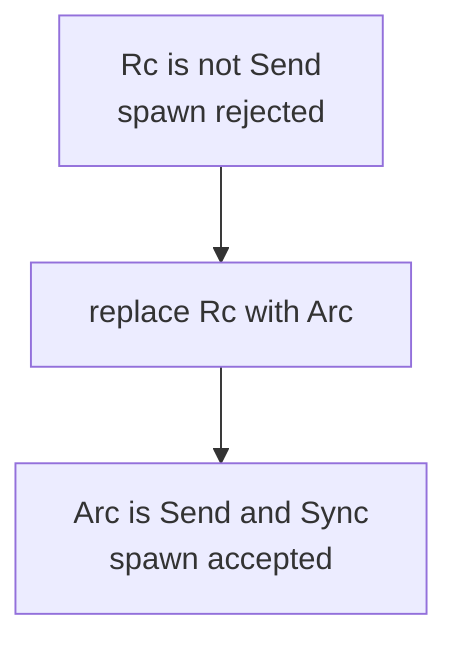
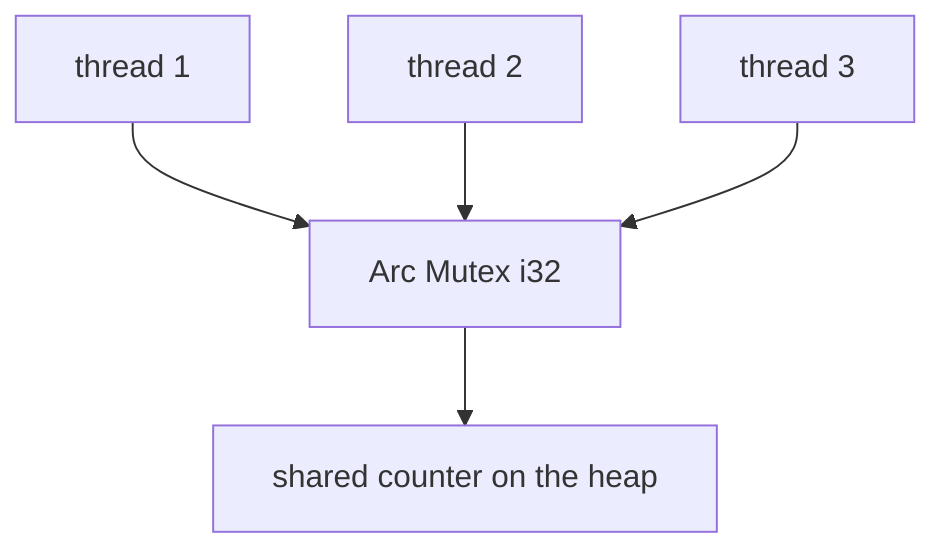

# Chapter 19 — Threads and Fearless Concurrency

> **What you'll learn.** How to start OS threads in Rust, why the same ownership
> rules that prevent memory bugs also prevent data races at compile time, the
> `Send`/`Sync` traits, and how to share data safely with `Arc<Mutex<T>>` and
> scoped threads — all compared to C and pthreads.

## Starting a thread

In C you start a thread with `pthread_create`, passing a function pointer and a
`void *` argument, and you wait for it with `pthread_join`. You manage the
argument's lifetime by hand, and a mistake there is silent undefined behavior.

In Rust you call `std::thread::spawn`, passing a **closure** (an anonymous
function that can capture variables). It returns a `JoinHandle`. Calling `.join()`
on that handle waits for the thread to finish and gives you its return value
inside a `Result`.

```rust
use std::thread;

fn main() {
    let handle = thread::spawn(|| {
        // this runs on a new OS thread
        let mut sum = 0;
        for i in 1..=100 {
            sum += i;
        }
        sum // the closure's return value becomes the thread's result
    });

    // do other work here on the main thread...

    let result = handle.join().unwrap(); // wait, then take the result
    println!("sum = {result}");
}
```

These are **OS threads**, one Rust thread per one operating-system thread (a "1:1"
model), exactly like pthreads. They are real, preemptively scheduled kernel
threads, not lightweight green threads.

> **C vs Rust.** Go's goroutines are lightweight tasks managed by Go's runtime;
> thousands are cheap. Rust's `thread::spawn` gives you a full OS thread, the same
> heavyweight thing as `pthread_create`. For massive concurrency Rust uses
> `async` instead (Chapter 21 — Async/Await). This chapter is about real threads.

> **Watch out.** If you drop a `JoinHandle` without calling `.join()`, the thread
> is **detached** — it keeps running on its own, and the program may exit before
> it finishes. Always `.join()` threads whose work you care about.

## `move` closures: giving data to a thread

A spawned thread may outlive the function that created it. So the closure cannot
just borrow local variables — the borrow might dangle. Rust requires the closure
to **own** what it uses, by writing `move` before it. `move` transfers ownership
of the captured variables into the closure (and thus into the thread).

```rust
use std::thread;

fn main() {
    let data = vec![1, 2, 3];

    let handle = thread::spawn(move || {
        // `data` is moved into this thread; main can no longer use it
        let total: i32 = data.iter().sum();
        println!("thread computed {total}");
    });

    handle.join().unwrap();
}
```

Without `move`, this would be a compile error: the closure would borrow `data`,
but the compiler cannot prove `data` lives long enough, because the thread might
run after `main`'s variables are gone.

> **C vs Rust.** In C you pass a `void *` to `pthread_create` and promise that the
> data stays alive long enough. The compiler does not check this. In Rust, `move`
> transfers ownership into the thread, and the compiler proves nothing dangles.

## Fearless concurrency: data races caught at compile time

A **data race** happens when two threads access the same memory at the same time,
at least one of them writes, and there is no synchronization. In C this is silent
undefined behavior — it may work for years and then corrupt data under load.

Rust calls its approach **fearless concurrency**: the *same* ownership and
borrowing rules you already learned (Chapter 8 — Borrowing and References)
prevent data races at compile time. The key rule is "aliasing XOR mutation": you
may have many shared readers (`&T`) **or** one exclusive writer (`&mut T`), never
both. That single rule, applied across threads, makes data races impossible in
safe code.

So you cannot simply hand a `&mut` to two threads, and you cannot share a value
that is not safe to share. The compiler enforces this using two marker traits.

## `Send` and `Sync`: the thread-safety markers

A **marker trait** is a trait with no methods; it just labels a type with a
property. Two of them govern threading:

- **`Send`** — a type is `Send` if it is safe to **move** to another thread.
  Almost everything is `Send`. The famous exception is `Rc<T>` (the
  single-threaded reference-counted pointer, Chapter 17 — Smart Pointers).
- **`Sync`** — a type is `Sync` if it is safe to **share** by reference (`&T`)
  across threads. `T` is `Sync` exactly when `&T` is `Send`.

These are **auto-implemented**: the compiler figures out whether your type is
`Send`/`Sync` from its fields. You normally never write them yourself.

What is **not** `Send`?

- `Rc<T>` — its reference count is updated without atomics, so two threads could
  corrupt the count. Use `Arc<T>` (atomic `Rc`) instead.
- Raw pointers (`*const T`, `*mut T`) — the compiler cannot reason about them.

Here is the compiler stopping you from moving an `Rc` into a thread:

```rust
// COMPILE ERROR: `Rc<i32>` cannot be sent between threads safely
use std::rc::Rc;
use std::thread;

fn main() {
    let counter = Rc::new(5);
    let c = Rc::clone(&counter);

    thread::spawn(move || {
        println!("{}", c); // error[E0277]: `Rc<i32>` cannot be sent between threads safely
    })
    .join()
    .unwrap();
}
```

The fix is `Arc`, shown below. In C there is no such check; nothing stops you
from sharing a non-thread-safe object, and the bug surfaces only at runtime.



## Sharing ownership: `Arc`

When several threads need to read the **same** heap value, you give each one
shared ownership with `Arc<T>` — an **A**tomically **R**eference **C**ounted
pointer. It is like `Rc<T>` but uses atomic operations for the count, so it is
safe across threads (`Arc` is `Send` and `Sync` when `T` is). Cloning an `Arc`
bumps the count and hands out another handle to the same data; the value is freed
when the last handle drops.

`Arc` alone gives **shared, read-only** access. To **mutate** shared data, you
also need a lock.

## Shared mutation: `Mutex` and `RwLock`

You cannot hand a `&mut` to several threads — that breaks the borrow rule. To
allow shared mutation, wrap the data in a **`Mutex<T>`** (mutual exclusion lock).
Calling `.lock()` blocks until the lock is free, then returns a **guard**. The
guard lets you read and write the inner value, and it **unlocks automatically
when it drops** (RAII). You never forget to unlock.

The standard pattern for "shared and mutable across threads" is
`Arc<Mutex<T>>`: `Arc` for shared ownership, `Mutex` for safe mutation.

```rust
use std::sync::{Arc, Mutex};
use std::thread;

fn main() {
    let counter = Arc::new(Mutex::new(0)); // shared, lockable integer
    let mut handles = Vec::new();

    for _ in 0..10 {
        let counter = Arc::clone(&counter); // a new handle for this thread
        let handle = thread::spawn(move || {
            let mut guard = counter.lock().unwrap(); // lock; unlocks on drop
            *guard += 1;
        });
        handles.push(handle);
    }

    for handle in handles {
        handle.join().unwrap(); // wait for all threads
    }

    println!("counter = {}", *counter.lock().unwrap()); // prints 10
}
```



Here is the same idea in C with pthreads. Notice the manual lock/unlock pair you
must never forget, and that nothing checks you actually took the lock:

```c
pthread_mutex_t lock = PTHREAD_MUTEX_INITIALIZER;
int counter = 0;

void *worker(void *arg) {
    pthread_mutex_lock(&lock);
    counter += 1;
    pthread_mutex_unlock(&lock);   /* forget this and you deadlock or leak */
    return NULL;
}
```

> **C vs Rust.** In C the lock and the data are separate; the compiler never
> checks that you hold the lock before touching `counter`. In Rust the data lives
> *inside* the `Mutex`, so the only way to reach it is through `.lock()`, and the
> guard unlocks on drop. You cannot touch the data without locking, and you cannot
> forget to unlock.

`RwLock<T>` is a variant that allows **many readers or one writer** at a time
(`.read()` and `.write()`), useful when reads vastly outnumber writes — like a
pthread read-write lock.

## Scoped threads: borrowing local data

`thread::spawn` requires the closure to be `'static`, meaning it may not borrow
local variables — that is why we used `move` and `Arc` above. But often you just
want a few threads to read local data and finish before the function returns. For
that, use **`std::thread::scope`**. Threads spawned inside the scope are
guaranteed to finish before the scope ends, so they may safely **borrow** locals
with no `Arc` and no `'static` requirement.

```rust
use std::thread;

fn main() {
    let numbers = vec![1, 2, 3, 4, 5, 6];

    thread::scope(|s| {
        s.spawn(|| {
            let sum: i32 = numbers.iter().sum(); // borrows `numbers`, no Arc
            println!("sum = {sum}");
        });
        s.spawn(|| {
            let max = numbers.iter().max().unwrap();
            println!("max = {max}");
        });
    }); // all scoped threads are joined here, automatically

    println!("still own numbers: {} items", numbers.len());
}
```

The scope joins every spawned thread at its closing brace, so the borrows can
never outlive `numbers`. This is the modern, ergonomic way to fan out work over
borrowed data.

> **Rule of thumb.** If the threads finish within the current function, use
> `thread::scope` and borrow. If a thread must outlive the function or own the
> data, use `thread::spawn` with `move` and `Arc`.

## What Rust does *not* prevent

Fearless concurrency stops data races, but not every concurrency bug:

- **Deadlocks are still possible.** If thread A holds lock 1 and waits for lock 2
  while thread B holds lock 2 and waits for lock 1, both block forever. Rust does
  not detect this. Always acquire multiple locks in a consistent order.
- **Mutex poisoning.** If a thread panics while holding a `Mutex`, the lock
  becomes **poisoned**. Later `.lock()` calls return an `Err` to warn that the
  protected data may be in a bad state. That is why `.lock()` returns a `Result`
  and we call `.unwrap()` on it in the examples. Real code decides whether to
  recover or propagate the error.

> **Watch out.** `.lock()` returning a `Result` is not about the lock failing to
> acquire — it is about poisoning. A poisoned lock means some other thread panicked
> mid-update.

## Key takeaways

- `thread::spawn(closure)` starts an **OS thread** (1:1) and returns a
  `JoinHandle`; `.join()` waits and returns the thread's result. Use a `move`
  closure to transfer owned data into the thread.
- The **same ownership and borrowing rules** that prevent memory bugs prevent
  **data races** at compile time. This is "fearless concurrency."
- `Send` (safe to move to another thread) and `Sync` (safe to share `&T` across
  threads) are auto-implemented marker traits. `Rc` and raw pointers are **not**
  `Send`; the compiler rejects sharing them across threads.
- For shared **read** access use `Arc<T>`; for shared **mutation** use
  `Arc<Mutex<T>>`. `.lock()` returns a guard that unlocks on drop (RAII).
  `RwLock<T>` allows many readers or one writer.
- `thread::scope` lets threads **borrow** local data without `Arc` or `'static`,
  joining them automatically at the end of the scope.
- Rust does **not** prevent deadlocks, and a panic while locked **poisons** the
  `Mutex`, which is why `.lock()` returns a `Result`.

## Watch out (gotchas for C programmers)

- **Use `move` closures** to give data to `thread::spawn`; otherwise the borrow
  may dangle and the code will not compile.
- **`Rc` is not `Send`.** Use `Arc` to share ownership across threads. The
  compiler will stop you if you try `Rc`.
- **Shared mutation needs a `Mutex`** (or `RwLock`). You cannot give `&mut` to two
  threads. Wrap the data: `Arc<Mutex<T>>`.
- **Deadlocks are not prevented.** Lock ordering is still your responsibility, the
  same as with pthreads.
- **Remember to `.join()`.** A dropped `JoinHandle` detaches the thread, and the
  program may exit before it finishes.
- **Mutex poisoning** makes `.lock()` return `Result`. A poisoned lock means
  another thread panicked while holding it.
- **Prefer `thread::scope`** when threads only need to borrow locals and finish
  before the function returns — it avoids `Arc` entirely.

## Interview questions

**Q: What does "fearless concurrency" mean in Rust?**
A: It means the compiler uses the ordinary ownership and borrowing rules to
guarantee there are no data races in safe code. Because you may have many shared
readers or one exclusive writer but never both, two threads cannot mutate the same
data without synchronization. Data races become compile-time errors instead of
silent runtime undefined behavior.

**Q: What are `Send` and `Sync`?**
A: They are auto-implemented marker traits. `Send` means a value is safe to move
to another thread; `Sync` means `&T` is safe to share across threads (equivalently,
`&T` is `Send`). The compiler derives them from a type's fields. `Rc` and raw
pointers are not `Send`, so they cannot cross thread boundaries.

**Q: Why use `Arc<Mutex<T>>`, and what does each part do?**
A: `Arc` gives several threads shared ownership of one heap value using an atomic
reference count. `Mutex` allows safe shared mutation: `.lock()` returns a guard
that gives exclusive access and unlocks automatically when dropped. `Arc` handles
sharing; `Mutex` handles mutation.

**Q: How does Rust's mutex differ from a pthread mutex?**
A: In Rust the data lives inside the `Mutex`, so you can only reach it by locking,
and the returned guard unlocks automatically on drop (RAII). In C the mutex and
the data are separate; nothing checks that you locked before access or that you
unlocked afterward. Rust also poisons the mutex if a holder panics, surfaced as an
`Err` from `.lock()`.

**Q: Does Rust prevent deadlocks?**
A: No. Rust prevents data races, but deadlocks from inconsistent lock ordering are
still possible and not detected at compile time. You must still acquire locks in a
consistent order, just as in C.

## Try it

1. Change the counter example to use `RwLock` and have some threads `.read()` the
   value while others `.write()` to it. Confirm the final count is still correct.
2. Replace the `Arc<Mutex<T>>` counter with a `thread::scope` version that borrows
   a local `Mutex` directly, with no `Arc`.
3. Try moving an `Rc` into `thread::spawn` and read the full compiler error.
   Notice how it mentions `Send`, then switch to `Arc` to fix it.
