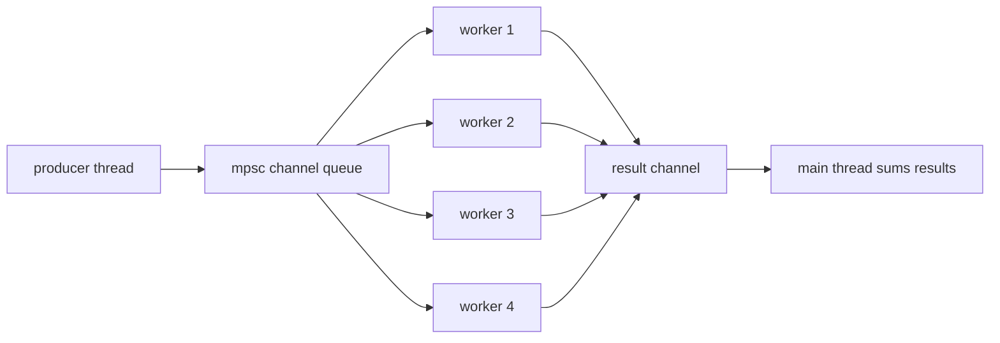

# Chapter 20 — Channels and Shared State

> **What you'll learn.** Two ways for threads to work together: sending messages
> through *channels*, and sharing memory behind a lock or an atomic. You will see
> when to pick each, and how Rust makes both safe by default.

In Chapter 19 — Threads and Concurrency you learned how to start threads and why
the compiler will not let two threads touch the same mutable data without
protection. This chapter is about the two safe ways to make threads cooperate:

- **Message passing.** One thread *sends* a value to another through a channel.
  Ownership moves with the message. This is the focus of the first half.
- **Shared state.** Threads share one piece of memory, guarded by a lock
  (`Mutex`, `RwLock`) or an atomic. This is the second half.

> **Mental model.** A channel is a one-way pipe between threads, like a Unix pipe
> or a POSIX message queue — but type-safe, and it moves ownership of whatever you
> put in. Shared state is the classic C model: one buffer, one `pthread_mutex_t`,
> everybody locks before touching it.

## Channels: `std::sync::mpsc`

The standard library channel lives in `std::sync::mpsc`. The name **mpsc** means
**multi-producer, single-consumer**: many threads may send, but only one thread
receives.

You create a channel with `channel()`. It returns a pair: a **sender** (`tx`, for
"transmit") and a **receiver** (`rx`, for "receive").

```rust
use std::sync::mpsc;
use std::thread;

fn main() {
    let (tx, rx) = mpsc::channel();

    thread::spawn(move || {
        tx.send(42).unwrap(); // send moves 42 into the channel
    });

    let value = rx.recv().unwrap(); // block until a value arrives
    println!("got {value}");
}
```

Three things to notice:

- `tx.send(v)` **moves** `v` into the channel. After you send a value you no
  longer own it; the receiving thread does. For a non-`Copy` type like `String`,
  the sender cannot use the value again. This is the borrow checker enforcing the
  same single-owner rule you already know.
- `rx.recv()` **blocks** the calling thread until a value is ready (or the channel
  closes). It returns a `Result`, so we `unwrap()` here; real code would handle the
  error case.
- The `move` keyword on the closure moves `tx` into the new thread, so the thread
  owns its sender. (See Chapter 19 — Threads and Concurrency for `move` closures.)

> **C vs Rust.** In C you would build this yourself: a buffer, a
> `pthread_mutex_t`, and a `pthread_cond_t` to wake the reader. You must remember
> to lock, signal, and unlock in the right order. The Rust channel hands you all of
> that, correct, in two lines.

### Ownership moves through the channel

Because `send` moves the value, this does **not** compile:

```rust
// COMPILE ERROR: borrow of moved value: `msg`
use std::sync::mpsc;

fn main() {
    let (tx, _rx) = mpsc::channel();
    let msg = String::from("hello");
    tx.send(msg).unwrap();      // msg moves into the channel
    println!("{msg}");          // error[E0382]: msg was moved
}
```

The receiver now owns the `String`. The sender giving it away means there is never
a moment when two threads both own it — so there is no data race to worry about.

### Multiple producers: clone the sender

To have several threads send, **clone** the sender. Each clone is another handle to
the same channel. The single receiver collects everything.

```rust
use std::sync::mpsc;
use std::thread;

fn main() {
    let (tx, rx) = mpsc::channel();

    for id in 0..3 {
        let tx = tx.clone();          // each thread gets its own sender
        thread::spawn(move || {
            tx.send(id).unwrap();
        });
    }
    drop(tx); // drop the original sender so the channel can close later

    for value in rx {                 // iterate until the channel closes
        println!("received {value}");
    }
}
```

The order of the three values is not fixed; the threads race. The `for value in rx`
loop receives values until the channel closes (explained below).

### Receiving: `recv`, `try_recv`, and iterating

There are three ways to take values out:

- `rx.recv()` — block until a value arrives. Returns `Err` if the channel closed.
- `rx.try_recv()` — return immediately. `Ok(v)` if a value was ready, `Err`
  otherwise. Use this in a poll loop when you must not block.
- `for v in rx` (or `rx.iter()`) — loop, blocking for each value, and stop when the
  channel closes. This is the cleanest pattern for a consumer.

```rust
use std::sync::mpsc;

fn main() {
    let (tx, rx) = mpsc::channel();
    tx.send(1).unwrap();

    match rx.try_recv() {
        Ok(v) => println!("ready: {v}"),
        Err(_) => println!("nothing yet"),
    }
}
```

### The channel closes when all senders drop

A channel stays open as long as at least one sender exists. When the **last**
sender is dropped, the channel **closes**. After that, `recv()` returns an `Err`
(`RecvError`), and a `for v in rx` loop ends. This is how the consumer knows "no
more messages will ever come."

```rust
use std::sync::mpsc;

fn main() {
    let (tx, rx) = mpsc::channel::<i32>();
    drop(tx); // no senders remain

    match rx.recv() {
        Ok(v) => println!("got {v}"),
        Err(e) => println!("channel closed: {e}"), // this branch runs
    }
}
```

> **Watch out.** If you clone the sender into threads but also keep the original
> `tx` alive in `main`, the channel never closes and a `for v in rx` loop blocks
> forever. Drop the extra sender (or let it go out of scope) so the channel can
> close. This is the most common channel bug for newcomers.

### Bounded channels: `sync_channel`

`channel()` is **unbounded**: `send` never blocks, and the queue can grow without
limit. If a fast producer outruns a slow consumer, memory grows.

`sync_channel(n)` makes a **bounded** channel with room for `n` buffered values.
When the buffer is full, `send` **blocks** until the consumer takes one out. This
is *backpressure*: the producer is forced to slow down.

```rust
use std::sync::mpsc;
use std::thread;

fn main() {
    let (tx, rx) = mpsc::sync_channel(2); // buffer holds 2 values

    let producer = thread::spawn(move || {
        for i in 0..5 {
            tx.send(i).unwrap(); // blocks when the buffer is full
        }
    });

    for value in rx {
        println!("got {value}");
    }
    producer.join().unwrap();
}
```

A `sync_channel(0)` is a *rendezvous* channel: every `send` waits for a matching
`recv`, so the two threads meet exactly.

## A producer/consumer example

Here is a complete worker pool: one producer sends 100 jobs, four workers square
each number, and the main thread sums the results. It joins every thread and the
total is deterministic (the sum of squares of 1 to 100 is 338350).

```rust
use std::sync::mpsc;
use std::sync::{Arc, Mutex};
use std::thread;

fn main() {
    let (job_tx, job_rx) = mpsc::channel::<u64>();
    let (result_tx, result_rx) = mpsc::channel::<u64>();

    // std mpsc has ONE receiver. To share it among workers, wrap it
    // in Arc<Mutex<...>> so each worker can lock and take one job.
    let job_rx = Arc::new(Mutex::new(job_rx));

    let mut workers = Vec::new();
    for _ in 0..4 {
        let job_rx = Arc::clone(&job_rx);
        let result_tx = result_tx.clone();
        workers.push(thread::spawn(move || loop {
            // Lock, take one job, then unlock before doing work.
            let job = job_rx.lock().unwrap().recv();
            match job {
                Ok(n) => result_tx.send(n * n).unwrap(),
                Err(_) => break, // job channel closed: stop
            }
        }));
    }
    drop(result_tx); // workers hold the only remaining result senders

    for n in 1..=100 {
        job_tx.send(n).unwrap();
    }
    drop(job_tx); // close the job channel so workers stop

    let total: u64 = result_rx.iter().sum(); // ends when all workers exit

    for w in workers {
        w.join().unwrap();
    }
    println!("sum of squares 1..=100 = {total}"); // 338350
}
```

> **Deep dive.** Wrapping the receiver in `Arc<Mutex<...>>` works, but a worker
> holds the lock while it calls `recv()`. If `recv()` had to wait, the other
> workers would wait too. For a real multi-consumer queue, reach for a crate (see
> below) that supports many receivers directly.



### The C version: a hand-built queue

To do the same in C you write the thread-safe queue yourself: a buffer, a mutex,
and two condition variables (one for "not empty", one for "not full").

```c
/* A bounded thread-safe queue: mutex plus two condition variables. */
#include <pthread.h>
#define CAP 64

typedef struct {
    int buf[CAP];
    int head, tail, count;
    pthread_mutex_t lock;
    pthread_cond_t not_empty;
    pthread_cond_t not_full;
} queue_t;

void q_push(queue_t *q, int v) {
    pthread_mutex_lock(&q->lock);
    while (q->count == CAP)
        pthread_cond_wait(&q->not_full, &q->lock);
    q->buf[q->tail] = v;
    q->tail = (q->tail + 1) % CAP;
    q->count++;
    pthread_cond_signal(&q->not_empty);
    pthread_mutex_unlock(&q->lock);
}

int q_pop(queue_t *q) {
    pthread_mutex_lock(&q->lock);
    while (q->count == 0)
        pthread_cond_wait(&q->not_empty, &q->lock);
    int v = q->buf[q->head];
    q->head = (q->head + 1) % CAP;
    q->count--;
    pthread_cond_signal(&q->not_full);
    pthread_mutex_unlock(&q->lock);
    return v;
}
```

That whole file is one `mpsc::sync_channel(64)` in Rust — and the Rust version
cannot deadlock from a forgotten unlock or signal the wrong condition variable.

## Channels vs shared state

There is a famous slogan, from Go but true in Rust too:

> **Rule of thumb.** "Do not communicate by sharing memory; share memory by
> communicating." When in doubt, send a message and move ownership. It is easier to
> reason about than locks.

Channels shine when you want to **transfer ownership** of work or results between
threads, or to **coordinate** stages of a pipeline. There is no lock to hold and no
shared mutable state to reason about.

But sometimes shared state is simpler. If many threads need to read or update **one
counter** or **one configuration value**, passing messages around is awkward. A
`Mutex` or an atomic is the direct tool. Use shared state when:

- the data is small and naturally lives in one place (a counter, a cache, a map),
- many threads read the same thing, or
- the cost of copying or moving the data through a channel is too high.

## Shared state: `Arc<Mutex<T>>`

You met `Arc<Mutex<T>>` in Chapter 19 — Threads and Concurrency. Here is the recap.

- **`Arc<T>`** is an **a**tomically **r**eference-**c**ounted pointer. It lets many
  threads share ownership of the same value; the value is dropped when the last
  `Arc` goes away. (It is the thread-safe version of `Rc` from Chapter 17 — Smart
  Pointers.)
- **`Mutex<T>`** guards the value. `lock()` returns a *guard*; while you hold the
  guard you have exclusive access, and the lock is released automatically when the
  guard drops. No manual unlock, ever.

```rust
use std::sync::{Arc, Mutex};
use std::thread;

fn main() {
    let counter = Arc::new(Mutex::new(0));
    let mut handles = Vec::new();

    for _ in 0..10 {
        let counter = Arc::clone(&counter);
        handles.push(thread::spawn(move || {
            let mut n = counter.lock().unwrap(); // lock; guard frees it
            *n += 1;
        }));
    }

    for h in handles {
        h.join().unwrap();
    }
    println!("total = {}", *counter.lock().unwrap()); // always 10
}
```

> **C vs Rust.** In C the data and its mutex are two separate variables; nothing
> stops you from touching the data without locking. In Rust the data lives *inside*
> the `Mutex`, so you literally cannot reach it without locking first. The type
> system enforces the discipline you have to remember by hand in C.

### `RwLock`: many readers or one writer

A `Mutex` lets exactly one thread in at a time, even for reading. An **`RwLock`**
(reader-writer lock) is smarter: it allows **many readers at once**, or **one
writer alone**. Use it when reads are common and writes are rare.

```rust
use std::sync::{Arc, RwLock};
use std::thread;

fn main() {
    let data = Arc::new(RwLock::new(vec![1, 2, 3]));

    let mut handles = Vec::new();
    for _ in 0..3 {
        let data = Arc::clone(&data);
        handles.push(thread::spawn(move || {
            let guard = data.read().unwrap(); // many readers allowed
            println!("sum = {}", guard.iter().sum::<i32>());
        }));
    }

    {
        let mut guard = data.write().unwrap(); // one writer, exclusive
        guard.push(4);
    }

    for h in handles {
        h.join().unwrap();
    }
}
```

This is exactly C's `pthread_rwlock_t`, but the read guard and write guard release
the lock automatically when they drop.

### Atomics: lock-free counters

For a single integer, a full `Mutex` is overkill. An **atomic** type performs reads
and writes that cannot be interrupted, with no lock at all. `AtomicUsize`,
`AtomicU64`, `AtomicBool`, and friends live in `std::sync::atomic`.

Every atomic operation takes an **`Ordering`**, which tells the compiler and CPU how
strictly this operation must be ordered against others. This is the same idea as
C11's `<stdatomic.h>` memory orders (`memory_order_relaxed`, `memory_order_seq_cst`,
and so on).

```rust
use std::sync::Arc;
use std::sync::atomic::{AtomicUsize, Ordering};
use std::thread;

fn main() {
    let counter = Arc::new(AtomicUsize::new(0));
    let mut handles = Vec::new();

    for _ in 0..10 {
        let counter = Arc::clone(&counter);
        handles.push(thread::spawn(move || {
            counter.fetch_add(1, Ordering::Relaxed); // atomic increment
        }));
    }

    for h in handles {
        h.join().unwrap();
    }
    println!("total = {}", counter.load(Ordering::Relaxed)); // 10
}
```

For a plain counter where you only care about the final count, `Ordering::Relaxed`
is correct and fast: it guarantees the increments do not get lost, but makes no
promise about ordering relative to other variables. When an atomic is used as a
flag that *guards* other data, you need a stronger ordering.

> **Rule of thumb.** If you are unsure which `Ordering` to use, choose
> `Ordering::SeqCst` (sequentially consistent). It is the strongest and easiest to
> reason about. Optimize to `Relaxed` only for independent counters where order does
> not matter.

## Faster channels in the ecosystem

The standard `mpsc` is fine, but two crates are popular when you need more:

- **`crossbeam`** — fast channels, including **multi-consumer** channels (many
  receivers), plus other lock-free data structures. Add it with `cargo add
  crossbeam`.
- **`flume`** — a drop-in, faster channel that is both multi-producer and
  multi-consumer, and works in both sync and async code. Add it with `cargo add
  flume`.

If you found yourself wrapping a receiver in `Arc<Mutex<...>>` (as in the worker
example), that is a sign you want one of these instead.

## Key takeaways

- A channel from `std::sync::mpsc` is **multi-producer, single-consumer**.
  `channel()` returns `(tx, rx)`.
- `tx.send(v)` **moves** `v` to the receiver. Clone `tx` to get multiple producers.
- Receive with `rx.recv()` (blocking), `rx.try_recv()` (non-blocking), or
  `for v in rx` (until closed).
- The channel **closes when all senders are dropped**; then `recv` returns `Err`.
- `sync_channel(n)` is bounded and applies backpressure; `sync_channel(0)` is a
  rendezvous.
- Prefer **message passing** to transfer ownership; prefer **shared state**
  (`Arc<Mutex<T>>`, `RwLock`, atomics) for a small value many threads touch.
- `RwLock` allows many readers or one writer; atomics give lock-free counters with
  an explicit `Ordering`.
- `crossbeam` and `flume` offer faster and multi-consumer channels.

## Watch out (gotchas for C programmers)

- **`send` moves ownership.** You cannot use a value after sending it (unless it is
  `Copy`). The receiver owns it now.
- **The channel closes only when every sender drops.** Keep an extra `tx` alive and
  the consumer loop blocks forever. Drop senders you do not need.
- **std `mpsc` has a single consumer.** To fan work out to many receivers, share the
  receiver behind a lock or use `crossbeam`/`flume`.
- **Channel or mutex?** Moving data through a channel avoids shared mutable state.
  Reach for a `Mutex` only when several threads genuinely share one value.
- **Atomic orderings matter.** `Relaxed` is fine for an independent counter, but not
  when the atomic guards other data. Use `SeqCst` when in doubt.
- **A `Mutex` guard holds the lock until it drops.** Holding it across a blocking
  call (like `recv()`) can serialize your threads. Keep critical sections short.

## Interview questions

**Q: What does "mpsc" mean, and how do you get multiple producers?**
A: It means multi-producer, single-consumer. `channel()` gives one sender and one
receiver. To have multiple producers, you `clone()` the sender; each clone is
another handle to the same channel, and the single receiver collects all messages.

**Q: When does a `std::sync::mpsc` channel close, and how does the receiver find
out?**
A: The channel closes when the last sender is dropped. After that, `rx.recv()`
returns `Err(RecvError)` and a `for v in rx` loop ends. This is how the consumer
knows no more messages will arrive.

**Q: What is the difference between `channel()` and `sync_channel(n)`?**
A: `channel()` is unbounded — `send` never blocks and the queue can grow without
limit. `sync_channel(n)` is bounded to `n` buffered messages; `send` blocks when the
buffer is full, giving backpressure. `sync_channel(0)` is a rendezvous: each send
waits for a matching receive.

**Q: When would you use shared state instead of a channel?**
A: When several threads need to read or update one small piece of data — a counter,
a cache, a config value — that naturally lives in one place. Passing it through a
channel would be awkward. Use `Arc<Mutex<T>>`, `RwLock`, or an atomic instead.

**Q: Why does `Mutex<T>` in Rust hold the data inside it, and why is that better
than C's separate mutex and buffer?**
A: Because the only way to reach the data is to call `lock()`, which returns a guard
giving exclusive access. You cannot forget to lock — the type system requires it.
In C the mutex and the data are separate variables, so nothing stops you from
touching the data without locking, which causes data races.

## Try it

1. Build the multi-producer example, but keep the original `tx` alive in `main`
   (remove the `drop(tx)`). Watch the `for v in rx` loop hang, then fix it.
2. Replace the `Mutex<i32>` counter with an `AtomicUsize` and `fetch_add`. Confirm
   you get the same total of 10 with less code.
3. Change `channel()` in the worker example to `sync_channel(4)` and add a small
   `thread::sleep` in the consumer. Notice the producer slowing down to match.
