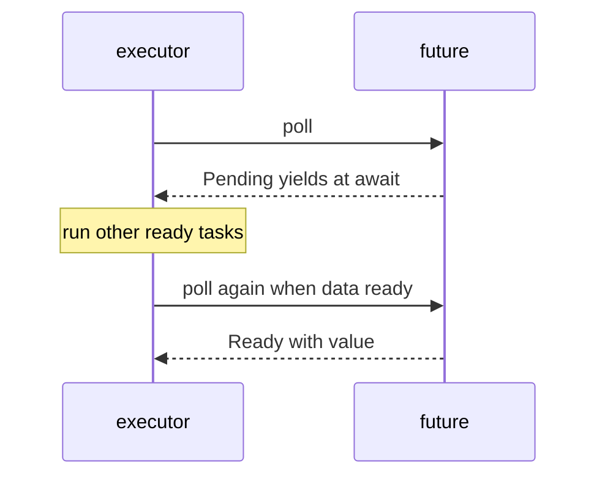

# Chapter 21 — Async/Await

> **What you'll learn.** What `async`/`.await` is, why it exists, and how it lets
> one program handle thousands of network connections without one thread each. You
> will also learn why async needs a *runtime* (almost always Tokio), and when to
> reach for async versus plain threads.

> **Note on crates.** The standard library has the `async`/`.await` *syntax* and the
> `Future` type, but **no runtime to run futures**. So almost every example in this
> chapter needs an external crate, **Tokio**. Before running them, add it:
>
> ```sh
> cargo add tokio --features full
> ```
>
> Examples that need Tokio are marked. They will **not** compile with the standard
> library alone. The one std-only example is marked as such.

## The problem: thousands of connections

Imagine a network server that handles 10,000 clients at once. Most of the time each
client is just *waiting* — for a packet to arrive, for the disk to respond. The work
is **I/O-bound**: limited by waiting, not by the CPU.

The classic C approach is **one thread (or process) per connection**. It is simple
to write, but every thread costs memory (a stack, often megabytes) and the operating
system must switch between them. At 10,000 threads this becomes expensive and slow.

The other classic C approach is a single-threaded **event loop** with `epoll` (or
`kqueue`, or `select`). One thread watches all the sockets and reacts when one is
ready. This scales beautifully but is painful to write: you hand-build a *state
machine* for each connection and store its progress in a struct.

```c
/* A classic C event loop: one thread, epoll, manual state per connection. */
int ep = epoll_create1(0);
/* register sockets ... */
for (;;) {
    int n = epoll_wait(ep, events, MAX, -1);
    for (int i = 0; i < n; i++) {
        conn_t *c = events[i].data.ptr;
        switch (c->state) {                 /* hand-written state machine */
            case READING_HEADER: /* ... */ break;
            case READING_BODY:   /* ... */ break;
            case WRITING_REPLY:  /* ... */ break;
        }
    }
}
```

Async/await gives you the **scalability of the event loop** with code that **reads
like the simple one-thread-per-connection version**. The compiler builds the state
machine for you.

> **Mental model.** `async`/`.await` is an automatic version of the `epoll` state
> machine. You write straight-line code with `.await` where it would block; the
> compiler turns each function into a state machine that pauses and resumes at those
> points.

## `async fn` returns a future

Mark a function `async` and it becomes an **asynchronous function**. Calling it does
**not** run its body. Instead it returns a **future**: a value that represents a
computation that will finish *later*.

A future is **lazy**. It does nothing until you `.await` it or hand it to the
runtime. This surprises everyone coming from threads, where starting work is
immediate.

```rust
// This example compiles with the standard library alone (no Tokio).
async fn say_hello() {
    println!("hello");
}

fn main() {
    let _future = say_hello(); // NOTHING prints: the future is lazy
    println!("the future was created but not run");
}
```

Running this prints only the second line. The `say_hello` body never runs, because
nobody awaited the future. (Edition 2024 puts `Future` in the prelude, so you do not
need to import it.)

> **C vs Rust.** A C function call runs the body right away. A Rust `async fn` call
> builds a state machine and returns it, frozen at the start. It is more like
> getting a function pointer plus its saved state than calling the function.

### `.await` runs it and yields

Inside another `async` function, `.await` drives a future to completion. While the
future is waiting (for a timer, a socket, a lock), `.await` **yields control** back
to the runtime so other tasks can run on the same thread. When the future is ready,
your function resumes right after the `.await`.

```rust
// needs: cargo add tokio --features full
use tokio::time::{sleep, Duration};

#[tokio::main]
async fn main() {
    println!("start");
    sleep(Duration::from_millis(100)).await; // yield for 100 ms
    println!("done after 100 ms");
}
```

While `sleep(...).await` waits, the thread is free to run other tasks. It is **not**
blocked the way `std::thread::sleep` blocks an OS thread.

## Futures need a runtime

A future is just a state machine. Something has to **poll** it — call it repeatedly,
advancing it past each `.await` as data becomes ready. That something is the
**runtime** (also called the **executor**).

The standard library has the future *machinery* but **no executor**. So you pull in
a crate. The dominant choice is **Tokio**. Others exist (`async-std`, `smol`), but
Tokio is the default for most of the ecosystem.

The `#[tokio::main]` attribute is a small macro that sets up the runtime and runs
your `async fn main` on it. It rewrites your `main` into a normal `fn main` that
starts Tokio and blocks on your async code.

```rust
// needs: cargo add tokio --features full
#[tokio::main]
async fn main() {
    println!("running on the Tokio runtime");
}
```

> **C vs Rust.** The runtime is your `epoll` loop, written once and reused. In C you
> write that loop yourself in every event-driven program. In Rust you depend on
> Tokio and let it own the loop.

### Spawning tasks

`tokio::spawn` hands a future to the runtime as a **task** — an independent unit the
runtime drives, much like a lightweight thread. Unlike `tokio::spawn`, simply
creating a future does nothing; spawning is one of the two ways (with `.await`) to
make a future actually run. `spawn` returns a handle you can `.await` to get the
task's result.

```rust
// needs: cargo add tokio --features full
use tokio::time::{sleep, Duration};

#[tokio::main]
async fn main() {
    let handle = tokio::spawn(async {
        sleep(Duration::from_millis(50)).await;
        "task result"
    });

    let result = handle.await.unwrap(); // wait for the task, get its value
    println!("{result}");
}
```

A task is far cheaper than an OS thread. Tokio happily runs hundreds of thousands of
tasks on a small pool of threads, because a waiting task costs almost nothing — just
its saved state, no separate stack.

### Tokio channels

Tokio provides its own channels in `tokio::sync`, whose `send`/`recv` are `async`
(they `.await` instead of blocking a thread). They mirror the `std::sync::mpsc`
channels from Chapter 20 — Channels and Shared State.

```rust
// needs: cargo add tokio --features full
use tokio::sync::mpsc;

#[tokio::main]
async fn main() {
    let (tx, mut rx) = mpsc::channel::<i32>(8); // bounded, capacity 8

    tokio::spawn(async move {
        for i in 0..5 {
            tx.send(i).await.unwrap(); // async send
        }
    });

    while let Some(value) = rx.recv().await { // ends when all senders drop
        println!("got {value}");
    }
}
```

## Concurrency within a task

Spawning makes separate tasks. But you can also run several futures **inside one
task** and wait for them together.

`tokio::join!` runs futures concurrently and waits for **all** of them. Two
100-millisecond waits finish in about 100 milliseconds total, not 200, because they
overlap.

```rust
// needs: cargo add tokio --features full
use tokio::time::{sleep, Duration};

async fn fetch(name: &str, ms: u64) -> String {
    sleep(Duration::from_millis(ms)).await;
    format!("{name} done")
}

#[tokio::main]
async fn main() {
    let (a, b) = tokio::join!(fetch("a", 100), fetch("b", 100));
    println!("{a}, {b}"); // about 100 ms total, not 200
}
```

`tokio::select!` waits for the **first** of several futures to finish and drops the
rest. It is perfect for timeouts and racing two operations.

```rust
// needs: cargo add tokio --features full
use tokio::time::{sleep, Duration};

#[tokio::main]
async fn main() {
    tokio::select! {
        _ = sleep(Duration::from_millis(50)) => {
            println!("the 50 ms timer won");
        }
        _ = sleep(Duration::from_millis(100)) => {
            println!("the 100 ms timer won");
        }
    }
}
```

Here is the state-machine view of one future pausing and resuming at its `.await`
points. The executor polls it, gets `Pending`, runs other work, and polls again when
the data is ready.



## `async` and `Send`

Tokio's default runtime is **multi-threaded**: it may move a task from one thread to
another at an `.await` point. So any data a future holds **across** an `.await` must
be safe to send between threads — it must be `Send` (see Chapter 19 — Threads and
Concurrency).

This future does not compile, because it holds an `Rc` (which is not `Send`) across
an `.await`:

```rust
// COMPILE ERROR: future cannot be sent between threads safely
// (also needs: cargo add tokio --features full)
use std::rc::Rc;
use tokio::time::{sleep, Duration};

async fn bad() {
    let x = Rc::new(5);                       // Rc is not Send
    sleep(Duration::from_millis(10)).await;   // x is held across .await
    println!("{x}");
}

#[tokio::main]
async fn main() {
    tokio::spawn(bad()).await.unwrap(); // spawn requires a Send future
}
```

The fix is to use a `Send` type (`Arc` instead of `Rc`), or to make sure the
non-`Send` value is dropped *before* the `.await`.

### Do not block inside async

A future shares its thread with many other tasks. If you do **blocking** work inside
an `async` function — a long CPU computation, `std::thread::sleep`, a synchronous
file read — you freeze that thread. Every other task scheduled on it is **starved**
until you finish. This is the most common async performance bug.

For blocking or CPU-heavy work, hand it to `tokio::task::spawn_blocking`, which runs
it on a separate thread pool meant for blocking jobs.

```rust
// needs: cargo add tokio --features full
#[tokio::main]
async fn main() {
    let result = tokio::task::spawn_blocking(|| {
        // CPU-heavy or blocking work belongs here, off the async threads.
        (1..=1_000_000u64).sum::<u64>()
    })
    .await
    .unwrap();

    println!("sum = {result}");
}
```

> **Watch out.** Use `tokio::time::sleep(...).await`, not `std::thread::sleep(...)`,
> inside async code. The first yields to the runtime; the second blocks the whole
> thread and starves other tasks.

## When async, when threads

Both async and threads give concurrency. Choose by the kind of work:

| Situation | Best tool | Why |
|---|---|---|
| Many I/O-bound tasks waiting on the network | async (Tokio) | Cheap tasks, no thread per connection |
| A few CPU-bound jobs | threads | Real parallelism across cores |
| Lots of CPU-bound data parallelism | `rayon` crate | Easy parallel iterators over cores |
| Mixed: async server doing occasional heavy work | async + `spawn_blocking` | Keep the event loop free |

> **Rule of thumb.** I/O-bound and many connections → async. CPU-bound → threads or
> `rayon`. Do not pick async just because it is new; for CPU work it adds complexity
> with no benefit.

### Function coloring

`async` "colors" your functions. You can only `.await` a future inside an `async`
function. A normal function cannot `.await`; it must either block on a runtime or
become `async` itself. So `async` tends to spread upward through your call stack —
callers of async code often must be async too. People call this the "what color is
your function" problem. It is the main ergonomic cost of async, and a reason to keep
plain synchronous code synchronous unless you need async.

> **C vs Rust.** In a C event loop, "async-ness" spreads too: any function that
> might wait must return to the event loop instead of blocking, so it splits into
> callbacks or state transitions. Rust's `async`/`.await` is the same constraint,
> but the compiler writes the state machine and the code still reads top to bottom.

## Key takeaways

- Async exists to handle **many I/O-bound tasks** cheaply, without one OS thread per
  connection.
- An `async fn` returns a **future**: a lazy state machine that does nothing until
  it is `.await`ed or spawned.
- `.await` drives a future and **yields** control to the runtime while waiting, so
  other tasks run.
- Futures need a **runtime**; the std library has none, so you use a crate — almost
  always **Tokio** (`#[tokio::main]`, `tokio::spawn`, `tokio::time::sleep`,
  `tokio::sync` channels).
- Run futures together with `tokio::join!` (wait for all) and `tokio::select!` (take
  the first).
- A future held across an `.await` must be **`Send`** on a multi-threaded runtime.
- **Never block** inside async; use `tokio::task::spawn_blocking` for CPU or blocking
  work.
- I/O-bound → async; CPU-bound → threads or `rayon`. `async` "colors" functions.

## Watch out (gotchas for C programmers)

- **Futures are lazy.** Calling an `async fn` runs nothing. You must `.await` it or
  spawn it. A "missing await" often shows as a compiler warning that a future is
  unused.
- **You need a runtime.** Plain std cannot run a future. Add Tokio and use
  `#[tokio::main]` or build a runtime yourself.
- **Blocking starves the executor.** A long CPU loop or `std::thread::sleep` inside
  async freezes every task on that thread. Use `spawn_blocking`.
- **`Send` across `.await`.** Holding a non-`Send` value (like `Rc`) across an
  `.await` fails to compile on the multi-threaded runtime. Use `Arc`, or drop the
  value before the `.await`.
- **Async colors your functions.** `.await` is only allowed in `async` contexts, so
  async tends to spread up the call stack. Do not make code async unless it benefits.

## Interview questions

**Q: What does an `async fn` return, and what does "lazy" mean here?**
A: It returns a future — a state machine representing a computation that finishes
later. "Lazy" means the body does not run when you call the function; nothing happens
until the future is `.await`ed or handed to a runtime to be spawned.

**Q: Why does async Rust need an external crate when threads do not?**
A: The standard library provides the `async`/`.await` syntax and the `Future` trait,
but no executor to poll futures to completion. You need a runtime such as Tokio (or
async-std, smol) to actually drive the futures. Threads, by contrast, are provided by
the OS through `std::thread`.

**Q: What happens if you do blocking work inside an async task, and how do you fix
it?**
A: You block the thread the executor is using, so every other task scheduled on that
thread is starved until you finish. Fix it by moving CPU-heavy or blocking work to
`tokio::task::spawn_blocking`, which uses a separate thread pool, and by using async
equivalents (like `tokio::time::sleep`) instead of blocking ones.

**Q: Why must a future be `Send` to be spawned on Tokio's multi-threaded runtime?**
A: The runtime may move a task between worker threads at an `.await` point. Any data
the future keeps alive across that point therefore crosses threads, so it must be
`Send`. Holding a non-`Send` type like `Rc` across an `.await` is a compile error.

**Q: When would you choose threads over async?**
A: For CPU-bound work that needs real parallelism across cores. Async helps with
I/O-bound work where tasks mostly wait. For heavy computation, threads (or the
`rayon` crate for data parallelism) are simpler and just as fast, with none of
async's function-coloring overhead.

## Try it

1. Run the lazy-future example and confirm "hello" never prints. Then add Tokio,
   make `main` async with `#[tokio::main]`, and `say_hello().await`. Now it prints.
2. Build the `tokio::join!` example and time it. Change one wait to 300 ms and watch
   the total become about 300 ms — the join waits for the slowest.
3. Put a `std::thread::sleep(Duration::from_secs(1))` inside a spawned task and start
   several tasks. Notice how they no longer overlap, then switch to
   `tokio::time::sleep` and see them run concurrently again.
