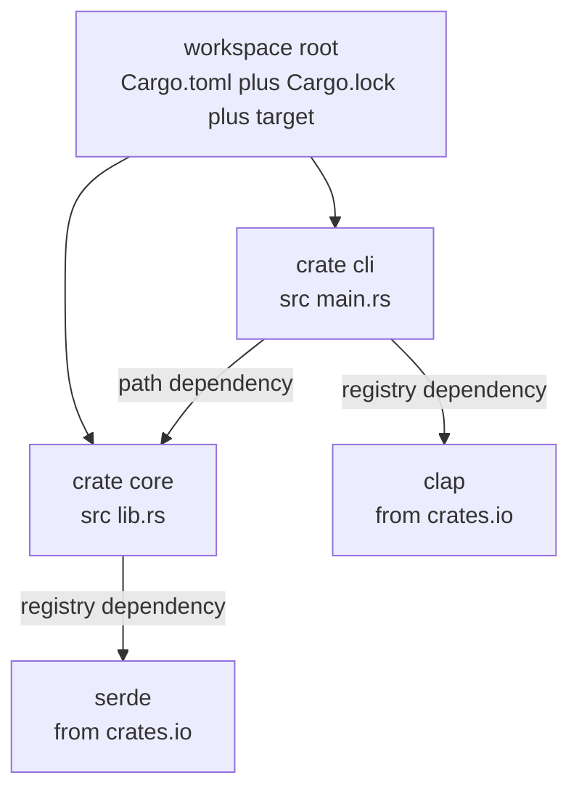

# Chapter 22 — Cargo, Crates, and Workspaces

> **What you'll learn.** How Cargo manages dependencies: the full `Cargo.toml`
> manifest, version requirements and the lockfile, the crates.io ecosystem,
> optional features, and workspaces that hold many crates in one repository. This
> is the dependency and packaging story C never standardized.

Chapter 2 — Installing Rust and the Cargo Toolchain gave you the command tour:
`cargo new`, `build`, `run`, `add`. This chapter goes deeper. It is about the
**package model** — how Cargo decides which versions to download, how it makes
builds reproducible, and how you split a large project into several crates.

## The problem C never solved

C has no standard package manager. To use a library in C, you do this by hand:

- Find the library and install a `-dev` package with your operating system's
  package manager (`apt`, `dnf`, `brew`), or copy its source into your tree.
- Tell the compiler where the headers are with `-I/path/to/include`.
- Tell the linker where the library file is with `-L/path/to/lib`.
- Name the library to link with `-lfoo`.
- Hope the version installed on the build machine matches what your code expects.
  There is no built-in record of "exactly which version did we build against."

```sh
# C: a typical manual build against zlib
cc main.c -I/usr/include -L/usr/lib -lz -o main
```

Every project reinvents this in a Makefile or CMake file. There is no central
registry, no standard version syntax, and no lockfile.

Cargo replaces all of it. You declare what you need in one file; Cargo fetches it
from a central registry, picks compatible versions, records the exact result, and
passes the right flags to the compiler.

> **C vs Rust.** In C, dependencies live in your operating system and your build
> script. In Rust, dependencies live **in the project**: named in `Cargo.toml`,
> pinned in `Cargo.lock`, cached under `~/.cargo`. Clone the repo, run
> `cargo build`, and it just works.

## `Cargo.toml` in depth

`Cargo.toml` is the **manifest**: the file Cargo reads to learn your project's
name, edition, and dependencies. It is written in TOML, a simple key-value format
where `[name]` starts a table (a section) and `key = value` sets a field. Here is
a fuller example than the one `cargo new` gives you, annotated section by section.

```toml
[package]
name = "imageproc"        # the crate name (lowercase, dashes ok in the name)
version = "0.3.1"         # this crate's own version (semantic versioning)
edition = "2024"          # the language edition; this book uses 2024
description = "Tiny image filters"   # shown on crates.io if you publish
license = "MIT OR Apache-2.0"        # standard dual license for Rust crates

[dependencies]
# crates needed to BUILD AND RUN your library or program
serde = { version = "1.0", features = ["derive"] }
rand = "0.9"

[dev-dependencies]
# crates needed ONLY to build tests, examples, and benchmarks.
# These are NOT compiled into your shipped library or binary.
criterion = "0.5"

[build-dependencies]
# crates needed ONLY by your build script (build.rs), if you have one
cc = "1.0"

[features]
# named on/off switches; see the Features section below
default = ["png"]
png = []
simd = []

[profile.release]
# tune the optimized build
opt-level = 3            # optimization level 0..3 (like -O0 .. -O3 in C)
lto = true               # link-time optimization across crates
codegen-units = 1        # fewer units = better optimization, slower compile
```

The four dependency tables are the important distinction:

| Table | Used when | C analogy |
|---|---|---|
| `[dependencies]` | building your library or binary | a library you `-l` link at runtime |
| `[dev-dependencies]` | building tests, examples, benchmarks | a test-only library, never shipped |
| `[build-dependencies]` | running `build.rs` before the build | a code generator you run at build time |
| `[features]` | turning optional parts on or off | `#ifdef` configuration macros |

> **Watch out.** A `dev-dependency` is invisible to anyone who *uses* your crate
> as a library. It is compiled only when you build *your* crate's own tests and
> examples. Put your test-only helpers (like `criterion`) there, not in
> `[dependencies]`, so you do not force them on your users.

### Profiles: `[profile.*]`

A **profile** is a named set of compiler settings. Cargo has built-in profiles:
`dev` (used by `cargo build`) and `release` (used by `cargo build --release`). You
override their settings in `[profile.dev]` and `[profile.release]`.

```toml
[profile.dev]
opt-level = 0            # no optimization: fast compile, slow runtime (default)

[profile.release]
opt-level = 3            # full optimization: slow compile, fast runtime
```

> **C vs Rust.** In C you pass `-O0 -g` or `-O2` on the command line, or scatter
> them through a Makefile. In Rust the optimization settings live declaratively in
> `Cargo.toml`, one place, applied to the whole dependency graph at once.

## `Cargo.lock`: reproducible builds

`Cargo.toml` says what you *want* ("serde version 1.x"). `Cargo.lock` records what
you actually *got* ("serde 1.0.210, which pulls in serde_derive 1.0.210, which
pulls in syn 2.0.77 …"). Cargo writes and updates `Cargo.lock` automatically; you
never edit it by hand.

The lockfile pins the **exact** version of every dependency, including transitive
ones (dependencies of your dependencies). Anyone who checks out your code and runs
`cargo build` gets byte-for-byte the same versions you built and tested with.

```
Cargo.toml  →  "I want serde 1.x"          (your requirement, you edit it)
Cargo.lock  →  "serde = 1.0.210 exactly"   (the resolved result, Cargo writes it)
```

> **Rule of thumb.** **Commit `Cargo.lock` to version control.** The modern
> guidance (current Cargo) is to commit it for **both applications and
> libraries**. For an application it guarantees reproducible builds. For a library
> it gives your own contributors and CI a known-good version set; consumers of
> your library still ignore your lockfile and resolve their own.

> **C vs Rust.** C has nothing like `Cargo.lock` built in. To get reproducible
> dependency versions in C you pin Git submodules, vendor source, or maintain a
> manifest yourself. Cargo gives you this for free, automatically, on every build.

## Version requirements and semver

Versions on crates.io follow **semantic versioning** (semver): `MAJOR.MINOR.PATCH`,
for example `1.4.2`. The rules:

- **MAJOR** changes when there is a breaking change (old code may stop compiling).
- **MINOR** changes when features are added in a backward-compatible way.
- **PATCH** changes for backward-compatible bug fixes.

When you write a dependency version in `Cargo.toml`, you are writing a
**requirement** — a range of acceptable versions, not one exact version. The
syntax:

| Requirement | Meaning | Allows |
|---|---|---|
| `"1.4.2"` or `"^1.4.2"` | caret (the default) | `>=1.4.2` and `<2.0.0` |
| `"~1.4.2"` | tilde | `>=1.4.2` and `<1.5.0` |
| `"=1.4.2"` | exact | only `1.4.2` |
| `"*"` | wildcard | any version (avoid this) |
| `"1"` | caret on a partial version | `>=1.0.0` and `<2.0.0` |

> **Watch out.** A bare version string like `serde = "1.0"` is **not** an exact
> pin. It is the **caret** requirement: "any 1.x version at or above 1.0,
> excluding 2.0." This surprises C programmers who expect `"1.0"` to mean exactly
> 1.0. The reason it is safe is semver: anything below 2.0 promises to stay
> backward compatible. The `Cargo.lock` file pins the exact version actually used.

### Updating dependencies

`cargo update` recomputes `Cargo.lock`, moving each dependency to the newest
version still allowed by your requirements in `Cargo.toml`.

```sh
cargo update             # update everything within the semver rules
cargo update -p serde    # update only serde (and what it needs)
cargo add serde@1.0      # add or change a requirement, then resolve
```

`cargo update` never crosses a major version boundary on its own, because your
caret requirement forbids it. To move from `1.x` to `2.x` you edit `Cargo.toml`
and accept the breaking change deliberately.

## The crates.io ecosystem

**crates.io** is the central public registry — one place where the whole community
publishes and finds libraries. **docs.rs** automatically builds and hosts the API
documentation for every published crate, so every library has browsable docs at a
predictable URL.

> **C vs Rust.** There is no crates.io for C. You search the web, your distro's
> repositories, and GitHub, and documentation quality varies wildly. In Rust,
> `cargo add foo` plus `https://docs.rs/foo` is the universal workflow.

A C programmer will meet these crates constantly. It helps to know them by name:

| Crate | Job | Why you reach for it |
|---|---|---|
| `serde` | serialization | turn structs into JSON, TOML, etc. and back |
| `tokio` | async runtime | the engine that runs `async`/`await` code (Chapter 21) |
| `clap` | command-line args | parse `argv` into typed options, with `--help` for free |
| `rand` | random numbers | there is no `rand()` in std |
| `anyhow` | easy error handling | one error type for applications (Chapter 13) |
| `thiserror` | custom error types | derive clean error enums for libraries (Chapter 13) |
| `rayon` | data parallelism | turn `.iter()` into `.par_iter()` and use all cores |
| `regex` | regular expressions | no regex in std |
| `reqwest` | HTTP client | make web requests, sync or async |

> **Rule of thumb.** Before writing low-level code, search crates.io. The things a
> C programmer often hand-rolls — argument parsing, JSON, logging, random numbers
> — are mature, well-documented crates you add in one line.

## Cargo features

A **feature** is a named, compile-time switch. Features let one crate ship
optional functionality that callers turn on or off. This is Rust's structured
answer to C's `#ifdef` configuration macros.

You declare features in the `[features]` table. Each feature lists what it
enables: other features, or **optional dependencies**.

```toml
[dependencies]
serde = { version = "1.0", optional = true }   # optional: off unless a feature turns it on

[features]
default = ["fast"]      # features enabled when the caller says nothing
fast = []               # a plain switch, enables no extra deps
json = ["dep:serde"]    # the "json" feature pulls in the optional serde dependency
```

In code, you compile blocks conditionally with the `cfg` attribute, testing for a
feature by name:

```rust
// With no "json" feature defined, the not(...) branch is the one that compiles.
#[cfg(feature = "json")]
pub fn to_json(value: &i32) -> String {
    // only compiled when the "json" feature is enabled
    format!("{{\"value\": {value}}}")
}

#[cfg(not(feature = "json"))]
pub fn to_json(_value: &i32) -> String {
    String::from("json feature disabled")
}

fn main() {
    println!("{}", to_json(&42));
}
```

> **C vs Rust.** `#[cfg(feature = "json")]` is like wrapping code in
> `#ifdef HAVE_JSON ... #endif`. The difference: features are declared in the
> manifest and resolved by Cargo across the whole dependency graph, instead of
> being passed as ad hoc `-D` flags that each build script sets differently.

Callers choose features when they depend on you:

```sh
cargo add imageproc --features json        # turn on a feature
cargo add imageproc --no-default-features  # start from nothing
```

### Feature unification

Here is the subtle part. If two different crates in your build both depend on
`serde`, and one asks for `serde` with the `derive` feature while the other does
not, Cargo enables `derive` for **both**. Features are **additive** and **unified**
across the whole dependency graph: a feature is on if *anything* turns it on.

> **Watch out.** Feature unification means you cannot assume a feature is off just
> because *you* did not enable it. Another crate in the graph may have. So a
> feature must only **add** capability, never remove or change behavior. A feature
> that makes a function behave differently when enabled can break a sibling crate
> that did not expect it.

## Workspaces: many crates, one repository

As a project grows you split it into several crates: a core library, a
command-line front end, maybe a separate crate for plugins. A **workspace** is a
set of related crates that share one `Cargo.lock` and one `target/` build
directory. They build together and stay version-consistent.

You create a workspace with a top-level `Cargo.toml` that has a `[workspace]`
table instead of (or in addition to) a `[package]` table.

```toml
# top-level Cargo.toml (the workspace root)
[workspace]
resolver = "3"           # the edition-2024 feature resolver
members = [
    "core",
    "cli",
]

[workspace.dependencies]
# versions declared once here, inherited by members
serde = { version = "1.0", features = ["derive"] }
```

A member crate inherits a shared dependency by writing `.workspace = true`:

```toml
# core/Cargo.toml
[package]
name = "core"
version = "0.1.0"
edition = "2024"

[dependencies]
serde = { workspace = true }     # use the version from the workspace root
```

### Path dependencies

Inside a workspace, one crate depends on a sibling by **path**, not by a registry
version. A **path dependency** points at a directory on disk.

```toml
# cli/Cargo.toml
[dependencies]
core = { path = "../core" }      # depend on the sibling crate in ../core
```

Now the `cli` crate can `use core::...` to call into the `core` library. When you
change `core`, rebuilding `cli` picks up the change immediately — no publishing
step.

Here is how the pieces fit together:



> **Watch out.** All members of a workspace share one `Cargo.lock`. That means one
> resolved version of `serde` is used everywhere in the workspace — you cannot
> have `core` on `serde 1.0.50` and `cli` on `serde 1.0.99` at the same time. This
> is usually what you want: consistency. Declare shared versions once in
> `[workspace.dependencies]`.

### Splitting `lib.rs` and `main.rs`

Even inside a single package, the idiomatic split is a library crate (`src/lib.rs`)
holding the logic and a thin binary crate (`src/main.rs`) that calls it. The
binary depends on the library by name. This keeps the logic testable and reusable
(see Chapter 3 — Program Structure: Crates, Modules, and Visibility).

A package can also hold standard extra directories that Cargo recognizes:

| Directory | What it holds | Run with |
|---|---|---|
| `src/` | the library and/or binary code | `cargo build` |
| `tests/` | integration tests, each file its own crate | `cargo test` |
| `examples/` | small runnable example programs | `cargo run --example name` |
| `benches/` | benchmarks | `cargo bench` |

Chapter 23 — Testing covers `tests/` in detail.

## Publishing and build scripts (briefly)

To share a crate on crates.io you publish it:

```sh
cargo login          # paste your crates.io API token, once
cargo publish        # upload the current crate
```

Once a version is published it is **permanent** — you cannot delete or overwrite
it (you can only "yank" it to stop new projects from selecting it). So follow
semver discipline: bump MAJOR for breaking changes, MINOR for new features, PATCH
for fixes.

A **build script** is a file named `build.rs` at the crate root. Cargo compiles
and runs it **before** building the crate. It is used to generate code, compile a
bundled C library (with the `cc` crate), or detect platform features. It is the
Rust answer to the configure step in a C project.

```rust
// build.rs — runs before the crate is compiled
fn main() {
    // tell Cargo to re-run this script only if build.rs itself changes
    println!("cargo::rerun-if-changed=build.rs");
}
```

> **C vs Rust.** `build.rs` plays the role of `./configure` or a code-generation
> Makefile rule, but it is ordinary Rust, runs automatically, and its dependencies
> go in `[build-dependencies]`.

## Key takeaways

- C has no standard package manager; you wire up `-I`/`-L`/`-l` by hand with no
  central registry and no lockfile. Cargo provides all of this.
- `Cargo.toml` is the manifest: `[package]`, `[dependencies]`,
  `[dev-dependencies]`, `[build-dependencies]`, `[features]`, and `[profile.*]`.
- `Cargo.lock` pins exact versions for reproducible builds. **Commit it** — for
  both applications and libraries (current guidance).
- Version requirements default to **caret**: `serde = "1.0"` means `>=1.0, <2.0`.
  `~` is tighter, `=` is exact, `*` is anything. `cargo update` moves within the
  rules.
- crates.io is the registry and docs.rs hosts the docs. Learn the common crates:
  `serde`, `tokio`, `clap`, `rand`, `anyhow`/`thiserror`, `rayon`, `regex`,
  `reqwest`.
- Features are compile-time switches and optional dependencies, tested with
  `#[cfg(feature = "...")]`. They are **additive and unified** across the graph.
- A workspace holds many crates sharing one `Cargo.lock` and one `target/`.
  Members use path dependencies on siblings and can inherit
  `[workspace.dependencies]`.

## Watch out (gotchas for C programmers)

- **The default version requirement is a caret, not an exact pin.** `"1.0"` allows
  any `1.x`. Use `=1.0.0` only when you truly need to lock one version.
- **Commit `Cargo.lock`.** It is the difference between "builds on my machine" and
  "builds everywhere, forever."
- **Feature unification is global.** A feature you did not enable may still be on
  because another crate in the graph enabled it. Features must only add behavior.
- **Workspace members share one resolved version of each dependency.** You cannot
  pin different versions of the same crate in different members of one workspace.
- **`dev-dependencies` are not shipped.** They build only for your tests and
  examples, and are invisible to crates that depend on you. Do not put runtime
  dependencies there.

## Interview questions

**Q: What is the difference between `Cargo.toml` and `Cargo.lock`, and which do you
commit?**
A: `Cargo.toml` records your *requirements* (version ranges, features) and you edit
it by hand. `Cargo.lock` records the *exact* resolved version of every dependency,
including transitive ones, and Cargo writes it for you. Commit `Cargo.lock` (for
both applications and libraries today) so builds are reproducible.

**Q: What does the dependency requirement `serde = "1.0"` actually allow?**
A: It is a caret requirement, equivalent to `>=1.0.0, <2.0.0`. It allows any 1.x
version because semver promises 1.x releases stay backward compatible. It is not an
exact pin; the exact version chosen is recorded in `Cargo.lock`.

**Q: What is feature unification and why does it matter?**
A: Cargo features are additive: if any crate in the dependency graph enables a
feature of a shared crate, that feature is enabled for every user of that crate in
the build. It matters because you cannot assume a feature is off, and because
features must only *add* capability — a feature that changes behavior can break
another crate that did not expect it.

**Q: What is a Cargo workspace and what do its members share?**
A: A workspace is a set of related crates in one repository, declared with a
`[workspace]` table. The members share one `Cargo.lock` and one `target/`
directory, so they build together with a single consistent set of dependency
versions. Members depend on each other by path and can inherit shared dependency
versions from `[workspace.dependencies]`.

**Q: How do Rust dependencies differ from linking a C library?**
A: In C you install a library system-wide, then pass `-I`, `-L`, and `-l` flags to
find headers and link, with no standard version record. In Rust you name the crate
and a version requirement in `Cargo.toml`; Cargo fetches it from crates.io, resolves
compatible versions for the whole graph, pins them in `Cargo.lock`, and passes the
right flags to the compiler automatically.

## Try it

1. Run `cargo new demo`, then `cargo add rand`. Open `Cargo.toml` and note the
   caret requirement. Open `Cargo.lock` and find the exact `rand` version chosen.
2. Run `cargo tree` to see the full dependency graph `rand` pulled in. Then
   `cargo update` and diff `Cargo.lock`.
3. Turn `demo` into a workspace: create a `core` library crate and make the binary
   depend on it with `core = { path = "../core" }`. Move a function into `core` and
   call it from `main`.
