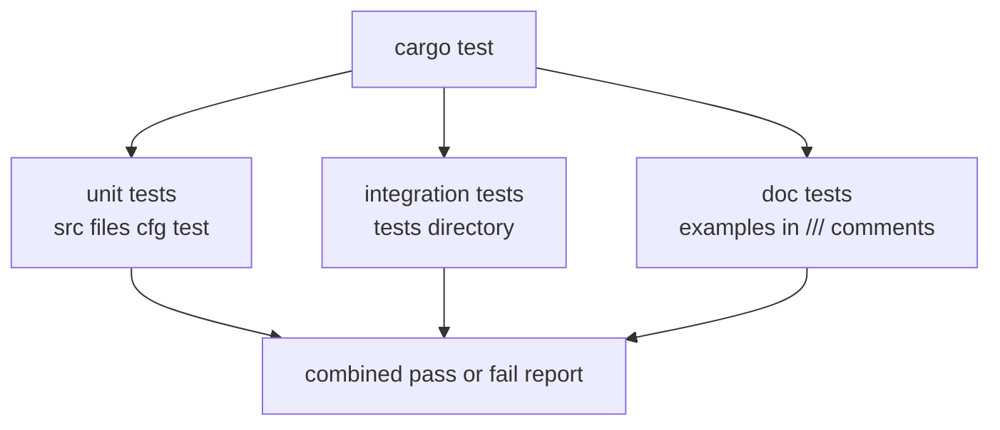

# Chapter 23 — Testing

> **What you'll learn.** How Rust builds testing into the language and the tool:
> unit tests in the same file, integration tests in `tests/`, and documentation
> tests that compile your examples. One command, `cargo test`, runs all three.

## Testing is built in, not bolted on

C has no standard test framework. Every project picks one — CUnit, Check, Unity,
Google Test for C++, or a pile of hand-written `assert()` calls and a custom
runner. There is no agreed way to write a test, find tests, or run them. Each
project teaches you its own setup.

Rust builds testing into the toolchain. A test is a function marked `#[test]`. The
compiler collects them, and `cargo test` compiles and runs them with a built-in
test runner. There is nothing to install and nothing to choose.

> **C vs Rust.** In C, "how do we run tests?" is a project decision with many
> answers. In Rust the answer is always `cargo test`. Tests live next to the code
> or in a `tests/` directory, and the tool finds them for you.

## Unit tests

A **unit test** checks one small piece of code — usually one function — in
isolation. In Rust you put unit tests in the **same file** as the code they test,
inside a module marked `#[cfg(test)]`.

The `#[cfg(test)]` attribute means "compile this module only when running tests."
So your tests add nothing to the normal build and ship nothing in your binary.

```rust
pub fn add(a: i32, b: i32) -> i32 {
    a + b
}

#[cfg(test)]
mod tests {
    use super::*;          // bring the parent module's items into scope

    #[test]
    fn adds_positive_numbers() {
        assert_eq!(add(2, 3), 5);
    }

    #[test]
    fn adds_negative_numbers() {
        assert_eq!(add(-2, -3), -5);
    }
}
```

The pieces:

- `#[cfg(test)] mod tests { ... }` — a module compiled only under test. By
  convention it is named `tests`.
- `use super::*;` — `super` is the parent module (the file's top level). The glob
  `*` imports everything from it, so the tests can call `add` directly.
- `#[test]` — marks a function as a test. It takes no arguments. If it returns
  normally, the test passes. If it **panics**, the test fails.

### The assertion macros

A **panic** is Rust's "abort this thread with an error message" (Chapter 13 —
Error Handling). The assertion macros panic when a check fails:

| Macro | Passes when | C analogy |
|---|---|---|
| `assert!(cond)` | `cond` is `true` | `assert(cond)` |
| `assert_eq!(a, b)` | `a == b` | `assert(a == b)`, but prints both values |
| `assert_ne!(a, b)` | `a != b` | `assert(a != b)`, but prints both values |

`assert_eq!` and `assert_ne!` print the actual left and right values when they
fail, which `assert(a == b)` in C cannot do. You can add a custom message:

```rust
#[test]
fn check_with_message() {
    let result = 2 + 2;
    assert_eq!(result, 4, "math broke: got {result}");
}
```

### Testing that code panics: `#[should_panic]`

Sometimes the correct behavior *is* to panic. Add `#[should_panic]` so the test
passes only if the function panics.

```rust
pub fn divide(a: i32, b: i32) -> i32 {
    if b == 0 {
        panic!("division by zero");
    }
    a / b
}

#[cfg(test)]
mod tests {
    use super::*;

    #[test]
    #[should_panic(expected = "division by zero")]
    fn panics_on_zero() {
        divide(10, 0);
    }
}
```

The optional `expected = "..."` string must appear in the panic message, so the
test does not pass for the wrong panic.

### Tests that return `Result`

A test can return `Result<(), E>` instead of nothing. Then you can use the `?`
operator inside it (Chapter 13). The test passes on `Ok` and fails on `Err`.

```rust
fn parse_port(s: &str) -> Result<u16, std::num::ParseIntError> {
    s.parse::<u16>()
}

#[cfg(test)]
mod tests {
    use super::*;

    #[test]
    fn parses_a_valid_port() -> Result<(), std::num::ParseIntError> {
        let port = parse_port("8080")?;   // `?` returns Err on failure -> test fails
        assert_eq!(port, 8080);
        Ok(())
    }
}
```

> **Rule of thumb.** Use `assert_eq!` for checking values and a `Result`-returning
> test when the code under test uses `?` itself. Returning `Result` keeps the test
> readable and avoids a pile of `.unwrap()` calls.

## Running tests with `cargo test`

```sh
cargo test                       # build and run ALL tests (unit + integration + doc)
cargo test adds                  # run only tests whose name contains "adds"
cargo test --release             # run tests with optimizations on
cargo test -- --nocapture        # show stdout/stderr from passing tests too
cargo test -- --test-threads=1   # run tests one at a time (no parallelism)
```

Two things to understand about how the runner behaves:

- **Tests run in parallel by default**, each on its own thread, to finish faster.
  This is why tests must not depend on shared global state or on running in a
  certain order. Use `--test-threads=1` to force sequential runs.
- **Output is captured.** Anything a *passing* test prints is hidden, so the
  results stay readable. A failing test's output is shown. Pass `--nocapture` to
  see output from every test.

> **Watch out.** Because tests run in parallel, two tests that both write the same
> file or environment variable can interfere. Give each test its own data, or
> serialize them with `--test-threads=1`.

Note the `--` separator, the same idea as in `cargo run`: arguments before `--` go
to Cargo; arguments after `--` go to the test runner.

## Integration tests

A **unit test** lives beside the code and can see private items. An **integration
test** lives in a separate `tests/` directory and tests your crate the way a real
user would — through its **public API only**.

Each file in `tests/` is compiled as **its own separate crate**. It does not have
access to your crate's internals; it can only `use` what you marked `pub`.

```
mypkg/
├── Cargo.toml
├── src/
│   └── lib.rs          # pub fn add(...) lives here
└── tests/
    └── api.rs          # an integration test crate
```

```rust
// tests/api.rs — a separate crate that uses mypkg's public API
use mypkg::add;          // only PUBLIC items are reachable here

#[test]
fn add_works_through_public_api() {
    assert_eq!(add(2, 2), 4);
}
```

There is no `#[cfg(test)]` here — the whole file is already test-only, because
Cargo compiles `tests/` only when testing.

> **C vs Rust.** An integration test is like writing a separate `.c` program that
> links against your library and calls only its public header functions. Rust does
> this automatically: each `tests/*.rs` file is a small client program of your
> crate.

> **Watch out.** Integration tests see only `pub` items. If a test in `tests/`
> cannot find a function, check that the function (and its module path) is public.
> A unit test in `src/` would have seen it; an integration test will not.

## Documentation tests

This is the feature C has no equivalent for. Code inside a documentation comment
is **compiled and run** by `cargo test`. That means the examples in your docs can
never silently rot — if an example stops compiling or its assertion fails, the
test suite fails.

A **doc comment** starts with `///` and documents the item right below it.
Anything inside a ` ```rust ` fenced block in that comment is a **doc test**.

```rust
/// Adds two numbers.
///
/// # Examples
///
/// ```
/// use mypkg::add;
///
/// let sum = add(2, 3);
/// assert_eq!(sum, 5);
/// ```
pub fn add(a: i32, b: i32) -> i32 {
    a + b
}
```

When you run `cargo test`, Cargo extracts that example, wraps it in a `main`
function, compiles it as a tiny standalone program, and runs it. The `assert_eq!`
makes the test meaningful: it proves the documented result is actually correct.

> **Watch out.** Doc tests really compile and run, and they run as if from
> *outside* your crate, so they can use only public items (just like an
> integration test). If you change a function's behavior, its doc-test assertion
> may start failing — that is the point.

If you want to *show* a line in the docs but not run it, or hide setup from the
reader, prefix lines with `# ` inside the code block (the `#` lines are compiled
but hidden from the rendered docs). To show code that should not run at all, tag
the block ` ```no_run ` (compiled but not executed) or ` ```ignore ` (skipped).

## What `cargo test` runs, all at once



One command compiles and runs all three kinds and prints one summary. You see a
line per kind, for example "test result: ok. 5 passed" for unit tests, then again
for the doc tests.

## Organizing tests and fixtures

A few practical patterns:

- **`#[ignore]`** marks a slow or special test that is skipped by default. Run it
  on demand with `cargo test -- --ignored`.

  ```rust
  #[test]
  #[ignore = "slow: hits the network"]
  fn talks_to_server() {
      // run only with: cargo test -- --ignored
  }
  ```

- **Fixtures via `Default` or a builder.** A *fixture* is a known starting value
  for a test. Rust needs no special fixture framework — derive `Default` or write
  a small constructor, and build your test input from it.

  ```rust
  #[derive(Default)]
  struct Config {
      retries: u32,
      verbose: bool,
  }

  #[cfg(test)]
  mod tests {
      use super::*;

      #[test]
      fn uses_a_fixture() {
          let cfg = Config { retries: 3, ..Default::default() };
          assert_eq!(cfg.retries, 3);
          assert!(!cfg.verbose);
      }
  }
  ```

- **Mocking via traits — no framework needed.** To test code that talks to the
  outside world (a clock, a database, the network), make it depend on a **trait**
  (Chapter 15 — Traits) instead of a concrete type. In tests, pass a fake
  implementation.

  ```rust
  trait Clock {
      fn now(&self) -> u64;
  }

  fn is_expired(clock: &dyn Clock, deadline: u64) -> bool {
      clock.now() > deadline
  }

  #[cfg(test)]
  mod tests {
      use super::*;

      struct FakeClock {
          fixed: u64,
      }
      impl Clock for FakeClock {
          fn now(&self) -> u64 {
              self.fixed       // a fixed time we control
          }
      }

      #[test]
      fn detects_expiry() {
          let clock = FakeClock { fixed: 100 };
          assert!(is_expired(&clock, 50));
          assert!(!is_expired(&clock, 200));
      }
  }
  ```

> **C vs Rust.** In C you might mock by swapping function pointers or using the
> linker to override symbols. In Rust you swap a trait implementation, checked by
> the compiler, with no framework and no link tricks.

## Ecosystem crates for testing

The built-in tools cover most needs. A few crates fill the gaps:

| Crate | Job | Why |
|---|---|---|
| `criterion` | benchmarking | the built-in `#[bench]` harness is nightly-only; `criterion` works on stable and gives statistical results |
| `proptest` | property testing | generates many random inputs and checks that a property always holds, instead of one hand-picked case |
| `assert_cmd` | CLI testing | runs your compiled binary and asserts on its exit code, stdout, and stderr |

These go in `[dev-dependencies]` (Chapter 22 — Cargo, Crates, and Workspaces), so
they are compiled only for your tests and never shipped.

## Key takeaways

- Testing is built into Rust. A test is a `#[test]` function; `cargo test` finds,
  compiles, and runs them. No framework to choose, unlike C.
- Unit tests live in the same file inside `#[cfg(test)] mod tests { use super::*; }`
  and can see private items. They are excluded from normal builds.
- Use `assert!`, `assert_eq!`, `assert_ne!`; `#[should_panic]` for code that
  should panic; and a `Result`-returning test when you want to use `?`.
- Integration tests live in `tests/`, each file its own crate, and can use only
  the **public** API.
- Doc tests are code in `///` comments; `cargo test` compiles and runs them, so
  documentation stays correct.
- `cargo test` runs unit, integration, and doc tests together. Tests run in
  parallel and their output is captured unless you pass `--nocapture`.
- Mock with traits, build fixtures with `Default` or a builder, and reach for
  `criterion`, `proptest`, and `assert_cmd` when you need them.

## Watch out (gotchas for C programmers)

- **Tests behind `#[cfg(test)]` are not shipped.** They compile only under
  `cargo test`, so they add nothing to your release binary.
- **Doc tests really compile and run.** A broken example in a `///` comment fails
  the build of your test suite — treat doc examples as real code.
- **Integration tests (and doc tests) see only the public API.** If something is
  not `pub`, only an in-file unit test can reach it.
- **Output is captured by default.** A passing test's `println!` is hidden. Pass
  `-- --nocapture` to see it.
- **Tests run in parallel by default.** Do not let two tests share mutable global
  state or a file; isolate them or use `-- --test-threads=1`.
- **A `#[test]` function passes by not panicking.** A failed `assert_eq!` panics,
  which marks the test failed; that is the whole mechanism.

## Interview questions

**Q: Where do unit tests and integration tests live in a Rust project, and what
can each access?**
A: Unit tests live in the same source file, inside a `#[cfg(test)] mod tests`
block, and can access private items via `use super::*;`. Integration tests live in
the `tests/` directory, each file compiled as its own crate, and can access only
the crate's public (`pub`) API.

**Q: What is a documentation test and why is it valuable?**
A: It is a code example inside a `///` doc comment's ` ```rust ` block.
`cargo test` compiles and runs it, so the examples in your documentation are proven
to compile and produce the asserted results. It keeps docs from drifting out of
sync with the code.

**Q: How does `cargo test` behave by default regarding parallelism and output?**
A: It runs tests in parallel, each on its own thread, and captures their standard
output and error, showing output only for failing tests. You can disable
parallelism with `-- --test-threads=1` and show all output with `-- --nocapture`.

**Q: How do you test a function that is expected to panic?**
A: Mark the test with `#[should_panic]`. The test passes only if the function
panics. Add `#[should_panic(expected = "...")]` to require that the panic message
contains a specific string, so the test does not pass for the wrong panic.

**Q: How do you mock a dependency in Rust without a mocking framework?**
A: Make the code depend on a trait rather than a concrete type. In production, pass
the real implementation; in tests, pass a small fake struct that implements the
same trait with controlled behavior. The compiler checks the fake satisfies the
trait, so no framework or linker tricks are needed.

## Try it

1. In a `cargo new --lib mathlib`, add a `pub fn square(x: i32) -> i32`, write a
   `#[cfg(test)]` unit test, and run `cargo test`.
2. Add a doc example with an `assert_eq!` above `square`, run `cargo test`, and
   watch the doc test run. Then change the asserted answer to a wrong value and see
   it fail.
3. Add a `tests/api.rs` integration test that calls `mathlib::square`. Make
   `square` private (remove `pub`) and confirm the integration test stops
   compiling, proving it only sees the public API.
