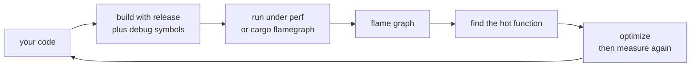

# Chapter 24 — Tooling

> **What you'll learn.** The tools that ship around the Rust compiler: the
> formatter, the linter, the editor language server, the documentation generator,
> the debuggers, and the analysis tools that find undefined behavior in `unsafe`
> code. Each one maps to a C tool you already know.

## One ecosystem, not a pile of separate tools

In C, you assemble your own toolbox. You pick a formatter (`clang-format`), a
linter (`clang-tidy`, `cppcheck`), a debugger (`gdb`, `lldb`), a memory checker
(Valgrind), and a profiler (`gprof`, `perf`). Each tool comes from a different
project, has its own config file, and may or may not agree with the others.

Rust ships a single, coordinated set of tools. Most are installed by `rustup`
(Chapter 2 — Installing Rust and the Cargo Toolchain) and run as `cargo`
subcommands. They share one style, one project model, and one source of truth.
This chapter is the deeper tour: Chapter 2 introduced the commands; here we focus
on the tools themselves and what they do for you.

Here is the map from your C toolbox to Rust's:

| Job | C tool | Rust tool | Run with |
|---|---|---|---|
| Format code | `clang-format` | rustfmt | `cargo fmt` |
| Lint / static analysis | `clang-tidy`, `cppcheck` | clippy | `cargo clippy` |
| Editor intelligence | `clangd` | rust-analyzer | (your editor) |
| API documentation | Doxygen | rustdoc | `cargo doc` |
| Debugger | `gdb`, `lldb` | rust-gdb, rust-lldb | `rust-gdb ./bin` |
| Detect undefined behavior | Valgrind (memcheck) | Miri | `cargo +nightly miri run` |
| Profiler | `gprof`, `perf` | perf, cargo-flamegraph | `cargo flamegraph` |
| Benchmark | hand-rolled timers | criterion | `cargo bench` |
| Audit dependencies | (manual) | cargo-audit, cargo-deny | `cargo audit` |

> **Mental model.** In C you choose and wire up tools yourself. In Rust the tools
> come pre-wired and agree with each other. Less choice, less friction.

## rustfmt: one canonical style

`rustfmt` is the official code formatter. You run it with `cargo fmt`. It rewrites
your source to the single, community-wide Rust style: 4-space indentation, braces
on the same line, a 100-column width, and consistent spacing everywhere.

```sh
cargo fmt              # reformat the whole project in place
cargo fmt --check      # report unformatted files but change nothing (use in CI)
```

The key difference from C: there is **one** style, defined by the Rust project,
and almost everyone uses it unchanged. There is no argument about brace placement
or tabs versus spaces, because the answer is "whatever `rustfmt` does."

> **C vs Rust.** `clang-format` has dozens of presets (LLVM, Google, GNU, your
> team's custom `.clang-format`). Every C team picks a different one. rustfmt has
> defaults that nearly everyone accepts, so Rust code looks the same across the
> whole ecosystem.

You *can* tune rustfmt with a `rustfmt.toml` file in the project root, but most
projects do not, and the set of stable options is intentionally small:

```toml
# rustfmt.toml (optional; most projects leave this out entirely)
max_width = 100        # the default; lines wrap at 100 columns
edition = "2024"       # match your crate's edition
```

> **Rule of thumb.** Do not fight rustfmt. Run `cargo fmt` before every commit and
> add `cargo fmt --check` to CI. Diffs stay small because formatting never changes
> by accident.

## clippy: the linter you should always run

`clippy` is Rust's linter. It runs the real compiler front end and then applies
**over 700 extra checks** for likely bugs, slow patterns, and code that is correct
but not idiomatic. It is far more helpful than a typical C linter, and beginners
should treat its output as free tutoring.

```sh
cargo clippy                    # lint the project
cargo clippy --fix              # apply the auto-fixable suggestions
cargo clippy -- -D warnings     # turn every warning into an error (CI)
```

Clippy groups its lints into **categories**, so you can decide how strict to be:

| Category | What it catches | Default |
|---|---|---|
| `correctness` | Code that is almost certainly a bug | deny (hard error) |
| `suspicious` | Probably wrong; worth a second look | warn |
| `style` | Works, but not idiomatic Rust | warn |
| `complexity` | Needlessly complicated code | warn |
| `perf` | A faster way exists | warn |
| `pedantic` | Strict, opinionated lints | allow (opt in) |
| `nursery` | New, still-being-tuned lints | allow (opt in) |

### Real clippy examples

Clippy does not just say "this is wrong." It names the lint, explains why, and
usually shows the fix. Here are two common ones.

First, a needless comparison to `true`:

```rust
fn main() {
    let ready = true;
    if ready == true {   // clippy: `if ready` is clearer
        println!("go");
    }
}
```

Clippy reports the `needless_bool` / `bool_comparison` lint and suggests
`if ready`. The code compiles either way; clippy makes it idiomatic.

Second, a manual loop that should be an iterator:

```rust
fn main() {
    let v = vec![1, 2, 3, 4];
    let mut sum = 0;
    for i in 0..v.len() {   // clippy: `needless_range_loop`
        sum += v[i];
    }
    println!("{sum}");
}
```

Clippy flags `needless_range_loop` and suggests iterating directly:
`for &x in &v { sum += x; }`. The iterator version also skips the bounds check on
every index, so it can be faster.

### Allowing and denying lints

You silence a specific lint where you really mean to, with an attribute. This is
like a `// NOLINT` comment in `clang-tidy`, but type-checked and scoped.

```rust
#[allow(clippy::needless_range_loop)]
fn manual_copy(src: &[u8], dst: &mut [u8]) {
    for i in 0..src.len() {
        dst[i] = src[i];
    }
}
```

You can also turn the dial the other way and *deny* whole categories at the top of
a crate, which is common in serious projects:

```rust
// at the top of src/lib.rs or src/main.rs
#![deny(clippy::all)]              // make all default clippy lints hard errors
#![warn(clippy::pedantic)]         // opt in to the strict set, as warnings
```

> **Rule of thumb.** Run `cargo clippy` as often as `cargo check`. In CI, run
> `cargo clippy -- -D warnings` so a warning fails the build. Clippy is the single
> highest-value tool for a C programmer learning idiomatic Rust.

## rust-analyzer: the editor language server

`rust-analyzer` is the **language server**: a background program your editor talks
to over the Language Server Protocol (LSP). It is the Rust counterpart of
`clangd`. It gives your editor:

- **Inlay type hints** — the inferred type shown next to a `let` with no
  annotation, so you can see what the compiler inferred.
- **Completion** — method and field suggestions that respect traits in scope.
- **Go to definition / find references** — jump around the crate and its
  dependencies.
- **Quick fixes** — one-key actions like "import this", "fill match arms", or
  "add the missing trait method".
- **Inline errors** — the same diagnostics `cargo check` produces, shown as you
  type.

Install it as a `rustup` component (and the matching extension in your editor):

```sh
rustup component add rust-analyzer
rustup component add rust-src        # lets it read the std library source
```

> **C vs Rust.** `clangd` needs a `compile_commands.json` to know your flags and
> include paths. rust-analyzer reads `Cargo.toml` directly, so there is nothing to
> generate — it understands the project the moment you open it.

## cargo doc: documentation from comments

`rustdoc` turns your code and its comments into browsable HTML, the way Doxygen
does for C. You run it through Cargo:

```sh
cargo doc --open       # build docs for your crate and its deps, open a browser
cargo doc --no-deps    # only your crate's docs
```

Rust has two kinds of documentation comment, both written in Markdown:

- `///` documents the **item that follows** it (a function, struct, or module).
- `//!` documents the **enclosing item** — usually placed at the top of a file to
  document the whole module or crate.

```rust
//! A tiny math helper module.
//! This text becomes the module's front page.

/// Returns the greatest common divisor of `a` and `b`.
///
/// # Examples
/// ```
/// let g = mymath::gcd(12, 18);
/// assert_eq!(g, 6);
/// ```
pub fn gcd(mut a: u64, mut b: u64) -> u64 {
    while b != 0 {
        (a, b) = (b, a % b);
    }
    a
}
```

The fenced code block inside the doc comment is not just for show. `cargo test`
compiles and runs it as a **doc-test** (see Chapter 23 — Testing). That means your
examples cannot rot: if the API changes and the example stops compiling, the test
suite fails. C has no built-in equivalent; a Doxygen example is just text.

> **C vs Rust.** A Doxygen `@code` block is never checked. A Rust doc example is a
> real test. Documentation and tests are the same artifact.

## Debugging

### rust-gdb and rust-lldb

Rust compiles to native code with standard debug info (DWARF), so `gdb` and `lldb`
work directly. But `rustup` also installs thin wrappers — `rust-gdb` and
`rust-lldb` — that load Rust-aware "pretty printers". These show a `Vec`,
`String`, or `Option` in a readable form instead of raw struct fields.

```sh
cargo build                 # build with debug info (the default for `build`)
rust-gdb ./target/debug/myprog
rust-lldb ./target/debug/myprog
```

Many people debug from inside an editor instead. In VS Code, the **CodeLLDB**
extension gives you breakpoints, watches, and stepping with the same Rust pretty
printers. Set a breakpoint, hit run, and inspect variables as usual.

> **C vs Rust.** The debugger is the same family of tool you already use; the only
> new thing is the `rust-` wrapper that teaches it how Rust's standard types are
> laid out.

### The `dbg!` macro

For quick "printf debugging", Rust has the `dbg!` macro. It prints the file, line,
the expression text, and its value to standard error, then **returns the value**,
so you can wrap it around an expression without restructuring code.

```rust
fn main() {
    let x = 5;
    let y = dbg!(x * 2) + 1;   // prints: [src/main.rs:3:13] x * 2 = 10
    println!("y = {y}");
}
```

Because `dbg!` returns its argument, `let y = dbg!(x * 2) + 1;` still computes
`y == 11`. Remove the `dbg!` calls before committing; clippy can be configured to
flag them.

### RUST_BACKTRACE for panics

When Rust hits an unrecoverable error it **panics** (Chapter 13 — Error Handling).
By default a panic prints one line. Set the `RUST_BACKTRACE` environment variable
to get a full stack trace, like a crash dump in C:

```sh
RUST_BACKTRACE=1 cargo run     # show a backtrace on panic
RUST_BACKTRACE=full cargo run  # include std/runtime frames too
```

```
thread 'main' panicked at src/main.rs:4:30:
index out of bounds: the len is 3 but the index is 9
note: run with `RUST_BACKTRACE=1` environment variable to display a backtrace
```

> **Watch out.** Without `RUST_BACKTRACE=1` you only get the panic message and
> location, not the call chain. Set it the moment a panic puzzles you.

## Miri: finding undefined behavior in unsafe code

This tool matters most to a C programmer. **Miri** is an interpreter for Rust's
mid-level IR. It runs your program (and tests) while watching for **undefined
behavior** (UB): out-of-bounds pointer access, use-after-free, reading
uninitialized memory, data races, misaligned accesses, and violations of Rust's
pointer-aliasing rules. It is the spiritual cousin of Valgrind's memcheck, but it
understands Rust's *rules*, not just raw memory.

Miri only matters when you write `unsafe` (Chapter 25 — Unsafe Rust and FFI). Safe
Rust cannot have UB, so Miri has nothing to catch there. It runs on nightly:

```sh
rustup +nightly component add miri
cargo +nightly miri test       # run the test suite under Miri
cargo +nightly miri run        # run the program under Miri
```

```rust
fn main() {
    let v = vec![1, 2, 3];
    let p = v.as_ptr();
    unsafe {
        // Reading p.add(3) is one past the end: out of bounds.
        // Normal runs may "work"; Miri reports this as undefined behavior.
        let _bad = *p.add(3);   // Miri error: out-of-bounds pointer use
    }
}
```

A normal `cargo run` of code like this might appear to work and print garbage,
exactly like the matching C bug. Miri catches it deterministically.

> **C vs Rust.** Valgrind checks what the hardware did. Miri checks what the Rust
> abstract machine *allows*. Miri is slower (it is an interpreter) and cannot run
> code that calls into C, but for pure-Rust `unsafe` it is the gold standard.

## More analysis and inspection tools

These are extra `cargo` subcommands you install once with `cargo install`. They
are not in the default toolchain but are widely used.

### cargo expand: see macro output

Macros (Chapter 26 — Macros) and `derive` generate code you never see. `cargo
expand` prints the source *after* macro expansion, so you can read what `#[derive(
Debug)]` or `println!` actually produced.

```sh
cargo install cargo-expand
cargo expand              # print the whole crate with macros expanded
```

This is the rough equivalent of running the C preprocessor with `gcc -E`, but for
Rust's much more powerful macros.

### cargo bench: benchmarks

`cargo bench` runs functions marked as benchmarks. The built-in harness needs
nightly, so most projects use the **criterion** crate on stable, which gives
statistical timing and protects against the compiler optimizing your test away.

```sh
cargo add --dev criterion
cargo bench
```

### cargo tree: the dependency graph

`cargo tree` prints your dependencies as a tree, which helps you understand why
some transitive crate is in your build.

```sh
cargo tree               # show the dependency tree
cargo tree -i log        # invert: show what pulls in the `log` crate
cargo tree -d            # show duplicate versions of the same crate
```

### cargo audit and cargo-deny: supply-chain checks

`cargo audit` checks your `Cargo.lock` against the RustSec advisory database and
reports dependencies with known security vulnerabilities. `cargo-deny` goes
further: it can also block disallowed licenses, banned crates, and duplicate
versions, all from one config file. There is no standard C equivalent — you would
track CVEs by hand.

```sh
cargo install cargo-audit cargo-deny
cargo audit              # report vulnerable dependencies
cargo deny check         # check advisories, licenses, and bans
```

> **Rule of thumb.** Run `cargo audit` in CI for any project with dependencies. A
> vulnerable transitive crate is easy to miss otherwise.

## Profiling

When you need speed, measure first. Rust profiling reuses the platform's native
profilers, because Rust binaries are ordinary native code with symbols.

- **`perf`** (Linux) — sample where time is spent, exactly as you would for a C
  binary. Build with `--release` and keep debug symbols for readable names.
- **`cargo flamegraph`** — a `cargo install` tool that drives `perf` (or `dtrace`
  on macOS) and renders a flame graph SVG in one step.
- **criterion** — for micro-benchmarks of a single function, with statistics.

```sh
cargo install flamegraph
cargo flamegraph --release      # produces flamegraph.svg
```



> **Watch out.** Always profile and benchmark a `--release` build. A debug build
> is unoptimized and adds overflow checks, so its timings are meaningless for
> performance work. This is the same trap as profiling a C binary built with
> `-O0`.

### Sanitizers (nightly)

Rust can also use the LLVM **sanitizers** you may know from `clang`:
AddressSanitizer (ASan), ThreadSanitizer (TSan), and others. They are nightly-only
and turned on with a compiler flag. They are most useful for `unsafe` code and FFI
boundaries, where Miri cannot reach (for example, when C code is involved).

```sh
RUSTFLAGS="-Zsanitizer=address" cargo +nightly run --target x86_64-unknown-linux-gnu
```

> **Rule of thumb.** Use **Miri** for pure-Rust `unsafe`, and **sanitizers** when
> the bug may cross into C through FFI. Together they cover what Valgrind does for
> C.

## Key takeaways

- Rust's tools ship together and agree with each other. Most run as `cargo`
  subcommands and map cleanly onto C tools you know.
- **rustfmt** (`cargo fmt`) enforces one canonical style; tune it with an optional
  `rustfmt.toml`, but most projects do not.
- **clippy** (`cargo clippy`) is a 700+ lint checker grouped into categories.
  Silence a lint with `#[allow(...)]`; in CI run `cargo clippy -- -D warnings`.
- **rust-analyzer** is the editor language server: inlay type hints, completion,
  go-to-definition, and quick fixes, with no `compile_commands.json` to generate.
- **rustdoc** (`cargo doc`) builds HTML from `///` and `//!` comments, and the
  examples are run as doc-tests.
- Debug with **rust-gdb**/**rust-lldb** or VS Code + CodeLLDB, the `dbg!` macro,
  and `RUST_BACKTRACE=1` for panic backtraces.
- **Miri** detects undefined behavior in `unsafe` Rust; **perf**/**cargo
  flamegraph**/**criterion** profile and benchmark; **cargo audit**/**cargo-deny**
  guard dependencies.

## Watch out (gotchas for C programmers)

- **Clippy is gold — run it.** It teaches idiomatic Rust faster than anything else.
  Make it part of your edit loop and your CI.
- **`RUST_BACKTRACE=1` for panics.** Without it you only see the message and
  location, never the call chain.
- **Miri finds `unsafe` UB.** Safe Rust has none to find. If you write `unsafe`,
  run `cargo +nightly miri test`. Miri cannot cross into C — use sanitizers there.
- **Debug vs release performance.** Profile and benchmark only `--release` builds;
  debug builds are unoptimized and add overflow checks.
- **rustfmt is non-negotiable on teams.** Run `cargo fmt` before committing and
  `cargo fmt --check` in CI, so formatting never shows up in diffs or reviews.
- **`dbg!` returns its argument.** Handy, but remove the calls before committing.

## Interview questions

**Q: What is the difference between `cargo check`, `cargo clippy`, and `cargo
fmt`?**
A: `cargo check` runs the compiler front end (parse, type-check, borrow-check) to
report errors without building a binary. `cargo clippy` runs that same front end
plus 700+ extra lints for likely bugs and un-idiomatic code. `cargo fmt` does not
analyze meaning at all; it only reformats source to the canonical style.

**Q: When would you use Miri, and why can it find bugs that a normal run cannot?**
A: Use Miri when you write `unsafe` code. It interprets the program against Rust's
abstract machine and flags undefined behavior — out-of-bounds pointers,
use-after-free, uninitialized reads, aliasing violations — that a normal run might
silently "get away with". Safe Rust has no UB, so Miri is unnecessary there.

**Q: How do `///` and `//!` doc comments differ, and what makes Rust docs special?**
A: `///` documents the item that follows it; `//!` documents the enclosing item,
typically a module or crate at the top of a file. Both are Markdown. The special
part is that fenced code examples in doc comments are compiled and run as tests by
`cargo test`, so documentation cannot silently fall out of date.

**Q: A C colleague asks how Rust replaces Valgrind, gprof, and clang-tidy. What do
you say?**
A: clang-tidy maps to clippy (`cargo clippy`). gprof maps to native profilers like
perf and cargo flamegraph. Valgrind splits in two: Miri detects undefined behavior
in pure-Rust `unsafe` code, and the LLVM sanitizers (nightly) cover cases that
cross into C through FFI.

**Q: Why does Rust not have the brace-style and tabs-versus-spaces arguments that C
teams have?**
A: Because rustfmt defines one canonical style that nearly the whole ecosystem
adopts unchanged. Teams run `cargo fmt` automatically, so formatting is mechanical
and never debated in review, unlike `clang-format` where each project picks a
different preset.

## Try it

1. In any project, run `cargo clippy` and read every suggestion. Apply the
   auto-fixable ones with `cargo clippy --fix`.
2. Write a function with a `for i in 0..v.len()` loop over a slice and watch
   clippy suggest the iterator form. Then add `#[allow(clippy::needless_range_loop)]`
   and confirm the warning disappears.
3. Add a `/// # Examples` doc-test to a function, then run `cargo test` and find
   the doc-test in the output. Break the example on purpose and watch the test
   fail.
