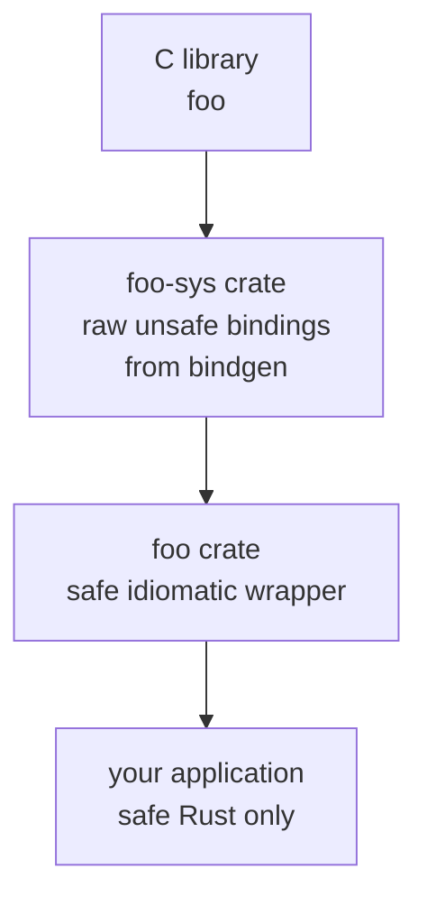

# Chapter 25 — Unsafe Rust and FFI

> **What you'll learn.** What the `unsafe` keyword really turns on (and what it does
> not), how raw pointers work, and how Rust and C call each other across the
> foreign function interface. This is the chapter where Rust looks most like the C
> you already write.

## Why this chapter matters to a C programmer

Everything you have learned so far is **safe Rust**: the compiler proves there are
no dangling pointers, no data races, no buffer overruns. But sometimes you must
step outside those proofs — to talk to the operating system, to call a C library,
to build a data structure the borrow checker cannot understand, or to squeeze out
the last bit of performance.

`unsafe` is how you do that. It does not make Rust into a different language. It
hands you a small set of extra powers and says: "the compiler can no longer prove
this is correct, so *you* must guarantee it, the way you always have in C."

> **Mental model.** Safe Rust is driving with every safety system on. `unsafe` is
> the override switch for five specific maneuvers. The car still has brakes and a
> steering wheel — you are just responsible for these five things by hand.

## What `unsafe` actually allows: the five superpowers

This is the single most misunderstood part of Rust. `unsafe` unlocks exactly
**five** abilities, and nothing else:

1. **Dereference a raw pointer** (`*const T` or `*mut T`).
2. **Call an `unsafe` function** (including any function from C through FFI).
3. **Access or modify a mutable `static`** variable (a global).
4. **Implement an `unsafe` trait** (such as `Send` or `Sync`).
5. **Access the fields of a `union`.**

That is the whole list. Critically:

> **Watch out.** `unsafe` does **not** turn off the borrow checker. References are
> still checked, moves still apply, lifetimes still hold, and ownership still frees
> your memory. `unsafe` only permits the five actions above. Everything else is
> exactly as strict as before.

So `unsafe` is much narrower than "C mode". It is a promise you make to the
compiler: "I have checked, by hand, that the invariants these five powers require
are upheld." If you are wrong, you get **undefined behavior** (UB) — the same
class of bug you fight in C.

```rust
fn main() {
    let mut x = 10;
    let r: *mut i32 = &mut x;   // creating a raw pointer is SAFE
    unsafe {
        *r += 1;                // dereferencing it needs `unsafe`
    }
    println!("{x}");            // prints 11
}
```

Notice the split: making the raw pointer is safe, because nothing bad happens
until you *use* it. The dereference is the dangerous step, so that is what needs an
`unsafe` block.

> **Rule of thumb.** Keep `unsafe` blocks as small as possible — wrap only the one
> operation that needs the power, not the whole function. A small block is a small
> thing to audit.

## Raw pointers: C pointers, back again

A **raw pointer** is Rust's version of a plain C pointer. There are two kinds:

- `*const T` — a pointer to a `T` you intend to only read (like `const T *`).
- `*mut T` — a pointer to a `T` you may write (like `T *`).

Unlike references (`&T` / `&mut T`), raw pointers carry **no guarantees**. They may
be null, may dangle, may be unaligned, and may alias each other freely. The
compiler tracks nothing about them — exactly like a C pointer.

| Property | C pointer `T *` | Rust reference `&T` | Rust raw pointer `*const T` |
|---|---|---|---|
| Can be null | yes | no | yes |
| Can dangle | yes | no (checked) | yes |
| Bounds known | no | yes (slices) | no |
| Aliasing checked | no | yes | no |
| Needs `unsafe` to deref | no | no | yes |

You create raw pointers in **safe** code, from a reference or from an address:

```rust
fn main() {
    let x = 42;
    let p: *const i32 = &x;          // from a reference: always valid here
    let q = 0x1234 as *const i32;    // from an address: probably invalid!

    unsafe {
        println!("{}", *p);          // 42 — p points at real data
        // println!("{}", *q);       // would be UB: q is a bogus address
    }
    let _ = q;
}
```

### Pointer arithmetic

In C you write `p + 3` to move a pointer forward by three elements. In Rust you use
the `.add` and `.offset` methods, which advance by *elements*, not bytes — the
compiler multiplies by `size_of::<T>()` for you, just as C does:

```rust
fn main() {
    let arr = [10, 20, 30, 40];
    let base: *const i32 = arr.as_ptr();
    unsafe {
        let third = *base.add(2);    // base[2] == 30
        println!("{third}");
    }
}
```

`.add(n)` moves forward by `n` elements; `.offset(n)` takes a signed count and can
move backward. Both are `unsafe` because the compiler cannot check you stayed in
bounds — going past the end is UB, the same as in C.

Here is the picture, the same one you would draw for a C array:

```
arr:  [ 10 | 20 | 30 | 40 ]
        ^         ^
        |         |
       base     base.add(2)  -> *base.add(2) == 30

each cell is size_of::<i32>() == 4 bytes
base.add(n) advances n * 4 bytes
```

> **C vs Rust.** Raw pointers behave like C pointers in every way. The only
> difference is that Rust forces the dangerous operations — dereference and
> arithmetic-then-deref — into an `unsafe` block, so they are easy to find and
> review.

## Calling C from Rust

This is the most common reason to use `unsafe`: calling an existing C library. You
declare the C functions in an `extern` block. In **edition 2024** the block itself
is marked `unsafe`, because the compiler cannot verify a foreign function honors
Rust's rules:

```rust
// edition 2024 form: the extern block is `unsafe`
unsafe extern "C" {
    fn abs(input: i32) -> i32;     // from the C standard library
}

fn main() {
    let n = -7;
    let a = unsafe { abs(n) };     // calling C is an unsafe operation
    println!("abs({n}) = {a}");
}
```

Two layers of `unsafe` appear here, and they mean different things:

- `unsafe extern "C" { ... }` — the **declaration** is unsafe: you are vouching
  that these signatures match the real C functions.
- `unsafe { abs(n) }` — the **call** is unsafe: every foreign function is treated
  as an `unsafe fn`.

`extern "C"` means "use the C **ABI**" — the calling convention and layout rules
that C uses on this platform. It is what lets the two languages agree on how
arguments are passed.

### C types in Rust

Rust integers like `i32` have fixed sizes, but C types like `int` and `long` vary
by platform. To match C exactly, use the C type aliases from `core::ffi` (also
re-exported in `std::os::raw`):

| C type | Rust type (`core::ffi`) |
|---|---|
| `int` | `c_int` |
| `unsigned int` | `c_uint` |
| `long` | `c_long` |
| `char` | `c_char` |
| `void *` | `*mut c_void` |
| `size_t` | `usize` (commonly) |

```rust
use core::ffi::c_int;

unsafe extern "C" {
    fn abs(input: c_int) -> c_int;     // matches C's `int abs(int)`
}

fn main() {
    let a = unsafe { abs(-5) };
    println!("{a}");
}
```

### Strings across the boundary: CStr and CString

This trips up everyone. A Rust `String` is UTF-8 and stores its length; it is
**not** NUL-terminated. A C string is a `char *` that ends at the first `\0`. They
are not interchangeable. Rust gives you two bridge types:

- **`CString`** — an owned, NUL-terminated byte buffer you build to *pass into* C.
- **`CStr`** — a borrowed view of a NUL-terminated string you got *back from* C.

```rust
use core::ffi::{c_char, c_int};
use std::ffi::CString;

unsafe extern "C" {
    fn puts(s: *const c_char) -> c_int;   // C's puts: prints a NUL-terminated string
}

fn main() {
    let msg = CString::new("hello from C's puts").unwrap();
    unsafe {
        puts(msg.as_ptr());     // pass a `*const c_char` into C
    }
    // `msg` owns the buffer and frees it at end of scope; keep it alive
    // for as long as C might read the pointer.
}
```

`CString::new` returns an error if the input contains an interior `\0`, because
that byte would prematurely terminate the C string. It adds the trailing `\0` for
you.

> **Watch out.** Keep the `CString` alive while C holds the pointer. If you write
> `puts(CString::new("hi").unwrap().as_ptr())`, the `CString` is dropped at the end
> of that statement and C reads freed memory — a classic dangling pointer, exactly
> as in C.

### Linking to a library

The `#[link]` attribute names the C library to link against, like `-l` on the C
compiler command line. The C standard library is linked automatically, so the
examples above need nothing extra; a third-party library does:

```rust
#[link(name = "z")]              // link libz (zlib), like cc ... -lz
unsafe extern "C" {
    fn crc32(crc: u32, buf: *const u8, len: u32) -> u32;
}
```

## Calling Rust from C

The reverse direction lets C code call your Rust function. You must do three
things: use the C ABI, keep the symbol name unmangled, and build the right kind of
library.

```rust
#[unsafe(no_mangle)]
pub extern "C" fn add_one(x: i32) -> i32 {
    x + 1
}
```

- `extern "C"` — export with the C calling convention.
- `#[unsafe(no_mangle)]` — keep the symbol name exactly `add_one` so the C linker
  can find it. Rust normally **mangles** names (encodes them for uniqueness). In
  edition 2024 this attribute is wrapped in `unsafe(...)`, because a clashing
  unmangled name can cause incorrect linking — another invariant you promise to
  uphold.
- `pub` — make it visible outside the crate.

On the C side, you write the matching declaration by hand (or generate it; see
below) and call it like any C function:

```c
/* main.c */
#include <stdio.h>

extern int add_one(int x);   /* the Rust function */

int main(void) {
    printf("%d\n", add_one(41));   /* prints 42 */
    return 0;
}
```

To produce something C can link, set the crate type in `Cargo.toml`:

```toml
[lib]
crate-type = ["staticlib"]   # a .a archive to link statically
# or:
# crate-type = ["cdylib"]    # a .so / .dll / .dylib shared library
```

- **`staticlib`** builds a `.a` you link into a C program statically.
- **`cdylib`** builds a shared library (`.so`, `.dll`, or `.dylib`) you load at
  runtime.

### cbindgen: generate the C header

Writing the C declarations by hand is error-prone. The **cbindgen** tool reads your
Rust source and generates a matching C/C++ header file, so the two sides cannot
drift apart.

```sh
cargo install cbindgen
cbindgen --output mylib.h        # generate a header from your Rust exports
```

## bindgen and the `*-sys` convention

Going the other way — wrapping a big C library — you do not want to hand-type
hundreds of `extern` declarations. **bindgen** reads a C header and generates the
Rust `extern` blocks, struct definitions, and constants automatically.

```sh
cargo install bindgen-cli
bindgen /usr/include/somelib.h -o src/bindings.rs
```

The Rust ecosystem has a strong convention here. A crate named `foo-sys` contains
**only** the raw, generated, `unsafe` bindings to the C library `foo`. A separate
crate named `foo` then builds a **safe**, idiomatic wrapper on top. This split —
raw bindings below, safe API above — is the standard pattern.



## Wrapping `unsafe` in a safe abstraction

This is the most important idea in the whole chapter. The goal is not to avoid
`unsafe` — it is to **contain** it. You write a small `unsafe` core, check its
invariants carefully, and expose a **safe** function that cannot be misused. This
is exactly how the standard library is built: `Vec`, `String`, and `Mutex` are all
safe wrappers around `unsafe` internals.

A safe wrapper means: no matter what arguments a caller passes, they can never
trigger UB. Here is the shape of the pattern, splitting one slice into two halves
without copying:

```rust
fn split_at_mut(slice: &mut [i32], mid: usize) -> (&mut [i32], &mut [i32]) {
    let len = slice.len();
    let ptr = slice.as_mut_ptr();
    assert!(mid <= len);   // upholds the invariant the unsafe code relies on

    unsafe {
        // SAFETY: `mid <= len` is checked above, so both ranges stay in bounds,
        // and the two resulting slices cover disjoint regions, so the aliasing
        // rule (no two overlapping &mut) is not violated.
        (
            std::slice::from_raw_parts_mut(ptr, mid),
            std::slice::from_raw_parts_mut(ptr.add(mid), len - mid),
        )
    }
}

fn main() {
    let mut v = [1, 2, 3, 4, 5, 6];
    let (a, b) = split_at_mut(&mut v, 3);
    a[0] = 100;
    b[0] = 200;
    println!("{v:?}");   // [100, 2, 3, 200, 5, 6]
}
```

The function signature is fully safe: callers see only `&mut [i32]`. The `assert!`
turns a would-be UB (an out-of-bounds `mid`) into a clean panic. The borrow checker
alone could not prove the two `&mut` slices are non-overlapping, which is why
`unsafe` is needed — but we, the authors, can prove it, and we say so.

### Write `// SAFETY:` comments

Every `unsafe` block should carry a comment, conventionally starting with
`// SAFETY:`, that states *why* the invariants hold. This is the audit trail. When
someone reviews or changes the code, the comment tells them exactly what must stay
true. Treat a missing `// SAFETY:` comment the way you would treat a `free()` with
no clear owner — a smell.

### `#[repr(C)]` for layout compatibility

By default Rust may reorder struct fields for efficiency. C does not. So any struct
you pass across the FFI boundary must be annotated `#[repr(C)]`, which forces C's
field order and padding rules (see Chapter 11 — Structs and Methods):

```rust
#[repr(C)]
pub struct Point {
    pub x: i32,
    pub y: i32,
}

unsafe extern "C" {
    fn translate(p: Point, dx: i32, dy: i32) -> Point;
}
```

Without `#[repr(C)]`, Rust's field layout is unspecified, and C would read the
wrong bytes. This is the same care you take in C when matching a struct to a binary
format.

## The big picture: Rust and C coexisting

FFI is a two-way door. The boundary is where safe Rust meets unchecked C.

```
        SAFE RUST                 |  the FFI boundary  |          C
   ----------------------         |    extern  C       |   --------------
   &T  &mut T  Vec  String        | <----------------> |  int  char *  struct
   checked, no UB possible        |   unsafe required  |  you uphold invariants
                                  |   repr C  c_int    |
                                  |   CString  CStr    |
```

Because of this door, you do not have to rewrite a C program all at once. You can
replace one module at a time: build a Rust `staticlib`, link it into the existing C
binary, and move functionality across function by function. Many real migrations
(including parts of Firefox and the Linux kernel) work exactly this way.

> **C vs Rust.** Inside `unsafe` and across FFI, you are essentially writing C-level
> code again — same pointers, same responsibility, same UB if you get it wrong. The
> win is that this dangerous code is small, clearly marked, and wrapped in a safe
> API, instead of being your *entire* program.

## Key takeaways

- `unsafe` unlocks exactly five powers: dereference a raw pointer, call an `unsafe`
  function, access a mutable `static`, implement an `unsafe` trait, and read a
  `union` field. Nothing else.
- `unsafe` does **not** disable the borrow checker. You still get ownership,
  borrowing, and lifetime checks; you only gain those five actions and the duty to
  uphold their invariants by hand.
- Raw pointers `*const T`/`*mut T` are C pointers: no null check, no bounds, no
  aliasing rules. Creating them is safe; dereferencing and `.add`/`.offset` need
  `unsafe`.
- Call C with `unsafe extern "C" { ... }` (edition 2024), use `core::ffi` types
  like `c_int`, link with `#[link(name = "...")]`, and bridge strings with
  `CString`/`CStr`.
- Expose Rust to C with `#[unsafe(no_mangle)] pub extern "C" fn`, build a
  `staticlib` or `cdylib`, and generate headers with **cbindgen**.
- Use **bindgen** and the `*-sys`/safe-wrapper convention to wrap C libraries.
  Always wrap `unsafe` in a safe API, mark FFI structs `#[repr(C)]`, and write
  `// SAFETY:` comments.

## Watch out (gotchas for C programmers)

- **`unsafe` does not disable the borrow checker.** It is not "C mode". It only
  permits five specific operations.
- **Breaking an invariant is UB.** A wrong `unsafe` block is just as dangerous as a
  C memory bug. Run `cargo +nightly miri test` (Chapter 24 — Tooling) to catch it.
- **`CString` NUL handling.** A Rust `String` is not NUL-terminated. Build a
  `CString` to pass into C, and never let it drop while C still holds the pointer.
- **`#[repr(C)]` on FFI structs.** Without it, Rust may reorder fields and C reads
  garbage.
- **Pointer lifetimes cross the boundary blindly.** The compiler cannot track a
  pointer once it enters C. Keep the owning Rust value alive yourself.
- **`#[unsafe(no_mangle)]`** is the edition-2024 spelling. Older code writes plain
  `#[no_mangle]`; on edition 2024 it must be wrapped in `unsafe(...)`.

## Interview questions

**Q: Does `unsafe` turn off the borrow checker?**
A: No. `unsafe` enables exactly five extra operations: dereferencing raw pointers,
calling `unsafe` functions, accessing mutable statics, implementing `unsafe`
traits, and reading `union` fields. The borrow checker, ownership, moves, and
lifetimes all still apply. You take on the duty to uphold the invariants those five
operations require, but every other rule is unchanged.

**Q: What is the difference between a reference and a raw pointer?**
A: A reference (`&T`/`&mut T`) is guaranteed by the compiler to be non-null,
properly aligned, pointing at live data, and to obey the aliasing rule. A raw
pointer (`*const T`/`*mut T`) has none of these guarantees — it is a C pointer.
Creating a raw pointer is safe, but dereferencing one requires an `unsafe` block.

**Q: Why can't you pass a Rust `String` directly to a C function expecting `char
*`?**
A: A Rust `String` is UTF-8 and stores its length; it is not NUL-terminated, and it
may contain interior NUL bytes. C expects a NUL-terminated buffer. You convert with
`CString::new`, which appends the terminating NUL (and errors on interior NULs),
then pass `as_ptr()` while keeping the `CString` alive.

**Q: What does `#[repr(C)]` do, and when do you need it?**
A: It forces a struct (or enum/union) to use C's field order, alignment, and
padding instead of Rust's default, which is unspecified and may reorder fields. You
need it on any type passed across the FFI boundary so that Rust and C agree on the
exact byte layout.

**Q: How do you safely expose `unsafe` code to other programmers?**
A: Wrap it in a safe abstraction: a function with a fully safe signature whose body
contains a small `unsafe` block, guarded by checks (like an `assert!`) so that no
input can trigger undefined behavior. Document each block with a `// SAFETY:`
comment explaining why the invariants hold. This is how `Vec`, `String`, and the
rest of the standard library are built.

## Try it

1. Declare `unsafe extern "C" { fn sqrt(x: f64) -> f64; }`, call it inside an
   `unsafe` block from `main`, and print the result. (The C math library is linked
   automatically.)
2. Build the `split_at_mut` example, then change the `assert!` to allow `mid >
   len` and run it under `cargo +nightly miri run`. Watch Miri report the
   out-of-bounds access.
3. Write `#[unsafe(no_mangle)] pub extern "C" fn triple(x: i32) -> i32 { x * 3 }`,
   set `crate-type = ["staticlib"]`, build it, and call it from a small C program.
