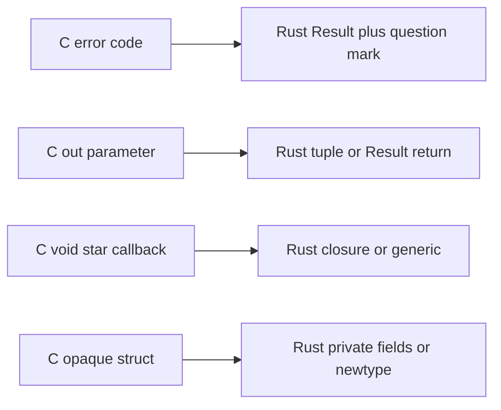

# Chapter 27 — Idioms and Style

> **What you'll learn.** How experienced Rust programmers actually write code:
> making bad states impossible with types, the newtype and builder patterns,
> the conversion traits, error style, naming conventions, and how each C habit
> maps to a cleaner Rust idiom.

Rust gives you tools C does not have. Using them well is the difference between
"C with semicolons moved around" and real, idiomatic Rust. This chapter
collects the patterns that matter most, all built on chapters you have already
read.

## Make illegal states unrepresentable

This is the most important idea in the chapter. In C you often encode state with
**sentinels** (magic values) and **flags** (booleans), and you rely on the
programmer to keep them consistent. The type system does not stop a bad
combination.

```c
/* C: a value, plus a flag saying whether the value is valid */
struct Reading {
    int  value;
    bool has_value;   /* if false, `value` is garbage */
};
```

Nothing stops code from reading `value` when `has_value` is false. In Rust you
use a **type** that cannot be in a bad state. `Option<T>` is exactly this: it is
either `Some(value)` or `None`, and you cannot read the value without handling
the `None` case (Chapter 12 — Enums and Pattern Matching).

```rust
struct Reading {
    value: Option<i32>,   // no separate flag; "no value" is built in
}

fn main() {
    let r = Reading { value: None };
    match r.value {
        Some(v) => println!("got {v}"),
        None => println!("no reading"),
    }
}
```

The same idea replaces a pile of booleans with an **enum**. Consider a
connection that is either disconnected, connecting, or connected with a session
id. With booleans, you can represent nonsense like "disconnected but has a
session." With an enum, you cannot:

```rust
// This compiles fine; the point is that bad states simply cannot be built.
enum Connection {
    Disconnected,
    Connecting,
    Connected { session_id: u64 },
}

fn describe(c: &Connection) -> String {
    match c {
        Connection::Disconnected => "offline".to_string(),
        Connection::Connecting => "dialing".to_string(),
        Connection::Connected { session_id } => format!("online #{session_id}"),
    }
}

fn main() {
    println!("{}", describe(&Connection::Connected { session_id: 42 }));
}
```

> **Rule of thumb.** When you reach for a `bool` field or a "magic" sentinel
> value, ask: can an enum or `Option` make the bad combination impossible? If
> so, use it. The compiler then checks your logic for free.

> **C vs Rust.** In C the invariant ("if `has_value` is false, do not read
> `value`") lives in comments and discipline. In Rust the invariant lives in the
> type, and `match` forces you to handle every case. The bug class disappears.

## The newtype pattern

A **newtype** is a tuple struct with one field that wraps an existing type:
`struct Meters(f64)`. It costs nothing at runtime (it compiles away) but gives
you a distinct type the compiler can tell apart.

It solves two problems.

**1. Type safety.** In C, a `double` is a `double`; nothing stops you from
adding meters to seconds. Newtypes make the units distinct:

```rust
struct Meters(f64);
struct Seconds(f64);

fn stopping_distance(speed_mps: f64, t: Seconds) -> Meters {
    Meters(speed_mps * t.0)        // `.0` reaches the inner field
}

fn main() {
    let d = stopping_distance(30.0, Seconds(2.0));
    println!("{} m", d.0);
}
```

Now passing a `Meters` where a `Seconds` is expected is a compile error, not a
silent bug.

**2. Implementing external traits (the orphan rule).** Rust's **orphan rule**
says you may implement a trait for a type only if you own the trait or the type.
You cannot `impl Display for Vec<T>`, because you own neither. A newtype gives
you a type you *do* own, so you can wrap and implement:

```rust
use std::fmt;

struct CsvRow(Vec<String>);        // a type we own, wrapping a Vec we do not

impl fmt::Display for CsvRow {
    fn fmt(&self, f: &mut fmt::Formatter) -> fmt::Result {
        write!(f, "{}", self.0.join(","))
    }
}

fn main() {
    let row = CsvRow(vec!["a".into(), "b".into(), "c".into()]);
    println!("{row}");             // a,b,c
}
```

> **Mental model.** A newtype is like a C `typedef` that the compiler actually
> enforces. C's `typedef` makes a name; a Rust newtype makes a genuinely
> distinct type.

## Conversions: `From`, `Into`, `TryFrom`, `AsRef`

Rust has standard traits for converting between types. Use them instead of
inventing your own `to_x` functions.

- **`From<T>`** says "I can be built from a `T`." Implement `From`, and you get
  **`Into`** for free — the standard library provides it automatically. So
  implement `From`, and call `.into()` whenever convenient.

```rust
struct Celsius(f64);
struct Fahrenheit(f64);

impl From<Celsius> for Fahrenheit {
    fn from(c: Celsius) -> Self {
        Fahrenheit(c.0 * 9.0 / 5.0 + 32.0)
    }
}

fn main() {
    let f = Fahrenheit::from(Celsius(100.0));
    let f2: Fahrenheit = Celsius(0.0).into();   // free, from the From impl
    println!("{} {}", f.0, f2.0);
}
```

- **`TryFrom<T>`** / **`TryInto<T>`** are the fallible versions: the conversion
  can fail, so they return `Result`. Use them when not every input is valid:

```rust
use std::convert::TryFrom;

struct Percent(u8);            // must be 0..=100

impl TryFrom<i32> for Percent {
    type Error = String;
    fn try_from(n: i32) -> Result<Self, Self::Error> {
        if (0..=100).contains(&n) {
            Ok(Percent(n as u8))
        } else {
            Err(format!("{n} is out of range"))
        }
    }
}

fn main() {
    println!("{:?}", Percent::try_from(50).map(|p| p.0));   // Ok(50)
    println!("{:?}", Percent::try_from(200).map(|p| p.0));  // Err(...)
}
```

- **`AsRef<T>`** means "I can be viewed as a `&T` cheaply." It is how you write a
  function that accepts "anything string-like" without forcing the caller to
  convert first:

```rust
use std::path::Path;

fn open_log(path: impl AsRef<Path>) {
    let p: &Path = path.as_ref();
    println!("opening {}", p.display());
}

fn main() {
    open_log("app.log");                 // &str works
    open_log(String::from("err.log"));   // String works too
}
```

> **C vs Rust.** C conversions are casts (`(int)x`) or hand-written functions
> with names you must remember. Rust standardizes them: `From`/`Into` for
> conversions that always succeed, `TryFrom`/`TryInto` for ones that can fail,
> and the `?` operator even uses `From` to convert error types automatically
> (Chapter 13 — Error Handling).

## `Default`, struct-update syntax, and the builder pattern

Rust has **no default function arguments**. C does not either, but C programmers
often fake them with many functions or with a flags struct. Rust has cleaner
tools.

**`Default`** gives a type a "zero value." Derive it, then build a value and
override just the fields you care about with **struct-update syntax** (`..`):

```rust
#[derive(Debug, Default)]
struct ServerConfig {
    host: String,        // defaults to ""
    port: u16,           // defaults to 0
    tls: bool,           // defaults to false
}

fn main() {
    let cfg = ServerConfig {
        host: "localhost".into(),
        port: 8080,
        ..Default::default()    // fill the rest with defaults
    };
    println!("{cfg:?}");
}
```

When there are many optional settings, use the **builder pattern**: a separate
type whose methods set one field each and return `self`, ending in a `build()`
call. This reads well and avoids a constructor with ten arguments.

```rust
#[derive(Debug)]
struct Server {
    host: String,
    port: u16,
    threads: u32,
}

struct ServerBuilder {
    host: String,
    port: u16,
    threads: u32,
}

impl ServerBuilder {
    fn new(host: &str) -> Self {
        ServerBuilder { host: host.into(), port: 80, threads: 1 }
    }
    fn port(mut self, p: u16) -> Self {
        self.port = p;
        self
    }
    fn threads(mut self, n: u32) -> Self {
        self.threads = n;
        self
    }
    fn build(self) -> Server {
        Server { host: self.host, port: self.port, threads: self.threads }
    }
}

fn main() {
    let s = ServerBuilder::new("example.com")
        .port(443)
        .threads(8)
        .build();
    println!("{s:?}");
}
```

> **Rule of thumb.** A few arguments: a plain `new`. Many optional arguments, or
> arguments that need validation: a builder. The chained calls make each option
> self-documenting at the call site.

## Function signatures: borrow on the way in, own on the way out

Idiomatic signatures **borrow** their inputs and **return owned** values. This
gives the caller the most freedom and avoids needless copies.

- Take `&str`, not `String`, when you only read text. A `&str` accepts both a
  string literal and a borrowed `String`.
- Take `&[T]`, not `&Vec<T>`, when you only read a sequence. A `&[T]` (a slice)
  accepts arrays, vectors, and sub-ranges.

```rust
// Good: accepts &str and &String; accepts &[T] from arrays and Vecs.
fn first_word(s: &str) -> &str {
    s.split_whitespace().next().unwrap_or("")
}

fn sum(values: &[i32]) -> i32 {
    values.iter().sum()
}

fn main() {
    let owned = String::from("hello world");
    println!("{}", first_word(&owned));        // pass a &String as &str
    println!("{}", first_word("from a literal"));

    let v = vec![1, 2, 3];
    println!("{}", sum(&v));                    // pass a &Vec as &[i32]
    println!("{}", sum(&[10, 20]));             // and an array slice
}
```

> **C vs Rust.** In C you pass `const char *` and a length, and a `T *` plus a
> count. `&str` and `&[T]` bundle the pointer and length into one safe,
> bounds-checked value (Chapter 10 — Slices and Strings). The idiom is the same
> as C's "pass a borrowed view," but checked.

## Prefer iterators, combinators, and `?`

Three small habits make Rust code cleaner and often faster:

- **Iterators over index loops.** They are bounds-safe and express intent.
- **Combinators (`map`, `filter`, `sum`, ...) over manual loops** *where it is
  clearer*. Do not force a one-liner that hurts readability.
- **`?` over `.unwrap()`** for propagating errors (Chapter 13).

```rust
fn even_squares(nums: &[i32]) -> Vec<i32> {
    nums.iter()
        .filter(|&&n| n % 2 == 0)
        .map(|&n| n * n)
        .collect()
}

fn main() {
    println!("{:?}", even_squares(&[1, 2, 3, 4, 5, 6]));   // [4, 16, 36]
}
```

## Error style: `thiserror` for libraries, `anyhow` for applications

Two community crates are the standard choice (Chapter 13 — Error Handling):

- **`thiserror`** for **libraries**. It derives a clean, typed error enum so
  callers can `match` on the specific error.
- **`anyhow`** for **applications**. Its `anyhow::Error` holds any error and
  adds context; perfect for a `main` that just needs to report and exit.

```rust
// library style: a specific, matchable error type
// needs: cargo add thiserror
use thiserror::Error;

#[derive(Error, Debug)]
enum ParseError {
    #[error("empty input")]
    Empty,
    #[error("not a number: {0}")]
    NotANumber(String),
}

fn parse_count(s: &str) -> Result<u32, ParseError> {
    if s.is_empty() {
        return Err(ParseError::Empty);
    }
    s.parse().map_err(|_| ParseError::NotANumber(s.to_string()))
}

fn main() {
    println!("{:?}", parse_count("42"));
    println!("{:?}", parse_count("oops"));
}
```

> **Rule of thumb.** **Never `.unwrap()` in library code.** A library should
> return its error to the caller, who decides what to do. In a small example,
> in tests, or in an application's top level, `.unwrap()`/`.expect()` is fine.

## Naming conventions

Rust has firm, tool-enforced naming rules. `clippy` and `rustfmt` nudge you
toward them.

| Item | Convention | Example |
|---|---|---|
| Functions, variables, modules | `snake_case` | `read_line`, `byte_count` |
| Types, traits, enum variants | `CamelCase` | `ServerConfig`, `Display`, `NotFound` |
| Constants and statics | `SCREAMING_SNAKE_CASE` | `MAX_RETRIES` |

**Getters have no `get_` prefix.** A getter for a `name` field is just `name()`,
not `get_name()`. The setter, if any, is `set_name()`.

```rust
struct User {
    name: String,
}

impl User {
    fn name(&self) -> &str {     // getter: no `get_` prefix
        &self.name
    }
    fn set_name(&mut self, name: String) {
        self.name = name;
    }
}

fn main() {
    let u = User { name: "Ada".into() };
    println!("{}", u.name());
}
```

**Conversion method prefixes** follow a strict convention that signals cost and
ownership:

| Prefix | Meaning | Cost | Example |
|---|---|---|---|
| `as_` | cheap borrow-to-borrow view | free | `str::as_bytes` |
| `to_` | clone or expensive conversion, keeps original | allocates | `str::to_string` |
| `into_` | consumes `self`, gives owned result | moves | `String::into_bytes` |

> **C vs Rust.** C has no enforced naming; styles vary by project. Rust's
> conventions are uniform across the whole ecosystem, so any Rust code looks
> familiar, and `as_`/`to_`/`into_` tell you the cost of a call before you read
> its body.

## `Display` and `Debug`

Two traits control how a value prints (Chapter 15 — Traits):

- **`Debug`** (`{:?}`) is for programmers: derive it on almost everything.
- **`Display`** (`{}`) is for users: implement it by hand on types a person will
  read, because only you know the right human-facing format.

```rust
use std::fmt;

#[derive(Debug)]               // derive Debug everywhere
struct Point { x: i32, y: i32 }

impl fmt::Display for Point {  // implement Display for user-facing output
    fn fmt(&self, f: &mut fmt::Formatter) -> fmt::Result {
        write!(f, "({}, {})", self.x, self.y)
    }
}

fn main() {
    let p = Point { x: 3, y: 4 };
    println!("{p}");           // (3, 4)        — Display
    println!("{p:?}");         // Point { x: 3, y: 4 }  — Debug
}
```

## Keep the API small, run clippy, follow the guidelines

- **Minimal public surface.** Everything is private by default (Chapter 3 —
  Program Structure). Mark `pub` only what callers truly need. A small API is
  easier to keep stable.
- **Run `clippy`.** `cargo clippy` catches non-idiomatic code and common
  mistakes; treat its lints as a teacher (Chapter 24 — Tooling).
- **Follow the Rust API Guidelines.** The official checklist (naming, common
  traits to derive, error types) keeps your crate consistent with the
  ecosystem.

## Translating C idioms to Rust idioms

This table summarizes the moves you will make again and again:

| C idiom | Rust idiom | Why |
|---|---|---|
| Error code / `errno` | `Result<T, E>` + `?` | Errors are values you cannot ignore. |
| Out-parameter (`int *out`) | Return a tuple or `Result` | No pointers needed; the return value carries it. |
| `void *` callback + context | Closure or generic `Fn` | Type-safe, captures state automatically. |
| Opaque struct + accessors | Private fields / newtype | Invariants enforced by visibility. |
| Magic sentinel value | `Option<T>` / enum | "No value" is a real, checked case. |
| Flags struct of bools | A state `enum` | Bad combinations cannot be built. |
| Manual `free` | Ownership and `Drop` | Cleanup is automatic and exact. |
| Macro `#define` for a constant | `const` | Typed, scoped, no preprocessor. |



## Key takeaways

- **Make illegal states unrepresentable.** Use `Option` instead of a sentinel
  and an enum instead of a bag of booleans; let `match` enforce your logic.
- The **newtype** (`struct Meters(f64)`) gives unit safety for free and lets you
  implement external traits despite the orphan rule.
- Use the standard conversion traits: implement **`From`** and get **`Into`**
  free; use **`TryFrom`/`TryInto`** when conversion can fail; accept
  **`AsRef`** for flexible inputs.
- Rust has no default arguments: use **`Default`** plus struct-update syntax for
  a few overrides, and the **builder pattern** for many optional settings.
- Signatures should **borrow inputs** (`&str`, `&[T]`) and **return owned**
  values. Prefer iterators and combinators over index loops, and `?` over
  `.unwrap()`.
- Error style: **`thiserror`** for libraries, **`anyhow`** for applications, and
  never `.unwrap()` in library code.
- Follow naming conventions; getters have no `get_` prefix; `as_`/`to_`/`into_`
  signal cost. Implement `Display` for users, derive `Debug` for everything.
  Keep the public API small and run clippy.

## Watch out (gotchas for C programmers)

- **Overusing `.clone()` and `.unwrap()`.** Reaching for `.clone()` to silence
  the borrow checker, or `.unwrap()` to skip error handling, is a code smell.
  Borrow instead of cloning; propagate errors with `?`.
- **Fighting the borrow checker.** If you cannot satisfy it, the design usually
  needs restructuring (split a function, narrow a borrow, change ownership), not
  more `clone`s or `unsafe`.
- **"Stringly-typed" code.** Passing meaning around as strings ("status =
  \"active\"") instead of enums loses all compile-time checking. Use a type.
- **Skipping `?`.** Chains of `match` on `Result` where one `?` would do are
  un-idiomatic and noisy.
- **A `get_` prefix on getters.** It is `name()`, not `get_name()`. Tools and
  reviewers will flag it.
- **Premature `unsafe` or optimization.** Write safe, clear code first; measure;
  reach for `unsafe` only with a real, proven need (Chapter 25 — Unsafe and
  FFI).

## Interview questions

**Q: What does "make illegal states unrepresentable" mean, and how do you do it
in Rust?**
A: It means designing your types so that an invalid combination cannot even be
constructed, instead of relying on runtime checks and discipline. In Rust you
use `Option<T>` instead of a value-plus-valid-flag, and an `enum` instead of
several booleans. The compiler and exhaustive `match` then enforce that every
real state is handled and no impossible state exists.

**Q: What is the newtype pattern and what two problems does it solve?**
A: A newtype is a single-field tuple struct, like `struct Meters(f64)`, that
wraps an existing type with no runtime cost. It gives type safety (you cannot mix
`Meters` and `Seconds`), and it lets you implement an external trait on an
external type by wrapping it, working around the orphan rule that otherwise
forbids `impl ForeignTrait for ForeignType`.

**Q: If you implement `From`, why do you not also implement `Into`?**
A: The standard library provides a blanket implementation that gives you `Into`
automatically whenever `From` exists. So you implement `From<T> for U`, and you
get `T: Into<U>` for free. Implementing `Into` directly is discouraged.

**Q: How does Rust handle the absence of default function arguments?**
A: It does not have them, so idiomatic Rust uses the `Default` trait plus
struct-update syntax (`..Default::default()`) to override just a few fields, and
the builder pattern for types with many optional settings — chained methods that
each set one field and return `self`, ending in `build()`.

**Q: When should you use `thiserror` versus `anyhow`?**
A: Use `thiserror` in libraries, where callers benefit from a specific, typed
error enum they can match on. Use `anyhow` in applications, where you just want
one easy error type with context for reporting at the top level. Library code
should return errors rather than calling `.unwrap()`.

**Q: Why prefer `&str` and `&[T]` over `String` and `Vec<T>` in function
parameters?**
A: Borrowed slices accept more callers and avoid copies. `&str` accepts both
string literals and borrowed `String`s; `&[T]` accepts arrays, vectors, and
sub-ranges. Taking the owned type forces the caller to give up ownership or
clone, which is rarely necessary when the function only reads the data.

## Try it

1. Take a struct with a `value: i32` and a `valid: bool` field and rewrite it to
   use `Option<i32>`. Notice the `valid` flag disappears.
2. Make `struct UserId(u64)` a newtype and write a function that takes a `UserId`
   and not a bare `u64`. Try passing a plain `u64` and read the error.
3. Write a builder for a `Request` type with `url`, `method`, and `timeout`
   fields, giving sensible defaults in `new`. Compare the call site to a
   five-argument constructor.
