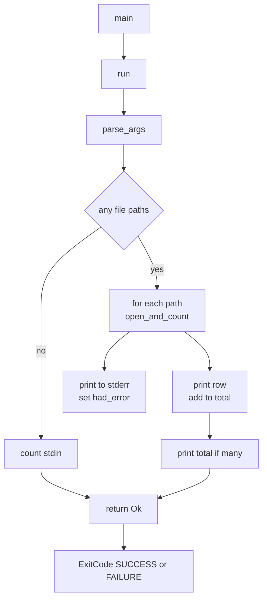
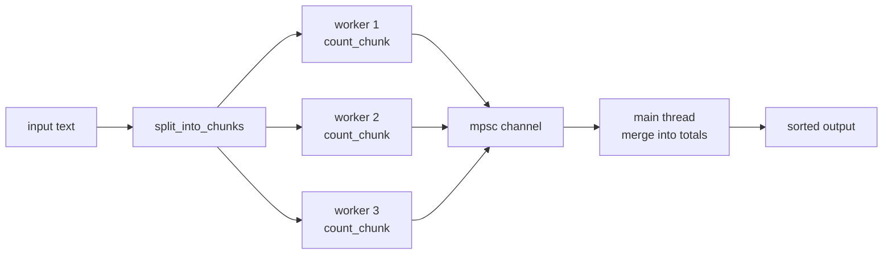

# Chapter 30 — Capstone Projects

> **What you'll learn.** How the pieces of this book fit together in three
> complete, runnable programs: a command-line tool, a multithreaded counter, and
> a small generic data structure with tests. Each project is built up section by
> section, with the full code, how to run it, and the chapters it draws on.

You have learned the parts of Rust one at a time. This chapter puts them to work.
We build three small but complete programs. Each one is the kind of thing a C
programmer writes often: a Unix-style command-line filter, a parallel
data-processing task, and a reusable container.

Every program here uses **only the standard library**, so it builds offline with
no dependencies. You can find the exact same code in this book's `examples/`
folder, which is one Cargo package named `rustbook-examples`. The code in this
chapter and the code in `examples/` are identical and were compiled and tested
together.

> **How to follow along.** Create a package once with `cargo new rustbook-play`
> (Chapter 2 — Installing Rust and the Cargo Toolchain), then paste each project
> into the right file as the text explains. Or open the book's `examples/`
> package and run the binaries directly.

The three projects map onto the package like this:

```
examples/
├── Cargo.toml                 package "rustbook-examples", edition 2024
└── src/
    ├── lib.rs                 Project 3: generic Stack and RPN evaluator + tests
    └── bin/
        ├── linecount.rs       Project 1: a wc-like counter
        └── parallel_count.rs  Project 2: a concurrent word-frequency counter
```

A package can hold one library crate (`src/lib.rs`) and many binary crates (each
file in `src/bin/`). You run a binary with `cargo run --bin <name>` (Chapter 3 —
Program Structure: Crates, Modules, and Visibility). The `Cargo.toml` is tiny
because we use no external crates:

```toml
[package]
name = "rustbook-examples"
version = "0.1.0"
edition = "2024"

[dependencies]
```

---

## Project 1 — `linecount`: a `wc`-like command-line tool

**Goal.** Build a small clone of the Unix `wc` tool. It counts lines, words, and
bytes. It reads the files named on the command line, or standard input when no
files are given. It supports the flags `-l` (lines), `-w` (words), and `-c`
(bytes). With no flag it prints all three, just like `wc`.

This is the classic Unix filter shape every C programmer knows: read input,
process it line by line, write a summary, return a status code. We will write it
the Rust way — with `Result` and `?` for errors, `BufRead` for buffered input,
and explicit `stdout`/`stderr`.

> **C vs Rust.** In C you would loop with `getline` or `fgets`, track counts in
> `long` variables, check every return value by hand, and print to `stdout`
> while sending errors to `stderr`. Rust keeps that exact structure but the
> error checking rides along on the `?` operator, and the buffered reader is a
> generic type instead of a `FILE *`.

### The data: two small structs

We hold the three counts in one struct, and the chosen flags in another. Both
`derive` the traits that make them easy to copy and print (Chapter 15 — Traits).
`Counts` derives `Default` so `Counts::default()` gives an all-zero value, the
same idea as zero-initializing a C struct.

```rust
use std::env;
use std::fs::File;
use std::io::{self, BufRead, BufReader, Write};
use std::process::ExitCode;

/// The three counts we collect for one input.
#[derive(Debug, Default, Clone, Copy)]
struct Counts {
    lines: u64,
    words: u64,
    bytes: u64,
}

impl Counts {
    /// Add another set of counts into this one (used for the total line).
    fn add(&mut self, other: &Counts) {
        self.lines += other.lines;
        self.words += other.words;
        self.bytes += other.bytes;
    }
}

/// Which columns the user asked for.
#[derive(Debug, Clone, Copy)]
struct Flags {
    lines: bool,
    words: bool,
    bytes: bool,
}

impl Flags {
    /// When the user gives no flag at all, show every column.
    fn or_default(self) -> Flags {
        if !self.lines && !self.words && !self.bytes {
            Flags {
                lines: true,
                words: true,
                bytes: true,
            }
        } else {
            self
        }
    }
}
```

`Counts` and `Flags` are `Copy` (Chapter 7 — Ownership and Moves), so passing
them around does not move them; they behave like plain C structs of integers and
booleans. The `add` method takes `&self` as `&mut` and another `&Counts` by
shared reference (Chapter 8 — Borrowing and References) — it changes the totals
in place without taking ownership of the other value.

### The core: counting over any buffered reader

Here is the heart of the program. It is **generic** over the input type: it works
for a file, for standard input, or for anything else that implements `BufRead`
(Chapter 14 — Generics). That is how one function serves both the file case and
the stdin case with no duplication.

```rust
/// Read everything from `reader` and count lines, words, and bytes.
fn count<R: BufRead>(mut reader: R) -> io::Result<Counts> {
    let mut counts = Counts::default();
    let mut line = Vec::new();

    // read_until keeps the trailing '\n', so byte counts match `wc`.
    loop {
        line.clear();
        let n = reader.read_until(b'\n', &mut line)?;
        if n == 0 {
            break; // end of input
        }
        counts.bytes += n as u64;
        if line.ends_with(b"\n") {
            counts.lines += 1;
        }
        // Words are runs of non-whitespace bytes, split on ASCII whitespace.
        let text = String::from_utf8_lossy(&line);
        counts.words += text.split_whitespace().count() as u64;
    }
    Ok(counts)
}
```

A few points a C programmer will appreciate:

- `fn count<R: BufRead>(...)` is the generic. `R` is any type that implements the
  `BufRead` trait — a trait is like a contract, the rough Rust equivalent of a
  struct of function pointers in C (Chapter 15 — Traits). At compile time Rust
  generates a specialized copy of `count` for each concrete `R` it sees. There is
  no dynamic dispatch and no runtime cost.
- `reader.read_until(b'\n', &mut line)?` reads bytes up to and including the next
  newline into `line`. It returns `io::Result<usize>` — the number of bytes read,
  or an error. The `?` says: if this is an error, stop and return it from `count`;
  otherwise unwrap the count (Chapter 13 — Error Handling). This replaces C's
  "check the return value of every read" boilerplate.
- We read into a reusable `Vec<u8>` of raw bytes, not a `String`, so a file that
  is not valid UTF-8 cannot make us fail. `String::from_utf8_lossy` then gives a
  text view for word splitting, replacing any bad bytes (Chapter 10 — Slices and
  Strings).
- `split_whitespace()` yields each run of non-space characters; `.count()`
  reports how many. This is the iterator pipeline doing the work a hand-written
  `for` loop would do in C (Chapter 16 — Collections and Iterators).

> **Watch out.** Counting bytes is not the same as counting characters. We add
> the number of **bytes** read, which matches `wc -c`. A UTF-8 file can have more
> bytes than characters.

### Printing one row

`print_row` writes a single line of output, including only the columns the flags
asked for. It takes `out: &mut impl Write`, so it can write to a locked stdout, a
file, or — in a test — a `Vec<u8>` buffer. `impl Write` is shorthand for "some
type that implements the `Write` trait" (Chapter 15 — Traits).

```rust
/// Print one result row, only the columns the flags asked for.
fn print_row(out: &mut impl Write, c: &Counts, flags: Flags, label: &str) -> io::Result<()> {
    if flags.lines {
        write!(out, "{:>8}", c.lines)?;
    }
    if flags.words {
        write!(out, "{:>8}", c.words)?;
    }
    if flags.bytes {
        write!(out, "{:>8}", c.bytes)?;
    }
    if label.is_empty() {
        writeln!(out)
    } else {
        writeln!(out, " {label}")
    }
}
```

`{:>8}` is a format specifier: right-align in a field eight wide, like
`printf("%8lu")`. `write!`/`writeln!` are the buffered cousins of
`print!`/`println!` that send output to a chosen writer instead of always to
stdout (Chapter 26 — Macros). Each returns `io::Result<()>`, so a broken pipe
surfaces as an error instead of being ignored.

### Parsing the command line

There is no `getopt` in the standard library, so we parse the few flags by hand.
This function turns the raw argument list into a `Flags` value and a list of file
paths. It returns a `Result`: an unknown flag is an error, not a panic.

```rust
/// Parse arguments into flags and the list of file paths.
fn parse_args(args: Vec<String>) -> Result<(Flags, Vec<String>), String> {
    let mut flags = Flags {
        lines: false,
        words: false,
        bytes: false,
    };
    let mut paths = Vec::new();

    for arg in args {
        if arg == "--" {
            continue;
        }
        if arg.starts_with('-') && arg.len() > 1 {
            for ch in arg.chars().skip(1) {
                match ch {
                    'l' => flags.lines = true,
                    'w' => flags.words = true,
                    'c' => flags.bytes = true,
                    other => return Err(format!("unknown flag: -{other}")),
                }
            }
        } else {
            paths.push(arg);
        }
    }
    Ok((flags, paths))
}
```

Note how one argument like `-lw` is handled: we iterate over its characters after
the `-`, so combined short flags work just like in real Unix tools. The `match`
on a character is exhaustive in spirit — the `other` arm catches every unknown
flag and turns it into an error string (Chapter 12 — Enums and Pattern Matching).

> **Rule of thumb.** For anything beyond a handful of flags, reach for the
> [`clap`](https://crates.io/crates/clap) crate. It gives you `--help`, value
> parsing, subcommands, and error messages for free. We hand-roll the parser here
> only to stay standard-library-only and to show the mechanics. Adding `clap`
> would be `cargo add clap` (Chapter 22 — Cargo, Crates, and Workspaces).

### Driving it all: `run` and `main`

Rust convention is to keep `main` tiny and put the real work in a `run` function
that returns a `Result`. `main` then maps that result onto a process exit code.
This keeps the `?` operator usable throughout `run`.

```rust
fn run() -> Result<(), String> {
    let raw: Vec<String> = env::args().skip(1).collect();
    let (flags, paths) = parse_args(raw)?;
    let flags = flags.or_default();

    let stdout = io::stdout();
    let mut out = stdout.lock();

    if paths.is_empty() {
        // No files: read standard input.
        let stdin = io::stdin();
        let counts = count(stdin.lock()).map_err(|e| format!("stdin: {e}"))?;
        print_row(&mut out, &counts, flags, "").map_err(|e| e.to_string())?;
        return Ok(());
    }

    let mut total = Counts::default();
    let mut had_error = false;
    let many = paths.len() > 1;

    for path in &paths {
        match open_and_count(path) {
            Ok(counts) => {
                total.add(&counts);
                print_row(&mut out, &counts, flags, path).map_err(|e| e.to_string())?;
            }
            Err(e) => {
                // Report the error but keep going with the other files.
                eprintln!("linecount: {path}: {e}");
                had_error = true;
            }
        }
    }

    if many {
        print_row(&mut out, &total, flags, "total").map_err(|e| e.to_string())?;
    }

    if had_error {
        Err("one or more files could not be read".to_string())
    } else {
        Ok(())
    }
}

/// Open a file and count it. A helper so `?` can do the error plumbing.
fn open_and_count(path: &str) -> io::Result<Counts> {
    let file = File::open(path)?;
    // BufReader avoids one syscall per byte, like a stdio FILE* buffer in C.
    count(BufReader::new(file))
}

fn main() -> ExitCode {
    match run() {
        Ok(()) => ExitCode::SUCCESS,
        Err(msg) => {
            eprintln!("linecount: {msg}");
            ExitCode::FAILURE
        }
    }
}
```

What to notice:

- `env::args().skip(1).collect()` gathers the command-line arguments into a
  `Vec<String>`, skipping the program name in slot 0 — the same `argv[0]` you
  skip in C (Chapter 16 — Collections and Iterators).
- `io::stdout().lock()` takes the lock on stdout once and holds it for the whole
  run. In C each `printf` re-acquires an internal lock; here we lock once, which
  is both faster and explicit.
- `BufReader::new(file)` wraps the file in a buffer, exactly like a stdio
  `FILE *`. Without it, every byte would be its own system call.
- Errors on one file do **not** abort the whole program. We print the problem to
  stderr with `eprintln!`, set a flag, and keep going — then exit non-zero at the
  end. This is how `wc` behaves too.
- `main` returns `ExitCode`. `ExitCode::SUCCESS` is status 0; `ExitCode::FAILURE`
  is non-zero. This is Rust's replacement for `return 0;` / `return 1;`
  (Chapter 1 — Why Rust for a C Programmer).



### How to run it

Put the code in `src/bin/linecount.rs` and run it with Cargo:

```sh
# count this file
cargo run --bin linecount -- Cargo.toml

# only lines and words, from a pipe
printf 'hello world\nfoo bar baz\n' | cargo run --bin linecount -- -l -w

# several files, with a total row
cargo run --bin linecount -- src/lib.rs src/bin/linecount.rs
```

The `--` separates Cargo's own arguments from your program's arguments.
Example output for the pipe above:

```
       2       5
```

### Chapters and concepts this exercises

- Chapter 3 — Program Structure (binary crates under `src/bin/`).
- Chapter 7 — Ownership and Moves, and Chapter 8 — Borrowing and References
  (`Copy` structs, `&mut self`, shared references).
- Chapter 10 — Slices and Strings (`&str`, `from_utf8_lossy`, `split_whitespace`).
- Chapter 13 — Error Handling (`Result`, `?`, `map_err`, returning from `main`).
- Chapter 14 — Generics and Chapter 15 — Traits (`BufRead`, `impl Write`).
- Chapter 16 — Collections and Iterators (`env::args`, `.collect()`, `.count()`).

### Extend it

- Add a `-m` flag that counts characters (use `text.chars().count()`), and notice
  how it differs from `-c` on a UTF-8 file.
- Add a "longest line length" column, like `wc -L`.
- Swap the hand-rolled parser for `clap` and add `--help`.
- Read files in parallel using the threads from Project 2.

---

## Project 2 — `parallel_count`: a multithreaded word-frequency counter

**Goal.** Count how often each word appears in a body of text, using several
worker threads. We split the text into chunks, count each chunk on its own
thread, and merge the partial results. We use a **bounded** number of workers,
and we **join** every thread, so the program always terminates. The result is
deterministic: the same input always gives the same totals.

This is the "fearless concurrency" promise in action (Chapter 19 — Threads and
Concurrency). The compiler proves at build time that no two threads touch the
same data without synchronization. A data race is not a runtime risk to debug; it
is a compile error you never even reach.

> **C vs Rust.** In C you would use `pthread_create`, pass each thread a pointer
> to its slice, guard the shared map with a `pthread_mutex_t`, and hope you locked
> in all the right places. Forget one lock and you get a race that shows up once a
> month in production. In Rust the type system tracks which data crosses thread
> boundaries (`Send`/`Sync`), and a missing lock is a type error.

We will use two standard-library tools together:

- `std::thread::scope` — scoped threads that are guaranteed to finish before the
  scope ends, so they may safely **borrow** data on the parent's stack. No `Arc`
  and no `'static` requirement (Chapter 19 — Threads and Concurrency).
- `std::sync::mpsc` — a multi-producer, single-consumer **channel**. Each worker
  sends its partial result; the main thread receives and merges them
  (Chapter 20 — Channels and Shared State).

Using a channel means there is **no shared mutable map** at all. Each thread owns
its own map and sends it home. That sidesteps locking entirely — a very common
and clean Rust pattern.

### The input and the per-chunk counter

```rust
use std::collections::HashMap;
use std::sync::mpsc;
use std::thread;

/// Sample input. In a real tool this would come from a file or stdin.
const TEXT: &str = "\
the quick brown fox
the lazy dog
the fox jumps over the lazy dog
brown fox brown dog
the the the quick brown fox";

/// How many worker threads to run. Bounded on purpose.
const WORKERS: usize = 4;

/// Count words in one slice of lines into a fresh map.
fn count_chunk(lines: &[&str]) -> HashMap<String, u64> {
    let mut local = HashMap::new();
    for line in lines {
        for word in line.split_whitespace() {
            *local.entry(word.to_string()).or_insert(0) += 1;
        }
    }
    local
}
```

`count_chunk` takes a slice of string slices (`&[&str]`) and returns a fresh
`HashMap<String, u64>` (Chapter 16 — Collections and Iterators). The
`entry(...).or_insert(0)` pattern is the idiomatic "increment a counter, starting
at zero if absent" — it returns a mutable reference to the value, which we
dereference with `*` to add one. In C you would do a lookup, branch on "not
found," then insert; the `entry` API folds that into one step.

The `const TEXT` is a backslash-continued string literal: the `\` right after the
opening quote removes the first newline, so the text starts at `the quick`.

### Splitting the work

We split the lines into at most `WORKERS` chunks of roughly equal size. Each
chunk is a sub-slice that borrows from the original `lines` vector — no copying of
the text itself.

```rust
/// Split the lines into at most `n` roughly equal chunks.
fn split_into_chunks<'a>(lines: &'a [&'a str], n: usize) -> Vec<&'a [&'a str]> {
    if lines.is_empty() {
        return Vec::new();
    }
    let n = n.min(lines.len()).max(1);
    let chunk_size = lines.len().div_ceil(n);
    lines.chunks(chunk_size).collect()
}
```

The lifetime `'a` says: the chunk slices we return borrow from the same data as
the `lines` slice we were given, so they may not outlive it (Chapter 9 —
Lifetimes). The `slice::chunks(chunk_size)` method is a standard helper that hands
back non-overlapping windows over the slice. `div_ceil` is integer division that
rounds up, so we never leave a leftover line uncounted.

### The parallel core

This is the function that does the threading. Read the comments closely — every
line earns its place.

```rust
/// Run the parallel count and return the merged table.
fn parallel_word_count(text: &str) -> HashMap<String, u64> {
    let lines: Vec<&str> = text.lines().collect();
    let chunks = split_into_chunks(&lines, WORKERS);

    let mut totals: HashMap<String, u64> = HashMap::new();

    // A channel: workers send partial maps, the main thread receives them.
    let (tx, rx) = mpsc::channel::<HashMap<String, u64>>();

    // `scope` guarantees all spawned threads finish before it returns, so the
    // threads may safely borrow `chunks` (no 'static requirement, no Arc).
    thread::scope(|s| {
        for chunk in &chunks {
            let tx = tx.clone();
            let chunk = *chunk; // copy the &[&str] slice handle, not the data
            s.spawn(move || {
                let local = count_chunk(chunk);
                // If the receiver is gone we just drop the result; ignore error.
                let _ = tx.send(local);
            });
        }
        // Drop the original sender so the receiver loop can end once all
        // worker clones are dropped at the end of their threads.
        drop(tx);

        // Merge results as they arrive. The loop ends when every sender is gone.
        for partial in rx {
            for (word, n) in partial {
                *totals.entry(word).or_insert(0) += n;
            }
        }
    });

    totals
}
```

Step by step:

- `mpsc::channel()` creates a sender `tx` and a receiver `rx`. The sender can be
  cloned so many threads can send; the receiver is single (Chapter 20 — Channels
  and Shared State).
- `thread::scope(|s| { ... })` opens a thread scope. Any thread started with
  `s.spawn(...)` is guaranteed to be joined before `scope` returns. That promise
  is what lets the closures **borrow** `chunk`, which points into the `lines`
  vector that lives on this stack frame. Plain `thread::spawn` would require the
  closure to be `'static` and force us to copy or `Arc`-wrap the data.
- `let tx = tx.clone();` makes a per-worker sender. `let chunk = *chunk;` copies
  the small slice handle (a pointer and a length), not the words it points to.
- `move ||` moves the cloned `tx` and the copied `chunk` into the closure
  (Chapter 6 — Functions and Closures). Each worker counts its chunk and sends the
  result. `let _ = tx.send(local);` ignores the send error that would happen only
  if the receiver were already gone.
- `drop(tx)` drops the **original** sender. The receiver's `for partial in rx`
  loop ends only when **all** senders are gone. The worker clones drop when their
  threads finish, but the original would linger to the end of the scope and block
  the loop forever — so we drop it explicitly before draining.
- The `for partial in rx` loop receives each worker's map and folds it into
  `totals`. Because addition is commutative, the order of arrival does not change
  the final counts. That is why the result is deterministic.

> **Watch out.** Forgetting `drop(tx)` is the classic mpsc deadlock: the receiver
> loop waits for a sender that never disappears, and the program hangs. The rule
> of thumb is "every sender must be dropped for the receive loop to end."

There is **no `Mutex` here** because there is no shared mutable state. Each thread
owns its map. This message-passing style — "do not communicate by sharing memory;
share memory by communicating" — is often simpler and safer than locks. The book
also shows the `Arc<Mutex<T>>` shared-state style in Chapter 20; both are valid.



### Printing and `main`

The `main` function runs the count and prints the table. A `HashMap` has no
defined order, so for stable, human-friendly output we sort the rows by count
(highest first) and then by word.

```rust
fn main() {
    let totals = parallel_word_count(TEXT);

    // Sort for stable, human-friendly output: by count desc, then by word.
    let mut rows: Vec<(&String, &u64)> = totals.iter().collect();
    rows.sort_by(|a, b| b.1.cmp(a.1).then(a.0.cmp(b.0)));

    println!("word frequencies ({} unique words):", rows.len());
    for (word, count) in rows {
        println!("{count:>3}  {word}");
    }
}
```

The closure `|a, b| b.1.cmp(a.1).then(a.0.cmp(b.0))` compares two `(word, count)`
pairs. We compare `b`'s count to `a`'s count (note the reversed order, which gives
descending counts), and `.then(...)` adds a tie-breaker by word so equal counts
print in alphabetical order. This deterministic sort is what makes the output —
and our tests — reliable.

### Tests prove it is deterministic and race-free

A binary crate can hold its own tests in a `#[cfg(test)]` module, just like a
library (Chapter 23 — Testing). These tests check the totals, the empty-input
case, and that two runs give identical results.

```rust
#[cfg(test)]
mod tests {
    use super::*;

    #[test]
    fn counts_are_correct_and_deterministic() {
        let totals = parallel_word_count(TEXT);
        assert_eq!(totals["the"], 7);
        assert_eq!(totals["fox"], 4);
        assert_eq!(totals["brown"], 4);
        assert_eq!(totals["dog"], 3);
        assert_eq!(totals["quick"], 2);
        assert_eq!(totals["jumps"], 1);
    }

    #[test]
    fn empty_input_yields_empty_table() {
        let totals = parallel_word_count("");
        assert!(totals.is_empty());
    }

    #[test]
    fn merging_order_does_not_change_totals() {
        // Running twice must give identical results (no data race, no nondeterminism).
        let a = parallel_word_count(TEXT);
        let b = parallel_word_count(TEXT);
        assert_eq!(a, b);
    }
}
```

### How to run it

```sh
cargo run --bin parallel_count
cargo test --bin parallel_count
```

Expected output:

```
word frequencies (8 unique words):
  7  the
  4  brown
  4  fox
  3  dog
  2  lazy
  2  quick
  1  jumps
  1  over
```

### Chapters and concepts this exercises

- Chapter 6 — Functions and Closures (`move` closures, sort comparator).
- Chapter 9 — Lifetimes (the `'a` on `split_into_chunks`).
- Chapter 16 — Collections and Iterators (`HashMap`, `entry`, `chunks`, `collect`).
- Chapter 19 — Threads and Concurrency (`thread::scope`, `Send`/`Sync`, joining).
- Chapter 20 — Channels and Shared State (`mpsc::channel`, sender/receiver).
- Chapter 23 — Testing (`#[cfg(test)]`, `#[test]`).

### Extend it

- Read the text from a file named on the command line, reusing Project 1's
  `BufReader` approach.
- Replace the channel with an `Arc<Mutex<HashMap<String, u64>>>` shared map and
  compare the two styles (Chapter 20 — Channels and Shared State).
- Make a configurable `WORKERS` count and measure speed on a large input with
  `cargo build --release`.
- Lowercase words and strip punctuation so `Fox` and `fox.` count as `fox`.

---

## Project 3 — `Stack<T>` and an RPN evaluator: a generic library with tests

**Goal.** Build a reusable, generic stack — a `Stack<T>` that works for any
element type — and use it to write a small reverse-polish-notation (RPN)
calculator. This project lives in the **library crate** (`src/lib.rs`) and ships
with both `#[test]` unit tests and a **documentation test** (an example in a
`///` comment that Cargo compiles and runs).

RPN, also called postfix, writes the operator after its operands: `2 3 +` means
`2 + 3`. It is the natural job for a stack: push numbers, and when you see an
operator, pop two numbers, combine them, and push the result.

> **C vs Rust.** A generic container in C means either macros that paste code for
> each type, or a `void *` stack plus element size and a lot of casting that the
> compiler cannot check. Rust generics are real, type-checked, and
> **monomorphized**: the compiler stamps out a specialized `Stack<i64>`,
> `Stack<String>`, and so on, each as fast as hand-written code, with full type
> safety (Chapter 14 — Generics).

### The crate documentation and a doc test

A `//!` comment at the top of `lib.rs` documents the whole crate. The fenced
code block inside it is a **doc test**: `cargo test` compiles and runs it, so the
example in the docs can never drift out of date (Chapter 23 — Testing).

```rust
//! Project 3: a small generic data structure with tests.
//!
//! This crate gives a generic `Stack<T>` and, on top of it, a tiny
//! reverse-polish-notation (RPN) calculator. It exercises generics, traits,
//! `Option`, and `Result`, and it ships with both `#[test]` unit tests and a
//! documentation test (the example on `Stack` below is compiled and run).
//!
//! ```
//! use rustbook_examples::Stack;
//!
//! let mut s: Stack<i32> = Stack::new();
//! s.push(10);
//! s.push(20);
//! assert_eq!(s.len(), 2);
//! assert_eq!(s.peek(), Some(&20));
//! assert_eq!(s.pop(), Some(20));
//! assert_eq!(s.pop(), Some(10));
//! assert_eq!(s.pop(), None);
//! assert!(s.is_empty());
//! ```

use std::fmt;
```

### The generic `Stack<T>`

The stack is a thin, safe wrapper around a `Vec<T>`. A `Vec<T>` is already a
growable heap array that knows its length and capacity — like a `malloc`'d array
plus a length you maintain by hand, but automatic (Chapter 16 — Collections and
Iterators). We add the stack vocabulary on top: `push`, `pop`, `peek`.

```rust
/// A growable last-in, first-out stack of `T`, backed by a `Vec<T>`.
///
/// This is generic over any element type, the same way a C version would use
/// `void *` plus a size — but here the type is checked at compile time and the
/// code is monomorphized, so there is no runtime cost.
#[derive(Debug, Clone, PartialEq, Eq)]
pub struct Stack<T> {
    items: Vec<T>,
}

impl<T> Stack<T> {
    /// Create an empty stack.
    pub fn new() -> Self {
        Stack { items: Vec::new() }
    }

    /// Create an empty stack with room for `cap` items before reallocating.
    pub fn with_capacity(cap: usize) -> Self {
        Stack {
            items: Vec::with_capacity(cap),
        }
    }

    /// Push a value onto the top.
    pub fn push(&mut self, value: T) {
        self.items.push(value);
    }

    /// Remove and return the top value, or `None` if the stack is empty.
    pub fn pop(&mut self) -> Option<T> {
        self.items.pop()
    }

    /// Look at the top value without removing it.
    pub fn peek(&self) -> Option<&T> {
        self.items.last()
    }

    /// Number of items on the stack.
    pub fn len(&self) -> usize {
        self.items.len()
    }

    /// True when the stack has no items.
    pub fn is_empty(&self) -> bool {
        self.items.is_empty()
    }
}
```

Key ideas for a C programmer:

- `Stack<T>` declares one type parameter `T`. `impl<T> Stack<T>` then provides
  methods for every `T`. The `items` field is **private** (no `pub`), so callers
  cannot poke at the inner vector and break the stack's invariants (Chapter 3 —
  Program Structure). They must go through the methods.
- `pop` returns `Option<T>`: `Some(value)` if there was one, or `None` if the
  stack was empty. There is no null and no sentinel value to forget to check
  (Chapter 12 — Enums and Pattern Matching). The caller must handle the empty
  case; the compiler enforces it.
- `peek` returns `Option<&T>` — a **borrow** of the top item, not a copy. The
  value stays on the stack (Chapter 8 — Borrowing and References).
- `#[derive(Debug, Clone, PartialEq, Eq)]` gives the stack printing, cloning, and
  equality for free, as long as `T` supports them. This is how the unit tests can
  compare two stacks with `assert_eq!` (Chapter 15 — Traits).

### Two standard traits: `Default` and `FromIterator`

Implementing well-known traits makes a type feel native. `Default` lets
`Stack::default()` produce an empty stack and fits APIs that ask for a default.
`FromIterator` lets any iterator build a stack with `.collect()` — the same way
you can `.collect()` into a `Vec` or a `HashMap` (Chapter 15 — Traits,
Chapter 16 — Collections and Iterators).

```rust
// A common Rust idiom: implement `Default` so `Stack::default()` works and so
// the type fits APIs that need a default value.
impl<T> Default for Stack<T> {
    fn default() -> Self {
        Stack::new()
    }
}

// Let any iterator of `T` build a stack with `.collect()`.
impl<T> FromIterator<T> for Stack<T> {
    fn from_iter<I: IntoIterator<Item = T>>(iter: I) -> Self {
        Stack {
            items: iter.into_iter().collect(),
        }
    }
}
```

> **Rule of thumb.** When you write a collection type, implement `Default`,
> `Debug`, and (where it makes sense) `FromIterator` and `IntoIterator`. It makes
> your type behave like the standard ones, so other code "just works" with it.

### A typed error and the `Error` trait

The evaluator can fail in a few specific ways. We model them with an `enum`, the
Rust replacement for an error-code `#define` list — except each variant can carry
data, and a `match` on it is exhaustive (Chapter 12 — Enums and Pattern
Matching). We implement `Display` so the error prints a clean message, and the
empty `Error` impl marks it as a real error type usable with `Box<dyn Error>` and
the `?` operator (Chapter 13 — Error Handling).

```rust
/// The reason an RPN expression could not be evaluated.
#[derive(Debug, Clone, PartialEq, Eq)]
pub enum RpnError {
    /// A token was neither a number nor a known operator.
    BadToken(String),
    /// An operator ran but the stack did not have two operands.
    NotEnoughOperands,
    /// Division (or remainder) by zero.
    DivideByZero,
    /// The expression finished with more or fewer than one value left.
    LeftoverOperands(usize),
}

// Implementing `Display` makes `RpnError` print nicely and (with the blanket
// impl in std) usable as a boxed error. This is the trait-driven error style.
impl fmt::Display for RpnError {
    fn fmt(&self, f: &mut fmt::Formatter<'_>) -> fmt::Result {
        match self {
            RpnError::BadToken(t) => write!(f, "bad token: {t}"),
            RpnError::NotEnoughOperands => write!(f, "not enough operands"),
            RpnError::DivideByZero => write!(f, "divide by zero"),
            RpnError::LeftoverOperands(n) => {
                write!(f, "expression left {n} values on the stack")
            }
        }
    }
}

impl std::error::Error for RpnError {}
```

### The evaluator

Now the calculator itself. It uses our `Stack<i64>`, returns a `Result`, and
leans on `?` and `ok_or` to turn missing operands into errors instead of panics.

```rust
/// Evaluate a reverse-polish-notation expression of `i64` integers.
///
/// Supported operators: `+`, `-`, `*`, `/`, `%`. Tokens are separated by
/// whitespace. Returns the single result or an [`RpnError`].
///
/// ```
/// use rustbook_examples::eval_rpn;
///
/// assert_eq!(eval_rpn("2 3 +"), Ok(5));
/// assert_eq!(eval_rpn("4 2 - 3 *"), Ok(6)); // (4 - 2) * 3
/// assert!(eval_rpn("1 0 /").is_err());
/// ```
pub fn eval_rpn(expr: &str) -> Result<i64, RpnError> {
    let mut stack: Stack<i64> = Stack::new();

    for token in expr.split_whitespace() {
        if let Ok(n) = token.parse::<i64>() {
            stack.push(n);
            continue;
        }

        // An operator: pop the two operands (note the order: b is on top).
        let b = stack.pop().ok_or(RpnError::NotEnoughOperands)?;
        let a = stack.pop().ok_or(RpnError::NotEnoughOperands)?;

        let result = match token {
            "+" => a + b,
            "-" => a - b,
            "*" => a * b,
            "/" => {
                if b == 0 {
                    return Err(RpnError::DivideByZero);
                }
                a / b
            }
            "%" => {
                if b == 0 {
                    return Err(RpnError::DivideByZero);
                }
                a % b
            }
            other => return Err(RpnError::BadToken(other.to_string())),
        };
        stack.push(result);
    }

    match stack.len() {
        1 => Ok(stack.pop().unwrap()),
        n => Err(RpnError::LeftoverOperands(n)),
    }
}
```

How it works:

- `expr.split_whitespace()` yields each token. `token.parse::<i64>()` tries to
  read it as an integer; `if let Ok(n) = ...` pushes it when it parses
  (Chapter 12 — Enums and Pattern Matching). Otherwise the token is an operator.
- `stack.pop().ok_or(RpnError::NotEnoughOperands)?` is the key line.
  `pop` gives an `Option<i64>`; `ok_or(err)` turns `None` into `Err(err)` and
  `Some(v)` into `Ok(v)`; the `?` then unwraps `Ok` or returns the error from
  `eval_rpn` (Chapter 13 — Error Handling). This is the bridge from "missing
  value" to "real error."
- Order matters: the value popped first (`b`) was pushed last, so it is the
  right-hand operand. `4 2 -` must compute `4 - 2`, not `2 - 4`.
- Division and remainder check for a zero divisor and return `DivideByZero`. In C,
  integer divide-by-zero is undefined behavior; here it is a value you handle.
- At the end, a valid expression leaves exactly one value. Anything else is a
  `LeftoverOperands` error. `stack.pop().unwrap()` is safe in the `1` arm because
  we just checked the length is one.

### Unit tests

The `#[cfg(test)] mod tests` block holds the unit tests. They cover the stack for
several element types (proving the generic really is generic), the `collect`
path, the happy RPN cases, every error case, and the `Display` text (Chapter 23 —
Testing).

```rust
#[cfg(test)]
mod tests {
    use super::*;

    #[test]
    fn push_pop_peek() {
        let mut s = Stack::new();
        assert!(s.is_empty());
        s.push("a");
        s.push("b");
        assert_eq!(s.peek(), Some(&"b"));
        assert_eq!(s.len(), 2);
        assert_eq!(s.pop(), Some("b"));
        assert_eq!(s.pop(), Some("a"));
        assert_eq!(s.pop(), None);
    }

    #[test]
    fn works_for_different_types() {
        // The same generic code handles i32 and String with no extra work.
        let mut ints: Stack<i32> = Stack::new();
        ints.push(1);
        ints.push(2);
        assert_eq!(ints.pop(), Some(2));

        let mut words: Stack<String> = Stack::new();
        words.push("hello".to_string());
        assert_eq!(words.peek().map(|s| s.as_str()), Some("hello"));
    }

    #[test]
    fn collect_into_stack() {
        let s: Stack<i32> = (1..=3).collect();
        assert_eq!(s.len(), 3);
        assert_eq!(s.peek(), Some(&3));
    }

    #[test]
    fn rpn_basic() {
        assert_eq!(eval_rpn("2 3 +"), Ok(5));
        assert_eq!(eval_rpn("10 2 /"), Ok(5));
        assert_eq!(eval_rpn("7 3 %"), Ok(1));
        assert_eq!(eval_rpn("2 3 4 * +"), Ok(14));
    }

    #[test]
    fn rpn_errors() {
        assert_eq!(eval_rpn("1 +"), Err(RpnError::NotEnoughOperands));
        assert_eq!(eval_rpn("1 2"), Err(RpnError::LeftoverOperands(2)));
        assert_eq!(eval_rpn("1 0 /"), Err(RpnError::DivideByZero));
        assert_eq!(
            eval_rpn("1 2 foo"),
            Err(RpnError::BadToken("foo".to_string()))
        );
    }

    #[test]
    fn rpn_error_displays() {
        let msg = eval_rpn("1 0 /").unwrap_err().to_string();
        assert_eq!(msg, "divide by zero");
    }
}
```

`use super::*;` pulls every item from the parent module (the crate root) into the
test module, so the tests can name `Stack`, `eval_rpn`, and `RpnError` directly.
This glob import is the one place glob imports are encouraged (Chapter 3 —
Program Structure).

### How to run it

```sh
cargo test --lib        # runs the unit tests
cargo test --doc        # runs the documentation tests
cargo test              # runs everything: unit, doc, and the binaries' tests
cargo doc --open        # builds the HTML docs; the examples appear there
```

`cargo test` prints a section for the unit tests and a separate "Doc-tests"
section. Seeing both pass is the proof that your examples are correct, not just
your code.

### Chapters and concepts this exercises

- Chapter 3 — Program Structure (a library crate, private fields, `use super::*`).
- Chapter 8 — Borrowing and References (`peek` returns `Option<&T>`).
- Chapter 12 — Enums and Pattern Matching (`Option`, the `RpnError` enum, `match`).
- Chapter 13 — Error Handling (`Result`, `?`, `ok_or`, the `Error` trait).
- Chapter 14 — Generics (`Stack<T>`, monomorphization).
- Chapter 15 — Traits (`derive`, `Display`, `Default`, `FromIterator`).
- Chapter 23 — Testing (unit tests and documentation tests).

### Extend it

- Add floating-point support by making the evaluator generic over a numeric
  trait, or by switching to `f64`.
- Add a `IntoIterator` impl so you can write `for x in stack`.
- Turn `Stack<T>` into a bounded stack with a maximum size that returns an error
  on overflow.
- Build a tiny REPL: read a line from stdin (Project 1's technique), evaluate it,
  print the result or the error, and loop.

---

## Key takeaways

- A single Cargo package can hold one library crate (`src/lib.rs`) and many
  binary crates (`src/bin/*.rs`); run them with `cargo run --bin <name>`.
- **Project 1** shows the Unix-filter shape in Rust: read with `BufRead`, count
  generically over any reader, propagate errors with `Result` and `?`, write to
  locked stdout, report problems on stderr, and return an `ExitCode`.
- **Project 2** shows fearless concurrency: `thread::scope` lets worker threads
  borrow stack data safely, and an `mpsc` channel merges per-thread results with
  no shared mutable state — so there is no lock and no possible data race.
- **Project 3** shows a clean generic API: `Stack<T>` wraps a `Vec<T>`, returns
  `Option`/`Result` instead of nulls and sentinels, implements standard traits,
  and is covered by both unit tests and a documentation test.
- Across all three, the same Rust habits repeat: keep `main` thin, make illegal
  states hard to reach, prefer borrowing to copying, and let the compiler prove
  safety before the program runs.

## Watch out (gotchas for C programmers)

- **`cargo run --bin name -- args`**: the `--` separates Cargo's arguments from
  your program's. Forgetting it makes Cargo eat your flags.
- **Byte count is not character count.** `wc -c` and our `-c` count bytes; a UTF-8
  file has more bytes than characters.
- **mpsc deadlock.** A receive loop ends only when every sender is dropped. Keep a
  stray `tx` alive and the program hangs. Drop the original sender before
  draining.
- **`thread::scope` vs `thread::spawn`.** Scoped threads can borrow local data and
  are auto-joined; plain `spawn` needs `'static` data and a manual `join`.
- **Struct fields are private by default**, even in a `pub struct`. `Stack`'s
  inner `Vec` is hidden on purpose so callers cannot break its invariants.
- **`pop` returns `Option`, not a value.** There is no sentinel like `-1` or
  `NULL`; you must handle the empty case, and the compiler makes sure you do.

## Interview questions

**Q: Why split a CLI program into a `run` function and a thin `main`?**
A: `run` returns a `Result`, so you can use the `?` operator throughout for clean
error propagation. `main` then maps that `Result` onto a process exit code
(`ExitCode::SUCCESS`/`FAILURE`) and prints any error to stderr. This separation
also makes the logic testable without spawning a process.

**Q: In the multithreaded counter, why is there no `Mutex`?**
A: Because there is no shared mutable state. Each worker thread owns its own
`HashMap` and sends it back through an `mpsc` channel; the main thread is the only
one that writes the merged totals. Message passing replaces locking, which removes
both the locking overhead and the chance of a deadlock or a forgotten lock.

**Q: What does `thread::scope` give you that `thread::spawn` does not?**
A: Scoped threads are guaranteed to finish before the scope returns, so the
compiler lets their closures borrow data from the parent stack frame without a
`'static` lifetime and without `Arc`. With plain `thread::spawn`, the closure must
own or `Arc`-wrap everything it touches, and you must join the handles yourself.

**Q: How does a generic `Stack<T>` in Rust differ from a `void *` stack in C?**
A: A `void *` stack erases the element type, so the compiler cannot check what you
push or pop, and you store an element size and cast by hand. A Rust `Stack<T>` is
type-checked and monomorphized: the compiler generates a specialized version for
each concrete type, so it is type-safe and as fast as hand-written code, with no
casts and no separate size field.

**Q: What is a documentation test and why is it useful?**
A: It is a code example inside a `///` or `//!` doc comment that `cargo test`
compiles and runs. It keeps documentation honest — if the example stops compiling
or its assertions fail, the test fails — so the examples in your docs can never
silently drift out of sync with the code.

## Try it

1. Run all three projects from the book's `examples/` package: `cargo run --bin
   linecount -- Cargo.toml`, `cargo run --bin parallel_count`, and `cargo test`.
2. Break Project 2 on purpose by deleting the `drop(tx)` line and run it. Watch it
   hang, then restore the line and confirm it finishes.
3. Add one new operator (for example `**` for power) to the RPN evaluator and a
   matching unit test, then run `cargo test --lib`.
